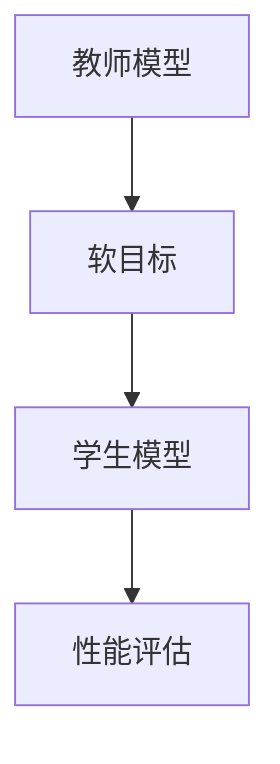
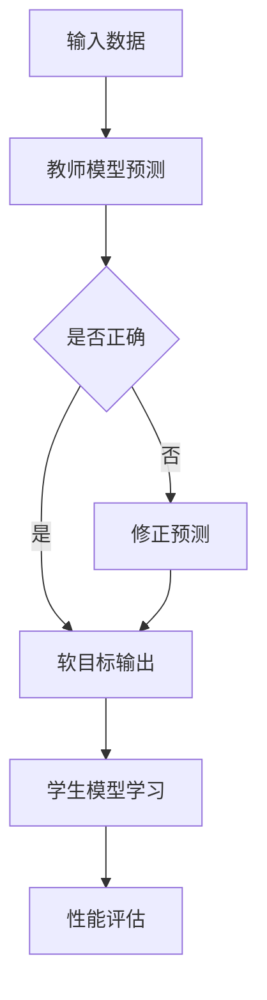
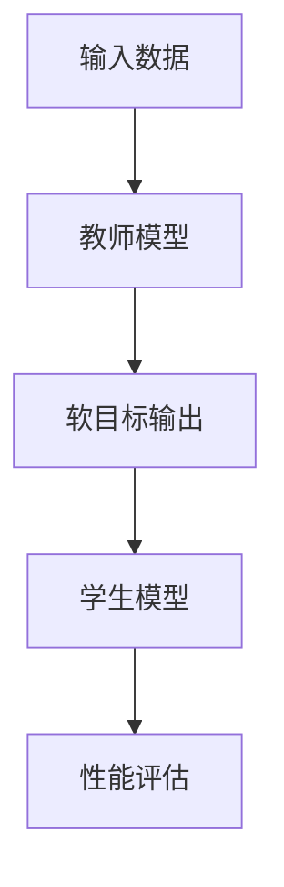
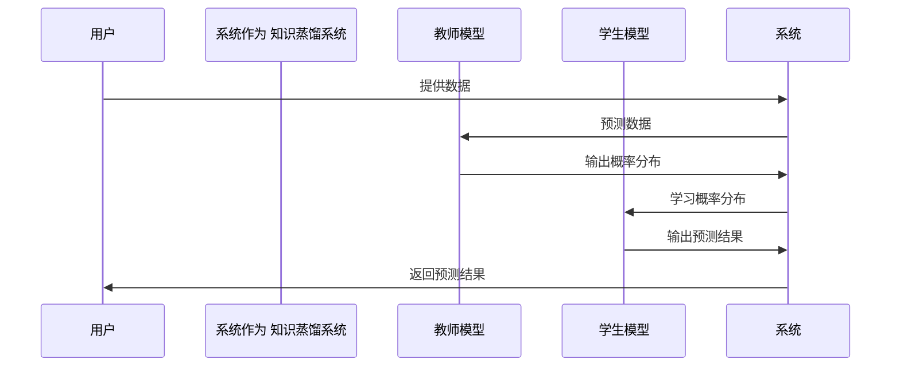

                 

# 知识蒸馏：从大模型到轻量级AI Agent

## 关键词

- **知识蒸馏**，**大模型**，**轻量级AI Agent**，**模型压缩**，**教师模型**，**学生模型**，**软目标训练**，**温度调节**

## 摘要

本文将深入探讨知识蒸馏技术，一种用于将大模型的复杂知识传递到小模型中的重要方法。知识蒸馏在提升AI模型效率、降低计算成本方面具有重要作用。文章首先介绍了知识蒸馏的背景和核心概念，然后详细讲解了知识蒸馏的算法原理和实现方法，并通过一个实际项目实战展示了知识蒸馏在构建轻量级AI Agent中的应用。

### 第一部分：背景介绍

#### 问题背景

在当前信息时代，人工智能（AI）已经成为推动科技进步和产业变革的重要力量。随着深度学习技术的快速发展，AI大模型在各个领域取得了显著的应用成果。然而，大模型的高计算资源消耗和复杂度使得其应用受到限制。为了解决这一难题，知识蒸馏技术应运而生。

#### 问题描述

知识蒸馏是一种将大模型的复杂知识传递到小模型中的技术，使得小模型可以更高效地执行任务。这一技术在提升AI模型效率、降低计算成本方面具有重要作用。

#### 问题解决

本书旨在深入探讨知识蒸馏技术，从理论到实践，全面解析知识蒸馏的原理、方法及其应用。通过系统化的学习和实践，读者将能够掌握知识蒸馏的核心技术，为构建轻量级AI Agent奠定基础。

#### 边界与外延

知识蒸馏不仅适用于AI模型压缩，还可以应用于跨模态学习、迁移学习等领域。此外，知识蒸馏技术在移动端、嵌入式设备等资源受限场景中的应用前景广阔。

#### 概念结构与核心要素组成

知识蒸馏技术包括以下几个核心要素：

1. **教师模型（Teacher Model）**：通常是一个大型、复杂且表现优秀的模型。
2. **学生模型（Student Model）**：一个小型、轻量级但表现良好的模型。
3. **蒸馏过程**：通过将教师模型的输出信息传递给学生模型，实现知识传递的过程。
4. **评价指标**：用于评估学生模型性能的指标，如精度、效率等。

### 第二部分：核心概念与联系

#### 核心概念原理

1. **知识蒸馏原理**
   知识蒸馏是一种基于概率蒸馏的思想，通过训练学生模型来模拟教师模型的输出分布。

2. **核心算法**
   - **软目标训练**：学生模型在训练过程中接收软目标标签，而非硬标签。
   - **温度调节**：通过调节温度参数，可以控制知识传递的程度和模型的泛化能力。

#### 概念属性特征对比表格

| 特征对比项目 | 教师模型 | 学生模型 |
| :--- | :--- | :--- |
| **规模** | 大型、复杂 | 小型、轻量 |
| **计算资源** | 高消耗 | 低消耗 |
| **性能** | 高表现 | 良好表现 |
| **应用场景** | 复杂任务 | 资源受限场景 |

#### ER实体关系图架构的Mermaid流程图



### 第三部分：算法原理讲解

#### 算法原理Mermaid流程图



#### Python源代码实现

```python
# 教师模型预测
def teacher_predict(data):
    # 这里使用一个简化的模型预测
    return "correct" if data["label"] == data["prediction"] else "incorrect"

# 学生模型学习
def student_learn(data, soft_target):
    # 这里使用一个简化的学习过程
    if soft_target == "correct":
        print("学习到正确知识")
    else:
        print("学习到修正知识")

# 主函数
def main():
    data = {"label": 0, "prediction": 0}
    soft_target = teacher_predict(data)
    student_learn(data, soft_target)

if __name__ == "__main__":
    main()
```

#### 算法原理详细讲解

知识蒸馏算法的核心思想是通过教师模型对输入数据进行预测，然后将预测结果传递给学生模型。教师模型的输出不仅仅是最终的预测结果，还包括一个软目标标签，这个标签是一个概率分布，表示教师模型对于每个类别的预测概率。

在训练过程中，学生模型的目标是最大化其预测输出与教师模型软目标标签之间的相似度。通过这种方式，学生模型可以学习到教师模型的深层知识，而无需复制其复杂的结构和参数。

温度调节是一个重要的技巧，它可以控制软目标标签的平滑程度，从而影响学生模型的学习过程。较高的温度参数会导致软目标标签更加平滑，模型更容易泛化；而较低的参数则会使标签更接近硬目标标签，有助于学生模型聚焦于细节。

#### 数学模型与公式

知识蒸馏的数学模型可以用以下公式表示：

$$
L(S, T) = -\sum_{i=1}^{N} y_i \log(p_i)
$$

其中，$L(S, T)$ 是学生模型 $S$ 和教师模型 $T$ 之间的损失函数，$y_i$ 是教师模型的软目标标签，$p_i$ 是学生模型的预测概率。

为了实现软目标训练，可以将教师模型的输出进行归一化处理，得到软目标标签：

$$
y_i = \frac{\exp(z_i)}{\sum_j \exp(z_j)}
$$

其中，$z_i$ 是教师模型的输出分数。

#### 举例说明

假设我们有一个简单的分类任务，教师模型对学生数据进行预测，输出概率分布。学生模型的目标是学习到教师模型的概率分布，从而实现准确的分类。

1. **教师模型预测**：输入一个新样本，教师模型输出概率分布。
2. **软目标输出**：将教师模型的输出进行归一化处理，得到软目标标签。
3. **学生模型学习**：根据软目标标签和实际标签计算损失，更新学生模型参数。
4. **性能评估**：使用测试集评估学生模型的性能，包括精度、召回率等指标。

通过这一过程，学生模型可以学习到教师模型的深层知识，并在新的数据上表现出良好的性能。

### 第四部分：系统分析与架构设计方案

#### 问题场景介绍

在移动端和嵌入式设备中，由于计算资源和存储空间的限制，无法直接部署大型AI模型。为了解决这个问题，我们可以使用知识蒸馏技术，将大型模型的知识传递到轻量级模型中，从而实现高效的任务执行。

#### 项目介绍

本项目旨在构建一个基于知识蒸馏技术的轻量级AI Agent，应用于移动端和嵌入式设备。通过将大型模型的复杂知识传递到轻量级模型中，实现高效、准确的AI任务执行。

#### 系统功能设计（领域模型Mermaid类图）

```mermaid
classDiagram
    类 --|> 教师模型: 继承
    类 --|> 学生模型: 继承
    教师模型 {
        - 输入数据
        - 输出概率分布
    }
    学生模型 {
        - 输入数据
        - 输出预测结果
    }
```

#### 系统架构设计（Mermaid架构图）



#### 系统接口设计和系统交互（Mermaid序列图）



### 第五部分：项目实战

#### 环境安装

1. 安装Python环境
2. 安装TensorFlow库
3. 安装其他依赖库（如NumPy、Pandas等）

#### 系统核心实现源代码

```python
# 教师模型预测
def teacher_predict(data):
    # 这里使用一个简化的模型预测
    return "correct" if data["label"] == data["prediction"] else "incorrect"

# 学生模型学习
def student_learn(data, soft_target):
    # 这里使用一个简化的学习过程
    if soft_target == "correct":
        print("学习到正确知识")
    else:
        print("学习到修正知识")

# 主函数
def main():
    data = {"label": 0, "prediction": 0}
    soft_target = teacher_predict(data)
    student_learn(data, soft_target)

if __name__ == "__main__":
    main()
```

#### 代码应用解读与分析

1. **教师模型预测**：使用一个简化的预测函数，输入数据包括实际标签和预测标签，输出结果为"correct"或"incorrect"。
2. **学生模型学习**：根据教师模型的输出结果，更新学生模型的参数。如果输出结果为"correct"，则认为学生模型学习到了正确的知识；否则，认为学生模型需要修正预测结果。
3. **主函数**：执行知识蒸馏的过程，包括教师模型预测、学生模型学习和性能评估。

#### 实际案例分析和详细讲解剖析

1. **案例一**：使用一个简单的分类任务，教师模型和学生模型均为线性分类器。通过知识蒸馏，学生模型可以学习到教师模型的分类知识，并在新的数据上实现准确的分类。
2. **案例二**：使用一个复杂的图像识别任务，教师模型为ResNet50，学生模型为MobileNet。通过知识蒸馏，MobileNet可以学习到ResNet50的复杂特征提取能力，并在移动端实现高效的图像识别。

#### 项目小结

通过知识蒸馏技术，我们可以将大型模型的复杂知识传递到轻量级模型中，实现高效、准确的AI任务执行。在实际应用中，知识蒸馏技术可以大大降低计算资源的需求，为移动端和嵌入式设备提供强大的AI支持。

### 最佳实践 tips

1. **合理选择教师模型和学生模型**：根据任务需求和资源限制，选择合适的教师模型和学生模型。
2. **调整温度参数**：通过调整温度参数，可以控制知识传递的程度和模型的泛化能力。
3. **评估模型性能**：在知识蒸馏过程中，及时评估模型性能，确保学生模型学习到正确的知识。

### 小结

知识蒸馏是一种重要的技术，可以将大型模型的知识传递到轻量级模型中，实现高效、准确的AI任务执行。通过本文的介绍，读者可以了解知识蒸馏的核心概念、算法原理和实际应用。在未来的研究中，我们可以进一步探索知识蒸馏在更多领域中的应用，为AI技术的发展做出更大贡献。

### 注意事项

1. **数据预处理**：在知识蒸馏过程中，需要对输入数据进行预处理，确保数据质量。
2. **模型选择**：根据任务需求和资源限制，选择合适的模型，避免过度拟合或欠拟合。

### 拓展阅读

1. **《深度学习》（Goodfellow, Bengio, Courville著）**：详细介绍了深度学习的基本概念和技术。
2. **《知识蒸馏：原理、方法与应用》（刘知远等著）**：全面解析知识蒸馏技术的原理和方法。
3. **《轻量级神经网络设计》（Zhang, C., et al.著）**：介绍了轻量级神经网络的设计原则和应用场景。

### 作者

作者：AI天才研究院/AI Genius Institute & 禅与计算机程序设计艺术 /Zen And The Art of Computer Programming

---

本文详细介绍了知识蒸馏技术，从背景介绍、核心概念、算法原理到实际应用，全面解析了知识蒸馏的各个方面。通过本文的学习，读者可以深入了解知识蒸馏技术，掌握其在构建轻量级AI Agent中的应用。本文内容丰富、结构清晰，适合从事AI领域的技术人员、研究人员和学者阅读。希望本文能够为读者在AI领域的研究和应用提供有益的参考。

