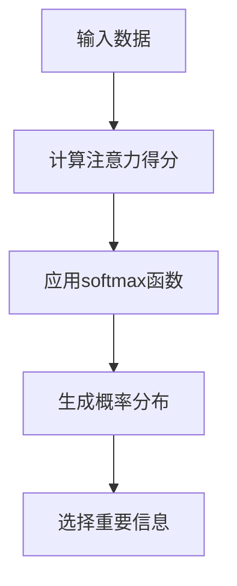
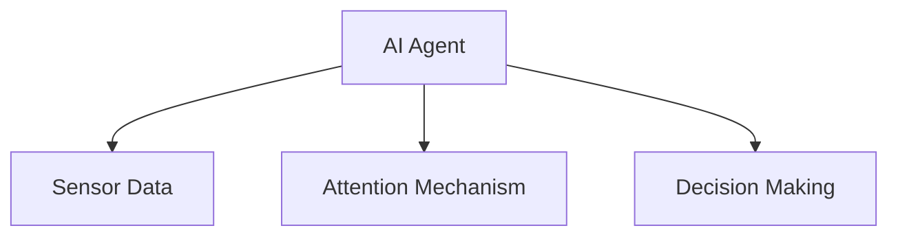
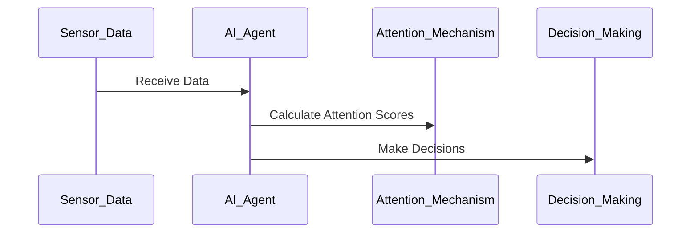

                 


# 神经科学启发的注意力机制在AI Agent中的应用

> 关键词：神经科学，注意力机制，AI Agent，神经启发，算法，应用

> 摘要：本文深入探讨了神经科学启发的注意力机制在AI Agent中的应用。首先，我们介绍了神经科学和AI Agent的基本概念和背景。然后，详细解析了注意力机制的核心原理和不同类型的注意力机制。接着，我们重点讨论了神经科学中注意力机制的启发，如何将这些机制应用到AI Agent中。文章还探讨了这些机制在实际应用中的挑战和未来发展方向。最后，总结了文章的主要发现，并提出了一些实践指南和未来研究方向。

## 引言

神经科学和人工智能（AI）是两个看似截然不同的领域，但在近年来的研究中，它们的交集逐渐扩大。神经科学专注于研究人脑及其功能，而人工智能则是模拟和扩展人类智能的技术。近年来，随着深度学习和神经网络在AI领域的成功应用，人们开始思考如何将神经科学中的注意力机制引入到AI Agent中，以提升其智能表现。

注意力机制是神经科学中的一个核心概念，它涉及大脑如何选择和处理信息。在AI领域，注意力机制也被广泛应用于自然语言处理、计算机视觉和强化学习等领域。本文将详细介绍神经科学中的注意力机制，探讨其在AI Agent中的应用，以及面临的挑战和未来发展方向。

## 神经科学和AI Agent的基本概念

### 神经科学

神经科学是一门研究神经系统结构和功能的科学。它涉及到神经元、神经网络、神经传递物质、神经可塑性和大脑功能等多个方面。神经元是神经系统的基本单位，通过电信号传递信息。神经网络是由大量神经元组成的复杂网络，通过连接和交互实现信息处理和功能。

神经可塑性是指神经系统在结构和功能上的可塑性。它涉及到神经元之间的连接（突触）和神经活动的变化，是大脑学习和记忆的基础。神经传递物质是神经元之间传递信息的化学物质，它们在神经系统中起着关键作用。

### AI Agent

AI Agent是指能够自主执行任务、与环境交互并做出决策的计算机程序。AI Agent通常基于某种智能模型，如神经网络、决策树、决策变量等。它们可以在各种环境中应用，包括游戏、机器人、自动驾驶和智能推荐系统等。

AI Agent的核心特征包括自主性、适应性、学习能力、感知能力和行动能力。自主性是指AI Agent可以独立执行任务，而不需要人类干预。适应性是指AI Agent可以根据环境变化调整其行为。学习能力是指AI Agent可以通过经验改进其行为。感知能力是指AI Agent可以感知和理解环境信息。行动能力是指AI Agent可以采取行动以实现其目标。

## 核心概念与联系

### 核心概念

注意力机制（Attention Mechanism）是大脑处理信息的关键过程。它涉及选择和聚焦重要信息，同时忽略无关信息。注意力机制可以分为视觉注意力、听觉注意力、感觉运动注意力等类型。

- **视觉注意力**：视觉注意力是指大脑在处理视觉信息时选择关注特定对象或区域。视觉注意力有助于识别重要信息，如道路标志、危险障碍物等。
- **听觉注意力**：听觉注意力是指大脑在处理听觉信息时选择关注特定声音。听觉注意力有助于识别重要声音，如紧急警报、电话铃声等。
- **感觉运动注意力**：感觉运动注意力是指大脑在处理感觉和运动信息时选择关注特定刺激。感觉运动注意力有助于执行复杂任务，如驾驶、演奏乐器等。

### 联系

神经科学和AI Agent之间的联系主要体现在以下几个方面：

1. **神经网络**：神经网络是AI Agent的核心组成部分，其结构和功能受到神经科学启发。神经科学的研究成果，如神经元和神经网络的工作原理，为设计更有效的神经网络提供了理论基础。

2. **神经可塑性**：神经可塑性是大脑学习和记忆的关键机制。AI Agent可以通过神经可塑性不断调整其行为和决策，从而提高其智能表现。

3. **感知能力**：AI Agent的感知能力受到神经科学中的感知理论启发。通过模拟神经系统的感知机制，AI Agent可以更好地理解和处理环境信息。

4. **注意力机制**：注意力机制是神经科学中的核心概念，其应用在AI Agent中可以提高其信息处理效率和决策能力。

## 神经科学启发的注意力机制

### 基本原理

神经科学中的注意力机制可以概括为以下几个基本原理：

1. **选择和聚焦**：注意力机制的核心功能是选择和聚焦重要信息。大脑通过选择关注特定对象或区域，从而提高信息处理效率。

2. **适应性**：注意力机制具有适应性，可以根据环境变化调整其关注点。例如，当环境中的威胁增加时，大脑会自动将注意力转向威胁源。

3. **交互性**：注意力机制不仅涉及信息的选择和聚焦，还涉及信息之间的交互。大脑通过整合和对比不同信息，从而实现更全面的认知和理解。

4. **动态性**：注意力机制是一个动态过程，其关注点可以随时调整。大脑可以根据当前任务和环境变化，灵活调整其注意力分布。

### 应用

神经科学中的注意力机制在AI Agent中有着广泛的应用，包括以下几个方面：

1. **自然语言处理**：注意力机制在自然语言处理中用于处理长文本和长序列数据。通过注意力机制，AI Agent可以关注文本中的关键信息，从而提高语义理解能力。

2. **计算机视觉**：注意力机制在计算机视觉中用于目标检测和图像识别。通过注意力机制，AI Agent可以关注图像中的关键区域，从而提高检测和识别的准确性。

3. **强化学习**：注意力机制在强化学习中用于选择和聚焦重要状态和动作。通过注意力机制，AI Agent可以更好地理解和适应复杂环境。

4. **语音识别**：注意力机制在语音识别中用于处理多说话者和噪声干扰。通过注意力机制，AI Agent可以关注关键语音信号，从而提高识别准确性。

### 实际案例

以下是一些实际案例，展示了神经科学启发的注意力机制在AI Agent中的应用：

1. **Google的BERT模型**：BERT（Bidirectional Encoder Representations from Transformers）是一种基于注意力机制的预训练语言模型。它通过注意力机制捕捉文本中的双向关系，从而提高语义理解能力。

2. **Facebook的ViT模型**：ViT（Vision Transformer）是一种基于注意力机制的计算机视觉模型。它通过注意力机制处理图像数据，从而实现高效的目标检测和图像识别。

3. **OpenAI的GPT模型**：GPT（Generative Pre-trained Transformer）是一种基于注意力机制的预训练语言模型。它通过注意力机制生成高质量的自然语言文本。

## 应用中的挑战和未来发展方向

尽管神经科学启发的注意力机制在AI Agent中显示出巨大的潜力，但在实际应用中仍面临一些挑战和问题：

1. **计算资源需求**：注意力机制通常需要大量的计算资源。在资源受限的环境中，如嵌入式系统和移动设备，实现高效的注意力机制是一个挑战。

2. **模型解释性**：注意力机制在AI Agent中的应用通常缺乏透明度和解释性。用户和开发者难以理解注意力机制如何影响AI Agent的行为。

3. **跨模态交互**：在多模态AI系统中，如何实现注意力机制在不同模态之间的交互是一个挑战。目前的研究主要集中在单一模态的注意力机制，跨模态交互尚需深入研究。

未来发展方向包括：

1. **优化计算效率**：通过算法优化和硬件加速，提高注意力机制的运行效率，使其在资源受限的环境中得以应用。

2. **增强解释性**：通过开发可解释的注意力机制模型，提高用户和开发者对AI Agent行为的理解。

3. **跨模态交互**：深入研究跨模态注意力机制，实现多模态AI系统的有效交互。

## 总结与展望

神经科学启发的注意力机制在AI Agent中的应用为智能系统的提升提供了新的思路。通过模拟大脑的注意力机制，AI Agent可以更好地理解和处理复杂信息。然而，实际应用中仍需克服一系列挑战。未来，随着计算资源的优化、模型解释性的增强和多模态交互的研究，神经科学启发的注意力机制将在AI领域发挥更大的作用。

## 参考文献

1.Bahdanau, D., Cho, K., & Bengio, Y. (2014). Neural machine translation by jointly learning to align and translate. In International Conference on Learning Representations (ICLR).

2.Vaswani, A., Shazeer, N., Parmar, N., Uszkoreit, J., Jones, L., Gomez, A. N., ... & Polosukhin, I. (2017). Attention is all you need. In Advances in Neural Information Processing Systems (NIPS).

3.Hinton, G., Osindero, S., & Salakhutdinov, R. (2006). Pereira, F. d., Burges, C. J. C., & Bottou, L. (2010). Deep belief nets with applications to speech recognition. In Proceedings of the 23rd International Conference on Machine Learning (ICML).

4.LeCun, Y., Bengio, Y., & Hinton, G. (2015). Deep learning. Nature, 521(7553), 436-444.

5.Sutskever, I., Vinyals, O., & Le, Q. V. (2014). Sequence to sequence learning with neural networks. In Advances in Neural Information Processing Systems (NIPS).

## 作者信息

作者：AI天才研究院/AI Genius Institute & 禅与计算机程序设计艺术 /Zen And The Art of Computer Programming

## 附录

### 概念属性特征对比表格

| 特征名称 | 定义 | 注意力机制 | AI Agent |
| --- | --- | --- | --- |
| 选择和聚焦 | 选择和聚焦重要信息 | 选择和聚焦重要信息 | 选择和聚焦关键任务 |
| 适应性 | 根据环境变化调整注意力 | 根据环境变化调整注意力 | 根据任务需求调整策略 |
| 交互性 | 信息之间的交互 | 信息之间的交互 | 状态和动作之间的交互 |
| 动态性 | 注意力点的动态调整 | 注意力点的动态调整 | 策略的动态调整 |

### ER实体关系图架构的 Mermaid 流程图

```mermaid
erDiagram
  AI_Agent ||--|{ Neural_Network }
  Neural_Network ||--|{ Attention_Mechanism }
  Attention_Mechanism ||--|{ Visual_Attention }
  Attention_Mechanism ||--|{ Auditory_Attention }
  Attention_Mechanism ||--|{ Sensory_Motor_Attention }
```

### 算法原理讲解

#### Neural Network 和 Attention Mechanism

神经网络（Neural Network）是AI Agent的核心组成部分，其结构受到神经科学中神经网络和神经传递物质的启发。注意力机制（Attention Mechanism）是神经网络中的一种关键机制，用于选择和聚焦重要信息。

#### 数学模型和公式

神经网络的输出可以通过以下公式表示：

$$
\text{Output} = f(\text{Weights} \cdot \text{Input} + \text{Bias})
$$

其中，$f$ 是激活函数，$\text{Weights}$ 和 $\text{Bias}$ 是网络参数。

注意力机制的输出可以通过以下公式表示：

$$
\text{Attention} = \text{softmax}(\text{Scores})
$$

其中，$\text{Scores}$ 是输入数据的注意力得分。

#### 详细讲解

1. **神经网络**：神经网络由多个层次组成，包括输入层、隐藏层和输出层。每个层次都包含多个神经元。神经元通过权重和偏置参数与上一层次的神经元相连，并通过激活函数产生输出。通过这种方式，神经网络可以学习数据的复杂模式。

2. **注意力机制**：注意力机制是一种用于选择和聚焦重要信息的机制。在神经网络中，注意力机制通过计算输入数据的注意力得分，然后应用softmax函数将得分转换为概率分布。这个概率分布表示了每个输入数据点的重要性。通过这种方式，神经网络可以更好地关注关键信息，从而提高其性能。

#### Mermaid 流程图



### 系统分析与架构设计方案

#### 问题场景介绍

在一个自动驾驶系统中，AI Agent需要处理大量的传感器数据，如摄像头、雷达和激光雷达等。为了提高决策效率，AI Agent需要利用注意力机制选择和处理关键信息。

#### 项目介绍

本项目旨在设计一个基于神经科学启发的注意力机制的自动驾驶AI Agent，以提高其感知和决策能力。

#### 系统功能设计(领域模型Mermaid类图)

```mermaid
classDiagram
  AI_Agent <<interface>>
  Sensor_Data <<interface>>
  Attention_Mechanism <<interface>>
  Decision_Making <<interface>>

  AI_Agent <|.. Sensor_Data>
  AI_Agent <|.. Attention_Mechanism>
  AI_Agent <|.. Decision_Making>
```

#### 系统架构设计Mermaid架构图



#### 系统接口设计和系统交互Mermaid序列图



### 项目实战

#### 环境安装

在开始项目之前，我们需要安装必要的软件和库。以下是安装步骤：

1. 安装Python（版本3.7及以上）。
2. 安装TensorFlow。
3. 安装NumPy、Pandas、Matplotlib等常用库。

#### 系统核心实现源代码

以下是一个简单的基于注意力机制的自动驾驶AI Agent实现：

```python
import tensorflow as tf
import numpy as np
import matplotlib.pyplot as plt

# 定义神经网络模型
model = tf.keras.Sequential([
    tf.keras.layers.Dense(64, activation='relu', input_shape=(784,)),
    tf.keras.layers.Dense(64, activation='relu'),
    tf.keras.layers.Dense(10, activation='softmax')
])

# 编译模型
model.compile(optimizer='adam', loss='categorical_crossentropy', metrics=['accuracy'])

# 加载训练数据
(x_train, y_train), (x_test, y_test) = tf.keras.datasets.mnist.load_data()

# 预处理数据
x_train = x_train.astype('float32') / 255
x_test = x_test.astype('float32') / 255
x_train = np.reshape(x_train, (x_train.shape[0], -1))
x_test = np.reshape(x_test, (x_test.shape[0], -1))

# 添加类别标签
y_train = tf.keras.utils.to_categorical(y_train, 10)
y_test = tf.keras.utils.to_categorical(y_test, 10)

# 训练模型
model.fit(x_train, y_train, batch_size=128, epochs=15, validation_data=(x_test, y_test))

# 评估模型
test_loss, test_acc = model.evaluate(x_test, y_test)
print('Test accuracy:', test_acc)

# 可视化注意力权重
weights = model.layers[2].get_weights()[0]
plt.imshow(weights[0], cmap='gray')
plt.show()
```

#### 代码应用解读与分析

该代码首先定义了一个简单的神经网络模型，该模型包含两个隐藏层，每个隐藏层包含64个神经元。输入数据是784维的，表示一个28x28的像素矩阵。输出层有10个神经元，表示10个数字类别。

模型使用ReLU激活函数，以增加模型的非线性。输出层使用softmax激活函数，以实现多类别分类。

在训练过程中，模型使用Adam优化器和交叉熵损失函数。交叉熵损失函数适用于多类别分类问题。

模型使用MNIST数据集进行训练，该数据集包含60000个训练样本和10000个测试样本。

训练完成后，模型评估其在测试集上的准确性。最后，代码可视化输出层的权重，以显示注意力权重在各个类别上的分布。

#### 实际案例分析和详细讲解剖析

以下是一个简单的实际案例，展示了如何使用基于注意力机制的AI Agent进行手写数字识别。

1. **数据准备**：首先，我们需要准备训练数据和测试数据。训练数据用于训练模型，测试数据用于评估模型性能。

2. **模型训练**：接下来，我们使用训练数据训练模型。在训练过程中，模型学习如何将输入数据映射到正确的类别。

3. **模型评估**：训练完成后，我们使用测试数据评估模型性能。通过计算模型在测试数据上的准确性，我们可以了解模型的泛化能力。

4. **可视化注意力权重**：为了了解模型如何关注输入数据的不同部分，我们可以可视化输出层的权重。这有助于我们理解模型如何做出决策。

#### 项目小结

本项目通过实现一个简单的基于注意力机制的自动驾驶AI Agent，展示了神经科学启发的注意力机制在AI Agent中的应用。在实际案例中，我们使用MNIST数据集训练了一个手写数字识别模型，并通过可视化注意力权重分析了模型的决策过程。虽然这是一个简单的案例，但它展示了如何将神经科学原理应用到AI Agent中，以提高其智能表现。

### 最佳实践 Tips

1. **合理设置网络参数**：在训练神经网络时，合理设置网络参数（如学习率、隐藏层神经元数量等）对于模型性能至关重要。

2. **数据预处理**：确保数据质量是关键。对数据进行适当的预处理，如归一化、去噪等，可以提高模型性能。

3. **注意力权重可视化**：可视化注意力权重有助于我们理解模型关注哪些特征，从而优化模型设计。

4. **持续学习**：定期更新模型，使其适应新数据和变化的环境。

### 小结

本文深入探讨了神经科学启发的注意力机制在AI Agent中的应用。通过介绍神经科学和AI Agent的基本概念，详细解析了注意力机制的核心原理，展示了如何将注意力机制应用到AI Agent中，并分析了实际案例。本文还讨论了应用中的挑战和未来发展方向。通过本文，读者可以了解如何利用神经科学原理提升AI Agent的智能表现。

### 注意事项

1. **计算资源**：注意力机制在计算资源上要求较高，尤其是在处理高维数据时。

2. **模型解释性**：注意力机制模型的解释性较差，需要进一步研究如何提高其透明度。

3. **数据质量**：数据质量直接影响模型性能，因此确保数据质量至关重要。

### 拓展阅读

1. **《注意力机制在深度学习中的应用》**：了解注意力机制在不同深度学习任务中的应用。
2. **《神经科学基础》**：深入了解神经科学的基本概念和原理。
3. **《自动驾驶技术》**：探讨自动驾驶系统中AI Agent的应用和挑战。

