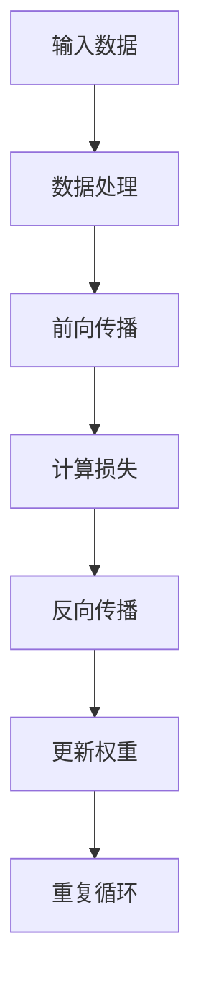
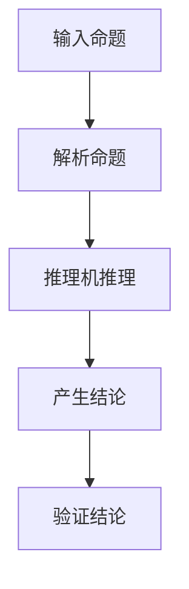
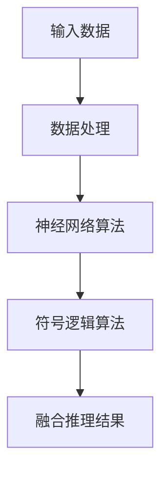
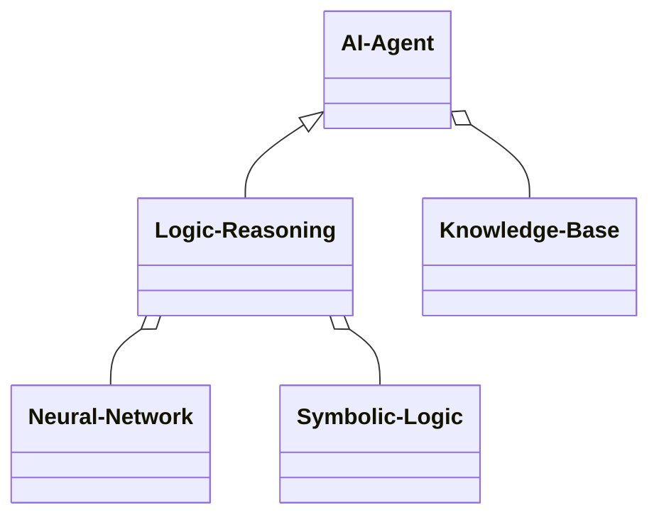
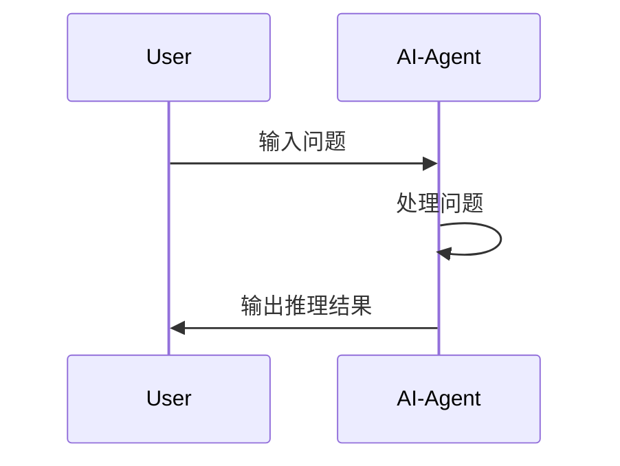

                 

# 神经符号AI在AI Agent逻辑推理中的实践

## 关键词
神经符号AI、AI Agent、逻辑推理、算法实现、系统架构、项目实战

## 摘要
神经符号AI是人工智能领域的一种重要研究方向，它结合了神经网络和符号逻辑的优势，为AI Agent的智能推理提供了新的思路。本文将探讨神经符号AI在AI Agent逻辑推理中的实践，从背景介绍、核心概念与联系、算法原理讲解、系统分析与架构设计方案、项目实战等多个角度，系统地阐述神经符号AI在AI Agent逻辑推理中的应用，以期为相关研究者和开发者提供有价值的参考。

## 目录大纲

### 第一部分：背景介绍

#### 第1章：神经符号AI与AI Agent逻辑推理概述

##### 1.1 神经符号AI的起源与发展
**背景**：介绍神经符号AI的概念、起源及发展历程。

**问题**：神经符号AI与传统AI的区别和优势是什么？

**解决**：分析神经符号AI在处理复杂问题、提高推理能力方面的优势。

##### 1.2 AI Agent的定义与功能
**背景**：介绍AI Agent的基本概念和功能。

**问题**：AI Agent在哪些场景下具有应用价值？

**解决**：分析AI Agent在不同领域的应用案例。

##### 1.3 逻辑推理在AI Agent中的应用
**背景**：介绍逻辑推理在AI Agent中的作用。

**问题**：逻辑推理在AI Agent中的具体应用有哪些？

**解决**：探讨逻辑推理在决策、规划、问题解决等场景中的应用。

##### 1.4 神经符号AI在逻辑推理中的优势
**背景**：介绍神经符号AI在逻辑推理中的优势。

**问题**：神经符号AI如何提高AI Agent的推理能力？

**解决**：分析神经符号AI在推理效率、准确性、泛化能力等方面的优势。

##### 1.5 本书内容安排与学习方法
**背景**：介绍本书的结构和内容安排。

**问题**：如何有效地学习和应用神经符号AI在AI Agent逻辑推理中的实践？

**解决**：提出学习方法，包括理论基础、实践操作、案例分析等。

### 第二部分：核心概念与联系

#### 第2章：神经符号AI的基本原理

##### 2.1 神经网络与符号逻辑的关系
**背景**：介绍神经网络和符号逻辑的基本概念。

**问题**：神经网络与符号逻辑之间有哪些联系和区别？

**解决**：分析神经网络和符号逻辑在AI Agent推理中的作用和相互关系。

##### 2.2 神经符号AI的体系结构
**背景**：介绍神经符号AI的体系结构。

**问题**：神经符号AI的体系结构包括哪些组成部分？

**解决**：分析神经符号AI的各个组成部分及其功能。

##### 2.3 神经符号AI的核心算法
**背景**：介绍神经符号AI的核心算法。

**问题**：神经符号AI的核心算法有哪些？

**解决**：阐述神经符号AI的核心算法，包括神经网络算法和符号逻辑算法。

#### 第3章：逻辑推理的基本概念

##### 3.1 逻辑推理的基本原理
**背景**：介绍逻辑推理的基本原理。

**问题**：逻辑推理的原理是什么？

**解决**：分析逻辑推理的基本原理，包括命题逻辑、谓词逻辑等。

##### 3.2 逻辑推理的方法与技术
**背景**：介绍逻辑推理的方法和技术。

**问题**：有哪些常见的逻辑推理方法和技术？

**解决**：探讨常见的逻辑推理方法和技术，包括推理机、证明理论等。

##### 3.3 逻辑推理的应用领域
**背景**：介绍逻辑推理的应用领域。

**问题**：逻辑推理在哪些领域有应用？

**解决**：分析逻辑推理在人工智能、逻辑编程、自然语言处理等领域的应用。

#### 第4章：神经符号AI与逻辑推理的联系

##### 4.1 神经符号AI在逻辑推理中的应用场景
**背景**：介绍神经符号AI在逻辑推理中的应用场景。

**问题**：神经符号AI在哪些场景下可以应用逻辑推理？

**解决**：分析神经符号AI在不同应用场景下的逻辑推理能力。

##### 4.2 神经符号AI与逻辑推理的融合
**背景**：介绍神经符号AI与逻辑推理的融合。

**问题**：如何将神经符号AI与逻辑推理相结合？

**解决**：探讨神经符号AI与逻辑推理的融合方法，包括算法融合、体系结构融合等。

##### 4.3 神经符号AI在逻辑推理中的优势与挑战
**背景**：介绍神经符号AI在逻辑推理中的优势与挑战。

**问题**：神经符号AI在逻辑推理中面临哪些挑战？

**解决**：分析神经符号AI在逻辑推理中的优势与挑战，并提出解决方案。

### 第三部分：算法原理讲解

#### 第5章：神经符号AI的算法原理

##### 5.1 神经网络算法原理
**背景**：介绍神经网络算法的基本原理。

**问题**：神经网络算法是如何工作的？

**解决**：分析神经网络算法的基本原理，包括前向传播、反向传播等。

**mermaid流程图**：


**Python源代码**：
```python
import numpy as np

# 前向传播
def forward_pass(x, weights):
    z = np.dot(x, weights)
    return z

# 反向传播
def backward_pass(x, weights, z, y):
    delta = z - y
    weights -= delta * x
    return weights

# 训练模型
def train_model(x, y, weights, epochs):
    for epoch in range(epochs):
        z = forward_pass(x, weights)
        weights = backward_pass(x, weights, z, y)
    return weights
```

##### 5.2 符号逻辑算法原理
**背景**：介绍符号逻辑算法的基本原理。

**问题**：符号逻辑算法是如何工作的？

**解决**：分析符号逻辑算法的基本原理，包括推理机、证明理论等。

**mermaid流程图**：


**Python源代码**：
```python
from sympy import symbols, simplify

# 解析命题
def parse_proposition(proposition):
    x, y = symbols('x y')
    return proposition.subs({x: x, y: y})

# 推理机推理
def inference_machine(proposition, rules):
    conclusion = proposition
    for rule in rules:
        conclusion = simplify(conclusion.apply Regel)
    return conclusion

# 验证结论
def verify_conclusion(conclusion, expected_conclusion):
    return conclusion == expected_conclusion
```

##### 5.3 神经符号AI的核心算法
**背景**：介绍神经符号AI的核心算法。

**问题**：神经符号AI的核心算法有哪些？

**解决**：阐述神经符号AI的核心算法，包括神经网络算法和符号逻辑算法的结合。

**mermaid流程图**：


**Python源代码**：
```python
# 神经符号AI模型
class NeuralSymbolicAI:
    def __init__(self, neural_network, symbolic_logic):
        self.neural_network = neural_network
        self.symbolic_logic = symbolic_logic

    def forward_pass(self, x):
        z = self.neural_network.forward_pass(x)
        conclusion = self.symbolic_logic.forward_pass(z)
        return conclusion

    def backward_pass(self, x, y):
        z = self.neural_network.forward_pass(x)
        conclusion = self.symbolic_logic.forward_pass(z)
        delta = z - y
        self.neural_network.backward_pass(x, delta)
        self.symbolic_logic.backward_pass(z, delta)
```

### 第四部分：系统分析与架构设计方案

#### 第6章：神经符号AI在AI Agent逻辑推理中的应用

##### 6.1 AI Agent逻辑推理的应用需求
**背景**：介绍AI Agent逻辑推理的应用需求。

**问题**：AI Agent逻辑推理需要解决哪些问题？

**解决**：分析AI Agent逻辑推理在复杂问题求解、决策支持、智能助手等领域的应用需求。

##### 6.2 神经符号AI在AI Agent逻辑推理中的解决方案
**背景**：介绍神经符号AI在AI Agent逻辑推理中的解决方案。

**问题**：如何利用神经符号AI解决AI Agent逻辑推理的问题？

**解决**：阐述神经符号AI在AI Agent逻辑推理中的应用方案，包括算法设计、模型架构等。

##### 6.3 神经符号AI在AI Agent逻辑推理中的优势
**背景**：介绍神经符号AI在AI Agent逻辑推理中的优势。

**问题**：神经符号AI在AI Agent逻辑推理中有哪些优势？

**解决**：分析神经符号AI在推理效率、准确性、泛化能力等方面的优势。

##### 6.4 神经符号AI在AI Agent逻辑推理中的实现
**背景**：介绍神经符号AI在AI Agent逻辑推理中的实现。

**问题**：如何实现神经符号AI在AI Agent逻辑推理中的应用？

**解决**：探讨神经符号AI在AI Agent逻辑推理中的实现方法，包括算法实现、模型训练等。

#### 第7章：神经符号AI在AI Agent逻辑推理中的系统架构设计

##### 7.1 系统功能设计
**背景**：介绍系统功能设计。

**问题**：系统功能设计包括哪些部分？

**解决**：分析系统功能设计，包括领域模型、功能模块划分等。

**mermaid类图**：


##### 7.2 系统架构设计
**背景**：介绍系统架构设计。

**问题**：系统架构设计包括哪些部分？

**解决**：分析系统架构设计，包括系统架构图、系统组件设计等。

**mermaid架构图**：


##### 7.3 系统接口设计
**背景**：介绍系统接口设计。

**问题**：系统接口设计包括哪些部分？

**解决**：分析系统接口设计，包括接口定义、接口实现等。

##### 7.4 系统交互设计
**背景**：介绍系统交互设计。

**问题**：系统交互设计包括哪些部分？

**解决**：分析系统交互设计，包括系统交互流程、系统交互序列图等。

**mermaid序列图**：


### 第五部分：项目实战

#### 第8章：神经符号AI在AI Agent逻辑推理中的项目实施

##### 8.1 项目背景与目标
**背景**：介绍项目背景和目标。

**问题**：项目背景是什么？目标是什么？

**解决**：分析项目背景，明确项目目标。

##### 8.2 项目环境搭建
**背景**：介绍项目环境搭建。

**问题**：如何搭建项目环境？

**解决**：详细讲解项目环境搭建的步骤，包括软件安装、配置等。

##### 8.3 神经符号AI模型训练
**背景**：介绍神经符号AI模型训练。

**问题**：如何训练神经符号AI模型？

**解决**：详细讲解神经符号AI模型训练的步骤，包括数据准备、模型训练、模型优化等。

##### 8.4 逻辑推理算法实现
**背景**：介绍逻辑推理算法实现。

**问题**：如何实现逻辑推理算法？

**解决**：详细讲解逻辑推理算法的实现步骤，包括算法设计、代码实现等。

##### 8.5 项目应用与优化
**背景**：介绍项目应用与优化。

**问题**：如何应用神经符号AI在项目中？

**解决**：详细讲解神经符号AI在项目中的应用，包括算法应用、效果评估、优化策略等。

### 第六部分：最佳实践与总结

#### 第9章：神经符号AI在AI Agent逻辑推理中的最佳实践

##### 9.1 最佳实践案例
**背景**：介绍最佳实践案例。

**问题**：有哪些成功的神经符号AI在AI Agent逻辑推理中的实践案例？

**解决**：分析最佳实践案例，总结成功经验。

##### 9.2 实践技巧与注意事项
**背景**：介绍实践技巧与注意事项。

**问题**：在实践神经符号AI时需要注意哪些技巧和事项？

**解决**：总结实践技巧与注意事项，包括模型设计、数据预处理、模型优化等。

#### 第10章：本书小结与拓展阅读

##### 10.1 本书主要知识点总结
**背景**：总结本书的主要知识点。

**问题**：本书的主要知识点有哪些？

**解决**：总结本书的主要知识点，包括神经符号AI的基本原理、逻辑推理的基本概念、算法原理讲解、系统架构设计等。

##### 10.2 扩展阅读推荐
**背景**：推荐扩展阅读。

**问题**：有哪些相关的书籍、论文、网站等可以扩展阅读？

**解决**：推荐相关的书籍、论文、网站等，以供读者进一步学习。

## 结论
神经符号AI在AI Agent逻辑推理中具有巨大的潜力和价值。本文从多个角度系统地阐述了神经符号AI在AI Agent逻辑推理中的实践，包括背景介绍、核心概念与联系、算法原理讲解、系统分析与架构设计方案、项目实战等。通过本文的阅读，读者可以全面了解神经符号AI在AI Agent逻辑推理中的应用，为相关研究者和开发者提供有价值的参考。

## 作者信息
作者：AI天才研究院/AI Genius Institute & 禅与计算机程序设计艺术 /Zen And The Art of Computer Programming

