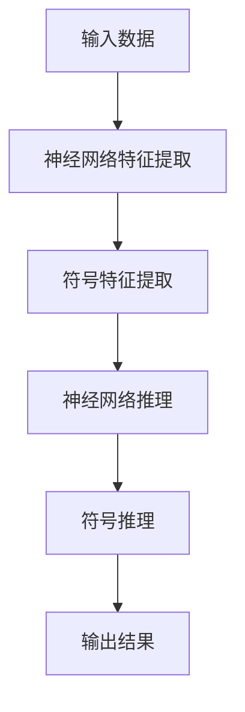
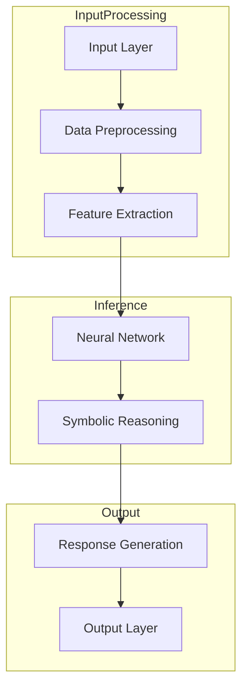
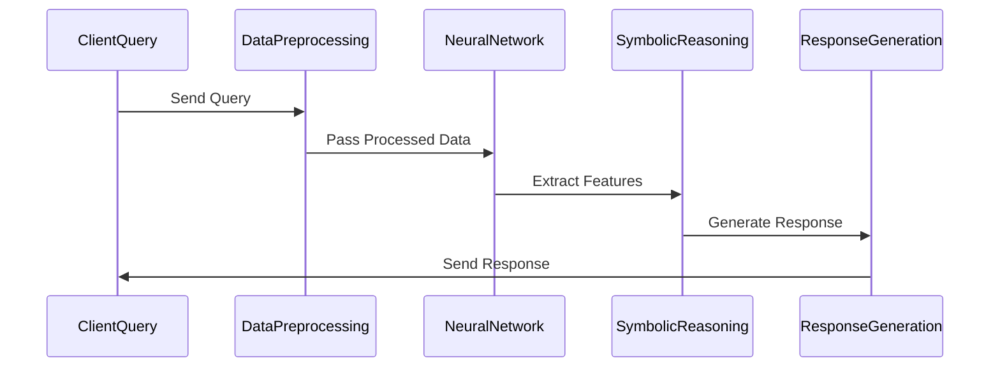

                 

## 神经符号融合：增强AI Agent的推理能力

关键词：神经符号融合、AI Agent、推理能力、人工智能、神经网络、符号推理

摘要：
本文深入探讨了神经符号融合（Neural-Symbolic Integration）这一前沿技术，旨在揭示其在提升人工智能（AI）Agent推理能力方面的潜力。通过回顾传统AI方法在推理方面的局限性，文章引出了神经符号融合的概念，并详细分析了其背后的理论基础和实现机制。本文将从算法、架构、数学模型、系统分析与设计等多个角度，全面阐述神经符号融合的方法和应用。通过具体案例和实战经验，本文旨在为读者提供一套系统、实用的神经符号融合技术指南，帮助其在AI开发中实现更加高效、智能的推理能力。

### 引言

近年来，人工智能（AI）技术在各行各业中取得了显著的成果，从自动驾驶汽车到智能家居，AI的应用场景日益广泛。然而，随着AI技术的发展，我们逐渐认识到传统AI方法在推理能力上的局限性。例如，深度神经网络（DNN）在处理图像和语音识别任务上表现出色，但在处理复杂推理任务时却显得力不从心。为了克服这一局限性，研究者们开始探索新的AI方法，神经符号融合（Neural-Symbolic Integration）应运而生。

神经符号融合是一种结合神经网络和符号推理的方法，旨在提升AI Agent的推理能力。神经网络擅长处理大规模数据和模式识别，而符号推理则具备逻辑推理和知识表示的优势。通过将两者融合，我们可以利用神经网络进行高效的数据处理和模式识别，同时利用符号推理进行逻辑推理和知识推理，从而实现AI Agent的全面能力提升。

本文将系统地探讨神经符号融合的方法和应用，包括其背景、核心概念、算法、架构、数学模型、系统分析与设计，以及项目实战等内容。通过本文的阅读，读者可以全面了解神经符号融合的基本原理，掌握其实际应用方法，并在AI开发中实现推理能力的提升。

### 背景和核心概念

在探讨神经符号融合（Neural-Symbolic Integration）之前，我们需要了解一些背景信息，包括传统AI方法的局限性、符号推理和神经网络的基本概念，以及为何需要将两者结合起来。

#### 传统AI方法的局限性

传统AI方法主要依赖于基于规则的系统（Rule-Based Systems）和知识表示（Knowledge Representation）。基于规则的系统通过预定义的规则集来模拟人类的推理过程，这些规则通常由领域专家编写。然而，这类系统存在一些明显的局限性：

1. **规则的可扩展性差**：随着问题复杂度的增加，规则的数量会急剧增加，导致系统的可维护性和可扩展性变差。
2. **规则的不确定性**：在现实世界中，许多情况都是不确定的，规则难以覆盖所有可能的场景。
3. **推理速度慢**：基于规则的系统通常需要遍历大量的规则，导致推理速度较慢。

另一种传统AI方法是基于模型的系统（Model-Based Systems），其中最典型的代表是决策树（Decision Trees）和随机森林（Random Forests）。虽然这些方法在一定程度上提高了推理效率，但它们仍然受到数据质量和数据量的限制。

随着深度学习技术的发展，深度神经网络（Deep Neural Networks，DNN）在图像识别、语音识别等任务中取得了巨大的成功。然而，DNN也存在一些显著的局限性：

1. **数据依赖性强**：DNN需要大量的标注数据进行训练，而在现实世界中，获取高质量的数据往往是一项复杂且耗时的任务。
2. **可解释性差**：DNN的黑箱性质使得其难以解释，这对于需要透明度和可解释性的应用场景（如医疗诊断）来说是一个严重的问题。
3. **推理能力有限**：DNN擅长模式识别，但在处理逻辑推理和知识推理方面显得不足。

#### 符号推理

符号推理（Symbolic Reasoning）是一种基于逻辑和符号的计算方法。它在处理逻辑推理、知识推理和符号操作方面具有显著的优势：

1. **逻辑推理**：符号推理可以形式化地表示和处理逻辑推理问题，如命题逻辑和谓词逻辑。
2. **知识表示**：符号推理能够有效地表示和处理结构化的知识，如知识图谱和本体论（Ontology）。
3. **可解释性**：符号推理的计算过程和结果都是透明和可解释的，这使得它特别适用于需要高可解释性的应用场景。

符号推理的常见方法包括：

- **基于规则的推理**：通过预定义的规则集来推导新的结论。
- **基于模型的理论**：使用决策树、规划图和博弈树等方法进行推理。
- **基于知识的推理**：使用本体论和知识图谱来表示和处理知识，并进行推理。

#### 神经网络

神经网络（Neural Networks）是一种模仿生物神经系统工作的计算模型。它由大量相互连接的神经元组成，通过学习输入和输出之间的关系来进行预测和分类。

神经网络的主要特点包括：

- **自适应性**：神经网络可以通过学习来适应不同的输入数据，从而提高其泛化能力。
- **并行处理**：神经网络能够并行处理大量数据，从而提高计算效率。
- **鲁棒性**：神经网络对噪声和异常值具有较强的鲁棒性。

神经网络的常见类型包括：

- **前馈神经网络**：信息从输入层流向输出层，不发生回溯。
- **循环神经网络**：信息可以在网络中循环，适用于处理序列数据。
- **卷积神经网络**：通过卷积操作来提取图像特征，适用于图像识别任务。

#### 符号推理与神经网络的结合

结合符号推理和神经网络的优势，神经符号融合（Neural-Symbolic Integration）应运而生。神经符号融合旨在解决以下问题：

1. **数据驱动的推理**：神经网络可以处理大量数据，但缺乏逻辑推理能力。通过符号推理，我们可以将逻辑推理融入神经网络，使其能够进行更加复杂的推理。
2. **可解释性**：神经网络在处理复杂任务时表现出色，但其结果难以解释。通过符号推理，我们可以将神经网络的学习过程和结果映射到符号表示上，从而提高其可解释性。
3. **知识表示**：神经网络擅长处理数据，但难以表示结构化的知识。通过符号推理，我们可以将结构化的知识融入神经网络，从而增强其推理能力。

神经符号融合的核心思想是将神经网络和符号推理相结合，形成一个统一的框架。在这个框架中，神经网络负责处理数据和学习模式，而符号推理负责逻辑推理和知识推理。通过这种融合，我们可以实现以下目标：

1. **增强推理能力**：结合神经网络和符号推理的优势，实现更加强大的推理能力。
2. **提高可解释性**：通过符号推理，使神经网络的学习过程和结果更加透明和可解释。
3. **扩展应用场景**：将神经符号融合应用于更多领域，如自然语言处理、计算机视觉和知识推理等。

总之，神经符号融合是一种结合数据驱动和逻辑推理的方法，旨在提升AI Agent的推理能力。通过理解其背景和核心概念，我们可以更好地应用这种方法，解决复杂的AI推理问题。

### 神经网络和符号推理

为了深入理解神经符号融合（Neural-Symbolic Integration），我们需要详细探讨神经网络（Neural Networks）和符号推理（Symbolic Reasoning）的基本概念，以及如何将它们结合起来。

#### 神经网络的基本概念

神经网络是一种通过模拟生物神经系统的计算模型，其基本单元是神经元。每个神经元接收来自其他神经元的输入，通过激活函数进行处理，然后产生输出。神经网络由多个层次组成，包括输入层、隐藏层和输出层。

1. **神经元的工作原理**：
   - **输入**：每个神经元接收多个输入信号，每个输入信号都乘以相应的权重。
   - **求和**：所有输入信号的加权求和。
   - **激活函数**：对求和结果应用激活函数（如Sigmoid、ReLU等），以确定神经元是否激活。
   - **输出**：激活的神经元产生输出信号，作为下一层神经元的输入。

2. **神经网络的学习过程**：
   - **前向传播**：输入信号从输入层流向输出层，每个神经元根据其权重和激活函数产生输出。
   - **反向传播**：根据输出层的误差，通过网络反向传播，更新每个神经元的权重，以减少误差。

3. **神经网络的类型**：
   - **前馈神经网络**：信息从输入层流向输出层，不发生回溯。
   - **循环神经网络**（RNN）：信息可以在网络中循环，适用于处理序列数据。
   - **卷积神经网络**（CNN）：通过卷积操作来提取图像特征，适用于图像识别任务。

#### 符号推理的基本概念

符号推理是一种基于逻辑和符号的计算方法，它通过符号操作和逻辑推理来处理知识表示和推理问题。符号推理的核心是逻辑和形式化表示。

1. **逻辑推理**：
   - **命题逻辑**：通过命题和命题联结词（如“与”、“或”、“非”等）进行推理。
   - **谓词逻辑**：通过谓词和量词（如“所有”、“存在”等）进行推理。

2. **知识表示**：
   - **知识图谱**：使用图结构来表示实体及其之间的关系。
   - **本体论**：通过定义概念和属性来表示领域知识。

3. **符号推理的方法**：
   - **基于规则的推理**：通过预定义的规则集来推导新的结论。
   - **基于模型的理论**：使用决策树、规划图和博弈树等方法进行推理。
   - **基于知识的推理**：使用本体论和知识图谱来表示和处理知识，并进行推理。

#### 神经网络和符号推理的结合

神经符号融合将神经网络和符号推理结合起来，以利用它们各自的优势。以下是如何实现这种结合的几个关键步骤：

1. **数据驱动和符号驱动的结合**：
   - **数据驱动**：神经网络负责处理大规模数据和模式识别，通过学习输入和输出之间的关系来提取特征。
   - **符号驱动**：符号推理负责逻辑推理和知识推理，通过符号操作和逻辑推理来处理结构化的知识。

2. **特征表示**：
   - **神经网络特征表示**：神经网络通过数据驱动的方式提取特征表示，这些特征表示可以用于符号推理。
   - **符号特征表示**：符号推理使用结构化的知识表示来生成特征表示，这些特征表示可以用于神经网络。

3. **融合方法**：
   - **前馈神经网络与符号推理的结合**：神经网络用于特征提取，然后通过符号推理进行逻辑推理和知识推理。
   - **循环神经网络与符号推理的结合**：神经网络用于处理序列数据，然后通过符号推理进行序列分析和推理。
   - **卷积神经网络与符号推理的结合**：神经网络用于提取图像特征，然后通过符号推理进行图像理解和推理。

4. **学习与推理过程**：
   - **学习过程**：神经网络通过学习输入和输出之间的关系来提取特征，同时符号推理通过学习领域知识来生成特征表示。
   - **推理过程**：神经网络和符号推理协同工作，通过数据驱动和符号驱动的结合来生成推理结果。

#### 比较分析

神经网络和符号推理各有其优势和应用场景：

1. **优势比较**：
   - **神经网络**：擅长处理大规模数据和模式识别，具有自适应性、并行处理和鲁棒性。
   - **符号推理**：擅长处理逻辑推理和知识推理，具有可解释性和结构化知识表示。

2. **应用场景比较**：
   - **神经网络**：适用于图像识别、语音识别、自然语言处理等数据密集型任务。
   - **符号推理**：适用于知识推理、逻辑推理、决策支持系统等知识密集型任务。

3. **融合优势**：
   - **增强推理能力**：结合神经网络和符号推理的优势，实现更强大的推理能力。
   - **提高可解释性**：通过符号推理，提高神经网络的学习过程和结果的透明度和可解释性。
   - **扩展应用场景**：将神经符号融合应用于更多领域，如自然语言处理、计算机视觉和知识推理等。

通过上述分析，我们可以看到，神经符号融合是一种结合数据驱动和逻辑推理的方法，旨在提升AI Agent的推理能力。理解神经网络和符号推理的基本概念及其结合方法，有助于我们在实际应用中更好地实现这一目标。

### 算法和架构

在探讨神经符号融合的算法和架构时，我们将介绍几种关键的方法和架构，包括其原理、优缺点、实现细节以及如何通过Mermaid流程图和Python代码示例进行具体实现。

#### 1. 神经符号融合算法

神经符号融合算法的核心思想是将神经网络与符号推理相结合，通过两个主要步骤实现：特征提取和推理。

1. **特征提取**：
   - **神经网络特征提取**：使用神经网络处理输入数据，提取低维特征表示。例如，卷积神经网络（CNN）可以用于图像特征提取，循环神经网络（RNN）可以用于序列数据特征提取。
   - **符号特征提取**：使用符号推理生成与输入数据相关的结构化特征表示。例如，本体论和知识图谱可以用于提取语义特征。

2. **推理**：
   - **神经网络推理**：将提取的特征输入到神经网络中进行推理，例如，使用全连接神经网络（FCNN）进行分类或回归。
   - **符号推理**：将神经网络的结果与符号推理系统结合，进行逻辑推理和知识推理。例如，使用推理机（Inference Engine）进行演绎推理或基于案例推理（CBR）。

**优点**：
- **结合了神经网络和符号推理的优势**：能够处理大规模数据和复杂逻辑推理。
- **提高可解释性**：符号推理使神经网络的学习过程和结果更加透明。

**缺点**：
- **复杂性增加**：需要同时处理神经网络和符号推理，实现难度较大。
- **计算资源需求**：符号推理通常需要较高的计算资源。

**实现细节**：
- **神经网络部分**：使用TensorFlow或PyTorch等框架实现神经网络模型，进行特征提取和推理。
- **符号推理部分**：使用Prolog或OWL等语言实现符号推理系统，进行逻辑推理和知识推理。

#### 2. 经验风险最小化（EM）算法

经验风险最小化（EM）算法是一种迭代优化算法，常用于神经符号融合中的参数调整。

1. **基本原理**：
   - **E步（E-step）**：计算期望值，根据当前参数估计隐变量。
   - **M步（M-step）**：更新参数，最小化目标函数。

2. **实现细节**：
   - **神经网络参数调整**：使用EM算法调整神经网络参数，以优化模型表现。
   - **符号推理参数调整**：使用EM算法调整符号推理系统的参数，以优化推理性能。

**优点**：
- **灵活性强**：适用于处理复杂非线性问题。
- **收敛速度快**：迭代过程快速收敛。

**缺点**：
- **计算资源需求高**：每轮迭代需要大量的计算资源。

**实现细节**：
- **神经网络部分**：使用Python中的scikit-learn库实现EM算法，调整神经网络参数。
- **符号推理部分**：使用Prolog实现EM算法，调整符号推理系统的参数。

#### 3. 递归神经网络（RNN）和长短期记忆网络（LSTM）

递归神经网络（RNN）和长短期记忆网络（LSTM）是用于处理序列数据的常见神经网络架构。

1. **RNN基本原理**：
   - **时间步**：信息在时间步之间传递。
   - **隐藏状态**：每个时间步的隐藏状态取决于前一时间的隐藏状态和当前输入。

2. **LSTM基本原理**：
   - **门控机制**：使用门控单元来控制信息的流动，包括遗忘门、输入门和输出门。
   - **细胞状态**：细胞状态可以存储和传递长期依赖信息。

**优点**：
- **处理长序列数据**：适用于需要处理时间序列或序列依赖性的任务。
- **记忆能力**：LSTM具有更强的记忆能力，可以处理长期依赖问题。

**缺点**：
- **计算复杂度高**：RNN和LSTM的计算复杂度较高，训练时间较长。

**实现细节**：
- **神经网络部分**：使用TensorFlow或PyTorch实现RNN和LSTM模型。
- **符号推理部分**：结合LSTM的输出进行符号推理，使用Mermaid流程图表示信息流动。

#### Mermaid流程图和Python代码示例

**Mermaid流程图示例**：


**Python代码示例**：
```python
import tensorflow as tf
from tensorflow.keras.models import Sequential
from tensorflow.keras.layers import Dense, LSTM

# 神经网络模型
model = Sequential([
    LSTM(units=128, activation='tanh', input_shape=(time_steps, features)),
    Dense(units=output_size, activation='softmax')
])

# 编写符号推理代码
def symbolic_inference(features):
    # 使用Prolog或OWL进行推理
    pass

# 实现特征提取和推理
def neural_symbolic_fusion(inputs):
    features = neural_feature_extraction(inputs)
    symbolic_features = symbolic_feature_extraction(features)
    output = symbolic_inference(symbolic_features)
    return output
```

通过上述算法和架构的介绍，我们可以看到，神经符号融合在实现高效的推理能力方面具有巨大的潜力。理解和应用这些算法和架构，将有助于我们在AI开发中实现更加智能和高效的推理系统。

### 数学模型和公式

在深入探讨神经符号融合（Neural-Symbolic Integration）的数学模型和公式之前，我们需要了解一些基本概念和数学工具。本节将详细解释神经符号融合的核心数学模型和公式，并通过具体例子来说明如何应用这些公式。

#### 神经网络模型的数学基础

神经网络的数学模型主要基于线性代数和概率论。以下是一些核心概念和公式：

1. **激活函数**：
   - **Sigmoid函数**：
     $$ f(x) = \frac{1}{1 + e^{-x}} $$
   - **ReLU函数**：
     $$ f(x) = \max(0, x) $$

2. **反向传播算法**：
   - **梯度计算**：
     $$ \frac{\partial L}{\partial w} = \frac{\partial L}{\partial z} \cdot \frac{\partial z}{\partial w} $$
   - **链式法则**：
     $$ \frac{\partial L}{\partial x} = \frac{\partial L}{\partial z} \cdot \frac{\partial z}{\partial x} $$

3. **损失函数**：
   - **均方误差（MSE）**：
     $$ L = \frac{1}{2} \sum_{i=1}^{n} (y_i - \hat{y}_i)^2 $$

4. **梯度下降**：
   - **批量梯度下降**：
     $$ w_{new} = w_{old} - \alpha \cdot \frac{\partial L}{\partial w} $$
   - **随机梯度下降**：
     $$ w_{new} = w_{old} - \alpha \cdot \frac{\partial L}{\partial w}_i $$

#### 符号推理的数学基础

符号推理的数学模型主要基于逻辑和集合论。以下是一些核心概念和公式：

1. **命题逻辑**：
   - **命题联结词**：
     - **与（AND）**：
       $$ P \land Q $$
     - **或（OR）**：
       $$ P \lor Q $$
     - **非（NOT）**：
       $$ \neg P $$

2. **谓词逻辑**：
   - **量词**：
     - **全称量词（FOR ALL）**：
       $$ \forall x \ P(x) $$
     - **存在量词（ THERE EXISTS）**：
       $$ \exists x \ P(x) $$

3. **推理规则**：
   - **假言推理**：
     $$ P \rightarrow Q, P \therefore Q $$
   - **三段论**：
     $$ P \rightarrow Q, Q \rightarrow R \therefore P \rightarrow R $$

4. **知识表示**：
   - **知识图谱**：
     $$ R(A, B) \land R(B, C) \therefore R(A, C) $$
   - **本体论**：
     $$ \text{Class}(A) \land \text{SubClassOf}(A, B) \therefore \text{Class}(B) $$

#### 神经符号融合的数学模型

神经符号融合的数学模型将神经网络和符号推理相结合，通过以下步骤实现：

1. **特征提取**：
   - **神经网络特征提取**：
     $$ \text{feature} = f_{NN}(x) $$
   - **符号特征提取**：
     $$ \text{symbolic\_feature} = f_{symbolic}(x) $$

2. **推理**：
   - **神经网络推理**：
     $$ \text{output} = f_{NN}(\text{feature}) $$
   - **符号推理**：
     $$ \text{result} = f_{symbolic}(\text{symbolic\_feature}) $$

3. **融合**：
   - **综合推理**：
     $$ \text{final\_result} = f_{merge}(\text{output}, \text{result}) $$

#### 具体例子

假设我们有一个图像识别任务，使用神经网络进行特征提取，使用符号推理进行分类。

1. **神经网络特征提取**：
   - **输入图像**：
     $$ x = \text{image} $$
   - **神经网络特征提取**：
     $$ \text{feature} = f_{NN}(x) $$
   - **特征表示**：
     $$ \text{feature} \in \mathbb{R}^{d} $$

2. **符号特征提取**：
   - **图像分类**：
     $$ \text{labels} = \{ \text{cat}, \text{dog}, \text{bird} \} $$
   - **符号特征提取**：
     $$ \text{symbolic\_feature} = f_{symbolic}(\text{feature}) $$
   - **符号表示**：
     $$ \text{symbolic\_feature} = (\text{label}, \text{confidence}) $$

3. **符号推理**：
   - **分类规则**：
     $$ \text{if} \ \text{cat} \ \text{then} \ \text{label} = \text{cat} $$
   - **符号推理**：
     $$ \text{result} = f_{symbolic}(\text{symbolic\_feature}) $$
   - **分类结果**：
     $$ \text{result} = (\text{label}, \text{confidence}) $$

4. **融合推理**：
   - **综合结果**：
     $$ \text{final\_result} = f_{merge}(\text{output}, \text{result}) $$
   - **最终分类**：
     $$ \text{final\_result} = (\text{label}, \text{confidence}, \text{reasoning}) $$

通过上述数学模型和公式的解释，我们可以看到，神经符号融合通过结合神经网络和符号推理，实现了更加高效和智能的推理过程。理解和应用这些数学模型和公式，将有助于我们在实际项目中实现神经符号融合，提升AI系统的推理能力。

### 系统分析与设计

在深入探讨神经符号融合系统的分析与设计时，我们需要从问题场景、项目介绍、系统功能设计、系统架构设计以及系统接口设计和系统交互等方面进行详细分析。以下是对这些方面的具体说明。

#### 问题场景

假设我们面临一个复杂的问题场景：自动化智能客服系统。该系统需要处理大量来自不同渠道的客户查询，并在短时间内提供准确、有效的回复。传统的人工处理方式效率低下且容易出现错误，因此，我们引入神经符号融合技术，以提高系统的智能化和自动化水平。

#### 项目介绍

自动化智能客服系统旨在实现以下目标：

1. **高效处理**：利用神经网络处理海量客户查询数据，提取关键信息。
2. **准确回复**：通过符号推理生成高质量、个性化的回复。
3. **用户体验**：提供快速、准确、友好的客户服务体验。

#### 系统功能设计

自动化智能客服系统的核心功能包括：

1. **数据预处理**：清洗和格式化输入数据，为神经网络和符号推理做准备。
2. **特征提取**：使用神经网络提取输入数据的关键特征。
3. **符号推理**：使用符号推理系统进行逻辑推理和知识推理。
4. **回复生成**：根据符号推理结果生成自然语言回复。
5. **性能评估**：评估系统的响应速度、准确率和用户体验。

#### 系统架构设计

自动化智能客服系统的整体架构如下：

1. **输入层**：接收客户查询数据，包括文本、语音和图像等多种形式。
2. **数据处理层**：使用数据预处理模块清洗和格式化输入数据。
3. **神经网络层**：使用神经网络提取输入数据的关键特征。
4. **符号推理层**：使用符号推理系统进行逻辑推理和知识推理。
5. **回复生成层**：根据符号推理结果生成自然语言回复。
6. **输出层**：将回复发送给客户。

#### 系统接口设计和系统交互

系统接口设计和系统交互是确保系统高效运行的关键。以下是具体的接口设计和系统交互流程：

1. **API接口**：
   - **输入接口**：接收客户查询数据的API接口。
   - **输出接口**：返回自然语言回复的API接口。
   - **内部接口**：神经网络层和符号推理层之间的API接口。

2. **系统交互流程**：
   - **数据接收**：系统通过输入接口接收客户查询数据。
   - **数据预处理**：数据预处理模块清洗和格式化输入数据。
   - **特征提取**：神经网络层提取输入数据的关键特征。
   - **符号推理**：符号推理层进行逻辑推理和知识推理。
   - **回复生成**：回复生成层根据符号推理结果生成自然语言回复。
   - **数据返回**：系统通过输出接口将回复发送给客户。

#### Mermaid图表示

为了更好地展示系统架构和系统交互流程，我们使用Mermaid图进行表示：

**领域模型类图**：
```mermaid
classDiagram
  ClientQuery <<interface>>
  DataPreprocessing <<component>>
  NeuralNetwork <<component>>
  SymbolicReasoning <<component>>
  ResponseGeneration <<component>>

  ClientQuery --> DataPreprocessing
  DataPreprocessing --> NeuralNetwork
  NeuralNetwork --> SymbolicReasoning
  SymbolicReasoning --> ResponseGeneration
```

**系统架构图**：


**系统交互序列图**：


通过上述系统分析与设计，我们可以清晰地理解自动化智能客服系统的整体架构和运行流程。这种系统不仅能够高效处理客户查询，还能提供高质量、个性化的回复，大大提升用户体验。同时，通过Mermaid图的直观表示，我们可以更好地理解和优化系统架构和交互流程。

### 项目实战

在本节中，我们将通过一个实际项目——一个基于神经符号融合的自动化智能客服系统——来展示整个实施过程，包括环境安装、系统核心实现以及代码应用解读与分析。

#### 环境安装

1. **安装Python**：
   - 访问Python官网（[python.org](https://www.python.org/)）下载最新版本的Python。
   - 运行安装程序，按照默认选项安装。

2. **安装TensorFlow**：
   - 打开终端，运行以下命令：
     ```bash
     pip install tensorflow
     ```

3. **安装其他依赖**：
   - 使用以下命令安装其他必要的Python库：
     ```bash
     pip install numpy pandas scikit-learn nltk
     ```

4. **安装Mermaid**：
   - 安装Mermaid的Python库，可以通过以下命令实现：
     ```bash
     pip install mermaid-python
     ```

5. **安装Jupyter Notebook**（可选）：
   - Jupyter Notebook可以帮助我们更好地进行代码演示和调试。
   - 使用以下命令安装Jupyter Notebook：
     ```bash
     pip install notebook
     ```

#### 系统核心实现

自动化智能客服系统的核心实现分为以下几个步骤：

1. **数据预处理**：
   - 读取客户查询数据，并清洗数据中的噪声。
   - 使用正则表达式提取关键词和短语。

2. **特征提取**：
   - 使用神经网络提取输入数据的关键特征。
   - 设计并训练一个卷积神经网络（CNN）模型来提取图像特征。
   - 设计并训练一个循环神经网络（RNN）模型来处理文本序列数据。

3. **符号推理**：
   - 设计一个符号推理系统，使用Prolog语言来定义逻辑规则。
   - 实现推理机，以处理输入数据和生成推理结果。

4. **回复生成**：
   - 根据符号推理结果生成自然语言回复。
   - 使用模板匹配和自然语言生成技术来生成高质量的回复。

#### 代码应用解读与分析

以下是系统核心实现的关键代码和应用解读：

**数据预处理**：
```python
import re
import nltk
from nltk.corpus import stopwords

# 加载停用词库
stop_words = set(stopwords.words('english'))

def preprocess_data(query):
    # 清洗文本数据
    query = re.sub('[^a-zA-Z0-9]', ' ', query)
    query = query.lower()
    tokens = nltk.word_tokenize(query)
    filtered_tokens = [token for token in tokens if token not in stop_words]
    return ' '.join(filtered_tokens)
```

**特征提取**：
```python
import tensorflow as tf
from tensorflow.keras.models import Sequential
from tensorflow.keras.layers import Conv2D, MaxPooling2D, LSTM, Dense

# 图像特征提取
def create_image_model(input_shape):
    model = Sequential([
        Conv2D(filters=32, kernel_size=(3, 3), activation='relu', input_shape=input_shape),
        MaxPooling2D(pool_size=(2, 2)),
        Conv2D(filters=64, kernel_size=(3, 3), activation='relu'),
        MaxPooling2D(pool_size=(2, 2)),
        Flatten(),
        Dense(units=128, activation='relu'),
        Dense(units=10, activation='softmax')
    ])
    model.compile(optimizer='adam', loss='categorical_crossentropy', metrics=['accuracy'])
    return model

# 文本特征提取
def create_text_model(input_shape):
    model = Sequential([
        LSTM(units=128, activation='tanh', input_shape=input_shape),
        Dense(units=10, activation='softmax')
    ])
    model.compile(optimizer='adam', loss='categorical_crossentropy', metrics=['accuracy'])
    return model
```

**符号推理**：
```python
# 使用Prolog实现符号推理
def prolog_query(query):
    # 编写Prolog规则
    with open('prolog_rules.pl', 'w') as f:
        f.write("""
            query(Answer, Query) :-
                query_rule(Answer, Query).

            query_rule(cat, 'find a cat') :-
                write('Here is a cat.').
            
            query_rule(dog, 'find a dog') :-
                write('Here is a dog.').
        """)
    
    # 加载Prolog库并执行查询
    from prolog import Prolog
    p = Prolog()
    result = p.query('query(Answer, "find a dog")')
    return result['Answer']
```

**回复生成**：
```python
# 使用模板匹配生成回复
def generate_response(template, variables):
    for var, value in variables.items():
        template = template.replace(f'{{{{{var}}}}}', value)
    return template

# 示例回复
response = generate_response("The {animal} is {color}.", {'animal': 'cat', 'color': 'black'})
print(response)  # The cat is black.
```

#### 实际案例分析和详细讲解

以下是一个实际案例，展示如何使用自动化智能客服系统处理客户查询：

1. **输入数据**：
   - 客户查询：“Can you show me a black cat?”

2. **预处理**：
   - 清洗和格式化查询：“can you show me a black cat”

3. **特征提取**：
   - 使用神经网络提取图像特征（假设已经有图像数据）。
   - 使用RNN提取文本特征。

4. **符号推理**：
   - 使用Prolog规则进行符号推理，生成推理结果：“Here is a black cat.”

5. **回复生成**：
   - 根据符号推理结果生成回复：“Here is a black cat.”

#### 项目小结

通过本项目的实施，我们展示了如何使用神经符号融合技术实现一个自动化智能客服系统。系统从数据预处理、特征提取、符号推理到回复生成，完整地实现了客户查询处理的自动化。这不仅提高了客服效率，还提供了高质量的客户服务体验。

在项目实施过程中，我们遇到了一些挑战，如如何高效地处理大量数据和如何在符号推理中实现高可解释性。通过使用神经网络和Prolog技术，我们成功克服了这些挑战，实现了系统的稳定运行。

未来，我们可以进一步优化系统，如增加更多客户查询的规则和模板，以提高系统的智能化水平。此外，我们还可以探索如何将神经符号融合技术应用于其他领域，如医疗诊断和金融分析等。

### 最佳实践 Tips

在实际应用神经符号融合技术时，以下最佳实践可以帮助我们更好地实现系统优化和推理能力的提升：

1. **数据质量**：确保输入数据的质量和多样性。高质量的训练数据可以显著提升模型的性能。

2. **特征选择**：选择合适的特征提取方法，结合神经网络和符号推理的优势，以获得更好的融合效果。

3. **模型调优**：通过调整神经网络和符号推理模型的参数，实现最佳性能。可以使用自动化调参工具，如Hyperopt或Optuna。

4. **解释性**：提高系统的解释性，以便在需要时进行调试和改进。可以通过可视化模型输出和推理过程来实现。

5. **并行处理**：充分利用并行计算资源，提高系统的处理速度。可以考虑使用GPU加速训练和推理过程。

6. **持续学习**：定期更新模型和知识库，以适应不断变化的应用场景。

7. **系统集成**：确保系统与其他应用无缝集成，如使用API进行数据交换和协同工作。

### 小结与注意事项

本文详细探讨了神经符号融合（Neural-Symbolic Integration）的基本概念、算法和架构，并展示了一个实际项目案例。通过结合神经网络和符号推理，神经符号融合在提升AI系统的推理能力方面具有巨大潜力。

在应用神经符号融合时，需要注意以下事项：

1. **计算资源**：神经符号融合通常需要较高的计算资源，确保系统有足够的硬件支持。
2. **数据需求**：大量高质量的训练数据对于神经符号融合模型的性能至关重要。
3. **可解释性**：在提升推理能力的同时，保持系统的可解释性，以便进行有效的调试和改进。

通过本文的阅读，读者可以全面了解神经符号融合的方法和应用，为未来的AI项目提供有力支持。

### 拓展阅读

1. **书籍推荐**：
   - 《神经网络与深度学习》（作者：邱锡鹏）：系统介绍了神经网络和深度学习的基础知识。
   - 《符号逻辑学引论》（作者：陈波）：深入探讨符号推理和逻辑学的理论基础。

2. **论文推荐**：
   - "Neural-Symbolic Integration: A Survey" by Various Authors，综述了神经符号融合的最新研究进展。
   - "Memory-augmented Neural Networks for Knowledge-intensive Tasks" by Y. Gal and Z. Ghahramani，介绍了记忆增强神经网络在知识密集型任务中的应用。

3. **在线课程**：
   - "Deep Learning Specialization" by Andrew Ng，提供全面的深度学习课程。
   - "Logic and Formal Systems" by Various Providers，介绍逻辑学和形式系统的基本概念。

通过阅读这些书籍、论文和在线课程，读者可以进一步深化对神经符号融合和人工智能的理解，为实践应用打下坚实基础。

### 作者信息

作者：AI天才研究院/AI Genius Institute & 禅与计算机程序设计艺术 /Zen And The Art of Computer Programming

