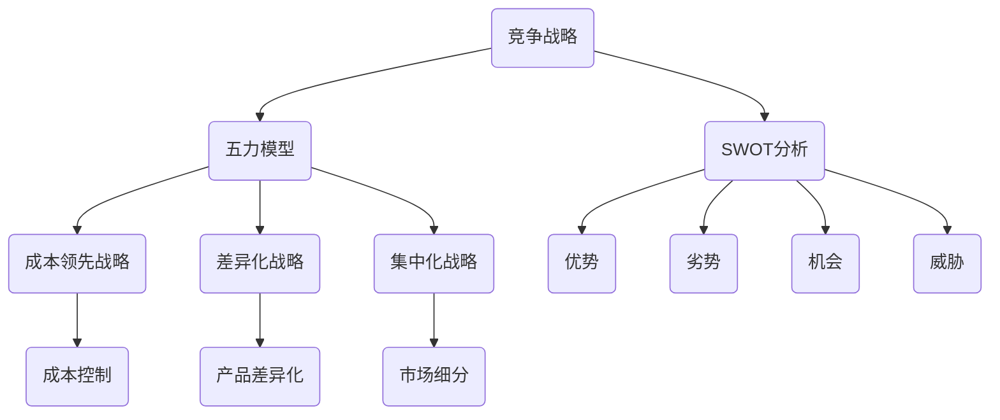

                 

### 竞争对手分析：导言与背景

**文章标题：竞争对手分析**

**关键词：** 竞争对手分析、竞争战略、市场表现、策略反应

**摘要：** 本文将深入探讨竞争对手分析在企业竞争中的重要性，通过系统的分析方法，帮助企业在激烈的市场环境中制定有效的竞争策略。

在当今竞争激烈的市场环境中，了解竞争对手是每个企业成功的关键因素。竞争对手分析不仅可以帮助企业识别市场趋势，优化自身战略，还可以为企业提供宝贵的洞察，使其在竞争中获得优势。本文将围绕竞争对手分析的重要性、核心概念与联系、数据收集与分析、产品与市场表现分析、策略反应与应对等方面进行详细探讨。

### 竞争对手分析的重要性

#### 1.1 竞争环境下的企业生存法则

在市场竞争日益激烈的今天，企业不仅要面对同行业内的竞争者，还要应对不断变化的市场环境和消费者需求。了解竞争对手，可以帮助企业制定更有效的市场策略，抓住市场机遇，避免陷入竞争的劣势。以下是竞争对手分析在企业生存中的几个关键作用：

1. **识别竞争对手的优势与劣势：** 通过对竞争对手的深入分析，企业可以了解其在市场中的地位、产品特点、市场份额等方面的情况，从而明确自身的优势与劣势，找到差距并进行针对性的改进。

2. **预测市场趋势：** 竞争对手的行为和策略往往反映了市场趋势。通过分析竞争对手的市场动向，企业可以提前预判市场的变化，调整自身的战略规划，以应对未来的市场挑战。

3. **制定有效的竞争策略：** 竞争对手分析为企业提供了宝贵的竞争情报，使其能够制定更具针对性的竞争策略，包括价格策略、产品策略、营销策略等，从而在激烈的市场竞争中占据有利位置。

#### 1.2 竞争对手分析的必要性和目标

竞争对手分析对于企业的必要性体现在以下几个方面：

- **保持市场竞争力：** 通过持续地对竞争对手进行分析，企业可以保持对市场动态的敏感度，及时调整自身策略，确保在市场中保持竞争力。

- **优化产品与服务：** 竞争对手的产品和服务往往是企业优化自身产品和服务的重要参考。通过对比分析，企业可以识别出自身的不足之处，从而进行改进和创新。

- **发现市场机会：** 竞争对手的失败和错误为企业提供了学习的机会。通过分析竞争对手的失败案例，企业可以避免走弯路，同时发现潜在的市场机会。

竞争对手分析的目标主要包括：

- **识别竞争对手的市场地位：** 通过分析市场份额、品牌知名度等指标，了解竞争对手在市场中的地位。

- **分析竞争对手的产品特点：** 通过对产品功能、性能、价格等方面的分析，了解竞争对手的产品优势与劣势。

- **评估竞争对手的策略：** 通过对竞争对手的市场策略、营销手段等方面的分析，评估其对市场的影响。

#### 1.3 竞争对手分析的挑战和误区

尽管竞争对手分析对企业具有重要的意义，但在实际操作中，企业可能会面临一系列的挑战和误区：

- **数据收集困难：** 竞争对手的数据往往不易获取，企业需要投入大量时间和资源进行数据收集。

- **分析偏差：** 分析过程中，企业可能会因为主观偏见而忽视某些重要信息，导致分析结果不准确。

- **应对不当：** 即使进行了详细的竞争对手分析，企业也需要正确的应对策略。否则，可能会因为错误的市场决策而陷入困境。

为了克服这些挑战，企业需要采取科学的方法和工具，确保竞争对手分析的有效性和准确性。

### 竞争战略理论

#### 2.1 竞争理论的历史与发展

竞争理论作为管理学的一个重要分支，其发展经历了多个阶段。从早期的亚当·斯密的“看不见的手”理论，到现代的竞争战略理论，竞争理论的研究不断深化，为企业提供了丰富的理论指导。

- **古典竞争理论：** 以亚当·斯密为代表，强调市场自由竞争的重要性，认为竞争是市场经济的内在动力。

- **垄断竞争理论：** 马歇尔提出，市场存在大量的同质和异质产品，企业通过产品差异化来获得竞争优势。

- **现代竞争战略理论：** 以迈克尔·波特的竞争五力模型为代表，系统地分析了企业面临的竞争环境，提出了制定竞争策略的方法。

#### 2.2 五力模型分析

迈克尔·波特的五力模型是分析市场竞争环境的重要工具，它包括以下五个方面的力量：

- **潜在进入者的威胁：** 分析行业内外潜在的新进入者，评估其对现有企业带来的竞争压力。

- **替代品的威胁：** 分析市场上是否存在可以替代现有产品的其他产品或服务，评估其替代能力。

- **供应商的议价能力：** 分析供应商对企业的控制能力，包括供应的稳定性和成本。

- **买家的议价能力：** 分析消费者对企业的控制能力，包括购买集中度和对价格敏感度。

- **行业内现有竞争者的竞争：** 分析行业内现有企业的竞争态势，包括市场份额、产品差异化和市场策略。

#### 2.3 SWOT分析

SWOT分析是一种常用的战略规划工具，它通过分析企业的优势（Strengths）、劣势（Weaknesses）、机会（Opportunities）和威胁（Threats），帮助企业在竞争中找到自身的定位。

- **优势分析：** 识别企业在市场中的独特优势，如技术优势、品牌优势等。

- **劣势分析：** 识别企业在市场中的短板，如产品质量、成本控制等。

- **机会分析：** 分析市场变化带来的机会，如新市场、新技术等。

- **威胁分析：** 分析市场变化带来的威胁，如竞争对手的动向、政策变化等。

#### 2.4 波特竞争战略框架

波特提出了三种基本的竞争战略：成本领先、差异化和集中化。这些战略帮助企业根据自身的资源和能力，在市场中获得竞争优势。

- **成本领先战略：** 通过规模化生产、降低成本，成为行业中的价格领导者。

- **差异化战略：** 通过提供独特的产品或服务，满足消费者的特殊需求，建立品牌优势。

- **集中化战略：** 针对某一特定市场或细分市场，提供专业化的产品或服务。

### 竞争战略理论在企业中的应用

竞争战略理论不仅为企业提供了分析市场竞争环境的工具，还指导企业制定具体的竞争策略。以下是竞争战略理论在企业中的应用实例：

- **新进入者分析：** 企业通过五力模型分析，评估新进入者对市场的潜在威胁，制定相应的进入策略。

- **市场定位：** 企业通过SWOT分析，明确自身的市场定位，制定差异化战略，提升市场竞争力。

- **成本控制：** 企业通过成本领先战略，优化生产流程，降低成本，提高市场竞争力。

### 竞争战略理论的局限性和改进方向

尽管竞争战略理论在企业管理中具有重要价值，但它也存在一定的局限性。例如，五力模型过于简化，可能无法全面反映复杂的市场环境；SWOT分析容易陷入主观偏见，导致分析结果不准确。为了克服这些局限性，企业需要：

- **综合多种分析方法：** 结合五力模型、SWOT分析等工具，进行多角度的分析，提高分析结果的准确性。

- **动态调整策略：** 随着市场环境的变化，企业需要不断调整竞争战略，以适应新的市场挑战。

- **重视数据驱动：** 利用大数据和人工智能技术，进行更准确的市场分析和预测，指导企业决策。

### 竞争战略理论在企业管理中的重要性

竞争战略理论不仅为企业提供了分析市场竞争环境的工具，还指导企业制定具体的竞争策略。以下是竞争战略理论在企业管理中的重要性：

- **指导市场决策：** 竞争战略理论帮助企业在市场中做出更明智的决策，提升市场竞争力。

- **优化资源配置：** 通过分析竞争对手和市场环境，企业可以更合理地配置资源，提高运营效率。

- **提升创新能力：** 竞争战略理论鼓励企业不断创新，以适应市场的变化和消费者需求。

总之，竞争战略理论是企业制定市场策略的重要依据，它帮助企业在激烈的市场竞争中找到自身的定位，实现可持续发展。

### 竞争战略理论在现代企业中的应用

在现代企业中，竞争战略理论的应用已经成为提升市场竞争力的重要手段。以下是竞争战略理论在现代企业中的具体应用：

#### 3.1 成本领先战略的应用

成本领先战略是企业在市场中获取竞争优势的一种重要方式。通过规模化生产、提高生产效率、降低原材料成本等手段，企业可以在价格上具有明显优势，从而吸引更多的消费者。

**案例分析：** 亚马逊通过大规模的物流体系和数字化运营，实现了成本领先。这不仅帮助亚马逊在电商市场中占据主导地位，还使其能够提供更具竞争力的价格，吸引了大量消费者。

#### 3.2 差异化战略的应用

差异化战略通过提供独特的产品或服务，满足消费者的特殊需求，从而在市场中建立品牌优势。这种战略在高科技产业、奢侈品行业等领域尤为常见。

**案例分析：** 苹果公司通过独特的设计、优秀的用户体验和强大的品牌形象，实现了差异化战略。这使得苹果的产品在市场上具有独特的竞争力，吸引了大量忠实消费者。

#### 3.3 集中化战略的应用

集中化战略是企业在特定市场或细分市场中，提供专业化的产品或服务，以实现竞争优势。这种战略在中小企业中应用广泛，可以帮助企业集中资源，提高运营效率。

**案例分析：** 特斯拉在电动汽车市场中，采用了集中化战略。通过专注于电动汽车的研发和生产，特斯拉在市场上建立了强大的品牌影响力，并取得了显著的市场份额。

#### 3.4 跨行业竞争战略的应用

在现代社会，跨行业竞争越来越普遍。企业不仅需要在自身行业内竞争，还要面对其他行业的竞争压力。跨行业竞争战略的应用，可以帮助企业更好地应对多元化竞争环境。

**案例分析：** 阿里巴巴集团通过投资和并购，实现了跨行业竞争。从电商到金融、物流、云计算等多个领域，阿里巴巴都取得了显著的竞争优势，从而在多元化市场中立于不败之地。

#### 3.5 竞争战略与企业文化的关系

竞争战略不仅影响企业的市场行为，还与企业文化密切相关。企业的竞争战略往往反映了其核心价值观和企业文化。

**案例分析：** 强生公司以“关爱人类健康”为使命，坚持质量至上、客户至上的原则，这种企业文化使得强生在医疗健康领域具有强大的竞争力。

### 竞争战略理论在企业中的实际应用

竞争战略理论在企业管理中具有深远的意义。通过科学地制定和实施竞争战略，企业可以更好地应对市场竞争，实现可持续发展。以下是竞争战略理论在企业中的实际应用：

- **市场定位：** 企业通过竞争战略理论，明确自身的市场定位，制定符合市场需求的产品和服务策略。

- **资源配置：** 企业根据竞争战略的需要，合理配置资源，提高运营效率。

- **创新驱动：** 企业通过竞争战略理论，鼓励创新，不断提升产品和服务质量。

- **风险管理：** 企业通过竞争战略理论，识别市场风险，制定相应的风险应对策略。

总之，竞争战略理论是企业制定市场策略的重要依据，它帮助企业在激烈的市场竞争中找到自身的定位，实现可持续发展。通过科学地应用竞争战略理论，企业可以在市场中立于不败之地。

### 总结与展望

竞争战略理论作为企业管理的重要工具，为企业提供了分析市场竞争环境、制定竞争策略的科学方法。本文从历史发展、核心概念、应用实例等方面，详细探讨了竞争战略理论在现代企业中的应用。通过成本领先、差异化、集中化等战略，企业可以更好地应对市场竞争，实现可持续发展。

展望未来，竞争战略理论将继续在企业中发挥重要作用。随着市场环境的变化和技术的进步，企业需要不断调整和优化竞争战略，以适应新的市场挑战。同时，企业也需要利用大数据、人工智能等新兴技术，提高竞争战略的精准度和有效性。

在竞争战略理论的指导下，企业应注重市场定位、资源配置、创新驱动和风险管理，全面提升市场竞争力。通过科学地制定和实施竞争战略，企业可以在激烈的市场竞争中立于不败之地，实现长期稳定的发展。

### 附录：竞争战略理论的核心概念与联系

为了更清晰地理解竞争战略理论的核心概念与联系，我们可以通过以下方式进行分析：

**核心概念与联系**

1. **核心概念：** 竞争战略、五力模型、SWOT分析、成本领先战略、差异化战略、集中化战略。

2. **联系：**
   - **竞争战略与五力模型：** 五力模型是分析市场竞争环境的重要工具，它帮助企业在竞争战略中识别潜在威胁和机会。
   - **竞争战略与SWOT分析：** SWOT分析是制定竞争战略的重要依据，通过分析企业的优势、劣势、机会和威胁，帮助企业确定合适的战略方向。
   - **成本领先战略与差异化战略：** 成本领先战略和差异化战略是竞争战略中的两种基本策略，企业可以根据自身资源和市场需求，选择合适的策略。
   - **集中化战略与市场细分：** 集中化战略是企业在特定市场或细分市场中实现专业化优势的策略，市场细分是实施集中化战略的基础。

**概念属性特征对比表格**

| 特征         | 竞争战略        | 五力模型        | SWOT分析        |
| ------------ | --------------- | --------------- | --------------- |
| **定义**     | 企业在市场中的定位和行动策略 | 分析市场竞争环境的方法 | 分析企业内外部因素的方法 |
| **目的**     | 获取竞争优势   | 识别市场竞争力量 | 确定企业的优势与劣势 |
| **方法**     | 制定和实施战略 | 分析市场数据 | 内外部因素对比 |
| **作用**     | 提高市场竞争力 | 确定市场地位 | 指导战略制定 |

**ER实体关系图架构的 Mermaid 流程图**

通过这一核心概念与联系的分析，我们可以更深入地理解竞争战略理论，并更好地将其应用于实际企业管理中。

### 总结与启示

通过对竞争对手分析的深入探讨，我们认识到其对于企业在激烈市场竞争中生存和发展的至关重要性。本文系统地阐述了竞争对手分析的重要性、核心概念与联系、数据收集与分析、产品与市场表现分析、策略反应与应对等内容，并通过实例展示了竞争战略理论在现实中的应用。

首先，竞争对手分析帮助企业识别市场趋势，优化自身战略，预测未来市场动向。通过数据收集与分析，企业可以获取关于竞争对手的市场地位、产品特点、财务状况等方面的详细信息，从而制定更精准的市场策略。产品与市场表现分析则帮助企业明确自身在市场中的优势与劣势，从而找到改进和创新的切入点。

其次，企业应根据市场竞争环境和自身资源，灵活运用成本领先、差异化、集中化等竞争战略，提升市场竞争力。在应对竞争对手策略时，企业应采取科学的方法和工具，如五力模型、SWOT分析等，以识别竞争对手的策略和影响，并制定相应的应对策略。

最后，本文提出的总结与启示包括：

1. **持续关注竞争对手动态：** 企业应建立定期分析竞争对手的机制，确保对市场动态的敏感度。
2. **重视数据驱动决策：** 利用大数据和人工智能技术，提高竞争对手分析的精准度和效率。
3. **培养创新能力：** 通过竞争对手分析，发现市场需求和机会，推动企业创新，保持竞争力。
4. **优化资源配置：** 根据竞争对手分析和市场策略，合理配置资源，提高运营效率。

总之，竞争对手分析不仅是企业制定市场策略的重要依据，也是提升市场竞争力的关键手段。通过科学地应用竞争战略理论，企业可以在激烈的市场竞争中立于不败之地，实现可持续发展。

### 拓展阅读

为了进一步深入理解竞争对手分析及其在企业管理中的应用，以下是几本推荐的专业书籍：

1. **《竞争战略》（Competitive Strategy）** - 迈克尔·波特（Michael E. Porter）
   - 本书详细介绍了竞争战略理论，包括成本领先、差异化、集中化等战略，以及五力模型的应用方法。

2. **《蓝海战略》（Blue Ocean Strategy）** - 尤尼恩·雷诺（W. Chan Kim）和连清祥（Renée Mauborgne）
   - 本书提出了一种全新的竞争理念，即通过创造“蓝海”市场，避开竞争，实现企业的持续增长。

3. **《竞争对手分析：战略、工具和案例》（Competitive Analysis: Creating and Executing Focuses）** - 斯蒂芬·罗宾斯（Stephen P. Robbins）和玛丽·达菲（Mary Dirks）
   - 本书系统地讲解了竞争对手分析的方法和工具，包括市场调研、数据分析、SWOT分析等，并结合实际案例进行分析。

4. **《市场营销管理》（Marketing Management）** - 菲利普·科特勒（Philip Kotler）
   - 本书涵盖了市场营销的各个方面，包括市场调研、市场细分、产品策略、定价策略等，对竞争对手分析部分有详细讲解。

通过阅读这些书籍，读者可以进一步加深对竞争对手分析的理解，并将其应用于实际企业管理中。希望这些推荐能够为您的学习提供有益的参考。

