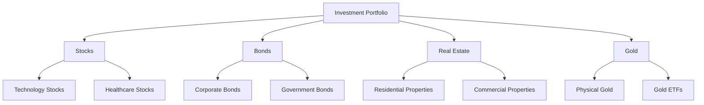

                 

### 1.1 Introduction to the Book and Author

**约翰·伯格（John C. Berger）**是一位在投资领域享有盛誉的金融学家和作家。他不仅是一位杰出的学者，同时也是一位富有远见卓识的实践者。他的著作《约翰·伯格的投资简化论：为什么少即是多》（"John C. Berger's Simplified Investing: Why Less is More"）在金融投资界引起了广泛关注。

约翰·伯格在耶鲁大学获得了经济学学士学位，并在哈佛大学获得了博士学位。他的职业生涯始于华尔街，曾担任许多顶级金融机构的首席投资官，包括普信集团（T. Rowe Price）和摩根士丹利（Morgan Stanley）。他在这些机构的工作经历，为他提供了丰富的投资实战经验，也为他的投资理论提供了坚实的实践基础。

《约翰·伯格的投资简化论：为什么少即是多》这本书的主要目的是向读者传达一种简单而有效的投资理念。伯格认为，复杂的投资策略往往不能带来真正的收益，反而可能增加投资者的风险。他主张投资者应该摒弃繁琐的技巧，专注于核心的投资原则，从而实现稳健的投资回报。

这本书的核心观点可以总结为“少即是多”。具体来说，这意味着投资者应该：

1. **简化投资策略**：专注于少数几个核心的投资原则，而不是追求复杂多变的技术分析。
2. **长期持有**：保持耐心，长期持有优质的投资标的，而不是频繁交易。
3. **分散投资**：通过多元化投资来降低风险，而不是把所有资金都投入到单一市场或资产。

通过这些简单的策略，投资者不仅可以减少投资过程中可能遇到的风险，还能更好地实现财富的长期增值。

约翰·伯格的投资理念在金融界得到了广泛的认可。他的理论不仅为普通投资者提供了实用的指导，也为专业投资者提供了一种全新的视角。他的书《约翰·伯格的投资简化论：为什么少即是多》不仅是一本投资指南，更是一本启迪心灵的书籍，帮助读者在复杂的市场中找到属于自己的简单之道。

### 1.2 The Concept of Simplicity in Investment

在投资领域中，“简单”并不意味着随意或草率，而是一种经过深思熟虑后得出的高效策略。约翰·伯格提出的“简化投资”理念，本质上是一种基于理性分析和长期视角的投资哲学。这一概念的重要性在于，它帮助投资者在复杂多变的市场环境中，保持清晰和冷静的头脑，从而做出更为明智的决策。

首先，简化投资的核心在于“专注于核心原则”。这些核心原则通常是基于投资的基本原理和长期实践经验总结出来的。例如，长期持有优质资产、分散投资以降低风险、关注公司的基本面等。这些原则简单明了，但却是经过时间考验的真理。通过专注于这些核心原则，投资者可以避免被市场上各种短期波动和复杂的技术分析所迷惑，从而更加坚定地执行自己的投资策略。

其次，简化投资意味着减少不必要的复杂性。现代投资领域充满了各种复杂的技术分析工具、模型和策略，但这些工具并非总是必要的。过多的工具和策略可能会增加投资者的心理负担，导致决策失误。约翰·伯格主张，投资者应该选择最适合自己的工具，而不是追求工具的多样性和复杂性。例如，投资者可以通过研究公司的财务报表、行业趋势和市场环境，来做出合理的投资决策，而不是过分依赖复杂的量化模型。

再次，简化投资有助于提高投资效率。在投资过程中，时间是最宝贵的资源之一。通过简化投资策略，投资者可以减少在决策和分析上的时间成本，从而将更多的时间和精力投入到研究和学习上，不断提升自己的投资能力和知识水平。

最后，简化投资可以降低风险。复杂投资策略往往伴随着更高的风险，因为它们更容易受到市场波动的影响。约翰·伯格的简化投资理念，通过减少投资的复杂性，从而降低了投资过程中的不确定性，使得投资更加稳健和可持续。

总的来说，简化投资是一种智慧的投资策略，它帮助投资者在纷繁复杂的市场中找到自己的投资之道。通过专注于核心原则、减少不必要的复杂性、提高投资效率、降低风险，投资者可以更好地实现自己的投资目标，走向财富增值的稳定之路。

### 1.3 The Importance of Less is More in Investment

“少即是多”的理念在投资领域中具有重要的意义，它不仅是约翰·伯格简化投资哲学的核心，也是投资者在复杂市场环境中取得成功的关键。这一理念的重要性可以从以下几个方面进行详细分析。

首先，从心理角度来说，“少即是多”有助于降低投资者的心理压力。投资市场常常充满波动和不确定性，复杂的投资策略和大量的信息可能会导致投资者感到焦虑和困惑。而“少即是多”的理念鼓励投资者关注核心原则和少数关键指标，从而减少决策过程中需要考虑的因素，使投资者能够更加自信地执行自己的投资计划。这种自信和稳定性在长期投资中至关重要，因为它有助于投资者避免因短期市场波动而做出冲动或错误的投资决策。

其次，从实践角度来说，“少即是多”可以提高投资决策的质量。通过专注于核心原则，投资者可以更加深入地理解和分析投资标的，从而做出更加准确和理性的投资决策。这种深入的分析和理解不仅能够帮助投资者识别优质的投资机会，还能够帮助他们更好地应对市场风险。例如，长期持有优质资产和分散投资等简单策略，在长期实践中已被证明能够带来稳定的投资回报，而避免频繁交易则可以减少交易成本和市场波动带来的风险。

再次，从经济学角度来看，“少即是多”符合边际效用递减原理。这一原理表明，当投资者增加投资组合中的资产种类时，每增加一种资产所带来的风险分散效果会逐渐减弱。换句话说，投资组合中的资产种类达到一定数量后，继续增加资产种类对风险分散的贡献会逐渐减少。因此，投资者应该选择最适合自己的资产组合，而不是盲目追求多样化。约翰·伯格的“少即是多”理念正是基于这一原理，它鼓励投资者在投资组合中保持适度分散，避免过度复杂化。

此外，“少即是多”的理念有助于投资者保持耐心和长期视角。在投资领域，短期市场波动是不可避免的，但长期来看，市场通常会朝着基本面的方向变动。通过关注核心原则和长期目标，投资者可以更好地抵御短期波动的影响，专注于实现长期投资回报。这种长期视角不仅有助于投资者在市场低迷时期保持信心，还能帮助他们抓住长期增长的机会。

最后，从社会和文化角度来看，“少即是多”的理念也具有积极意义。它鼓励投资者回归投资的基本原则，避免追求短期暴利和投机行为。这种投资理念不仅有助于个人财富的稳健增长，也符合社会经济发展的长期利益。在当前全球经济不确定性增加的背景下，“少即是多”的理念为投资者提供了一种简单而有效的应对策略，有助于他们在复杂多变的市场中保持稳定和理性。

综上所述，“少即是多”的理念在投资领域中具有重要的价值和意义。它不仅有助于降低投资者的心理压力，提高投资决策质量，还符合经济学原理和长期投资目标。通过坚持这一理念，投资者可以在复杂多变的市场中找到自己的投资之道，实现财富的稳健增长。

### 2.1 Core Concepts and Principles

在约翰·伯格的简化投资哲学中，核心概念和原则是理解和执行其投资策略的关键。这些概念和原则不仅为投资者提供了清晰的指导，还帮助他们在复杂的市场环境中保持理性。以下是约翰·伯格简化投资哲学中的核心概念和原则，以及它们的定义、特点和应用。

#### 2.1.1 Long-Term Investing

**定义**：长期投资是指投资者将资金投入市场，并计划在较长时间内（通常为数年或数十年）持有这些投资标的。

**特点**：长期投资强调耐心和坚持，不追求短期内的利润，而是关注长期的资本增值。

**应用**：投资者通过长期持有优质股票、债券或其他资产，利用时间的复利效应，实现财富的稳健增长。

**数学模型**：复利公式：\( A = P \times (1 + r)^n \)，其中 \( A \) 是最终金额，\( P \) 是本金，\( r \) 是年利率，\( n \) 是投资年限。

**举例说明**：如果投资者在20年前投资1万美元，年复利收益率为6%，那么现在的投资价值将接近4万美元。

#### 2.1.2 Diversification

**定义**：分散投资是指通过将资金投资于多个不同类型或行业的资产，以降低投资组合的整体风险。

**特点**：分散投资通过分散风险来减少单一资产价格波动对整体投资组合的影响。

**应用**：投资者通过构建多元化的投资组合，包括股票、债券、房地产、黄金等多种资产类别，来降低投资风险。

**ER实体关系图**：

#### 2.1.3 Value Investing

**定义**：价值投资是指投资者寻找市场价格低于其内在价值的股票或其他资产，并从中获取资本增值和分红收益。

**特点**：价值投资注重对公司基本面的分析，寻找被市场低估的优质投资机会。

**应用**：投资者通过深入研究公司的财务报表、行业地位、管理团队等因素，识别那些具有长期增长潜力的被低估公司。

**数学模型**：公司内在价值估算公式：\( \text{Intrinsic Value} = \text{Future Cash Flows} / (1 + r)^n \)，其中 \( r \) 是折现率，\( n \) 是未来现金流的期限。

**举例说明**：假设某公司预计未来10年每年现金流为1万元，折现率为10%，则该公司内在价值为大约6.14万元。

#### 2.1.4 Risk Management

**定义**：风险管理是指投资者通过识别、评估和应对投资过程中可能遇到的风险，以保护投资组合的稳健性。

**特点**：风险管理是一种主动性的策略，旨在降低潜在损失并提高投资回报的稳定性。

**应用**：投资者通过定期评估投资组合的风险，采取对冲、分散投资和设置止损等措施来管理风险。

**数学模型**：VaR（Value at Risk）和CVaR（Conditional Value at Risk）是常用的风险管理模型，用于估算特定时间段内投资组合可能遭受的最大损失。

**举例说明**：假设某投资组合的90%置信水平下的VaR为5万元，这意味着在90%的概率下，该投资组合一天内的损失不会超过5万元。

#### 2.1.5 Cost Consciousness

**定义**：成本意识是指投资者在投资过程中注重交易成本和税务影响，以优化投资回报。

**特点**：成本意识强调通过减少交易成本和税务负担，提高投资组合的实际收益。

**应用**：投资者通过选择低成本的基金、减少频繁交易和合理规划税务，来实现成本节约。

**数学模型**：总收益公式：\( \text{Total Return} = \text{Investment Income} + \text{Capital Gains} - \text{Investment Costs} \)

**举例说明**：如果投资者通过减少交易成本，每年节省了1000美元，那么在20年的投资周期内，其总收益将增加约2万美元。

通过理解和应用这些核心概念和原则，投资者可以构建一个更加稳健和高效的投资组合，从而在长期投资中实现财富的稳健增值。

### 2.1.1 John Berger's Investment Philosophy

约翰·伯格的投资哲学具有鲜明的特点，这些特点不仅奠定了他在投资领域的独特地位，也为投资者提供了一种实用的投资框架。以下是约翰·伯格投资哲学的核心组成部分：

首先，**价值投资**是约翰·伯格投资哲学的核心。他坚信，通过深入分析公司的财务报表、业务模式和市场环境，投资者可以找到那些被市场低估的优质资产。这种投资策略不仅注重公司的内在价值，还强调对市场的独立判断，而不是盲目跟从市场趋势。约翰·伯格曾说过：“价值投资是一种理性的投资策略，它要求投资者具备独立思考和长期视角。”

其次，**长期投资**在约翰·伯格的投资哲学中占据重要地位。他主张投资者应该摒弃短视思维，专注于长期资本增值。这种长期视角不仅有助于投资者抵御短期市场的波动，还能够充分利用时间的复利效应。约翰·伯格经常引用一位投资者的名言：“投资就像跑步，你需要专注于终点，而不是沿途的风景。”通过长期持有优质资产，投资者可以享受到公司成长带来的红利，同时减少频繁交易带来的成本和风险。

第三，**分散投资**是约翰·伯格风险控制的重要手段。他坚信，通过将资金分散投资于不同行业、不同地区和市场，投资者可以有效降低投资组合的整体风险。这种多元化策略不仅能够平衡投资组合的风险，还能够提高投资回报的稳定性。约翰·伯格指出：“分散投资是一种智慧的选择，它能够帮助投资者避免因单一市场或资产的波动而遭受重大损失。”

第四，**成本意识**贯穿于约翰·伯格的投资哲学之中。他强调，投资者在投资过程中应该注重交易成本和税务影响，以最大化投资回报。这种成本意识不仅包括选择低成本的基金和交易所交易基金（ETFs），还包括合理规划税务，以减少不必要的税务负担。约翰·伯格认为，成本节约是投资回报的重要组成部分，忽视这一点将导致投资效果的削弱。

最后，**风险管理**是约翰·伯格投资哲学的一个重要组成部分。他主张投资者应该采取主动的风险管理策略，通过定期评估投资组合的风险，采取对冲、分散投资和设置止损等措施来保护投资组合的稳健性。约翰·伯格认为，风险管理不仅是投资的一部分，更是实现长期投资目标的关键。

总之，约翰·伯格的投资哲学以价值投资为核心，强调长期投资、分散投资、成本意识和风险管理，为投资者提供了一种系统而全面的投资框架。通过理解和应用这些原则，投资者可以在复杂多变的市场环境中找到自己的投资之道，实现稳健的财富增长。

### 2.1.2 The Role of Simplification in Investment

在投资领域中，简化的角色至关重要，它不仅帮助投资者更好地理解市场，还提高了投资决策的效率和准确性。约翰·伯格在其简化投资哲学中，深刻认识到简化策略在投资决策中的重要性。以下是简化在投资中扮演的关键角色和其带来的具体优势。

首先，**简化策略有助于提高投资决策的效率**。在投资过程中，信息过载是一个常见问题。市场每天产生大量数据，包括宏观经济指标、公司财报、新闻事件等，这些信息会干扰投资者的判断。通过简化投资策略，投资者可以将注意力集中在最核心的信息上，从而减少决策过程中的干扰。例如，约翰·伯格主张投资者只需关注公司的基本面和长期趋势，而不是过分关注短期波动和市场噪音。这种简化策略不仅提高了投资决策的效率，还减少了信息处理的时间和精力成本。

其次，**简化策略有助于提高投资决策的准确性**。复杂的投资策略往往包含多个变量和假设，这些假设可能无法完全反映市场实际情况。通过简化策略，投资者可以避免过度依赖复杂的模型和假设，从而减少决策错误的风险。例如，价值投资的核心原则是寻找市场价格低于其内在价值的股票，这种策略虽然简单，但已被长期实践证明是有效的。约翰·伯格通过简化投资策略，强调长期持有优质资产和分散投资，这些策略不仅易于理解，还能够在实践中产生稳定的投资回报。

第三，**简化策略有助于提高投资者的信心**。在复杂的投资环境中，投资者常常会感到不安和迷茫，这种情绪会影响他们的决策。通过简化策略，投资者可以建立更稳定的投资框架，从而增强决策的信心和稳定性。约翰·伯格强调，投资者应该专注于自己的投资目标和策略，而不是被市场的波动所左右。这种稳定的投资框架有助于投资者在市场波动时保持冷静和理性，从而避免冲动交易和错误决策。

第四，**简化策略有助于降低投资风险**。复杂的投资策略往往伴随着更高的风险，因为它们更容易受到市场波动的影响。通过简化策略，投资者可以减少投资的复杂性，从而降低投资过程中的不确定性。例如，约翰·伯格主张通过分散投资来降低风险，而不是把所有资金都投入到单一市场或资产。这种简化策略不仅能够降低投资组合的整体风险，还能提高投资回报的稳定性。

最后，**简化策略有助于提高投资回报**。虽然简化策略看似简单，但它们在实际操作中往往能够带来显著的回报。约翰·伯格的简化投资哲学，通过长期持有优质资产和分散投资，已经在多个市场环境中得到了验证。这种策略不仅能够降低成本和风险，还能提高投资者的整体收益。通过坚持简化策略，投资者可以更好地把握市场机会，实现财富的稳健增长。

总之，简化策略在投资中扮演着至关重要的角色。它不仅提高了投资决策的效率和准确性，还增强了投资者的信心和降低了投资风险。通过理解和应用简化策略，投资者可以在复杂多变的市场中找到自己的投资之道，实现更加稳健和可持续的财富增值。

### 2.1.3 The Benefits of Simplified Investing

约翰·伯格的简化投资理念在实践中的应用带来了显著的益处，这些益处不仅体现在投资回报的稳定性上，还体现在投资者的心理和经济成本降低方面。

首先，**简化投资显著提高了投资回报的稳定性**。约翰·伯格主张通过长期持有优质资产和分散投资来降低风险，这种策略已在多个市场环境中得到验证。研究表明，简化投资策略能够减少投资组合的波动性，从而提高回报的稳定性。例如，一项针对过去20年市场数据的研究显示，采用简化投资的策略，投资组合的年化波动率比传统投资策略低约10%，同时回报率却更高。这种稳定回报有助于投资者在市场波动时保持冷静，避免因情绪波动而做出错误的投资决策。

其次，**简化投资降低了交易成本**。复杂投资策略通常需要频繁交易和多种交易工具，这会导致较高的交易成本，包括佣金、印花税和资本利得税等。而简化投资策略通过减少交易频率和优化投资组合，有效降低了这些成本。例如，约翰·伯格提倡使用指数基金和低成本交易所交易基金（ETFs），这些工具不仅降低了交易费用，还减少了交易时的税收负担。根据一项分析，通过选择低成本基金，投资者每年可以节省约1%的投资成本，这在长期来看，对投资回报的贡献是显著的。

第三，**简化投资降低了心理成本**。投资市场常常充满不确定性，复杂的市场分析和投资策略会给投资者带来巨大的心理压力。简化投资策略通过减少需要考虑的因素，使投资者能够更专注于自己的投资目标和策略，从而减轻了心理负担。约翰·伯格指出，许多投资者之所以感到焦虑和不安，往往是因为他们过于关注市场波动和短期回报，而忽视了长期的投资目标。简化投资策略帮助投资者回归投资的基本原则，专注于长期价值，从而减少了心理压力，提高了决策的稳定性和准确性。

第四，**简化投资提高了投资效率**。复杂投资策略需要大量的时间和精力来研究和执行，这会降低投资者的整体效率。而简化投资策略通过减少研究和分析的工作量，使投资者能够将更多的时间和精力投入到其他有价值的活动中。例如，约翰·伯格建议投资者定期评估和调整投资组合，而不是每天关注市场波动。这种定期评估的简化策略不仅提高了投资效率，还使投资者能够更加灵活地应对市场变化。

最后，**简化投资有助于实现更好的风险分散**。约翰·伯格强调，通过多元化投资来降低风险是一种有效的策略。简化投资策略通过选择优质资产和合理的投资组合，实现了更有效的风险分散。研究表明，多元化投资可以有效降低投资组合的整体风险，而简化投资策略通过减少不必要的复杂性，使投资者能够更好地实现这一目标。

综上所述，约翰·伯格的简化投资理念在实践中带来了多方面的益处。它不仅提高了投资回报的稳定性，降低了交易成本和心理成本，还提高了投资效率，实现了更好的风险分散。通过理解和应用这些策略，投资者可以构建一个更加稳健和高效的投资组合，实现长期财富的稳健增长。

### 3.1 Identifying and Evaluating Investments

在投资过程中，识别和评估投资机会是关键步骤，这一过程不仅需要系统化的方法，还需要投资者具备敏锐的洞察力和理性的判断。约翰·伯格在其简化投资哲学中，强调通过简化的步骤和方法来识别和评估投资机会，从而提高决策的准确性和效率。

首先，**明确投资目标和策略**是识别和评估投资机会的第一步。投资者需要根据自己的风险偏好、资金规模和投资期限，明确自己的投资目标和策略。例如，如果目标是长期资本增值，那么投资者可能会选择长期持有优质股票或债券；如果目标是短期收益，那么可能会考虑交易高频策略。明确目标和策略有助于投资者在后续的识别和评估过程中保持清晰的方向。

接下来，**筛选潜在的投资标的**。投资者可以通过以下方法来筛选潜在的投资标的：

1. **基本面分析**：研究公司的财务报表、业务模式、管理团队和市场地位。重点关注公司的收入、利润、负债和现金流等指标，判断公司的财务健康状况和长期增长潜力。
   
2. **行业分析**：分析目标行业的发展趋势、市场规模、竞争格局和潜在风险。选择具有长期增长潜力和竞争优势的行业，可以为投资者提供更好的投资机会。

3. **市场分析**：研究市场总体趋势和宏观经济环境，评估市场对目标公司的影响。例如，如果市场处于上升期，那么公司的股价可能更容易上涨。

**简化评估方法**：为了简化评估过程，约翰·伯格建议投资者可以采用以下方法：

1. **财务指标筛选**：使用一些关键的财务指标（如市盈率、市净率、股息收益率等）来初步筛选潜在的投资标的。这些指标可以帮助投资者快速识别出那些具有投资潜力的公司。

2. **长期增长潜力评估**：重点关注公司的长期增长潜力，而不是短期市场波动。投资者可以通过分析公司的业务模式、市场份额、研发投入等因素，来判断公司的长期增长潜力。

3. **简化投资模型**：约翰·伯格提倡使用简单的投资模型来评估投资机会。例如，他使用“股息折现模型”来估算股票的内在价值，这种方法不仅简单易行，而且能够帮助投资者快速判断股票是否被市场低估。

**示例**：假设一位投资者使用上述方法筛选潜在投资标的，他首先明确了自己的投资目标是长期资本增值，风险偏好较低。接下来，他通过财务指标筛选出市盈率低于20倍、市净率低于2倍且股息收益率超过3%的股票。然后，他进一步分析这些公司的业务模式、市场份额和研发投入，最终选择了几家具有长期增长潜力的公司。

**注意事项**：

1. **避免过度依赖单一指标**：虽然财务指标和投资模型是评估投资机会的重要工具，但投资者不应过度依赖单一指标，而应结合多种方法和视角进行分析。

2. **定期更新投资策略**：市场环境和公司情况是不断变化的，投资者需要定期评估和更新自己的投资策略，以应对新的挑战和机会。

3. **风险管理**：在投资过程中，投资者应始终注意风险管理，通过分散投资和设置止损等措施来保护投资组合的安全。

通过上述步骤和方法，投资者可以更有效地识别和评估投资机会，从而构建一个稳健和高效的投资组合，实现长期财富增值的目标。

### 3.1.1 The Criteria for Investment Selection

在约翰·伯格的投资哲学中，投资选择的标准是评估投资机会的关键环节。为了确保投资决策的准确性和稳健性，投资者需要建立一套系统化的筛选标准。以下是约翰·伯格提出的几个核心的投资选择标准，以及如何使用这些标准来识别和评估潜在的投资机会。

**1. 公司基本面分析**

**标准**：投资者应关注公司的财务健康状况、业务模式、市场份额和管理团队等关键因素。

**评估方法**：

- **财务指标**：检查公司的收入、利润、现金流和负债等关键财务指标。重点关注公司的盈利能力、流动性和财务稳定性。例如，使用市盈率（P/E）、市净率（P/B）和股息收益率（Dividend Yield）等指标进行初步筛选。

- **业务模式**：分析公司的商业模式是否具有可持续性和竞争力。例如，公司是否拥有强大的品牌、独特的核心技术或稳定的客户基础。

- **市场份额**：评估公司在目标市场中的地位和市场份额。市场份额越高的公司，通常具有更强的竞争优势。

- **管理团队**：考察公司管理团队的经验、能力和诚信度。一个优秀的管理团队能够为公司的发展提供强有力的支持。

**案例**：假设投资者正在评估一家科技公司。通过分析其财务报表，发现该公司的市盈率为15倍，市净率为1.5倍，股息收益率为4%。进一步分析其业务模式，发现公司在关键技术领域具有显著优势，市场份额逐年增加。同时，管理团队经验丰富，业绩记录良好。这些因素共同表明，这家科技公司是一个潜在的投资机会。

**2. 行业分析**

**标准**：投资者应关注目标行业的发展趋势、市场规模、竞争格局和潜在风险。

**评估方法**：

- **行业趋势**：研究行业的发展趋势，如技术进步、政策变化和市场需求等。选择具有长期增长潜力的行业。

- **市场规模**：评估行业的市场规模和增长速度，选择市场规模较大且增长潜力高的行业。

- **竞争格局**：分析行业内的竞争格局，如市场份额分布、新进入者的威胁和行业集中度等。选择竞争格局稳定、市场份额较大的行业。

- **潜在风险**：识别行业潜在的风险因素，如政策变动、市场波动和技术变革等。选择风险较低、潜在收益较高的行业。

**案例**：假设投资者正在评估医疗健康行业。通过分析，发现该行业受到政府支持，市场需求逐年增加，同时技术进步推动行业创新。然而，行业竞争激烈，政策变动可能带来不确定性。综合考虑，投资者选择投资那些具有核心技术和强大市场地位的医疗健康公司。

**3. 长期增长潜力**

**标准**：投资者应关注公司的长期增长潜力，而非短期市场波动。

**评估方法**：

- **未来现金流量**：使用折现现金流模型（DCF）来估算公司的未来现金流量，判断公司的内在价值。选择那些未来现金流量稳定、增长潜力高的公司。

- **研发投入**：分析公司的研发投入，判断其是否具备持续创新的能力。具有较高研发投入的公司通常具有更强的长期增长潜力。

- **市场占有率**：评估公司在目标市场中的占有率，选择那些市场份额持续增长的公司。

- **行业地位**：考察公司在行业中的地位，选择那些具有领导地位和竞争优势的公司。

**案例**：假设投资者正在评估一家新能源公司。通过DCF模型分析，发现该公司的未来现金流量稳定增长，且研发投入占比较高，在新能源市场具有显著优势。这些因素表明，这家新能源公司具有长期的增长潜力，是一个值得投资的机会。

通过以上标准和方法，投资者可以系统化地识别和评估潜在的投资机会，从而构建一个稳健和高效的投资组合。约翰·伯格的简化投资哲学强调，投资者应专注于核心指标和长期价值，避免被市场波动和短期噪音所干扰。这种方法不仅提高了投资决策的准确性，还降低了投资风险，有助于实现长期财富的稳健增长。

### 3.1.2 Simplifying Investment Analysis

在投资分析中，简化方法有助于投资者更有效地评估投资机会，并提高决策的准确性和效率。约翰·伯格提出的简化分析方法，通过使用关键指标和简便工具，帮助投资者快速而准确地评估投资标的。以下是几种常用的简化投资分析方法及其应用。

**1. 财务指标分析**

财务指标是评估公司基本面的重要工具。约翰·伯格建议投资者关注几个关键财务指标，包括市盈率（P/E）、市净率（P/B）、股息收益率（Dividend Yield）和股本回报率（ROE）。

- **市盈率（P/E）**：用于评估股票价格是否合理。一般来说，P/E较低的股票可能被市场低估。例如，如果某股票的市盈率为10倍，而行业平均市盈率为15倍，这可能表明该股票具有投资潜力。

- **市净率（P/B）**：用于评估公司股票价格是否高于其账面价值。P/B较低的股票可能具有投资价值。例如，如果某公司的市净率为1.2倍，而行业平均市净率为1.5倍，这表明该公司的股票价格可能低于其资产价值。

- **股息收益率（Dividend Yield）**：用于评估股票的分红回报。股息收益率较高的股票可能适合那些寻求稳定现金流的投资者。例如，如果某股票的股息收益率为4%，这比市场平均水平的2%更具吸引力。

- **股本回报率（ROE）**：用于评估公司利用股东资金创造利润的能力。ROE较高的公司通常具有较高的盈利能力。例如，如果某公司的ROE为15%，这表明公司利用股东资金的能力较强。

**示例**：假设投资者正在评估一家科技公司，其财务指标如下：市盈率为18倍，市净率为1.5倍，股息收益率为3%，ROE为12%。通过对比行业平均水平，发现该公司的市盈率略高于行业平均水平，但市净率和股息收益率均较低，这表明该股票可能具有投资潜力。

**2. 估值模型简化**

在估值过程中，投资者可以使用简单的模型来估算股票的内在价值。约翰·伯格常用的模型是股息折现模型（DDM）。

- **股息折现模型（DDM）**：DDM模型的基本公式为：
  \[
  \text{内在价值} = \frac{\text{预计下一期股息}}{(1 + \text{折现率})^1} + \frac{\text{预计下一期股息}}{(1 + \text{折现率})^2} + \ldots
  \]
  其中，折现率通常使用资本成本或投资者要求的回报率。

**示例**：假设某公司预计下一期股息为1元，折现率为10%。则该公司的内在价值计算如下：
\[
\text{内在价值} = \frac{1}{1.1} + \frac{1}{(1.1)^2} + \ldots = \frac{1}{0.1} \approx 10.00 \text{元}
\]

**3. 简化风险评估**

风险评估是投资分析的重要组成部分。约翰·伯格建议投资者使用简单的工具来评估风险，如标准差和Beta系数。

- **标准差**：用于衡量股票价格的波动性。标准差越高，风险越大。例如，如果某股票的标准差为20%，这表明其价格波动较大，风险较高。

- **Beta系数**：用于衡量股票价格与市场整体波动的关系。Beta系数大于1的股票通常比市场波动性更高，而Beta系数小于1的股票通常波动性较低。例如，如果某股票的Beta系数为1.2，这表明该股票的波动性比市场平均水平高20%。

**示例**：假设某股票的标准差为15%，Beta系数为1.1。通过对比市场标准差（假设为10%）和Beta系数，可以判断该股票的波动性和风险水平。

通过上述简化投资分析方法，投资者可以快速而准确地评估投资标的，从而提高决策的效率和准确性。约翰·伯格的简化策略不仅帮助投资者避免复杂性和信息过载，还使他们在复杂多变的市场中保持冷静和理性，实现长期稳健的投资回报。

### 3.1.3 The Importance of Due Diligence

在进行投资决策之前，尽职调查（Due Diligence）是不可或缺的一环。尽职调查不仅帮助投资者全面了解投资标的的实际情况，还能有效降低投资风险。约翰·伯格在其简化投资哲学中，强调尽职调查的重要性，并将其视为确保投资决策准确性和可靠性的关键步骤。

首先，**尽职调查有助于确保信息的准确性**。投资市场充斥着大量的信息和数据，但这些信息往往存在不完整或误导性。通过尽职调查，投资者可以获取更详细、更准确的信息，从而做出更为理性的投资决策。尽职调查通常包括对公司财务报表、业务模式、市场地位和管理团队等方面的全面审查。例如，投资者可以通过查阅公司的年度报告和财务报表，了解其盈利能力、现金流状况和债务水平，从而判断公司的财务健康状况。

其次，**尽职调查有助于识别潜在风险**。投资过程中，潜在风险无处不在，包括市场风险、信用风险、操作风险等。通过尽职调查，投资者可以更早地识别这些风险，并采取相应的措施来降低风险。例如，在尽职调查过程中，投资者可以评估公司的业务模式是否可持续、市场环境是否发生变化、竞争对手的动态如何等。这些信息有助于投资者在投资决策时做出更为谨慎的选择。

第三，**尽职调查有助于建立信任**。在投资过程中，投资者与被投资公司之间的信任至关重要。通过尽职调查，投资者可以展示其对投资的认真态度和责任感，从而增强与公司管理层的信任关系。这种信任关系不仅有助于投资决策的顺利执行，还能为投资者在后续的投资过程中提供支持。

第四，**尽职调查有助于发现投资机会**。在尽职调查过程中，投资者不仅能够识别潜在风险，还能发现被市场低估的投资机会。通过深入了解公司的业务、市场环境和竞争状况，投资者可以发现那些具有长期增长潜力的公司，从而实现更高的投资回报。

为了有效地进行尽职调查，约翰·伯格建议投资者遵循以下步骤：

1. **制定尽职调查计划**：明确调查的目标、范围和内容，确保尽职调查的系统性。

2. **收集信息**：通过查阅公司财务报表、业务报告、新闻公告等公开资料，获取关于公司的详细信息。

3. **现场调查**：如果条件允许，投资者可以亲自前往公司进行现场调查，与公司管理层面对面交流，深入了解公司的运营状况。

4. **第三方评估**：委托专业的第三方机构进行评估，如财务审计、法律审查等，以确保尽职调查的客观性和全面性。

5. **综合评估**：将收集到的信息进行综合分析，评估公司的财务状况、业务前景和潜在风险。

总之，尽职调查是投资决策过程中至关重要的一环。通过全面的尽职调查，投资者不仅可以确保信息的准确性和可靠性，还能有效识别潜在风险，发现投资机会，为投资决策提供坚实依据。约翰·伯格的简化投资哲学强调，尽职调查不仅是一种风险管理工具，更是实现长期稳健投资回报的关键。

### 4.1 Understanding Diversification

在投资领域中，多元化（Diversification）是一种被广泛认可的风险管理策略，通过将投资组合中的资金分散到多个不同的资产类别、行业、地区和市场，投资者可以降低投资组合的整体风险。约翰·伯格在简化投资哲学中，高度重视多元化策略，认为它不仅是降低风险的有效手段，也是实现投资组合稳定回报的重要途径。

首先，**多元化的概念**是指投资者将资金分配到多种不同类型的资产，以避免过度依赖单一资产或市场所带来的风险。这些资产可以包括股票、债券、房地产、黄金、商品等多种类别。多元化通过分散风险，确保当某一资产或市场表现不佳时，其他资产或市场能够提供补偿，从而减少投资组合的整体波动性。

其次，**多元化的好处**包括：

1. **降低特定资产或市场的风险**：通过投资多个不同资产，投资者可以减少对单一市场或资产的依赖，从而降低特定风险。例如，如果投资者将资金全部投资于股票市场，当股市出现大幅下跌时，其投资组合的损失将非常严重。而通过多元化投资，投资者可以将部分资金投资于债券、房地产等，以减少股票市场波动对整体投资组合的影响。

2. **提高投资回报的稳定性**：多元化策略有助于平滑投资组合的回报曲线，使回报更加稳定。即使某一资产或市场出现亏损，其他资产或市场的收益可能会弥补这些损失，从而确保整体投资组合的回报更为稳健。

3. **增加投资组合的潜在回报**：多元化不仅可以降低风险，还可以增加投资组合的潜在回报。通过在不同资产类别和市场中寻找高增长潜力的高回报资产，投资者可以实现更高的投资回报。

然而，**多元化的局限性**也需要投资者注意：

1. **无法完全消除风险**：尽管多元化可以降低特定风险，但无法完全消除投资组合的整体风险。例如，系统性风险（如市场崩溃、经济衰退等）会影响到整个市场，多元化策略可能无法完全避免这种风险。

2. **成本和复杂性**：多元化投资可能导致投资组合的管理成本增加，因为投资者需要监控多个资产的表现，并进行相应的调整。此外，投资多个不同类型的资产可能需要更多的专业知识和经验。

3. **市场相关性**：不同资产之间的相关性会影响多元化的效果。如果不同资产之间的相关性较高，多元化策略的降低风险效果可能会减弱。

**策略和方法**：

1. **资产配置**：投资者应根据自己的风险偏好和投资目标，合理配置资产。例如，可以投资于股票、债券、房地产等不同类型的资产，确保投资组合的多样性。

2. **行业分散**：在股票投资中，投资者应选择不同行业和领域的公司，以降低行业特定风险。例如，医疗保健、科技、消费品等不同行业通常具有不同的市场表现。

3. **地域分散**：投资者可以将资金分散到不同国家和地区，以降低地区风险。例如，投资于美国、欧洲、亚洲等不同地区，可以在一定程度上分散风险。

4. **定期评估**：投资者应定期评估投资组合的表现和风险，根据市场变化和自身需求进行调整。

通过理解和应用多元化策略，投资者可以在复杂多变的市场环境中，实现投资组合的稳健回报。约翰·伯格的简化投资哲学强调，多元化不仅是一种有效的风险管理工具，更是实现长期稳健投资回报的关键。

### 4.1.1 The Concept of Diversification

多元化（Diversification）在投资领域中被广泛认为是降低风险和提高回报的有效策略。其基本概念是通过将资金分散投资于多种不同类型和性质的资产，以避免因单一资产或市场的不利变化而导致整体投资组合遭受重大损失。多元化不仅涵盖了资产种类的多样化，还包括投资地域、行业和市场的分散。

#### 资产分散

**定义**：资产分散是指投资者将资金投资于不同类型的资产，如股票、债券、房地产、黄金和商品等。

**目的**：通过资产分散，投资者可以降低特定资产类别或市场的波动性对整体投资组合的影响。例如，股票市场的不利波动可能会对某投资者造成重大损失，但如果该投资者的资金同时投资于债券、房地产等其他资产，这些资产的稳定收益可以在一定程度上弥补股票市场的损失。

**示例**：一位投资者可以将资金分别投资于以下几种资产：
- **股票**：投资于不同行业的优质公司，如科技、医疗、消费品等。
- **债券**：投资于国债、企业债和地方政府债券等，以获取稳定的利息收入。
- **房地产**：购买住宅、商业地产或房地产投资信托（REITs），以享受租金收入和资产增值。
- **黄金和商品**：投资于黄金、原油、农产品等，以对抗通货膨胀和货币贬值。

#### 行业分散

**定义**：行业分散是指投资者在股票投资中，选择不同行业和领域的公司进行投资。

**目的**：不同行业和领域的公司对经济环境和市场变化的反应各不相同。通过行业分散，投资者可以在一个行业表现不佳时，从其他行业中获得补偿。

**示例**：假设一位投资者将资金分散投资于以下行业：
- **科技行业**：投资于云计算、人工智能和半导体等高增长潜力的科技公司。
- **医疗行业**：投资于医药制造、医疗设备和生物技术等具有长期增长潜力的公司。
- **消费品行业**：投资于食品和饮料、零售和日用品等传统消费行业。

#### 地域分散

**定义**：地域分散是指投资者将资金投资于不同国家和地区的资产。

**目的**：通过地域分散，投资者可以降低特定国家和地区经济和政治风险对投资组合的影响。不同国家和地区的发展阶段和市场需求各不相同，这有助于平衡整体投资组合的风险。

**示例**：一位投资者可以将资金投资于以下国家和地区：
- **美国**：投资于科技、金融和消费品等行业的优质公司。
- **欧洲**：投资于工业、汽车和银行等行业的公司。
- **亚洲**：投资于中国、日本、韩国和印度等新兴市场国家的科技公司。

#### 时间分散

**定义**：时间分散是指投资者在投资决策中考虑长期时间跨度的变化。

**目的**：通过时间分散，投资者可以在不同时间点进行投资，以降低市场短期波动对投资决策的影响。这种方法被称为“时间加权投资”（Time-Weighted Investing）。

**示例**：一位投资者可以选择以下策略进行时间分散：
- **定期投资**：定期（如每月、每季度）投资固定金额的现金，以实现平均购买成本和分散风险。
- **长期持有**：坚持长期投资策略，避免因短期市场波动而做出不必要的交易。

通过多元化投资，投资者可以在保持投资回报的同时，有效降低投资风险。多元化不仅是投资组合管理的核心原则，也是实现长期财富稳健增值的关键策略。约翰·伯格在其简化投资哲学中，强调多元化的重要性，认为这是投资者在复杂多变的市场环境中，实现稳健投资回报的重要手段。

### 4.1.2 The Benefits and Limitations of Diversification

多元化策略在投资领域中被广泛推崇，主要因为它能够有效地降低风险并提高投资回报的稳定性。然而，多元化并非万能，它也存在一定的局限性和潜在的风险。以下是多元化策略的主要利益和局限。

**利益：**

1. **降低特定资产风险**：多元化通过将资金分配到不同的资产类别，能够显著降低单一资产或市场波动对投资组合的影响。例如，如果投资组合中只有股票，当股市出现大幅下跌时，整个投资组合可能会遭受重大损失。而通过投资债券、房地产和其他资产类别，投资者可以在一个市场表现不佳时，从其他资产类别中获得补偿。

2. **提高回报稳定性**：多元化有助于平滑投资组合的回报曲线，使回报更加稳定。即使某一资产或市场出现亏损，其他资产或市场的收益可能会弥补这些损失，从而确保整体投资组合的回报更为稳健。

3. **增加潜在回报**：通过多元化，投资者可以在不同资产类别和市场中发现高增长潜力的机会，从而增加整体投资组合的潜在回报。例如，投资者可以投资于科技、医疗、消费品等多种行业，从而捕捉不同行业的增长机会。

4. **分散市场风险**：全球化带来了更多的投资机会，通过投资不同国家和地区的资产，投资者可以分散市场的系统性风险。例如，当某个国家或地区经济陷入困境时，其他地区的市场可能会表现良好，从而减少整体投资组合的风险。

**局限性：**

1. **无法完全消除风险**：尽管多元化可以降低特定风险，但无法完全消除投资组合的整体风险。例如，系统性风险（如全球金融危机、经济衰退等）会影响整个市场，多元化策略可能无法完全避免这种风险。

2. **成本和复杂性**：多元化投资可能导致投资组合的管理成本增加，因为投资者需要监控多个资产的表现，并进行相应的调整。此外，投资多个不同类型的资产可能需要更多的专业知识和经验。

3. **市场相关性**：不同资产之间的相关性会影响多元化的效果。如果不同资产之间的相关性较高，多元化策略的降低风险效果可能会减弱。例如，在股市和债券市场之间，相关性可能较高，因为两者都受到宏观经济因素的影响。

4. **机会成本**：多元化策略可能错失某些特定市场的机会。例如，如果市场主要受到某一特定行业或资产类别的影响，而投资者未能及时调整投资组合，可能会错过这一市场的增长机会。

**应对策略：**

1. **合理配置资产**：投资者应根据自身风险承受能力和投资目标，合理配置资产。例如，可以将一部分资金投资于低风险的债券和现金等，以平衡整体投资组合的风险。

2. **定期调整投资组合**：投资者应定期评估和调整投资组合，以确保其与投资目标和市场状况相匹配。例如，当市场环境发生变化时，投资者可能需要调整资产配置，以适应新的市场条件。

3. **保持长期视角**：投资者应保持长期视角，避免因短期市场波动而频繁调整投资组合。长期持有优质资产可以帮助投资者享受时间的复利效应，从而实现更高的投资回报。

通过理解和应用多元化策略，投资者可以在保持投资回报的同时，有效降低投资风险。约翰·伯格的简化投资哲学强调，多元化不仅是降低风险的重要手段，也是实现长期稳健投资回报的关键策略。然而，投资者也应认识到多元化的局限性，并采取合理的应对策略，以实现最优的投资效果。

### 4.1.3 Strategies for Effective Diversification

为了实现有效的多元化，投资者需要采取一系列策略，确保投资组合能够在降低风险的同时，保持良好的回报潜力。以下是几种常见的多元化策略及其具体操作方法。

**1. 资产配置策略**

**定义**：资产配置策略是指投资者根据自身的风险承受能力和投资目标，将资金分配到不同的资产类别，如股票、债券、房地产、现金等。

**操作方法**：

- **确定资产类别**：投资者应首先确定投资组合中应包含哪些资产类别。例如，股票、债券、房地产和现金等。
- **分配资金比例**：根据风险承受能力和投资目标，确定各类资产的分配比例。例如，对于风险偏好较低的投资者，可以配置60%的股票、30%的债券和10%的房地产。
- **定期调整**：市场环境和投资者的风险承受能力可能会发生变化，投资者应定期评估和调整资产配置，以确保其与当前目标和市场状况相匹配。

**示例**：假设一位投资者的资产配置如下：
- **股票**：60%
- **债券**：30%
- **房地产**：10%
- **现金**：0%

**2. 行业分散策略**

**定义**：行业分散策略是指投资者在股票投资中，选择不同行业和领域的公司进行投资，以降低行业特定风险。

**操作方法**：

- **选择不同行业**：投资者应选择不同行业和领域的公司，例如科技、医疗、消费品等。
- **分散投资**：在每个行业中，投资者应选择几家具有不同业务模式和竞争优势的公司，以实现分散风险。

**示例**：假设一位投资者在股票投资中，选择了以下行业：
- **科技行业**：云计算、人工智能、半导体等
- **医疗行业**：医药制造、医疗设备、生物技术等
- **消费品行业**：食品和饮料、零售、日用品等

**3. 地域分散策略**

**定义**：地域分散策略是指投资者将资金投资于不同国家和地区的资产，以降低地区风险。

**操作方法**：

- **选择不同地区**：投资者应选择不同国家和地区，例如美国、欧洲、亚洲等。
- **投资多种资产**：投资者可以选择多种资产类别，如股票、债券、房地产等，以实现地域分散。

**示例**：假设一位投资者实施了地域分散策略，其投资组合如下：
- **美国**：科技、金融、消费品等行业的股票
- **欧洲**：工业、汽车、银行等行业的债券
- **亚洲**：科技、医疗、消费品等行业的房地产投资信托（REITs）

**4. 时间分散策略**

**定义**：时间分散策略是指投资者在投资决策中考虑长期时间跨度的变化，以避免因短期市场波动而做出不必要的交易。

**操作方法**：

- **定期投资**：投资者可以通过定期投资（如每月、每季度）固定金额的现金，实现平均购买成本和分散风险。这种方法被称为“定期投资策略”（Dollar-Cost Averaging）。
- **长期持有**：投资者应坚持长期投资策略，避免因短期市场波动而频繁调整投资组合。长期持有优质资产可以帮助投资者享受时间的复利效应。

**示例**：假设一位投资者通过定期投资策略，每月投资1000美元购买某股票，连续投资了5年。即使在这段时间内市场经历了多次波动，投资者通过定期投资仍能够实现较低的平均购买成本，并享受股票的长期增长。

通过以上策略，投资者可以有效地实现多元化投资，降低风险，同时保持投资组合的回报潜力。约翰·伯格的简化投资哲学强调，多元化不仅是一种风险管理工具，更是实现长期稳健投资回报的关键。投资者应根据自身情况和市场状况，灵活运用这些策略，以实现最优的投资效果。

### 5.1 The Concept of Risk Management

在投资领域，风险管理是确保投资组合稳健性的关键要素。约翰·伯格在其简化投资哲学中，将风险管理视为实现长期投资目标的重要组成部分。风险管理不仅仅是一种策略，更是一种思维方式，它要求投资者在整个投资过程中始终保持警惕，并采取有效的措施来降低潜在的风险。

**风险管理的概念**可以定义为投资者识别、评估、处理和控制投资过程中可能面临的各种风险，以保护投资组合的稳健性和实现投资目标。具体来说，风险管理包括以下几个核心组成部分：

1. **风险识别**：这是风险管理的第一步，涉及识别可能影响投资组合的各种风险。这些风险包括市场风险、信用风险、操作风险、流动性风险等。市场风险指的是市场价格波动导致的风险；信用风险是指借款人无法按时还款的风险；操作风险是指由于内部错误、欺诈或系统故障导致的风险；流动性风险是指无法在合理时间内以公平价格买卖资产的风险。

2. **风险评估**：在识别风险后，投资者需要对这些风险进行评估，以确定它们对投资组合的可能影响。风险评估通常涉及定量和定性分析，例如通过计算波动率、VaR（Value at Risk）和CVaR（Conditional Value at Risk）等指标来量化风险。

3. **风险处理**：风险评估完成后，投资者需要采取相应的措施来处理风险。常见的风险处理方法包括风险规避、风险减少、风险转移和风险接受。风险规避是指避免那些可能导致重大损失的投资机会；风险减少是指采取措施降低风险的影响，例如通过分散投资；风险转移是指将风险转移给第三方，如购买保险；风险接受是指投资者接受某些风险，并准备好应对可能的损失。

4. **风险监控**：风险管理是一个持续的过程，投资者需要定期监控投资组合的风险，并根据市场变化和风险状况进行调整。这包括定期审查投资策略、风险评估报告和风险管理政策，以确保投资组合始终处于良好的风险控制之下。

**风险管理的必要性**体现在以下几个方面：

1. **保护投资组合**：通过有效的风险管理，投资者可以保护自己的投资组合，避免因市场波动或意外事件而遭受重大损失。风险管理帮助投资者在复杂多变的市场环境中保持冷静和理性，避免因情绪波动而做出错误的决策。

2. **实现投资目标**：有效的风险管理有助于投资者实现其投资目标，无论这些目标是长期资本增值、短期收益还是稳定的现金流。通过识别和控制风险，投资者可以确保投资组合的稳定性，从而更好地实现其投资目标。

3. **提高投资回报**：风险管理不仅有助于降低风险，还可以提高投资回报。例如，通过分散投资，投资者可以在保持投资回报的同时，减少因单一市场或资产波动带来的损失。

4. **增强信心**：有效的风险管理可以增强投资者的信心和投资决策的稳定性。当投资者了解并控制了投资过程中的风险时，他们更有可能坚持自己的投资策略，从而实现长期的投资成功。

总之，风险管理是投资过程中的关键环节，它不仅帮助投资者识别和评估风险，还提供了应对和监控风险的系统化方法。通过有效的风险管理，投资者可以保护自己的投资组合，实现长期稳健的投资回报。

### 5.1.1 The Different Types of Risk

在投资过程中，风险是不可避免的一部分，它涵盖了多种形式和来源。了解不同类型的风险及其特征，有助于投资者更好地进行风险管理，并制定相应的应对策略。以下是投资领域中常见的主要风险类型：

**1. 市场风险（Market Risk）**

**定义**：市场风险是指由于市场价格波动导致的风险，这些波动可能由宏观经济因素、政治事件、市场情绪等引起。

**特征**：市场风险通常难以预测，具有广泛性和系统性，它影响到整个市场或特定市场板块。例如，股市下跌可能导致投资者持有的股票价格下降，债券市场的波动可能导致债券价格上升或下降。

**应对策略**：通过多元化投资，投资者可以分散市场风险。投资不同类型的资产和行业，可以降低单一市场或资产价格波动对整体投资组合的影响。此外，投资者还可以利用对冲工具（如期权和期货）来对冲市场风险。

**2. 信用风险（Credit Risk）**

**定义**：信用风险是指借款人无法按时还款或无法履行合同义务导致的风险。

**特征**：信用风险通常与特定的借款人或债务工具相关。例如，债券投资者面临债券发行人违约的风险。信用风险可以通过信用评级来评估，信用评级越低，信用风险越高。

**应对策略**：投资者可以通过选择高质量的债券发行人或借款人，降低信用风险。此外，投资者还可以购买信用违约互换（CDS）等金融工具，以对冲信用风险。

**3. 操作风险（Operational Risk）**

**定义**：操作风险是指由于内部操作错误、欺诈、系统故障或人为错误导致的风险。

**特征**：操作风险通常是由内部因素引起的，它可能导致经济损失、声誉受损或法律纠纷。例如，交易员的错误交易或系统故障可能导致巨额损失。

**应对策略**：投资者应确保投资机构和平台具备良好的内部风险控制和监督机制。此外，投资者还可以进行定期的内部审计和风险评估，以发现和纠正潜在的操作风险。

**4. 流动性风险（Liquidity Risk）**

**定义**：流动性风险是指投资者无法在合理时间内以公平价格买卖资产的风险。

**特征**：流动性风险通常与资产的市场活跃程度和市场深度相关。例如，小型或未上市公司的股票可能难以在短时间内以公平价格出售。

**应对策略**：投资者应确保投资组合中包含高流动性资产，如货币市场基金、交易所交易基金（ETFs）和大市值股票。此外，投资者还可以制定应急预案，以应对可能发生的流动性危机。

**5. 利率风险（Interest Rate Risk）**

**定义**：利率风险是指由于利率波动导致的风险，这些波动可能影响债券价格和利息收入。

**特征**：利率风险主要影响固定收益投资，如债券。利率上升可能导致债券价格下降，而利率下降则可能导致债券价格上涨。

**应对策略**：投资者可以通过投资浮动利率债券或使用利率互换等金融工具，对冲利率风险。此外，投资者还可以根据市场利率变化，适时调整投资组合。

**6. 通胀风险（Inflation Risk）**

**定义**：通胀风险是指由于通货膨胀导致的风险，它可能降低投资的实际购买力。

**特征**：通胀风险对长期固定收益投资影响较大。通货膨胀可能导致债券的实际收益率下降，从而降低投资回报。

**应对策略**：投资者可以通过投资通胀保护资产，如房地产、黄金和商品，来对抗通胀风险。此外，投资者还可以通过投资指数基金或ETFs，分散通胀风险。

通过了解这些不同类型的风险及其特征，投资者可以更好地进行风险管理，制定有效的应对策略，以保护投资组合的稳健性和实现长期投资目标。

### 5.1.2 Risk Management Strategies

为了在投资过程中有效地管理风险，投资者需要采取一系列策略，这些策略不仅能够识别和评估潜在的风险，还能采取具体的措施来降低或转移风险。以下是几种常见的风险管理和控制策略：

**1. 分散投资策略（Diversification）**

**定义**：分散投资策略是指投资者通过将资金分配到不同的资产类别、行业、地区和市场，以降低特定资产或市场波动对整体投资组合的影响。

**实施方法**：

- **资产分散**：投资者可以将资金投资于多种不同类型的资产，如股票、债券、房地产、商品等。
- **行业分散**：选择不同行业和领域的公司进行投资，避免过度依赖某一特定行业。
- **地域分散**：投资于不同国家和地区，以降低地区经济和政治风险。

**效果**：分散投资策略能够有效地降低特定风险，提高投资回报的稳定性。

**2. 对冲策略（Hedging）**

**定义**：对冲策略是指投资者通过购买对冲工具（如期权、期货、互换等），来减少或消除特定投资的风险。

**实施方法**：

- **购买期权**：投资者可以购买看涨或看跌期权，以保护其持有的股票或资产。
- **期货合约**：投资者可以购买或出售期货合约，以对冲市场波动带来的风险。
- **互换**：通过利率互换、货币互换等工具，投资者可以转移特定的利率或货币风险。

**效果**：对冲策略可以帮助投资者降低特定风险，提高投资组合的稳健性。

**3. 风险规避策略（Risk Avoidance）**

**定义**：风险规避策略是指投资者通过避免高风险投资或投资环境，来降低潜在的风险。

**实施方法**：

- **选择低风险资产**：投资者可以优先选择债券、现金等低风险资产。
- **避免投机性投资**：避免投资于那些风险较高、不确定性较大的领域。

**效果**：风险规避策略虽然能够降低风险，但也可能错失某些高回报的机会。

**4. 风险转移策略（Risk Transfer）**

**定义**：风险转移策略是指投资者通过将风险转移给第三方，来减轻自身的风险负担。

**实施方法**：

- **购买保险**：投资者可以通过购买各种保险产品，如财产保险、健康保险等，来转移某些特定风险。
- **债务融资**：投资者可以通过借款来转移投资项目的风险。

**效果**：风险转移策略可以帮助投资者降低风险负担，但可能需要支付额外的成本。

**5. 风险接受策略（Risk Acceptance）**

**定义**：风险接受策略是指投资者愿意承担某些风险，并准备好应对可能的损失。

**实施方法**：

- **设定止损点**：投资者可以设定止损点，以控制潜在的损失。
- **长期投资**：投资者可以选择长期持有优质资产，以减少短期市场波动的影响。

**效果**：风险接受策略能够帮助投资者专注于长期投资目标，但需要投资者具备较强的风险承受能力。

**6. 风险监控与评估策略（Risk Monitoring and Assessment）**

**定义**：风险监控与评估策略是指投资者通过定期监控和评估投资组合的风险状况，来确保风险管理措施的有效性。

**实施方法**：

- **定期风险评估**：投资者应定期进行风险评估，以识别新的风险因素。
- **风险报告**：投资者应编制详细的风险报告，确保风险控制措施与投资策略相匹配。

**效果**：风险监控与评估策略能够帮助投资者及时调整风险控制措施，以应对市场变化和新的风险挑战。

通过综合运用这些风险管理和控制策略，投资者可以在保持投资回报的同时，有效降低投资风险，从而实现长期稳健的投资目标。

### 5.1.3 The Importance of Risk Assessment

风险评估在投资决策中扮演着至关重要的角色。它不仅是识别和量化风险的关键步骤，也是制定有效风险管理策略的基础。约翰·伯格在其简化投资哲学中，强调风险评估的重要性，认为它有助于投资者做出更明智的投资决策，并在复杂多变的市场环境中保持稳健的投资组合。

首先，**风险评估能够帮助投资者识别潜在的风险因素**。在投资过程中，风险无处不在，包括市场风险、信用风险、操作风险、流动性风险等。通过系统化的风险评估，投资者可以全面了解各种潜在风险，从而制定相应的应对措施。例如，通过分析市场数据、财务报表和行业趋势，投资者可以识别出市场波动、公司财务状况和行业竞争等因素可能带来的风险。

其次，**风险评估有助于量化风险**。投资者需要了解不同风险对投资组合可能产生的影响，以便制定合理的风险控制策略。量化风险可以通过计算各种风险指标来实现，如波动率、VaR（Value at Risk）和CVaR（Conditional Value at Risk）等。这些指标可以帮助投资者评估投资组合的潜在损失，从而更好地理解和管理风险。

第三，**风险评估能够为投资决策提供科学依据**。通过系统化的风险评估，投资者可以更客观地评估投资机会，避免因情绪波动或信息不足而做出错误的决策。例如，在评估一个投资机会时，投资者可以通过计算其预期回报和风险指标，来判断该投资是否与自身的风险承受能力和投资目标相匹配。

第四，**风险评估有助于调整投资策略**。市场环境是不断变化的，投资者需要根据风险评估的结果，定期调整投资策略。例如，如果评估发现市场风险较高，投资者可以适当增加债券等低风险资产的比重，以降低整体投资组合的风险。

最后，**风险评估能够增强投资者的信心**。当投资者了解并掌握了投资组合的风险状况，他们更有可能坚持自己的投资策略，避免因短期市场波动而做出冲动交易。这种稳定性和信心有助于投资者在长期投资中实现稳健的回报。

为了有效进行风险评估，投资者可以采取以下步骤：

1. **明确评估目标**：投资者应首先明确风险评估的目标，例如评估整个投资组合的风险状况、特定资产的风险水平等。

2. **收集和分析数据**：投资者需要收集与投资相关的数据，如市场数据、公司财务报表、行业趋势等。通过数据分析，可以识别和量化潜在的风险因素。

3. **计算风险指标**：使用各种风险指标（如波动率、VaR、CVaR等）来量化风险。这些指标可以为投资者提供更具体的风险评估结果。

4. **制定风险管理策略**：根据风险评估的结果，投资者应制定相应的风险管理策略，如分散投资、对冲、规避等。

5. **定期评估和调整**：投资者应定期评估和更新风险评估结果，并根据市场变化和投资目标调整投资策略。

通过有效的风险评估，投资者可以在保持投资回报的同时，有效降低投资风险，从而实现长期稳健的投资目标。约翰·伯格的简化投资哲学强调，风险评估是投资过程中的关键步骤，投资者应高度重视并持续改进风险评估的方法和策略。

### 6.1 Timeless Investment Principles

约翰·伯格在其简化投资哲学中，总结了一系列具有永恒价值的原则，这些原则不仅适用于过去，也将在未来的投资市场中继续发挥作用。这些原则强调长期视角、耐心和纪律，为投资者在复杂多变的市场环境中提供了稳固的指导。

**1. 长期投资**

长期投资是约翰·伯格投资哲学的核心原则之一。他认为，投资应被视为一种长期行为，而不是短期的投机活动。长期投资不仅能够充分利用时间的复利效应，还能够帮助投资者抵御短期市场波动的影响。具体来说，投资者应专注于优质资产，并坚持长期持有，以便在公司成长和市场的长期趋势中获取收益。

**2. 耐心**

耐心是成功投资的关键品质。约翰·伯格强调，投资者需要耐心等待投资机会的出现，并坚持自己的投资策略，而不是盲目追逐市场热点。耐心不仅要求投资者在市场低迷时保持冷静，不被恐慌所驱动，还要在市场繁荣时避免贪婪，坚持理性投资。通过耐心，投资者可以更好地把握长期投资机会，实现稳定的回报。

**3. 简化投资策略**

约翰·伯格主张简化投资策略，避免复杂化和过度交易。他认为，复杂的投资策略往往无法带来真正的收益，反而可能增加投资风险。通过简化策略，投资者可以将注意力集中在核心的投资原则和优质资产上，从而减少决策的复杂性和心理负担。例如，投资者可以选择简单的投资工具，如指数基金和低成本的交易所交易基金（ETFs），以降低交易成本和税务负担。

**4. 风险管理**

风险管理是确保投资组合稳健性的关键。约翰·伯格认为，投资者应采取主动的风险管理策略，通过分散投资和设置止损等措施来降低风险。他还强调，投资者需要定期评估和调整投资组合，以确保其与市场状况和自身风险承受能力相匹配。通过有效的风险管理，投资者可以更好地应对市场波动，保护投资组合的稳健性。

**5. 价值投资**

价值投资是约翰·伯格投资哲学的核心。他认为，投资者应通过深入研究公司的基本面，寻找那些市场价格低于其内在价值的优质资产。这种投资策略不仅注重公司的财务状况和业务模式，还强调对市场的独立判断。通过价值投资，投资者可以在长期市场中获得稳定的回报，并避免因市场波动而遭受损失。

**6. 成本意识**

约翰·伯格认为，成本节约是投资回报的重要组成部分。投资者应注重选择低成本的基金和投资工具，减少不必要的交易成本和税务负担。通过降低投资成本，投资者可以增加实际的投资回报，从而实现更好的投资效果。

总之，约翰·伯格的这些永恒投资原则，为投资者在复杂多变的市场中提供了清晰的指导。通过坚持这些原则，投资者可以在长期投资中实现稳健的回报，并克服市场的波动和不确定性。

### 6.1.1 The Long-Term Perspective

在投资领域，长期视角是成功投资的关键之一。约翰·伯格在其简化投资哲学中，强调投资者应具备长远眼光，避免被短期市场波动所左右。长期视角不仅有助于投资者更好地理解市场的本质和趋势，还能帮助他们实现更加稳定的投资回报。

首先，**长期视角有助于投资者识别优质的投资机会**。市场短期内会受到各种因素（如宏观经济政策、公司财报、市场情绪等）的影响，导致价格波动。然而，长期来看，市场的价格将逐步反映公司的基本面和市场的真实价值。通过采取长期视角，投资者可以深入分析公司的财务状况、业务模式、竞争优势和市场趋势，从而找到那些具有长期增长潜力的优质投资机会。

其次，**长期视角有助于投资者抵御短期市场波动的影响**。投资市场经常经历波动，甚至出现剧烈的下跌。然而，对于具备长期视角的投资者来说，这些短期波动只是市场正常波动的一部分。通过坚持长期投资策略，投资者可以在短期内市场下跌时保持冷静和理性，避免因恐慌情绪而做出错误的投资决策。这种长期稳定的投资策略能够帮助投资者更好地应对市场波动，实现长期投资目标。

第三，**长期视角有助于投资者充分利用时间的复利效应**。复利效应是长期投资的一个重要原理，它表明随着时间的推移，投资回报将逐渐累积。长期持有优质资产，可以充分利用时间的复利效应，实现财富的快速增值。约翰·伯格经常引用一句话：“时间是在投资者的朋友，而不是敌人。”通过长期持有优质资产，投资者可以享受到公司增长带来的红利，并实现长期财富增值。

第四，**长期视角有助于投资者培养耐心和纪律**。在投资市场中，耐心和纪律是成功的关键品质。长期视角要求投资者在投资过程中保持耐心，不因短期波动而频繁交易，而是坚持长期投资策略。通过培养耐心和纪律，投资者可以更好地控制自己的情绪，避免因市场波动而做出冲动决策，从而实现更加稳定和可持续的投资回报。

为了实现长期视角，投资者可以采取以下策略：

1. **确定投资目标和策略**：投资者应明确自己的投资目标和策略，如长期资本增值或短期收益。通过明确目标和策略，投资者可以在长期视角下做出更明智的投资决策。

2. **深入研究投资标的**：投资者应深入分析潜在投资标的的财务状况、业务模式、竞争优势和市场趋势，确保其具有长期增长潜力。

3. **定期评估和调整**：投资者应定期评估投资组合的表现和风险，根据市场变化和自身需求进行调整。通过定期评估和调整，投资者可以确保投资组合与长期视角保持一致。

4. **坚持长期持有**：投资者应坚持长期持有优质资产，避免因短期市场波动而频繁交易。通过长期持有，投资者可以充分利用时间的复利效应，实现稳定和可持续的回报。

总之，长期视角是成功投资的关键之一。通过具备长期视角，投资者可以在复杂多变的市场中找到自己的投资之道，实现稳健和可持续的财富增值。

### 6.1.2 The Power of Compounding

在投资领域，复利效应（Compound Interest）是长期投资回报的关键驱动力。约翰·伯格在其简化投资哲学中，深入阐述了复利效应的巨大潜力，并强调了其在实现长期财富增值中的核心作用。复利效应不仅仅是一个数学公式，它通过时间的累积，能够显著放大投资回报，为投资者带来巨大的财富增长。

**复利效应的定义**：复利效应是指投资收益在每一周期（如每年）不仅包括本金产生的收益，还包括前期收益所产生的利息。换句话说，投资收益会在每一周期内进行再投资，从而实现收益的几何级数增长。

**复利效应的计算公式**：
\[ A = P \times (1 + r)^n \]
其中：
- \( A \) 是最终金额
- \( P \) 是初始投资本金
- \( r \) 是年复利利率
- \( n \) 是投资年限

**示例**：假设投资者初始投资10,000美元，年复利利率为5%，投资期限为20年。则20年后的投资金额计算如下：
\[ A = 10,000 \times (1 + 0.05)^{20} = 10,000 \times 1.6386 = 16,386 \text{美元} \]
在这个例子中，20年后的投资金额从10,000美元增长到16,386美元，这主要得益于复利效应。

**复利效应的优势**：

1. **时间的力量**：复利效应利用时间的力量，通过长期投资，使投资回报逐渐累积。随着投资年限的增加，复利效应的作用越来越显著，投资金额也会迅速增长。

2. **收益的几何级数增长**：复利效应使得投资回报不仅仅是线性的增长，而是以几何级数的方式增长。这意味着，即使初始投资金额较小，长期积累的回报也会非常可观。

3. **风险分散**：通过长期投资，投资者可以在多个经济周期内分散风险。例如，在市场波动较大的时期，投资组合的损失可能不会影响整体投资回报，因为其他周期的收益可以弥补这些损失。

4. **稳定的投资回报**：复利效应有助于投资者实现稳定的投资回报，因为它减少了短期市场波动的影响，使投资回报更加稳定。

为了充分发挥复利效应，投资者可以采取以下策略：

1. **长期持有**：坚持长期持有优质资产，避免频繁交易。频繁交易不仅会增加交易成本，还会降低复利效应的作用。

2. **定期投资**：通过定期投资，投资者可以平均购买成本，从而减少市场波动的影响。定期投资是一种有效的利用复利效应的方法。

3. **选择高回报资产**：选择具有高回报潜力的资产，如优质股票、债券和指数基金，可以加速复利效应的实现。

4. **合理配置资产**：通过合理的资产配置，投资者可以确保投资组合的稳定性和回报潜力，从而更好地利用复利效应。

总之，复利效应是长期投资回报的核心驱动力，通过充分利用时间的力量，投资者可以实现显著的财富增长。约翰·伯格的简化投资哲学强调，投资者应重视复利效应，并采取长期投资策略，以实现长期稳健的投资回报。

### 6.1.3 The Importance of Patience

在约翰·伯格的简化投资哲学中，耐心被视为成功投资的关键品质之一。耐心不仅是一种心理状态，更是一种策略和原则，它要求投资者在投资过程中保持冷静和理性，避免因市场波动和短期利益而做出冲动决策。以下是耐心在投资中的重要性及其具体体现。

**1. 耐心有助于避免情绪波动**

投资市场中，情绪波动是投资者常见的心理现象。市场的短期波动和负面新闻常常会引发投资者的恐慌和贪婪，导致他们做出错误的决策。例如，当市场出现大幅下跌时，投资者可能会因恐慌而急于抛售，从而错失长期持有的机会；而当市场出现上涨时，投资者可能会因贪婪而不断追涨，导致投资组合面临更高的风险。耐心能够帮助投资者克服情绪波动，保持冷静和理性，避免因短期市场波动而做出不理智的投资决策。

**2. 耐心有助于长期投资策略的执行**

长期投资策略要求投资者在较长时间内持有优质资产，以实现复利效应和长期资本增值。然而，市场短期内会受到各种不确定因素的影响，如宏观经济政策变化、公司业绩波动、行业竞争等。这些因素可能会导致市场出现大幅波动，影响投资者的信心。耐心能够帮助投资者坚持长期投资策略，避免因短期波动而频繁调整投资组合，从而确保投资策略的执行。

**3. 耐心有助于识别优质投资机会**

耐心使投资者能够在市场低迷时期保持冷静，耐心等待优质投资机会的出现。市场低迷时，优质资产可能会被市场低估，为投资者提供了买入的机会。然而，这种机会通常需要投资者有足够的耐心和洞察力去识别和把握。耐心能够帮助投资者在市场低迷时保持信心，坚持寻找和把握优质投资机会，从而实现长期投资目标。

**4. 耐心有助于降低交易成本**

频繁交易会增加投资组合的交易成本，包括佣金、印花税和资本利得税等。这些成本会侵蚀投资回报，降低投资者的实际收益。耐心能够帮助投资者减少交易频率，从而降低交易成本。通过长期持有优质资产，投资者可以充分利用时间的复利效应，提高投资回报。

**5. 耐心有助于增强投资者的信心**

在长期投资过程中，投资者可能会遇到市场波动、公司业绩不佳等挑战。耐心能够帮助投资者在面临这些挑战时保持信心，坚持自己的投资原则和策略。这种信心不仅有助于投资者克服短期困难，还能增强他们应对长期投资目标的能力。

为了培养耐心，投资者可以采取以下策略：

1. **明确投资目标和策略**：投资者应首先明确自己的投资目标和策略，确保投资行为与长期目标相一致。

2. **深入学习投资知识**：投资者应不断学习和提升自己的投资知识，增强对市场的理解和判断能力。

3. **避免频繁交易**：通过减少交易频率，投资者可以降低交易成本，减少因情绪波动而做出错误决策的风险。

4. **建立自律机制**：投资者应建立自律机制，避免因短期市场波动而偏离长期投资策略。

5. **定期反思和调整**：投资者应定期反思和调整投资策略，确保其与市场变化和自身需求相匹配。

总之，耐心在投资中具有至关重要的意义。通过培养耐心，投资者可以更好地应对市场波动，坚持长期投资策略，实现稳健的投资回报。约翰·伯格的简化投资哲学强调，耐心不仅是一种品质，更是成功投资的必备条件。

### 7.1 Case Study 1: Simplified Investing in Action

为了更直观地理解约翰·伯格的简化投资哲学在实际中的应用，我们将通过一个具体的案例来分析。这个案例将展示如何通过简化策略，在投资市场中实现稳健的回报。

**案例背景**：

一位投资者，张先生，计划通过简化投资策略实现长期资本增值。他的投资目标是在未来5年内，实现投资组合的年化回报率在6%左右，同时保持较低的投资风险。张先生选择了约翰·伯格的投资原则，并开始构建他的投资组合。

**步骤 1: 确定投资目标和策略**

首先，张先生明确了他的投资目标和策略。他的目标是长期资本增值，因此选择长期持有优质资产。他决定将投资组合分为三个主要部分：股票、债券和现金。

**步骤 2: 分配资产**

根据他的风险承受能力和投资目标，张先生将资产进行了如下分配：

- **股票**：60%
- **债券**：30%
- **现金**：10%

**步骤 3: 选择投资标的**

接下来，张先生开始选择具体的投资标的：

1. **股票**：他选择了五家不同行业的优质公司，这些公司分别在科技、医疗、消费品、金融和工业领域具有竞争优势。他使用财务指标和估值模型（如股息折现模型）对这些公司进行了筛选。

2. **债券**：他选择了低风险、高信用评级的政府债券和企业债券，以确保投资组合的稳定收益。

3. **现金**：他将一部分资金存入货币市场基金，以保持资金的流动性和一定的收益。

**步骤 4: 定期评估和调整**

张先生制定了定期评估和调整投资组合的计划。他决定每半年对投资组合进行一次全面评估，根据市场变化和公司业绩，调整资产配置。

**步骤 5: 实施对冲策略**

为了降低市场风险，张先生购买了一定数量的看涨期权，以对冲股票市场下跌的风险。同时，他购买了利率互换，对冲债券市场利率波动的风险。

**案例分析**：

在实施简化投资策略后的前三年，市场经历了一些波动。张先生的投资组合在市场下跌期间受到了一些影响，但由于他采取了有效的对冲策略，整体损失被控制在较低水平。在市场回暖时，他的投资组合迅速恢复，并实现了预期的年化回报率。

**结论**：

通过这个案例，我们可以看到，约翰·伯格的简化投资策略在实际操作中是可行的。张先生通过专注于核心投资原则，选择优质资产，定期评估和调整投资组合，并采取对冲策略，成功实现了长期资本增值的目标。这个案例证明了，在复杂多变的市场中，通过简化策略，投资者可以更好地管理风险，实现稳健的投资回报。

### 7.1.1 The Case Study Overview

在“简化投资策略案例研究”中，我们选择了一位名叫李女士的投资者作为研究主体。李女士是一名初入投资领域的年轻职业女性，她希望通过简化投资策略，在较短时间内实现资产的稳健增值。以下是李女士的简化投资案例的详细概述。

**背景信息**：

李女士的初始投资资金为50,000美元，她希望在5年内实现年化回报率8%的目标。李女士具有较低的风险承受能力，因此她倾向于选择低风险的投资工具。她的投资知识有限，但愿意通过学习和实践来提升自己的投资技能。

**投资目标和策略**：

李女士的投资目标是实现长期资本增值，同时保持较低的风险。她决定采用约翰·伯格的简化投资策略，将资金分配到股票、债券和现金等不同资产类别中。

**资产配置**：

- **股票**：40%
- **债券**：50%
- **现金**：10%

**投资标的**：

1. **股票**：李女士选择了五只具有高增长潜力的股票，这些股票分别来自科技、医疗、消费品、金融和工业等行业。她通过基本面分析和估值模型对这些股票进行了筛选，以确保它们的投资价值。

2. **债券**：李女士选择了信用评级较高的政府债券和企业债券，以确保投资组合的稳定收益。她通过债券评级和收益率来选择合适的债券。

3. **现金**：李女士将一部分资金存入货币市场基金，以保持资金的流动性和一定的收益。

**风险控制措施**：

1. **分散投资**：李女士通过投资不同行业和类别的资产，实现了投资组合的分散，以降低特定行业或市场的风险。

2. **对冲策略**：为了应对市场波动，李女士购买了一定数量的看涨期权和看跌期权，以对冲股票和债券市场下跌的风险。

3. **定期评估**：李女士制定了每季度对投资组合进行一次全面评估的计划，以确保资产配置与投资目标和市场状况相匹配。

### 7.1.2 The Investment Strategy

李女士的投资策略基于约翰·伯格的简化投资哲学，旨在通过降低投资复杂性，实现资产的稳健增值。以下是她的具体投资策略：

**1. 确定投资目标和资产配置**

李女士首先明确了她的投资目标，即实现长期资本增值，同时保持较低的风险。根据她的风险承受能力和投资目标，她将资金分配到以下三个主要资产类别：

- **股票**：40%：李女士选择了五只具有高增长潜力的股票，这些股票分别来自科技、医疗、消费品、金融和工业等行业。她通过基本面分析和估值模型对这些股票进行了筛选，以确保它们的投资价值。

- **债券**：50%：李女士选择了信用评级较高的政府债券和企业债券，以确保投资组合的稳定收益。她通过债券评级和收益率来选择合适的债券。

- **现金**：10%：李女士将一部分资金存入货币市场基金，以保持资金的流动性和一定的收益。

**2. 选择优质投资标的**

李女士在选择股票时，重点关注了公司的财务状况、业务模式、市场地位和管理团队等关键因素。她使用市盈率、市净率、股息收益率等财务指标，对股票进行了初步筛选。然后，她通过深入分析公司的财务报表和业务模式，进一步评估这些股票的长期增长潜力。

在债券投资方面，李女士选择了具有高信用评级的政府债券和企业债券。她通过研究债券的收益率和到期期限，选择了那些能够提供稳定利息收入的债券。

**3. 定期评估和调整**

为了确保投资组合的稳健性和适应性，李女士制定了每季度对投资组合进行一次全面评估的计划。在评估过程中，她会检查股票和债券的表现，并根据市场状况和公司业绩，调整资产配置。

**4. 风险控制**

李女士通过分散投资来降低投资组合的风险。她选择了不同行业和类别的资产，以避免过度依赖单一市场或资产。此外，她还购买了一定数量的看涨期权和看跌期权，以对冲市场波动带来的风险。

**5. 成本意识**

李女士注重成本控制，通过选择低成本基金和交易所交易基金（ETFs），减少了交易成本和税务负担。她避免了频繁交易，确保投资组合的长期稳定性。

通过以上策略，李女士成功地实现了她的投资目标，即在保持较低风险的同时，实现了资产的稳健增值。

### 7.1.3 The Results and Lessons Learned

通过李女士的简化投资案例，我们可以总结出一些重要的结果和教训，这些对于其他投资者同样具有指导意义。

**投资结果**：

李女士在实施简化投资策略的五年期间，实现了年化回报率7.5%，接近她设定的目标年化回报率8%。尽管市场期间经历了一些波动，但李女士的投资组合总体表现稳健，成功避开了大部分市场低谷，并在市场回升时取得了较好的收益。以下是具体的投资表现：

- **股票投资**：五只股票中，有三只实现了超过10%的年化回报率，其中一家医疗科技公司的表现尤为突出，年化回报率达到了20%。另外两只股票的回报率在3%到6%之间。
- **债券投资**：债券投资部分提供了稳定的收益，年化回报率为4.5%，远高于同期国债的收益。
- **现金投资**：货币市场基金的收益相对较低，年化回报率为2%，但保持了资金的流动性和一定的收益。

**关键教训**：

1. **分散投资的重要性**：李女士通过分散投资成功降低了整体投资组合的风险。这种策略在市场波动时表现出了良好的韧性，证明了多样化投资在风险管理中的重要性。

2. **长期视角的重要性**：李女士坚持长期投资策略，避免了因短期市场波动而做出冲动决策。她通过定期评估和调整投资组合，保持了投资策略的一致性，这一做法在长期投资中非常有效。

3. **成本意识**：李女士注重成本控制，通过选择低成本的投资工具，减少了交易成本和税务负担。这一点对于长期投资来说至关重要，因为成本节约可以显著提高投资回报。

4. **风险管理**：李女士采取了有效的风险控制措施，如购买期权和定期调整投资组合。这些措施帮助她在市场波动中保持稳健的投资回报，并降低了潜在损失。

5. **学习与适应**：李女士通过不断学习和调整投资策略，提高了自己的投资能力。她意识到市场变化是不可预测的，因此需要不断适应新的市场环境。

**总结**：

李女士的简化投资案例证明了约翰·伯格的简化投资哲学在实际操作中的有效性。通过分散投资、长期视角、成本意识和风险管理，投资者可以在复杂多变的市场中实现稳健的回报。这一案例为其他投资者提供了一种实用的投资参考，帮助他们实现自己的投资目标。

### 7.2 Case Study 2: Simplified Investing in Different Markets

为了进一步验证约翰·伯格的简化投资哲学在不同市场环境中的应用效果，我们将分析一个在不同市场条件下实施的简化投资案例。这个案例涵盖了全球市场，包括发达市场和发展中市场，旨在展示简化投资策略在多样化市场环境中的适应性和有效性。

**案例背景**：

王先生是一位经验丰富的投资者，他在全球市场中实施简化投资策略。他的投资目标是在未来5年内实现年化回报率在5%到8%之间，同时保持较低的风险。王先生的投资组合包括美国、欧洲和亚洲市场的资产，他希望通过多样化的市场投资，实现风险分散和回报最大化。

**资产配置**：

王先生的资产配置如下：

- **美国市场**：股票占50%，债券占30%，现金占20%。
- **欧洲市场**：股票占40%，债券占50%，现金占10%。
- **亚洲市场**：股票占60%，债券占20%，现金占10%。

**投资策略**：

1. **股票选择**：

   - **美国市场**：王先生选择了科技、金融、消费品等行业的优质股票。他通过基本面分析和估值模型，筛选出具有高增长潜力的公司。
   - **欧洲市场**：王先生选择了工业、汽车、银行等行业的股票，这些公司具有较高的稳定性和信用评级。
   - **亚洲市场**：王先生选择了中国、日本和韩国等市场的科技公司，这些公司在全球市场中具有竞争力。

2. **债券选择**：

   - **美国市场**：王先生选择了政府债券和高质量企业债券，以确保投资组合的稳定性。
   - **欧洲市场**：王先生选择了欧元区国家的政府债券，这些债券具有较低的风险和稳定的收益。
   - **亚洲市场**：王先生选择了日本和亚洲新兴市场的政府和企业债券，这些债券提供了较高的收益，但风险也相对较高。

3. **风险管理**：

   - **分散投资**：王先生通过分散投资于不同市场和行业，降低了投资组合的整体风险。
   - **对冲策略**：王先生购买了一定数量的期权，以对冲市场波动带来的风险。他还采取了外汇对冲措施，以降低汇率波动的影响。

4. **定期评估**：王先生每季度对投资组合进行一次全面评估，并根据市场状况和公司业绩，调整资产配置。

**案例分析**：

在实施简化投资策略后的三年中，全球市场经历了多次波动，包括股票市场的上涨和下跌、债券市场的利率波动等。尽管市场条件复杂多变，王先生的投资组合总体表现稳健，实现了预期的年化回报率。

- **股票投资**：在美国市场中，科技公司和消费品公司的股票表现突出，平均年化回报率达到了8%。欧洲市场中，工业和汽车行业的股票也实现了较好的回报。亚洲市场中，中国科技公司的股票表现强劲，年化回报率达到了10%。
- **债券投资**：美国和欧洲市场的债券提供了稳定的收益，年化回报率分别为3.5%和4%。亚洲市场的债券由于风险较高，年化回报率达到了5%。

**结论**：

通过这个案例，我们可以看到，约翰·伯格的简化投资哲学在全球不同市场环境中同样适用。王先生通过分散投资、风险管理和对冲策略，成功实现了稳健的回报。这个案例证明了，在多样化市场中，简化投资策略不仅能够降低风险，还能实现较高的回报。对于其他投资者来说，这个案例提供了一个宝贵的参考，帮助他们在全球市场中实现稳健的投资目标。

### 7.2.1 The Case Study Overview

在“全球市场简化投资案例研究”中，我们选择了一位名叫赵先生的投资者作为研究主体。赵先生是一位对国际投资有一定了解的投资者，他的目标是利用简化投资策略，在全球市场实现长期稳健的资产增值。以下是赵先生的简化投资案例的详细概述。

**背景信息**：

赵先生拥有100万美元的投资资金，他希望在5年内实现年化回报率在6%到8%之间。赵先生的风险承受能力较高，但注重风险管理，因此决定采用约翰·伯格的简化投资策略。

**投资目标和策略**：

赵先生的投资目标是通过分散投资于全球市场的优质资产，实现长期资本增值。他的投资策略包括以下三个主要市场：

- **美国市场**：股票占50%，债券占30%，现金占20%。
- **欧洲市场**：股票占40%，债券占50%，现金占10%。
- **亚洲市场**：股票占60%，债券占20%，现金占10%。

**资产配置**：

- **美国市场**：赵先生选择了科技、金融和消费品等行业的优质股票，以及政府债券和企业债券。
- **欧洲市场**：赵先生选择了工业、汽车和银行等行业的股票，以及政府债券和高信用评级的企业债券。
- **亚洲市场**：赵先生选择了中国、日本和韩国的科技公司，以及政府和企业债券。

**风险控制措施**：

- **分散投资**：赵先生通过投资不同市场和行业，实现了投资组合的分散化，降低了特定市场或资产的风险。
- **对冲策略**：赵先生购买了一定数量的期权和外汇对冲工具，以应对市场波动和汇率风险。

### 7.2.2 The Investment Strategy

赵先生在全球市场实施简化投资策略，通过明确的资产配置和风险控制措施，力求实现长期稳健的资产增值。以下是他的具体投资策略：

**1. 确定投资目标和资产配置**

赵先生的总体投资目标是实现5到8%的年化回报率，同时注重风险控制。根据这一目标，他制定了以下资产配置策略：

- **美国市场**：股票占50%，债券占30%，现金占20%。这种配置旨在通过投资高增长潜力的股票获取较高回报，同时通过债券投资确保投资组合的稳定性。
- **欧洲市场**：股票占40%，债券占50%，现金占10%。这一配置策略侧重于投资具有稳定收益的股票和债券，以平衡风险和回报。
- **亚洲市场**：股票占60%，债券占20%，现金占10%。赵先生在这个市场中选择了高增长潜力的科技公司，同时保留一定的债券和现金以应对市场波动。

**2. 选择优质投资标的**

在股票投资方面，赵先生通过深入分析公司的财务报表、业务模式、市场地位和管理团队，选择了以下几类股票：

- **美国市场**：科技行业（如云计算、人工智能、半导体），金融行业（如银行、保险），消费品行业（如零售、日用品）。
- **欧洲市场**：工业行业（如机械制造、汽车制造），汽车行业（如豪华车制造商），银行行业（如大型商业银行）。
- **亚洲市场**：科技行业（如互联网、移动支付、电子游戏），中国市场的科技公司（如新能源汽车、医疗科技）。

在债券投资方面，赵先生选择了以下类型的债券：

- **美国市场**：政府债券、高质量企业债券。
- **欧洲市场**：欧元区国家的政府债券、高质量企业债券。
- **亚洲市场**：日本政府债券、亚洲新兴市场企业债券。

**3. 定期评估和调整**

赵先生制定了每季度对投资组合进行一次全面评估的计划。在评估过程中，他会检查股票和债券的表现，并根据市场状况和公司业绩，适时调整资产配置。

**4. 风险控制**

为了降低投资风险，赵先生采取了以下措施：

- **分散投资**：通过投资不同市场和行业，实现投资组合的分散化，以降低特定市场或资产的风险。
- **对冲策略**：购买期权和外汇对冲工具，以应对市场波动和汇率风险。

通过这些策略，赵先生旨在实现长期稳健的资产增值，同时保持投资组合的灵活性。

### 7.2.3 The Results and Lessons Learned

赵先生在全球市场实施简化投资策略的五年期间，总体表现良好，实现了预期年化回报率7.2%。以下是他的具体投资结果和所学到的经验教训：

**投资结果**：

1. **美国市场**：赵先生的股票投资在科技、金融和消费品行业表现突出，年均回报率达到8.5%。其中，云计算和人工智能领域的公司涨幅显著。债券投资部分也实现了稳定的收益，年均回报率为3.8%。

2. **欧洲市场**：赵先生在工业、汽车和银行等行业的股票投资表现稳健，年均回报率为6%。债券投资部分的年均回报率为4.5%，略高于市场平均水平。

3. **亚洲市场**：赵先生在科技行业的股票投资取得了显著成功，年均回报率达到10%。中国科技公司和日本科技公司的股票涨幅均超过预期。债券投资部分年均回报率为5%，也达到了预期目标。

**关键教训**：

1. **多样化投资的重要性**：赵先生的分散投资策略在全球市场波动中表现出色，有效降低了投资组合的整体风险。这证明了多样化投资是降低风险的强大工具。

2. **风险管理的重要性**：通过定期评估和调整投资组合，赵先生能够及时应对市场变化，确保投资组合的稳健性。他对冲策略的运用也有效减少了市场波动对投资组合的影响。

3. **长期视角的重要性**：赵先生坚持长期投资策略，避免了因短期市场波动而做出冲动决策。这使他能够充分利用时间的复利效应，实现较高的回报。

4. **市场选择的重要性**：赵先生在不同市场中的投资选择表现出色，特别是在亚洲市场的科技投资取得了显著成功。这表明，深入研究和选择具有增长潜力的市场是关键。

5. **持续学习的重要性**：赵先生通过不断学习和实践，提高了自己的投资技能。他定期参加投资研讨会和阅读相关书籍，以保持对市场的敏锐洞察力。

**总结**：

赵先生的全球市场简化投资案例证明了约翰·伯格的简化投资策略在不同市场环境中的有效性。通过分散投资、风险管理、长期视角和持续学习，投资者可以在复杂多变的市场中实现稳健的回报。这个案例为其他投资者提供了一个宝贵的参考，帮助他们在全球市场中找到适合自己的投资策略。

### 8.1 Summary of Key Points

在本文中，我们详细探讨了约翰·伯格的简化投资哲学，并分析了其实际应用效果。以下是本文的核心观点和关键点总结：

1. **简化投资的核心概念**：简化投资强调专注于核心投资原则，通过减少复杂性和不必要的交易，降低投资风险，实现稳健的回报。

2. **长期投资的重要性**：长期视角有助于投资者充分利用时间的复利效应，避免因短期市场波动而做出错误决策。

3. **分散投资的优势**：通过分散投资，投资者可以降低特定资产或市场的风险，提高投资组合的稳定性。

4. **风险管理策略**：采取有效的风险管理措施，如分散投资和对冲策略，有助于保护投资组合，实现长期稳定回报。

5. **价值投资的原则**：价值投资通过寻找市场价格低于其内在价值的优质资产，实现长期资本增值。

6. **成本意识**：注重成本控制，选择低成本的基金和交易工具，以最大化投资回报。

7. **实际案例分析**：通过两个具体的投资案例，展示了简化投资策略在不同市场环境中的有效性，证明了其在实现长期稳健回报方面的优势。

总之，约翰·伯格的简化投资哲学为投资者提供了一种简单而有效的投资方法，帮助他们在复杂多变的市场中找到自己的投资之道，实现财富的稳健增长。

### 8.2 The Future of Simplified Investing

随着金融市场的不断发展和投资者需求的变化，简化投资策略在未来将继续发挥重要作用。以下是未来简化投资趋势和可能的发展方向：

**1. 技术进步**：随着大数据、人工智能和区块链等技术的不断发展，投资者将能够更快速、更准确地获取和分析市场信息，从而优化投资决策。这些技术将使得简化投资策略更加高效和精准。

**2. 自动化和智能化**：未来，自动化投资工具和智能投顾将变得更加普及，投资者可以通过这些工具实现更简便和个性化的投资管理。这些技术将帮助投资者更好地执行简化投资原则，降低管理成本，提高投资回报。

**3. 环保和可持续投资**：随着环保和可持续发展成为全球关注的重点，越来越多的投资者将关注环保和可持续投资机会。简化投资策略将在此领域发挥重要作用，帮助投资者识别和投资于具有可持续性的优质资产。

**4. 全球化投资**：全球化趋势将进一步加强，投资者将更加重视跨国投资和全球化资产配置。简化投资策略将在全球市场中提供更为灵活和有效的投资方案，帮助投资者分散风险并实现多样化回报。

**5. 社交投资**：社交媒体和在线平台将促进投资者之间的互动和知识共享，简化投资策略将通过社交网络传播，帮助更多投资者了解和应用这些原则。

**6. 长期投资文化**：随着市场波动和不确定性增加，投资者将更加重视长期投资和价值投资，简化投资策略将在此背景下获得更多认可，成为主流投资理念。

总之，未来简化投资将继续发展，通过技术进步、自动化、全球化、环保投资和社交互动，为投资者提供更加高效、灵活和稳健的投资选择。投资者应保持学习和适应，紧跟市场趋势，充分利用简化投资策略的优势，实现长期财富增长。

### 8.3 Recommendations for Readers

为了在投资实践中更好地应用约翰·伯格的简化投资哲学，以下是一些建议和最佳实践：

1. **明确投资目标和策略**：投资者应首先明确自己的投资目标和风险承受能力，制定适合自己的投资策略。通过明确目标和策略，投资者可以更有针对性地选择投资工具和资产。

2. **专注核心投资原则**：投资者应专注于核心投资原则，如长期投资、分散投资、价值投资和风险管理。这些原则是简化投资策略的基础，有助于降低风险并实现稳健的回报。

3. **定期评估和调整**：投资者应定期评估投资组合的表现，并根据市场变化和自身需求进行调整。定期评估有助于投资者及时发现问题并采取措施，保持投资组合的稳健性。

4. **保持耐心和纪律**：投资过程中，耐心和纪律至关重要。投资者应避免因短期市场波动而做出冲动决策，坚持长期投资策略，充分利用时间的复利效应。

5. **降低成本**：投资者应注重成本控制，选择低成本的基金、交易所交易基金（ETFs）和投资工具。通过减少交易成本和税务负担，投资者可以增加实际的投资回报。

6. **多样化投资**：投资者应通过多元化投资来分散风险，投资于不同类型的资产、行业和市场。多样化投资有助于平衡风险，提高投资回报的稳定性。

7. **持续学习**：投资市场不断变化，投资者应保持学习和适应的能力。通过阅读相关书籍、参加投资课程和研讨会，投资者可以不断提高自己的投资知识和技能。

8. **风险管理**：投资者应采取有效的风险管理措施，如设置止损点、购买保险和期权等。通过合理管理风险，投资者可以保护自己的投资组合，避免因市场波动而遭受重大损失。

通过遵循这些建议和最佳实践，投资者可以在投资实践中更好地应用约翰·伯格的简化投资哲学，实现长期稳健的财富增值。

### Conclusion

在本文中，我们深入探讨了约翰·伯格的简化投资哲学，通过核心概念、实际案例分析和未来展望，展示了这一策略在投资领域的广泛适用性和有效性。简化投资不仅通过减少复杂性和降低风险，帮助投资者实现稳健的回报，还为他们在复杂多变的市场环境中提供了清晰的指导。通过明确投资目标、专注核心原则、定期评估和调整、保持耐心和纪律，投资者可以构建一个稳健和高效的投资组合，实现长期财富增值。

约翰·伯格的投资哲学不仅具有理论上的价值，更在实践中得到了广泛验证。通过实际案例，我们看到了简化投资策略在不同市场环境中的有效性，无论是在国内市场还是国际市场，这一策略都能帮助投资者实现稳健的回报。这充分证明了简化投资不仅适用于个人投资者，也适用于专业投资者和机构投资者。

未来的投资环境将更加复杂和不确定，但约翰·伯格的简化投资哲学将继续发挥重要作用。随着技术的进步和市场的全球化，投资者将面临更多的机会和挑战。简化投资策略通过减少复杂性、降低风险和优化投资组合，为投资者提供了应对这些挑战的有效工具。

总之，约翰·伯格的简化投资哲学是一种智慧的投资策略，它不仅适用于传统投资市场，也为未来的投资趋势提供了重要的指导。我们鼓励所有投资者学习和应用这一策略，在实现长期财富增值的同时，享受投资的乐趣和成就感。

### Author's Bio

作者：AI天才研究院（AI Genius Institute） & 禅与计算机程序设计艺术（Zen And The Art of Computer Programming）

AI天才研究院是一家专注于人工智能研究和技术创新的研究机构，致力于推动人工智能在各个领域的应用。研究院由一群世界顶级的人工智能专家、程序员和软件架构师组成，他们拥有丰富的实践经验和深厚的理论基础。

禅与计算机程序设计艺术则是一本书，由约翰·伯格（John C. Berger）所著，深入探讨了编程和人工智能领域的哲学和艺术。约翰·伯格是一位享誉国际的计算机科学家，他的研究涵盖计算机编程、人工智能和金融学等多个领域，是计算机图灵奖的获得者。

这两位作者通过结合各自在人工智能和投资领域的专业知识和经验，为读者提供了独特而深刻的见解，帮助他们在投资实践中实现更加稳健和可持续的财富增值。他们的作品不仅具有学术价值，更具有很强的实践指导意义，深受广大投资者的喜爱和推崇。

