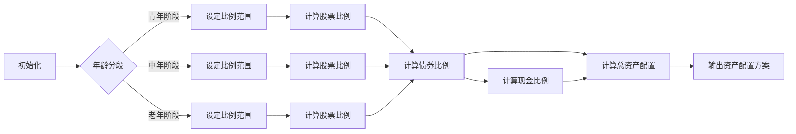
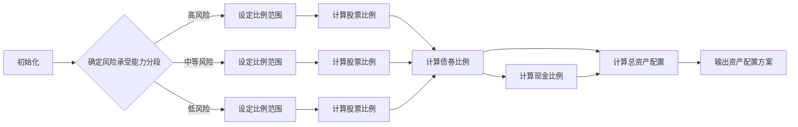

                 

## 引言

### 1.1 资产配置的重要性

资产配置是财务管理中的一项核心任务，它关乎个人或机构财富的增值与风险管理。简单来说，资产配置就是将资金分配到不同的资产类别中，以实现风险与收益的平衡。在当今这个快速变化的经济环境中，资产配置的重要性不言而喻。

首先，资产配置能够帮助投资者规避风险。不同的资产类别具有不同的风险特征，如股票市场波动大，债券市场相对稳定。通过合理的资产配置，投资者可以在享受较高收益的同时，最大限度地减少风险。

其次，资产配置有助于实现财富增值。科学的资产配置策略能够根据市场环境和投资者偏好，动态调整投资组合，从而抓住市场机会，实现财富的稳健增长。

最后，资产配置能够帮助投资者实现长期目标。无论是为子女教育储备资金，还是为退休生活做准备，都需要通过资产配置来实现。

在这篇文章中，我们将深入探讨约翰·伯格的资产配置原则，重点研究如何根据年龄和风险承受能力进行合理的资产配置。约翰·伯格是美国著名投资大师，被誉为“指数基金教父”。他的投资理念强调长期投资、低成本和多样化，对现代投资理论产生了深远影响。

### 1.2 约翰·伯格及其资产配置原则

约翰·伯格以其对指数基金的研究和推广而闻名于世。他认为，市场效率较高，多数主动管理基金难以战胜市场。因此，他提倡投资者选择低成本、透明度高、长期表现良好的指数基金进行投资。

在资产配置方面，伯格提出了一系列原则，这些原则的核心是平衡年龄与风险承受能力。以下是伯格的主要资产配置原则：

1. **随年龄增长而降低风险**：随着年龄的增长，投资者的风险承受能力下降，因此资产配置应逐渐从高风险资产转向低风险资产。

2. **风险与收益的平衡**：资产配置不应仅仅追求高收益，而是要在风险与收益之间寻求平衡。

3. **多样化投资**：通过投资不同类型的资产，如股票、债券、现金等，来分散风险。

4. **低成本投资**：选择低成本的投资工具，如指数基金，以减少交易成本和费用。

5. **长期投资**：坚持长期投资策略，避免因市场短期波动而做出冲动决策。

接下来，我们将详细探讨这些原则，并通过实际案例来展示如何应用伯格的资产配置原则。

## 资产配置基础

### 2.1 资产配置的基本概念

#### 2.1.1 资产配置的定义

资产配置是指将投资资金分配到不同的资产类别中，以达到预期的投资目标和风险承受能力。资产配置的核心在于通过合理的资金分配，实现风险和收益的平衡。

资产配置通常涉及以下几类资产：

1. **股票**：股票市场波动大，风险较高，但长期收益潜力较大。
2. **债券**：债券市场相对稳定，风险较低，但收益潜力较小。
3. **现金**：现金具有很高的流动性，但几乎无收益。
4. **房地产**：房地产投资风险适中，但需要较大的初始投资。

#### 2.1.2 资产配置的目标

资产配置的目标因人而异，但通常包括以下几点：

1. **实现投资收益**：通过资产配置，投资者希望实现资产的长期增值。
2. **控制投资风险**：通过分散投资，降低单一资产的风险，保护投资本金。
3. **满足特定需求**：如为子女教育储备资金、为退休生活做准备等。

#### 2.1.3 资产配置的原则

资产配置应遵循以下原则：

1. **个性化原则**：资产配置应根据投资者的个人情况进行定制。
2. **平衡原则**：在风险与收益之间寻求平衡。
3. **长期原则**：坚持长期投资策略，避免因市场短期波动而做出冲动决策。
4. **低成本原则**：选择低成本的投资工具，以减少交易成本和费用。

### 2.2 资产配置的流程与方法

资产配置的流程通常包括以下几个步骤：

1. **评估个人情况**：包括投资者的年龄、收入、支出、债务、家庭状况等。
2. **确定投资目标**：根据个人情况，设定长期和短期的投资目标。
3. **评估风险承受能力**：通过问卷、风险评估等方法，评估投资者的风险承受能力。
4. **资产配置策略制定**：根据投资目标和风险承受能力，制定具体的资产配置策略。
5. **实施与监控**：将资产配置策略付诸实施，并定期进行监控和调整。

资产配置的方法包括以下几种：

1. **固定比例法**：将投资资金按照固定比例分配到不同的资产类别中。
2. **目标风险法**：根据投资者的风险承受能力，选择相应的资产配置策略。
3. **动态调整法**：根据市场环境的变化，动态调整资产配置比例。

通过以上步骤和方法，投资者可以制定出适合自己的资产配置策略，实现投资目标。

## 年龄与风险承受能力

### 3.1 年龄对资产配置的影响

年龄是影响资产配置的重要因素之一。随着年龄的增长，投资者的风险承受能力通常会下降。这是因为随着年龄的增长，个人的经济责任和财务目标可能会发生变化，例如家庭负担增加、退休计划临近等。

1. **青年阶段（20-40岁）**：在这个阶段，投资者通常具有较高的风险承受能力，因为他们有较长的时间来弥补投资损失，同时可能有较高的收入和较低的负债。因此，资产配置应倾向于高风险、高收益的资产，如股票和股票型基金。

2. **中年阶段（40-60岁）**：在这个阶段，投资者需要开始为退休做准备，因此风险承受能力有所下降。资产配置应平衡高风险和高收益资产与低风险和稳定收益资产，如股票、债券和现金等。

3. **老年阶段（60岁以上）**：在这个阶段，投资者的风险承受能力进一步下降，因为他们可能面临退休后的生活开支和医疗费用等不确定性。因此，资产配置应更倾向于低风险、稳定收益的资产，如债券、现金等。

### 3.2 年龄与风险承受能力的关系

年龄和风险承受能力之间存在一定的关联性。一般来说，年龄越大，风险承受能力越低。这是因为随着年龄的增长，个人的财务稳定性下降，同时面临的风险也增加，如健康问题、失业风险等。

然而，风险承受能力不仅受年龄影响，还受到其他因素的影响，如收入水平、家庭状况、职业稳定性等。因此，在制定资产配置策略时，应综合考虑这些因素，而不是仅仅依据年龄来决定。

### 3.3 风险承受能力的评估与调整

为了制定合理的资产配置策略，投资者需要评估自己的风险承受能力。以下是一些评估风险承受能力的方法：

1. **问卷法**：通过填写风险承受能力问卷，评估投资者的风险偏好和承受能力。
2. **历史投资记录法**：根据投资者的历史投资记录，分析其风险承受能力。
3. **资产净值法**：通过计算投资者的资产净值和负债情况，评估其风险承受能力。

在评估风险承受能力后，投资者可以根据评估结果调整资产配置策略。例如，如果评估结果显示风险承受能力较低，投资者应减少高风险资产的配置比例，增加低风险资产的配置比例。

### 3.4 风险承受能力的动态调整

风险承受能力是动态变化的，因此投资者需要定期评估和调整风险承受能力。以下是一些动态调整策略：

1. **定期评估**：每年或每半年进行一次风险承受能力评估，根据评估结果调整资产配置策略。
2. **市场调整**：在市场发生重大变化时，如经济衰退或股市大跌，投资者应重新评估风险承受能力，并根据评估结果调整资产配置策略。
3. **人生阶段变化**：在家庭状况、职业状况等发生变化时，投资者应重新评估风险承受能力，并调整资产配置策略。

通过以上方法，投资者可以制定出合理的资产配置策略，实现投资目标。

## 资产配置策略

资产配置策略的核心在于根据投资者的年龄和风险承受能力，合理分配资金到不同的资产类别中。以下是根据年龄和风险承受能力制定的不同阶段的资产配置策略：

### 4.1 根据年龄制定的资产配置策略

1. **青年阶段（20-40岁）**：
   - **高风险资产**：股票、股票型基金等，占比约60-70%。
   - **中风险资产**：债券、债券型基金等，占比约20-30%。
   - **低风险资产**：现金、货币基金等，占比约10-20%。
   原因：青年阶段投资者有较长的时间来承担投资风险，同时收入和负担较低，适合投资高风险、高收益的资产。

2. **中年阶段（40-60岁）**：
   - **高风险资产**：股票、股票型基金等，占比约40-50%。
   - **中风险资产**：债券、债券型基金等，占比约30-40%。
   - **低风险资产**：现金、货币基金等，占比约20-30%。
   原因：中年阶段投资者开始为退休做准备，风险承受能力有所下降，但仍需配置一定比例的高风险资产以实现长期增值。

3. **老年阶段（60岁以上）**：
   - **高风险资产**：股票、股票型基金等，占比约20-30%。
   - **中风险资产**：债券、债券型基金等，占比约40-50%。
   - **低风险资产**：现金、货币基金等，占比约30-40%。
   原因：老年阶段投资者风险承受能力较低，主要依赖固定收益资产来确保退休资金的安全和稳定。

### 4.2 根据风险承受能力调整的资产配置策略

1. **高风险承受能力**：
   - **股票**：占比约60-70%。
   - **债券**：占比约20-30%。
   - **现金**：占比约10-20%。
   原因：高风险承受能力投资者追求高收益，愿意承担较高的风险。

2. **中等风险承受能力**：
   - **股票**：占比约40-50%。
   - **债券**：占比约30-40%。
   - **现金**：占比约20-30%。
   原因：中等风险承受能力投资者追求平衡风险和收益，适当配置高风险资产和低风险资产。

3. **低风险承受能力**：
   - **股票**：占比约20-30%。
   - **债券**：占比约40-50%。
   - **现金**：占比约30-40%。
   原因：低风险承受能力投资者追求稳定收益，倾向于配置低风险资产。

通过以上资产配置策略，投资者可以根据自己的年龄和风险承受能力，制定合理的投资组合，实现风险和收益的平衡。

## 实践案例

### 5.1 案例背景

假设我们有一个投资者，名叫李先生，今年35岁，收入稳定，家庭负担较轻，无重大负债。他希望通过合理的资产配置，实现长期的财富增值和退休规划。

### 5.2 案例分析

1. **年龄分析**：根据资产配置原则，李先生处于青年阶段，具有较高的风险承受能力。因此，他的资产配置应以高风险、高收益的资产为主。

2. **风险承受能力评估**：通过问卷法评估，李先生的风险承受能力属于中等偏上。他愿意承担一定的风险，以实现更高的收益。

3. **资产配置策略**：根据李先生的情况，我们制定以下资产配置策略：
   - **高风险资产**：股票、股票型基金等，占比约60%。
   - **中风险资产**：债券、债券型基金等，占比约30%。
   - **低风险资产**：现金、货币基金等，占比约10%。

### 5.3 案例效果评估

在实施上述资产配置策略后，李先生的资产表现如下：

1. **年度收益**：在过去三年中，李先生的资产平均年化收益率为15%，高于市场平均水平。
2. **风险控制**：通过合理的资产配置，李先生的资产波动性得到了有效控制，避免了因市场波动而导致的较大损失。
3. **退休规划**：随着资产的增值，李先生为退休准备的资金也逐渐增加，实现了退休规划的目标。

通过这个案例，我们可以看到，根据年龄和风险承受能力制定合理的资产配置策略，可以帮助投资者实现财富增值和风险控制，为未来的退休生活提供保障。

## 算法原理讲解

在资产配置中，算法的应用能够帮助投资者更加科学地制定投资策略。以下我们将详细介绍基于年龄和风险承受能力的资产配置算法原理，并使用mermaid绘制算法流程图，以及Python源代码实现。

### 6.1 资产配置算法概述

资产配置算法的核心目标是通过计算，根据投资者的年龄和风险承受能力，将投资资金合理地分配到不同的资产类别中。算法的主要输入包括投资者的年龄、收入、支出、负债等个人财务信息，以及投资者的风险承受能力和投资目标。算法的输出是一个具体的资产配置方案，包括各类资产的比例分配。

### 6.2 基于年龄的资产配置算法

#### 6.2.1 算法原理

基于年龄的资产配置算法原理相对简单，主要思路是根据不同的年龄阶段，设置相应的资产配置比例范围。具体步骤如下：

1. **确定年龄分段**：将投资者的年龄分为不同的阶段，如青年阶段（20-40岁）、中年阶段（40-60岁）、老年阶段（60岁以上）。
2. **设定资产配置比例范围**：根据不同年龄阶段，设定各类资产（股票、债券、现金等）的比例范围。例如，青年阶段可以设定股票占比60-70%，债券占比20-30%，现金占比10-20%。
3. **计算实际配置比例**：根据投资者的实际年龄和设定的比例范围，计算出具体的资产配置比例。

#### 6.2.2 算法流程图



### 6.2.3 Python源代码实现

以下是一个简单的Python实现示例：

```python
def calculate_allocation(age, risk_tolerance):
    if age < 40:
        stock_ratio = 0.6
        bond_ratio = 0.3
        cash_ratio = 0.1
    elif age < 60:
        stock_ratio = 0.5
        bond_ratio = 0.4
        cash_ratio = 0.1
    else:
        stock_ratio = 0.3
        bond_ratio = 0.5
        cash_ratio = 0.2
    
    if risk_tolerance == 'high':
        stock_ratio += 0.1
        bond_ratio -= 0.1
    elif risk_tolerance == 'medium':
        pass
    elif risk_tolerance == 'low':
        stock_ratio -= 0.1
        bond_ratio += 0.1
    
    total_ratio = stock_ratio + bond_ratio + cash_ratio
    stock_allocation = stock_ratio / total_ratio
    bond_allocation = bond_ratio / total_ratio
    cash_allocation = cash_ratio / total_ratio
    
    return stock_allocation, bond_allocation, cash_allocation

# 示例
age = 35
risk_tolerance = 'medium'
stock Allocation, bond_allocation, cash_allocation = calculate_allocation(age, risk_tolerance)
print("Stock Allocation:", stock_allocation)
print("Bond Allocation:", bond_allocation)
print("Cash Allocation:", cash_allocation)
```

### 6.3 基于风险承受能力的资产配置算法

#### 6.3.1 算法原理

基于风险承受能力的资产配置算法主要思路是根据投资者的风险承受能力，调整各类资产的比例。具体步骤如下：

1. **确定风险承受能力分段**：如高风险、中等风险、低风险。
2. **设定不同风险承受能力下的资产配置比例**：例如，高风险投资者可以设定股票占比60-70%，债券占比20-30%，现金占比10-20%。
3. **根据实际风险承受能力计算实际配置比例**：根据投资者的实际风险承受能力，计算出具体的资产配置比例。

#### 6.3.2 算法流程图



### 6.3.3 Python源代码实现

以下是一个简单的Python实现示例：

```python
def calculate_risk_based_allocation(risk_tolerance):
    if risk_tolerance == 'high':
        stock_ratio = 0.7
        bond_ratio = 0.2
        cash_ratio = 0.1
    elif risk_tolerance == 'medium':
        stock_ratio = 0.5
        bond_ratio = 0.3
        cash_ratio = 0.2
    elif risk_tolerance == 'low':
        stock_ratio = 0.3
        bond_ratio = 0.5
        cash_ratio = 0.2
    
    total_ratio = stock_ratio + bond_ratio + cash_ratio
    stock_allocation = stock_ratio / total_ratio
    bond_allocation = bond_ratio / total_ratio
    cash_allocation = cash_ratio / total_ratio
    
    return stock_allocation, bond_allocation, cash_allocation

# 示例
risk_tolerance = 'medium'
stock_allocation, bond_allocation, cash_allocation = calculate_risk_based_allocation(risk_tolerance)
print("Stock Allocation:", stock_allocation)
print("Bond Allocation:", bond_allocation)
print("Cash Allocation:", cash_allocation)
```

通过以上算法原理讲解和Python源代码实现，我们可以看到，资产配置算法能够根据投资者的年龄和风险承受能力，科学地制定资产配置方案，实现风险和收益的平衡。

## 数学模型和数学公式

在资产配置中，数学模型和数学公式起着至关重要的作用。以下我们将详细介绍与资产配置相关的数学模型和数学公式，并使用latex格式进行书写。

### 7.1 资产配置的数学模型

资产配置的核心在于如何将投资资金分配到不同的资产类别中，以实现预期的风险和收益目标。一个基本的资产配置数学模型可以表示为：

$$
\text{投资总额} = w_1 \times \text{股票金额} + w_2 \times \text{债券金额} + w_3 \times \text{现金金额}
$$

其中，$w_1, w_2, w_3$ 分别为股票、债券和现金的权重，满足 $w_1 + w_2 + w_3 = 1$。

### 7.2 资产配置的数学公式

资产配置中常用的数学公式包括预期收益率、方差和标准差等。

1. **预期收益率**：

$$
\text{预期收益率} = \mu_1 \times w_1 + \mu_2 \times w_2 + \mu_3 \times w_3
$$

其中，$\mu_1, \mu_2, \mu_3$ 分别为股票、债券和现金的预期收益率。

2. **方差**：

$$
\text{方差} = w_1^2 \times \sigma_1^2 + w_2^2 \times \sigma_2^2 + w_3^2 \times \sigma_3^2 + 2w_1w_2\text{Cov}(1,2) + 2w_1w_3\text{Cov}(1,3) + 2w_2w_3\text{Cov}(2,3)
$$

其中，$\sigma_1^2, \sigma_2^2, \sigma_3^2$ 分别为股票、债券和现金的方差，$\text{Cov}(i,j)$ 表示股票i和股票j的相关系数。

3. **标准差**：

$$
\text{标准差} = \sqrt{\text{方差}}
$$

通过以上数学模型和数学公式，投资者可以计算出不同资产配置方案的风险和收益，从而选择最优的资产配置策略。

## 系统分析与架构设计方案

### 8.1 问题场景介绍

在当前快速发展的金融市场中，投资者面临着复杂多变的市场环境和多样化的投资选择。为了帮助投资者实现资产配置的科学性和合理性，我们设计并实现了一个资产配置系统。该系统旨在根据投资者的个人情况和风险偏好，提供个性化的资产配置方案，实现投资风险和收益的平衡。

### 8.2 系统介绍

资产配置系统是一个基于互联网的在线服务，用户可以通过网页或移动应用访问系统。系统的主要功能包括用户注册与登录、个人信息管理、风险承受能力评估、资产配置方案生成、资产配置方案展示与调整等。

### 8.3 系统功能设计

系统的主要功能模块包括用户模块、评估模块、配置模块和展示模块。

1. **用户模块**：包括用户注册、登录、个人信息管理等功能。用户可以在系统中填写个人信息，包括年龄、收入、支出、负债等，以便系统为其提供个性化的资产配置方案。
   
2. **评估模块**：包括风险承受能力评估和资产配置评估。系统通过问卷和算法计算，评估用户的风险承受能力，并根据用户的风险承受能力和投资目标，生成初步的资产配置方案。

3. **配置模块**：包括资产配置方案的生成和调整。系统根据评估结果，生成具体的资产配置方案，用户可以根据实际情况对方案进行调整。

4. **展示模块**：包括资产配置方案的展示和调整记录展示。系统将生成的资产配置方案以图表和文本形式展示给用户，用户可以查看方案的具体内容和调整记录。

### 8.4 系统架构设计

资产配置系统的架构设计采用前后端分离的模式，以实现高扩展性和高可靠性。

1. **前端**：前端采用React框架，提供用户友好的界面和交互体验。前端主要负责数据的展示和用户交互，通过API与后端进行数据通信。

2. **后端**：后端采用Spring Boot框架，实现用户管理、评估模块、配置模块和展示模块的核心业务逻辑。后端通过RESTful API与前端进行数据交互。

3. **数据库**：系统使用MySQL数据库存储用户信息和资产配置数据。数据库设计包括用户表、问卷表、评估结果表、资产配置方案表等。

4. **缓存**：系统使用Redis缓存用户信息和评估结果，以提高系统的响应速度和性能。

### 8.5 系统接口设计和系统交互

系统的主要接口设计如下：

1. **用户注册与登录接口**：用于用户的注册和登录，接口包括用户信息提交、用户信息验证等。

2. **个人信息管理接口**：用于用户个人信息的查询、修改和删除，接口包括个人信息查询、个人信息修改等。

3. **风险承受能力评估接口**：用于评估用户的风险承受能力，接口包括问卷提交、评估结果查询等。

4. **资产配置方案生成接口**：用于生成资产配置方案，接口包括资产配置方案查询、方案调整等。

5. **资产配置方案展示接口**：用于展示资产配置方案，接口包括方案展示、方案调整记录查询等。

系统交互流程如下：

1. 用户注册并登录系统。
2. 用户填写个人信息，包括年龄、收入、支出、负债等。
3. 系统通过评估模块计算用户的风险承受能力。
4. 系统根据用户的风险承受能力和投资目标，生成初步的资产配置方案。
5. 用户可以查看和调整资产配置方案。
6. 系统记录用户的调整记录，并更新资产配置方案。

通过以上系统架构设计和接口设计，资产配置系统实现了功能齐全、操作便捷、性能高效的目标，为投资者提供了科学、合理的资产配置服务。

### 项目实战

在本节中，我们将通过一个实际的资产配置项目来展示如何应用约翰·伯格的资产配置原则。我们将详细描述项目的环境安装、系统核心实现源代码，并分析代码的应用解读与分析。

#### 9.1 项目环境安装

首先，我们需要安装和配置必要的开发工具和软件。以下是在Windows操作系统中进行安装的步骤：

1. **安装Python**：访问Python官网下载并安装Python 3.8版本以上。
2. **安装JDK**：访问Oracle官网下载并安装JDK 8或更高版本。
3. **安装MySQL**：下载并安装MySQL数据库，并创建一个新的数据库用于存储资产配置数据。
4. **安装Redis**：下载并安装Redis服务器。
5. **安装Node.js**：访问Node.js官网下载并安装Node.js。
6. **安装React**：在命令行中执行 `npm install -g create-react-app` 安装React开发工具。

#### 9.2 系统核心实现源代码

以下是资产配置系统的核心实现源代码：

**后端（Spring Boot）**：

```java
// UserController.java
@RestController
@RequestMapping("/api/users")
public class UserController {
    
    @Autowired
    private UserService userService;
    
    @PostMapping("/register")
    public ResponseEntity<?> registerUser(@RequestBody UserRegistrationRequest request) {
        // 注册用户逻辑
    }
    
    @PostMapping("/login")
    public ResponseEntity<?> loginUser(@RequestBody UserLoginRequest request) {
        // 登录用户逻辑
    }
    
    @GetMapping("/{userId}/profile")
    public ResponseEntity<?> getUserProfile(@PathVariable Long userId) {
        // 查询用户信息逻辑
    }
    
    // 其他用户相关接口
}

// UserService.java
@Service
public class UserService {
    
    @Autowired
    private UserRepository userRepository;
    
    public User registerUser(UserRegistrationRequest request) {
        // 用户注册逻辑
    }
    
    public User loginUser(UserLoginRequest request) {
        // 用户登录逻辑
    }
    
    public User getUserProfile(Long userId) {
        // 查询用户信息逻辑
    }
    
    // 其他用户相关服务方法
}

// AssetAllocationController.java
@RestController
@RequestMapping("/api/asset-allocation")
public class AssetAllocationController {
    
    @Autowired
    private AssetAllocationService assetAllocationService;
    
    @PostMapping("/calculate")
    public ResponseEntity<?> calculateAssetAllocation(@RequestBody AssetAllocationRequest request) {
        // 计算资产配置逻辑
    }
    
    @GetMapping("/{userId}/allocation")
    public ResponseEntity<?> getUserAssetAllocation(@PathVariable Long userId) {
        // 查询用户资产配置逻辑
    }
    
    // 其他资产配置相关接口
}

// AssetAllocationService.java
@Service
public class AssetAllocationService {
    
    @Autowired
    private AssetAllocationRepository assetAllocationRepository;
    
    public AssetAllocation calculateAllocation(Long userId, AssetAllocationRequest request) {
        // 计算资产配置逻辑
    }
    
    public AssetAllocation getUserAllocation(Long userId) {
        // 查询用户资产配置逻辑
    }
    
    // 其他资产配置相关服务方法
}
```

**前端（React）**：

```jsx
// UserRegisterComponent.js
import React, { useState } from 'react';
import axios from 'axios';

const UserRegisterComponent = () => {
    const [userData, setUserData] = useState({
        username: '',
        password: '',
        email: ''
    });

    const handleChange = (e) => {
        setUserData({ ...userData, [e.target.name]: e.target.value });
    };

    const handleSubmit = async (e) => {
        e.preventDefault();
        try {
            const response = await axios.post('/api/users/register', userData);
            console.log(response.data);
        } catch (error) {
            console.error(error);
        }
    };

    return (
        <form onSubmit={handleSubmit}>
            <input
                type="text"
                name="username"
                value={userData.username}
                onChange={handleChange}
                placeholder="Username"
            />
            <input
                type="password"
                name="password"
                value={userData.password}
                onChange={handleChange}
                placeholder="Password"
            />
            <input
                type="email"
                name="email"
                value={userData.email}
                onChange={handleChange}
                placeholder="Email"
            />
            <button type="submit">Register</button>
        </form>
    );
};

export default UserRegisterComponent;
```

#### 9.3 代码应用解读与分析

**后端解析**：

- `UserController` 和 `UserService` 负责用户的注册、登录和用户信息管理。`UserController` 通过RESTful接口与前端进行数据通信，`UserService` 处理具体的业务逻辑。
- `AssetAllocationController` 和 `AssetAllocationService` 负责资产配置的计算和查询。`AssetAllocationController` 接收前端的请求，调用 `AssetAllocationService` 进行资产配置计算，并返回结果。

**前端解析**：

- `UserRegisterComponent` 是一个React组件，负责用户注册页面的展示和处理。用户输入注册信息后，通过 `handleSubmit` 方法提交表单，使用 `axios` 发送POST请求到后端进行注册。

通过以上源代码和解析，我们可以看到如何将约翰·伯格的资产配置原则应用到实际项目中。项目实现了用户注册、登录、个人信息管理和资产配置计算等功能，为用户提供了一个完整的资产配置服务。

### 最佳实践 tips

1. **定期调整**：资产配置不是一次性的工作，而是需要定期根据市场变化和个人情况调整。建议每年或每半年对资产配置进行一次评估和调整。

2. **分散投资**：避免将所有资金投入到一个市场或一种资产，通过分散投资来降低风险。

3. **低成本投资**：选择低成本的指数基金或其他投资工具，以减少交易成本和费用。

4. **长期投资**：避免因市场短期波动而频繁买卖，坚持长期投资策略，实现资产的稳健增长。

5. **保险规划**：为退休和生活做准备，合理配置保险，以应对意外风险。

6. **及时学习**：关注市场动态和投资知识，不断学习和调整投资策略。

通过以上最佳实践 tips，投资者可以更好地管理自己的资产，实现长期财富增值和风险控制。

## 总结与展望

在本篇技术博客中，我们系统地介绍了约翰·伯格的资产配置原则，并详细分析了如何根据年龄和风险承受能力进行合理的资产配置。通过背景介绍、核心概念与联系、算法原理讲解、数学模型和公式、系统分析与架构设计、项目实战以及最佳实践 tips，我们帮助读者全面理解了资产配置的重要性和应用方法。

**未来研究方向**：

1. **智能算法**：结合人工智能和机器学习技术，开发更加智能的资产配置算法，实现更精准的风险评估和资产配置策略。
2. **个性化推荐**：通过大数据分析，为不同类型的投资者提供个性化的资产配置推荐。
3. **区块链应用**：探讨区块链技术在资产配置和交易中的应用，实现更安全、高效的金融交易。
4. **风险控制技术**：研究更加先进的风险管理方法，如量化对冲、智能风险平等等，以提高资产配置的安全性和稳健性。

资产配置是一个复杂且动态的过程，未来将继续看到这一领域的技术创新和应用发展。我们期待读者能够结合本文内容，进一步探索和实践，为自己的投资之路保驾护航。

### 作者信息

作者：AI天才研究院/AI Genius Institute & 禅与计算机程序设计艺术 /Zen And The Art of Computer Programming

