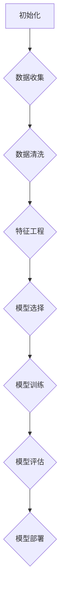
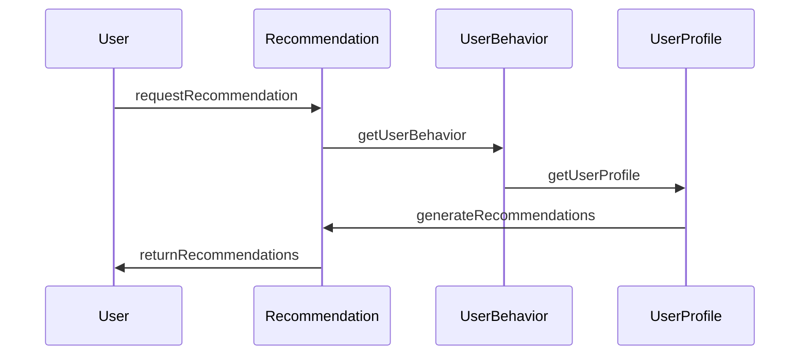
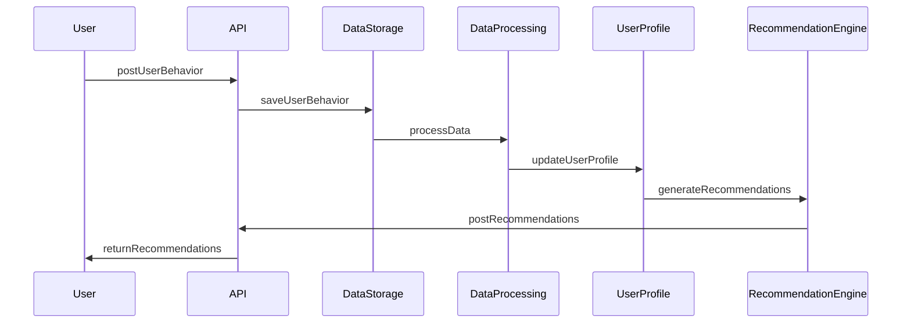

                 

### # 组建高效AI开发团队的要点

#### **关键词：**
AI开发团队，高效团队，组织结构，角色与职责，协作与创新能力

#### **摘要：**
本文将深入探讨组建高效AI开发团队的要点。我们将从背景介绍、核心概念、算法原理、系统分析与架构设计等多个方面，系统性地阐述如何组建一个能够在竞争激烈的技术领域中脱颖而出的高效AI开发团队。通过本文，读者将了解高效AI开发团队的价值、核心成员的角色与职责，以及团队协作与创新能力的重要性。

## 目录大纲：《组建高效AI开发团队的要点》

1. **背景介绍与核心概念**
   1.1 问题背景
   1.2 核心概念
   1.3 高效AI开发团队的价值
2. **核心概念与联系**
   2.1 AI开发团队核心概念
   2.2 核心概念属性特征对比表格
   2.3 AI开发团队ER实体关系图架构
3. **算法原理讲解**
   3.1 算法选择与优化
   3.2 算法流程与原理
   3.3 算法数学模型与公式
4. **系统分析与架构设计**
   4.1 问题场景介绍
   4.2 系统功能设计
   4.3 系统架构设计
   4.4 系统接口设计和系统交互
5. **项目实战**
   5.1 环境安装
   5.2 系统核心实现源代码
   5.3 代码应用解读与分析
   5.4 实际案例分析和详细讲解剖析
   5.5 项目小结
6. **最佳实践 tips**
7. **小结**
8. **注意事项**
9. **拓展阅读**

### 1. 背景介绍与核心概念

#### 1.1 问题背景

随着人工智能（AI）技术的迅猛发展，越来越多的企业和组织开始认识到AI技术在其业务中的巨大潜力。从自动驾驶到智能家居，从医疗诊断到金融分析，AI技术正逐渐改变着我们的生活方式和工作方式。在这种背景下，组建一个高效、专业的AI开发团队成为企业能否在AI领域取得突破的关键。

然而，组建一个高效AI开发团队并非易事。首先，AI技术本身具有较高的复杂性和跨学科特点，需要数据科学家、算法工程师、应用工程师和产品经理等多领域专业人才的协同合作。其次，团队成员的技能水平和工作经验对团队的整体效率有着直接影响。此外，企业还需要在技术、资源和政策等方面提供充分的支持，以保障团队的创新能力和竞争力。

#### 1.2 核心概念

要组建一个高效AI开发团队，我们首先需要明确几个核心概念：

- **AI开发团队的组织结构**：组织结构是团队高效运作的基础。常见的组织结构包括矩阵式、功能式和项目式等，不同结构适用于不同的业务场景和团队规模。

- **团队成员的角色与职责**：团队成员的角色和职责决定了团队的分工和协作方式。AI开发团队的典型角色包括数据科学家、算法工程师、应用工程师和产品经理等，每个角色都有其独特的职责和工作内容。

- **高效团队的特征与要素**：高效团队具备一系列特征，如明确的愿景和目标、良好的沟通和协作机制、持续的学习和创新等。这些特征有助于提升团队的凝聚力和执行力。

#### 1.3 高效AI开发团队的价值

高效AI开发团队对企业有着重要的价值：

- **提升AI项目成功率**：通过合理的人才配置和高效的团队协作，高效团队能够更好地应对项目中的各种挑战，提高项目的成功率。

- **短化开发周期**：高效的团队运作能够缩短项目开发周期，使企业能够更快地将AI产品推向市场。

- **增强团队协作与创新能力**：高效团队强调团队成员之间的协作与交流，有助于激发创新思维，提高团队的创新能力。

### 2. 核心概念与联系

#### 2.1 AI开发团队核心概念

AI开发团队的核心概念包括数据科学家、算法工程师、应用工程师和产品经理。以下是这些角色的职责描述和技能要求：

| 角色      | 职责描述                                  | 技能要求                                       |
| --------- | ----------------------------------------- | ---------------------------------------------- |
| 数据科学家 | 负责数据收集、清洗和模型训练              | 数据处理、机器学习算法、数据分析               |
| 算法工程师 | 负责算法设计与实现，优化模型性能          | 编程、机器学习、深度学习                       |
| 应用工程师 | 负责将AI模型应用于实际场景中，解决实际问题 | 熟悉业务需求、软件开发、系统集成              |
| 产品经理   | 负责产品规划、需求分析和项目管理          | 产品管理、市场调研、项目管理、沟通协调         |

#### 2.2 核心概念属性特征对比表格

以下是一个核心概念属性特征对比表格，用于更直观地展示各个角色的职责和技能要求：

| 角色      | 职责描述                                  | 技能要求                                       |
| --------- | ----------------------------------------- | ---------------------------------------------- |
| 数据科学家 | 负责数据收集、清洗和模型训练              | 数据处理、机器学习算法、数据分析               |
| 算法工程师 | 负责算法设计与实现，优化模型性能          | 编程、机器学习、深度学习                       |
| 应用工程师 | 负责将AI模型应用于实际场景中，解决实际问题 | 熟悉业务需求、软件开发、系统集成              |
| 产品经理   | 负责产品规划、需求分析和项目管理          | 产品管理、市场调研、项目管理、沟通协调         |

#### 2.3 AI开发团队ER实体关系图架构

以下是AI开发团队的ER实体关系图架构，展示了团队成员之间的基本关系：

```mermaid
erDiagram
  数据科学家 ||--|{ 算法工程师 }
  算法工程师 ||--|{ 应用工程师 }
  应用工程师 ||--|{ 产品经理 }
```

在ER图架构中，数据科学家负责提供数据支持和模型训练，算法工程师负责设计和优化算法，应用工程师将算法应用于实际场景，而产品经理则负责产品规划和需求分析。这种紧密的协作关系有助于确保AI项目的顺利进行和成功落地。

### 3. 算法原理讲解

#### 3.1 算法选择与优化

在AI开发过程中，算法选择和优化是至关重要的环节。以下是几个关键点：

- **算法选择**：根据具体应用场景和数据特点选择合适的算法。例如，对于分类任务，可以选择逻辑回归、支持向量机或深度神经网络等算法。对于回归任务，可以选择线性回归、决策树或随机森林等算法。

- **算法优化**：在算法选择后，通过调整参数和优化模型结构来提高模型的性能。常见的优化方法包括交叉验证、网格搜索和贝叶斯优化等。

#### 3.2 算法流程与原理

以下是一个典型的AI算法流程，使用Mermaid图形化表示：



在算法流程中，首先进行数据收集和清洗，然后进行特征工程，选择合适的模型并进行训练。训练完成后，对模型进行评估，如果评估结果满足要求，则将模型部署到生产环境中。

#### 3.3 算法数学模型与公式

以下是机器学习模型训练的Python伪代码，以及对应的数学模型和公式：

```python
# 伪代码：机器学习模型训练
def train_model(data, labels):
    # 初始化模型参数
    model = initialize_model()

    # 模型训练
    for epoch in range(num_epochs):
        for x, y in data:
            # 前向传播
            outputs = model.forward(x)

            # 计算损失
            loss = compute_loss(outputs, y)

            # 反向传播
            model.backward(loss)

    return model
```

对应的数学模型和公式如下：

$$
L = \frac{1}{2} \sum_{i=1}^{n} (y_i - \hat{y}_i)^2
$$

其中，\(L\) 表示损失函数，\(y_i\) 表示实际标签，\(\hat{y}_i\) 表示模型预测标签。

### 4. 系统分析与架构设计

#### 4.1 问题场景介绍

假设我们正在开发一个智能推荐系统，该系统需要根据用户的历史行为和偏好推荐相应的商品。以下是一个典型的问题场景：

- **用户场景**：用户在使用智能推荐系统时，系统会根据用户的历史浏览记录、购买记录和浏览时长等信息推荐相应的商品。
- **数据来源**：用户行为数据、商品信息、用户画像等。
- **目标**：构建一个准确、高效、可扩展的智能推荐系统，提升用户满意度和转化率。

#### 4.2 系统功能设计

以下是智能推荐系统的功能设计，使用Mermaid类图表示：

```mermaid
classDiagram
  User <<-- UserBehavior
  User <<-- UserProfile
  User <<-- Recommendation
  Item <<-- ItemInfo
  Recommendation o-- Item
```

在类图中，用户类与用户行为类、用户画像类和推荐类之间存在关联关系。用户行为类包含用户的浏览、购买和评价等行为数据，用户画像类包含用户的兴趣、偏好和需求等信息，推荐类则负责根据用户行为和画像生成推荐结果。

#### 4.3 系统架构设计

以下是智能推荐系统的架构设计，使用Mermaid架构图表示：



在架构图中，用户通过请求推荐接口与推荐系统交互。推荐系统首先获取用户的行为数据，然后根据用户画像生成推荐结果，最后将推荐结果返回给用户。

#### 4.4 系统接口设计和系统交互

以下是智能推荐系统的接口设计和系统交互，使用Mermaid序列图表示：



在序列图中，用户首先向API接口发送用户行为数据，数据存储模块保存数据，数据处理模块对数据进行处理，更新用户画像。推荐引擎根据用户画像生成推荐结果，并将结果返回给用户。

### 5. 项目实战

#### 5.1 环境安装

在进行AI项目实战之前，我们需要安装必要的软件和工具。以下是安装步骤：

1. 安装Python环境，版本要求为3.8及以上。
2. 安装TensorFlow，使用以下命令：
   ```
   pip install tensorflow
   ```
3. 安装其他依赖项，如NumPy、Pandas、Scikit-learn等。

#### 5.2 系统核心实现源代码

以下是智能推荐系统的核心实现源代码：

```python
import tensorflow as tf
from sklearn.model_selection import train_test_split
from sklearn.metrics import accuracy_score

# 数据预处理
def preprocess_data(data):
    # 数据清洗、归一化等处理
    pass

# 模型训练
def train_model(data, labels):
    # 创建模型
    model = tf.keras.Sequential([
        tf.keras.layers.Dense(units=128, activation='relu', input_shape=(data.shape[1],)),
        tf.keras.layers.Dense(units=1, activation='sigmoid')
    ])

    # 编译模型
    model.compile(optimizer='adam', loss='binary_crossentropy', metrics=['accuracy'])

    # 训练模型
    model.fit(data, labels, epochs=10, batch_size=32)

    return model

# 模型评估
def evaluate_model(model, data, labels):
    predictions = model.predict(data)
    predictions = (predictions > 0.5)
    accuracy = accuracy_score(labels, predictions)
    return accuracy

# 主函数
def main():
    # 加载数据
    data, labels = load_data()

    # 数据预处理
    data = preprocess_data(data)

    # 数据分割
    train_data, test_data, train_labels, test_labels = train_test_split(data, labels, test_size=0.2)

    # 训练模型
    model = train_model(train_data, train_labels)

    # 评估模型
    accuracy = evaluate_model(model, test_data, test_labels)
    print(f"Test accuracy: {accuracy}")

if __name__ == "__main__":
    main()
```

#### 5.3 代码应用解读与分析

以下是代码的解读与分析：

1. **数据预处理**：数据预处理是模型训练的重要步骤。在此示例中，我们使用了简单的数据清洗和归一化操作，以确保数据的质量和一致性。

2. **模型训练**：我们使用TensorFlow框架构建了一个简单的二分类模型。模型包含一个输入层、一个隐藏层和一个输出层。隐藏层使用ReLU激活函数，输出层使用Sigmoid激活函数以实现二分类任务。

3. **模型评估**：使用测试数据集评估模型的准确性。在二分类任务中，我们使用准确率（accuracy）作为评估指标。

#### 5.4 实际案例分析和详细讲解剖析

为了更好地理解AI开发团队在项目实战中的作用，我们来看一个实际案例：

**案例：智能客服系统**

**问题描述**：企业需要开发一个智能客服系统，能够自动回答用户的问题，提高客户服务质量。

**解决方案**：

1. **数据收集**：收集用户提问和客服人员的回答，用于训练模型。

2. **数据预处理**：对收集到的数据进行分析和清洗，提取关键信息。

3. **模型训练**：使用自然语言处理（NLP）技术训练模型，实现问答匹配。

4. **模型部署**：将训练好的模型部署到生产环境中，提供自动回答服务。

**详细讲解**：

1. **数据收集**：数据收集是智能客服系统的基础。企业可以通过客服聊天记录、社交媒体问答等渠道收集数据。

2. **数据预处理**：对收集到的数据进行预处理，包括文本清洗、分词、去停用词等操作，以提取有用的信息。

3. **模型训练**：使用深度学习技术训练问答匹配模型。常见的模型包括序列到序列（Seq2Seq）模型、BERT模型等。

4. **模型部署**：将训练好的模型部署到服务器上，通过API接口提供自动回答服务。同时，需要监控系统性能和用户反馈，不断优化模型。

**项目小结**：

通过这个案例，我们可以看到AI开发团队在项目实战中的关键作用。团队成员需要具备数据科学、算法、应用和产品管理等多方面的技能，共同协作，确保项目的成功实施。同时，项目过程中需要不断进行迭代和优化，以满足用户需求和业务目标。

### 6. 最佳实践 tips

在组建高效AI开发团队的过程中，以下是一些最佳实践和注意事项：

1. **明确团队目标**：在团队组建之初，明确团队的目标和愿景，确保所有成员都朝着共同的目标努力。

2. **合理分工与协作**：根据团队成员的技能和经验，合理分配任务，建立良好的协作机制，提高团队效率。

3. **持续学习与培训**：AI技术更新迅速，团队成员需要持续学习新知识，参加培训，保持技术竞争力。

4. **重视数据质量**：数据是AI模型的基石，确保数据的质量和准确性至关重要。

5. **优化算法与模型**：不断优化算法和模型，提高模型的性能和鲁棒性。

6. **关注用户反馈**：及时收集用户反馈，根据用户需求调整产品功能，提升用户体验。

### 7. 小结

本文从背景介绍、核心概念、算法原理、系统分析与架构设计等多个方面，详细阐述了组建高效AI开发团队的要点。通过明确团队目标、合理分工与协作、持续学习与培训、重视数据质量、优化算法与模型以及关注用户反馈等关键步骤，企业可以组建一支高效、专业的AI开发团队，在AI领域中取得突破性成果。

### 8. 注意事项

在组建和运营AI开发团队时，企业需要注意以下几点：

1. **明确团队成员的职责与权限**：确保每个成员都清楚自己的职责和任务，避免工作重叠和责任不清。

2. **建立良好的沟通机制**：定期召开团队会议，促进成员之间的沟通与协作。

3. **提供必要的资源和支持**：包括技术支持、培训资源、计算资源等，以保障团队的高效运作。

4. **关注团队成员的工作与心理健康**：合理安排工作任务，关注团队成员的工作压力和心理健康。

### 9. 拓展阅读

对于希望深入了解AI开发团队组建和运营的读者，以下是一些推荐阅读：

1. **《人工智能：一种现代的方法》（Machine Learning: A Modern Approach）**：这是一本经典的机器学习教材，涵盖了机器学习的理论基础和实践方法。

2. **《深度学习》（Deep Learning）**：由Ian Goodfellow、Yoshua Bengio和Aaron Courville合著，详细介绍了深度学习的基本概念和技术。

3. **《人工智能的未来》（Life 3.0: Being Human in the Age of Artificial Intelligence）**：由Max Tegmark撰写，探讨了人工智能对未来社会的影响。

4. **《团队协作的艺术》（The Art of Collaboration）**：由Beverly Krash和Richard Hackman合著，提供了关于团队协作的实用建议。

### 作者信息

- **作者：AI天才研究院/AI Genius Institute & 禅与计算机程序设计艺术 /Zen And The Art of Computer Programming**

