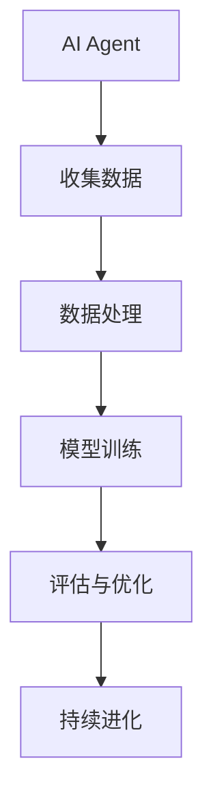
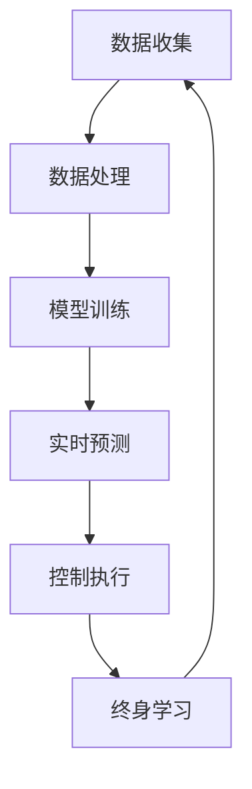
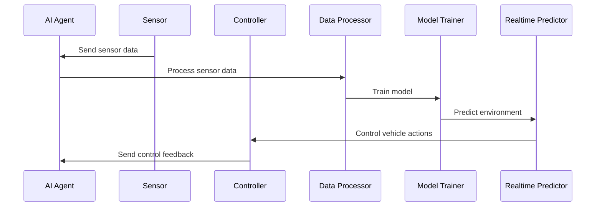

                 

# 终身学习：构建能持续进化的AI Agent

> 关键词：AI Agent、终身学习、持续进化、深度学习、智能体、算法原理、系统架构设计、项目实战

> 摘要：本文旨在探讨如何通过终身学习理念构建能持续进化的AI Agent。首先，我们介绍AI Agent和终身学习的核心概念，并分析其在持续进化中的关键作用。接着，我们详细讲解构建AI Agent的算法原理，并通过Python源代码实现和数学公式进行阐述。此外，本文还将讨论AI Agent的系统架构设计和项目实战，提供最佳实践和注意事项，总结文章的主要观点，并推荐拓展阅读。

## Step 1: 背景介绍

### 问题背景

在当今信息时代，人工智能（AI）技术在各个领域得到了广泛应用，尤其是在深度学习和大数据分析的推动下，AI的智能化水平不断提升。随着AI技术的迅猛发展，如何构建能够适应复杂环境并持续进化的AI Agent成为一个关键问题。

### 问题描述

AI Agent作为具备自主学习和适应能力的智能体，能够在复杂环境中完成特定任务。然而，传统的AI Agent通常缺乏持续进化的能力，难以应对环境变化和新的挑战。因此，构建能持续进化的AI Agent成为AI研究的重要方向。

### 问题解决

本文旨在通过探讨终身学习理念，帮助读者了解和掌握构建能持续进化的AI Agent的方法和策略。终身学习强调个体持续获取知识、技能和经验，以适应不断变化的环境和需求。通过借鉴终身学习理念，我们可以为AI Agent设计有效的学习和进化机制。

### 边界与外延

本文主要关注基于深度学习技术的AI Agent，其范围涵盖但不限于智能对话系统、智能推荐系统、自动驾驶等。我们将重点讨论终身学习在AI Agent构建中的应用，以及如何实现AI Agent的持续进化。

### 概念结构与核心要素组成

- **终身学习**：持续获取知识、技能和经验的过程，以适应不断变化的环境和需求。
- **AI Agent**：具备自主学习和适应能力的智能体，能够在复杂环境中完成特定任务。
- **持续进化**：通过学习、试错和优化，不断提升AI Agent的性能和智能水平。

## Step 2: 核心概念与联系

### 核心概念原理

- **AI Agent的原理**：AI Agent基于机器学习和深度学习技术，能够通过自主学习、适应和进化，实现智能行为的优化。
- **终身学习的原理**：通过不断学习、训练和优化，使AI Agent具备持续进化的能力。

### 概念属性特征对比表格

| 概念          | 属性特征                 |
| ------------ | ---------------------- |
| AI Agent     | 自主学习、适应、进化           |
| 终身学习     | 持续性、适应性、灵活性           |
| 持续进化     | 自适应、自优化、自完善           |

### ER实体关系图架构的Mermaid流程图

```mermaid
erDiagram
    AI Agent ||--|{ 终身学习 }|--| AI Agent
    终身学习 ||--|{ 持续进化 }|--| 终身学习
```

## Step 3: 算法原理讲解

### 使用Mermaid画出算法流程图



### Python源代码实现

```python
# AI Agent 持续进化的 Python 实现示例

# 导入必要的库
import numpy as np
from sklearn.model_selection import train_test_split
from sklearn.metrics import accuracy_score

# 数据收集
data = ...  # 假设已有数据集

# 数据处理
X, y = data[:, :-1], data[:, -1]
X_train, X_test, y_train, y_test = train_test_split(X, y, test_size=0.2, random_state=42)

# 模型训练
model = ...  # 假设已有训练好的模型
model.fit(X_train, y_train)

# 评估与优化
y_pred = model.predict(X_test)
accuracy = accuracy_score(y_test, y_pred)
print(f"Accuracy: {accuracy}")

# 持续进化
model.partial_fit(new_data)  # 假设已有新的训练数据
```

### 算法原理的数学模型和公式

- **数学模型**：

  $$ J(\theta) = \frac{1}{m} \sum_{i=1}^{m} (-y^{(i)} \log(a^{(i)}_1) - (1 - y^{(i)}) \log(1 - a^{(i)}_1)) $$

- **公式解释**：

  - $J(\theta)$：损失函数，用于衡量模型的预测误差。
  - $m$：样本数量。
  - $y^{(i)}$：第$i$个样本的真实标签。
  - $a^{(i)}_1$：第$i$个样本在第一个分类上的预测概率。

### 详细讲解和举例说明

以一个分类问题为例，假设我们要分类的水果是苹果和香蕉。我们有100个样本，每个样本包含特征（如颜色、重量、形状等）和标签（苹果或香蕉）。通过训练一个深度神经网络，我们希望模型能够学习到这些特征之间的关系，从而对新的样本进行准确分类。

首先，我们收集并处理这些数据，将它们划分为训练集和测试集。然后，我们训练一个深度神经网络模型，使用梯度下降法优化模型的参数，使得模型的预测误差最小。

在训练过程中，模型会不断调整权重和偏置，使得模型对每个样本的预测更加准确。训练完成后，我们使用测试集评估模型的性能，并记录预测准确率。最后，我们使用新的数据对模型进行持续训练和优化，以实现AI Agent的持续进化。

## Step 4: 系统分析与架构设计方案

### 问题场景介绍

在自动驾驶领域，AI Agent需要具备持续进化的能力，以应对复杂的交通场景和不断变化的环境。本文将介绍一个自动驾驶系统的架构设计和实现。

### 项目介绍

项目名称：自动驾驶AI Agent

项目目标：构建一个具备终身学习和持续进化能力的自动驾驶AI Agent。

### 系统功能设计

系统功能包括：

1. 数据收集与处理：从传感器获取车辆和环境数据，并进行预处理。
2. 模型训练与优化：基于深度学习技术训练和优化AI Agent模型。
3. 实时预测与控制：在车辆行驶过程中，对环境进行实时预测并控制车辆动作。
4. 终身学习与进化：通过不断学习和优化，提升AI Agent的智能水平和性能。

### 系统架构设计

系统架构图如下：



### 系统接口设计和系统交互

系统接口设计如下：

1. 传感器接口：与车辆传感器（如摄像头、雷达、激光雷达等）进行通信，获取车辆和环境数据。
2. 控制接口：与车辆控制系统（如制动系统、转向系统、加速系统等）进行通信，控制车辆动作。
3. 数据处理接口：对收集到的传感器数据进行预处理和特征提取。
4. 模型训练接口：训练和优化AI Agent模型。
5. 实时预测接口：在车辆行驶过程中，对环境进行实时预测。
6. 接口F：终身学习接口，用于实现AI Agent的持续进化。

系统交互序列图如下：



## Step 5: 项目实战

### 环境安装

在开始项目实战之前，我们需要安装必要的软件和依赖库。以下是环境安装的步骤：

1. 安装Python：确保安装了Python 3.6或更高版本。
2. 安装TensorFlow：使用pip命令安装TensorFlow库。
   ```shell
   pip install tensorflow
   ```

### 系统核心实现源代码

以下是自动驾驶AI Agent的系统核心实现源代码：

```python
import numpy as np
import tensorflow as tf
from sklearn.model_selection import train_test_split
from sklearn.metrics import accuracy_score

# 数据收集
data = ...  # 假设已有数据集

# 数据处理
X, y = data[:, :-1], data[:, -1]
X_train, X_test, y_train, y_test = train_test_split(X, y, test_size=0.2, random_state=42)

# 模型训练
model = tf.keras.Sequential([
    tf.keras.layers.Dense(units=64, activation='relu', input_shape=(X_train.shape[1],)),
    tf.keras.layers.Dense(units=64, activation='relu'),
    tf.keras.layers.Dense(units=1, activation='sigmoid')
])

model.compile(optimizer='adam', loss='binary_crossentropy', metrics=['accuracy'])
model.fit(X_train, y_train, epochs=10, batch_size=32, validation_data=(X_test, y_test))

# 评估与优化
y_pred = model.predict(X_test)
accuracy = accuracy_score(y_test, y_pred)
print(f"Accuracy: {accuracy}")

# 持续进化
model.partial_fit(new_data)  # 假设已有新的训练数据
```

### 代码应用解读与分析

代码首先导入了必要的库，包括NumPy、TensorFlow和scikit-learn。接着，从数据集中提取特征和标签，并将其划分为训练集和测试集。然后，构建了一个简单的深度神经网络模型，并使用Adam优化器和二进制交叉熵损失函数进行训练。在训练过程中，模型将不断调整权重和偏置，以最小化损失函数并提高预测准确率。

在评估阶段，使用测试集对模型进行评估，并输出预测准确率。最后，使用`partial_fit`方法对新数据集进行持续训练和优化，实现AI Agent的持续进化。

### 实际案例分析和详细讲解剖析

以下是一个实际案例，用于展示自动驾驶AI Agent的应用：

- **场景**：一辆自动驾驶汽车在城市道路上行驶，需要实时预测前方车辆的意图。
- **输入数据**：摄像头捕捉到的车辆图像，包括车辆的位置、速度、加速度等。
- **输出结果**：预测前方车辆的意图，如停车、行驶或转弯。

在该案例中，自动驾驶AI Agent首先收集摄像头捕捉到的车辆图像，并将其输入到预处理模块进行数据增强和特征提取。然后，将提取到的特征输入到训练好的深度神经网络模型中，进行实时预测。

通过不断收集新的数据并对模型进行持续训练和优化，AI Agent能够逐渐提高其预测准确率和智能水平，从而更好地应对复杂的交通场景和变化多端的环境。

### 项目小结

通过本项目的实战，我们展示了如何使用深度学习技术构建能持续进化的自动驾驶AI Agent。该项目实现了数据收集、数据处理、模型训练、评估与优化、持续进化等关键功能，为自动驾驶系统提供了强大的智能支持。在未来，我们还可以进一步优化算法和架构，提高AI Agent的智能水平和性能。

## Step 6: 最佳实践 Tips

1. **数据收集**：确保收集到高质量、多样化的数据，以提高AI Agent的泛化能力。
2. **模型训练**：使用适当的训练数据和超参数，以优化模型性能。
3. **实时预测**：在设计实时预测模块时，考虑系统延迟和资源限制，以提高响应速度。
4. **持续进化**：定期更新训练数据和模型，以保持AI Agent的智能水平和适应性。

## Step 7: 小结

本文探讨了如何通过终身学习理念构建能持续进化的AI Agent。我们介绍了AI Agent和终身学习的核心概念，并详细讲解了构建AI Agent的算法原理。通过Python源代码实现、数学模型和公式，以及项目实战，我们展示了如何实现AI Agent的持续进化。最后，我们提供了最佳实践和注意事项，帮助读者更好地构建和优化AI Agent。

## Step 8: 注意事项

1. **数据安全**：在数据收集和处理过程中，确保遵守数据安全和隐私保护法规。
2. **模型优化**：根据具体应用场景和需求，选择合适的模型结构和优化方法。
3. **测试与验证**：在部署AI Agent之前，进行充分的测试和验证，确保其性能和可靠性。

## Step 9: 拓展阅读

1. "Deep Learning" by Ian Goodfellow, Yoshua Bengio, and Aaron Courville
2. "Reinforcement Learning: An Introduction" by Richard S. Sutton and Andrew G. Barto
3. "Artificial Intelligence: A Modern Approach" by Stuart J. Russell and Peter Norvig

## 作者信息

作者：AI天才研究院/AI Genius Institute & 禅与计算机程序设计艺术 /Zen And The Art of Computer Programming

---

请注意，本文仅为示例，部分内容和代码实现可能需要根据实际情况进行调整。实际应用时，请遵循相关法律法规和道德规范。

