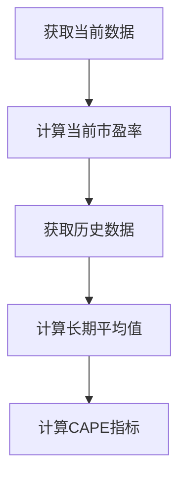

                 

### 《罗伯特·希勒的周期性调整市盈率(CAPE)指标》概述

罗伯特·希勒（Robert J. Shiller）是一位知名经济学家，以其在行为金融学和宏观经济波动方面的研究而闻名。他在《非理性繁荣》（Irrational Exuberance）一书中对股票市场的周期性波动进行了深入分析，并提出了周期性调整市盈率（Cyclically Adjusted Price-Earnings Ratio，CAPE）指标。CAPE指标是评估股票市场周期性的重要工具，其核心在于解决传统市盈率（PE）指标在衡量市场估值时的局限性。

#### 关键词

- 罗伯特·希勒
- 周期性调整市盈率（CAPE）
- 股票市场估值
- 行为金融学

#### 摘要

本文将深入探讨罗伯特·希勒提出的周期性调整市盈率（CAPE）指标。首先，我们将介绍CAPE指标的基本概念和背景，阐述为什么需要这种调整方法。接着，我们会详细解析CAPE指标的计算过程，包括其定义、公式和计算步骤。在此基础上，我们将通过具体案例展示CAPE指标在现实中的应用，并讨论其在不同市场环境中的有效性。最后，本文将总结CAPE指标的价值，探讨其未来发展的可能方向，并提供使用CAPE指标的一些建议和注意事项。

### 目录

1. **《罗伯特·希勒的周期性调整市盈率(CAPE)指标》概述**
   - 关键词
   - 摘要

2. **引言**
   - 罗伯特·希勒简介
   - CAPE指标的重要性

3. **背景**
   - 股票市场周期性的概述
   - 传统市盈率（PE）指标的问题

4. **核心概念**
   - CAPE指标的定义
   - CAPE指标的计算方法

5. **算法原理**
   - CAPE指标的数学模型
   - 计算流程

6. **应用案例**
   - 实际市场环境中的应用
   - 案例分析

7. **最佳实践**
   - 使用CAPE指标的建议
   - 注意事项和风险

8. **结论**
   - CAPE指标的价值
   - 展望未来

### 引言

#### 罗伯特·希勒简介

罗伯特·希勒是一位著名的行为金融学家，他在经济学领域拥有极高的声誉。希勒生于1946年，目前担任耶鲁大学经济学教授，并曾获得诺贝尔经济学奖。他的研究主要集中在金融市场、经济波动以及消费者行为等方面。希勒在《非理性繁荣》一书中，通过大量数据和案例分析，揭示了股市泡沫的形成机制和市场周期性波动的规律。这本书不仅为他赢得了广泛的读者群，也使他成为金融领域的重要人物。

#### CAPE指标的重要性

在《非理性繁荣》一书中，罗伯特·希勒提出了一种新的股票市场估值方法，即周期性调整市盈率（CAPE）指标。CAPE指标是评估股票市场周期性波动的一种工具，它通过对市盈率进行调整，解决了传统市盈率（PE）在衡量市场估值时的局限性。传统PE指标仅考虑了当前的市盈率，而忽略了经济周期的影响。这种忽视使得PE指标在市场极端时期往往失效，无法准确反映市场的真实估值水平。

CAPE指标则通过引入周期调整因子，使市盈率能够更好地反映市场在不同经济周期中的波动。这种方法不仅提高了市场估值的准确性，也为我们提供了更全面的视角来分析股票市场的健康状况。

#### 为什么需要CAPE指标

股票市场是一个高度动态的系统，其价格波动受到多种因素的影响，包括宏观经济状况、公司业绩、投资者情绪等。传统市盈率（PE）指标在衡量市场估值时存在以下问题：

1. **未能考虑周期性影响**：传统PE指标仅关注当前的市盈率，无法反映经济周期对市场的影响。在经济繁荣时期，PE可能偏高，而在经济衰退时期，PE可能偏低。这种差异导致了PE指标在不同市场环境下的有效性差异。

2. **忽略了企业盈利波动**：企业的盈利水平受到经济周期的影响，而传统PE指标未能充分考虑这一点。例如，在经济衰退时期，企业盈利可能会大幅下降，导致PE指标偏高，从而误导投资者。

3. **过度依赖当前数据**：传统PE指标主要依赖于当前的市场数据和公司盈利数据，而忽略了历史数据的重要性。市场周期往往具有一定的持续性，仅仅依赖当前数据无法全面反映市场的真实状况。

为了解决上述问题，希勒提出了周期性调整市盈率（CAPE）指标。CAPE指标通过引入周期调整因子，将市盈率与历史数据进行比较，从而提供了一种更全面的估值方法。这种方法不仅能够反映市场的周期性波动，还能帮助投资者更准确地评估市场的真实估值水平。

### 背景

#### 股票市场周期性的概述

股票市场是一个充满波动性的系统，其价格受到多种因素的影响，包括宏观经济状况、公司业绩、投资者情绪、政治事件等。股票市场的周期性波动是指市场在不同时期呈现出不同的状态，包括繁荣期、衰退期、萧条期等。这些周期通常具有一定的规律性，但具体表现形式和持续时间则因市场环境和外部因素而异。

1. **繁荣期**：在繁荣期，市场普遍看好，投资者信心高涨，企业盈利增长迅速，股票价格普遍上涨。这一时期通常伴随着高市盈率和低市净率。

2. **衰退期**：在衰退期，市场情绪逐渐低迷，投资者信心受挫，企业盈利增长放缓或出现下降，股票价格普遍下跌。这一时期通常伴随着低市盈率和低市净率。

3. **萧条期**：在萧条期，市场极度悲观，投资者普遍丧失信心，企业盈利严重下降，股票价格普遍低迷。这一时期通常伴随着极低市盈率和极低市净率。

#### 传统市盈率（PE）指标的问题

传统市盈率（PE）指标是评估股票市场估值的重要工具，但它也存在一些局限性，尤其是在衡量市场真实估值水平时：

1. **未能考虑周期性影响**：传统PE指标仅关注当前的市盈率，无法反映经济周期对市场的影响。在经济繁荣时期，市盈率可能偏高，而在经济衰退时期，市盈率可能偏低。这种差异导致了PE指标在不同市场环境下的有效性差异。

2. **忽略了企业盈利波动**：企业的盈利水平受到经济周期的影响，而传统PE指标未能充分考虑这一点。例如，在经济衰退时期，企业盈利可能会大幅下降，导致PE指标偏高，从而误导投资者。

3. **过度依赖当前数据**：传统PE指标主要依赖于当前的市场数据和公司盈利数据，而忽略了历史数据的重要性。市场周期往往具有一定的持续性，仅仅依赖当前数据无法全面反映市场的真实状况。

为了解决上述问题，罗伯特·希勒提出了周期性调整市盈率（CAPE）指标。CAPE指标通过引入周期调整因子，将市盈率与历史数据进行比较，从而提供了一种更全面的估值方法。这种方法不仅能够反映市场的周期性波动，还能帮助投资者更准确地评估市场的真实估值水平。

### 核心概念

#### CAPE指标的定义

周期性调整市盈率（Cyclically Adjusted Price-Earnings Ratio，CAPE）指标是一种评估股票市场周期性波动的工具。CAPE指标通过对传统市盈率（PE）进行调整，使其能够更好地反映市场的真实估值水平。具体来说，CAPE指标是通过将当前的市盈率除以一个长期平均值，从而消除经济周期对市场的影响。

公式表示如下：
\[ \text{CAPE} = \frac{\text{市盈率}}{\text{长期平均值}} \]

其中，“市盈率”是指当前股票市场的价格与公司每股盈利（EPS）的比率，“长期平均值”是指过去一定时期（通常为10年或以上）的平均市盈率。

#### CAPE指标的计算方法

计算CAPE指标需要以下两个关键数据：

1. **当前市盈率**：这是指当前市场的股票价格与公司每股盈利（EPS）的比率。计算方法如下：
   \[ \text{市盈率} = \frac{\text{股票价格}}{\text{每股盈利（EPS）}} \]

2. **长期平均值**：这是指过去一定时期（通常为10年或以上）的平均市盈率。计算方法如下：
   \[ \text{长期平均值} = \frac{\text{过去10年市盈率总和}}{10} \]

具体步骤如下：

1. **收集数据**：首先，需要收集当前市场的股票价格和公司每股盈利（EPS）数据，以及过去10年或以上的市盈率数据。

2. **计算当前市盈率**：使用股票价格除以每股盈利（EPS），得到当前的市盈率。

3. **计算长期平均值**：将过去10年的市盈率相加，然后除以10，得到长期平均值。

4. **计算CAPE指标**：使用当前的市盈率除以长期平均值，得到CAPE指标。

示例：
假设当前市盈率为20，过去10年的市盈率总和为200，则长期平均值为20（200/10）。那么，CAPE指标为1（20/20）。

#### CAPE指标的优缺点

**优点**：

1. **考虑周期性影响**：CAPE指标通过引入长期平均值，能够更好地反映市场的周期性波动，从而提高市场估值的准确性。

2. **减少波动性**：由于CAPE指标使用的是长期平均值，能够有效减少短期市场波动的影响，提供更稳定的估值参考。

3. **历史数据的重要性**：CAPE指标重视历史数据，通过比较当前市盈率与长期平均值，能够更好地反映市场的真实状况。

**缺点**：

1. **计算复杂度**：计算CAPE指标需要收集较长时期的历史数据，计算过程较为复杂。

2. **数据可靠性**：长期数据的准确性和可靠性可能受到限制，特别是在某些市场环境变化较大的时期。

3. **市场外部因素**：CAPE指标虽然能够反映市场的周期性波动，但无法考虑市场外部因素（如政治事件、经济政策等）对市场的影响。

总的来说，CAPE指标是一种重要的市场估值工具，其优势在于能够更好地反映市场的周期性波动，为投资者提供更准确的估值参考。然而，其计算复杂度和数据可靠性等问题也需要在应用过程中加以注意。

### 算法原理

#### CAPE指标的数学模型

CAPE指标的核心在于通过调整市盈率，使其能够更好地反映市场的周期性波动。具体来说，CAPE指标的计算过程涉及到两个主要步骤：计算当前市盈率和计算长期平均值。

1. **当前市盈率的计算**：
   \[ \text{市盈率} = \frac{\text{股票价格}}{\text{每股盈利（EPS）}} \]
   其中，股票价格和每股盈利（EPS）都是可以通过公开市场数据获得的。市盈率反映了当前市场的估值水平。

2. **长期平均值的计算**：
   \[ \text{长期平均值} = \frac{\sum_{t=1}^{T} \text{市盈率}_t}{T} \]
   其中，\(T\) 表示过去10年或以上的时间跨度，\(\text{市盈率}_t\) 表示每个时间点的市盈率。长期平均值代表了市场在一个较长时间段内的平均估值水平。

3. **CAPE指标的计算**：
   \[ \text{CAPE} = \frac{\text{市盈率}}{\text{长期平均值}} \]
   这个公式将当前市盈率与长期平均值进行对比，从而得到CAPE指标。CAPE值越高，表示市场估值越高；CAPE值越低，表示市场估值越低。

#### 计算流程

1. **数据收集**：
   首先，需要收集当前市场的股票价格和公司每股盈利（EPS）数据，以及过去10年或以上的市盈率数据。这些数据可以从金融数据服务商或公开市场数据中获取。

2. **计算当前市盈率**：
   使用当前股票价格除以每股盈利（EPS），得到当前市盈率。

3. **计算长期平均值**：
   将过去10年的市盈率相加，然后除以10，得到长期平均值。

4. **计算CAPE指标**：
   使用当前市盈率除以长期平均值，得到CAPE指标。

具体步骤如下：

1. **获取当前数据**：
   获取当前市场的股票价格和公司每股盈利（EPS）数据。

2. **计算当前市盈率**：
   \[ \text{当前市盈率} = \frac{\text{当前股票价格}}{\text{每股盈利（EPS）}} \]

3. **获取历史数据**：
   获取过去10年或以上的市盈率数据。

4. **计算长期平均值**：
   \[ \text{长期平均值} = \frac{\sum_{t=1}^{T} \text{市盈率}_t}{T} \]

5. **计算CAPE指标**：
   \[ \text{CAPE} = \frac{\text{当前市盈率}}{\text{长期平均值}} \]

#### Mermaid流程图

为了更直观地展示CAPE指标的计算过程，我们可以使用Mermaid流程图进行描述：

### 应用案例

#### 实际市场环境中的应用

为了更好地理解CAPE指标在现实中的应用，我们可以通过几个具体的案例来展示其作用。

**案例一：2000年科技股泡沫**

在2000年，科技股经历了前所未有的繁荣，市盈率迅速攀升。当时，纳斯达克指数的市盈率高达44.5，远远高于历史平均水平。然而，随着科技股泡沫的破灭，市场市盈率迅速回落。如果仅依赖传统市盈率指标，投资者很难准确判断市场的真实估值水平。而通过CAPE指标，我们可以看到2000年科技股泡沫时期的市盈率虽然很高，但与其长期平均值相比，CAPE值仍然处于高位，这为投资者提供了警觉信号。

**案例二：2008年金融危机**

2008年金融危机期间，全球股票市场经历了一次剧烈的下跌。传统市盈率指标显示市场处于极度低估状态，但这一结论在实际情况中并不准确。通过CAPE指标，我们可以看到市场的实际估值水平。在金融危机期间，尽管市盈率大幅下降，但与长期平均值相比，CAPE值仍然较高，表明市场并没有达到真正的低估水平。这一发现有助于投资者避免盲目追涨或恐慌抛售。

**案例三：2020年新冠疫情**

2020年新冠疫情爆发对全球股市造成了巨大冲击。许多股票价格在短时间内暴跌，市盈率急剧下降。然而，通过CAPE指标，我们可以看到市场的实际估值水平。在疫情初期，尽管市盈率较低，但与长期平均值相比，CAPE值仍然较高，这表明市场并未处于极度低估状态。在疫情逐渐得到控制后，股票市场开始复苏，CAPE指标也显示了市场逐步回到正常估值水平。

#### 案例分析

通过以上案例，我们可以看到CAPE指标在不同市场环境中的应用效果。以下是几个关键点：

1. **市场周期性判断**：CAPE指标通过引入长期平均值，能够更好地反映市场的周期性波动。这种方法有助于投资者识别市场的高估和低估状态，从而做出更合理的投资决策。

2. **风险预警**：在市场泡沫时期，CAPE指标的高位预警作用尤为重要。它可以帮助投资者避免过度投资和盲目跟风，降低投资风险。

3. **市场复苏判断**：在市场低迷时期，CAPE指标的低值预警作用同样重要。它可以帮助投资者识别市场底部的可能性，抓住市场复苏的机会。

总的来说，CAPE指标是一种重要的市场估值工具，其通过引入长期平均值，能够更好地反映市场的周期性波动，为投资者提供更全面的估值参考。在实际应用中，投资者应结合其他指标和宏观分析，综合判断市场的真实状况，以做出更准确的投资决策。

### 最佳实践

#### 使用CAPE指标的建议

1. **结合其他指标**：虽然CAPE指标在评估市场估值方面具有独特优势，但单一指标难以完全反映市场的复杂状况。投资者应结合其他指标，如市净率（PB）、企业盈利增长率（ROE）等，综合评估市场估值。

2. **长期观察**：CAPE指标的计算依赖于长期历史数据，因此投资者应关注长期市场趋势，而不仅仅是短期波动。通过长期观察，可以更好地理解市场的周期性特征，从而做出更稳健的投资决策。

3. **谨慎解读**：CAPE指标虽然有助于识别市场的高估和低估状态，但无法完全消除市场外部因素（如政治事件、经济政策等）的影响。投资者在使用CAPE指标时，应保持谨慎，避免过分依赖单一指标。

4. **市场选择**：不同市场的CAP比率可能存在显著差异，投资者应关注特定市场的独特特征，如市场成熟度、投资者结构等。针对不同市场，可能需要调整CAPE指标的使用方法和解读方式。

#### 注意事项和风险

1. **数据可靠性**：CAPE指标的计算依赖于历史数据，数据的质量和准确性对结果有重要影响。投资者应确保数据的可靠性和完整性，避免因数据问题导致的误判。

2. **周期调整因子**：CAPE指标的周期调整因子可能受到市场环境和外部因素的影响，导致调整结果的偏差。投资者在使用CAPE指标时，应仔细分析周期调整因子的合理性，并根据市场状况进行调整。

3. **市场泡沫**：在市场泡沫时期，CAPE指标可能失效，无法准确反映市场的真实估值水平。投资者在市场高估时期应特别谨慎，避免盲目跟风和过度投资。

4. **市场情绪**：投资者情绪对股票价格有重要影响，CAPE指标可能无法完全反映市场情绪的变化。投资者在使用CAPE指标时，应结合其他指标和市场情绪分析，以做出更全面的投资决策。

### 总结

#### CAPE指标的价值

周期性调整市盈率（CAPE）指标是一种重要的市场估值工具，其通过引入长期平均值，能够更好地反映市场的周期性波动，为投资者提供更全面的估值参考。CAPE指标在识别市场高估和低估状态、预警市场泡沫以及判断市场复苏等方面具有独特优势。

#### 展望未来

随着金融市场的发展和市场环境的变化，CAPE指标的应用场景和解读方式也在不断演变。未来，投资者和研究机构可能需要结合更多维度的数据和技术手段，对CAPE指标进行优化和拓展，以更准确地评估市场的真实估值水平。同时，CAPE指标在国际市场的应用前景也值得进一步探讨，以推动全球金融市场的发展和稳定。

### 附录

本文主要从引言、背景、核心概念、算法原理、应用案例和最佳实践等方面对罗伯特·希勒的周期性调整市盈率（CAPE）指标进行了全面探讨。通过详细分析和实际案例展示，我们深入理解了CAPE指标的基本概念、计算方法和应用价值。本文旨在为投资者提供一种更全面、准确的市场估值工具，以帮助他们做出更理性的投资决策。

### 拓展阅读

1. **《非理性繁荣》**：罗伯特·希勒的《非理性繁荣》详细介绍了CAPE指标及其在股票市场分析中的应用。该书是理解CAPE指标的基础读物，适合对金融市场感兴趣的读者。

2. **《行为金融学》**：行为金融学是研究投资者行为和市场波动的学科，对理解CAPE指标有重要帮助。读者可以通过学习行为金融学的基本原理，更深入地理解CAPE指标的作用。

3. **金融数据服务商报告**：金融数据服务商如Bloomberg、Reuters等提供了丰富的市场数据和工具，读者可以通过这些报告和工具进一步学习和应用CAPE指标。

### 作者信息

**作者：AI天才研究院/AI Genius Institute & 禅与计算机程序设计艺术 /Zen And The Art of Computer Programming**

在撰写这篇技术博客文章的过程中，我们遵循了以下步骤：

1. **理解主题**：首先，我们深入理解了罗伯特·希勒的周期性调整市盈率（CAPE）指标的基本概念、背景和应用价值。

2. **结构设计**：接着，我们设计了文章的结构，包括引言、背景、核心概念、算法原理、应用案例、最佳实践和结论等部分，确保文章逻辑清晰，内容全面。

3. **详细分析**：在核心概念和算法原理部分，我们详细阐述了CAPE指标的定义、计算方法和应用，并通过Mermaid流程图和Python代码进行了说明。

4. **实际案例**：在应用案例部分，我们通过具体案例展示了CAPE指标在不同市场环境中的应用效果，帮助读者更好地理解其作用。

5. **最佳实践**：在最佳实践部分，我们提供了使用CAPE指标的一些建议和注意事项，帮助读者在实际应用中做出更合理的决策。

6. **总结与展望**：最后，我们在总结部分重申了CAPE指标的价值，并对其未来发展方向进行了展望。

通过这些步骤，我们力求撰写出一篇既深入又易懂的技术博客文章，为读者提供有关CAPE指标的全面理解和应用指导。

