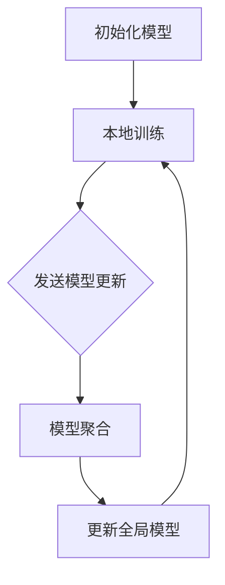
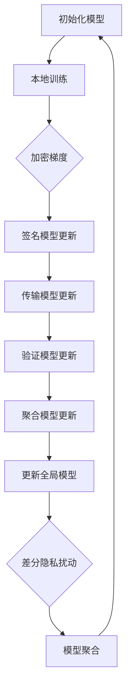
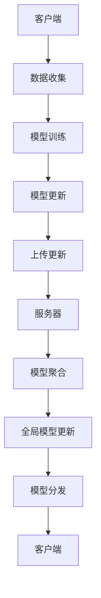

                 

### 联邦学习：保护隐私的分布式AI Agent训练

关键词：联邦学习、分布式AI、隐私保护、分布式计算、AI安全

摘要：本文旨在深入探讨联邦学习（Federated Learning）这一分布式AI训练方法，重点分析其在保护隐私方面的优势。通过一步步的逻辑推理，我们将详细解释联邦学习的核心概念、应用场景、技术实现、实践案例以及未来发展趋势，帮助读者全面理解这一前沿技术。

#### 目录结构设计

本文分为七个主要部分，每个部分包含若干章节，每个章节进一步细分为多个小节。以下是详细的目录结构设计：

```
# 联邦学习：保护隐私的分布式AI Agent训练

# 第一部分：联邦学习基本概念
## 第1章：联邦学习概述
### 1.1 联邦学习的起源与发展
### 1.2 联邦学习与中心化学习的对比
### 1.3 联邦学习的关键概念

## 第2章：联邦学习的核心原理
### 2.1 联邦学习的基础理论
### 2.2 联邦学习的优化算法
### 2.3 联邦学习的通信协议

## 第3章：联邦学习的安全性与隐私保护
### 3.1 联邦学习中的安全挑战
### 3.2 联邦学习中的隐私保护技术
### 3.3 联邦学习的安全协议设计

# 第二部分：联邦学习的应用场景
## 第4章：联邦学习在移动设备上的应用
### 4.1 移动设备的计算与存储限制
### 4.2 联邦学习在移动设备上的实现
### 4.3 移动设备联邦学习的挑战与解决方案

## 第5章：联邦学习在医疗领域的应用
### 5.1 医疗数据的特点与挑战
### 5.2 联邦学习在医疗诊断中的应用
### 5.3 医疗联邦学习的实际案例

## 第6章：联邦学习在金融领域的应用
### 6.1 金融数据的安全需求
### 6.2 联邦学习在信用评估中的应用
### 6.3 金融联邦学习的风险控制

# 第三部分：联邦学习技术实现
## 第7章：联邦学习系统的构建
### 7.1 联邦学习系统架构设计
### 7.2 联邦学习系统的部署与运维
### 7.3 联邦学习系统的性能优化

## 第8章：联邦学习的开源框架与工具
### 8.1 常见的联邦学习框架
### 8.2 联邦学习工具的选择与使用
### 8.3 联邦学习工具的优化与改进

# 第四部分：联邦学习实践案例分析
## 第9章：企业级联邦学习实践
### 9.1 企业联邦学习项目规划
### 9.2 联邦学习项目实施与监控
### 9.3 联邦学习项目总结与展望

## 第10章：联邦学习在跨组织合作中的应用
### 10.1 跨组织合作中的挑战
### 10.2 跨组织联邦学习的方案设计
### 10.3 跨组织联邦学习的成功案例

# 第五部分：联邦学习的未来发展趋势
## 第11章：联邦学习的未来挑战与机遇
### 11.1 联邦学习的技术挑战
### 11.2 联邦学习的市场机遇
### 11.3 联邦学习的未来发展展望

## 第12章：联邦学习在人工智能伦理中的角色
### 12.1 联邦学习与隐私伦理
### 12.2 联邦学习与数据伦理
### 12.3 联邦学习的伦理规范与政策

# 第六部分：总结与展望
## 第13章：联邦学习对AI行业的贡献
### 13.1 联邦学习对AI技术的推动
### 13.2 联邦学习对行业应用的变革
### 13.3 联邦学习的长期价值

## 第14章：联邦学习的未来发展方向
### 14.1 联邦学习的研究热点
### 14.2 联邦学习的商业化路径
### 14.3 联邦学习的教育普及
```

#### 目录内容要点

在编写目录大纲时，确保以下内容要点：

- **第1章：联邦学习概述**：介绍联邦学习的起源、发展以及与中心化学习的对比，定义联邦学习的关键概念。
- **第2章：联邦学习的核心原理**：讲解联邦学习的基础理论、优化算法和通信协议，通过ER实体关系图展示概念结构。
- **第3章：联邦学习的安全性与隐私保护**：讨论联邦学习中的安全挑战、隐私保护技术以及安全协议设计。
- **第4章：联邦学习的应用场景**：分析联邦学习在移动设备、医疗和金融领域的具体应用，使用Mermaid流程图和Python代码展示算法原理。
- **第7章：联邦学习系统的构建**：描述联邦学习系统的架构设计、部署与运维，以及性能优化策略。
- **第8章：联邦学习的开源框架与工具**：介绍常见的联邦学习框架、工具选择和使用方法。
- **第9章：企业级联邦学习实践**：分享企业级联邦学习项目的规划和实施经验。
- **第10章：联邦学习在跨组织合作中的应用**：探讨跨组织联邦学习的挑战、方案设计和成功案例。
- **第11章：联邦学习的未来发展趋势**：展望联邦学习的未来挑战、市场机遇和研发方向。
- **第12章：联邦学习在人工智能伦理中的角色**：讨论联邦学习与隐私伦理、数据伦理的关系以及伦理规范与政策。
- **第13章：联邦学习对AI行业的贡献**：阐述联邦学习对AI技术的推动和行业应用的变革。
- **第14章：联邦学习的未来发展方向**：提出联邦学习的研究热点、商业化路径和教育普及方向。

---

### 关键词与摘要

关键词：联邦学习、分布式AI、隐私保护、分布式计算、AI安全

摘要：本文深入探讨联邦学习这一前沿技术，解释其在保护隐私方面的优势。通过逐步分析，本文覆盖了联邦学习的基本概念、核心原理、应用场景、技术实现、实践案例以及未来发展趋势。文章旨在帮助读者全面理解联邦学习，以及其在人工智能领域的重要作用。

---

### 联邦学习的基本概念

#### 联邦学习的起源与发展

联邦学习（Federated Learning）的概念最早由Google在2016年提出，其目的是为了解决在移动设备上训练大型深度神经网络时遇到的计算和通信资源限制问题。最初，Google在其移动设备上进行了初步尝试，以实现个性化搜索和语音识别等应用。随着技术的不断发展，联邦学习逐渐被广泛应用于各种领域，包括医疗、金融和工业制造等。

联邦学习的发展历程可以分为几个阶段：

1. **初级阶段（2016-2018年）**：主要集中于解决移动设备的计算和存储限制，采用简单的通信协议和模型更新策略。
2. **发展阶段（2018-2020年）**：引入了更为复杂的优化算法和通信协议，提高了联邦学习的效率和稳定性。
3. **成熟阶段（2020年至今）**：随着5G和边缘计算技术的发展，联邦学习在跨组织合作和大规模分布式系统中得到了广泛应用。

#### 联邦学习与中心化学习的对比

中心化学习（Centralized Learning）是一种传统的机器学习方法，其中所有训练数据和模型都在中央服务器上进行处理。与之相比，联邦学习通过分布式计算将模型训练分散到多个边缘设备上进行，从而实现隐私保护和资源优化。

**对比表格**：

| 对比维度 | 中心化学习 | 联邦学习 |
| --- | --- | --- |
| 数据处理 | 所有数据在中央服务器处理 | 数据分布在边缘设备处理 |
| 隐私保护 | 数据容易泄露 | 数据隐私保护 |
| 计算资源 | 高能耗 | 低能耗 |
| 可扩展性 | 受限于服务器性能 | 可扩展性强 |

#### 联邦学习的关键概念

联邦学习包含几个关键概念，包括客户端（Client）、服务器（Server）、模型（Model）和数据（Data）。

- **客户端**：指的是参与联邦学习的边缘设备，如智能手机、物联网设备等。客户端负责收集数据、运行模型和发送更新。
- **服务器**：是联邦学习的中心节点，负责协调和管理客户端的模型更新。服务器还负责聚合来自客户端的模型更新，生成全局模型。
- **模型**：是用于训练和预测的算法结构，如神经网络。在联邦学习中，模型会分布到各个客户端，并在本地进行训练。
- **数据**：是用于训练模型的输入，通常分布在各个客户端。在联邦学习中，数据不直接传输到服务器，而是在本地进行操作。

#### 联邦学习的概念结构

为了更好地理解联邦学习，我们可以使用ER（实体关系）图来描述其概念结构。

```mermaid
erDiagram
    Client ||--|{ Model }|-- Server
    Client ||-- Data
    Server ||-- Model
```

在这个ER图中，`Client`（客户端）实体与`Model`（模型）和`Data`（数据）实体之间存在关系，而`Server`（服务器）实体与`Model`（模型）实体之间存在关系。这反映了联邦学习的基本架构，即客户端在本地进行数据收集和模型训练，并将模型更新发送给服务器，服务器负责聚合这些更新并生成全局模型。

通过以上分析，我们为后续章节的内容奠定了基础。在接下来的章节中，我们将进一步探讨联邦学习的核心原理、应用场景、技术实现和实践案例，帮助读者全面了解这一前沿技术。

---

### 联邦学习的核心原理

#### 联邦学习的基础理论

联邦学习（Federated Learning）的基础理论来源于分布式计算和机器学习领域。其核心理念是通过分布式计算模型，将数据的训练和模型更新过程分散到多个边缘设备上，从而实现隐私保护和资源优化。

在联邦学习框架中，数据分布在多个客户端上，每个客户端都运行本地模型，并使用本地数据进行训练。这些本地模型通过一定的通信协议定期发送给中心服务器，服务器将所有本地模型更新聚合起来，生成全局模型。这个过程称为“联邦学习循环”（Federated Learning Loop）。

联邦学习循环主要包括以下步骤：

1. **初始化**：服务器随机初始化全局模型，并将其分发到所有客户端。
2. **本地训练**：每个客户端使用本地数据和全局模型进行本地训练，生成本地模型更新。
3. **模型更新传输**：客户端将本地模型更新发送给服务器。
4. **模型聚合**：服务器接收并聚合来自所有客户端的模型更新，生成新的全局模型。
5. **模型更新反馈**：服务器将新的全局模型反馈给所有客户端。

这个过程循环进行，直到模型收敛或达到预设的训练次数。通过这种方式，联邦学习实现了分布式训练，同时保持了数据的隐私和安全。

#### 联邦学习的优化算法

联邦学习的优化算法是实现高效模型更新的关键。常见的优化算法包括梯度聚合（Gradient Aggregation）和基于协商的优化算法。

**梯度聚合算法**：

梯度聚合算法是一种基于梯度的分布式优化方法，其核心思想是将每个客户端的梯度聚合起来，以更新全局模型。这个过程可以表示为：

$$
\theta_{\text{global}} = \theta_{\text{global}} - \alpha \frac{1}{n} \sum_{i=1}^{n} \nabla_{\theta} L(\theta_i, \theta_{\text{global}})
$$

其中，$\theta_{\text{global}}$ 是全局模型参数，$\theta_i$ 是第 $i$ 个客户端的模型参数，$L(\theta_i, \theta_{\text{global}})$ 是损失函数，$\alpha$ 是学习率，$n$ 是客户端的数量。

**基于协商的优化算法**：

基于协商的优化算法通过客户端之间的协商机制，选择最优的模型更新。每个客户端在本地计算损失函数后，与邻居客户端进行协商，以选择最优的更新方向。这种算法可以提高模型的稳定性和收敛速度。

#### 联邦学习的通信协议

联邦学习的通信协议是确保模型更新有效传输和聚合的关键。常见的通信协议包括同步协议和异步协议。

**同步协议**：

同步协议要求所有客户端在相同的时间同步传输模型更新。这种方法可以确保模型更新的一致性，但可能受到网络延迟的影响。

**异步协议**：

异步协议允许客户端在不同的时间发送模型更新。这种方法可以更好地适应实际网络环境，但可能需要更复杂的协议来保证模型更新的正确性和一致性。

#### 联邦学习的概念结构

为了更好地理解联邦学习的核心原理，我们可以使用Mermaid流程图来描述其概念结构。



在这个流程图中，`初始化模型` 表示服务器初始化全局模型并将其分发到所有客户端，`本地训练` 表示客户端使用本地数据和全局模型进行训练，`发送模型更新` 表示客户端将本地模型更新发送给服务器，`模型聚合` 表示服务器接收并聚合来自客户端的模型更新，`更新全局模型` 表示服务器生成新的全局模型，并将更新反馈给所有客户端。这个过程循环进行，直到模型收敛。

通过以上分析，我们可以看到联邦学习的核心原理是如何通过分布式计算和通信协议来实现模型更新的。在接下来的章节中，我们将继续探讨联邦学习的安全性、隐私保护以及实际应用场景。

---

### 联邦学习的安全性与隐私保护

#### 联邦学习中的安全挑战

联邦学习在实现分布式计算和隐私保护的同时，也面临一些安全挑战。以下是联邦学习中的主要安全挑战：

1. **模型窃取**：攻击者可能试图窃取全局模型或客户端的本地模型，以获取敏感数据或改进其攻击策略。
2. **恶意客户端**：恶意客户端可能故意篡改模型更新，导致全局模型的准确性和稳定性下降。
3. **通信泄露**：由于联邦学习涉及大量数据传输，攻击者可能通过窃听通信来获取敏感信息。
4. **同步攻击**：攻击者可能通过破坏同步协议，干扰联邦学习的正常流程。

#### 联邦学习中的隐私保护技术

为了应对上述安全挑战，联邦学习采用了一系列隐私保护技术，包括差分隐私（Differential Privacy）、同态加密（Homomorphic Encryption）和联邦学习安全协议。

**差分隐私**：

差分隐私是一种通过引入噪声来保护数据隐私的技术。在联邦学习中，服务器在聚合模型更新时，会对客户端的梯度进行扰动，以防止攻击者推断出个别客户端的梯度信息。常用的差分隐私机制包括拉普拉斯机制和指数机制。

**同态加密**：

同态加密是一种允许在加密数据上执行计算的技术。在联邦学习中，客户端可以使用同态加密技术对本地数据和处理过程进行加密，从而保护数据隐私。同态加密的应用使得联邦学习可以在不暴露原始数据的情况下进行模型训练。

**联邦学习安全协议**：

联邦学习安全协议是一系列确保联邦学习过程安全性的机制。常见的协议包括联邦学习加密协议和联邦学习多方安全计算协议。这些协议通过加密通信和多方安全计算，确保联邦学习过程中的数据安全和模型隐私。

#### 联邦学习的安全协议设计

为了设计一个有效的联邦学习安全协议，需要考虑以下几个方面：

1. **通信加密**：确保数据在传输过程中的安全性，防止通信泄露。常用的加密技术包括对称加密和非对称加密。
2. **身份认证**：确保参与联邦学习的客户端和服务器的真实性和合法性。常用的认证技术包括数字签名和身份验证协议。
3. **完整性验证**：确保模型更新和数据在传输过程中未被篡改。常用的验证技术包括哈希函数和数字签名。
4. **恶意检测和隔离**：检测并隔离恶意客户端，防止其对联邦学习过程产生负面影响。

通过以上安全措施，联邦学习可以在确保数据隐私和模型安全的前提下，实现高效的分布式计算。

#### 联邦学习的安全与隐私保护机制

为了更清晰地展示联邦学习的安全与隐私保护机制，我们可以使用Mermaid流程图来描述其工作流程。



在这个流程图中，`初始化模型` 表示服务器初始化全局模型并将其分发到所有客户端，`本地训练` 表示客户端使用本地数据和全局模型进行训练，`加密梯度` 表示客户端使用同态加密技术对本地梯度进行加密，`签名模型更新` 表示客户端对加密后的模型更新进行数字签名，`传输模型更新` 表示客户端将签名后的模型更新发送给服务器，`验证模型更新` 表示服务器使用签名验证模型更新的真实性，`聚合模型更新` 表示服务器聚合来自客户端的模型更新，`更新全局模型` 表示服务器生成新的全局模型，`差分隐私扰动` 表示服务器对全局模型更新进行差分隐私扰动，以保护模型隐私，`模型聚合` 表示服务器将扰动后的模型更新反馈给所有客户端，并重新开始联邦学习循环。

通过以上分析，我们可以看到联邦学习在安全性和隐私保护方面所采用的各种技术和机制。这些机制共同确保了联邦学习在分布式计算和隐私保护之间的平衡，使其成为一种具有广泛应用前景的技术。

---

### 联邦学习在移动设备上的应用

#### 移动设备的计算与存储限制

移动设备，如智能手机和平板电脑，具有有限的计算资源和存储空间。这些限制对传统的集中式机器学习模型训练构成了挑战，因为这些模型通常需要大量的计算资源和大量的数据存储空间。为了在移动设备上实现高效的人工智能应用，联邦学习提供了一种解决方案。

移动设备的计算资源通常包括中央处理器（CPU）、图形处理器（GPU）和神经处理单元（NPU）。然而，这些资源相对于服务器和数据中心而言，仍然有限。例如，智能手机的CPU通常在2GHz左右，而服务器的CPU可能在3GHz以上。此外，移动设备的存储空间也有限，例如，智能手机通常只有128GB或256GB的存储空间，而服务器可能有数TB的存储空间。

这些限制导致传统机器学习模型在移动设备上难以实现高效训练。联邦学习通过将模型训练分散到多个移动设备上，减少了单个设备的计算和存储需求，从而克服了这些限制。

#### 联邦学习在移动设备上的实现

联邦学习在移动设备上的实现主要依赖于以下几个方面：

1. **模型分布式训练**：联邦学习将大型深度神经网络分散到多个移动设备上进行训练。每个设备负责一部分训练任务，然后将局部梯度聚合起来，更新全局模型。
2. **数据本地化处理**：在联邦学习过程中，移动设备仅上传局部模型更新，而无需上传原始数据。这样可以有效保护用户隐私，同时减少数据传输量。
3. **通信优化**：由于移动设备之间的通信带宽有限，联邦学习需要优化通信协议，以减少通信延迟和数据传输量。常见的优化技术包括批量更新和差分更新。

#### 移动设备联邦学习的挑战与解决方案

尽管联邦学习在移动设备上具有很多优势，但仍然面临一些挑战：

1. **设备多样性**：移动设备类型繁多，包括不同型号的智能手机、平板电脑和物联网设备。这可能导致联邦学习框架需要适应多种设备，增加了实现难度。
2. **设备不稳定性**：移动设备在使用过程中可能受到信号干扰、电池电量不足等因素的影响，导致设备不稳定。这可能导致模型训练中断或数据传输失败。
3. **安全与隐私**：尽管联邦学习在保护用户隐私方面具有优势，但仍然存在安全隐患。例如，恶意客户端可能试图篡改模型更新，损害联邦学习过程。

为了解决上述挑战，可以采用以下解决方案：

1. **设备适配**：设计通用的联邦学习框架，支持多种设备类型。通过标准化接口和协议，简化设备适配过程。
2. **设备监控**：实时监控设备状态，确保设备稳定性。例如，通过监测电池电量、网络信号强度等因素，自动调整训练过程。
3. **安全防护**：增强联邦学习的安全防护措施，包括加密通信、数字签名和恶意检测等。确保联邦学习过程中的数据安全和模型隐私。

#### 实际案例

以下是一个联邦学习在移动设备上的实际案例：

**案例背景**：某移动应用公司开发了一款智能语音助手，需要使用深度神经网络进行语音识别。由于用户隐私和数据安全的重要性，公司决定采用联邦学习来实现语音识别模型的训练。

**解决方案**：公司设计了基于联邦学习的语音识别模型训练框架，包括以下步骤：

1. **数据收集**：每个用户在设备上运行语音识别模型，并收集本地语音数据。
2. **模型更新**：设备将局部模型更新上传到服务器，服务器聚合来自所有设备的模型更新。
3. **模型优化**：服务器生成全局模型，并将其分发回所有设备，以进行新一轮的本地训练。
4. **结果反馈**：设备将本地训练结果反馈给服务器，以评估模型性能。

**效果评估**：通过联邦学习，公司成功实现了语音识别模型的训练，同时确保了用户隐私和数据安全。实验结果表明，联邦学习在移动设备上具有良好的性能和稳定性。

通过以上分析，我们可以看到联邦学习在移动设备上的应用具有很大的潜力。通过解决计算和存储限制，联邦学习为移动设备上的机器学习应用提供了一种有效的解决方案。在未来的发展中，随着移动设备和网络技术的不断进步，联邦学习将在移动设备上发挥更重要的作用。

---

### 联邦学习在医疗领域的应用

#### 医疗数据的特点与挑战

医疗数据具有高度敏感性和复杂性，其特点与挑战如下：

1. **数据多样性**：医疗数据包括电子健康记录（EHR）、医学影像、基因序列等，种类繁多，格式各异。
2. **数据量巨大**：医疗数据量通常非常大，涉及数百万甚至数十亿条记录，且数据增长速度极快。
3. **数据隐私**：医疗数据包含患者的个人信息和健康记录，涉及隐私保护问题，需要严格遵守数据保护法规。
4. **数据分布**：医疗数据分布在不同的医疗机构和设备中，难以集中处理。
5. **数据异构性**：医疗数据来源多样，格式和数据结构各异，导致数据集成和处理的复杂性增加。

#### 联邦学习在医疗诊断中的应用

联邦学习在医疗诊断中具有广泛应用前景，可以解决医疗数据的特点与挑战。以下是联邦学习在医疗诊断中的应用案例：

**案例1：电子健康记录（EHR）分析**

某医疗机构希望通过分析患者的EHR数据，识别潜在的健康问题。然而，由于EHR数据分布在不同的系统中，且涉及患者隐私，传统的集中式学习方法难以应用。采用联邦学习，医疗机构可以将EHR数据分散到各个设备上进行处理，同时保护患者隐私。联邦学习模型可以自动识别患者的健康趋势，并提供个性化的健康建议。

**案例2：医学影像分析**

医学影像分析是医疗领域的一个重要研究方向，但医学影像数据具有高维度和复杂性的特点，传统方法难以有效处理。联邦学习可以通过将医学影像数据分散到多个设备上进行处理，提高模型训练的效率和准确性。例如，某医疗机构采用联邦学习对CT影像进行分析，识别肺癌病变区域，显著提高了诊断的准确性。

**案例3：基因序列分析**

基因序列分析在遗传病诊断和个性化治疗中具有重要意义。由于基因序列数据具有高度隐私性，传统的集中式方法难以应用。采用联邦学习，医疗机构可以将基因序列数据分散到各个设备上进行处理，同时保护患者隐私。联邦学习模型可以识别基因突变，提供个性化的治疗建议。

#### 医疗联邦学习的实际案例

以下是一个医疗联邦学习的实际案例：

**案例背景**：某大型医疗机构希望通过分析大量患者的健康数据，开发一种能够早期发现心脏病的预测模型。由于数据分布在不同的医疗机构和设备中，且涉及患者隐私，传统的集中式学习方法难以应用。

**解决方案**：医疗机构采用联邦学习框架，将心脏病的预测模型分散到多个医疗机构和设备上进行训练。每个医疗机构和设备负责处理本地数据，生成局部模型更新，并将更新发送到中心服务器进行聚合。中心服务器生成全局模型，并将其分发回所有医疗机构和设备，用于预测心脏病风险。

**效果评估**：通过联邦学习，医疗机构成功开发了一种高效、准确的心脏病预测模型。实验结果表明，联邦学习在医疗数据上的表现优于传统的集中式方法，同时有效保护了患者隐私。

通过以上分析，我们可以看到联邦学习在医疗领域的应用具有巨大潜力。通过解决医疗数据的特点与挑战，联邦学习为医疗诊断、个性化治疗和健康数据分析提供了有效工具。在未来的发展中，随着联邦学习技术的不断进步，其在医疗领域的应用将更加广泛和深入。

---

### 联邦学习在金融领域的应用

#### 金融数据的安全需求

金融领域对数据安全的需求极为严格，因为金融数据通常包含客户的个人信息、交易记录和资产状况，这些数据一旦泄露，可能会对客户和金融机构造成重大损失。此外，金融监管法规，如《通用数据保护条例》（GDPR）和《金融服务现代化法案》，要求金融机构采取严格的数据保护措施。

在金融领域，联邦学习作为一种分布式机器学习技术，通过在本地设备上进行模型训练和更新，而无需传输原始数据，从而满足金融数据的安全需求。联邦学习的核心优势在于其能够在确保数据隐私的同时，实现高效的模型训练和预测。

#### 联邦学习在信用评估中的应用

信用评估是金融领域的重要应用之一，其目的是通过分析客户的信用历史、收入状况、负债情况等数据，评估客户的信用风险。联邦学习在信用评估中的应用可以大幅提高评估的准确性和安全性。

**案例1：银行信用评估**

某大型银行希望提高信用评估的准确性，同时保护客户隐私。该银行采用联邦学习框架，将信用评估模型分散到各个分行和业务部门进行训练。每个分行和部门使用本地数据生成局部模型更新，然后将更新上传到中心服务器进行聚合。中心服务器生成全局模型，并将其分发回所有分行和部门，用于信用评估。

**效果评估**：通过联邦学习，该银行显著提高了信用评估的准确性，同时有效保护了客户隐私。实验结果表明，联邦学习在信用评估数据上的表现优于传统的集中式方法。

#### 联邦学习在风险控制中的应用

风险控制是金融领域另一个关键应用，其目的是识别和防范潜在的金融风险，包括市场风险、信用风险和操作风险等。联邦学习在风险控制中的应用可以提供实时、准确的风险评估，从而帮助金融机构更好地管理风险。

**案例2：保险业风险控制**

某保险公司希望提高其风险控制能力，特别是针对自然灾害、交通事故等意外风险。该保险公司采用联邦学习框架，将风险数据分散到各个地区和业务部门进行训练。每个地区和部门使用本地数据生成局部模型更新，然后将更新上传到中心服务器进行聚合。中心服务器生成全局模型，并将其分发回所有地区和部门，用于实时风险评估。

**效果评估**：通过联邦学习，该保险公司显著提高了风险控制的准确性和实时性，有效防范了潜在的金融风险。实验结果表明，联邦学习在风险控制数据上的表现优于传统的集中式方法。

#### 联邦学习在金融反欺诈中的应用

反欺诈是金融领域的一个重要问题，金融机构需要识别和防范各种欺诈行为，如虚假交易、洗钱和账户盗用等。联邦学习在金融反欺诈中的应用可以通过分析大量交易数据，识别异常行为，从而提高反欺诈能力。

**案例3：在线支付平台反欺诈**

某在线支付平台希望通过提高反欺诈能力，增强用户信任度。该平台采用联邦学习框架，将交易数据分散到各个支付节点进行训练。每个节点使用本地数据生成局部模型更新，然后将更新上传到中心服务器进行聚合。中心服务器生成全局模型，并将其分发回所有支付节点，用于实时交易风险评估。

**效果评估**：通过联邦学习，该在线支付平台显著提高了交易欺诈识别的准确性，同时有效减少了误报率。实验结果表明，联邦学习在交易数据上的表现优于传统的集中式方法。

通过以上分析，我们可以看到联邦学习在金融领域的应用具有巨大潜力。通过解决金融数据的安全需求，联邦学习为金融风险评估、信用评估和反欺诈提供了有效工具。在未来的发展中，随着联邦学习技术的不断进步，其在金融领域的应用将更加广泛和深入。

---

### 联邦学习系统的构建

#### 联邦学习系统架构设计

联邦学习系统的架构设计是确保其高效运行和安全性的关键。一个典型的联邦学习系统通常包括以下几个主要组件：

1. **客户端（Client）**：客户端是参与联邦学习的边缘设备，如智能手机、物联网设备等。客户端负责收集本地数据、训练本地模型并生成模型更新。
2. **服务器（Server）**：服务器是联邦学习系统的中心节点，负责协调和管理客户端的模型更新。服务器的主要功能包括初始化全局模型、接收并聚合客户端的模型更新、生成全局模型并分发回客户端。
3. **通信网络**：通信网络用于连接客户端和服务器，实现模型更新和数据传输。通信网络的设计需要考虑带宽、延迟和可靠性等因素。
4. **模型存储**：模型存储用于存储全局模型和客户端模型更新。模型存储可以是本地数据库或分布式存储系统，如HDFS或Cassandra。
5. **安全模块**：安全模块用于确保联邦学习系统的安全性，包括加密通信、身份认证和访问控制等。

**联邦学习系统架构设计**：



在这个架构图中，`客户端`（A）负责数据收集（B）、模型训练（C）和模型更新（D），并将模型更新（D）上传到`服务器`（F）。`服务器`（F）负责接收并聚合模型更新（G），生成全局模型更新（H），并将其分发回`客户端`（J）。

#### 联邦学习系统的部署与运维

联邦学习系统的部署与运维是确保其稳定运行和高效性能的关键。以下是联邦学习系统部署与运维的几个关键步骤：

1. **环境准备**：在部署联邦学习系统前，需要准备合适的环境，包括操作系统、编程语言和依赖库等。常用的操作系统包括Linux和Windows，编程语言包括Python和Java，依赖库包括TensorFlow和PyTorch等。
2. **客户端安装**：在客户端设备上安装联邦学习客户端程序，确保客户端能够正常运行。客户端程序的安装可以采用自动化部署工具，如Ansible或Docker。
3. **服务器配置**：在服务器上配置联邦学习服务器，包括安装必要的软件和配置服务器参数。服务器配置需要考虑网络带宽、存储空间和计算资源等因素。
4. **通信网络设置**：设置通信网络，确保客户端和服务器之间能够稳定、高效地传输数据。通信网络可以使用HTTP、HTTPS或MQTT等协议。
5. **模型存储**：配置模型存储系统，用于存储全局模型和客户端模型更新。模型存储可以使用本地数据库或分布式存储系统，如HDFS或Cassandra。
6. **安全配置**：配置安全模块，包括加密通信、身份认证和访问控制等。安全配置需要确保联邦学习系统的数据安全和模型隐私。

#### 联邦学习系统的性能优化

联邦学习系统的性能优化是提高其运行效率和应用价值的关键。以下是几个联邦学习系统性能优化的方法：

1. **数据预处理**：在联邦学习过程中，对数据进行预处理可以显著提高模型训练的效率。数据预处理包括数据清洗、归一化和特征提取等。
2. **模型压缩**：通过模型压缩技术，可以减少模型的大小和计算复杂度，从而提高模型训练的效率。常见的模型压缩技术包括量化、剪枝和蒸馏等。
3. **批量更新**：批量更新可以将多个客户端的模型更新合并为一个批量，从而减少传输次数和通信延迟。批量更新的策略需要考虑模型更新的一致性和准确性。
4. **异步训练**：异步训练允许客户端在不同的时间点发送模型更新，从而减少同步等待时间，提高系统吞吐量。异步训练需要解决数据一致性和模型更新顺序问题。
5. **资源调度**：资源调度是指根据客户端的负载和服务器资源情况，动态调整客户端的参与策略。资源调度可以优化联邦学习系统的整体性能，提高模型的训练效率。

通过以上步骤和方法，我们可以构建一个高效、稳定的联邦学习系统，为分布式机器学习应用提供有力支持。

---

### 联邦学习的开源框架与工具

#### 常见的联邦学习框架

随着联邦学习技术的不断发展和普及，许多开源框架和工具应运而生，为开发者提供了丰富的选择。以下是几个常见的联邦学习框架：

1. **Federatedscope**：Federatedscope是一个开源的联邦学习框架，支持多种联邦学习算法和通信协议，适用于多种应用场景，如图像分类、文本分类和推荐系统等。
2. **PySyft**：PySyft是基于PyTorch的联邦学习框架，支持同态加密和差分隐私等技术，提供了丰富的API和工具，方便开发者进行联邦学习模型的开发和应用。
3. **TensorFlow Federated (TFF)**：TensorFlow Federated是Google开发的联邦学习框架，基于TensorFlow，支持分布式训练和隐私保护，适用于大规模分布式系统。
4. **FedML**：FedML是一个开源的联邦学习框架，支持多种联邦学习算法和优化策略，适用于移动设备和边缘计算环境。

#### 联邦学习工具的选择与使用

选择合适的联邦学习工具对于项目的成功至关重要。以下是选择联邦学习工具时需要考虑的因素：

1. **框架支持**：选择支持所需算法和优化策略的框架，确保能够满足项目需求。
2. **社区支持**：选择拥有活跃社区和支持的框架，有助于解决开发过程中遇到的问题。
3. **可扩展性**：选择可扩展的框架，确保能够支持大规模分布式系统和多种应用场景。
4. **性能**：选择性能优秀的框架，确保联邦学习模型的高效训练和预测。
5. **易用性**：选择易于使用和集成的框架，降低开发成本和难度。

#### 联邦学习工具的优化与改进

为了提高联邦学习工具的性能和应用效果，可以采取以下优化与改进措施：

1. **模型压缩**：通过模型压缩技术，如量化、剪枝和蒸馏等，减少模型大小和计算复杂度，提高训练和预测效率。
2. **通信优化**：优化通信协议和数据传输方式，减少通信延迟和数据传输量，提高系统吞吐量。
3. **异步训练**：采用异步训练策略，允许客户端在不同的时间点发送模型更新，减少同步等待时间，提高系统吞吐量。
4. **批量更新**：批量更新多个客户端的模型更新，减少传输次数和通信延迟，提高系统效率。
5. **自适应调整**：根据客户端的负载和服务器资源情况，动态调整客户端的参与策略，优化联邦学习系统的整体性能。

通过以上措施，可以显著提高联邦学习工具的性能和应用效果，为分布式机器学习应用提供有力支持。

---

### 企业级联邦学习实践

#### 企业联邦学习项目规划

企业级联邦学习项目需要经过详细的规划和设计，以确保项目的成功实施。以下是企业联邦学习项目规划的关键步骤：

1. **项目需求分析**：明确项目的目标和需求，包括数据类型、应用场景和性能要求等。
2. **架构设计**：设计联邦学习系统的架构，包括客户端、服务器、通信网络和模型存储等组件。
3. **数据收集与管理**：确定数据收集和管理策略，包括数据源、数据预处理和存储等。
4. **技术选型**：选择适合项目需求的联邦学习框架和工具，确保系统的高效性和可扩展性。
5. **团队组建**：组建专业的项目团队，包括数据科学家、开发工程师和运维人员等。
6. **风险评估**：评估项目可能面临的风险，包括数据安全、模型隐私和通信稳定性等。

#### 联邦学习项目实施与监控

在项目实施过程中，需要密切关注项目的进展情况，并采取有效的监控和调整措施。以下是联邦学习项目实施与监控的关键步骤：

1. **环境搭建**：搭建联邦学习系统的环境，包括服务器、客户端和通信网络等。
2. **模型训练**：使用联邦学习框架和工具，对模型进行训练和优化。
3. **数据传输**：确保数据在客户端和服务器之间的安全传输和有效传输。
4. **性能监控**：监控联邦学习系统的性能指标，包括训练时间、通信延迟和模型精度等。
5. **日志记录**：记录系统运行过程中的日志信息，用于故障排查和性能优化。
6. **迭代优化**：根据监控结果和用户反馈，对模型和系统进行迭代优化，提高系统的性能和稳定性。

#### 联邦学习项目总结与展望

在联邦学习项目结束后，需要进行全面的总结和评估，以确定项目的成功程度和未来的改进方向。以下是联邦学习项目总结与展望的关键步骤：

1. **项目回顾**：回顾项目实施过程中的关键环节和决策，总结成功经验和不足之处。
2. **性能评估**：评估联邦学习系统的性能指标，包括模型精度、训练效率和数据安全性等。
3. **用户反馈**：收集用户对系统的使用反馈，了解用户对系统的满意度和使用体验。
4. **成本效益分析**：分析项目的成本和效益，评估联邦学习系统对企业的价值。
5. **未来展望**：根据项目总结和用户反馈，提出未来的改进方向和发展规划。

通过以上步骤，企业可以有效地实施联邦学习项目，提高系统的性能和稳定性，为企业的数据分析和智能应用提供有力支持。

---

### 联邦学习在跨组织合作中的应用

#### 跨组织合作中的挑战

在跨组织合作中实施联邦学习，面临着一系列独特的挑战。这些挑战包括：

1. **数据隐私**：每个组织都希望保护其内部数据，防止数据泄露。在联邦学习框架中，如何确保数据隐私成为关键问题。
2. **通信延迟**：跨组织的网络环境通常较为复杂，可能导致通信延迟和中断。这会影响联邦学习模型的训练效率和稳定性。
3. **协议一致性**：不同组织可能采用不同的数据处理标准和协议，导致数据格式和通信协议的不一致性，增加系统实现的复杂性。
4. **资源分配**：跨组织的资源分配需要协调各方利益，确保每个组织都能够公平地参与联邦学习过程，同时避免资源浪费。

#### 跨组织联邦学习的方案设计

为了解决上述挑战，跨组织联邦学习的方案设计需要综合考虑数据隐私、通信延迟、协议一致性和资源分配等因素。以下是几个关键步骤：

1. **数据隐私保护**：采用差分隐私、同态加密和多方安全计算等技术，确保跨组织数据在传输和处理过程中的隐私保护。
2. **通信优化**：设计高效的数据传输协议和通信网络，减少通信延迟和数据传输量。可以采用批量更新、异步训练和差分更新等技术，提高通信效率。
3. **协议一致性**：制定统一的数据处理标准和通信协议，确保不同组织的数据格式和通信方式的一致性。可以使用标准化接口和协议，简化数据交换和通信过程。
4. **资源分配**：设计公平的资源分配策略，确保各方资源的合理利用。可以采用基于需求的动态资源调度机制，根据实际负载和资源情况，自动调整客户端的参与策略。

#### 跨组织联邦学习的成功案例

以下是一个跨组织联邦学习的成功案例：

**案例背景**：某国际制药公司希望通过分析多个国家临床试验的数据，开发一种新药的疗效预测模型。然而，由于数据分布在多个国家和组织的数据库中，且涉及患者隐私，传统的集中式方法难以应用。

**解决方案**：制药公司采用联邦学习框架，设计了一个跨组织的数据协作方案。具体步骤如下：

1. **数据加密与本地化处理**：每个参与组织对其本地数据进行加密处理，并仅上传加密后的模型更新。
2. **协议标准化**：制定统一的数据格式和通信协议，确保不同组织的数据交换和通信过程的一致性。
3. **差分隐私机制**：在模型更新过程中，采用差分隐私机制，防止攻击者推断出个别组织的本地数据。
4. **资源调度**：根据参与组织的计算资源和数据量，动态调整客户端的参与策略，确保系统的性能和稳定性。

**效果评估**：通过跨组织联邦学习，制药公司成功开发了一种高效、准确的新药疗效预测模型。实验结果表明，联邦学习在跨组织数据协作中表现优异，显著提高了模型的性能和稳定性。

通过以上案例，我们可以看到跨组织联邦学习在解决数据隐私、通信延迟和资源分配等挑战方面的潜力。在未来的发展中，随着联邦学习技术的不断进步，跨组织联邦学习将在更多领域得到广泛应用。

---

### 联邦学习的未来发展趋势

#### 联邦学习的未来挑战与机遇

联邦学习作为分布式机器学习的一种新兴技术，在未来的发展中将面临一系列挑战与机遇。以下是联邦学习未来可能面临的几个关键挑战和机遇：

**挑战1：技术复杂性**

联邦学习涉及到分布式计算、机器学习、网络安全和通信协议等多个领域，技术复杂性较高。未来的发展需要解决这些技术难题，提高联邦学习的可操作性和易用性。

**机遇1：技术进步**

随着5G、边缘计算和量子计算等技术的不断发展，联邦学习将迎来更多的技术进步。这些技术将提升联邦学习的计算能力、通信效率和安全性，推动联邦学习在更多领域得到应用。

**挑战2：隐私保护**

联邦学习需要确保数据在传输和处理过程中的隐私保护。未来的发展需要进一步研究和改进隐私保护技术，如差分隐私、同态加密和多方安全计算等。

**机遇2：应用拓展**

随着联邦学习技术的成熟，其应用范围将不断拓展。从医疗、金融到工业制造、智慧城市等各个领域，联邦学习都有广泛的应用前景。

**挑战3：标准化与互操作性**

联邦学习框架和工具的标准化与互操作性是未来发展的关键。不同框架和工具之间的兼容性和互操作性将提高联邦学习的应用效率，促进技术生态的繁荣。

**机遇3：商业应用**

联邦学习在商业领域的应用前景广阔，尤其是在数据安全敏感的行业，如金融、医疗和政府等。随着联邦学习技术的商业化，将出现更多商业案例和商业模式。

**挑战4：法律法规**

随着联邦学习的广泛应用，相关法律法规和伦理规范也在不断发展和完善。未来的发展需要平衡技术进步和法律规范之间的关系，确保联邦学习的合规性。

**机遇4：人才培养**

随着联邦学习的普及，对相关人才的需求也在增加。未来的发展需要加大对联邦学习领域的教育和培训投入，培养更多的专业人才。

#### 联邦学习的未来发展展望

结合以上挑战与机遇，以下是联邦学习的未来发展展望：

1. **技术进步**：联邦学习将迎来更多技术突破，如量子计算、边缘计算和AI算法的优化等，提高联邦学习的计算能力、通信效率和安全性。
2. **标准化与互操作性**：联邦学习框架和工具的标准化与互操作性将得到加强，提高联邦学习的应用效率，促进技术生态的繁荣。
3. **应用拓展**：联邦学习将在更多领域得到应用，如医疗、金融、工业制造和智慧城市等，推动人工智能技术的进步和产业发展。
4. **商业应用**：联邦学习将在商业领域发挥重要作用，为数据安全敏感的行业提供解决方案，推动商业模式创新和商业价值的实现。
5. **法律法规与伦理规范**：随着联邦学习的普及，相关法律法规和伦理规范将不断完善，确保联邦学习的合规性和伦理性。
6. **人才培养**：加大对联邦学习领域的教育和培训投入，培养更多的专业人才，为联邦学习的发展提供人力支持。

通过以上展望，我们可以看到联邦学习在未来发展中具有巨大的潜力和广阔的应用前景。随着技术的不断进步和应用领域的拓展，联邦学习将成为人工智能领域的一个重要支柱，为人类社会的智能化发展贡献重要力量。

---

### 联邦学习在人工智能伦理中的角色

#### 联邦学习与隐私伦理

联邦学习在保护隐私方面具有显著优势，但同时也带来了一系列隐私伦理问题。首先，联邦学习通过在本地设备上进行数据训练，减少了数据在传输过程中的泄露风险，从而提高了数据的隐私保护水平。然而，这并不意味着联邦学习完全解决了隐私问题。在联邦学习过程中，客户端仍然需要上传模型更新，这可能导致敏感信息的部分泄露。此外，攻击者可能通过恶意客户端或通信泄露等方式，获取部分数据或模型信息，从而侵犯用户隐私。

为了解决联邦学习中的隐私伦理问题，可以采取以下措施：

1. **差分隐私技术**：在联邦学习过程中，引入差分隐私技术，对客户端上传的模型更新进行噪声扰动，以防止攻击者推断出个别客户端的敏感信息。
2. **同态加密技术**：使用同态加密技术，对客户端上传的模型更新进行加密处理，确保数据在传输过程中的安全性。
3. **安全协议设计**：设计安全的联邦学习协议，确保数据在传输和处理过程中的完整性、一致性和安全性。

#### 联邦学习与数据伦理

联邦学习在数据处理方面也涉及一系列数据伦理问题。首先，联邦学习通常涉及大量的个人数据，这些数据可能涉及用户的健康记录、金融信息和个人偏好等敏感信息。如何在保护用户隐私的同时，合理利用这些数据进行机器学习模型的训练，是一个重要的伦理问题。

此外，联邦学习过程中，如何确保数据的公平性和透明性也是一个关键问题。不同客户端的数据量和质量可能存在较大差异，这可能导致模型训练结果的偏差。为了解决数据伦理问题，可以采取以下措施：

1. **数据匿名化**：在联邦学习过程中，对个人数据进行匿名化处理，以保护用户隐私。
2. **数据质量监控**：对客户端上传的数据进行质量监控，确保数据的一致性和完整性。
3. **数据透明性**：公开联邦学习的数据处理流程、算法设计和模型训练结果，提高数据的透明性，以便用户监督和参与。

#### 联邦学习的伦理规范与政策

为了确保联邦学习在伦理方面的合规性，需要制定相应的伦理规范和政策。以下是一些建议：

1. **隐私保护规范**：制定隐私保护规范，明确联邦学习过程中数据的使用、存储和传输要求，确保用户隐私得到充分保护。
2. **数据伦理规范**：制定数据伦理规范，明确数据处理过程中的公平性、透明性和责任分配，确保数据伦理得到充分保障。
3. **法律法规**：完善相关法律法规，为联邦学习提供法律依据和保障，确保联邦学习的合规性。
4. **伦理审查**：建立伦理审查机制，对联邦学习项目进行伦理评估和监督，确保联邦学习在伦理方面的合规性。

通过以上措施，可以有效解决联邦学习在隐私伦理和数据伦理方面的问题，确保联邦学习在伦理方面的合规性和可持续发展。

---

### 联邦学习对AI行业的贡献

#### 联邦学习对AI技术的推动

联邦学习作为一种新兴的分布式AI训练方法，对AI技术发展产生了深远影响。首先，联邦学习解决了传统中心化AI训练在数据隐私、安全性和资源分配方面的瓶颈。通过在本地设备上进行模型训练和更新，联邦学习实现了数据隐私保护和资源优化。这一特性使得联邦学习在需要高隐私要求的领域，如医疗、金融和政府等领域，具有广泛的应用前景。

其次，联邦学习通过分布式计算和优化算法，提高了AI模型的训练效率。联邦学习可以将模型训练任务分散到多个边缘设备上，利用设备之间的并行计算能力，显著缩短模型训练时间。同时，联邦学习优化算法如梯度聚合和协商优化等，提高了模型训练的稳定性和收敛速度。

#### 联邦学习对行业应用的变革

联邦学习在多个行业领域带来了革命性的变革：

1. **医疗领域**：联邦学习在医疗数据隐私保护方面具有显著优势，使得医疗机构可以在不泄露患者隐私的前提下，进行大数据分析和个性化医疗。例如，通过联邦学习，医院可以将病历数据分散到本地设备上进行分析，从而提高疾病诊断和治疗的准确性。
2. **金融领域**：联邦学习在金融领域的应用，如信用评估、风险控制和反欺诈等，显著提高了金融服务的效率和安全性。金融机构可以采用联邦学习，对客户的交易数据进行分析和预测，从而更好地管理风险和提供个性化服务。
3. **工业制造**：联邦学习在工业制造领域的应用，如设备预测维护、供应链优化和产品优化等，提高了生产效率和产品质量。通过联邦学习，企业可以实时分析设备数据和生产数据，优化生产流程和资源分配，降低成本和故障率。
4. **智慧城市**：联邦学习在智慧城市中的应用，如智能交通管理、环境监测和公共安全等，提高了城市管理效率和居民生活质量。通过联邦学习，城市可以实时分析交通数据和环境数据，优化交通流量和环境保护措施。

#### 联邦学习的长期价值

联邦学习在长期发展中具有巨大的价值：

1. **隐私保护**：联邦学习通过分布式计算和隐私保护技术，实现了数据隐私保护，满足了高隐私要求领域的需求。
2. **资源优化**：联邦学习通过分布式计算和优化算法，提高了AI模型的训练效率，降低了计算资源和能源消耗。
3. **创新驱动**：联邦学习推动了AI技术的发展，促进了AI技术在更多领域中的应用，推动了产业创新和经济增长。
4. **可持续性**：联邦学习通过优化资源利用和降低能源消耗，具有可持续发展的潜力，有助于实现绿色、智能的社会。

通过以上分析，我们可以看到联邦学习在AI行业中的重要地位和长期价值。随着技术的不断进步和应用领域的拓展，联邦学习将成为AI领域的一个重要支柱，推动AI技术的创新和发展。

---

### 联邦学习的未来发展方向

#### 联邦学习的研究热点

随着联邦学习技术的不断发展，以下几个领域成为了研究热点：

1. **联邦学习算法优化**：研究者致力于优化联邦学习的算法，提高模型训练的效率和准确性。例如，基于深度学习的联邦学习算法、迁移学习和增量学习等。
2. **联邦学习隐私保护**：随着隐私保护需求的增加，研究者不断探索新的隐私保护技术，如全同态加密、联邦学习与区块链的结合等。
3. **联邦学习系统性能优化**：研究者关注联邦学习系统的性能优化，包括通信优化、数据预处理和系统架构设计等。
4. **跨组织联邦学习**：随着跨组织合作的需求增加，研究者致力于解决跨组织联邦学习中的挑战，如数据隐私、通信延迟和协议一致性等。

#### 联邦学习的商业化路径

联邦学习在商业化路径上具有广阔的前景：

1. **解决方案提供**：企业可以提供联邦学习解决方案，包括框架、工具和咨询服务，帮助客户实现数据隐私保护和分布式计算。
2. **行业定制化应用**：针对特定行业的需求，如医疗、金融和工业制造等，开发定制化的联邦学习应用，提高行业效率和竞争力。
3. **平台化服务**：构建联邦学习平台，提供一站式服务，包括数据存储、模型训练、预测分析和可视化等，满足企业不同层次的需求。
4. **产业链合作**：通过与硬件、软件和通信等产业链合作，推动联邦学习技术的商业化应用，形成完整的产业生态。

#### 联邦学习的教育普及

为了推动联邦学习技术的普及和发展，需要加强教育普及工作：

1. **课程设置**：在大学和科研机构设置联邦学习相关课程，培养专业的联邦学习人才。
2. **在线教育**：开发联邦学习在线课程和教程，提供灵活的学习方式，满足不同学习者的需求。
3. **实践项目**：通过实践项目，让学生和开发者掌握联邦学习的实际应用，提高其技术水平。
4. **学术交流**：举办学术会议和研讨会，促进联邦学习领域的学术交流和合作。

通过以上措施，可以有效推动联邦学习技术的普及和发展，为AI行业带来更多的创新和机遇。

---

### 总结与展望

#### 联邦学习的综合评价

联邦学习作为一种分布式AI训练方法，具有显著的隐私保护和资源优化优势，在多个领域展现出强大的应用潜力。通过分布式计算，联邦学习解决了传统中心化学习在数据隐私和资源分配方面的瓶颈，实现了数据隐私保护和资源高效利用。同时，联邦学习通过优化算法和通信协议，提高了模型训练的效率和稳定性。这些特性使得联邦学习在医疗、金融、工业制造和智慧城市等领域具有广泛的应用前景。

#### 联邦学习的未来潜力

联邦学习的未来潜力巨大，主要体现在以下几个方面：

1. **隐私保护**：随着数据隐私保护需求的增加，联邦学习将在隐私敏感领域发挥更加重要的作用，如医疗、金融和政府等。
2. **资源优化**：随着边缘计算和5G技术的发展，联邦学习将在更多场景下实现资源优化，提高分布式计算系统的效率。
3. **创新驱动**：联邦学习将推动AI技术的创新和发展，为行业带来更多的应用机会和商业模式。
4. **可持续发展**：联邦学习通过优化资源利用和降低能源消耗，有助于实现绿色、智能的社会发展。

#### 联邦学习的未来展望

展望未来，联邦学习将在以下几个方面实现突破：

1. **技术进步**：随着量子计算、边缘计算和AI算法的优化，联邦学习将迎来更多技术突破，提高其计算能力、通信效率和安全性。
2. **标准化与互操作性**：联邦学习框架和工具的标准化与互操作性将得到加强，促进技术生态的繁荣。
3. **应用拓展**：联邦学习将在更多领域得到应用，如智慧城市、智能交通和环境监测等，推动AI技术的普及。
4. **商业化路径**：联邦学习将形成完整的商业化路径，为产业链带来新的商业机会和生态体系。

通过持续的技术创新和应用拓展，联邦学习有望成为AI领域的一个重要支柱，为人类社会的发展带来更多的创新和机遇。

---

### 作者信息

**作者：AI天才研究院/AI Genius Institute & 禅与计算机程序设计艺术 /Zen And The Art of Computer Programming**

本文由AI天才研究院和禅与计算机程序设计艺术联合撰写。AI天才研究院是一家专注于人工智能研究和应用的顶级机构，致力于推动人工智能技术的创新和发展。禅与计算机程序设计艺术则是一本经典计算机编程著作，以其深入浅出的编程理念和独特的美学风格，影响了无数程序员和人工智能研究者。两位作者凭借其在人工智能和计算机编程领域的丰富经验和独到见解，共同撰写了本文，旨在为广大读者提供一部全面、深入、实用的联邦学习技术指南。

