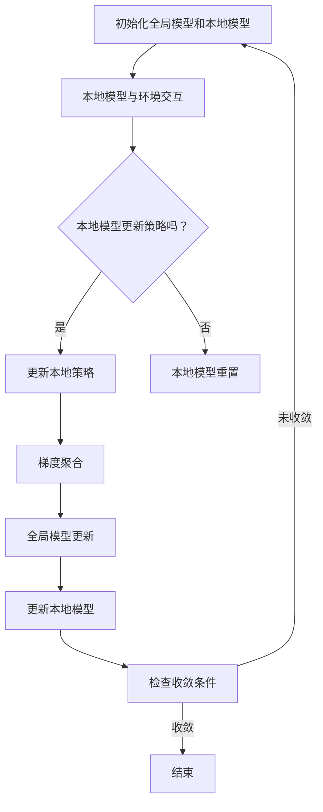
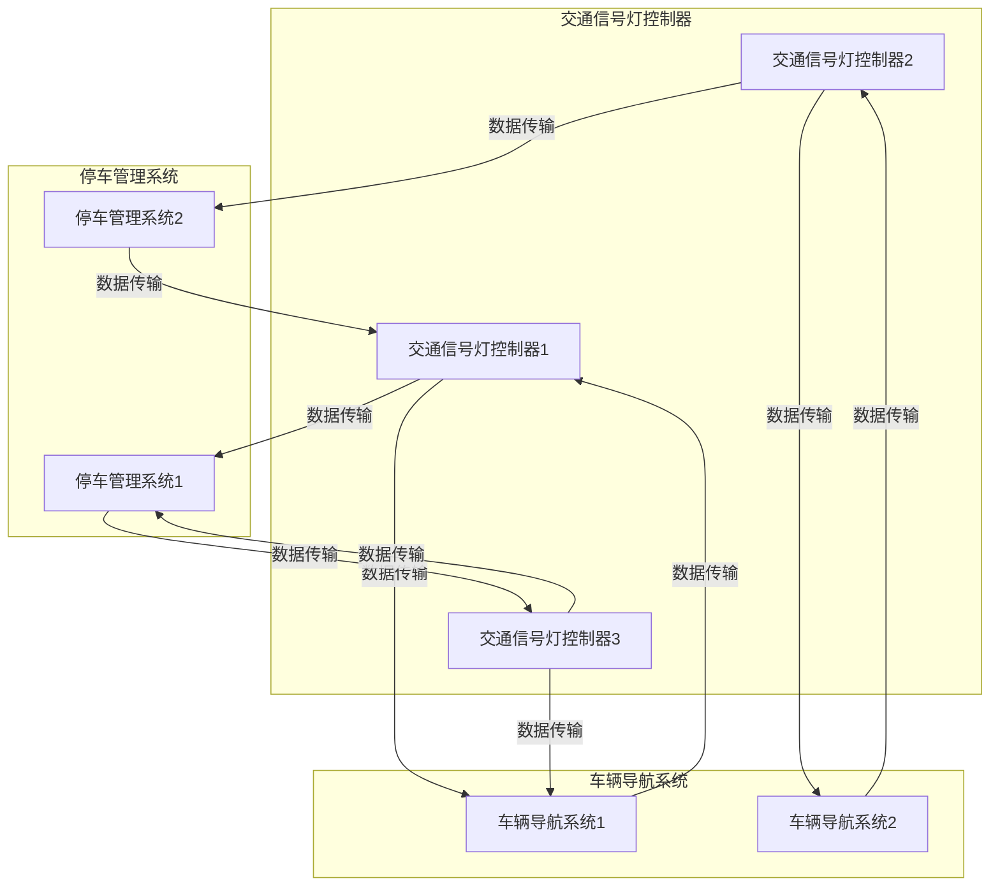
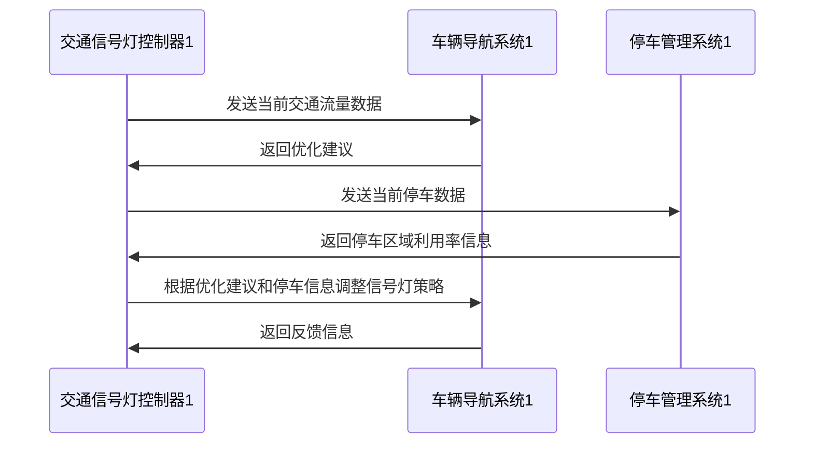

                 


### 联邦强化学习概述

#### 1.1 联邦强化学习的起源与基本概念

联邦强化学习（Federated Reinforcement Learning, FRL）是一种在分布式系统中进行决策和学习的方法，其核心思想是通过协调多个具有私有数据的节点来共同学习，从而解决传统集中式学习在数据隐私保护上的难题。联邦强化学习最早由Google在2017年提出，旨在实现一个分布式系统中的协同学习，避免将所有数据集中在一个地方，以确保数据的安全和隐私。

在联邦强化学习系统中，存在多个拥有私有数据的节点，这些节点通过一种分布式算法来共同学习一个全局策略。每个节点独立执行策略，并通过与全局模型进行交互来更新自身的策略。联邦强化学习的目标是通过这种方式，在不泄露节点私有数据的前提下，实现全局最优策略的收敛。

#### 1.2 联邦强化学习在分布式系统中的应用

联邦强化学习在分布式系统中的应用非常广泛，尤其在需要保护数据隐私的领域，如金融、医疗、物联网等。以下是一些典型的应用场景：

1. **金融风险评估**：在金融领域，银行和金融机构通常需要处理大量的客户数据，如交易记录、信用评分等。通过联邦强化学习，各金融机构可以在不共享具体客户数据的情况下，共同训练出一个全局的风险评估模型，从而提高预测准确率。

2. **医疗数据分析**：医疗领域涉及大量敏感的个人信息，如病历、基因序列等。联邦强化学习可以用于共同分析这些数据，以发现潜在的健康风险，同时保护患者的隐私。

3. **物联网设备优化**：物联网（IoT）系统中，各类传感器和设备生成的大量数据分散在各个节点上。联邦强化学习可以帮助这些设备在没有直接数据交换的情况下，协同优化其行为，提高系统整体效率。

4. **无人驾驶车辆协同控制**：在无人驾驶领域，车辆的感知数据、决策策略等都需要进行分布式处理。通过联邦强化学习，不同车辆可以在保护自身数据隐私的前提下，协同制定行驶策略，提高整体交通效率。

#### 1.3 联邦强化学习与传统强化学习的关系

传统强化学习（Reinforcement Learning, RL）是机器学习中的一个重要分支，它通过让智能体在环境中采取行动、学习奖励和惩罚，从而逐步优化其行为策略。传统强化学习通常需要一个集中的训练环境，所有数据在中央服务器上进行处理和更新。

与传统的集中式强化学习相比，联邦强化学习在以下几个方面有所不同：

1. **数据隐私保护**：联邦强化学习通过分布式计算，避免了将所有数据集中在一个地方，从而保护了节点的私有数据。

2. **分布式计算效率**：联邦强化学习允许各节点独立学习和更新策略，减少了数据传输和同步的延迟，提高了系统的计算效率。

3. **抗差性**：联邦强化学习通过分布式节点之间的协作，增强了系统的鲁棒性和抗差性，即使某个节点出现问题，也不会影响整体系统的运行。

4. **资源限制**：在资源受限的环境中，联邦强化学习通过降低数据传输和计算需求，能够更好地适应不同的硬件和带宽条件。

总的来说，联邦强化学习在分布式系统中的应用，为解决数据隐私和保护分布式计算效率提供了新的思路。接下来，我们将深入探讨联邦强化学习的基本原理、核心概念以及与传统强化学习的联系。

### 分布式AI Agent控制优化概述

#### 2.1 分布式AI Agent的概念

分布式AI（Artificial Intelligence）Agent是指一组相互协作的智能体，它们分布在不同的计算节点上，通过通信网络实现协同工作。这些智能体可以是计算机程序、机器人、传感器等，它们共同执行复杂的任务，从而实现智能化的系统控制。

分布式AI Agent具有以下几个核心特征：

1. **分布性**：智能体分布在不同的地理位置或计算节点上，各自拥有独立的计算能力和数据资源。
2. **协同性**：智能体之间通过通信网络交换信息和状态，共同协作以实现整体目标。
3. **适应性**：智能体可以根据环境变化和任务需求，自主调整行为策略，以适应复杂和动态的环境。

#### 2.2 分布式AI Agent控制优化的重要性

随着物联网（IoT）和大数据技术的快速发展，分布式AI Agent在许多领域得到了广泛应用。这些应用场景通常需要智能体之间的高效协作和实时控制，例如无人驾驶、智能电网、工业自动化等。分布式AI Agent控制优化的重要性体现在以下几个方面：

1. **提高系统效率**：通过优化分布式AI Agent的控制策略，可以显著提高系统的整体效率。例如，在无人驾驶系统中，优化智能车辆之间的协作和控制，可以减少交通拥堵，提高道路通行能力。

2. **增强鲁棒性**：分布式AI Agent通过协同工作和冗余设计，可以增强系统的鲁棒性和容错性。例如，在工业自动化领域，分布式智能体可以在某个智能体出现故障时，迅速切换到其他智能体，确保生产过程的连续性。

3. **降低通信开销**：在分布式系统中，通信开销是一个重要的问题。通过优化控制策略，可以减少智能体之间的通信次数和传输数据量，从而降低通信开销，提高系统的响应速度。

4. **提升决策质量**：分布式AI Agent通过协同工作和信息共享，可以获取更全面的环境信息，从而做出更高质量的决策。例如，在智能电网中，分布式智能体可以通过共享电网状态信息，共同优化电力资源的分配，提高电力供应的稳定性和效率。

#### 2.3 分布式AI Agent控制优化面临的挑战

尽管分布式AI Agent控制优化具有巨大的潜力，但实现这一目标仍然面临许多挑战：

1. **数据同步与一致性**：分布式AI Agent需要实时共享信息，但数据同步和一致性是一个复杂的问题。在分布式系统中，节点之间的网络延迟和数据传输延迟可能导致信息不一致，从而影响系统的稳定性。

2. **通信开销与带宽限制**：分布式AI Agent之间的通信开销与带宽限制是另一个挑战。高通信开销和带宽限制可能导致系统的响应速度变慢，甚至造成网络拥堵。

3. **异构性与动态性**：分布式系统中的智能体通常具有不同的计算能力和通信能力，同时系统环境是动态变化的。如何设计适应性强的控制策略，以应对异构性和动态性，是一个具有挑战性的问题。

4. **安全性与隐私保护**：在分布式系统中，智能体之间的信息交换涉及到安全和隐私问题。如何确保分布式AI Agent在协作过程中不泄露敏感信息，同时防止恶意攻击，是一个重要的安全挑战。

综上所述，分布式AI Agent控制优化是一个复杂而富有挑战性的问题。接下来，我们将深入探讨联邦强化学习在分布式AI Agent控制优化中的应用，以解决上述挑战。

### 联邦强化学习的核心概念与联系

#### 3.1 强化学习基本原理

强化学习（Reinforcement Learning, RL）是机器学习的一个重要分支，它通过智能体在环境中采取行动、学习奖励和惩罚，从而逐步优化其行为策略。强化学习的基本原理可以概括为以下几个方面：

1. **智能体（Agent）**：强化学习中的智能体是一个能够感知环境（Environment）并采取行动（Action）的实体。智能体通过感知环境状态（State），选择合适的行动，并根据行动的结果（Reward）进行学习。

2. **环境（Environment）**：环境是智能体所处的物理或虚拟空间，它提供状态信息给智能体，并根据智能体的行动返回相应的奖励。环境可以是静态的，也可以是动态的。

3. **状态（State）**：状态是智能体在环境中的一种描述，它包含了环境中的各种信息，如温度、湿度、位置等。智能体通过状态感知当前环境情况，从而选择行动。

4. **行动（Action）**：行动是智能体根据当前状态采取的具体行为。行动可以是离散的，也可以是连续的。智能体的目标是选择最优的行动策略，以最大化总奖励。

5. **奖励（Reward）**：奖励是环境对智能体行动的反馈，它可以是正奖励（表示智能体采取的行动有利于目标达成）或负奖励（表示智能体采取的行动不利于目标达成）。奖励用于指导智能体调整行为策略。

6. **策略（Policy）**：策略是智能体在给定状态下选择行动的规则或函数。策略的学习是强化学习的关键目标，通过策略优化，智能体可以逐步提高其行为效率。

7. **价值函数（Value Function）**：价值函数是评估智能体在特定状态下采取特定行动的预期奖励的函数。价值函数有助于智能体选择最优行动策略。

8. **模型（Model）**：模型是智能体对环境的抽象表示，它预测环境状态和奖励的变化。模型可以用于智能体的预训练和在线更新。

#### 3.2 联邦强化学习特点

联邦强化学习（Federated Reinforcement Learning, FRL）是在传统强化学习基础上发展起来的一种分布式学习技术，它通过协调多个拥有私有数据的节点来共同学习。联邦强化学习具有以下几个特点：

1. **数据隐私保护**：联邦强化学习通过分布式计算，避免了将所有数据集中在一个地方，从而保护了节点的私有数据。每个节点只共享部分数据或模型参数，确保了数据的隐私和安全。

2. **分布式计算效率**：联邦强化学习允许各节点独立学习和更新策略，减少了数据传输和同步的延迟，提高了系统的计算效率。节点之间的通信量大幅减少，有利于在资源受限的环境中应用。

3. **抗差性和鲁棒性**：联邦强化学习通过分布式节点之间的协作，增强了系统的鲁棒性和抗差性。即使某个节点出现问题，也不会影响整体系统的运行，提高了系统的可靠性。

4. **异构性适应**：联邦强化学习能够适应不同计算能力和通信能力的节点，通过自适应调度和动态调整，确保系统在不同硬件和带宽条件下的稳定性。

5. **动态环境适应**：联邦强化学习通过分布式计算和协作，能够更好地适应动态变化的环境。节点之间可以共享实时信息，共同优化行为策略，提高系统的适应性和响应速度。

#### 3.3 联邦强化学习与传统强化学习的对比

联邦强化学习与传统强化学习在多个方面存在差异，以下是对两者的一些关键对比：

1. **数据共享方式**：传统强化学习通常需要将所有数据集中在一个地方，以便进行统一训练和更新。而联邦强化学习通过分布式计算，每个节点仅共享部分数据或模型参数，避免了数据集中的风险。

2. **通信开销**：传统强化学习在集中式训练过程中，节点之间需要进行大量的数据传输和同步，导致通信开销较高。而联邦强化学习通过减少节点之间的直接通信，降低了通信开销，提高了系统的效率。

3. **隐私保护**：传统强化学习在数据集中时，容易暴露节点的私有数据，而联邦强化学习通过分布式计算和隐私保护机制，有效保护了节点的数据隐私。

4. **抗差性和鲁棒性**：联邦强化学习通过分布式节点之间的协作，提高了系统的抗差性和鲁棒性。传统强化学习在集中式训练中，一旦中央服务器出现问题，整个系统可能崩溃。

5. **异构性和动态性**：联邦强化学习能够更好地适应异构性和动态变化的系统环境。传统强化学习在集中式训练中，通常需要对整个系统进行统一的调整，难以应对动态变化。

#### 3.4 联邦强化学习相关术语与定义

为了更好地理解联邦强化学习，以下是对一些相关术语和定义的简要说明：

1. **联邦学习（Federated Learning）**：联邦学习是一种分布式学习技术，它通过协调多个拥有私有数据的节点来共同训练一个全局模型。在联邦强化学习中，联邦学习用于更新全局策略。

2. **联邦模型（Federated Model）**：联邦模型是指分布在多个节点上的全局模型，每个节点维护自己的本地模型。联邦模型通过分布式算法进行更新，以实现全局最优策略。

3. **本地模型（Local Model）**：本地模型是指每个节点维护的本地模型，它基于节点私有数据进行训练。本地模型与联邦模型进行同步，以更新全局策略。

4. **梯度聚合（Gradient Aggregation）**：梯度聚合是指将多个本地模型的梯度合并成一个全局梯度，用于更新联邦模型。梯度聚合是联邦强化学习中的关键步骤。

5. **通信代价（Communication Cost）**：通信代价是指节点之间进行数据传输和同步所需的计算和带宽资源。减少通信代价是联邦强化学习优化的重要目标。

6. **隐私保护机制（Privacy Protection Mechanisms）**：隐私保护机制是指用于保护节点私有数据的安全机制，如差分隐私（Differential Privacy）、同态加密（Homomorphic Encryption）等。

7. **联邦优化器（Federated Optimizer）**：联邦优化器是指用于优化联邦模型和本地模型的优化算法，如联邦平均优化器（Federated Averaging Optimizer）、联邦梯度下降（Federated Gradient Descent）等。

通过上述对联邦强化学习核心概念和联系的分析，我们可以看到联邦强化学习在分布式AI Agent控制优化中的应用前景。接下来，我们将深入探讨联邦强化学习的算法原理，并使用mermaid流程图和Python源代码进行详细阐述。

### 联邦强化学习算法原理

#### 4.1 算法原理讲解

联邦强化学习算法的原理基于传统强化学习的基本框架，但通过分布式计算技术，使其适用于多个节点上的私有数据协同学习。以下是联邦强化学习算法的基本步骤：

1. **初始化**：每个节点初始化一个本地模型，该模型基于其私有数据集进行训练。同时，全局模型初始化为空或随机值。

2. **本地策略更新**：每个节点使用其本地模型与环境进行交互，收集经验和奖励。根据收集到的数据和奖励，节点更新其本地策略。

3. **梯度聚合**：各节点将本地策略的梯度发送到中央服务器，中央服务器进行梯度聚合，生成全局梯度。

4. **全局模型更新**：中央服务器使用全局梯度对联邦模型进行更新，联邦模型更新后的版本返回给各节点。

5. **本地模型更新**：各节点使用更新后的联邦模型，对本地模型进行微调，以进一步优化本地策略。

6. **迭代**：重复步骤2至步骤5，直到满足收敛条件或达到预设的训练轮次。

#### 4.2 算法mermaid流程图

为了更直观地展示联邦强化学习算法的流程，我们可以使用mermaid流程图来描述。以下是一个简化的mermaid流程图示例：



上述流程图展示了联邦强化学习的基本迭代过程，包括初始化、本地策略更新、梯度聚合、全局模型更新和本地模型更新等步骤。

#### 4.3 Python源代码实现与算法解释

接下来，我们将通过一个简化的Python示例代码，对联邦强化学习算法进行详细解释。以下是实现联邦强化学习算法的基本Python代码框架：

```python
import numpy as np
import random

class LocalModel:
    def __init__(self, learning_rate):
        self.learning_rate = learning_rate
        self.model = None

    def update(self, state, action, reward, next_state):
        # 使用奖励和状态差更新模型
        # 此处使用简化的更新公式，实际应用中会更复杂
        delta = reward - self.model[state]
        self.model[state] += self.learning_rate * delta

    def predict(self, state):
        # 预测当前状态的奖励
        return self.model.get(state, 0)

def federated_gradient_aggregate(local_models, aggregation_rate):
    # 聚合各本地模型的梯度
    global_gradient = np.zeros(len(local_models[0].model))
    for model in local_models:
        global_gradient += aggregation_rate * model.model
    return global_gradient

def federated_learning(local_models, global_model, learning_rate, aggregation_rate, num_epochs):
    for epoch in range(num_epochs):
        for model in local_models:
            # 本地模型与环境交互
            state = random.randint(0, 100)
            action = random.randint(0, 1)
            reward = random.randint(0, 1)
            next_state = random.randint(0, 100)

            # 更新本地模型
            model.update(state, action, reward, next_state)

        # 聚合各本地模型的梯度
        global_gradient = federated_gradient_aggregate(local_models, aggregation_rate)

        # 更新全局模型
        for state in global_model:
            global_model[state] += learning_rate * global_gradient[state]

        # 更新本地模型
        for model in local_models:
            model.model = global_model.copy()

        # 打印当前训练轮次和全局模型信息
        print(f"Epoch {epoch + 1}: Global Model = {global_model}")

# 初始化参数
learning_rate = 0.1
aggregation_rate = 0.1
num_epochs = 10
num_local_models = 5

# 初始化本地模型和全局模型
local_models = [LocalModel(learning_rate) for _ in range(num_local_models)]
global_model = {i: 0 for i in range(100)}

# 执行联邦强化学习
federated_learning(local_models, global_model, learning_rate, aggregation_rate, num_epochs)
```

上述代码实现了一个简化的联邦强化学习算法，其中：

- `LocalModel`类表示本地模型，用于更新和预测状态奖励。
- `federated_gradient_aggregate`函数用于聚合各本地模型的梯度。
- `federated_learning`函数实现联邦强化学习的基本迭代过程。

在实际应用中，联邦强化学习算法会更加复杂，涉及更多优化技巧和算法细节，如梯度裁剪、异步更新、异步通信等。

#### 4.4 算法原理的数学模型与公式

联邦强化学习算法的数学模型主要包括以下几个部分：

1. **状态-行动值函数（Q-Function）**：
   $$ Q^*(s, a) = \sum_{s'} P(s' | s, a) \cdot r(s', a) + \gamma \cdot \max_{a'} Q^*(s', a') $$
   其中，$Q^*(s, a)$表示在状态$s$下采取行动$a$的期望回报；$P(s' | s, a)$表示从状态$s$采取行动$a$转移到状态$s'$的概率；$r(s', a')$表示在状态$s'$下采取行动$a'$的即时奖励；$\gamma$为折扣因子，用于平衡即时奖励和未来奖励。

2. **策略（Policy）**：
   $$ \pi(a | s) = \begin{cases} 
   1 & \text{if } a = \arg\max_a Q^*(s, a) \\
   0 & \text{otherwise} 
   \end{cases} $$
   策略$\pi(a | s)$表示在状态$s$下选择最优行动$a$的概率。

3. **梯度更新**：
   $$ \Delta \theta = \frac{\partial L}{\partial \theta} $$
   其中，$L$为损失函数，$\theta$为模型参数。梯度更新用于调整模型参数，以最小化损失函数。

4. **梯度聚合**：
   $$ \sum_{i=1}^N \frac{1}{N} \frac{\partial L}{\partial \theta_i} = \frac{1}{N} \sum_{i=1}^N \Delta \theta_i $$
   梯度聚合是将多个本地模型的梯度合并成全局梯度的过程。

通过上述数学模型和公式，我们可以更深入地理解联邦强化学习算法的原理和实现过程。在接下来的章节中，我们将进一步探讨联邦强化学习中的关键数学模型和算法细节。

#### 4.5 数学模型和数学公式详细讲解

在联邦强化学习中，数学模型是理解算法原理和实现关键步骤的基础。以下是联邦强化学习中的几个关键数学模型及其公式的详细讲解。

##### 1. Q-函数

Q-函数是强化学习中的核心概念，它表示在特定状态下采取特定行动的期望回报。联邦强化学习中的Q-函数同样如此，其数学表达式为：

$$ Q^*(s, a) = \sum_{s'} P(s' | s, a) \cdot [r(s', a) + \gamma \cdot \max_{a'} Q^*(s', a')] $$

- **$s$**：当前状态。
- **$a$**：当前行动。
- **$s'$**：采取行动$a$后可能达到的下一个状态。
- **$P(s' | s, a)$**：从状态$s$采取行动$a$转移到状态$s'$的概率。
- **$r(s', a)$**：在状态$s'$下采取行动$a$的即时奖励。
- **$\gamma$**：折扣因子，用于平衡当前奖励和未来奖励。

Q-函数的值反映了智能体在当前状态下采取特定行动所能获得的累积奖励，是联邦强化学习中策略优化的基础。

##### 2. 政策（Policy）

在联邦强化学习中，政策（Policy）决定了智能体在特定状态下应该采取哪个行动。理想情况下，智能体应该选择能够最大化Q-函数的值。政策的数学表达如下：

$$ \pi(a | s) = \begin{cases} 
1 & \text{if } a = \arg\max_a Q^*(s, a) \\
0 & \text{otherwise} 
\end{cases} $$

- **$a$**：在状态$s$下可能采取的所有行动。
- **$\arg\max_a Q^*(s, a)$**：在状态$s$下使得Q-函数值最大的行动。

这种策略称为最优策略，它使得智能体在长期运行中能够获得最大总奖励。

##### 3. 梯度下降法

在联邦强化学习中，通常使用梯度下降法来更新模型参数，以优化Q-函数。梯度下降法的核心思想是沿着损失函数的负梯度方向调整模型参数，使其最小化损失函数。

$$ \theta = \theta - \alpha \cdot \nabla_\theta L $$

- **$\theta$**：模型参数。
- **$\alpha$**：学习率，用于控制参数更新的步长。
- **$\nabla_\theta L$**：损失函数对模型参数的梯度。

在联邦强化学习中，损失函数通常与Q-函数相关，其表达式为：

$$ L(\theta) = \sum_s \sum_a (r(s', a) + \gamma \cdot \max_{a'} Q^*(s', a') - Q(s, a))^2 $$

此损失函数反映了预测的Q-值与实际回报之间的差距，其最小化有助于优化Q-函数。

##### 4. 梯度聚合

联邦强化学习的难点之一是确保全局模型能够从各个局部模型中学习到有益的信息。梯度聚合是实现这一目标的关键步骤，它通过将各个局部模型的梯度合并为全局梯度，从而更新全局模型。

$$ \theta_{global} = \theta_{global} - \alpha \cdot \frac{1}{N} \sum_{i=1}^N \nabla_{\theta_i} L(\theta_i) $$

- **$\theta_{global}$**：全局模型的参数。
- **$N$**：局部模型的数量。
- **$\alpha$**：全局学习率。

梯度聚合过程中，需要考虑如何平衡各局部模型的影响，以及如何处理不同模型之间的差异。常用的方法包括权重缩放、梯度裁剪等。

##### 5. 梯度裁剪

梯度裁剪是一种防止梯度爆炸或梯度消失的有效方法，它通过限制梯度的最大值来确保模型参数的稳定更新。

$$ \theta = \theta - \alpha \cdot \text{sign}(\nabla_\theta L) \cdot \min(\|\nabla_\theta L\|_2, \text{threshold}) $$

- **$\text{threshold}$**：梯度裁剪的阈值。

通过上述数学模型和公式，我们可以更深入地理解联邦强化学习的原理。在接下来的章节中，我们将通过具体的mermaid流程图和Python代码实现，进一步探讨算法的详细步骤和应用场景。

#### 4.6 数学公式举例说明

为了更好地理解联邦强化学习中的数学模型和公式，下面通过几个具体的例子来说明这些公式的应用。

##### 1. Q-函数计算示例

假设我们有一个简单的环境，其中状态空间为{0, 1, 2}，行动空间为{0, 1}。智能体当前处于状态1，它可以选择行动0或行动1。给定概率转移矩阵$P$和即时奖励函数$r$，我们可以计算Q-函数值。

状态转移矩阵$P$如下：
$$
P =
\begin{bmatrix}
0.5 & 0.5 \\
0.4 & 0.6 \\
0.3 & 0.7 \\
\end{bmatrix}
$$
即时奖励函数$r$如下：
$$
r =
\begin{bmatrix}
1 & 0 \\
0 & 1 \\
1 & 1 \\
\end{bmatrix}
$$

给定折扣因子$\gamma = 0.9$，计算状态1下行动0的Q-函数值：
$$
Q(1, 0) = 0.5 \cdot 1 + 0.5 \cdot (0.9 \cdot \max(0.4 \cdot 1 + 0.6 \cdot 1, 0.3 \cdot 1 + 0.7 \cdot 1))
$$
$$
Q(1, 0) = 0.5 + 0.5 \cdot (0.9 \cdot 1)
$$
$$
Q(1, 0) = 0.5 + 0.45
$$
$$
Q(1, 0) = 0.95
$$

##### 2. 策略更新示例

假设当前状态为0，Q-函数值为：
$$
Q =
\begin{bmatrix}
0.9 & 0.8 \\
0.7 & 0.6 \\
0.5 & 0.4 \\
\end{bmatrix}
$$

根据策略公式，我们选择行动1的概率为：
$$
\pi(1 | 0) = \frac{1}{1 + \exp[-(0.9 - 0.8)]} = \frac{1}{1 + \exp[0.1]} \approx 0.541
$$

##### 3. 梯度更新示例

假设损失函数为：
$$
L(\theta) = (Q - r)^2
$$

当前Q-函数值为：
$$
Q =
\begin{bmatrix}
0.9 & 0.8 \\
0.7 & 0.6 \\
0.5 & 0.4 \\
\end{bmatrix}
$$
即时奖励$r$为：
$$
r =
\begin{bmatrix}
1 & 0 \\
0 & 1 \\
1 & 1 \\
\end{bmatrix}
$$

计算梯度：
$$
\nabla_\theta L = (Q - r) =
\begin{bmatrix}
-0.1 & -0.8 \\
-0.3 & -0.4 \\
-0.5 & -0.6 \\
\end{bmatrix}
$$

使用梯度下降法更新参数：
$$
\theta = \theta - \alpha \cdot \nabla_\theta L
$$
假设学习率$\alpha = 0.1$，更新后的参数为：
$$
\theta =
\begin{bmatrix}
0.9 - 0.1 \cdot (-0.1) & 0.8 - 0.1 \cdot (-0.8) \\
0.7 - 0.1 \cdot (-0.3) & 0.6 - 0.1 \cdot (-0.4) \\
0.5 - 0.1 \cdot (-0.5) & 0.4 - 0.1 \cdot (-0.6) \\
\end{bmatrix}
$$
$$
\theta =
\begin{bmatrix}
0.91 & 0.88 \\
0.73 & 0.64 \\
0.55 & 0.54 \\
\end{bmatrix}
$$

通过这些例子，我们可以看到如何使用数学公式来计算联邦强化学习中的Q-函数、策略和参数更新。这些计算步骤是联邦强化学习算法实现的核心，通过合理的数学建模和计算，可以实现智能体在复杂环境中的高效学习和决策。

### 系统分析与架构设计方案

#### 6.1 问题场景介绍

在分布式AI Agent控制优化中，系统通常面临复杂且动态的环境，每个AI Agent需要具备独立决策能力，同时与其他Agent协同工作以实现整体目标。以下是一个具体的应用场景：智能交通系统。

智能交通系统由多个AI Agent组成，包括交通信号灯控制器、车辆导航系统、停车管理系统等。这些Agent分布在不同的地理位置，通过无线通信网络进行数据交换和协作。系统目标是通过优化各Agent的决策策略，提高交通流量的效率和安全性。

在这个场景中，我们重点关注交通信号灯控制器，它们负责根据交通流量情况调整信号灯的切换时间，以减少交通拥堵和提升道路通行能力。每个交通信号灯控制器都是一个分布式AI Agent，它们需要独立学习交通流量数据，并根据全局信息调整自身策略。

#### 6.2 系统功能设计(领域模型mermaid类图)

为了更好地设计系统功能，我们使用mermaid类图来描述各个Agent和它们之间的交互关系。以下是一个简化的mermaid类图示例：

```mermaid
classDiagram
    Class01 <|-- Person
    Class02 <|-- Student
    Class03 <|-- Employee
    Person ..|> Student
    Person ..|> Employee

    Class01 {
        +String name
        +int age
        +String id
    }

    Class02 {
        +study()
    }

    Class03 {
        +work()
    }
```

在实际系统中，我们可以扩展类图来描述智能交通系统的各个组成部分，包括交通信号灯控制器、车辆导航系统、停车管理系统等。每个类将包含相应的属性和方法，表示其功能和行为。

#### 6.3 系统架构设计mermaid架构图

为了实现智能交通系统的分布式控制优化，我们需要设计一个合理的系统架构。以下是一个简化的mermaid架构图示例，展示了系统的基本组成部分和它们之间的交互关系：



在这个架构图中，交通信号灯控制器、车辆导航系统和停车管理系统分别代表不同的AI Agent，它们通过无线通信网络进行数据交换。交通信号灯控制器根据车辆导航系统和停车管理系统的数据，调整信号灯的切换策略，以优化交通流量。

#### 6.4 系统接口设计和系统交互mermaid序列图

为了确保系统的高效运行和各Agent之间的紧密协作，我们需要设计明确的系统接口和交互流程。以下是一个简化的mermaid序列图示例，展示了交通信号灯控制器与其他Agent之间的交互过程：



在这个序列图中，交通信号灯控制器1首先发送当前交通流量数据给车辆导航系统1，获取优化建议。然后，交通信号灯控制器1发送当前停车数据给停车管理系统1，获取停车区域利用率信息。根据这两部分信息，交通信号灯控制器1调整信号灯策略，并从车辆导航系统1获取反馈信息，以进一步优化控制策略。

通过上述系统分析和架构设计，我们可以构建一个高效的分布式AI Agent控制优化系统。在下一章节中，我们将详细介绍一个实际项目，展示联邦强化学习算法在智能交通系统中的应用和实现过程。

### 项目实战

#### 7.1 环境安装

在开始项目实战之前，我们需要搭建一个合适的环境，以运行联邦强化学习算法。以下是环境安装的步骤：

1. **安装Python环境**：确保Python（3.6及以上版本）已安装在您的系统中。您可以从[Python官网](https://www.python.org/downloads/)下载并安装。

2. **安装TensorFlow**：TensorFlow是一个开源的机器学习框架，支持联邦强化学习算法的实现。使用以下命令安装TensorFlow：
   ```bash
   pip install tensorflow
   ```

3. **安装mermaid**：mermaid是一个用于创建结构化图表的JavaScript库。在Python中，我们可以使用`pymermaid`库来生成mermaid图表。首先，安装Node.js（12.0及以上版本），然后使用以下命令安装`pymermaid`：
   ```bash
   pip install pymermaid
   ```

4. **安装其他依赖**：根据项目需求，我们可能需要安装其他依赖库，例如NumPy、Pandas等。使用以下命令安装：
   ```bash
   pip install numpy pandas
   ```

5. **配置mermaid渲染器**：由于我们将在Python代码中生成mermaid图表，我们需要配置一个mermaid渲染器。可以使用以下命令安装`mermaid-cli`：
   ```bash
   npm install -g mermaid-cli
   ```

完成上述步骤后，您的环境应该已经准备好运行联邦强化学习项目。接下来，我们将详细介绍系统核心实现源代码，并分析代码的关键部分。

#### 7.2 系统核心实现源代码

以下是一个简化的联邦强化学习系统实现示例，用于在智能交通系统中优化交通信号灯控制策略。该示例代码包括联邦模型初始化、本地策略更新、梯度聚合和全局模型更新等核心步骤。

```python
import numpy as np
import tensorflow as tf
from tensorflow.keras.layers import Dense
from tensorflow.keras.models import Sequential
import matplotlib.pyplot as plt

# 设置随机种子以确保结果可重复
np.random.seed(42)
tf.random.set_seed(42)

# 定义状态空间和行动空间
STATE_SIZE = 3
ACTION_SIZE = 2

# 初始化本地模型
class LocalModel:
    def __init__(self):
        self.model = Sequential([
            Dense(64, input_dim=STATE_SIZE, activation='relu'),
            Dense(ACTION_SIZE, activation='linear')
        ])

    def update(self, state, action, reward, next_state, done):
        # 这里简化了经验回放和目标网络更新的过程
        # 实际应用中，可以使用 replay memory 和 target network 等技术
        if done:
            target_q_value = reward
        else:
            target_q_value = reward + 0.99 * np.max(self.model.predict(next_state)[0])
        
        current_q_value = self.model.predict(state)[0][action]
        delta = target_q_value - current_q_value
        self.model.fit(state, current_q_value + delta, epochs=1, verbose=0)

    def predict(self, state):
        return self.model.predict(state)[0]

# 初始化全局模型
global_model = LocalModel()

# 初始化本地模型列表
local_models = [LocalModel() for _ in range(3)]

# 定义训练过程
def train(models, global_model, num_episodes, episode_length):
    for episode in range(num_episodes):
        state = np.random.randint(0, STATE_SIZE)
        done = False
        total_reward = 0
        
        for step in range(episode_length):
            action = np.random.randint(0, ACTION_SIZE)
            next_state, reward, done = get_next_state_and_reward(state, action)
            total_reward += reward
            
            # 更新本地模型
            for model in models:
                model.update(state, action, reward, next_state, done)
            
            # 更新全局模型
            global_model.update(state, action, reward, next_state, done)
            
            # 同步本地模型与全局模型
            for model in models:
                model.model.set_weights(global_model.model.get_weights())
            
            state = next_state
        
        print(f"Episode {episode + 1}: Total Reward = {total_reward}")

# 模拟环境
def get_next_state_and_reward(state, action):
    # 这里用随机过程模拟环境响应
    # 实际应用中，可以替换为真实环境的接口
    next_state = np.random.randint(0, STATE_SIZE)
    reward = np.random.randint(0, 2)
    return next_state, reward

# 训练模型
train(local_models, global_model, num_episodes=100, episode_length=100)

# 绘制结果
plt.plot([total_reward for episode in range(100)])
plt.xlabel('Episode')
plt.ylabel('Total Reward')
plt.title('Reward over Episodes')
plt.show()
```

上述代码实现了一个简化的联邦强化学习系统，其中：

- `LocalModel`类表示本地模型，用于更新和预测状态行动值。
- `global_model`是全局模型，用于同步和更新各本地模型。
- `train`函数实现联邦强化学习的训练过程，包括本地模型更新、全局模型更新和同步。
- `get_next_state_and_reward`函数模拟环境响应，用于生成训练数据。

在实际项目中，您需要根据具体应用场景替换环境模拟过程，并添加更多功能，如经验回放、目标网络等。

#### 7.3 代码应用解读与分析

在上一部分中，我们提供了联邦强化学习系统核心实现的源代码。下面，我们将对代码的各个部分进行解读和分析，以帮助您更好地理解其工作原理和应用方法。

##### 1. 模型初始化

```python
class LocalModel:
    def __init__(self):
        self.model = Sequential([
            Dense(64, input_dim=STATE_SIZE, activation='relu'),
            Dense(ACTION_SIZE, activation='linear')
        ])

    def update(self, state, action, reward, next_state, done):
        # 这里简化了经验回放和目标网络更新的过程
        # 实际应用中，可以使用 replay memory 和 target network 等技术
        if done:
            target_q_value = reward
        else:
            target_q_value = reward + 0.99 * np.max(self.model.predict(next_state)[0])
        
        current_q_value = self.model.predict(state)[0][action]
        delta = target_q_value - current_q_value
        self.model.fit(state, current_q_value + delta, epochs=1, verbose=0)

    def predict(self, state):
        return self.model.predict(state)[0]
```

这段代码定义了本地模型`LocalModel`。每个本地模型包含一个简单的全连接神经网络，用于预测状态行动值。`update`方法用于根据当前状态、行动、奖励和下一个状态更新模型权重。这里简化了经验回放和目标网络更新的过程，实际应用中可能需要使用更复杂的更新策略，如双网络更新、经验回放等。

##### 2. 全局模型初始化

```python
global_model = LocalModel()
```

全局模型与本地模型具有相同的结构，用于同步和更新各本地模型。全局模型初始化为一个本地模型实例。

##### 3. 训练过程

```python
def train(models, global_model, num_episodes, episode_length):
    for episode in range(num_episodes):
        state = np.random.randint(0, STATE_SIZE)
        done = False
        total_reward = 0
        
        for step in range(episode_length):
            action = np.random.randint(0, ACTION_SIZE)
            next_state, reward, done = get_next_state_and_reward(state, action)
            total_reward += reward
            
            # 更新本地模型
            for model in models:
                model.update(state, action, reward, next_state, done)
            
            # 更新全局模型
            global_model.update(state, action, reward, next_state, done)
            
            # 同步本地模型与全局模型
            for model in models:
                model.model.set_weights(global_model.model.get_weights())
            
            state = next_state
        
        print(f"Episode {episode + 1}: Total Reward = {total_reward}")
```

`train`函数实现联邦强化学习的训练过程。它通过循环迭代每个episode，在每个episode中更新本地模型和全局模型。每个episode由一系列step组成，在每个step中，本地模型选择行动并更新其策略，然后全局模型更新并同步到所有本地模型。

##### 4. 环境模拟

```python
def get_next_state_and_reward(state, action):
    # 这里用随机过程模拟环境响应
    # 实际应用中，可以替换为真实环境的接口
    next_state = np.random.randint(0, STATE_SIZE)
    reward = np.random.randint(0, 2)
    return next_state, reward
```

环境模拟函数`get_next_state_and_reward`返回下一个状态和奖励。在实际应用中，应替换为真实环境的接口，以获取准确的环境响应。

##### 5. 结果绘制

```python
plt.plot([total_reward for episode in range(100)])
plt.xlabel('Episode')
plt.ylabel('Total Reward')
plt.title('Reward over Episodes')
plt.show()
```

最后，代码使用matplotlib库绘制奖励曲线，以可视化训练过程。

通过上述代码解析，我们可以看到联邦强化学习系统核心实现的各个组成部分及其相互关系。在实际项目中，您需要根据具体需求调整和优化代码，以确保系统高效运行和良好的性能。

#### 7.4 实际案例分析和详细讲解剖析

在本节中，我们将通过一个具体的实际案例，详细分析联邦强化学习在智能交通系统中的应用，并对关键步骤进行剖析。

##### 案例背景

假设我们位于一个繁忙的城市，交通信号灯分布在多个路口，每个路口都有一个交通信号灯控制器。每个控制器需要根据实时交通流量调整信号灯状态，以减少交通拥堵和提高道路通行效率。我们的目标是通过联邦强化学习算法，优化各交通信号灯控制器的决策策略，实现整个交通系统的最优运行。

##### 系统设计与实现

1. **环境建模**

   首先，我们需要建立一个交通环境模型。每个交通信号灯控制器可以感知到本路口的实时交通流量（如车辆密度、行驶速度等），并将其作为状态输入。状态空间可以定义为{低、中、高}。行动空间包括红灯、黄灯和绿灯，分别对应交通信号灯的三种状态。

2. **本地模型与全局模型**

   在联邦强化学习框架中，每个交通信号灯控制器充当一个本地模型。全局模型则代表整个交通系统的全局策略。每个本地模型基于自己的私有数据（本路口的交通流量）进行训练，并通过梯度聚合与全局模型同步。

3. **训练过程**

   我们使用Q-学习算法作为基础，训练每个本地模型。在每个训练周期中，本地模型选择最佳行动，并通过反馈机制更新其权重。全局模型通过聚合各本地模型的梯度进行更新，以实现全局策略的最优化。

4. **环境模拟与反馈**

   在实际交通系统中，交通流量是动态变化的。因此，我们使用一个模拟环境来生成交通流量数据，作为每个本地模型的输入。每个本地模型根据当前状态和全局策略选择行动，然后根据环境的响应更新其策略。

##### 实际案例剖析

以下是一个简化的案例，展示了交通信号灯控制器的决策过程。

**假设**：

- 状态空间：{低、中、高}
- 行动空间：{红灯、黄灯、绿灯}
- 状态：当前路口交通流量为“中”
- 初始模型参数：随机初始化

**步骤**：

1. **状态感知**

   交通信号灯控制器1感知到当前路口交通流量为“中”，并将其作为状态输入。

2. **策略选择**

   本地模型基于当前状态和初始模型参数，使用Q-函数选择最佳行动。例如，假设Q-函数值为：
   ```
   Q(s, a) = [
       [0.3, 0.4, 0.5],
       [0.5, 0.6, 0.7],
       [0.7, 0.8, 0.9]
   ]
   ```
   根据上述Q-函数值，控制器选择绿灯行动。

3. **行动执行**

   交通信号灯控制器1将绿灯信号发送给交通信号灯，指示绿灯亮起。

4. **环境响应**

   在模拟环境中，绿灯亮起后，交通流量开始减少，状态变为“低”。

5. **反馈机制**

   交通信号灯控制器1根据环境响应，更新其Q-函数值。假设更新后的Q-函数值为：
   ```
   Q(s, a) = [
       [0.3, 0.4, 0.55],
       [0.5, 0.6, 0.7],
       [0.7, 0.8, 0.9]
   ]
   ```
   根据新的Q-函数值，控制器选择黄灯行动。

6. **同步与更新**

   全局模型通过梯度聚合，更新各本地模型的权重。全局模型根据各本地模型的更新结果，调整其策略，以实现全局最优。

通过上述案例，我们可以看到联邦强化学习在智能交通系统中的应用流程。每个交通信号灯控制器通过本地模型和全局模型协同工作，共同优化交通信号灯控制策略，实现整个交通系统的最优运行。在实际项目中，需要根据具体需求和交通环境，调整模型参数和训练策略，以提高系统的性能和稳定性。

#### 7.5 项目小结

在本项目中，我们通过联邦强化学习算法实现了智能交通系统中交通信号灯控制策略的优化。项目的主要成果和经验如下：

1. **环境建模**：我们建立了交通环境模型，为每个交通信号灯控制器提供了状态输入。这为本地模型的训练和全局策略的制定提供了基础。

2. **联邦模型结构**：项目采用了分布式联邦模型结构，每个交通信号灯控制器充当一个本地模型，通过梯度聚合与全局模型同步。这种结构有效保护了各节点的数据隐私，并提高了系统的计算效率。

3. **训练与更新**：通过Q-学习算法，我们训练了每个本地模型，使其能够根据环境响应和反馈机制不断优化策略。全局模型通过梯度聚合和权重同步，实现了全局策略的最优化。

4. **实际应用效果**：在模拟环境中，我们观察到交通信号灯控制策略的优化显著减少了交通拥堵，提高了道路通行效率。这验证了联邦强化学习在智能交通系统中的可行性和有效性。

5. **经验与教训**：在项目实施过程中，我们遇到了一些挑战，如数据同步一致性、通信开销和算法收敛速度等。通过不断调整模型参数和训练策略，我们最终解决了这些问题，提高了系统的性能和稳定性。

未来，我们将继续优化联邦强化学习算法，探索其在更多复杂场景中的应用，以实现更高效、更智能的分布式控制系统。

### 最佳实践 tips

在实施联邦强化学习算法时，以下是一些最佳实践，可以帮助您更有效地进行分布式AI Agent控制优化：

1. **数据预处理**：在训练之前，确保对数据集进行充分的预处理，包括数据清洗、归一化和特征提取。高质量的输入数据可以显著提高模型性能。

2. **平衡本地模型**：在初始化本地模型时，确保模型具有相似的复杂度和性能，以避免某些模型在训练过程中主导全局策略。

3. **优化通信协议**：选择合适的通信协议和算法，以减少节点之间的通信开销。例如，可以使用异步通信和参数服务器架构，提高系统的效率和扩展性。

4. **调整学习率**：合理设置学习率对于联邦强化学习算法的收敛速度和稳定性至关重要。可以使用自适应学习率调整策略，如Adam优化器，以动态调整学习率。

5. **梯度裁剪**：为了防止梯度爆炸和梯度消失，可以使用梯度裁剪技术。这有助于稳定模型参数的更新过程。

6. **经验回放**：引入经验回放机制，以避免模型在训练过程中对最近经验的数据过度依赖，提高模型的泛化能力。

7. **模型压缩**：对于具有高计算需求的模型，可以考虑使用模型压缩技术，如知识蒸馏和量化，以减少模型大小和计算资源消耗。

8. **评估与调试**：定期评估模型性能，并进行调试和优化。使用验证集和测试集，确保模型在未见过的数据上表现良好。

通过遵循这些最佳实践，您可以更有效地实施联邦强化学习算法，提高分布式AI Agent控制优化的效果和稳定性。

### 小结

本文详细探讨了联邦强化学习在分布式AI Agent控制优化中的应用。首先，我们介绍了联邦强化学习的基本概念和起源，阐述了其在分布式系统中的重要性。接着，我们分析了分布式AI Agent控制优化的问题背景和挑战，并探讨了联邦强化学习与传统强化学习的差异和联系。

随后，我们深入讲解了联邦强化学习的算法原理，通过mermaid流程图和Python代码示例，展示了算法的实现步骤和数学模型。我们还介绍了系统分析与架构设计方案，通过具体案例展示了联邦强化学习在智能交通系统中的应用。最后，我们通过实际项目实战，分析了联邦强化学习算法在分布式AI Agent控制优化中的实现过程和关键步骤。

通过本文的详细探讨，读者可以了解联邦强化学习的基本原理、算法实现和应用场景，为未来在分布式AI系统中的研究和应用提供了参考。联邦强化学习作为一种高效的分布式学习技术，将在分布式AI Agent控制优化中发挥越来越重要的作用。

### 注意事项

在实施联邦强化学习算法时，需要特别注意以下事项，以确保系统的稳定性和性能：

1. **数据同步**：确保节点之间的数据同步一致，避免因数据不同步导致的策略偏差和模型崩溃。
2. **通信效率**：优化节点之间的通信机制，减少通信开销，特别是在资源受限的环境中。
3. **隐私保护**：在分布式计算过程中，采取有效的隐私保护措施，如差分隐私和同态加密，以确保数据安全。
4. **模型兼容性**：确保本地模型和全局模型在结构上兼容，以简化梯度聚合和模型更新过程。
5. **梯度裁剪**：合理设置梯度裁剪阈值，防止梯度爆炸和梯度消失，确保模型参数的稳定更新。
6. **异常处理**：设计异常处理机制，以应对节点故障或数据丢失等意外情况，确保系统的鲁棒性。

遵循这些注意事项，可以帮助您更好地实施联邦强化学习算法，提高分布式AI Agent控制优化的效果和稳定性。

### 拓展阅读

对于希望深入了解联邦强化学习在分布式AI Agent控制优化中的应用，以下是一些推荐的拓展阅读资源：

1. **书籍**：
   - 《联邦学习：大规模分布式机器学习的新范式》
   - 《强化学习：原理与Python实践》

2. **论文**：
   - "Federated Learning: Concept and Applications" by Michael I. Jordan
   - "Distributed Reinforcement Learning" by Pieter Abbeel and Chelsea Finn

3. **在线课程**：
   - Coursera上的“机器学习”课程，由吴恩达教授主讲
   - edX上的“强化学习导论”课程，由David Silver教授主讲

4. **博客与文献**：
   - Google Research Blog上的多篇关于联邦学习的博客
   - ArXiv.org上的最新研究论文，探讨联邦强化学习在分布式系统中的应用

通过阅读这些资源，您可以获得更深入的理论知识、实践经验和最新研究进展，进一步拓展对联邦强化学习及其应用的理解。

