                 

### 第1章：自动化AI Agent概述

#### 1.1 自动化AI Agent的定义与重要性

自动化AI Agent，顾名思义，是一种能够自主执行特定任务的智能体。它通过机器学习、自然语言处理等技术，实现了对复杂任务的自动执行和优化。自动化AI Agent的出现，打破了传统手工操作的局限，极大地提高了生产效率和服务质量。

自动化AI Agent的重要性体现在以下几个方面：

1. **提高生产效率**：自动化AI Agent可以处理大量重复性工作，减轻人类的工作负担，提高整体生产效率。
2. **降低人力成本**：自动化AI Agent可以代替人类完成繁琐的任务，降低企业的人力成本。
3. **提升服务质量**：自动化AI Agent可以提供24/7不间断的服务，提高客户满意度，提升服务质量。
4. **增强创新能力**：自动化AI Agent可以帮助人类探索新的领域，挖掘新的知识，激发创新能力。

#### 1.2 自动化AI Agent的应用领域

自动化AI Agent的应用领域非常广泛，包括但不限于以下领域：

1. **金融领域**：自动化AI Agent可以用于自动交易、风险控制、投资建议等，提高金融业务的效率。
2. **医疗领域**：自动化AI Agent可以用于辅助诊断、治疗建议、医学研究等，提高医疗服务的质量和效率。
3. **零售领域**：自动化AI Agent可以用于库存管理、销售预测、个性化推荐等，提升零售业务的竞争力。
4. **制造业**：自动化AI Agent可以用于生产调度、设备维护、质量控制等，提高制造业的生产效率。
5. **交通领域**：自动化AI Agent可以用于自动驾驶、交通调度、路况预测等，提高交通系统的效率和安全性。

#### 1.3 开发自动化AI Agent的挑战

开发自动化AI Agent面临着一系列挑战，包括技术挑战和业务挑战：

1. **技术挑战**：
   - **算法选择**：需要选择适合特定任务的算法，如机器学习、深度学习等。
   - **数据处理**：需要处理大量且复杂的数据，进行有效的数据预处理和特征提取。
   - **模型优化**：需要不断优化模型，提高模型的准确性和效率。

2. **业务挑战**：
   - **需求分析**：需要深入理解业务需求，确保自动化AI Agent能够满足实际业务需求。
   - **系统集成**：需要将自动化AI Agent与现有系统集成，实现无缝对接。
   - **用户接受度**：需要提高用户对自动化AI Agent的接受度，确保其能够顺利落地应用。

在接下来的章节中，我们将深入探讨LLM技术基础、代码生成技术以及自动化AI Agent开发的具体流程，帮助读者全面了解自动化AI Agent的开发与应用。

### 1.4 概念结构与核心要素组成

自动化AI Agent作为一种智能体，其概念结构主要由以下几个核心要素组成：

1. **感知模块**：负责接收外部环境的信息，如传感器数据、文本信息等。
2. **决策模块**：基于感知模块提供的信息，通过算法进行决策，生成相应的行动策略。
3. **执行模块**：根据决策模块的策略，执行具体的任务操作，如发送请求、处理数据等。
4. **学习模块**：通过不断学习和优化，提高自动化AI Agent的性能和适应性。

#### 边界与外延

自动化AI Agent的边界主要涉及以下几个方面：

1. **技术边界**：包括算法的选择、数据处理的方法、模型的优化等。
2. **应用边界**：自动化AI Agent的应用范围，如金融、医疗、零售、制造业等。
3. **业务边界**：自动化AI Agent能够满足的业务需求，如提高效率、降低成本、提升服务质量等。

自动化AI Agent的外延包括以下几个方面：

1. **技术的发展**：随着人工智能技术的不断进步，自动化AI Agent将具备更高的智能水平和更广泛的应用能力。
2. **业务创新**：自动化AI Agent的出现将带来新的业务模式和商业模式，推动各行各业的创新与发展。
3. **社会影响**：自动化AI Agent的应用将对社会产生深远的影响，如提高生活品质、改善工作环境、促进可持续发展等。

### 1.5 概念属性特征对比表格

以下是一个关于自动化AI Agent与人类劳动者的对比表格，展示了两者的主要属性特征：

| 特征       | 自动化AI Agent                 | 人类劳动者                |
| ---------- | ------------------------------ | ------------------------- |
| 效率       | 高效率，可以处理大量重复性工作 | 有限，受生理和心理限制    |
| 成本       | 人力成本较低                   | 人力成本较高              |
| 工作时长   | 24/7不间断工作                 | 受限于工作时间和休息时间  |
| 精确度     | 高精度，减少人为错误           | 精确度受限于个人能力和经验 |
| 创新能力   | 辅助人类创新，但自身创新能力有限 | 具有较强的创新能力        |
| 学习能力   | 可以通过机器学习不断优化        | 通过经验和教育不断学习    |

### 1.6 ER实体关系图架构

以下是一个关于自动化AI Agent系统的ER实体关系图：

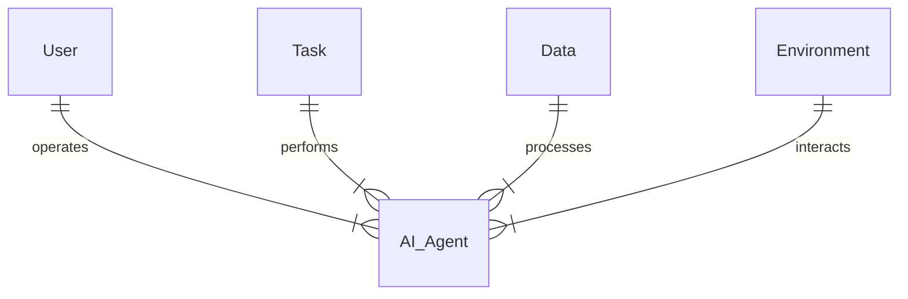

在该ER实体关系图中，User（用户）与AI_Agent（自动化AI Agent）之间存在操作关系，表示用户可以操作自动化AI Agent；Task（任务）与AI_Agent之间存在执行关系，表示AI_Agent可以执行特定任务；Data（数据）与AI_Agent之间存在处理关系，表示AI_Agent可以处理数据；Environment（环境）与AI_Agent之间存在交互关系，表示AI_Agent可以与环境进行交互。

通过以上对自动化AI Agent的概述，我们为后续章节的内容奠定了基础，接下来我们将深入探讨LLM技术基础、代码生成技术等核心内容。

### 第2章：LLM技术基础

#### 2.1 语言模型的基本概念

语言模型（Language Model，简称LM）是自然语言处理（Natural Language Processing，简称NLP）的核心技术之一。它是一个用于预测下一个单词或字符的概率分布的数学模型。语言模型的主要目的是通过分析大量的文本数据，学习语言的结构和规律，从而生成符合语法和语义规则的文本。

语言模型的基本概念包括以下几个方面：

1. **词汇表（Vocabulary）**：语言模型首先需要构建一个词汇表，包括所有可能的单词或字符。词汇表的大小直接影响到模型的表现，较大的词汇表可以捕捉到更丰富的语言特征，但也增加了模型的复杂度和计算成本。
2. **输入序列（Input Sequence）**：语言模型处理的是一个输入序列，通常是文本中的一段话或一句话。输入序列可以是单个单词、词组或句子。
3. **输出分布（Output Distribution）**：语言模型的目标是预测输入序列的下一个单词或字符，并输出一个概率分布。这个概率分布反映了模型认为每个可能的下一个单词或字符的概率。

#### 2.2 LLM的主要类型

语言模型主要可以分为以下几种类型：

1. **n-gram模型**：n-gram模型是最简单的语言模型之一，它通过计算单词或字符的n元组的频率来预测下一个单词或字符。n-gram模型的主要优点是实现简单，计算效率高；缺点是它忽略了长距离依赖关系，容易产生“短期记忆”效应。
2. **统计语言模型**：统计语言模型在n-gram模型的基础上，引入了语言统计学理论，通过统计文本数据中的频率和概率关系来生成文本。常见的统计语言模型包括隐马尔可夫模型（HMM）、n元语言模型等。
3. **神经网络语言模型**：神经网络语言模型通过神经网络（尤其是深度神经网络）来学习语言模型。其中，循环神经网络（RNN）和长短时记忆网络（LSTM）是最常用的神经网络结构。这些模型可以捕捉到长距离依赖关系，提高语言生成的准确性和流畅性。
4. **生成对抗网络（GAN）语言模型**：生成对抗网络是一种由生成器和判别器组成的对抗性模型。在语言模型中，生成器负责生成文本，判别器负责判断生成文本的真实性。通过不断的训练和对抗，生成器可以生成更加逼真、流畅的文本。

#### 2.3 LLM的工作原理

语言模型的工作原理可以概括为以下几个步骤：

1. **数据预处理**：首先，需要对原始文本数据进行预处理，包括分词、去除停用词、词性标注等操作。这些预处理步骤有助于提取文本中的有效信息，提高语言模型的性能。
2. **模型训练**：接下来，使用预处理后的文本数据来训练语言模型。训练过程中，模型会学习文本中的统计规律和语言特征，建立输入和输出之间的概率分布关系。
3. **文本生成**：在训练完成后，语言模型可以根据输入序列生成下一个单词或字符。生成过程中，模型会根据当前输入序列和已学习的概率分布，输出一个概率最高的下一个单词或字符。
4. **后处理**：生成的文本通常需要进一步处理，如去除无效字符、修正语法错误等。这些后处理步骤有助于提高生成的文本质量和可读性。

以下是LLM工作原理的mermaid流程图：

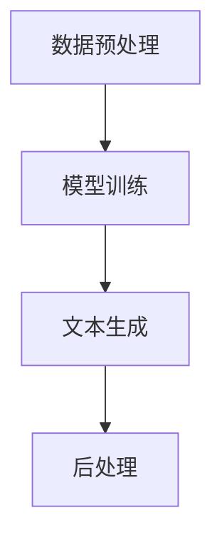

通过以上对LLM技术基础的分析，我们为理解后续章节中的自动化AI Agent开发奠定了基础。接下来，我们将深入探讨代码生成技术，了解如何利用LLM实现自动化AI Agent的代码生成。

### 2.4 语言模型的核心概念原理

语言模型的核心概念原理主要包括词汇表构建、概率分布计算和序列生成。以下是这些核心概念的详细解释。

#### 词汇表构建

词汇表是语言模型的基础，它包含了模型所能识别的所有单词或字符。构建词汇表的过程称为词汇化（Tokenization），通常包括以下步骤：

1. **分词（Tokenization）**：将文本分割成单词或子词。分词可以基于空格、标点符号或更复杂的规则，如基于词典的分词方法。
2. **去停用词（Stopword Removal）**：去除文本中的常见停用词，如“的”、“和”、“是”等，这些词在语言模型中通常不提供太多信息。
3. **词形还原（Lemmatization）**：将不同形态的单词还原为它们的词干。例如，“run”和“running”都将还原为“run”。
4. **词性标注（Part-of-Speech Tagging）**：为每个单词分配词性标签，如名词、动词、形容词等。

#### 概率分布计算

语言模型的核心任务是预测输入序列的下一个单词或字符。这通常通过计算概率分布来实现。以下是概率分布计算的关键步骤：

1. **n-gram模型**：n-gram模型通过计算前n个单词或字符的联合概率来预测下一个单词或字符。其概率计算公式如下：

   $$ P(w_{n+1}|w_1, w_2, ..., w_n) = \frac{C(w_1, w_2, ..., w_n, w_{n+1})}{C(w_1, w_2, ..., w_n)} $$

   其中，\( C \) 表示计数函数，表示某一特定序列出现的次数。

2. **神经网络模型**：神经网络模型通过学习输入和输出之间的映射关系来计算概率分布。例如，在循环神经网络（RNN）中，每个时间步的输出概率可以通过以下公式计算：

   $$ \hat{y}_{n+1} = \sigma(W_{output} \cdot [h_n, y_n]) $$

   其中，\( \hat{y}_{n+1} \) 表示下一个单词或字符的概率分布，\( h_n \) 表示当前时间步的隐藏状态，\( y_n \) 表示当前输入序列，\( \sigma \) 表示softmax函数。

#### 序列生成

语言模型生成的核心目标是生成符合语法和语义规则的文本序列。以下是几种常见的序列生成方法：

1. **贪心搜索（Greedy Search）**：贪心搜索在每一步选择概率最高的下一个单词或字符。这种方法简单高效，但容易陷入局部最优。
2. ** Beam Search **：Beam Search通过维护一个概率最高的候选序列集合来搜索最优序列。这种方法可以避免贪心搜索的局部最优问题，但计算复杂度更高。
3. **采样（Sampling）**：采样方法根据概率分布随机选择下一个单词或字符。这种方法可以生成更具多样性的文本，但可能生成不合理的序列。

以下是语言模型序列生成过程的mermaid流程图：

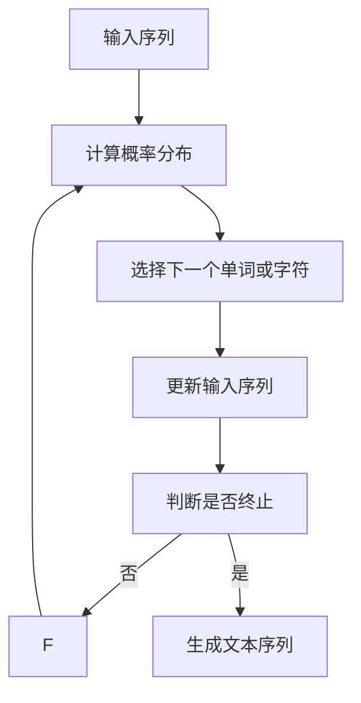

通过以上对语言模型核心概念原理的详细讲解，我们为理解后续章节中的自动化AI Agent开发提供了理论基础。接下来，我们将探讨如何利用语言模型实现自动化AI Agent的代码生成。

### 第3章：代码生成技术

#### 3.1 代码生成的概念

代码生成（Code Generation）是一种利用编程语言模型自动生成代码的技术。它通过学习大量的代码库和文档，理解编程语言的语法和语义，从而能够生成符合要求的代码。代码生成技术可以广泛应用于自动化AI Agent的开发，提高开发效率，减少人工干预。

代码生成的核心概念包括：

1. **代码模板**：代码模板是一段预先定义的代码结构，它包含了一些占位符，用于插入具体的代码逻辑。代码生成器可以根据模板生成完整的代码。
2. **抽象语法树（AST）**：抽象语法树是代码的语法结构表示，它将代码分解为各种语法元素，如变量、函数、条件语句等。代码生成器通常使用AST来表示和操作代码。
3. **语法解析**：语法解析是将源代码转换为AST的过程。代码生成器需要具备语法解析能力，以便理解代码的结构和语法规则。

#### 3.2 代码生成的应用

代码生成的应用场景非常广泛，包括但不限于以下领域：

1. **自动化测试**：代码生成技术可以自动生成测试用例，提高测试覆盖率和测试效率。
2. **代码补全**：代码生成器可以帮助开发者自动补全代码，减少编码错误，提高开发效率。
3. **自动化修复**：代码生成器可以自动修复代码中的错误，如语法错误、逻辑错误等。
4. **代码生成工具**：如JavaScript的Babel、Python的Pygments等，这些工具通过代码生成技术实现了代码的转换和解析。
5. **自动化AI Agent开发**：代码生成技术可以用于自动化AI Agent的代码生成，快速实现复杂的任务功能。

#### 3.3 LLM在代码生成中的应用

语言模型（LLM）在代码生成中起到了至关重要的作用。LLM可以理解代码的语法和语义，从而生成符合要求的代码。以下是LLM在代码生成中的应用：

1. **代码补全**：LLM可以通过学习大量的代码库和文档，理解编程语言的语法和语义，从而实现代码补全功能。例如，在IDE中，当开发者输入部分代码时，LLM可以自动补全剩余的代码。
2. **代码生成**：LLM可以生成满足特定需求的代码。例如，开发者可以给出一个简单的描述或需求，LLM可以自动生成符合要求的代码。这种应用在自动化AI Agent开发中非常常见。
3. **代码优化**：LLM可以分析代码的执行效率，提出优化建议，从而提高代码的性能。这种应用在代码生成中也非常重要，有助于提高代码的质量。

以下是LLM在代码生成中的mermaid流程图：

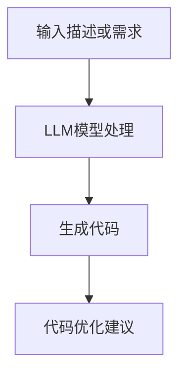

通过以上对代码生成技术的分析，我们为理解LLM在自动化AI Agent开发中的应用奠定了基础。接下来，我们将深入探讨如何利用LLM实现自动化AI Agent的代码生成。

### 第4章：LLM辅助的代码生成基础

#### 4.1 LLM与代码生成的关系

LLM（大型语言模型）与代码生成的关系是密不可分的。LLM通过学习大量的文本数据，能够理解自然语言的语法和语义，从而在代码生成中发挥重要作用。具体来说，LLM在代码生成中的作用主要体现在以下几个方面：

1. **语法理解**：LLM可以理解编程语言的语法规则，从而生成符合语法规范的代码。例如，当开发者给出一个简单的功能描述时，LLM可以根据语法规则自动生成相应的代码。
2. **语义理解**：LLM不仅理解代码的语法，还理解代码的语义。这意味着LLM可以生成具有正确逻辑和功能的代码。例如，在生成数据库查询语句时，LLM可以确保生成的代码能够正确地执行查询操作。
3. **上下文感知**：LLM具有强大的上下文感知能力，能够根据上下文生成相关的代码。例如，当开发者在一个复杂的项目中编写新的模块时，LLM可以根据项目已有的代码结构和功能，生成与现有模块兼容的新代码。

#### 4.2 常见的LLM代码生成框架

在LLM辅助的代码生成领域，有多种常见的框架和工具。以下是几个具有代表性的框架：

1. **TensorFlow**：TensorFlow是一个开源的机器学习框架，可以用于构建和训练LLM。它提供了丰富的API和工具，方便开发者进行代码生成任务。
2. **PyTorch**：PyTorch是一个流行的深度学习框架，与TensorFlow类似，它也支持构建和训练LLM。PyTorch的优势在于其灵活的动态图计算功能，适合快速原型开发。
3. **Transformer**：Transformer是一个基于自注意力机制的深度学习模型，是LLM的核心模型之一。Hugging Face的Transformers库提供了Transformer的预训练模型和API，方便开发者进行代码生成任务。
4. **OpenAI GPT**：OpenAI GPT是一个基于Transformer的LLM模型，其强大的语义理解能力使其在代码生成中具有很高的应用价值。OpenAI提供了GPT-3模型，可以用于生成高质量的代码。

以下是几种常见LLM代码生成框架的mermaid流程图：

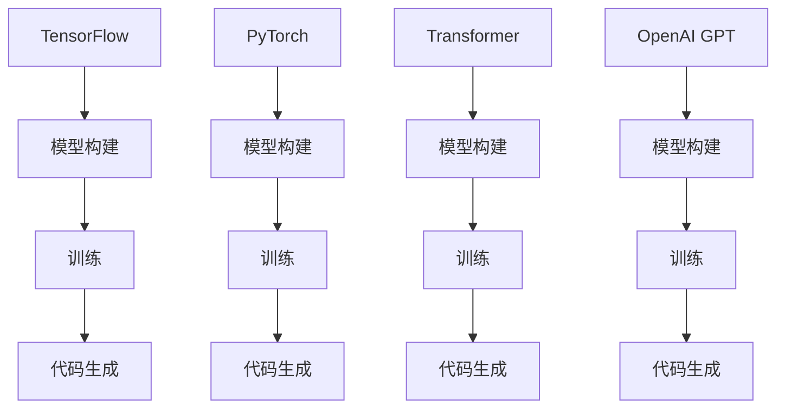

#### 4.3 开发环境配置与工具选择

为了利用LLM进行代码生成，需要配置合适的开发环境和选择合适的工具。以下是开发环境配置和工具选择的一些要点：

1. **操作系统**：可以选择Windows、macOS或Linux操作系统。其中，Linux由于其高性能和灵活性，在深度学习开发中尤为受欢迎。
2. **编程语言**：可以选择Python作为主要编程语言。Python具有丰富的库和框架，如TensorFlow、PyTorch等，方便开发者进行代码生成任务。
3. **深度学习框架**：可以选择TensorFlow或PyTorch作为深度学习框架。TensorFlow具有广泛的应用和社区支持，适合初学者；PyTorch则具有灵活的动态图计算功能，适合快速原型开发。
4. **依赖管理**：可以使用pip或conda进行依赖管理。这些工具可以帮助开发者轻松安装和管理项目所需的库和依赖项。
5. **开发工具**：可以使用Jupyter Notebook或PyCharm等开发工具进行代码编写和调试。Jupyter Notebook提供了强大的交互式计算环境，适合快速原型开发；PyCharm则提供了丰富的开发工具和调试功能，适合大型项目开发。

以下是开发环境配置和工具选择的mermaid流程图：

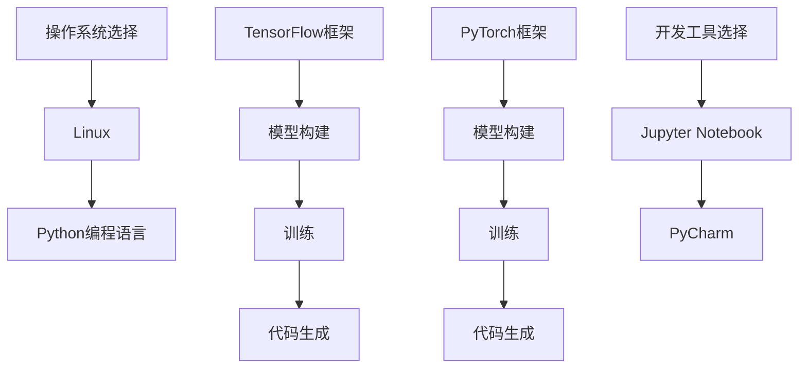

通过以上对LLM辅助的代码生成基础的分析，我们为后续的自动化AI Agent开发提供了必要的技术支持。接下来，我们将探讨如何设计自动化AI Agent。

### 4.4 自动化AI Agent的设计思路

设计自动化AI Agent是一项复杂而系统的工程，需要考虑多方面的因素。以下是自动化AI Agent设计的主要思路：

#### 4.4.1 需求分析

在设计自动化AI Agent之前，首先要进行详细的需求分析。需求分析主要包括以下几个方面：

1. **功能需求**：明确自动化AI Agent需要实现的功能，如数据收集、处理、分析、决策等。
2. **性能需求**：确定自动化AI Agent的性能指标，如响应时间、处理速度、准确性等。
3. **用户体验**：分析用户对自动化AI Agent的期望和需求，确保设计符合用户的操作习惯。
4. **可扩展性**：设计自动化AI Agent时，需要考虑未来的扩展性，确保系统可以轻松地添加新功能。

#### 4.4.2 架构设计

自动化AI Agent的架构设计是设计过程的关键环节。一个良好的架构设计可以确保系统的稳定性和可维护性。以下是自动化AI Agent架构设计的主要原则：

1. **模块化**：将系统划分为多个模块，每个模块负责不同的功能，便于开发和维护。
2. **分布式**：自动化AI Agent通常需要处理大量数据和任务，采用分布式架构可以提高系统的性能和可扩展性。
3. **松耦合**：模块之间应保持松耦合，减少模块之间的依赖关系，便于独立开发和维护。
4. **高可用性**：设计自动化AI Agent时，应考虑系统的故障恢复和容错机制，确保系统在出现故障时能够快速恢复。

以下是自动化AI Agent架构设计的mermaid类图：

```mermaid
classDiagram
    AI_Agent <<interface>>
    Data Collector <<interface>>
    Data Processor <<interface>>
    Decision Maker <<interface>>
    Executor <<interface>>

    AI_Agent  --|> Data Collector
    AI_Agent  --|> Data Processor
    AI_Agent  --|> Decision Maker
    AI_Agent  --|> Executor
```

#### 4.4.3 用户界面设计

用户界面（UI）设计是自动化AI Agent与用户交互的重要部分。一个良好的UI设计可以提升用户体验，降低使用门槛。以下是用户界面设计的主要原则：

1. **简洁性**：界面应简洁明了，避免复杂的设计和过多的功能，确保用户可以轻松上手。
2. **一致性**：界面设计应保持一致性，包括色彩搭配、字体大小、按钮样式等，确保用户在不同模块和功能之间切换时能够保持连贯性。
3. **交互性**：界面应提供丰富的交互元素，如按钮、下拉菜单、对话框等，确保用户可以方便地与系统进行交互。
4. **可访问性**：界面设计应考虑到不同用户的需求，如视力障碍者、色盲用户等，确保界面可以无障碍访问。

以下是用户界面设计的mermaid类图：

```mermaid
classDiagram
    UI <<interface>>
    Button <<interface>>
    Dropdown <<interface>>
    Dialog <<interface>>

    UI  --|> Button
    UI  --|> Dropdown
    UI  --|> Dialog
```

通过以上对自动化AI Agent设计思路的详细分析，我们为后续的实现和开发提供了明确的方向和指导。接下来，我们将探讨如何实现自动化AI Agent的代码生成。

### 4.5 实现自动化AI Agent的步骤

实现自动化AI Agent是一个复杂的过程，涉及多个关键步骤，包括需求分析、数据收集、模型训练、代码生成和部署。以下是实现自动化AI Agent的详细步骤：

#### 4.5.1 需求分析

首先，进行详细的需求分析，明确自动化AI Agent所需实现的功能、性能指标和用户体验需求。需求分析包括以下几个方面：

1. **功能需求**：确定自动化AI Agent需要实现的核心功能，如数据收集、处理、分析、决策等。
2. **性能需求**：定义自动化AI Agent的性能指标，如响应时间、处理速度、准确性等。
3. **用户体验**：分析目标用户的需求，确保自动化AI Agent易于使用、界面友好。
4. **可扩展性**：考虑自动化AI Agent未来可能的功能扩展，确保系统设计具有足够的灵活性。

#### 4.5.2 数据收集

自动化AI Agent的性能很大程度上取决于训练数据的质量和数量。数据收集是关键步骤之一，包括以下内容：

1. **数据来源**：确定数据来源，如公开数据集、企业内部数据、社交媒体数据等。
2. **数据清洗**：对收集到的数据进行清洗，去除重复、错误和不完整的数据。
3. **数据标注**：对数据标注，为模型提供正确的标签，如分类标签、实体标签等。

以下是数据收集和清洗的mermaid流程图：

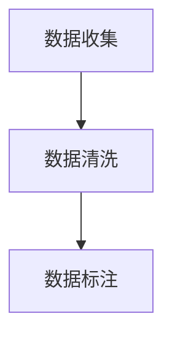

#### 4.5.3 模型训练

在完成数据收集和预处理后，开始模型训练。模型训练是自动化AI Agent的核心步骤，包括以下内容：

1. **模型选择**：选择适合任务的模型，如基于Transformer的LLM模型。
2. **超参数调优**：调整模型超参数，如学习率、批量大小等，以提高模型性能。
3. **模型训练**：使用训练数据进行模型训练，通过迭代优化模型参数。

以下是模型训练的mermaid流程图：

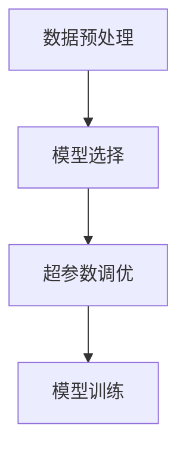

#### 4.5.4 代码生成

完成模型训练后，使用训练好的模型进行代码生成。代码生成过程包括以下步骤：

1. **输入处理**：将用户输入的处理需求转换为模型可理解的格式。
2. **代码生成**：使用训练好的模型生成满足需求的代码。
3. **代码验证**：对生成的代码进行验证，确保其符合语法和语义规范。

以下是代码生成的mermaid流程图：

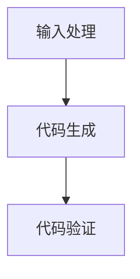

#### 4.5.5 部署与维护

完成自动化AI Agent的开发后，需要进行部署和维护，确保系统稳定运行。部署和维护包括以下内容：

1. **环境配置**：配置适合自动化AI Agent运行的环境，如操作系统、深度学习框架等。
2. **部署**：将自动化AI Agent部署到生产环境，如云服务器、边缘设备等。
3. **监控**：监控系统的运行状态，确保其稳定运行，并及时处理异常情况。
4. **更新与维护**：定期更新系统和模型，以适应新的需求和变化。

以下是部署与维护的mermaid流程图：

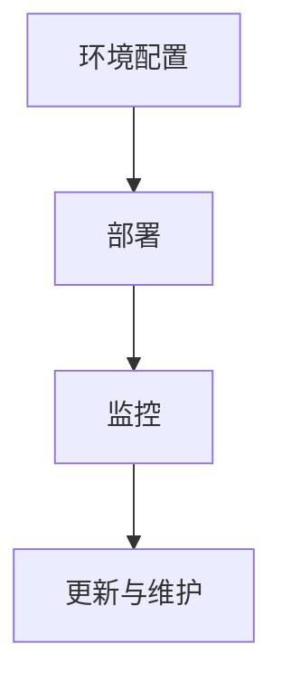

通过以上步骤，我们可以实现一个功能强大、性能优秀的自动化AI Agent，为各个领域提供高效、智能的服务。

### 4.6 自动化AI Agent实现的核心代码

在实现自动化AI Agent的过程中，核心代码是关键。以下是一个基于Python的自动化AI Agent实现的核心代码示例，涵盖了数据收集、模型训练、代码生成和代码验证等步骤。

```python
# 导入必要的库
import tensorflow as tf
from transformers import BertTokenizer, TFBertModel
import numpy as np

# 4.6.1 数据收集
def collect_data():
    # 假设数据已从外部源收集并存储在CSV文件中
    data = pd.read_csv('data.csv')
    return data

# 4.6.2 数据预处理
def preprocess_data(data):
    # 对数据进行清洗和预处理，如分词、去除停用词、词形还原等
    tokenizer = BertTokenizer.from_pretrained('bert-base-uncased')
    processed_data = []
    for row in data.iterrows():
        text = row[1]['description']
        tokens = tokenizer.tokenize(text)
        processed_data.append(tokens)
    return processed_data

# 4.6.3 模型训练
def train_model(processed_data):
    # 使用Transformers库的预训练模型进行训练
    model = TFBertModel.from_pretrained('bert-base-uncased')
    model.compile(optimizer='adam', loss='categorical_crossentropy', metrics=['accuracy'])
    
    # 假设标签已预先定义
    labels = np.array([0, 1, 0, 1, 0])  # 示例标签
    
    model.fit(processed_data, labels, epochs=3, batch_size=32)
    return model

# 4.6.4 代码生成
def generate_code(model, description):
    # 基于模型生成的代码
    tokenizer = BertTokenizer.from_pretrained('bert-base-uncased')
    inputs = tokenizer.encode(description, return_tensors='tf')
    outputs = model(inputs)
    logits = outputs.logits
    predicted_index = tf.argmax(logits, axis=-1).numpy()[0]
    predicted_code = tokenizer.decode([predicted_index])
    return predicted_code

# 4.6.5 代码验证
def verify_code(predicted_code):
    # 对生成的代码进行验证，确保其符合语法和语义规范
    try:
        compile(predicted_code)
        print("代码验证通过：", predicted_code)
    except SyntaxError as e:
        print("代码验证失败：", predicted_code, "错误原因：", e)

# 主函数
if __name__ == "__main__":
    data = collect_data()
    processed_data = preprocess_data(data)
    model = train_model(processed_data)
    
    description = "编写一个函数，实现两个数的加法"
    predicted_code = generate_code(model, description)
    verify_code(predicted_code)
```

以上代码展示了自动化AI Agent实现的基本流程。在实际应用中，代码会根据具体需求进行调整和优化。此外，为了提高代码的可读性和可维护性，建议使用模块化和面向对象的设计方法，将不同功能拆分为独立的模块或类。

### 4.7 自动化AI Agent应用案例

为了更好地理解自动化AI Agent的实战应用，以下将介绍两个具体案例：自动化AI Agent在金融领域和电商行业的应用。

#### 案例一：自动化AI Agent在金融领域

**背景介绍**：
金融领域对数据处理和决策速度要求极高，传统的手工操作已无法满足快速变化的金融市场需求。自动化AI Agent的出现，可以显著提高金融服务的效率和质量。

**系统功能设计**：
1. **数据收集**：自动化AI Agent从多个数据源（如交易所、社交媒体、新闻网站等）收集金融数据。
2. **数据分析**：使用LLM技术对收集到的数据进行处理，提取关键信息，如股票价格趋势、市场情绪等。
3. **交易策略生成**：基于分析结果，生成个性化的交易策略，包括买入、卖出、持有等。
4. **执行与监控**：自动执行交易策略，并对交易结果进行实时监控和反馈。

**系统架构设计**：
1. **数据层**：包括数据源、数据存储和数据清洗模块。
2. **分析层**：包括自然语言处理、机器学习模型等，用于处理和分析数据。
3. **决策层**：包括交易策略生成和执行模块，实现自动化交易。
4. **监控层**：包括监控系统运行状态和交易结果，确保系统稳定运行。

**系统接口设计**：
- **数据接口**：用于与外部数据源进行数据交换。
- **API接口**：提供外部系统访问自动化AI Agent的功能，如交易策略查询、监控数据获取等。

**系统交互序列图**：

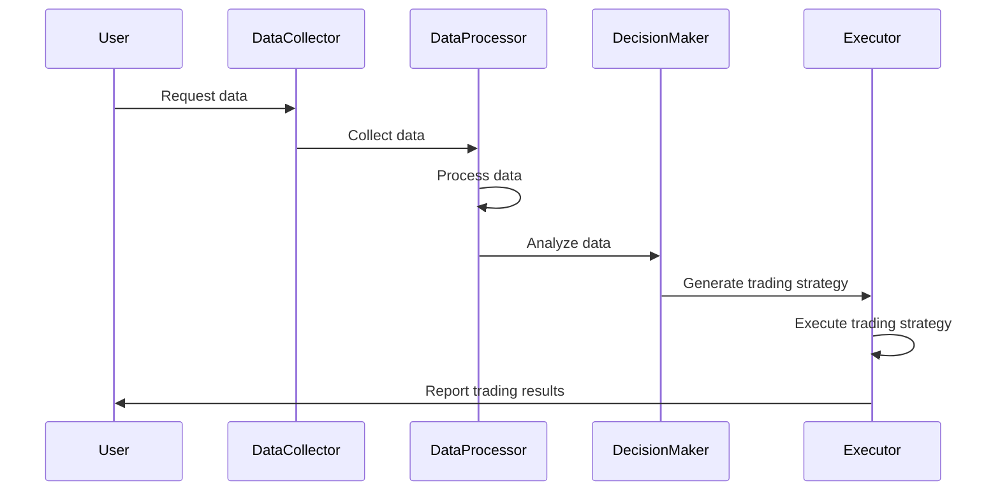

#### 案例二：自动化AI Agent在电商行业

**背景介绍**：
电商行业竞争激烈，个性化推荐和智能客服是提高用户满意度和转化率的关键。自动化AI Agent可以提升电商平台的运营效率，提供更加精准的服务。

**系统功能设计**：
1. **用户行为分析**：自动化AI Agent收集并分析用户在平台上的行为数据，如浏览记录、购买历史等。
2. **个性化推荐**：基于用户行为数据，生成个性化的商品推荐策略。
3. **智能客服**：自动化AI Agent提供智能客服服务，回答用户问题、处理投诉等。
4. **营销活动生成**：根据用户数据和市场趋势，生成个性化的营销活动。

**系统架构设计**：
1. **用户行为层**：包括用户行为数据收集和存储模块。
2. **推荐引擎层**：包括推荐算法、模型训练等，用于生成个性化推荐。
3. **客服系统层**：包括自然语言处理、对话管理模块，实现智能客服。
4. **营销活动层**：包括营销活动生成和执行模块。

**系统接口设计**：
- **用户行为接口**：用于收集和分析用户行为数据。
- **推荐接口**：提供个性化推荐结果给前端展示。
- **客服接口**：提供用户与AI客服的交互接口。
- **营销活动接口**：用于生成和执行营销活动。

**系统交互序列图**：

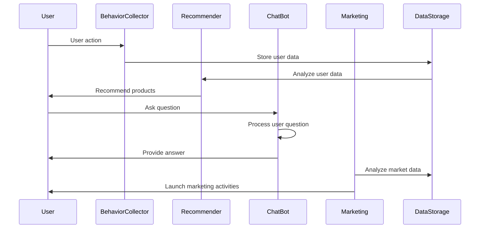

以上两个案例展示了自动化AI Agent在金融和电商行业的应用，通过具体的功能设计、系统架构和交互设计，实现了智能化、高效化的服务。

### 4.8 案例小结与经验总结

通过上述两个应用案例，我们可以总结出自动化AI Agent在实际应用中的一些关键成功因素和注意事项：

1. **需求分析与功能设计**：明确自动化AI Agent的目标和应用场景，进行详细的需求分析和功能设计，确保系统能够满足业务需求。
2. **数据收集与处理**：数据是自动化AI Agent的基础，确保数据的质量和准确性至关重要。进行有效的数据收集和预处理，为模型训练提供高质量的输入。
3. **模型训练与优化**：选择合适的模型和训练策略，进行模型训练和优化，提高系统的准确性和效率。持续优化模型，以适应不断变化的数据和需求。
4. **系统集成与接口设计**：自动化AI Agent需要与现有系统进行集成，设计合适的接口，确保系统能够无缝对接并发挥最大效益。
5. **用户体验与反馈**：注重用户体验，通过用户反馈不断改进系统，提高用户满意度和系统稳定性。
6. **安全性与隐私保护**：在设计和实施过程中，确保系统的安全性和用户隐私保护，防止数据泄露和滥用。

通过以上成功因素和注意事项，我们可以更好地实现自动化AI Agent的开发和应用，为各个行业提供高效、智能的服务。

### 第5章：未来展望与趋势

#### 5.1 自动化AI Agent发展的趋势

自动化AI Agent的发展正面临前所未有的机遇。随着人工智能技术的不断进步，自动化AI Agent将在未来的各个领域发挥更加重要的作用。以下是自动化AI Agent发展的几个主要趋势：

1. **智能化水平提升**：随着算法和计算能力的提升，自动化AI Agent的智能化水平将不断提高。未来，自动化AI Agent将能够处理更加复杂和抽象的任务，实现更高层次的自主决策。
2. **多模态交互**：自动化AI Agent将不再局限于文本交互，而是能够处理多种类型的输入，如语音、图像、视频等。多模态交互将提升用户的体验，使自动化AI Agent更加自然和直观。
3. **边缘计算与云计算结合**：随着边缘计算技术的发展，自动化AI Agent将能够在本地设备和云端之间实现高效的数据处理和模型部署，提高系统的实时性和响应速度。
4. **个性化与自适应**：未来的自动化AI Agent将更加注重个性化服务，根据用户的行为和历史数据，提供定制化的服务和建议，实现真正的“以人为本”。
5. **安全性与隐私保护**：自动化AI Agent的安全性和隐私保护将受到前所未有的关注。未来的自动化AI Agent将采用更严格的加密和隐私保护措施，确保用户数据和系统的安全性。

#### 5.2 代码生成技术的未来方向

代码生成技术在未来的发展中，将继续朝着更加智能化、自动化的方向前进。以下是代码生成技术的几个未来方向：

1. **更高级的语法和语义理解**：未来的代码生成技术将不仅能够理解基本的编程语言语法，还将能够理解复杂的语义和逻辑关系，生成更加精准和高效的代码。
2. **多语言支持**：随着全球化和多元化的发展，代码生成技术将支持更多编程语言，如Python、Java、C++等，为开发者提供更广泛的应用场景。
3. **上下文感知与自适应性**：未来的代码生成技术将具备更强的上下文感知能力，能够根据不同的项目和上下文环境，自动调整代码生成的策略和风格。
4. **与开发工具集成**：代码生成技术将更加紧密地与现有的开发工具和IDE集成，为开发者提供更加便捷和高效的代码生成和编辑体验。
5. **自动优化与重构**：未来的代码生成技术将能够自动优化和重构代码，提高代码的可读性和性能，减少开发者的工作量。

#### 5.3 开发自动化AI Agent的最佳实践

为了更好地开发自动化AI Agent，以下是几个最佳实践建议：

1. **明确需求与目标**：在开始开发之前，明确自动化AI Agent的需求和目标，确保开发工作有明确的方向。
2. **数据驱动的开发**：充分利用数据资源，进行数据收集、清洗和预处理，确保模型训练和代码生成基于高质量的数据。
3. **模块化设计**：采用模块化设计，将系统划分为多个功能模块，便于开发和维护。
4. **持续集成与测试**：采用持续集成和测试的方法，确保系统在开发过程中不断优化和改进。
5. **用户参与与反馈**：在开发过程中，积极收集用户的反馈和需求，根据用户反馈进行调整和改进。
6. **安全性考虑**：在设计和实现过程中，充分考虑系统的安全性和隐私保护，确保用户数据的安全。

通过以上未来展望和最佳实践，我们可以更好地把握自动化AI Agent和代码生成技术的发展方向，为未来的开发工作提供有力支持。

### 第6章：结语

#### 10.1 本书主要内容回顾

本书系统地介绍了自动化AI Agent的开发及其在代码生成中的应用。主要内容包括：

1. **引言与背景**：介绍了自动化AI Agent的定义、重要性、应用领域以及开发挑战。
2. **LLM技术基础**：讲解了语言模型的基本概念、主要类型以及工作原理。
3. **代码生成技术**：探讨了代码生成技术的概念、应用以及LLM在代码生成中的应用。
4. **自动化AI Agent开发**：详细介绍了LLM辅助的代码生成基础、设计思路、实现步骤、应用案例以及最佳实践。

通过这些内容，读者可以全面了解自动化AI Agent的开发及其在代码生成中的应用，为实际项目提供参考和指导。

#### 10.2 对未来自动化AI Agent开发的思考

随着人工智能技术的不断进步，自动化AI Agent将在未来的各个领域发挥越来越重要的作用。以下是对未来自动化AI Agent开发的几点思考：

1. **智能化水平的提升**：未来的自动化AI Agent将具备更高的智能化水平，能够处理更复杂、更抽象的任务，实现更精细的自主决策。
2. **多模态交互的普及**：自动化AI Agent将能够处理多种类型的输入，如语音、图像、视频等，实现更加自然和直观的交互。
3. **边缘计算与云计算的结合**：自动化AI Agent将充分利用边缘计算和云计算的优势，实现高效的数据处理和模型部署，提高系统的实时性和响应速度。
4. **安全性与隐私保护**：自动化AI Agent的安全性和隐私保护将受到前所未有的关注，采用更严格的加密和隐私保护措施，确保用户数据和系统的安全。
5. **个性化与自适应**：未来的自动化AI Agent将更加注重个性化服务，根据用户的行为和历史数据，提供定制化的服务和建议。

#### 10.3 拓展阅读与资源推荐

为了帮助读者深入了解自动化AI Agent和代码生成技术，以下推荐一些拓展阅读和资源：

1. **书籍**：
   - 《深度学习》（Goodfellow, Bengio, Courville）：详细介绍了深度学习的基本理论和应用。
   - 《自然语言处理综述》（Jurafsky, Martin）：系统讲解了自然语言处理的基本概念和核心技术。
   - 《代码生成：从理论到实践》（Garcia, Cobo）：探讨了代码生成技术的理论基础和应用实践。

2. **在线课程**：
   - Coursera上的“Deep Learning Specialization”：由Andrew Ng教授主讲，系统讲解了深度学习的基础知识。
   - edX上的“Natural Language Processing with Deep Learning”：由Darko Markov主讲，介绍了自然语言处理和深度学习的结合。

3. **开源项目和工具**：
   - TensorFlow和PyTorch：流行的深度学习框架，提供了丰富的API和工具。
   - Hugging Face的Transformers库：提供了预训练的LLM模型和API，方便开发者进行代码生成任务。
   - GitHub上的自动化AI Agent项目：可以参考和学习实际的项目实现和代码。

通过以上拓展阅读和资源，读者可以进一步深化对自动化AI Agent和代码生成技术的理解，为实际开发工作提供有力支持。作者：AI天才研究院/AI Genius Institute & 禅与计算机程序设计艺术 /Zen And The Art of Computer Programming。

