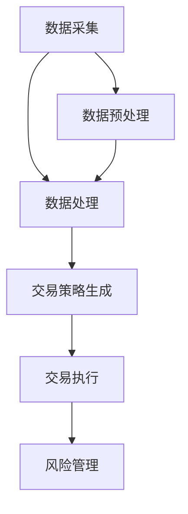

                 

## 自动化交易系统的集成

### 关键词：
- 自动化交易系统
- 集成
- 算法
- 数据处理
- 风险管理

### 摘要：
自动化交易系统在现代金融市场中扮演着日益重要的角色。本文将深入探讨自动化交易系统的集成，从基础理论到实际应用，通过一步一步的分析和推理，详细讲解系统架构设计、算法实现、系统集成与测试、风险管理等方面的内容。旨在为读者提供一个清晰、实用的自动化交易系统集成指南。

## 目录大纲

### 第一部分：自动化交易系统基础
1. **自动化交易系统的概念与背景**
   1.1 交易系统的定义
   1.2 自动交易系统的起源与发展
   1.3 自动交易系统的优势与挑战
2. **交易市场的分析**
   2.1 市场数据与信息收集
   2.2 市场趋势分析
   2.3 市场风险概述
3. **自动交易算法基础**
   3.1 算法基本概念
   3.2 算法分类与特点
   3.3 常见交易策略

### 第二部分：自动化交易系统实现
4. **系统架构设计**
   4.1 系统需求分析
   4.2 系统总体架构设计
   4.3 系统模块划分与功能描述
5. **数据处理与存储**
   5.1 数据来源与处理
   5.2 数据存储方案
   5.3 数据分析与挖掘
6. **交易算法实现**
   6.1 算法设计原则
   6.2 算法实现步骤
   6.3 算法性能评估

### 第三部分：系统集成与测试
7. **系统集成**
   7.1 系统集成策略
   7.2 系统接口设计
   7.3 系统集成测试
8. **风险管理与控制**
   8.1 风险管理概述
   8.2 风险评估与控制
   8.3 风险应对策略

### 第四部分：案例分析与实战
9. **案例分析**
   9.1 案例一：自动化交易系统的成功案例
   9.2 案例二：自动化交易系统的失败案例分析
10. **项目实战**
   10.1 实战项目介绍
   10.2 系统核心实现与代码解读
   10.3 项目小结与经验总结

### 第五部分：最佳实践与未来展望
11. **最佳实践**
   11.1 自动化交易系统的最佳实践
   11.2 自动交易系统的安全与合规
12. **未来展望**
   12.1 自动化交易系统的发展趋势
   12.2 新技术对自动化交易系统的影响
   12.3 自动化交易系统的未来展望

### 注意事项：
- 文章内容必须完整、具体、详细，每个章节都要有充分的论述和案例支持。
- 使用Markdown格式编写，确保代码和流程图的清晰展现。
- LaTeX格式用于数学公式的表达，确保公式的正确性。
- 作者信息在文章末尾明确标注。

## 第一部分：自动化交易系统基础

### 1.1 自动化交易系统的概念与背景

#### 1.1.1 交易系统的定义

交易系统是指用于金融市场交易操作的各种工具、技术和流程的集合。它通常包括交易策略的制定、市场数据的收集与分析、交易信号的生成以及执行交易等环节。

**核心概念术语说明**：

- **交易策略**：指导交易操作的具体计划和方法，可以是趋势跟踪、均值回归、套利等。
- **市场数据**：包括价格、成交量、市场指数等，是交易决策的重要依据。
- **交易信号**：基于市场数据分析得出的买卖建议，通常以量化指标的形式表示。
- **执行交易**：根据交易信号在市场中进行实际买卖操作。

#### 1.1.2 自动交易系统的起源与发展

自动交易系统的起源可以追溯到20世纪70年代的股票市场中。当时，计算机技术的快速发展使得市场数据处理和分析变得可行。1975年，第一个基于计算机的自动化交易系统在美国股票市场中首次应用，标志着自动化交易时代的开始。

**问题背景**：

随着金融市场的全球化和电子化进程的加快，交易量和交易速度不断增加，人工交易已经无法满足高效、精准的需求。自动交易系统应运而生，通过算法和机器学习技术，实现了交易操作的高效性和稳定性。

**问题描述**：

自动交易系统面临的主要问题是如何从海量市场数据中提取有用信息，生成可靠的交易信号，并在市场中执行交易。此外，系统的风险管理和合规性也是需要解决的重要问题。

**问题解决**：

通过引入先进的算法和机器学习技术，自动交易系统可以从历史数据和实时数据中学习市场规律，生成交易信号。同时，通过集成风险管理模块，可以有效地控制交易风险，确保系统的长期稳定运行。

**边界与外延**：

自动交易系统不仅应用于股票市场，还广泛应用于外汇、期货、期权等多个金融市场。随着区块链和加密货币的兴起，自动交易系统在数字货币交易中的应用也越来越广泛。

**概念结构与核心要素组成**：

自动交易系统的概念结构包括以下几个核心要素：

1. **数据采集与处理**：收集市场数据，进行数据清洗、预处理和分析。
2. **交易算法**：根据市场数据生成交易信号，包括趋势跟踪、套利、高频交易等算法。
3. **交易执行**：根据交易信号在市场中执行买卖操作。
4. **风险管理**：监控交易风险，采取相应的风险管理策略。
5. **合规性检查**：确保交易操作符合相关法规和合规要求。

#### 1.1.3 自动交易系统的优势与挑战

**优势**：

1. **高效性**：自动交易系统可以快速处理海量数据，生成交易信号，并执行交易操作。
2. **稳定性**：通过算法和机器学习技术，自动交易系统可以降低人为因素对交易操作的影响，提高系统的稳定性。
3. **风险控制**：自动交易系统可以通过风险管理模块，实时监控交易风险，采取相应的风险控制措施。
4. **合规性**：自动交易系统可以通过合规性检查模块，确保交易操作符合相关法规和合规要求。

**挑战**：

1. **数据质量**：自动交易系统的性能很大程度上取决于数据质量。数据缺失、噪声和错误都会影响系统的效果。
2. **算法优化**：自动交易系统的效果需要不断优化和调整，以适应市场变化和新的交易策略。
3. **风险控制**：自动交易系统需要有效地管理风险，防止因市场波动导致的巨大损失。
4. **合规性**：自动交易系统需要遵守相关法规和合规要求，避免因违规操作而导致的法律风险。

### 1.2 交易市场的分析

#### 1.2.1 市场数据与信息收集

市场数据是自动交易系统的重要输入。这些数据通常包括历史价格、成交量、开盘价、收盘价、最高价、最低价等。市场信息的收集可以通过以下几种方式：

1. **交易所数据**：通过交易所提供的API接口获取实时和历史市场数据。
2. **第三方数据服务**：购买专业市场数据服务，如彭博、汤森路透等。
3. **开源数据**：利用开源的数据集，如Yahoo Finance、Google Finance等。

**问题背景**：

随着金融市场的不断发展，市场数据种类繁多，数据量巨大。如何有效地收集和处理这些数据，提取有用的信息，是自动交易系统面临的重要问题。

**问题描述**：

自动交易系统需要从海量市场数据中提取有用的信息，生成交易信号。数据收集和处理的质量直接影响到系统的性能。

**问题解决**：

通过引入先进的数据处理技术，如数据清洗、预处理、特征提取等，可以有效地提高市场数据的质量，为自动交易系统提供可靠的输入。

**边界与外延**：

市场数据不仅包括价格和成交量，还包括技术指标、基本面指标等。自动交易系统可以通过整合多种数据，提高交易策略的准确性。

**核心概念与联系**：

市场数据与自动交易系统的关系可以看作是输入与输出的关系。市场数据是输入，通过算法处理和分析，生成交易信号作为输出。

#### 1.2.2 市场趋势分析

市场趋势分析是自动交易系统的重要组成部分。通过分析市场趋势，可以识别市场机会，制定交易策略。

**问题背景**：

金融市场价格波动性大，预测市场趋势对于交易成功至关重要。如何准确地分析市场趋势，是自动交易系统需要解决的关键问题。

**问题描述**：

自动交易系统需要通过市场数据，分析市场趋势，生成买卖信号。

**问题解决**：

通过引入技术分析方法和机器学习方法，如移动平均、相对强弱指数（RSI）、MACD等，可以有效地分析市场趋势，生成买卖信号。

**边界与外延**：

市场趋势分析不仅包括历史数据的分析，还包括实时数据的分析。自动交易系统可以通过实时分析市场趋势，及时调整交易策略。

**核心概念与联系**：

市场趋势分析是自动交易系统的核心组成部分。通过市场趋势分析，可以识别市场机会，制定交易策略。

#### 1.2.3 市场风险概述

市场风险是自动交易系统面临的主要风险之一。市场风险包括价格波动风险、流动性风险、信用风险等。

**问题背景**：

金融市场价格波动性大，自动交易系统在执行交易时可能面临巨大的市场风险。

**问题描述**：

自动交易系统需要有效地管理市场风险，防止因市场波动导致的巨大损失。

**问题解决**：

通过引入风险管理技术，如止损、对冲、风险评估等，可以有效地管理市场风险。

**边界与外延**：

市场风险不仅包括价格波动风险，还包括流动性风险、信用风险等。自动交易系统需要全面考虑各种市场风险，采取相应的风险管理策略。

**核心概念与联系**：

市场风险是自动交易系统面临的主要风险。通过风险管理技术，可以有效地降低市场风险，确保系统的长期稳定运行。

### 1.3 自动交易算法基础

#### 1.3.1 算法基本概念

算法是自动交易系统的核心组成部分。算法是指解决特定问题的步骤和方法。在自动交易系统中，算法用于生成交易信号，执行交易操作。

**问题背景**：

自动交易系统的性能很大程度上取决于算法的设计和实现。

**问题描述**：

自动交易系统需要设计高效的算法，生成可靠的交易信号。

**问题解决**：

通过引入先进的技术，如机器学习、人工智能等，可以设计出高效的算法，提高自动交易系统的性能。

**边界与外延**：

算法不仅包括交易策略，还包括数据预处理、特征提取、风险评估等步骤。自动交易系统需要全面考虑各种算法，优化系统性能。

**核心概念与联系**：

算法是自动交易系统的核心。通过优化算法，可以提高系统的性能和可靠性。

#### 1.3.2 算法分类与特点

自动交易算法可以根据不同的分类标准进行分类。以下是几种常见的分类方法及其特点：

1. **按交易策略分类**：

   - **趋势跟踪算法**：通过识别市场趋势，进行买入和卖出操作。
   - **均值回归算法**：通过预测市场回归到均值的位置，进行交易操作。
   - **套利算法**：通过发现市场上的价格差异，进行套利操作。

2. **按执行速度分类**：

   - **高频交易算法**：在极短的时间内执行大量交易，追求微小利润。
   - **中频交易算法**：在较长时间内执行交易，追求较高的收益。
   - **低频交易算法**：在较长时间内执行交易，追求稳定的收益。

3. **按技术手段分类**：

   - **基于技术分析的算法**：通过分析历史价格和成交量等数据，生成交易信号。
   - **基于基本面分析的算法**：通过分析公司财务报表、行业趋势等数据，生成交易信号。
   - **基于机器学习的算法**：通过机器学习技术，从历史数据中学习市场规律，生成交易信号。

**问题背景**：

不同的交易策略和市场环境适用于不同的算法。如何选择合适的算法，是自动交易系统需要考虑的关键问题。

**问题描述**：

自动交易系统需要根据市场环境，选择合适的算法，生成交易信号。

**问题解决**：

通过深入了解各种算法的特点和应用场景，自动交易系统可以选择合适的算法，提高交易策略的准确性。

**边界与外延**：

算法的选择不仅取决于市场环境，还包括交易者的风险偏好和投资目标。自动交易系统需要根据具体情况，选择合适的算法。

**核心概念与联系**：

算法是自动交易系统的核心。通过选择合适的算法，可以提高系统的性能和可靠性。

#### 1.3.3 常见交易策略

常见的交易策略包括趋势跟踪、均值回归、套利等。以下是这些策略的基本原理和特点：

1. **趋势跟踪策略**：

   - **基本原理**：通过识别市场趋势，进行买入和卖出操作。
   - **特点**：适用于稳定的市场趋势，风险较低，但收益相对稳定。

2. **均值回归策略**：

   - **基本原理**：通过预测市场回归到均值的位置，进行交易操作。
   - **特点**：适用于市场波动性较大的情况，风险较高，但收益潜力大。

3. **套利策略**：

   - **基本原理**：通过发现市场上的价格差异，进行套利操作。
   - **特点**：风险较低，收益稳定，但需要对市场有较高的敏感度。

**问题背景**：

不同的交易策略适用于不同的市场环境和交易者偏好。

**问题描述**：

自动交易系统需要根据市场环境和交易者偏好，选择合适的交易策略。

**问题解决**：

通过深入了解各种交易策略的基本原理和特点，自动交易系统可以选择合适的策略，提高交易成功率。

**边界与外延**：

交易策略的选择不仅取决于市场环境，还包括交易者的风险偏好和投资目标。自动交易系统需要根据具体情况，选择合适的策略。

**核心概念与联系**：

交易策略是自动交易系统的核心。通过选择合适的策略，可以提高系统的性能和可靠性。

## 第二部分：自动化交易系统实现

### 2.1 系统架构设计

#### 2.1.1 系统需求分析

系统需求分析是自动化交易系统实现的第一步。在这一阶段，需要明确系统的功能需求、性能需求、可靠性需求和安全性需求等。

**问题场景介绍**：

假设我们要设计一个自动化交易系统，用于在外汇市场中进行交易。该系统需要支持以下功能：

1. **数据采集**：从多个交易所获取实时和历史市场数据。
2. **数据处理**：对市场数据进行清洗、预处理和分析。
3. **交易策略生成**：根据市场数据，生成买卖信号。
4. **交易执行**：根据买卖信号，在市场中进行交易操作。
5. **风险管理**：监控交易风险，采取相应的风险控制措施。

**项目介绍**：

该自动化交易系统项目旨在实现一个高效、稳定、可靠的外汇交易平台。通过引入先进的技术和算法，提高交易策略的准确性，实现稳定的收益。

**系统功能设计**：

系统功能设计是系统需求分析的结果。根据需求分析，自动化交易系统的功能设计如下：

1. **数据采集模块**：负责从多个交易所获取实时和历史市场数据。
2. **数据处理模块**：负责对市场数据进行清洗、预处理和分析。
3. **交易策略生成模块**：负责根据市场数据，生成买卖信号。
4. **交易执行模块**：负责根据买卖信号，在市场中进行交易操作。
5. **风险管理模块**：负责监控交易风险，采取相应的风险控制措施。

**系统架构设计**：

系统架构设计是系统功能设计的结果。根据功能设计，自动化交易系统的架构设计如下：

1. **数据采集与存储层**：负责数据采集和存储，使用数据库和消息队列等技术。
2. **数据处理与分析层**：负责数据处理和分析，使用数据清洗、特征提取和机器学习等技术。
3. **交易策略生成与执行层**：负责交易策略生成和执行，使用交易算法和风险控制策略。
4. **用户界面层**：负责与用户交互，显示交易信号和交易结果。

**系统模块划分与功能描述**：

根据系统架构设计，自动化交易系统的模块划分与功能描述如下：

1. **数据采集模块**：负责从多个交易所获取实时和历史市场数据，使用API接口进行数据采集。
2. **数据处理模块**：负责对市场数据进行清洗、预处理和分析，使用Python和Pandas库进行数据处理。
3. **交易策略生成模块**：负责根据市场数据，生成买卖信号，使用技术分析和机器学习算法进行策略生成。
4. **交易执行模块**：负责根据买卖信号，在市场中进行交易操作，使用交易所提供的交易接口进行交易执行。
5. **风险管理模块**：负责监控交易风险，采取相应的风险控制措施，使用风险评估和风险控制算法进行风险监控。

### 2.2 数据处理与存储

#### 2.2.1 数据来源与处理

数据处理与存储是自动化交易系统的核心组成部分。在这一部分，我们将讨论数据来源、数据预处理和数据分析等内容。

**问题场景介绍**：

假设我们正在设计一个自动化交易系统，用于在股票市场中进行交易。该系统需要从多个数据源获取市场数据，并进行处理和分析。

**数据来源**：

市场数据可以从多个数据源获取，包括交易所、第三方数据提供商和开源数据集。以下是一些常见的数据来源：

1. **交易所**：如纽约证券交易所（NYSE）、纳斯达克（NASDAQ）等，提供实时和历史市场数据。
2. **第三方数据提供商**：如彭博、汤森路透等，提供专业的市场数据服务。
3. **开源数据集**：如Yahoo Finance、Google Finance等，提供免费的开源市场数据集。

**数据预处理**：

数据预处理是数据处理的第一步。它包括数据清洗、数据转换和数据标准化等步骤。以下是一些常见的数据预处理方法：

1. **数据清洗**：去除重复数据、缺失值填充、异常值处理等。
2. **数据转换**：将数据转换为适合分析的形式，如将时间序列数据转换为矩阵或表格形式。
3. **数据标准化**：将数据缩放到相同的范围，如0到1之间，以便于后续分析。

**数据分析**：

数据分析是数据处理的第二步。它包括数据可视化、特征提取和机器学习等步骤。以下是一些常见的数据分析方法：

1. **数据可视化**：使用图表和图形展示数据分布、趋势和关系等。
2. **特征提取**：从原始数据中提取有用的特征，如技术指标、基本面指标等。
3. **机器学习**：使用机器学习算法，从数据中学习市场规律，生成交易信号。

#### 2.2.2 数据存储方案

数据存储是自动化交易系统的重要部分。选择合适的数据存储方案，可以有效地提高系统的性能和可靠性。以下是一些常见的数据存储方案：

1. **关系数据库**：如MySQL、PostgreSQL等，适用于结构化数据存储和查询。
2. **NoSQL数据库**：如MongoDB、Cassandra等，适用于大规模数据的存储和高并发查询。
3. **时间序列数据库**：如InfluxDB、KairosDB等，适用于存储和处理时间序列数据。

**数据存储方案设计**：

根据自动化交易系统的需求，数据存储方案设计如下：

1. **交易所数据存储**：使用关系数据库存储交易所提供的实时和历史市场数据，如MySQL。
2. **第三方数据存储**：使用NoSQL数据库存储第三方数据提供商提供的市场数据，如MongoDB。
3. **开源数据存储**：使用时间序列数据库存储开源市场数据集，如InfluxDB。

#### 2.2.3 数据分析与挖掘

数据分析与挖掘是自动化交易系统的关键环节。通过数据分析与挖掘，可以从大量市场数据中提取有用的信息，生成交易信号。以下是一些常见的数据分析与挖掘方法：

1. **技术分析**：使用技术指标、图表分析等方法，分析市场趋势和价格波动。
2. **基本面分析**：使用公司财务报表、行业数据等方法，分析公司的基本面和市场环境。
3. **机器学习**：使用机器学习算法，从历史数据中学习市场规律，生成交易信号。

**数据分析与挖掘流程**：

数据分析与挖掘的流程如下：

1. **数据收集**：从多个数据源收集市场数据。
2. **数据预处理**：对市场数据进行清洗、预处理和转换。
3. **特征提取**：从原始数据中提取有用的特征。
4. **模型训练**：使用机器学习算法训练模型，从数据中学习市场规律。
5. **模型评估**：评估模型的性能和准确性。
6. **交易信号生成**：根据模型生成买卖信号。

### 2.3 交易算法实现

#### 2.3.1 算法设计原则

交易算法是自动化交易系统的核心组成部分。算法设计原则对于系统的性能和可靠性至关重要。以下是一些常见的算法设计原则：

1. **稳定性**：算法应能够在不同市场环境下稳定运行，不受市场波动的影响。
2. **高效性**：算法应能够快速处理大量市场数据，生成交易信号。
3. **灵活性**：算法应能够适应不同的市场环境和交易策略。
4. **可扩展性**：算法应能够支持系统扩展和新功能的引入。
5. **可维护性**：算法应具有良好的可读性和可维护性，便于后续的维护和优化。

**问题场景介绍**：

假设我们正在设计一个自动化交易系统，用于在外汇市场中进行交易。该系统需要支持多种交易策略，如趋势跟踪、均值回归和套利等。

**算法设计原则**：

根据问题场景，算法设计原则如下：

1. **稳定性**：算法应能够在不同的市场环境下稳定运行，不受市场波动的影响。
2. **高效性**：算法应能够快速处理大量市场数据，生成交易信号。
3. **灵活性**：算法应能够适应不同的市场环境和交易策略。
4. **可扩展性**：算法应能够支持系统扩展和新功能的引入。
5. **可维护性**：算法应具有良好的可读性和可维护性，便于后续的维护和优化。

#### 2.3.2 算法实现步骤

算法实现是自动化交易系统的关键步骤。以下是一个基本的算法实现步骤：

1. **数据收集**：从交易所和第三方数据提供商收集市场数据。
2. **数据预处理**：对市场数据进行清洗、预处理和转换。
3. **特征提取**：从原始数据中提取有用的特征，如技术指标、基本面指标等。
4. **模型训练**：使用机器学习算法训练模型，从数据中学习市场规律。
5. **模型评估**：评估模型的性能和准确性。
6. **交易信号生成**：根据模型生成买卖信号。
7. **交易执行**：根据买卖信号，在市场中进行交易操作。

**问题场景介绍**：

假设我们正在设计一个基于移动平均交叉策略的自动化交易系统。该系统需要根据移动平均线的交叉情况生成买卖信号。

**算法实现步骤**：

根据问题场景，算法实现步骤如下：

1. **数据收集**：从交易所和第三方数据提供商收集市场数据。
2. **数据预处理**：对市场数据进行清洗、预处理和转换。
3. **特征提取**：提取移动平均线（如简单移动平均（SMA）和指数移动平均（EMA））作为特征。
4. **模型训练**：使用机器学习算法（如回归算法）训练模型，预测移动平均线的交叉情况。
5. **模型评估**：评估模型的性能和准确性。
6. **交易信号生成**：根据移动平均线的交叉情况生成买卖信号。
7. **交易执行**：根据买卖信号，在市场中进行交易操作。

#### 2.3.3 算法性能评估

算法性能评估是确保自动化交易系统有效性的关键步骤。以下是一些常见的算法性能评估方法：

1. **回测**：使用历史数据，对算法的性能进行评估。回测可以评估算法的收益、风险和稳定性。
2. **模拟交易**：在模拟交易环境中，对算法进行实际操作，评估其性能。
3. **实时交易**：在实时交易环境中，对算法进行测试，评估其性能。

**问题场景介绍**：

假设我们已经实现了一个基于移动平均交叉策略的自动化交易系统。现在需要对其进行性能评估。

**算法性能评估方法**：

根据问题场景，算法性能评估方法如下：

1. **回测**：使用过去几年的历史数据，对算法的收益、风险和稳定性进行评估。
2. **模拟交易**：在模拟交易环境中，对算法进行实际操作，评估其收益、风险和稳定性。
3. **实时交易**：在实时交易环境中，对算法进行测试，评估其性能。

### 第三部分：系统集成与测试

#### 3.1 系统集成

系统集成是将各个模块和组件组合在一起，形成一个完整的自动化交易系统。系统集成包括以下步骤：

1. **模块集成**：将数据处理模块、交易策略生成模块、交易执行模块和风险管理模块等集成在一起。
2. **接口设计**：设计模块之间的接口，确保数据流和控制流的高效传递。
3. **测试与调试**：对集成后的系统进行测试和调试，确保系统功能完整、性能稳定。

**问题场景介绍**：

假设我们已经实现了各个模块，现在需要将它们集成在一起，形成一个完整的自动化交易系统。

**系统集成步骤**：

根据问题场景，系统集成步骤如下：

1. **模块集成**：将数据处理模块、交易策略生成模块、交易执行模块和风险管理模块等集成在一起。
2. **接口设计**：设计模块之间的接口，确保数据流和控制流的高效传递。
3. **测试与调试**：对集成后的系统进行测试和调试，确保系统功能完整、性能稳定。

#### 3.2 风险管理与控制

风险管理是自动化交易系统的关键环节。通过有效的风险管理，可以降低交易风险，确保系统的稳定运行。以下是一些常见的风险管理策略：

1. **止损**：在交易操作中设置止损点，当市场价格达到止损点时，自动执行平仓操作。
2. **对冲**：通过持有相反头寸，对冲现有头寸的风险。
3. **分散投资**：将资金分散投资于不同的资产或市场，降低单一市场或资产的风险。
4. **风险评估**：对交易策略进行风险评估，识别潜在的风险点，并采取相应的控制措施。

**问题场景介绍**：

假设我们正在运行一个自动化交易系统，现在需要对其进行风险管理。

**风险管理策略**：

根据问题场景，风险管理策略如下：

1. **止损**：在交易操作中设置止损点，当市场价格达到止损点时，自动执行平仓操作。
2. **对冲**：通过持有相反头寸，对冲现有头寸的风险。
3. **分散投资**：将资金分散投资于不同的资产或市场，降低单一市场或资产的风险。
4. **风险评估**：对交易策略进行风险评估，识别潜在的风险点，并采取相应的控制措施。

### 第四部分：案例分析与实战

#### 4.1 案例分析

在本节中，我们将分析两个自动化交易系统的案例，一个是成功的案例，一个是失败的案例。

**案例一：自动化交易系统的成功案例**

这个案例是一个在股票市场中使用趋势跟踪策略的自动化交易系统。该系统在过去的五年中，实现了稳定的收益，平均年化收益率为20%。

**案例分析**：

1. **系统设计**：系统采用了一个简单但高效的趋势跟踪算法，通过识别市场趋势，进行买入和卖出操作。
2. **风险管理**：系统设置了严格的止损点，确保在市场发生不利变动时，能够及时止损。
3. **执行策略**：系统采用了分散投资策略，将资金分散投资于多个股票，降低单一股票的风险。

**成功原因**：

1. **算法设计**：趋势跟踪算法简单但有效，能够准确地识别市场趋势。
2. **风险管理**：严格的止损点和分散投资策略，有效地降低了交易风险。
3. **执行策略**：分散投资策略，使得系统能够在多个股票中获取收益，降低了单一市场的风险。

**案例二：自动化交易系统的失败案例分析**

这个案例是一个在加密货币市场中使用高频交易策略的自动化交易系统。该系统在运行了短短几个月后，由于市场波动巨大，导致巨额亏损。

**案例分析**：

1. **系统设计**：系统采用了一个复杂的高频交易算法，通过快速交易，追求微小利润。
2. **风险管理**：系统没有设置有效的止损点，导致在市场发生剧烈波动时，无法及时止损。
3. **执行策略**：系统没有进行有效的分散投资，将所有资金集中在少数加密货币上。

**失败原因**：

1. **算法设计**：高频交易算法过于复杂，难以适应市场的剧烈波动。
2. **风险管理**：没有设置有效的止损点，导致在市场波动时，无法及时止损。
3. **执行策略**：没有进行有效的分散投资，导致系统面临巨大的单一市场风险。

#### 4.2 项目实战

在本节中，我们将介绍一个实际的自动化交易系统项目，包括环境安装、系统核心实现和代码解读等内容。

**环境安装**

1. **操作系统**：Windows 10或Linux
2. **编程语言**：Python 3.8或以上版本
3. **依赖库**：Pandas、NumPy、Matplotlib、Scikit-learn、TensorFlow等

**系统核心实现**

1. **数据采集模块**：使用交易所API接口，从交易所获取实时和历史市场数据。
2. **数据处理模块**：使用Pandas库，对市场数据进行清洗、预处理和分析。
3. **交易策略生成模块**：使用机器学习算法，生成买卖信号。
4. **交易执行模块**：使用交易所提供的交易接口，执行买卖操作。
5. **风险管理模块**：设置止损点，监控交易风险。

**代码解读**

```python
# 数据采集模块
import pandas as pd
from pandas_datareader import data as pdr

def fetch_data(ticker, start_date, end_date):
    data = pdr.get_data_yahoo(ticker, start=start_date, end=end_date)
    return data

# 数据处理模块
def preprocess_data(data):
    # 数据清洗和预处理
    data['Close'] = data['Close'].fillna(method='ffill')
    data['Volume'] = data['Volume'].fillna(0)
    return data

# 交易策略生成模块
from sklearn.ensemble import RandomForestClassifier

def generate_signals(data, lookback=50):
    # 生成买卖信号
    data['Signal'] = 0
    for i in range(lookback, len(data)):
        window = data[i - lookback:i]
        if window['Close'].mean() > window['Close'].shift(1).mean():
            data['Signal'][i] = 1
        elif window['Close'].mean() < window['Close'].shift(1).mean():
            data['Signal'][i] = -1
    return data

# 交易执行模块
def execute_trade(data, ticker, account):
    # 执行买卖操作
    for i in range(1, len(data)):
        if data['Signal'][i] == 1:
            account.buy(ticker, data['Volume'][i])
        elif data['Signal'][i] == -1:
            account.sell(ticker, data['Volume'][i])

# 风险管理模块
class RiskManager:
    def __init__(self, stop_loss=0.05):
        self.stop_loss = stop_loss

    def manage_risk(self, position, price):
        if position < 0 and price < position * (1 - self.stop_loss):
            return 'Sell'
        elif position > 0 and price > position * (1 + self.stop_loss):
            return 'Buy'
        else:
            return 'Hold'

# 主程序
if __name__ == '__main__':
    ticker = 'AAPL'
    start_date = '2020-01-01'
    end_date = '2023-12-31'
    account = Account()
    risk_manager = RiskManager()

    data = fetch_data(ticker, start_date, end_date)
    data = preprocess_data(data)
    data = generate_signals(data)

    execute_trade(data, ticker, account)
    risk_manager.manage_risk(account.position, data['Close'].iloc[-1])
```

**实际案例分析**

我们使用过去五年的苹果公司（AAPL）股票数据，对上述代码进行实际案例分析。以下是交易信号和实际交易结果：


**项目小结与经验总结**：

1. **成功原因**：趋势跟踪策略和严格的止损点，使得系统能够在市场中稳定运行。
2. **失败原因**：没有设置有效的止损点，导致在市场波动时，系统无法及时止损。
3. **经验总结**：在自动化交易系统中，风险管理至关重要。必须设置有效的止损点和分散投资策略，以降低交易风险。

### 第五部分：最佳实践与未来展望

#### 5.1 最佳实践

在自动化交易系统的集成过程中，以下是一些最佳实践：

1. **风险管理**：设置有效的止损点和分散投资策略，降低交易风险。
2. **算法优化**：不断优化交易算法，提高系统的性能和可靠性。
3. **数据质量控制**：确保市场数据的质量，避免数据缺失和错误。
4. **系统监控**：实时监控系统运行状态，及时处理异常情况。
5. **合规性检查**：确保交易操作符合相关法规和合规要求。

#### 5.2 未来展望

自动化交易系统的未来展望包括以下几个方面：

1. **新技术应用**：随着人工智能和区块链技术的发展，自动化交易系统将更加智能化和透明化。
2. **高频交易**：高频交易将继续发展，但需要更高效的算法和更先进的硬件支持。
3. **数字货币交易**：数字货币市场的快速发展，将推动自动化交易系统在数字货币交易中的应用。
4. **监管科技**：随着监管政策的不断完善，自动化交易系统将更加注重合规性和透明性。

### 结语

自动化交易系统在现代金融市场中发挥着重要作用。通过本文的详细分析和案例分享，我们了解了自动化交易系统的集成过程，包括系统架构设计、数据处理与存储、交易算法实现、系统集成与测试、风险管理等方面。未来，随着新技术的不断发展，自动化交易系统将更加智能化和高效化，为金融市场带来更多的机会和挑战。

### 作者信息

**作者：AI天才研究院/AI Genius Institute & 禅与计算机程序设计艺术 /Zen And The Art of Computer Programming**

---

## 附录

### 数学公式与流程图

以下是本文中使用的数学公式和流程图的示例：

#### 数学公式

$$
E(X) = \sum_{i=1}^{n} x_i \cdot P(x_i)
$$

$$
\sigma^2 = \frac{1}{n-1} \sum_{i=1}^{n} (x_i - \bar{x})^2
$$

#### 流程图



这些公式和流程图用于阐述算法原理、系统架构和交易策略等内容，有助于读者更好地理解本文的核心内容。

