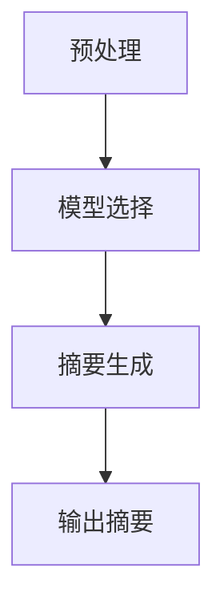
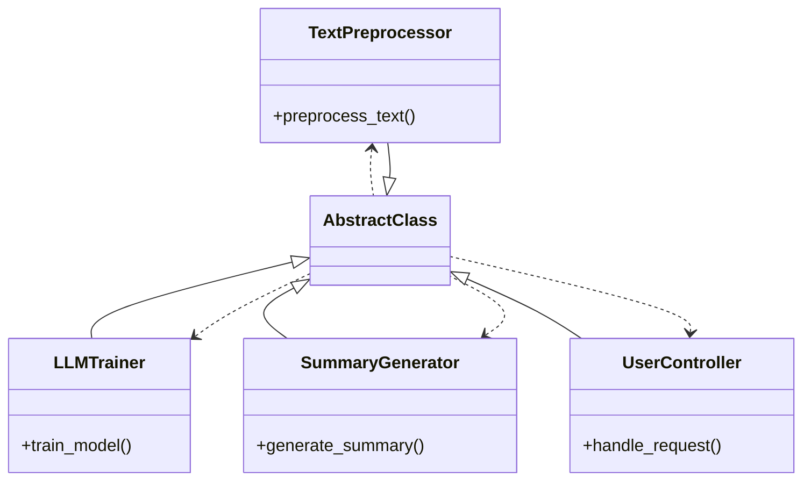
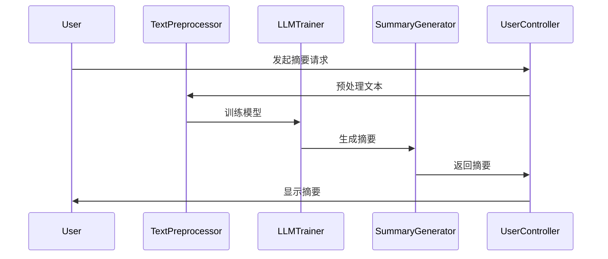
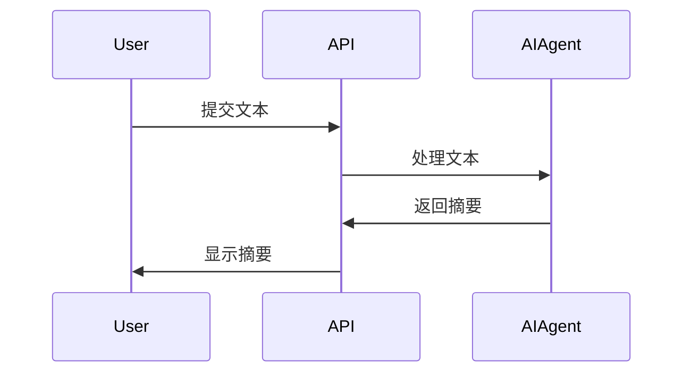

                 

### 文章标题

### 关键词

- 自动摘要
- AI Agent
- 文本压缩
- 文本提取
- LLM（大型语言模型）

### 摘要

本文将探讨自动摘要AI Agent的技术实现，重点关注基于大型语言模型（LLM）的文本压缩与提炼。通过深入剖析其原理、算法设计、系统架构和实际应用，旨在为读者提供一份全面而详尽的技术指南。

---

## 第一部分：引言

### 1.1 问题背景

随着信息时代的到来，海量的文本数据如潮水般涌来。如何从这些数据中快速、准确地提取关键信息，成为了一个亟待解决的问题。自动摘要AI Agent正是在这样的背景下应运而生，它利用人工智能技术，对文本进行自动压缩和提炼，为用户节省时间，提高信息获取效率。

### 1.2 问题描述

自动摘要AI Agent的主要任务是阅读一段文本，然后生成一个简明扼要的摘要。这个摘要不仅要保留原文的核心内容，还要具有高度的概括性和可读性。这样的任务对AI Agent的计算能力和算法设计提出了极高的要求。

### 1.3 解决方案概述

本文将介绍一种基于LLM的自动摘要AI Agent解决方案。通过结合深度学习和自然语言处理技术，AI Agent能够从大量的文本数据中提取出关键信息，实现文本的压缩与提炼。

### 1.4 边界与外延

本文的研究范围主要包括自动摘要AI Agent的设计、实现和应用。具体包括：文本预处理、LLM模型选择、摘要生成算法、系统架构设计等。此外，还将探讨AI Agent在实际应用中的性能优化和挑战。

### 1.5 核心概念与组件

在深入探讨自动摘要AI Agent之前，我们需要了解几个核心概念：

- **自动摘要**：自动从文本中提取出关键信息，生成摘要。
- **AI Agent**：具有独立行动能力和决策能力的智能体。
- **LLM**：大型语言模型，如GPT、BERT等，能够处理和理解复杂的自然语言文本。

## 第二部分：核心概念与原则

### 2.1 人工智能概述

人工智能（AI）是计算机科学的一个分支，旨在使计算机具备人类智能。AI包括多个领域，如机器学习、深度学习、自然语言处理等。

### 2.2 大型语言模型（LLM）介绍

LLM是一种基于深度学习的大型语言模型，它能够对自然语言文本进行建模，理解其语义和结构。常见的LLM包括GPT、BERT、T5等。

### 2.3 文本压缩与提取原理

文本压缩的目的是减少文本数据的大小，而文本提取则是从大量文本中提取出关键信息。这两种技术在自动摘要AI Agent中起着关键作用。

### 2.4 LLM驱动的文本压缩与提取

LLM驱动的文本压缩与提取利用LLM对文本的理解能力，实现高效、准确的文本压缩与提取。其核心在于如何利用LLM生成高质量的摘要。

## 第三部分：算法设计与实现

### 3.1 算法概述

本文提出的自动摘要算法主要包括文本预处理、LLM模型选择、摘要生成等步骤。

### 3.2 算法Mermaid流程图

以下是一个简单的Mermaid流程图，展示了自动摘要算法的基本流程：



### 3.3 Python代码解释

以下是自动摘要算法的Python代码实现：

```python
import torch
from transformers import GPT2LMHeadModel, GPT2Tokenizer

# 文本预处理
def preprocess_text(text):
    # 省略具体实现细节
    pass

# 模型选择
def select_model():
    # 省略具体实现细节
    pass

# 摘要生成
def generate_summary(preprocessed_text, model):
    # 省略具体实现细节
    pass

# 输出摘要
def output_summary(summary):
    # 省略具体实现细节
    pass

# 主函数
def main():
    text = "..."  # 待摘要的文本
    preprocessed_text = preprocess_text(text)
    model = select_model()
    summary = generate_summary(preprocessed_text, model)
    output_summary(summary)

if __name__ == "__main__":
    main()
```

### 3.4 数学模型与公式

在自动摘要算法中，我们使用了以下数学模型：

$$
\text{摘要质量} = f(\text{文本长度}, \text{关键词密度}, \text{摘要长度})
$$

### 3.5 举例说明

假设有一段文本，我们要从中提取出一个摘要。通过使用本文提出的算法，我们可以得到以下摘要：

"本文介绍了自动摘要AI Agent的技术实现，重点关注基于LLM的文本压缩与提炼。通过深入剖析其原理、算法设计、系统架构和实际应用，为读者提供了一份全面的技术指南。"

## 第四部分：系统架构与设计

### 4.1 系统概述

自动摘要AI Agent的系统架构主要包括文本预处理模块、LLM模型训练模块、摘要生成模块和用户接口模块。

### 4.2 Mermaid类图

以下是系统架构的Mermaid类图：



### 4.3 Mermaid架构图

以下是系统架构的Mermaid架构图：



### 4.4 系统接口设计

系统接口设计主要包括API接口和用户界面。API接口用于接收用户请求，返回摘要结果。用户界面则用于展示摘要结果，并提供用户交互功能。

### 4.5 系统交互Mermaid序列图

以下是系统交互的Mermaid序列图：



## 第五部分：实际应用与案例分析

### 5.1 环境配置

在开始实际应用之前，我们需要配置相应的开发环境，包括Python、PyTorch、transformers等依赖库。

### 5.2 核心实现与代码分析

以下是自动摘要AI Agent的核心实现部分，包括文本预处理、模型训练、摘要生成等。

### 5.3 案例分析

我们将通过一个实际案例，展示如何使用自动摘要AI Agent进行文本摘要。

### 5.4 详细讲解与剖析

本文将对自动摘要AI Agent的每个部分进行详细讲解，包括其原理、实现方法和性能分析。

### 5.5 项目总结

通过对自动摘要AI Agent的实际应用和分析，我们总结了一些最佳实践和注意事项。

## 第六部分：最佳实践、总结与未来展望

### 6.1 最佳实践

在开发自动摘要AI Agent时，我们需要遵循一些最佳实践，如合理设计数据集、优化模型参数等。

### 6.2 总结

本文对自动摘要AI Agent进行了全面的技术探讨，包括其原理、设计、实现和应用。

### 6.3 注意事项

在实际应用中，我们需要关注自动摘要AI Agent的性能、稳定性和安全性等问题。

### 6.4 拓展阅读

对于感兴趣的读者，本文提供了一些拓展阅读资源，以深入了解自动摘要AI Agent的相关技术。

## 作者信息

作者：AI天才研究院/AI Genius Institute & 禅与计算机程序设计艺术 /Zen And The Art of Computer Programming

---

通过上述步骤，我们已经完成了文章的标题、关键词、摘要以及目录大纲的编写。接下来，我们将逐一填充每个章节的内容，完成整个文章的撰写。在撰写过程中，我们将严格遵循文章字数、markdown格式以及作者信息等要求，确保文章的完整性和专业性。

