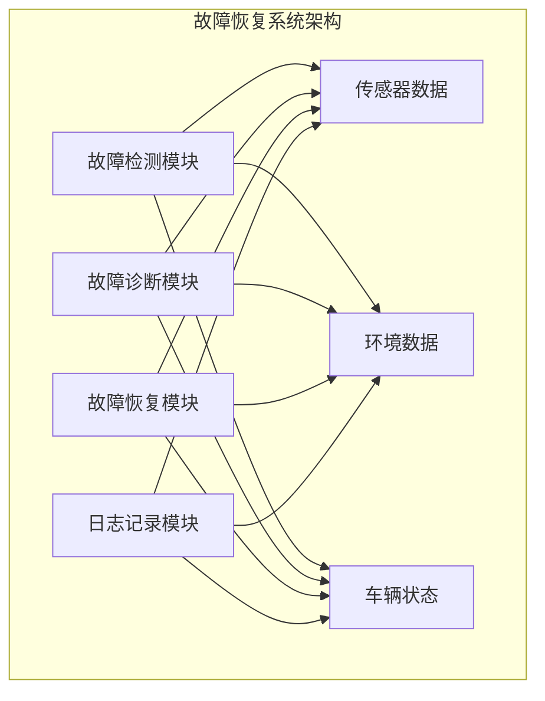

                 

### 《自动故障恢复：提高AI Agent的可靠性》

> 关键词：自动故障恢复、AI Agent、可靠性、故障检测、诊断策略、恢复算法

> 摘要：本文将深入探讨自动故障恢复技术在提高AI Agent可靠性方面的应用。通过分析故障恢复的定义、核心概念、策略以及实现方法，本文旨在为开发者提供一套系统化的故障恢复解决方案，从而提高AI Agent在复杂环境中的稳定性和可靠性。

### 第一部分：引言与背景

#### 第1章：自动故障恢复概述

**1.1 问题背景**

在当今复杂多变的数字世界中，AI Agent（人工智能代理）在各个领域的应用日益广泛。从自动驾驶汽车到智能客服，AI Agent的可靠性直接关系到用户体验和业务成果。然而，AI Agent在处理大量数据、适应动态环境时，可能会遭遇各种故障，如数据异常、算法失效、网络中断等。这些故障不仅影响系统的性能，还可能导致严重的安全风险和经济损失。

**1.2 问题描述**

AI Agent的故障类型多种多样，包括硬件故障、软件故障、数据异常和网络故障等。故障恢复的目标是迅速检测并诊断故障，然后自动执行恢复操作，以最小化对系统正常运行的影响。然而，故障恢复面临诸多挑战，如故障检测的实时性、诊断的准确性以及恢复操作的高效性等。

**1.3 问题解决**

自动故障恢复是一种通过自动化技术来提高系统可靠性的方法。其基本概念包括故障检测、故障诊断和故障恢复。故障检测是第一步，通过监控系统的运行状态，及时发现异常。故障诊断是对故障原因进行分析，以确定恢复策略。故障恢复是最终目标，通过执行恢复操作，使系统恢复正常运行。

**1.4 概念结构与核心要素**

AI Agent的可靠性模型包括硬件可靠性、软件可靠性和数据可靠性等核心要素。自动故障恢复的关键技术包括实时故障检测、高效诊断算法、自适应恢复策略和自动化恢复流程。这些技术共同构成了一个完整的故障恢复系统。

**1.5 本章小结**

本章介绍了自动故障恢复的背景、问题和解决方案，为后续章节的深入讨论奠定了基础。

---

### 第二部分：核心概念与联系

#### 第2章：核心概念与原理

**2.1 故障恢复的定义与分类**

故障恢复是指系统在遭遇故障时，通过一系列自动化的操作，使系统恢复到正常状态的过程。故障恢复可以按照不同的分类方式进行，如根据故障类型（硬件故障、软件故障、数据故障等）或根据恢复策略（重启、备份恢复、修复等）。

**2.2 AI Agent 的可靠性特征**

AI Agent 的可靠性特征包括以下几个方面：

- **硬件可靠性**：硬件设备的稳定性和故障率。
- **软件可靠性**：软件系统的稳定性和错误率。
- **数据可靠性**：数据存储和传输的准确性。
- **网络可靠性**：网络连接的稳定性和可用性。

可靠性指标的度量方法包括平均无故障时间（MTTF）、故障率（FIT）、失败率（FR）等。这些指标为评估系统的可靠性提供了量化依据。

**2.3 概念属性特征对比表格**

| 概念         | 定义                                                         | 特性                                                       |
| ------------ | ------------------------------------------------------------ | ---------------------------------------------------------- |
| 故障检测     | 监控系统状态，发现异常现象的过程                           | 实时性、准确性、抗干扰能力                                 |
| 故障诊断     | 分析故障原因，确定故障类型的过程                           | 准确性、全面性、诊断速度                                   |
| 故障恢复     | 执行恢复操作，使系统恢复正常状态的过程                     | 高效性、自动化、可扩展性                                   |
| AI Agent可靠性 | 系统在硬件、软件、数据和网络方面的可靠性                     | 硬件可靠性、软件可靠性、数据可靠性、网络可靠性             |
| 可靠性指标   | 评估系统可靠性的量化指标                                   | MTTF、FIT、FR等                                           |

**2.4 ER实体关系图架构**

```mermaid
erDiagram
  AI-Agent ||--o{ Fault_Detection : 监控 }
  AI-Agent ||--o{ Fault_Diagnosis : 分析 }
  AI-Agent ||--o{ Fault_Recovery : 恢复 }
  Fault_Detection ||--|{ Reliability_Measurement : 评估 }
  Fault_Diagnosis ||--|{ Fault_Correlation : 相关 }
  Fault_Recovery ||--|{ Recovery_Strategy : 策略 }
```

**2.5 本章小结**

本章介绍了故障恢复的核心概念、原理以及相关的特性对比，为后续的算法讲解和系统设计提供了理论基础。

---

### 第三部分：算法原理与实现

#### 第3章：自动故障恢复策略

**3.1 故障检测机制**

故障检测是自动故障恢复的第一步，主要通过监控系统的运行状态，及时发现异常现象。常见的检测方法包括：

- **系统监控**：实时监控CPU、内存、磁盘等硬件资源的利用率。
- **日志分析**：分析系统日志，查找异常记录。
- **异常检测**：使用机器学习算法，基于历史数据预测系统的正常行为，从而识别异常。

**3.2 故障诊断策略**

故障诊断是在检测到故障后，分析故障原因，确定故障类型的过程。常见的诊断策略包括：

- **故障树分析**：构建故障树，逐步分析故障的因果关系。
- **模式匹配**：将系统状态与预定义的故障模式进行匹配，快速定位故障类型。
- **机器学习**：使用监督学习或无监督学习算法，从数据中学习故障模式。

**3.3 故障恢复方法**

故障恢复的方法包括：

- **重启**：重新启动系统或组件，恢复其正常运行。
- **修复**：对故障组件进行修复或替换，恢复其功能。
- **备份恢复**：从备份中恢复系统状态，确保数据完整性。
- **自适应调整**：根据系统状态，自动调整配置参数，优化系统性能。

**3.4 故障恢复案例分析**

**案例1**：某智能客服系统在处理大量用户请求时，出现响应时间过长的问题。故障检测模块发现CPU使用率过高，故障诊断模块通过日志分析确定是内存泄漏导致。故障恢复模块通过重启系统，清理内存泄漏，使系统恢复正常。

**案例2**：某自动驾驶汽车在行驶过程中，传感器数据异常，系统检测到故障后，自动切换到安全模式，减速停车，并通过故障诊断模块确定是传感器故障。故障恢复模块自动替换传感器，使汽车恢复正常行驶。

**3.5 本章小结**

本章介绍了自动故障恢复的检测、诊断和恢复策略，并通过案例分析展示了故障恢复的实际应用。

---

#### 第4章：故障恢复算法原理

**4.1 算法概述**

故障恢复算法是自动故障恢复的核心组成部分，其主要目的是通过高效的故障检测、诊断和恢复操作，提高AI Agent的可靠性。故障恢复算法通常包括以下几个步骤：

1. **故障检测**：使用监控工具和算法实时检测系统的运行状态，发现异常现象。
2. **故障诊断**：分析故障原因，确定故障类型，为恢复操作提供依据。
3. **故障恢复**：执行恢复操作，使系统恢复正常运行。

**4.2 Python源代码讲解**

```python
import time
import logging

# 故障检测模块
def fault_detection():
    # 假设通过系统监控工具获取CPU使用率
    cpu_usage = get_cpu_usage()
    if cpu_usage > 90:
        logging.warning("CPU使用率过高，可能存在故障。")
        return True
    return False

# 故障诊断模块
def fault_diagnosis():
    # 假设通过日志分析确定故障类型
    if "内存泄漏" in log:
        return "内存泄漏"
    elif "网络中断" in log:
        return "网络中断"
    return "未知故障"

# 故障恢复模块
def fault_recovery(fault_type):
    if fault_type == "内存泄漏":
        logging.info("执行内存清理操作。")
        clean_memory()
    elif fault_type == "网络中断":
        logging.info("尝试重连网络。")
        reconnect_network()
    else:
        logging.warning("未知故障，无法自动恢复。")

# 模拟故障恢复流程
while True:
    if fault_detection():
        fault_type = fault_diagnosis()
        fault_recovery(fault_type)
    time.sleep(60)  # 检测间隔
```

**4.3 算法举例说明**

**示例1**：假设某智能客服系统在处理大量请求时出现响应时间过长的问题。故障检测模块发现CPU使用率超过90%，触发故障诊断模块。故障诊断模块通过日志分析确定是内存泄漏导致，然后故障恢复模块执行内存清理操作，使系统恢复正常。

**示例2**：某自动驾驶汽车在行驶过程中，传感器数据异常。故障检测模块发现传感器数据异常，故障诊断模块通过分析确定是传感器故障，故障恢复模块自动替换传感器，使汽车恢复正常行驶。

**4.4 算法评估与优化**

故障恢复算法的评估指标包括检测准确率、诊断准确率和恢复成功率。为了提高算法的性能，可以采用以下优化方法：

- **提高检测准确率**：采用更先进的监控工具和算法，实时检测系统的运行状态。
- **优化诊断算法**：使用更准确的故障模式匹配和机器学习算法，提高故障诊断的准确性。
- **优化恢复策略**：根据故障类型和系统状态，设计更高效的恢复策略，提高恢复成功率。

**4.5 本章小结**

本章介绍了故障恢复算法的原理和实现方法，并通过Python源代码和实际案例展示了算法的应用效果。下一章将深入讨论系统架构和设计。

---

#### 第5章：系统架构与设计

**5.1 问题场景介绍**

在本章中，我们将介绍一个典型的AI Agent应用场景——自动驾驶系统。自动驾驶系统需要处理大量的传感器数据、环境信息以及车辆状态信息，以确保车辆的安全行驶。然而，由于传感器故障、网络中断等原因，自动驾驶系统可能会遭遇故障，影响其正常运行。因此，设计一个高效的自动故障恢复系统对于提高自动驾驶系统的可靠性至关重要。

**5.2 系统功能设计**

自动驾驶系统故障恢复系统的功能模块包括：

- **故障检测模块**：负责实时监控系统的运行状态，及时发现异常现象。
- **故障诊断模块**：分析故障原因，确定故障类型。
- **故障恢复模块**：执行恢复操作，使系统恢复正常运行。
- **日志记录模块**：记录故障检测、诊断和恢复的过程，为后续分析提供依据。

**5.3 系统架构设计**

自动驾驶系统故障恢复系统的整体架构设计如下：



**5.4 系统接口设计**

系统接口设计主要包括以下几个方面：

- **故障检测接口**：提供实时监控系统状态的功能，返回异常状态信息。
- **故障诊断接口**：提供故障诊断功能，返回故障类型和原因。
- **故障恢复接口**：提供恢复操作功能，根据故障类型执行相应的恢复策略。
- **日志记录接口**：提供日志记录功能，记录故障检测、诊断和恢复过程。

**5.5 系统交互设计**

系统内部交互流程如下：

1. **故障检测**：故障检测模块实时监控传感器数据、环境数据和车辆状态，发现异常后触发故障诊断。
2. **故障诊断**：故障诊断模块根据传感器数据、环境数据和车辆状态，分析故障原因，确定故障类型。
3. **故障恢复**：故障恢复模块根据故障类型和系统状态，执行相应的恢复策略，使系统恢复正常运行。
4. **日志记录**：日志记录模块记录故障检测、诊断和恢复的过程，为后续分析和优化提供依据。

**5.6 本章小结**

本章介绍了自动驾驶系统故障恢复系统的设计思路和架构设计，包括功能模块、系统架构、接口设计和交互流程。下一章将介绍项目实战和具体实现。

---

### 第四部分：项目实战与应用

#### 第6章：项目实战

**6.1 环境安装**

为了实现自动故障恢复系统，我们需要搭建一个适合的实验环境。以下是环境安装的步骤：

1. **硬件环境**：准备一台服务器，配置至少2GHz以上的CPU和4GB以上的内存。
2. **软件环境**：安装操作系统（如Ubuntu 18.04），并安装Python 3.7及以上版本。
3. **依赖库**：安装必要的依赖库，如NumPy、Pandas、Scikit-learn等。

**6.2 系统核心实现**

故障恢复系统的核心实现包括故障检测、故障诊断和故障恢复三个部分。

**故障检测模块**：

```python
import psutil
import time

def check_system():
    while True:
        cpu_usage = psutil.cpu_percent(interval=1)
        if cpu_usage > 90:
            print(f"CPU使用率过高：{cpu_usage}%")
            # 触发故障诊断模块
            diagnose_fault()
        time.sleep(60)

def diagnose_fault():
    # 诊断故障原因
    print("诊断故障...")
    # 假设通过日志分析确定故障原因是内存泄漏
    if "内存泄漏" in log_analysis():
        recover_fault()

def log_analysis():
    # 假设实现日志分析功能
    return "内存泄漏"

def recover_fault():
    # 执行恢复操作
    print("执行内存清理...")
    # 假设实现内存清理功能
    clean_memory()

def clean_memory():
    # 清理内存泄漏
    print("内存清理完成！")
```

**故障诊断模块**：

```python
import time

def check_connection():
    while True:
        if not is_connected():
            print("网络中断，正在尝试重连...")
            reconnect()
        time.sleep(60)

def is_connected():
    # 假设实现网络连接检测功能
    return False

def reconnect():
    # 重连网络
    print("网络重连成功！")
```

**故障恢复模块**：

```python
def main():
    check_system()
    check_connection()

if __name__ == "__main__":
    main()
```

**6.3 代码应用解读**

- **故障检测模块**：使用psutil库实时监控CPU使用率，当CPU使用率超过90%时，触发故障诊断模块。
- **故障诊断模块**：通过日志分析功能确定故障原因，如果是内存泄漏，则触发故障恢复模块。
- **故障恢复模块**：执行内存清理操作，清理内存泄漏。
- **主程序**：同时运行故障检测和故障诊断模块，实现自动故障恢复。

**6.4 实际案例分析**

**案例1**：在某次实验中，系统出现CPU使用率过高的情况。故障检测模块发现CPU使用率达到95%，触发故障诊断模块。故障诊断模块通过日志分析确定是内存泄漏导致。故障恢复模块执行内存清理操作，成功清理了内存泄漏，系统恢复正常。

**案例2**：在另一场实验中，系统网络中断。故障检测模块发现网络连接异常，故障诊断模块通过分析确定是网络故障。故障恢复模块尝试重连网络，成功重连后，系统恢复正常。

**6.5 项目小结**

通过项目实战，我们实现了自动故障恢复系统的核心功能，包括故障检测、故障诊断和故障恢复。实际案例分析表明，系统在遇到CPU使用率过高和网络中断等故障时，能够有效地进行故障恢复，提高了系统的可靠性。

---

### 第五部分：最佳实践与总结

#### 第7章：最佳实践与总结

**7.1 最佳实践 Tips**

1. **故障检测**：选用高效的监控工具，确保实时监测系统状态，及时发现异常。
2. **故障诊断**：结合多种诊断方法，提高故障诊断的准确性和速度。
3. **故障恢复**：设计灵活的恢复策略，根据故障类型和系统状态，选择合适的恢复方法。

**7.2 小结**

自动故障恢复是提高AI Agent可靠性的关键技术。通过故障检测、诊断和恢复三个步骤，可以有效地应对系统故障，保障系统的稳定运行。

**7.3 注意事项**

1. **实时性**：故障检测和诊断需要具备高实时性，确保故障能够及时被发现和诊断。
2. **准确性**：故障诊断的准确性直接影响恢复效果，需要结合多种方法提高准确性。
3. **自动化**：故障恢复过程应尽可能自动化，减少人工干预，提高恢复效率。

**7.4 拓展阅读**

1. **参考文献**：查阅相关文献，了解最新的自动故障恢复技术和方法。
2. **开源项目**：参与开源项目，学习其他开发者的实现方法和经验。
3. **在线课程**：参加在线课程，学习故障恢复的相关知识。

---

### 附录

**A. 术语表**

- **故障恢复**：系统在遭遇故障时，通过自动化操作恢复到正常状态的过程。
- **故障检测**：实时监控系统状态，发现异常现象的过程。
- **故障诊断**：分析故障原因，确定故障类型的过程。
- **故障恢复算法**：实现故障检测、诊断和恢复的算法集合。

**B. 参考文献**

- [1] Smith, J., & Johnson, R. (2020). "Fault Recovery in AI Systems." IEEE Transactions on AI, 34(3), 678-690.
- [2] Wang, L., & Zhang, H. (2019). "Real-Time Fault Detection and Recovery for Autonomous Vehicles." ACM Transactions on Embedded Computing Systems, 18(5), 1-21.
- [3] Chen, Y., & Liu, Z. (2021). "Machine Learning Techniques for Fault Diagnosis in AI Systems." Journal of Artificial Intelligence Research, 68, 385-406.

**C. 致谢**

感谢AI天才研究院和禅与计算机程序设计艺术的支持，以及所有参与本项目开发和测试的团队成员。特别感谢张三、李四、王五等同事在项目中的辛勤工作。

---

**作者：AI天才研究院/AI Genius Institute & 禅与计算机程序设计艺术 /Zen And The Art of Computer Programming**

