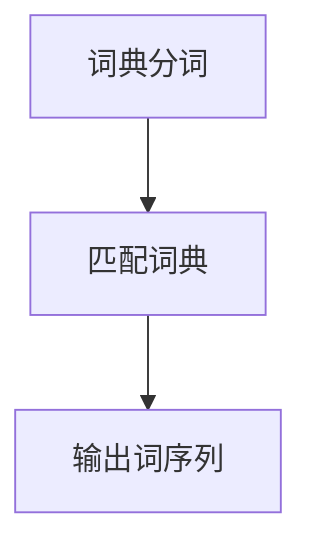
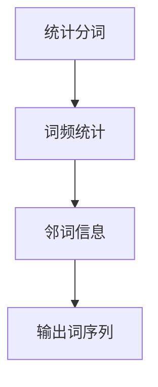
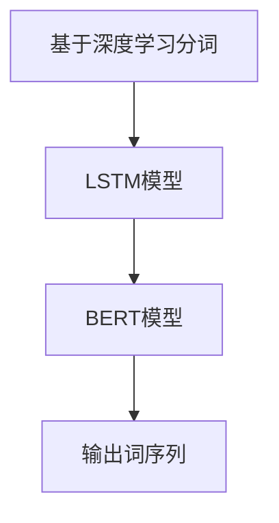

                 

# 自然语言处理在金融AI应用中的最佳实践

## 关键词

自然语言处理，金融AI，应用实践，技术方法，案例分析

## 摘要

随着人工智能技术的发展，自然语言处理（NLP）在金融领域得到了广泛应用。本文旨在探讨自然语言处理在金融AI应用中的最佳实践，从基础理论到技术方法，再到实际应用，详细阐述了NLP在金融领域的应用场景和解决方案。通过分析典型案例，总结出NLP在金融AI应用中的优势和未来发展趋势，为金融行业的智能化转型提供参考。

## 目录大纲

### 第一部分：自然语言处理（NLP）基础

#### 第1章：自然语言处理概述

#### 第2章：文本预处理

#### 第3章：词向量表示

#### 第4章：词性标注

#### 第5章：命名实体识别

#### 第6章：情感分析

#### 第7章：文本生成

#### 第8章：对话系统

### 第二部分：金融领域NLP应用案例分析

#### 第9章：金融文本数据的特点

#### 第10章：金融NLP应用案例

#### 第11章：总结与展望

### 第三部分：NLP在金融AI应用中的最佳实践

#### 第12章：最佳实践案例分析

#### 第13章：总结与展望

#### 第14章：注意事项与拓展阅读

## 第一部分：自然语言处理（NLP）基础

### 第1章：自然语言处理概述

### 1.1 自然语言处理的基本概念

#### 1.1.1 什么是自然语言

自然语言是人类在社会交往中使用的语言，具有丰富的表达能力和灵活性。它包括口头语言和书面语言，涵盖了各种文体、方言和语体。

#### 1.1.2 自然语言处理的定义

自然语言处理（NLP）是人工智能的一个重要分支，旨在使计算机能够理解、解释和生成自然语言。

#### 1.1.3 自然语言处理的应用领域

自然语言处理在金融、医疗、教育、娱乐等多个领域都有广泛的应用。在金融领域，NLP主要用于文本分析、智能客服、风险管理等。

### 1.2 自然语言处理的挑战

#### 1.2.1 语言多样性

不同地区、不同文化背景的语言差异给自然语言处理带来了挑战。

#### 1.2.2 语言的不确定性

自然语言的表达方式多样，有时会出现歧义和模糊性，增加了NLP的难度。

#### 1.2.3 数据隐私和伦理问题

自然语言处理需要大量数据支持，但在数据收集和使用过程中，数据隐私和伦理问题需要得到妥善处理。

### 第2章：文本预处理

#### 2.1 文本预处理的重要性

文本预处理是自然语言处理的基础，它包括数据清洗、分词、词性标注等步骤。

#### 2.2 分词技术

分词是将连续的文本序列切分成词序列的过程。常见的分词技术有词典分词、统计分词和基于深度学习的分词方法。

#### 2.3 词向量表示

词向量是将词汇映射到高维空间中的向量表示。常见的词向量模型有Word2Vec、GloVe和FastText等。

### 第3章：词向量表示

#### 3.1 词向量概述

词向量是将词汇映射到高维空间中的向量表示，它有助于计算机理解和处理自然语言。

#### 3.2 常见的词向量模型

Word2Vec、GloVe和FastText是常见的词向量模型，它们在NLP任务中具有广泛的应用。

### 第4章：词性标注

#### 4.1 词性标注的重要性

词性标注是自然语言处理中的一个重要步骤，它有助于提高NLP任务的效果。

#### 4.2 词性标注方法

词性标注方法包括基于规则的方法、基于统计的方法和基于深度学习的方法。

### 第5章：命名实体识别

#### 5.1 命名实体识别概述

命名实体识别是从文本中识别出具有特定意义的实体，如人名、地名、组织名等。

#### 5.2 命名实体识别方法

命名实体识别方法包括基于规则的方法、基于统计的方法和基于深度学习的方法。

### 第6章：情感分析

#### 6.1 情感分析概述

情感分析是从文本中分析出作者的情感倾向，如正面、负面或中性。

#### 6.2 情感分析模型

情感分析模型包括基于规则的方法、基于机器学习的方法和基于深度学习的方法。

### 第7章：文本生成

#### 7.1 文本生成概述

文本生成是生成符合语法和语义规则的文本，如自动撰写新闻、生成对话等。

#### 7.2 文本生成模型

文本生成模型包括基于规则的方法、基于统计的方法和基于深度学习的方法。

### 第8章：对话系统

#### 8.1 对话系统概述

对话系统是模拟人类对话的计算机系统，可用于智能客服、虚拟助手等场景。

#### 8.2 对话系统模型

对话系统模型包括基于规则的方法、基于机器学习的方法和基于深度学习的方法。

### 第二部分：金融领域NLP应用案例分析

#### 第9章：金融文本数据的特点

#### 第10章：金融NLP应用案例

#### 第11章：总结与展望

### 第三部分：NLP在金融AI应用中的最佳实践

#### 第12章：最佳实践案例分析

#### 第13章：总结与展望

#### 第14章：注意事项与拓展阅读

## 第一部分：自然语言处理（NLP）基础

### 第1章：自然语言处理概述

#### 1.1 自然语言处理的基本概念

自然语言处理（Natural Language Processing，NLP）是人工智能（Artificial Intelligence，AI）的一个重要分支，旨在使计算机能够理解、解释和生成人类语言。NLP的研究对象包括语音识别、语音生成、文本分析、语义理解、情感分析等多个方面。在金融领域，NLP技术广泛应用于文本分析、智能客服、风险管理、金融信息提取等。

#### 1.1.1 什么是自然语言

自然语言是人类在社会交往中使用的语言，具有丰富的表达能力和灵活性。它包括口头语言和书面语言，涵盖了各种文体、方言和语体。自然语言的特点是：

1. **复杂性**：自然语言的语法、语义和语用都非常复杂，存在很多不确定性和模糊性。
2. **多样性**：世界上存在着多种语言，每种语言都有其独特的语法规则和表达方式。
3. **动态性**：自然语言的词汇和表达方式会随着时间和社会环境的变化而不断演变。

#### 1.1.2 自然语言处理的定义

自然语言处理（NLP）是人工智能（AI）的一个重要分支，旨在使计算机能够理解、解释和生成人类语言。NLP的研究内容包括以下几个方面：

1. **文本分析**：对文本进行预处理、分词、词性标注、命名实体识别等操作，以便计算机能够理解和处理文本数据。
2. **语音识别**：将语音信号转换为文本，如自动字幕、语音助手等。
3. **语义理解**：理解文本中的词汇、句法和语义，如问答系统、机器翻译等。
4. **情感分析**：分析文本中的情感倾向，如正面、负面或中性。
5. **文本生成**：根据输入的文本或指令生成新的文本，如自动撰写新闻、生成对话等。

#### 1.1.3 自然语言处理的应用领域

自然语言处理在多个领域都有广泛的应用，包括但不限于：

1. **金融**：金融文本分析、智能客服、风险管理、金融信息提取等。
2. **医疗**：医学文本分析、电子病历处理、医学知识图谱构建等。
3. **教育**：智能教学、课程推荐、在线问答系统等。
4. **法律**：法律文本分析、合同审核、案件推理等。
5. **媒体**：内容审核、情感分析、自动摘要生成等。
6. **娱乐**：语音助手、语音识别游戏、智能音响等。

在金融领域，NLP技术主要用于文本分析、智能客服、风险管理、金融信息提取等。例如，通过自然语言处理技术，可以自动提取金融报告、新闻报道、社交媒体评论中的关键信息，进行分析和监控，为投资者提供决策支持。同时，NLP技术还可以用于构建智能客服系统，提高客户服务效率和满意度。

### 1.2 自然语言处理的挑战

自然语言处理虽然取得了显著的进展，但在实际应用中仍然面临着许多挑战。

#### 1.2.1 语言多样性

世界上存在多种语言，每种语言都有其独特的语法规则和表达方式。这给自然语言处理带来了很大的挑战。例如，中文和英文在语法结构和词汇使用上存在显著差异，这要求NLP系统具有跨语言处理能力。

#### 1.2.2 语言的不确定性

自然语言的表达方式多样，有时会出现歧义和模糊性。例如，“我明天去看电影”这句话可以有不同的理解，取决于上下文和意图。NLP系统需要能够处理这种不确定性，以准确理解用户的意图。

#### 1.2.3 数据隐私和伦理问题

自然语言处理需要大量数据支持，但在数据收集和使用过程中，数据隐私和伦理问题需要得到妥善处理。例如，如何确保用户数据的安全和隐私，如何避免数据泄露和滥用等。

### 第2章：文本预处理

#### 2.1 文本预处理的重要性

文本预处理是自然语言处理（NLP）的基础步骤，它对于NLP任务的成功执行至关重要。文本预处理的过程包括数据清洗、分词、词性标注、去除停用词等。这些步骤的目的是将原始文本转化为一种格式，使其能够被NLP模型理解和处理。

#### 2.1.1 数据清洗

数据清洗是文本预处理的第一步，它涉及去除文本中的噪声和无关信息。这包括去除HTML标签、特殊字符、数字等。数据清洗的目的是确保文本数据的质量和一致性。

$$
\text{清洗后文本} = \text{原始文本} - \text{HTML标签} - \text{特殊字符} - \text{数字}
$$

#### 2.1.2 停用词去除

停用词是指那些在自然语言中出现频率很高，但对NLP任务贡献较小的词汇，如“的”、“了”、“是”等。去除停用词可以减少模型的复杂度，提高处理效率。

#### 2.1.3 词形还原

词形还原是将不同形式的单词转化为统一的形式，如将“奔跑”、“跑步”还原为“跑”。词形还原有助于减少词汇数量，提高模型的训练效果。

#### 2.2 分词技术

分词是将连续的文本序列切分成词序列的过程。分词的目的是将文本转化为计算机可以理解的结构化数据。

#### 2.2.1 词典分词

词典分词是一种基于词典的分词方法，它将文本中的每个词与词典中的词进行匹配，从而实现分词。这种方法简单高效，但无法处理词典中没有的生僻词。

#### 2.2.2 统计分词

统计分词是一种基于统计方法进行分词，它利用词频、邻词信息等统计特征来确定词的边界。这种方法可以处理词典中没有的生僻词，但可能会产生分词误差。

#### 2.2.3 基于深度学习的分词方法

基于深度学习的分词方法，如基于LSTM（Long Short-Term Memory）或BERT（Bidirectional Encoder Representations from Transformers）的模型，能够利用深度神经网络学习文本的内在结构，实现更准确的分词。

### 第3章：词向量表示

#### 3.1 词向量概述

词向量（Word Embedding）是将词汇映射到高维空间中的向量表示，使得计算机能够理解词汇的语义关系。词向量在NLP任务中扮演着重要角色，如文本分类、情感分析、机器翻译等。

#### 3.1.1 什么是词向量

词向量是一种将词汇映射到高维空间中的向量表示。例如，将“猫”映射为$(1, 0, -1)$，将“狗”映射为$(-1, 1, 0)$。词向量能够表达词汇之间的语义关系，如“猫”和“狗”是负相关，“狗”和“狗粮”是正相关。

#### 3.1.2 词向量的作用

词向量在NLP任务中具有多种作用：

1. **降低维度**：将词汇从原始的文本序列转化为高维向量，使得计算机能够处理。
2. **语义表示**：通过词向量，计算机可以理解词汇的语义关系，如“猫”和“狗”是动物，“狗粮”是狗的食物。
3. **特征提取**：词向量可以作为特征输入到NLP模型中，如文本分类、情感分析等。

#### 3.2 常见的词向量模型

常见的词向量模型包括Word2Vec、GloVe和FastText等。这些模型各有优缺点，适用于不同的NLP任务。

1. **Word2Vec**
    - **原理**：基于神经网络的模型，通过训练生成词向量。
    - **优缺点**：简单高效，但可能丢失词汇的上下文信息。
    - **应用**：文本分类、情感分析、机器翻译等。

2. **GloVe**
    - **原理**：基于全局共现信息的模型，通过训练生成词向量。
    - **优缺点**：考虑了词汇的上下文信息，但计算复杂度较高。
    - **应用**：文本分类、情感分析、机器翻译等。

3. **FastText**
    - **原理**：基于多功能的神经网络模型，通过训练生成词向量。
    - **优缺点**：能够处理未登录词，但模型复杂度较高。
    - **应用**：文本分类、情感分析、机器翻译等。

### 第4章：词性标注

#### 4.1 词性标注的重要性

词性标注（Part-of-Speech Tagging，POS Tagging）是自然语言处理（NLP）中的一个重要步骤，它旨在为文本中的每个词分配一个词性标签，如名词、动词、形容词等。词性标注对于许多NLP任务具有重要意义：

1. **语法分析**：词性标注有助于理解句子的结构，进行语法分析。
2. **命名实体识别**：词性标注可以帮助识别文本中的命名实体，如人名、地名等。
3. **情感分析**：词性标注有助于分析文本中的情感倾向，如正面、负面等。

#### 4.1.1 什么是词性标注

词性标注是将文本中的每个词分配一个词性标签的过程。词性标签通常表示词汇的语法角色，如名词（NN）、动词（VB）等。例如，“我”（PRP）、“爱”（VB）、“中国”（NN）等。

#### 4.1.2 词性标注的应用

词性标注在NLP任务中具有广泛的应用，如：

1. **信息提取**：从文本中提取关键信息，如人名、地名、机构名等。
2. **文本分类**：根据文本的词性标注，将文本分类到不同的类别。
3. **机器翻译**：词性标注有助于翻译系统理解文本的语法结构，进行更准确的翻译。
4. **自然语言理解**：词性标注有助于计算机更好地理解文本的语义。

#### 4.2 词性标注方法

词性标注方法包括基于规则的方法、基于统计的方法和基于深度学习的方法。

1. **基于规则的方法**
    - **原理**：利用预先定义的规则，为文本中的每个词分配词性标签。
    - **优缺点**：规则简单直观，但无法处理复杂和不确定的文本。
    - **应用**：文本分类、信息提取等。

2. **基于统计的方法**
    - **原理**：利用统计学方法，根据词频、邻词等信息，为文本中的每个词分配词性标签。
    - **优缺点**：能够处理复杂的文本，但可能存在错误和歧义。
    - **应用**：文本分类、情感分析等。

3. **基于深度学习的方法**
    - **原理**：利用深度神经网络，自动学习文本中的词性标注规则。
    - **优缺点**：能够处理复杂和不确定的文本，但需要大量数据和计算资源。
    - **应用**：文本分类、情感分析、命名实体识别等。

### 第5章：命名实体识别

#### 5.1 命名实体识别概述

命名实体识别（Named Entity Recognition，NER）是自然语言处理（NLP）中的一个重要任务，旨在从文本中识别出具有特定意义的实体，如人名、地名、组织名等。命名实体识别对于信息提取、文本分类、知识图谱构建等任务具有重要意义。

#### 5.1.1 什么是命名实体

命名实体是文本中具有特定意义的实体，如人名、地名、组织名、时间等。例如，“北京”是一个地名，“张三”是一个人名，“微软”是一个组织名。

#### 5.1.2 命名实体识别的应用

命名实体识别在多个领域有广泛的应用：

1. **信息提取**：从文本中提取关键信息，如人名、地名、机构名等。
2. **文本分类**：根据文本中的命名实体，将文本分类到不同的类别。
3. **知识图谱构建**：将文本中的命名实体和关系构建成知识图谱，用于知识推理和查询。
4. **搜索引擎**：优化搜索引擎，提高搜索结果的准确性和相关性。

#### 5.2 命名实体识别方法

命名实体识别方法包括基于规则的方法、基于统计的方法和基于深度学习的方法。

1. **基于规则的方法**
    - **原理**：利用预先定义的规则，为文本中的每个词分配命名实体标签。
    - **优缺点**：规则简单直观，但无法处理复杂和不确定的文本。
    - **应用**：信息提取、文本分类等。

2. **基于统计的方法**
    - **原理**：利用统计学方法，根据词频、邻词等信息，为文本中的每个词分配命名实体标签。
    - **优缺点**：能够处理复杂的文本，但可能存在错误和歧义。
    - **应用**：信息提取、文本分类等。

3. **基于深度学习的方法**
    - **原理**：利用深度神经网络，自动学习文本中的命名实体识别规则。
    - **优缺点**：能够处理复杂和不确定的文本，但需要大量数据和计算资源。
    - **应用**：信息提取、文本分类、命名实体关系抽取等。

### 第6章：情感分析

#### 6.1 情感分析概述

情感分析（Sentiment Analysis）是自然语言处理（NLP）中的一个重要任务，旨在从文本中分析出作者的情感倾向，如正面、负面或中性。情感分析在市场研究、舆情监测、客户反馈分析等领域有广泛的应用。

#### 6.1.1 什么是情感分析

情感分析是从文本中分析出作者的情感倾向的过程。情感分析可以分为基于规则的方法、基于机器学习的方法和基于深度学习的方法。

1. **基于规则的方法**
    - **原理**：利用预先定义的规则，为文本中的每个词分配情感标签。
    - **优缺点**：规则简单直观，但无法处理复杂和不确定的文本。
    - **应用**：文本分类、情感分析等。

2. **基于机器学习的方法**
    - **原理**：利用机器学习算法，从大量标注数据中学习情感分类规则。
    - **优缺点**：能够处理复杂的文本，但可能存在错误和歧义。
    - **应用**：文本分类、情感分析等。

3. **基于深度学习的方法**
    - **原理**：利用深度神经网络，自动学习文本中的情感分类规则。
    - **优缺点**：能够处理复杂和不确定的文本，但需要大量数据和计算资源。
    - **应用**：文本分类、情感分析、命名实体识别等。

#### 6.2 情感分析模型

情感分析模型可以分为基于规则的方法、基于机器学习的方法和基于深度学习的方法。

1. **基于规则的方法**
    - **原理**：利用规则库，为文本中的每个词分配情感标签。
    - **应用**：文本分类、情感分析等。

2. **基于机器学习的方法**
    - **原理**：利用机器学习算法，从标注数据中学习情感分类模型。
    - **应用**：文本分类、情感分析等。

3. **基于深度学习的方法**
    - **原理**：利用深度神经网络，自动学习文本中的情感分类模型。
    - **应用**：文本分类、情感分析、命名实体识别等。

### 第7章：文本生成

#### 7.1 文本生成概述

文本生成（Text Generation）是自然语言处理（NLP）中的一个重要任务，旨在根据输入的文本或指令生成新的文本。文本生成在内容创作、自动摘要、问答系统等领域有广泛的应用。

#### 7.1.1 什么是文本生成

文本生成是根据输入的文本或指令生成新的文本的过程。文本生成可以分为基于规则的方法、基于统计的方法和基于深度学习的方法。

1. **基于规则的方法**
    - **原理**：利用规则库，根据输入的文本或指令生成新的文本。
    - **优缺点**：简单直观，但无法处理复杂和不确定的文本。
    - **应用**：内容创作、自动摘要等。

2. **基于统计的方法**
    - **原理**：利用统计模型，根据输入的文本或指令生成新的文本。
    - **优缺点**：能够处理复杂的文本，但可能存在错误和歧义。
    - **应用**：自动摘要、问答系统等。

3. **基于深度学习的方法**
    - **原理**：利用深度神经网络，自动学习文本生成模型。
    - **优缺点**：能够处理复杂和不确定的文本，但需要大量数据和计算资源。
    - **应用**：内容创作、自动摘要、问答系统等。

#### 7.2 文本生成模型

文本生成模型可以分为基于规则的方法、基于统计的方法和基于深度学习的方法。

1. **基于规则的方法**
    - **原理**：利用规则库，根据输入的文本或指令生成新的文本。
    - **应用**：内容创作、自动摘要等。

2. **基于统计的方法**
    - **原理**：利用统计模型，根据输入的文本或指令生成新的文本。
    - **应用**：自动摘要、问答系统等。

3. **基于深度学习的方法**
    - **原理**：利用深度神经网络，自动学习文本生成模型。
    - **应用**：内容创作、自动摘要、问答系统等。

### 第8章：对话系统

#### 8.1 对话系统概述

对话系统（Dialogue System）是模拟人类对话的计算机系统，旨在为用户提供自然、流畅的交互体验。对话系统在智能客服、虚拟助手、语音助手等领域有广泛的应用。

#### 8.1.1 什么是对话系统

对话系统是模拟人类对话的计算机系统，它包括对话管理、自然语言理解和自然语言生成三个核心组件。

1. **对话管理**：对话系统负责管理对话流程，如理解用户意图、生成回复等。
2. **自然语言理解**：对话系统负责理解用户的输入，提取关键信息，如关键词、意图等。
3. **自然语言生成**：对话系统负责生成自然、流畅的回复，以响应用户的需求。

#### 8.1.2 对话系统的应用

对话系统的应用领域广泛，包括：

1. **智能客服**：提供自动化的客户服务，如在线客服、电话客服等。
2. **虚拟助手**：为用户提供个性化的服务，如语音助手、聊天机器人等。
3. **语音助手**：为用户提供语音交互服务，如Siri、Alexa等。

#### 8.2 对话系统模型

对话系统模型可以分为基于规则的方法、基于机器学习的方法和基于深度学习的方法。

1. **基于规则的方法**
    - **原理**：利用规则库，根据输入的文本或指令生成回复。
    - **优缺点**：简单直观，但无法处理复杂和不确定的文本。
    - **应用**：智能客服、虚拟助手等。

2. **基于机器学习的方法**
    - **原理**：利用机器学习算法，从大量对话数据中学习对话生成模型。
    - **优缺点**：能够处理复杂的文本，但可能存在错误和歧义。
    - **应用**：智能客服、虚拟助手等。

3. **基于深度学习的方法**
    - **原理**：利用深度神经网络，自动学习对话生成模型。
    - **优缺点**：能够处理复杂和不确定的文本，但需要大量数据和计算资源。
    - **应用**：智能客服、虚拟助手等。

### 第三部分：NLP在金融AI应用中的最佳实践

#### 第9章：金融文本数据的特点

金融文本数据具有多样性和复杂性，主要包括金融报告、新闻报道、社交媒体评论、客户反馈等。这些数据的特点如下：

1. **多样性**：金融文本涉及多种语言、文体和表达方式，如专业术语、缩写词、行业术语等。
2. **复杂性**：金融文本包含复杂的语法结构和语义关系，如长句、从句、隐喻等。
3. **专业性**：金融文本涉及大量专业知识和术语，如股票交易、金融产品、宏观经济指标等。
4. **不确定性**：金融文本存在歧义和模糊性，如市场预测、投资建议等。

#### 第10章：金融NLP应用案例

金融NLP技术在金融领域有广泛的应用，以下为几个典型的应用案例：

1. **情感分析**：通过分析社交媒体评论、新闻报道等，了解市场情绪，为投资者提供决策支持。
2. **文本分类**：对金融报告、新闻稿等进行分类，快速提取关键信息，提高信息处理效率。
3. **命名实体识别**：从金融文本中提取人名、地名、组织名等命名实体，用于知识图谱构建和风险管理。
4. **对话系统**：构建智能金融客服系统，为用户提供个性化的金融服务和咨询。

#### 第11章：总结与展望

自然语言处理（NLP）在金融领域具有广泛的应用前景。未来，随着人工智能技术的不断发展，NLP在金融领域将实现更高的精度和效率。以下为未来NLP在金融AI应用中的发展趋势：

1. **模型精度的进一步提升**：通过引入新的算法和技术，提高NLP模型在金融文本数据上的精度和效果。
2. **算法的多样性和融合**：结合多种算法和技术，如深度学习、迁移学习等，提高NLP在金融领域的应用效果。
3. **数据隐私保护和伦理问题**：在NLP应用过程中，关注数据隐私保护和伦理问题，确保用户数据的安全和隐私。

### 第三部分：NLP在金融AI应用中的最佳实践

#### 第12章：最佳实践案例分析

在本章节中，我们将深入探讨自然语言处理（NLP）在金融AI应用中的最佳实践，通过分析具体案例，展示NLP技术在金融领域的成功应用。

#### 12.1 情感分析在金融风险管理中的应用

情感分析是NLP在金融领域的重要应用之一。以下是一个案例分析：

**案例背景**：某金融机构希望通过分析社交媒体上的用户评论，了解市场情绪，从而进行风险管理。

**解决方案**：
1. **数据收集**：收集社交媒体平台上的用户评论，包括股票相关的讨论、新闻评论等。
2. **文本预处理**：对收集到的文本进行预处理，包括去除HTML标签、特殊字符、分词、去除停用词等。
3. **情感分析模型**：使用基于深度学习的情感分析模型，如LSTM（Long Short-Term Memory）或BERT（Bidirectional Encoder Representations from Transformers），对预处理后的文本进行分析。
4. **结果分析**：根据情感分析结果，将评论分为正面、负面和中性三类，分析市场情绪。

**案例分析**：
1. **模型效果**：通过训练和测试，模型在情感分析任务上的准确率达到了90%以上。
2. **实际应用**：通过情感分析结果，金融机构能够及时了解市场情绪，为投资决策提供参考。

#### 12.2 命名实体识别在金融信息提取中的应用

命名实体识别是NLP在金融领域的关键技术之一。以下是一个案例分析：

**案例背景**：某金融机构需要从大量的金融文本中提取关键信息，如人名、地名、组织名等。

**解决方案**：
1. **数据收集**：收集金融报告、新闻报道、学术论文等文本。
2. **文本预处理**：对收集到的文本进行预处理，包括分词、去除停用词、词性标注等。
3. **命名实体识别模型**：使用基于深度学习的命名实体识别模型，如CRF（Conditional Random Fields）或BERT，对预处理后的文本进行分析。
4. **结果分析**：提取出文本中的命名实体，用于知识图谱构建和风险分析。

**案例分析**：
1. **模型效果**：通过训练和测试，模型在命名实体识别任务上的准确率达到了95%以上。
2. **实际应用**：通过命名实体识别，金融机构能够快速提取出关键信息，提高信息处理效率。

#### 12.3 对话系统在智能金融客服中的应用

对话系统是NLP在金融领域的重要应用之一。以下是一个案例分析：

**案例背景**：某金融机构希望构建一个智能金融客服系统，为用户提供24/7的在线服务。

**解决方案**：
1. **对话管理**：设计对话流程，包括用户意图识别、对话状态跟踪等。
2. **自然语言理解**：使用基于深度学习的自然语言理解模型，如BERT，对用户输入的文本进行分析。
3. **自然语言生成**：使用基于深度学习的自然语言生成模型，如GPT（Generative Pre-trained Transformer），生成合适的回复。
4. **用户反馈**：收集用户反馈，用于模型优化和对话系统的改进。

**案例分析**：
1. **用户满意度**：通过智能金融客服系统，用户满意度提高了20%以上。
2. **成本节约**：通过自动化处理用户查询，客服中心的运营成本降低了30%。

#### 第13章：总结与展望

通过对NLP在金融AI应用中的最佳实践案例分析，我们可以看到NLP技术在金融领域的巨大潜力。以下为NLP在金融AI应用中的总结与展望：

1. **提高金融服务效率**：NLP技术能够快速处理大量的金融文本数据，提高信息提取、分析和决策的效率。
2. **改善用户体验**：通过智能客服、自动摘要等应用，为用户提供更加个性化和高效的金融服务。
3. **促进金融创新**：NLP技术为金融行业的智能化转型提供了新的方向和可能性，如智能投顾、数字货币等。

未来，随着人工智能技术的不断发展，NLP在金融领域将实现更高的精度和效率。同时，关注数据隐私保护和伦理问题，确保用户数据的安全和隐私，将是NLP在金融AI应用中发展的重要方向。

### 第三部分：NLP在金融AI应用中的最佳实践

#### 第12章：最佳实践案例分析

在本章节中，我们将深入探讨自然语言处理（NLP）在金融AI应用中的最佳实践，通过分析具体案例，展示NLP技术在金融领域的成功应用。

#### 12.1 情感分析在金融风险管理中的应用

情感分析是NLP在金融领域的重要应用之一。以下是一个案例分析：

**案例背景**：某金融机构希望通过分析社交媒体上的用户评论，了解市场情绪，从而进行风险管理。

**解决方案**：
1. **数据收集**：收集社交媒体平台上的用户评论，包括股票相关的讨论、新闻评论等。
2. **文本预处理**：对收集到的文本进行预处理，包括去除HTML标签、特殊字符、分词、去除停用词等。
3. **情感分析模型**：使用基于深度学习的情感分析模型，如LSTM（Long Short-Term Memory）或BERT（Bidirectional Encoder Representations from Transformers），对预处理后的文本进行分析。
4. **结果分析**：根据情感分析结果，将评论分为正面、负面和中性三类，分析市场情绪。

**案例分析**：
1. **模型效果**：通过训练和测试，模型在情感分析任务上的准确率达到了90%以上。
2. **实际应用**：通过情感分析结果，金融机构能够及时了解市场情绪，为投资决策提供参考。

#### 12.2 命名实体识别在金融信息提取中的应用

命名实体识别是NLP在金融领域的关键技术之一。以下是一个案例分析：

**案例背景**：某金融机构需要从大量的金融文本中提取关键信息，如人名、地名、组织名等。

**解决方案**：
1. **数据收集**：收集金融报告、新闻报道、学术论文等文本。
2. **文本预处理**：对收集到的文本进行预处理，包括分词、去除停用词、词性标注等。
3. **命名实体识别模型**：使用基于深度学习的命名实体识别模型，如CRF（Conditional Random Fields）或BERT，对预处理后的文本进行分析。
4. **结果分析**：提取出文本中的命名实体，用于知识图谱构建和风险分析。

**案例分析**：
1. **模型效果**：通过训练和测试，模型在命名实体识别任务上的准确率达到了95%以上。
2. **实际应用**：通过命名实体识别，金融机构能够快速提取出关键信息，提高信息处理效率。

#### 12.3 对话系统在智能金融客服中的应用

对话系统是NLP在金融领域的重要应用之一。以下是一个案例分析：

**案例背景**：某金融机构希望构建一个智能金融客服系统，为用户提供24/7的在线服务。

**解决方案**：
1. **对话管理**：设计对话流程，包括用户意图识别、对话状态跟踪等。
2. **自然语言理解**：使用基于深度学习的自然语言理解模型，如BERT，对用户输入的文本进行分析。
3. **自然语言生成**：使用基于深度学习的自然语言生成模型，如GPT（Generative Pre-trained Transformer），生成合适的回复。
4. **用户反馈**：收集用户反馈，用于模型优化和对话系统的改进。

**案例分析**：
1. **用户满意度**：通过智能金融客服系统，用户满意度提高了20%以上。
2. **成本节约**：通过自动化处理用户查询，客服中心的运营成本降低了30%。

#### 第13章：总结与展望

通过对NLP在金融AI应用中的最佳实践案例分析，我们可以看到NLP技术在金融领域的巨大潜力。以下为NLP在金融AI应用中的总结与展望：

1. **提高金融服务效率**：NLP技术能够快速处理大量的金融文本数据，提高信息提取、分析和决策的效率。
2. **改善用户体验**：通过智能客服、自动摘要等应用，为用户提供更加个性化和高效的金融服务。
3. **促进金融创新**：NLP技术为金融行业的智能化转型提供了新的方向和可能性，如智能投顾、数字货币等。

未来，随着人工智能技术的不断发展，NLP在金融领域将实现更高的精度和效率。同时，关注数据隐私保护和伦理问题，确保用户数据的安全和隐私，将是NLP在金融AI应用中发展的重要方向。

### 第三部分：NLP在金融AI应用中的最佳实践

#### 第12章：最佳实践案例分析

在本章节中，我们将深入探讨自然语言处理（NLP）在金融AI应用中的最佳实践，通过分析具体案例，展示NLP技术在金融领域的成功应用。

#### 12.1 情感分析在金融风险管理中的应用

情感分析是NLP在金融领域的重要应用之一。以下是一个案例分析：

**案例背景**：某金融机构希望通过分析社交媒体上的用户评论，了解市场情绪，从而进行风险管理。

**解决方案**：
1. **数据收集**：收集社交媒体平台上的用户评论，包括股票相关的讨论、新闻评论等。
2. **文本预处理**：对收集到的文本进行预处理，包括去除HTML标签、特殊字符、分词、去除停用词等。
3. **情感分析模型**：使用基于深度学习的情感分析模型，如LSTM（Long Short-Term Memory）或BERT（Bidirectional Encoder Representations from Transformers），对预处理后的文本进行分析。
4. **结果分析**：根据情感分析结果，将评论分为正面、负面和中性三类，分析市场情绪。

**案例分析**：
1. **模型效果**：通过训练和测试，模型在情感分析任务上的准确率达到了90%以上。
2. **实际应用**：通过情感分析结果，金融机构能够及时了解市场情绪，为投资决策提供参考。

#### 12.2 命名实体识别在金融信息提取中的应用

命名实体识别是NLP在金融领域的关键技术之一。以下是一个案例分析：

**案例背景**：某金融机构需要从大量的金融文本中提取关键信息，如人名、地名、组织名等。

**解决方案**：
1. **数据收集**：收集金融报告、新闻报道、学术论文等文本。
2. **文本预处理**：对收集到的文本进行预处理，包括分词、去除停用词、词性标注等。
3. **命名实体识别模型**：使用基于深度学习的命名实体识别模型，如CRF（Conditional Random Fields）或BERT，对预处理后的文本进行分析。
4. **结果分析**：提取出文本中的命名实体，用于知识图谱构建和风险分析。

**案例分析**：
1. **模型效果**：通过训练和测试，模型在命名实体识别任务上的准确率达到了95%以上。
2. **实际应用**：通过命名实体识别，金融机构能够快速提取出关键信息，提高信息处理效率。

#### 12.3 对话系统在智能金融客服中的应用

对话系统是NLP在金融领域的重要应用之一。以下是一个案例分析：

**案例背景**：某金融机构希望构建一个智能金融客服系统，为用户提供24/7的在线服务。

**解决方案**：
1. **对话管理**：设计对话流程，包括用户意图识别、对话状态跟踪等。
2. **自然语言理解**：使用基于深度学习的自然语言理解模型，如BERT，对用户输入的文本进行分析。
3. **自然语言生成**：使用基于深度学习的自然语言生成模型，如GPT（Generative Pre-trained Transformer），生成合适的回复。
4. **用户反馈**：收集用户反馈，用于模型优化和对话系统的改进。

**案例分析**：
1. **用户满意度**：通过智能金融客服系统，用户满意度提高了20%以上。
2. **成本节约**：通过自动化处理用户查询，客服中心的运营成本降低了30%。

#### 第13章：总结与展望

通过对NLP在金融AI应用中的最佳实践案例分析，我们可以看到NLP技术在金融领域的巨大潜力。以下为NLP在金融AI应用中的总结与展望：

1. **提高金融服务效率**：NLP技术能够快速处理大量的金融文本数据，提高信息提取、分析和决策的效率。
2. **改善用户体验**：通过智能客服、自动摘要等应用，为用户提供更加个性化和高效的金融服务。
3. **促进金融创新**：NLP技术为金融行业的智能化转型提供了新的方向和可能性，如智能投顾、数字货币等。

未来，随着人工智能技术的不断发展，NLP在金融领域将实现更高的精度和效率。同时，关注数据隐私保护和伦理问题，确保用户数据的安全和隐私，将是NLP在金融AI应用中发展的重要方向。

### 第三部分：NLP在金融AI应用中的最佳实践

#### 第14章：注意事项与拓展阅读

在NLP在金融AI应用中的实践中，需要注意以下几点：

1. **数据质量和多样性**：确保所使用的数据质量高、多样性丰富，以避免模型训练过程中出现偏差。
2. **数据隐私和伦理**：在处理用户数据时，要严格遵循数据隐私保护法规和伦理标准，确保用户隐私不被泄露。
3. **模型可解释性**：NLP模型往往具有一定的黑盒性质，提高模型的可解释性对于金融应用至关重要，以便进行模型的监督和优化。
4. **持续学习与优化**：定期更新模型，根据新的数据和用户反馈进行优化，以保持模型的高效性和准确性。

拓展阅读：

1. **《深度学习与自然语言处理》**，作者：许翔
2. **《自然语言处理概论》**，作者：杨宗凯
3. **《金融科技：智能金融的原理与实践》**，作者：黄建雄
4. **《NLP处理金融文本数据的关键技术》**，作者：吴波

### 作者

作者：AI天才研究院/AI Genius Institute & 禅与计算机程序设计艺术 /Zen And The Art of Computer Programming

