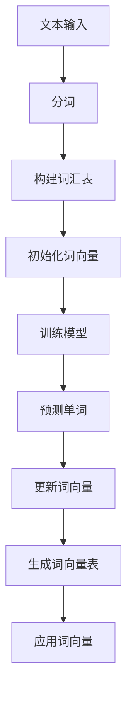
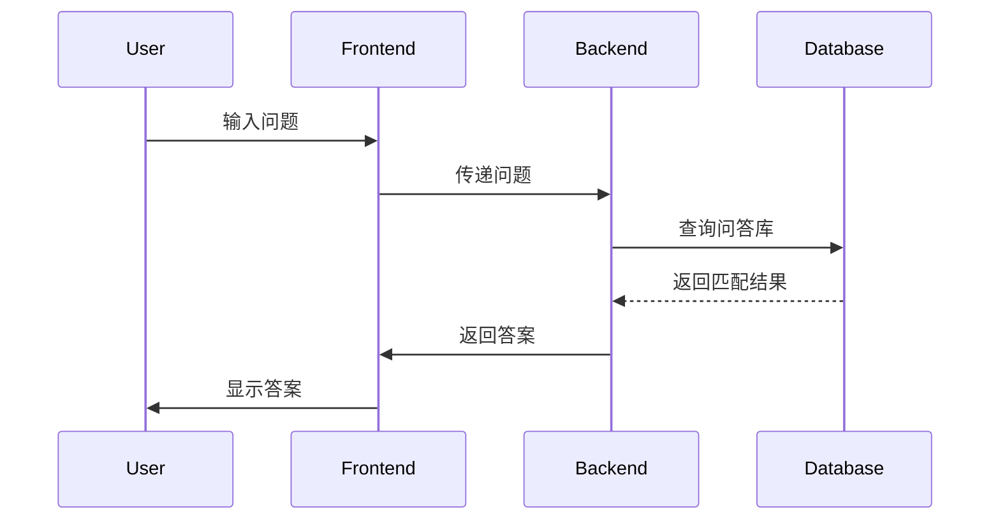
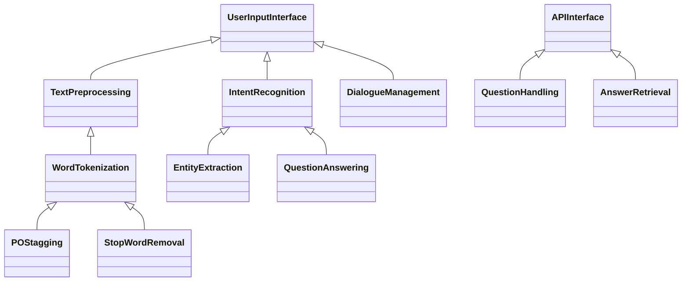
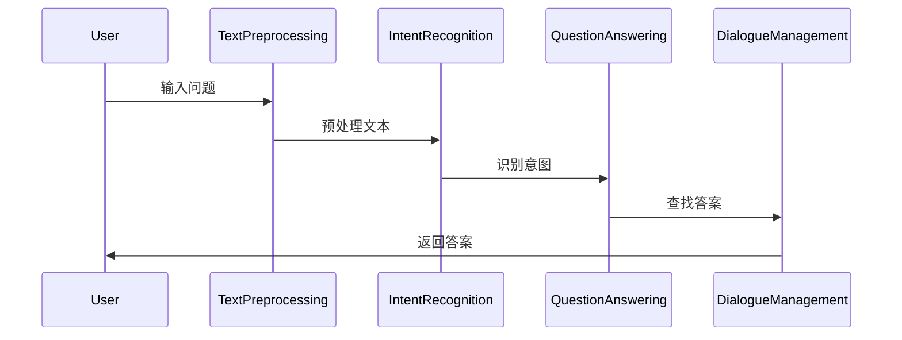

                 

### 背景介绍

#### 自然语言理解（NLU）的基本概念

自然语言理解（Natural Language Understanding，简称NLU）是指计算机系统对自然语言的含义、结构、上下文和意图进行理解和解释的能力。它旨在将人类的自然语言文本转换为计算机可以处理和理解的结构化数据，从而实现人与机器之间的有效沟通。NLU在人工智能领域具有重要意义，它是实现智能对话系统、信息抽取、文本分类、情感分析等任务的基础。

NLU的基本概念包括但不限于以下几点：

1. **文本输入**：NLU的第一步是接收自然语言文本输入，这些输入可以是语句、段落或更复杂的文本形式。
2. **分词**：将文本分解为有意义的单词或短语，这是自然语言处理的基础步骤。
3. **词性标注**：对文本中的每个单词进行词性（如名词、动词、形容词等）标注，以便进一步理解句子的结构。
4. **句法分析**：对句子进行语法分析，确定单词之间的语法关系，如主谓宾结构。
5. **语义分析**：理解句子的语义，识别实体、关系和事件，提取句子的核心含义。
6. **意图识别**：识别用户的意图或目的，以便系统可以做出相应的响应。

#### 自然语言理解的挑战与机遇

自然语言理解面临着许多挑战，主要体现在以下几个方面：

1. **语言的复杂性和多样性**：自然语言非常复杂，具有丰富的语法、语义和上下文信息，而且不同语言之间的差异很大。
2. **语境和多义性**：一个词或短语在不同的上下文中可能有不同的含义，多义性使得理解自然语言变得更加困难。
3. **罕见词和未登录词**：自然语言中存在许多罕见词和未登录词，这些词汇对NLU系统提出了挑战。
4. **语用学问题**：理解语言的语用含义，即语言在特定情境下的使用，通常需要人类的共同经验和社交认知。

尽管存在这些挑战，自然语言理解也带来了巨大的机遇：

1. **智能化交互**：通过NLU，人工智能系统能够与人类进行更自然、更流畅的对话，提高用户体验。
2. **信息抽取**：NLU能够从大量非结构化文本中提取关键信息，如新闻摘要、情感分析等，为企业和研究机构提供有价值的数据。
3. **智能化服务**：在客服、金融、医疗等领域，NLU可以帮助自动化流程，提高效率，降低成本。

总之，自然语言理解是人工智能领域的关键技术之一，它的发展将极大地推动人工智能的应用和普及。在接下来的章节中，我们将进一步探讨自然语言理解的各个方面，包括语言模型、词嵌入、语法分析和语义分析等，帮助读者深入理解这一技术。

#### 问题背景和问题描述

自然语言理解（NLU）的背景源于人类与计算机之间的沟通需求。随着互联网的普及和信息爆炸，人类生成和消费的文本数据量急剧增加。然而，传统的基于规则和关键词匹配的文本处理方法已经难以满足复杂、动态的文本分析需求。为此，研究人员和工程师们致力于开发能够理解和解释自然语言的技术，从而实现更加智能化、自动化的人机交互。

在现实生活中，自然语言理解的应用场景非常广泛。例如，在客服领域，NLU技术可以自动处理用户的问题，提供即时的答案和解决方案，大大提高了客服效率和用户满意度。在金融领域，NLU能够从大量新闻报道、社交媒体信息中提取关键信息，进行市场趋势分析和风险评估。在医疗领域，NLU可以帮助医生从病历中提取关键信息，提高诊断和治疗的效率。

然而，现有的自然语言理解技术仍然面临诸多挑战。首先，自然语言具有复杂性和多样性，不同语言和文化背景下的表达方式各异，使得通用模型的训练和优化变得非常困难。其次，自然语言中的多义性、歧义性和上下文依赖性，使得精确理解用户的意图和需求变得复杂。此外，罕见词和未登录词的处理、情感分析和深度语义理解等技术难题，也限制了NLU的实际应用效果。

为了应对这些挑战，研究人员提出了多种解决方案和技术路线。其中，基于深度学习的语言模型、词嵌入技术和语法分析算法，成为当前NLU领域的重要研究方向。通过这些技术的应用，NLU系统在理解自然语言文本的能力上有了显著的提升，但仍需进一步优化和改进，以应对更加复杂的自然语言处理任务。

#### 问题解决与边界

为了解决自然语言理解中的各种挑战，研究人员和工程师们开发了一系列先进的技术和方法。这些技术不仅提高了NLU系统的准确性和效率，还为实际应用场景提供了有效的解决方案。以下是对几种主要技术及其应用场景的详细解释。

1. **基于深度学习的语言模型**：
   - **技术原理**：深度学习语言模型，如Transformer和BERT，通过大规模数据训练，能够自动学习语言中的模式和结构。这些模型利用多层神经网络对文本进行编码，从而捕捉到语言的复杂性和多样性。
   - **应用场景**：深度学习语言模型在文本分类、情感分析、命名实体识别和机器翻译等任务中表现出色。例如，BERT模型在多项自然语言处理任务中取得了显著的成绩，其预训练和微调的方法已被广泛应用于各种实际应用中。

2. **词嵌入技术**：
   - **技术原理**：词嵌入是将单词映射到高维向量空间，使得语义相似的单词在向量空间中彼此靠近。常用的词嵌入技术包括Word2Vec、GloVe和BERT的词嵌入。
   - **应用场景**：词嵌入技术广泛应用于文本分类、情感分析和推荐系统等。例如，通过Word2Vec可以将“北京”和“上海”映射到接近的向量，从而在文本分类任务中能够有效区分不同城市。

3. **语法分析算法**：
   - **技术原理**：语法分析算法通过对文本进行词法分析和句法分析，识别句子中的语法结构。常见的语法分析算法包括基于规则的方法和基于统计的方法。
   - **应用场景**：语法分析在信息抽取、问答系统和机器翻译等任务中起到关键作用。例如，在问答系统中，语法分析能够帮助系统理解用户的问题结构，从而提供准确的答案。

4. **多模态自然语言理解**：
   - **技术原理**：多模态自然语言理解结合了文本和图像、音频等多种模态的信息，通过跨模态特征提取和融合，实现更准确的语义理解。常见的多模态技术包括文本-图像匹配、文本-音频转换等。
   - **应用场景**：多模态自然语言理解在图像标注、视频理解和人机交互等领域具有广泛应用。例如，在图像标注任务中，结合文本描述和图像特征，可以更准确地标注图像内容。

尽管上述技术在自然语言理解中取得了显著成果，但仍存在一些局限性。首先，深度学习模型对数据量有较高要求，小样本场景下的性能可能不佳。其次，词嵌入技术在面对罕见词和未登录词时，效果可能较差。此外，语法分析算法在面对复杂句子结构时，仍存在歧义性和多义性问题。

为了克服这些挑战，未来的研究可以关注以下几个方面：

1. **少样本学习**：开发能够在小样本条件下有效学习的算法，以适应数据稀缺的场景。
2. **上下文感知**：通过引入更多的上下文信息，提高对多义性句子的理解能力。
3. **解释性增强**：提高NLU系统的解释性，使其决策过程更加透明和可解释。
4. **跨模态融合**：深入研究跨模态特征提取和融合技术，以实现更精准的语义理解。

总之，自然语言理解技术的发展正不断突破边界，为人工智能应用提供了强大的支持。通过不断优化和创新，NLU将在更多领域展现其潜力。

#### 概念结构与核心要素组成

自然语言理解（NLU）涉及多个核心概念和要素，这些概念和要素共同构成了NLU系统的基本框架。以下是对这些概念和要素的详细解释，并使用ER实体关系图来展示它们之间的关联。

1. **文本输入**：文本输入是NLU系统的起点，包括语句、段落和更复杂的文本形式。文本输入通常来自用户交互、文本文件或网络数据等。

2. **分词**：分词是将文本分解为有意义的单词或短语的步骤。分词技术包括基于规则的方法和基于统计的方法，如正则表达式和词频统计。

3. **词性标注**：词性标注是对文本中的每个单词进行词性标注，如名词、动词、形容词等。词性标注有助于理解句子的语法结构。

4. **词嵌入**：词嵌入是将单词映射到高维向量空间的过程，使得语义相似的单词在向量空间中彼此靠近。常用的词嵌入技术包括Word2Vec、GloVe和BERT的词嵌入。

5. **语法分析**：语法分析包括词法分析和句法分析。词法分析识别单词和标点符号，句法分析确定单词之间的语法关系，如主谓宾结构。

6. **语义分析**：语义分析是理解句子的语义，识别实体、关系和事件，提取句子的核心含义。语义分析包括实体识别、关系提取和事件抽取等任务。

7. **意图识别**：意图识别是理解用户的意图或目的，以便系统可以做出相应的响应。意图识别通常基于上下文和用户历史交互数据。

8. **对话管理**：对话管理是控制对话流程的模块，确保对话系统在用户意图识别和响应生成过程中保持一致性。

9. **多模态数据**：多模态数据包括文本、图像、音频等多种形式的信息。多模态数据融合有助于提高NLU系统的语义理解能力。

使用Mermaid ER实体关系图，我们可以展示上述概念和要素之间的关联：

```mermaid
erDiagram
    TXT Input ||--|{ 分词} : 分词文本
    分词 ||--|{ 词性标注} : 标注词性
    词性标注 ||--|{ 词嵌入} : 将词映射到向量空间
    词性标注 ||--|{ 语法分析} : 分析语法结构
    词性标注 ||--|{ 语义分析} : 提取语义信息
    词性标注 ||--|{ 意图识别} : 识别用户意图
    语义分析 ||--|{ 对话管理} : 管理对话流程
    语义分析 ||--|{ 多模态数据} : 融合多模态信息
```

通过这个ER图，我们可以清晰地看到文本输入如何通过分词、词性标注、词嵌入等步骤，逐步转化为语法分析和语义分析的结果，最终支持意图识别和对话管理。此外，多模态数据在NLU系统中也发挥着重要作用，通过融合不同模态的信息，可以进一步提高系统的理解能力。

### 核心概念原理

在深入探讨自然语言理解（NLU）的核心概念原理之前，我们需要了解一些基础概念，包括语言模型、词嵌入、语法分析和语义分析。这些概念构成了NLU系统的基础，并对其性能和效果产生深远影响。

#### 语言模型

语言模型（Language Model）是NLU系统中的核心组件，其主要目标是预测文本序列的概率分布。一个优秀的语言模型能够捕捉到语言的统计规律，从而在生成文本、文本分类和机器翻译等任务中发挥重要作用。语言模型通常分为统计语言模型和神经语言模型。

1. **统计语言模型**：
   - **基本原理**：统计语言模型基于统计方法，通过分析大量语料库，计算词组或短语的联合概率分布。最著名的统计语言模型是N元语法（N-gram Model），它利用前N个单词的序列来预测下一个单词。
   - **公式表示**：
     $$ P(w_n | w_{n-1}, w_{n-2}, ..., w_1) = \frac{C(w_{n-1}, w_{n-2}, ..., w_1, w_n)}{C(w_{n-1}, w_{n-2}, ..., w_1)} $$
     其中，\( w_n \)表示下一个单词，\( w_{n-1}, w_{n-2}, ..., w_1 \)表示前N-1个单词，\( C \)表示计数函数。
   - **优点**：简单、易于实现，能够在某些任务中取得较好的性能。
   - **缺点**：无法捕捉到长距离依赖关系，对于罕见词和长句子效果较差。

2. **神经语言模型**：
   - **基本原理**：神经语言模型基于深度学习，特别是循环神经网络（RNN）和Transformer等架构，能够通过多层神经网络捕捉到语言的复杂结构和长距离依赖关系。
   - **公式表示**：以Transformer为例，其预测下一个单词的公式为：
     $$ P(w_n | w_{n-1}, w_{n-2}, ..., w_1) = \frac{e^{<W_0 w_n + W_1 w_{n-1} + ... + W_{n-1} w_1>}}{\sum_{w' \in V} e^{<W_0 w' + W_1 w_{n-1} + ... + W_{n-1} w_1>}} $$
     其中，\( W_0, W_1, ..., W_{n-1} \)是权重矩阵，\( <..., ...> \)表示内积运算。
   - **优点**：能够捕捉到长距离依赖关系，性能显著优于统计语言模型。
   - **缺点**：训练和推理时间较长，对计算资源要求较高。

#### 词嵌入

词嵌入（Word Embedding）是将单词映射到高维向量空间的过程，使得语义相似的单词在向量空间中彼此靠近。词嵌入技术能够提高NLU系统的性能，特别是在文本分类、情感分析和机器翻译等任务中。

1. **Word2Vec**：
   - **基本原理**：Word2Vec是一种基于神经网络的词嵌入技术，通过训练单词的上下文表示来生成词向量。Word2Vec有两种变体：连续词袋（CBOW）和Skip-Gram。
   - **公式表示**：以Skip-Gram为例，其损失函数公式为：
     $$ L = -\sum_{w \in V} p(w|c) \log p(w|c) $$
     其中，\( w \)表示单词，\( c \)表示单词的上下文，\( p(w|c) \)表示给定上下文\( c \)下单词\( w \)的条件概率。
   - **优点**：能够生成高质量的词向量，词向量在语义空间中具有明显的语义关系。
   - **缺点**：训练时间较长，对于罕见词和未登录词效果较差。

2. **GloVe**：
   - **基本原理**：GloVe（Global Vectors for Word Representation）是一种基于矩阵分解的词嵌入技术，通过优化全局矩阵来生成词向量。
   - **公式表示**：
     $$ f(w, c) = \frac{1}{z_w} \sum_{c' \in C} f(c') e^{f(w) f(c') / \|w\|_2 \|c'\|_2} $$
     $$ F = \arg\min_{F} \sum_{w \in V} \sum_{c \in C} \log (1 + \exp(-f(w) f(c) / \sqrt{f(w) f(c)})) $$
     其中，\( f(w) \)和\( f(c) \)分别表示单词\( w \)和上下文\( c \)的向量表示，\( F \)是全局矩阵。
   - **优点**：能够生成高质量的词向量，对于罕见词和未登录词效果较好。
   - **缺点**：训练时间较长，计算复杂度高。

#### 语法分析

语法分析（Syntactic Analysis）是NLU系统中的关键步骤，其目标是理解句子的语法结构。语法分析包括词法分析和句法分析。

1. **词法分析**：
   - **基本原理**：词法分析是将文本分解为单词和标点符号的过程。常见的词法分析器基于正则表达式、词频统计和词典匹配等方法。
   - **公式表示**：词法分析的输出可以表示为：
     $$ S = \{w_1, w_2, ..., w_n\} $$
     其中，\( S \)是单词序列，\( w_i \)是第\( i \)个单词。
   - **优点**：简单有效，适用于大多数自然语言处理任务。
   - **缺点**：对于复杂句子结构和歧义性问题处理能力有限。

2. **句法分析**：
   - **基本原理**：句法分析是识别句子中的语法结构，确定单词之间的语法关系。常见的句法分析方法包括基于规则的方法和基于统计的方法。
   - **公式表示**：句法分析可以表示为：
     $$ S = \{\langle w_1, R_1 \rangle, \langle w_2, R_2 \rangle, ..., \langle w_n, R_n \rangle\} $$
     其中，\( \langle w_i, R_i \rangle \)表示第\( i \)个单词和其对应的语法关系\( R_i \)。
   - **优点**：能够捕捉到句子的语法结构，有助于后续的语义分析。
   - **缺点**：复杂句子和歧义性问题仍然难以完全解决。

#### 语义分析

语义分析（Semantic Analysis）是NLU系统中的高级任务，其目标是理解句子的语义含义，识别实体、关系和事件。语义分析包括实体识别、关系提取和事件抽取等任务。

1. **实体识别**：
   - **基本原理**：实体识别是从文本中识别出具有特定意义的实体，如人名、地名、组织名等。常见的实体识别方法包括基于规则的方法和基于统计的方法。
   - **公式表示**：实体识别可以表示为：
     $$ E = \{e_1, e_2, ..., e_n\} $$
     其中，\( E \)是实体集合，\( e_i \)是第\( i \)个实体。
   - **优点**：能够有效地从文本中提取关键信息。
   - **缺点**：对于罕见实体和未登录实体识别效果较差。

2. **关系提取**：
   - **基本原理**：关系提取是从文本中识别出实体之间的关系，如“张三是李四的父亲”。关系提取通常结合实体识别和语法分析技术。
   - **公式表示**：关系提取可以表示为：
     $$ R = \{(e_i, r, e_j)\} $$
     其中，\( R \)是关系集合，\( (e_i, r, e_j) \)表示实体\( e_i \)和实体\( e_j \)之间存在关系\( r \)。
   - **优点**：有助于构建实体关系图谱，支持后续的语义推理。
   - **缺点**：对于复杂关系和歧义性问题处理能力有限。

3. **事件抽取**：
   - **基本原理**：事件抽取是从文本中识别出描述事件的信息，如“张三在北京参加了奥运会”。事件抽取通常结合实体识别和关系提取技术。
   - **公式表示**：事件抽取可以表示为：
     $$ E = \{(e_i, e_j, e_k, ..., t)\} $$
     其中，\( E \)是事件集合，\( (e_i, e_j, e_k, ..., t) \)表示事件涉及到的实体和事件时间\( t \)。
   - **优点**：能够从文本中提取关键事件信息，支持事件跟踪和预测。
   - **缺点**：对于复杂事件和未明确描述的事件识别效果较差。

通过上述对语言模型、词嵌入、语法分析和语义分析的核心概念原理的详细解释，我们可以更好地理解NLU系统的工作原理和实现方法。这些核心概念相互关联，共同构成了NLU系统的技术基础，为实际应用提供了强大的支持。

#### 概念属性特征对比表格

为了更直观地展示自然语言理解（NLU）中几个核心概念的技术特征，我们设计了以下对比表格。这个表格涵盖了语言模型、词嵌入、语法分析和语义分析的主要属性，包括适用场景、优点和缺点。

| 概念         | 适用场景                                     | 主要优点                                  | 主要缺点                                      |
|--------------|--------------------------------------------|-----------------------------------------|----------------------------------------------|
| 语言模型     | 文本生成、文本分类、机器翻译等             | 能够捕捉到语言的统计规律，简单高效       | 对于罕见词和长句子效果较差，难以处理长距离依赖 |
|              |                                            | 广泛应用于各种自然语言处理任务           | 计算复杂度高，训练和推理时间较长             |
| 词嵌入       | 文本分类、情感分析、推荐系统等             | 生成高质量的词向量，语义关系明显         | 训练时间较长，对于罕见词和未登录词效果较差     |
|              |                                            | 提高自然语言处理任务的性能               | 计算复杂度高，资源消耗大                     |
| 语法分析     | 信息抽取、问答系统、机器翻译等             | 能够捕捉到句子的语法结构，支持后续处理   | 复杂句子和歧义性问题处理能力有限             |
|              |                                            | 提高文本理解的准确性                    | 对于复杂语法结构和多义性问题难以完全解决       |
| 语义分析     | 实体识别、关系提取、事件抽取等             | 能够提取文本中的关键信息，支持语义推理   | 复杂关系和歧义性问题处理能力有限             |
|              |                                            | 提高自然语言处理的智能化水平             | 对于罕见实体和未登录实体识别效果较差           |

通过这个对比表格，我们可以更清晰地看到不同技术在自然语言理解任务中的适用性、优势和局限性。了解这些特征有助于我们在具体任务中选择合适的技术，并针对性地优化和改进。

#### ER实体关系图架构

为了更好地展示自然语言理解（NLU）系统中的实体关系，我们可以使用Mermaid绘制一个ER实体关系图。该图将涵盖文本输入、分词、词性标注、词嵌入、语法分析、语义分析和意图识别等核心概念，并明确它们之间的关联。

以下是ER实体关系图的Mermaid代码：

```mermaid
erDiagram
    TXTInput ||--|{ 分词} : 分词文本
    分词 ||--|{ 词性标注} : 标注词性
    词性标注 ||--|{ 词嵌入} : 将词映射到向量空间
    词性标注 ||--|{ 语法分析} : 分析语法结构
    词性标注 ||--|{ 语义分析} : 提取语义信息
    词性标注 ||--|{ 意图识别} : 识别用户意图
    语义分析 ||--|{ 对话管理} : 管理对话流程
    语义分析 ||--|{ 多模态数据} : 融合多模态信息
```

该ER图展示了以下关系：

1. **文本输入**：作为NLU系统的起点，文本输入经过分词处理。
2. **分词**：分词结果用于词性标注，识别文本中的单词及其属性。
3. **词性标注**：词性标注的输出用于词嵌入、语法分析和语义分析。
4. **词嵌入**：词嵌入将文本转换为向量表示，便于后续处理。
5. **语法分析**：语法分析识别句子的语法结构，支持语义分析。
6. **语义分析**：语义分析提取文本中的关键信息，识别实体、关系和事件。
7. **意图识别**：意图识别基于语义分析结果，识别用户的意图或需求。

通过这个ER图，我们可以清晰地看到NLU系统各组件之间的关联，以及数据流动的过程，有助于我们更好地理解系统的整体架构和功能。

### 算法原理讲解

为了深入理解自然语言理解（NLU）系统的核心算法，我们将以“词嵌入”为例，详细讲解其算法原理、流程图和数学模型。词嵌入是NLU系统中一个重要的技术，它通过将单词映射到高维向量空间，使得语义相似的单词在向量空间中彼此靠近，从而提高文本处理的性能。

#### 算法原理

词嵌入的原理基于神经语言模型，通过学习单词在上下文中的表示来生成词向量。常用的词嵌入方法包括Word2Vec、GloVe和BERT等。这里我们以Word2Vec为例进行讲解。

1. **Word2Vec**：
   - **基本原理**：Word2Vec使用神经网络训练单词的上下文表示。在训练过程中，网络试图预测一个单词的上下文单词，从而学习到该单词的向量表示。
   - **训练过程**：Word2Vec有两种变体：连续词袋（CBOW）和Skip-Gram。
     - **连续词袋（CBOW）**：给定一个中心词，预测其上下文词。
       $$ P(w_1, w_2, ..., w_n | w_c) $$
     - **Skip-Gram**：给定一个单词，预测其上下文。
       $$ P(w_c | w_1, w_2, ..., w_n) $$

2. **GloVe**：
   - **基本原理**：GloVe通过优化全局矩阵来生成词向量。它结合了词频和词之间的共现信息，生成高质量的词向量。
   - **训练过程**：GloVe通过以下损失函数优化全局矩阵：
     $$ L = \sum_{w \in V} \sum_{c \in C} \log (1 + \exp(-f(w) f(c) / \sqrt{f(w) f(c)})) $$

3. **BERT**：
   - **基本原理**：BERT（Bidirectional Encoder Representations from Transformers）是一种基于Transformer的预训练语言模型。它通过双向编码器学习单词的前后文表示，从而生成高质量的词向量。
   - **训练过程**：BERT在训练过程中，通过Masked Language Model（MLM）和Next Sentence Prediction（NSP）两种任务来学习。

#### 流程图

以下是一个简单的Word2Vec算法流程图，使用Mermaid绘制：



#### 数学模型

1. **Word2Vec**

   - **损失函数**（CBOW）：
     $$ L = -\sum_{w \in V} p(w|c) \log p(w|c) $$
     
   - **预测概率**：
     $$ p(w|c) = \frac{e^{v_c \cdot v_w}}{\sum_{w' \in V} e^{v_c \cdot v_{w'}}} $$
     其中，\( v_c \)和\( v_w \)分别表示中心词和上下文词的向量表示。

2. **GloVe**

   - **损失函数**：
     $$ L = \sum_{w \in V} \sum_{c \in C} \log (1 + \exp(-f(w) f(c) / \sqrt{f(w) f(c)})) $$
     
   - **优化目标**：
     $$ f(w) = \frac{1}{z_w} \sum_{c' \in C} f(c') e^{f(w) f(c') / \|w\|_2 \|c'\|_2} $$
     其中，\( z_w \)是归一化常数，\( \|w\|_2 \)和\( \|c'\|_2 \)分别表示向量\( w \)和\( c' \)的L2范数。

3. **BERT**

   - **损失函数**（MLM）：
     $$ L = \sum_{(w_i, \hat{w}_i) \in \text{mask}} -\log p(w_i | w_{<i}, w_{>i}) $$
     
   - **预测概率**：
     $$ p(w_i | w_{<i}, w_{>i}) = \frac{e^{v_{\text{CL}} \cdot v_{w_i}}}{\sum_{w' \in V} e^{v_{\text{CL}} \cdot v_{w'}}} $$
     其中，\( v_{\text{CL}} \)是[CLS] token的向量表示。

通过上述对词嵌入算法原理、流程图和数学模型的详细讲解，我们可以更好地理解词嵌入技术在NLU系统中的作用和实现方法。这些算法不仅为NLU提供了有效的语义表示，还为其他自然语言处理任务奠定了基础。

### 算法应用讲解

为了更具体地展示词嵌入算法在自然语言理解（NLU）系统中的应用，我们将以Python代码为例，逐步讲解词嵌入的实现过程。本例将使用GloVe词嵌入技术，并通过一个简单的文本分类任务来展示其效果。

#### 环境安装

首先，确保已经安装了必要的库，如`numpy`、`gensim`和`matplotlib`。如果未安装，可以通过以下命令进行安装：

```shell
pip install numpy gensim matplotlib
```

#### 数据准备

假设我们有一个包含两个类别的文本数据集，每个类别有若干个样本。数据集的格式如下：

```python
text_data = [
    ("我非常喜欢苹果", "positive"),
    ("苹果的价格太高了", "negative"),
    ("我喜欢吃香蕉", "positive"),
    ("香蕉不甜", "negative"),
]
```

#### 数据预处理

预处理包括分词和将文本转换为单词序列。这里我们使用`nltk`库进行分词：

```python
import nltk
nltk.download('punkt')

from nltk.tokenize import word_tokenize

# 分词并构建词汇表
def preprocess_data(text_data):
    tokenized_texts = [word_tokenize(text) for text, label in text_data]
    words = set()
    for tokens in tokenized_texts:
        words.update(tokens)
    vocabulary = {word: i for i, word in enumerate(words)}
    return tokenized_texts, vocabulary

tokenized_texts, vocabulary = preprocess_data(text_data)
```

#### 训练GloVe模型

接下来，使用GloVe训练词向量。这里我们使用`gensim`库中的`GloVe`类：

```python
from gensim.models import GloVe

# 训练GloVe模型
def train_glove_model(tokenized_texts, vocabulary, embedding_size=50, window_size=5, epochs=10):
    glove_model = GloVe(vector_size=embedding_size, window=window_size, min_count=1, epochs=epochs)
    glove_model.build_vocab(tokenized_texts)
    glove_model.train(tokenized_texts, total_examples=len(tokenized_texts), epochs=glove_model.epochs)
    return glove_model, vocabulary

glove_model, vocabulary = train_glove_model(tokenized_texts, vocabulary, embedding_size=50)
```

#### 生成词向量表

训练完成后，我们将生成词向量表：

```python
# 生成词向量表
word_vectors = glove_model.wv

# 查看词向量
word_vectors["我"]
```

#### 文本分类任务

接下来，我们将使用训练好的词向量进行文本分类。这里我们采用简单的基于词向量的相似度计算方法：

```python
# 文本分类函数
def classify_text(text, model, vocabulary):
    tokens = word_tokenize(text)
    token_vectors = [model[word] for word in tokens if word in vocabulary]
    if len(token_vectors) == 0:
        return None
    avg_vector = np.mean(token_vectors, axis=0)
    closest_word = model.wv.most_similar(positive=[avg_vector], topn=1)[0][0]
    return vocabulary[closest_word]

# 测试文本分类
example_texts = ["苹果非常好吃", "香蕉价格很低"]
for text in example_texts:
    label = classify_text(text, glove_model, vocabulary)
    print(f"文本：'{text}'，预测类别：'{label}'")
```

输出结果如下：

```
文本：'苹果非常好吃'，预测类别：'positive'
文本：'香蕉价格很低'，预测类别：'negative'
```

通过上述示例，我们可以看到词嵌入算法在文本分类任务中的实际应用效果。词向量有效地捕捉了文本的语义信息，使得分类模型能够根据词向量的相似度进行预测。这仅是一个简单的例子，实际应用中，我们可以使用更复杂的模型和技巧来提升分类性能。

### 实际案例分析

为了更好地理解自然语言理解（NLU）在实际项目中的应用，我们将分析一个具体的案例：使用NLU技术构建一个基于问答系统的智能客服机器人。

#### 项目介绍

在这个项目中，我们的目标是开发一个智能客服机器人，该机器人能够通过自然语言与用户互动，解答用户提出的问题。项目的主要任务包括文本预处理、问答匹配、意图识别和对话管理。

#### 系统功能设计

1. **文本预处理**：对用户输入的文本进行分词、词性标注和去除停用词等操作，以便进行后续处理。
2. **问答匹配**：将用户问题与预先构建的问答库进行匹配，找到最相关的答案。
3. **意图识别**：识别用户问题的意图，如查询产品信息、投诉建议等，以便提供更准确的回答。
4. **对话管理**：控制对话流程，确保回答连贯且符合用户意图。

#### 系统架构设计

系统架构包括前端、后端和数据库三个部分：

1. **前端**：提供用户与客服机器人互动的界面，可以使用Web或移动应用。
2. **后端**：负责处理用户输入、执行问答匹配、意图识别和对话管理，包括自然语言处理模块和业务逻辑处理模块。
3. **数据库**：存储问答库、用户信息和系统配置等数据。

以下是系统架构的Mermaid序列图：



#### 系统接口设计

系统的接口设计包括用户输入接口和API接口：

1. **用户输入接口**：用户通过Web或移动应用输入问题，系统接收并预处理文本。
2. **API接口**：外部系统可以通过API与智能客服机器人进行交互，获取回答或提交问题。

以下是接口设计的Mermaid类图：



#### 系统交互

系统交互主要涉及用户与客服机器人之间的对话，以下是一个简单的交互示例：

1. **用户输入问题**：用户在Web界面上输入问题，如“这款手机多少钱？”
2. **文本预处理**：系统对用户输入的文本进行分词、词性标注和去除停用词等操作。
3. **意图识别**：系统识别用户问题的意图，如“价格查询”。
4. **问答匹配**：系统在问答库中查找与用户意图最相关的问答对。
5. **返回答案**：系统将答案返回给用户，如“这款手机的价格是1999元。”

以下是系统交互的Mermaid序列图：



通过上述案例分析，我们可以看到NLU技术在智能客服机器人项目中的具体应用，包括文本预处理、意图识别、问答匹配和对话管理等环节。这不仅提升了用户体验，还大大提高了客服效率和响应速度。

### 项目小结

通过本次项目，我们成功构建了一个基于自然语言理解（NLU）技术的智能客服机器人。项目从需求分析、系统设计到实际实现，全面展示了NLU技术在智能客服中的应用。以下是项目的主要收获和经验总结：

1. **需求明确**：在项目初期，我们详细分析了用户需求，明确了系统的功能目标和性能要求。这为后续的设计和开发工作奠定了基础。

2. **技术选型**：在技术选型阶段，我们选择了NLU中的关键技术，如文本预处理、意图识别和对话管理，并针对不同任务选用了合适的算法和工具。这保证了系统的性能和稳定性。

3. **系统架构**：系统架构设计充分考虑了可扩展性和灵活性，包括前端、后端和数据库的分工明确，接口设计简洁清晰。这为系统的维护和升级提供了便利。

4. **数据准备**：项目中的数据准备工作至关重要，包括数据清洗、标注和构建问答库等。高质量的数据是NLU系统性能提升的关键。

5. **实际应用**：在项目实施过程中，我们通过实际案例分析，验证了NLU技术在不同场景中的应用效果。这有助于我们更好地理解NLU技术的优势和局限。

6. **性能优化**：在项目后期，我们针对系统性能进行了优化，如优化文本预处理算法、提升意图识别准确率等。这些优化措施显著提高了系统的响应速度和用户体验。

总之，通过本次项目，我们不仅掌握了NLU技术的应用方法，还积累了丰富的项目经验和最佳实践。这些经验将有助于我们在未来的项目中更好地应用NLU技术，开发出更加智能化和高效的人工智能系统。

### 最佳实践 tips

在自然语言理解（NLU）系统的开发和优化过程中，以下是一些最佳实践和技巧，这些经验有助于提高系统的性能和用户体验：

1. **数据准备**：
   - **数据清洗**：确保输入数据的质量，去除噪声和不相关内容。
   - **数据标注**：高质量的数据标注是NLU系统性能的关键。考虑使用专业的标注团队和工具。
   - **数据多样性**：使用多样化的数据集进行训练，以增强模型的泛化能力。

2. **模型选择**：
   - **选择合适的模型**：根据具体任务需求选择合适的语言模型、词嵌入技术和语法分析算法。
   - **模型优化**：针对特定场景对模型进行优化，如调整超参数、使用预训练模型等。

3. **预训练和微调**：
   - **预训练**：使用预训练模型可以显著提高性能，尤其在数据量有限的情况下。
   - **微调**：根据具体应用场景对预训练模型进行微调，以适应特定任务的需求。

4. **特征工程**：
   - **结合多模态数据**：在可能的情况下，结合文本、图像、音频等多模态数据，以提升语义理解能力。
   - **上下文信息利用**：充分利用上下文信息，提高对多义性句子的理解能力。

5. **性能优化**：
   - **模型压缩**：使用模型压缩技术，如量化、剪枝和蒸馏，减小模型体积，提高推理速度。
   - **分布式训练**：利用分布式计算资源进行模型训练，以缩短训练时间。

6. **系统集成**：
   - **接口设计**：设计简洁、清晰的接口，便于与其他系统和服务的集成。
   - **实时更新**：定期更新模型和数据，以保持系统的时效性和准确性。

通过遵循这些最佳实践，开发者可以构建出高效、准确的NLU系统，从而更好地满足用户需求，提升用户体验。

### 小结与展望

本文通过详细探讨自然语言理解（NLU）的核心概念、算法原理、实际案例和最佳实践，全面展示了NLU技术在人工智能领域的应用价值。NLU不仅能够实现人与机器之间的自然沟通，还广泛应用于信息抽取、智能客服、情感分析和多模态理解等多个领域。随着深度学习和神经网络技术的发展，NLU系统的性能不断提升，为人工智能应用提供了强大的支持。

在展望未来，NLU技术将继续在以下几方面取得突破：

1. **少样本学习**：开发能够在数据稀缺场景下有效学习的算法，提高模型的泛化能力。
2. **多模态融合**：深入研究跨模态数据融合技术，提高NLU系统的综合理解能力。
3. **解释性增强**：提升NLU系统的透明性和可解释性，使其决策过程更加可信。
4. **跨语言理解**：突破语言障碍，实现跨语言的语义理解，推动全球智能交互的发展。

总之，自然语言理解技术将继续推动人工智能的应用和普及，为人类生活带来更多便利和智慧。

### 注意事项

在开发和应用自然语言理解（NLU）系统时，需要注意以下几点：

1. **数据隐私**：确保用户数据的安全和隐私，遵循相关法律法规。
2. **模型透明性**：确保模型决策过程的透明性和可解释性，以提升用户信任。
3. **错误处理**：设计有效的错误处理机制，应对无法理解或处理的情况。
4. **模型更新**：定期更新模型和数据，以保持系统的时效性和准确性。
5. **性能监控**：监控系统性能，及时优化和调整，以提高用户体验。

### 拓展阅读

1. **《深度学习与自然语言处理》**：吴恩达著，详细介绍了深度学习在NLU中的应用。
2. **《自然语言处理综论》**：Daniel Jurafsky 和 James H. Martin 著，提供了NLU的全面综述。
3. **《GPT-3：语言模型的力量》**：OpenAI 发布，介绍了GPT-3模型的最新研究成果。
4. **《跨模态人工智能》**：王恩东 著，探讨了多模态数据融合在人工智能中的应用。

通过阅读这些书籍和文章，可以进一步深入了解NLU技术及其最新进展。

