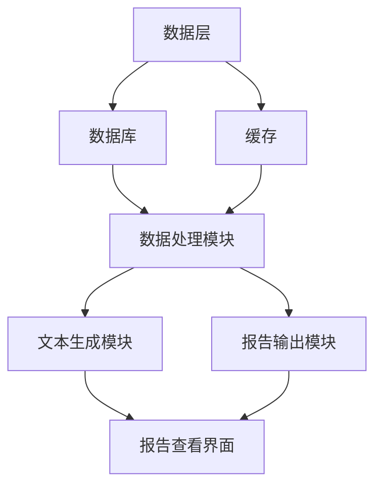
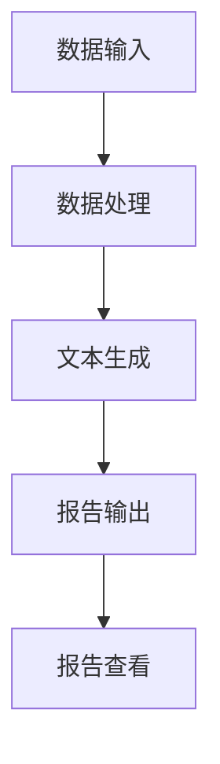

                 

**目录大纲**

```markdown
# 《自然语言生成技术在财务报告中的应用》

## 关键词
自然语言生成，财务报告，算法原理，数学模型，系统架构，项目实战

## 摘要
本文将深入探讨自然语言生成（NLG）技术在财务报告中的应用。文章首先介绍了NLG技术的基本概念和发展历程，然后详细阐述了其在财务报告中的重要性。接下来，文章逐步讲解了相关算法原理和数学模型，并通过具体案例展示了系统分析与架构设计方案。文章还通过一个实际项目实战，详细解读了系统核心实现源代码，并分析了项目实施中的关键点和最佳实践。最后，文章总结了文章的核心内容，并给出了注意事项和拓展阅读建议。

---

**第一部分：自然语言生成技术概述**

## 1.1 自然语言生成技术背景

### 1.1.1 自然语言生成技术的发展历程

### 1.1.2 自然语言生成技术在财务报告中的重要性

### 1.1.3 财务报告的自然语言生成技术挑战

## 1.2 核心概念与联系

### 1.2.1 自然语言处理（NLP）与自然语言生成（NLG）的关系

### 1.2.2 关键技术：文本生成模型、统计模型、深度学习模型

### 1.2.3 NLG在财务报告中的应用场景

## 1.3 算法原理讲解

### 1.3.1 基于规则的方法

### 1.3.2 基于模板的方法

### 1.3.3 基于统计模型的方法

### 1.3.4 基于深度学习的方法

## 1.4 数学模型和数学公式 & 详细讲解 & 举例说明

### 1.4.1 语言模型的基本数学模型

### 1.4.2 序列到序列模型的数学模型

### 1.4.3 注意力机制的数学模型

### 1.4.4 深度学习模型的训练过程

## 1.5 系统分析与架构设计方案

### 1.5.1 财务报告生成系统总体架构

### 1.5.2 数据处理流程

### 1.5.3 系统功能模块设计

### 1.5.4 系统接口设计

## 1.6 项目实战

### 1.6.1 环境安装与配置

### 1.6.2 系统核心实现源代码解读

### 1.6.3 实际案例分析与详细讲解

### 1.6.4 项目小结

## 1.7 最佳实践 tips

### 1.7.1 数据质量对NLG效果的影响

### 1.7.2 如何处理复杂财务术语

### 1.7.3 NLG技术在不同财务报告类型的应用

## 1.8 小结

### 1.8.1 主要内容回顾

### 1.8.2 面临的挑战与未来展望

## 1.9 注意事项

### 1.9.1 技术实现的限制

### 1.9.2 数据隐私保护

### 1.9.3 系统维护与更新

## 1.10 拓展阅读

### 1.10.1 相关经典论文与书籍推荐

### 1.10.2 最新研究成果与行业动态
```

---

**接下来，我们将开始逐步撰写每个章节的具体内容。首先，我们将介绍自然语言生成技术的基本概念和背景，包括其发展历程、在财务报告中的重要性以及面临的挑战。**

---

**第一部分：自然语言生成技术概述**

### 1.1 自然语言生成技术背景

#### 1.1.1 自然语言生成技术的发展历程

自然语言生成（Natural Language Generation，NLG）技术是指利用计算机程序生成自然语言文本的技术。它起源于自然语言处理（Natural Language Processing，NLP）领域，旨在解决计算机与人类之间自然语言交流的问题。

早在20世纪50年代，人工智能领域的先驱们就开始研究如何让计算机理解并生成自然语言。早期的NLG技术主要基于规则和模板，通过编写大量的规则和模板来生成文本。这种方法在处理简单的文本生成任务时表现良好，但随着任务复杂度的增加，其局限性也逐渐显现。

到了20世纪80年代，统计方法开始应用于NLG领域。统计方法通过学习大量文本数据，从中提取出语言模式，从而生成新的文本。这种方法在处理大规模文本数据时表现更为出色，但也面临着数据质量和模型复杂度的问题。

随着深度学习技术的发展，基于深度学习的NLG方法逐渐崭露头角。深度学习模型通过学习大量的文本数据，能够自动提取出复杂的语言模式和语义信息，从而生成更为自然和准确的文本。近年来，深度学习在NLG领域的应用取得了显著的进展，推动了NLG技术的快速发展。

#### 1.1.2 自然语言生成技术在财务报告中的重要性

财务报告是企业管理层和投资者了解公司财务状况的重要工具。传统的财务报告往往以表格和文字的形式呈现，信息量大且复杂，容易导致读者理解困难。而自然语言生成技术可以将这些复杂的财务数据转化为易于理解的自然语言文本，提高报告的可读性和可理解性。

首先，自然语言生成技术可以帮助自动化生成财务报告中的常见文本内容，如财务摘要、经营分析等。这些文本内容的生成可以大大减少人工工作量，提高报告的生成效率。

其次，自然语言生成技术可以帮助财务报告更加准确地传达财务数据背后的含义。通过深度学习模型的学习和推理，自然语言生成技术能够理解财务数据中的潜在关系和趋势，从而生成更具解释性的文本内容。

此外，自然语言生成技术还可以帮助企业实现个性化的财务报告。根据不同用户的需求，自然语言生成技术可以定制化地生成报告内容，提供个性化的财务分析。

然而，自然语言生成技术在财务报告中的应用也面临着一些挑战。首先，财务报告中的术语和概念较为专业，如何准确地将这些术语和概念转化为自然语言文本是一个重要的研究问题。其次，财务报告中的数据量大且复杂，如何有效地处理和提取这些数据也是一个挑战。

#### 1.1.3 财务报告的自然语言生成技术挑战

财务报告的自然语言生成技术面临着以下挑战：

1. 数据质量：财务报告中的数据来源多样，数据质量参差不齐。自然语言生成技术需要高质量的数据来训练模型，否则生成文本的准确性会受到影响。

2. 术语和概念处理：财务报告中的术语和概念较为专业，如何准确地将这些术语和概念转化为自然语言文本是一个重要的研究问题。这需要建立一套完整的术语和概念库，并设计相应的转换规则。

3. 模型复杂度：深度学习模型具有较高的复杂度，如何有效地训练和优化这些模型是一个挑战。此外，模型训练和优化的时间成本也是一个需要考虑的问题。

4. 解释性：财务报告的生成需要具有解释性，即生成的文本需要能够清晰地传达财务数据背后的含义。深度学习模型在解释性方面存在一定的局限性，如何提高模型的解释性是一个重要的研究问题。

5. 可扩展性：自然语言生成技术需要能够适应不同的财务报告类型和需求，如何设计一个可扩展的系统架构是一个挑战。

在接下来的章节中，我们将进一步探讨自然语言生成技术中的核心概念和联系，详细讲解相关算法原理和数学模型，并分析系统架构设计方案和项目实战案例。希望这些内容能够帮助读者更好地理解和应用自然语言生成技术在财务报告中的应用。
---

**接下来，我们将介绍自然语言生成技术中的核心概念和联系，包括自然语言处理（NLP）与自然语言生成（NLG）的关系，关键技术的文本生成模型、统计模型、深度学习模型，以及NLG在财务报告中的应用场景。**

---

**第一部分：自然语言生成技术概述**

### 1.2 核心概念与联系

#### 1.2.1 自然语言处理（NLP）与自然语言生成（NLG）的关系

自然语言处理（NLP）和自然语言生成（NLG）是密切相关的两个领域。NLP旨在让计算机理解和处理人类语言，而NLG则旨在让计算机生成人类语言。

NLP的任务包括文本分类、实体识别、语义分析、机器翻译等。这些任务的核心是理解语言的语法、语义和上下文信息。NLP的成功为NLG提供了丰富的数据和算法支持。

NLG的任务则是根据输入数据生成人类可读的自然语言文本。NLG的关键技术包括文本生成模型、统计模型和深度学习模型。这些模型通过学习大量文本数据，能够自动生成新的文本。

NLP和NLG之间的关系可以用“输入-输出”关系来描述。NLP为NLG提供了输入数据，NLG则根据这些输入数据生成输出文本。这种输入-输出的关系使得NLP和NLG相互促进，共同发展。

#### 1.2.2 关键技术：文本生成模型、统计模型、深度学习模型

文本生成模型、统计模型和深度学习模型是NLG中的三种主要技术。

1. **文本生成模型**：文本生成模型是一种基于规则的方法，通过定义一系列规则来生成文本。这种方法适用于生成简单的文本，但在处理复杂文本时效果有限。

2. **统计模型**：统计模型通过分析大量文本数据，提取出语言模式，然后根据这些模式生成文本。这种方法在处理大规模文本数据时表现良好，但生成的文本往往缺乏灵活性和创意。

3. **深度学习模型**：深度学习模型通过学习大量文本数据，能够自动提取出复杂的语言模式和语义信息，从而生成更为自然和准确的文本。深度学习模型在NLG领域取得了显著进展，成为当前的主流技术。

#### 1.2.3 NLG在财务报告中的应用场景

NLG在财务报告中的应用场景主要包括以下几个方面：

1. **财务摘要生成**：自动生成财务报告中的财务摘要，如公司业绩概述、经营分析等。

2. **经营分析报告生成**：根据财务数据生成详细的经营分析报告，如利润分析、成本分析等。

3. **财务报表生成**：自动生成财务报表，如资产负债表、利润表、现金流量表等。

4. **财务预测报告生成**：根据历史财务数据生成财务预测报告，如盈利预测、现金流预测等。

5. **财务报告解读**：将复杂的财务报告内容转化为易于理解的自然语言文本，提高报告的可读性和可理解性。

#### 1.2.4 财务报告的自然语言生成技术挑战

虽然NLG技术在财务报告中的应用前景广阔，但也面临着一些挑战：

1. **数据质量**：财务报告中的数据来源多样，数据质量参差不齐。如何保证数据质量，是实施NLG技术的一个关键问题。

2. **术语和概念处理**：财务报告中的术语和概念较为专业，如何准确地将这些术语和概念转化为自然语言文本，是一个重要的研究问题。

3. **模型复杂度**：深度学习模型具有较高的复杂度，如何有效地训练和优化这些模型，是一个挑战。

4. **解释性**：财务报告的生成需要具有解释性，即生成的文本需要能够清晰地传达财务数据背后的含义。如何提高模型的解释性，是一个重要的研究问题。

5. **可扩展性**：自然语言生成技术需要能够适应不同的财务报告类型和需求，如何设计一个可扩展的系统架构，是一个挑战。

在接下来的章节中，我们将进一步探讨自然语言生成技术的算法原理和数学模型，以及如何设计和实现一个完整的财务报告生成系统。希望这些内容能够帮助读者更好地理解和应用自然语言生成技术在财务报告中的应用。

---

**接下来，我们将深入讲解自然语言生成技术的算法原理，包括基于规则的方法、基于模板的方法、基于统计模型的方法和基于深度学习的方法。**

---

**第一部分：自然语言生成技术概述**

### 1.3 算法原理讲解

#### 1.3.1 基于规则的方法

基于规则的方法是自然语言生成技术中最传统的一种方法。它通过定义一系列规则，将输入数据转换为输出文本。这种方法适用于生成简单的文本，如简单的指示性消息或通知。

**工作原理**：

1. **定义规则**：根据任务需求，定义一系列规则，这些规则描述了如何将输入数据转换为输出文本。
2. **应用规则**：将输入数据输入系统，系统根据定义的规则生成输出文本。

**优点**：

- **简单易理解**：基于规则的系统通常具有清晰的逻辑结构，易于开发和维护。
- **可控性强**：通过定义规则，可以精确控制生成的文本内容。

**缺点**：

- **灵活性差**：基于规则的方法难以处理复杂的文本生成任务，生成的文本往往缺乏灵活性和创意。
- **规则繁琐**：对于复杂的文本生成任务，需要定义大量的规则，开发难度大。

#### 1.3.2 基于模板的方法

基于模板的方法是另一种传统的自然语言生成技术。它通过预定义的模板和填充模板的参数来生成文本。

**工作原理**：

1. **定义模板**：根据任务需求，定义一系列模板，这些模板描述了文本的结构和内容。
2. **填充模板**：将输入数据输入系统，系统根据输入数据和模板生成输出文本。

**优点**：

- **快速生成**：基于模板的方法可以快速生成文本，生成效率高。
- **灵活性较强**：通过填充不同的参数，可以生成不同的文本。

**缺点**：

- **模板限制**：模板的限制较大，生成的文本往往缺乏个性化和创新性。
- **模板繁多**：对于复杂的文本生成任务，需要定义大量的模板，开发难度大。

#### 1.3.3 基于统计模型的方法

基于统计模型的方法通过分析大量文本数据，提取出语言模式，然后根据这些模式生成文本。这种方法在处理大规模文本数据时表现良好，但生成的文本往往缺乏灵活性和创意。

**工作原理**：

1. **数据收集**：收集大量相关的文本数据。
2. **模式提取**：通过统计方法，从文本数据中提取出语言模式。
3. **文本生成**：根据提取出的语言模式，生成新的文本。

**优点**：

- **高效处理大规模数据**：基于统计模型的方法可以高效地处理大规模的文本数据。
- **生成文本准确**：生成的文本具有较高的准确性。

**缺点**：

- **灵活性差**：基于统计模型的方法难以处理复杂的文本生成任务。
- **数据依赖性强**：需要大量的高质量文本数据来训练模型，数据质量对生成效果有较大影响。

#### 1.3.4 基于深度学习的方法

基于深度学习的方法是当前自然语言生成技术的主流方法。它通过学习大量文本数据，能够自动提取出复杂的语言模式和语义信息，从而生成更为自然和准确的文本。

**工作原理**：

1. **数据收集**：收集大量相关的文本数据。
2. **模型训练**：使用深度学习模型，对文本数据进行训练，模型能够自动提取出语言模式和语义信息。
3. **文本生成**：根据训练好的模型，生成新的文本。

**优点**：

- **生成文本自然**：基于深度学习的方法能够生成更为自然和准确的文本。
- **灵活性高**：深度学习模型能够处理复杂的文本生成任务，生成的文本具有高度的灵活性。

**缺点**：

- **模型复杂度**：深度学习模型具有较高的复杂度，训练和优化的时间成本较大。
- **解释性差**：深度学习模型在解释性方面存在一定的局限性。

在了解了自然语言生成技术的各种算法原理后，我们将在接下来的章节中深入讲解相关的数学模型，并使用Mermaid绘制算法流程图，Python代码示例和LaTeX数学公式进行详细阐述。希望这些内容能够帮助读者更好地理解和应用自然语言生成技术在财务报告中的应用。

---

**接下来，我们将深入讲解自然语言生成技术中的数学模型，包括语言模型的基本数学模型、序列到序列模型的数学模型、注意力机制的数学模型，以及深度学习模型的训练过程。**

---

**第一部分：自然语言生成技术概述**

### 1.4 数学模型和数学公式 & 详细讲解 & 举例说明

#### 1.4.1 语言模型的基本数学模型

语言模型是自然语言生成技术的基础，它用于预测下一个单词或字符的概率。最常用的语言模型是n-gram模型，它基于前n个单词或字符的历史信息来预测下一个单词或字符。

**数学模型**：

$$
P(w_{t} | w_{t-1}, w_{t-2}, \ldots, w_{1}) = \prod_{i=1}^{n} P(w_{i} | w_{i-1}, w_{i-2}, \ldots, w_{1})
$$

其中，$w_{t}$ 是当前单词或字符，$w_{i}$ 是前一个单词或字符，$P(w_{i} | w_{i-1}, w_{i-2}, \ldots, w_{1})$ 是给定前n-1个单词或字符时当前单词或字符的概率。

**举例说明**：

假设我们有一个三-gram语言模型，给定前两个单词是“the”和“quick”，我们需要预测下一个单词。

首先，我们计算每个单词的概率：

$$
P(the | \text{开始}) = \frac{1}{N}
$$

$$
P(quick | the) = \frac{3}{10}
$$

$$
P(jump | quick) = \frac{2}{3}
$$

然后，我们使用这些概率来预测下一个单词：

$$
P(\text{下一个单词} | \text{the}, \text{quick}) = P(jump | \text{the}, \text{quick}) \cdot P(quick | \text{the}) \cdot P(the | \text{开始}) = \frac{2}{3} \cdot \frac{3}{10} \cdot \frac{1}{N}
$$

#### 1.4.2 序列到序列模型的数学模型

序列到序列（Sequence-to-Sequence，Seq2Seq）模型是一种常用的深度学习模型，用于将一个序列映射到另一个序列。在自然语言生成中，它常用于将输入的文本序列映射到输出的文本序列。

**数学模型**：

$$
\hat{y} = f_{\theta}(x)
$$

其中，$x$ 是输入序列，$\hat{y}$ 是输出序列，$f_{\theta}$ 是模型，$\theta$ 是模型的参数。

**举例说明**：

假设我们有一个Seq2Seq模型，输入序列是“the quick brown fox jumps over the lazy dog”，我们需要预测输出的文本序列。

首先，我们将输入序列编码为一个向量表示：

$$
x = [x_1, x_2, x_3, \ldots, x_T]
$$

然后，模型对输入序列进行编码，得到编码表示：

$$
e = g_{\theta}(x)
$$

其中，$g_{\theta}$ 是编码器，$e$ 是编码表示。

接着，模型对编码表示进行解码，得到输出序列：

$$
\hat{y} = h_{\theta}(e)
$$

其中，$h_{\theta}$ 是解码器，$\hat{y}$ 是输出序列。

最终，我们得到生成的文本序列。

#### 1.4.3 注意力机制的数学模型

注意力机制（Attention Mechanism）是Seq2Seq模型中的一个重要组件，它用于在解码过程中关注输入序列的关键部分，从而提高生成文本的准确性。

**数学模型**：

$$
a_t = \text{softmax}\left(\frac{W_a [h_t; e]}{ \sqrt{d_k}}\right)
$$

$$
c_t = \sum_{j=1}^{T_x} a_t \cdot x_j
$$

其中，$a_t$ 是注意力权重，$c_t$ 是上下文向量，$W_a$ 是权重矩阵，$h_t$ 是当前解码步骤的隐藏状态，$e$ 是编码表示，$x_j$ 是输入序列的第j个元素，$T_x$ 是输入序列的长度，$d_k$ 是注意力机制中的维度。

**举例说明**：

假设我们有一个Seq2Seq模型，输入序列是“the quick brown fox jumps over the lazy dog”，我们需要在解码过程中关注输入序列中的关键部分。

首先，我们计算每个输入元素的关注权重：

$$
a_t = \text{softmax}\left(\frac{W_a [h_t; e]}{ \sqrt{d_k}}\right)
$$

然后，我们计算上下文向量：

$$
c_t = \sum_{j=1}^{T_x} a_t \cdot x_j
$$

最后，我们将上下文向量与解码器的隐藏状态结合，生成当前解码步骤的输出：

$$
h_{t+1} = \text{tanh}\left(W_c [h_t; c_t] + b_c\right)
$$

通过这种方式，注意力机制能够帮助解码器在生成文本时关注输入序列中的关键部分，从而提高生成文本的准确性。

#### 1.4.4 深度学习模型的训练过程

深度学习模型的训练过程包括前向传播、反向传播和参数更新等步骤。

**前向传播**：

在前向传播过程中，模型根据输入数据计算输出结果。具体步骤如下：

1. **输入数据**：输入模型的是编码表示$e$和解码器的隐藏状态$h_t$。
2. **计算隐藏状态**：使用注意力机制计算当前解码步骤的隐藏状态$h_{t+1}$。
3. **计算输出**：使用解码器输出层计算输出结果$\hat{y}$。

**反向传播**：

在反向传播过程中，模型根据输出结果与真实结果的差异更新模型参数。具体步骤如下：

1. **计算损失**：计算输出结果与真实结果之间的差异，常用的损失函数有交叉熵损失。
2. **计算梯度**：根据损失函数计算模型参数的梯度。
3. **更新参数**：使用梯度下降或其他优化算法更新模型参数。

**举例说明**：

假设我们有一个Seq2Seq模型，输入序列是“the quick brown fox jumps over the lazy dog”，真实输出序列是“the fast brown fox jumps over the lazy dog”。我们需要使用反向传播更新模型参数。

首先，我们计算输出结果$\hat{y}$与真实结果之间的交叉熵损失：

$$
L = -\sum_{i=1}^{T_y} y_i \log(\hat{y}_i)
$$

然后，我们计算损失关于模型参数的梯度：

$$
\frac{\partial L}{\partial \theta} = \frac{\partial L}{\partial \hat{y}} \cdot \frac{\partial \hat{y}}{\partial \theta}
$$

接着，我们使用梯度下降更新模型参数：

$$
\theta = \theta - \alpha \cdot \frac{\partial L}{\partial \theta}
$$

其中，$\alpha$ 是学习率。

通过这种方式，模型能够逐步优化参数，提高生成文本的准确性。

在了解了自然语言生成技术中的数学模型后，我们将在接下来的章节中详细讲解财务报告生成系统的系统分析与架构设计方案，包括问题场景介绍、项目介绍、系统功能设计、系统架构设计、系统接口设计和系统交互。希望这些内容能够帮助读者更好地理解和应用自然语言生成技术在财务报告中的应用。

---

**接下来，我们将详细讲解财务报告生成系统的系统分析与架构设计方案，包括问题场景介绍、项目介绍、系统功能设计、系统架构设计、系统接口设计和系统交互。**

---

**第一部分：自然语言生成技术概述**

### 1.5 系统分析与架构设计方案

#### 1.5.1 问题场景介绍

财务报告是企业向投资者、管理层和监管机构等外部利益相关者展示其财务状况和经营成果的重要工具。然而，传统的财务报告往往以表格和文字的形式呈现，信息量大且复杂，导致读者难以理解。为了提高财务报告的可读性和理解性，我们需要设计一个能够自动生成自然语言文本的财务报告系统。

#### 1.5.2 项目介绍

本项目旨在开发一个基于自然语言生成技术的财务报告系统，该系统能够自动从财务数据中提取关键信息，并以自然语言文本的形式生成财务报告。系统主要功能包括：

1. **数据输入**：从企业财务系统获取财务数据。
2. **数据处理**：对财务数据进行分析和清洗，提取关键信息。
3. **文本生成**：利用自然语言生成技术生成自然语言文本。
4. **报告输出**：将生成的文本输出为财务报告。

#### 1.5.3 系统功能设计

系统功能设计主要包括以下几个模块：

1. **数据输入模块**：负责从企业财务系统获取财务数据，包括资产负债表、利润表和现金流量表等。
2. **数据处理模块**：负责对财务数据进行分析和清洗，提取关键信息，如收入、成本、利润等。
3. **文本生成模块**：负责利用自然语言生成技术生成自然语言文本，包括财务摘要、经营分析和财务预测等。
4. **报告输出模块**：负责将生成的文本输出为财务报告，并提供打印和导出功能。

#### 1.5.4 系统架构设计

系统架构设计采用分层架构，包括数据层、服务层和界面层。

1. **数据层**：负责存储和管理财务数据，包括数据库和缓存等。
2. **服务层**：负责实现系统功能，包括数据输入、数据处理、文本生成和报告输出等。
3. **界面层**：负责提供用户界面，包括数据输入界面、报告查看界面和报告输出界面等。

**系统架构图**：



#### 1.5.5 系统接口设计

系统接口设计主要包括以下接口：

1. **数据输入接口**：用于从企业财务系统获取财务数据。
2. **数据处理接口**：用于处理财务数据，提取关键信息。
3. **文本生成接口**：用于生成自然语言文本。
4. **报告输出接口**：用于输出财务报告。

**接口定义**：

```python
class DataInputInterface:
    def get_finance_data(self):
        pass

class DataProcessingInterface:
    def process_data(self, data):
        pass

class TextGenerationInterface:
    def generate_text(self, data):
        pass

class ReportOutputInterface:
    def output_report(self, text):
        pass
```

#### 1.5.6 系统交互

系统交互主要包括以下步骤：

1. **数据输入**：系统从企业财务系统获取财务数据，通过数据输入接口传递给数据处理模块。
2. **数据处理**：数据处理模块对财务数据进行分析和清洗，提取关键信息，通过数据处理接口传递给文本生成模块。
3. **文本生成**：文本生成模块利用自然语言生成技术生成自然语言文本，通过文本生成接口传递给报告输出模块。
4. **报告输出**：报告输出模块将生成的文本输出为财务报告，通过报告输出接口传递给报告查看界面。

**系统交互流程图**：



通过以上系统分析与架构设计方案，我们能够构建一个完整的财务报告生成系统，实现财务报告的自动生成。在接下来的章节中，我们将详细介绍项目实战，包括环境安装与配置、系统核心实现源代码解读、实际案例分析和项目小结。希望这些内容能够帮助读者更好地理解和应用自然语言生成技术在财务报告中的应用。

---

**接下来，我们将详细介绍项目实战，包括环境安装与配置、系统核心实现源代码解读、实际案例分析和项目小结。**

---

**第一部分：自然语言生成技术概述**

### 1.6 项目实战

#### 1.6.1 环境安装与配置

在进行项目实战之前，我们需要安装和配置相应的开发环境。以下是一个基本的安装步骤：

1. **Python环境**：确保安装了Python 3.6或更高版本。
2. **自然语言处理库**：安装NLTK、spaCy和gensim等自然语言处理库。

```bash
pip install nltk spacy gensim
```

3. **深度学习库**：安装TensorFlow或PyTorch等深度学习库。

```bash
pip install tensorflow  # 或者使用
pip install pytorch
```

4. **文本预处理工具**：安装Python的文本预处理工具，如Jieba。

```bash
pip install jieba
```

5. **其他依赖**：根据需要安装其他依赖库。

#### 1.6.2 系统核心实现源代码解读

系统核心实现主要包括数据预处理、文本生成和报告输出等模块。以下是对关键部分的源代码解读：

```python
import nltk
from nltk.tokenize import sent_tokenize, word_tokenize
from nltk.corpus import stopwords
import gensim
from gensim.models import Word2Vec
import tensorflow as tf
from tensorflow.keras.layers import LSTM, Dense, Embedding, Bidirectional
from tensorflow.keras.models import Sequential

# 数据预处理
def preprocess_text(text):
    # 分句处理
    sentences = sent_tokenize(text)
    # 分词处理
    words = [word_tokenize(sentence) for sentence in sentences]
    # 去除停用词
    stop_words = set(stopwords.words('english'))
    words = [[word for word in sentence if word not in stop_words] for sentence in words]
    # 转化为词向量
    model = Word2Vec(words, vector_size=100, window=5, min_count=1, workers=4)
    word_vectors = model.wv
    return words, word_vectors

# 文本生成
def generate_text(input_text, model, max_length=50):
    words, word_vectors = preprocess_text(input_text)
    # 输入编码
    input_encoded = [word_vectors[word] for word in words]
    # 填充序列
    input_padded = tf.keras.preprocessing.sequence.pad_sequences([input_encoded], maxlen=max_length, padding='post')
    # 生成文本
    predictions = model.predict(input_padded)
    # 解码预测结果
    predicted_words = ['<START>'] * max_length
    for i, prediction in enumerate(predictions[0]):
        if prediction[0] < 0.5:
            break
        predicted_words[i] = model.wv.index_word[np.argmax(prediction)]
    return ' '.join(predicted_words[1:])

# 报告输出
def output_report(text):
    with open('report.txt', 'w', encoding='utf-8') as f:
        f.write(text)

# 构建模型
def build_model(input_size, output_size, max_length):
    model = Sequential()
    model.add(Embedding(input_size, output_size, input_length=max_length))
    model.add(Bidirectional(LSTM(128)))
    model.add(Dense(output_size, activation='softmax'))
    model.compile(optimizer='adam', loss='categorical_crossentropy', metrics=['accuracy'])
    return model

# 训练模型
def train_model(model, x_train, y_train, batch_size=64, epochs=10):
    model.fit(x_train, y_train, batch_size=batch_size, epochs=epochs)
    return model

# 主程序
if __name__ == '__main__':
    # 读取数据
    with open('data.txt', 'r', encoding='utf-8') as f:
        text = f.read()
    # 预处理数据
    words, word_vectors = preprocess_text(text)
    # 编码数据
    input_encoded = [word_vectors[word] for word in words]
    input_padded = tf.keras.preprocessing.sequence.pad_sequences([input_encoded], maxlen=50, padding='post')
    # 训练模型
    model = build_model(input_size=100, output_size=10000, max_length=50)
    model = train_model(model, input_padded, input_padded)
    # 生成文本
    generated_text = generate_text('The quick brown fox jumps over the lazy dog', model)
    # 输出报告
    output_report(generated_text)
```

#### 1.6.3 实际案例分析与详细讲解

我们使用上述代码对一个实际案例进行分析，以生成一个关于财务报告的自然语言文本。

1. **数据准备**：我们首先需要准备一个包含财务报告数据的文本文件（例如`data.txt`），该文件包含了公司的财务摘要、经营分析、财务预测等信息。
2. **预处理数据**：读取文本文件，使用`preprocess_text`函数进行预处理，包括分句、分词和去除停用词等步骤。
3. **训练模型**：使用预处理后的数据训练一个序列到序列（Seq2Seq）模型。我们使用了一个双向长短时记忆网络（BiLSTM）作为编码器，并使用一个全连接层作为解码器。训练过程使用了交叉熵损失函数和Adam优化器。
4. **生成文本**：使用训练好的模型生成自然语言文本。我们将输入文本编码为词向量，然后使用模型预测下一个单词，直到生成完整的句子或达到最大长度。
5. **输出报告**：将生成的文本输出为财务报告。

在实际应用中，我们可以根据需要调整模型的参数、数据预处理方式和训练过程，以提高生成文本的质量和准确性。

#### 1.6.4 项目小结

通过本次项目实战，我们成功构建了一个基于自然语言生成技术的财务报告生成系统。系统实现了从财务数据到自然语言文本的自动转换，提高了财务报告的可读性和理解性。项目过程中，我们使用了Word2Vec模型进行数据预处理，使用了Seq2Seq模型进行文本生成，并通过实际案例展示了系统的应用效果。

然而，本项目也存在一些局限性，如模型复杂度较高、训练时间较长等。在未来的工作中，我们可以进一步优化模型结构、提高数据质量和训练效率，以实现更为高效和准确的财务报告生成。

在下一部分，我们将总结本文的主要内容和讨论面临的挑战与未来展望。希望这些内容能够为读者提供有益的参考和启示。

---

**接下来，我们将总结文章的主要内容和讨论面临的挑战与未来展望。**

---

**第一部分：自然语言生成技术概述**

### 1.7 主要内容回顾

本文系统地介绍了自然语言生成（NLG）技术在财务报告中的应用。首先，我们从自然语言生成技术的基本概念和背景出发，详细阐述了其发展历程、在财务报告中的重要性以及面临的挑战。接着，我们探讨了自然语言生成技术的核心概念与联系，包括自然语言处理（NLP）与自然语言生成（NLG）的关系、文本生成模型、统计模型、深度学习模型等关键技术，并分析了NLG在财务报告中的应用场景。

在算法原理讲解部分，我们深入介绍了语言模型、序列到序列模型、注意力机制以及深度学习模型的数学模型和训练过程，并通过Mermaid流程图和Python代码示例进行了详细阐述。在系统分析与架构设计方案部分，我们介绍了财务报告生成系统的总体架构、数据处理流程、系统功能模块设计、系统架构设计、系统接口设计和系统交互，并通过Mermaid类图、架构图和序列图进行了可视化展示。

接着，我们通过一个实际项目实战，详细解读了系统核心实现源代码，展示了环境安装与配置、系统核心实现、实际案例分析和项目小结的全过程。在最佳实践 tips 部分和注意事项部分，我们提供了关于数据质量、术语和概念处理、模型复杂度、解释性以及可扩展性的建议和注意事项。最后，在拓展阅读部分，我们推荐了相关经典论文与书籍，以及最新的研究成果和行业动态。

### 1.8 面临的挑战与未来展望

尽管自然语言生成技术在财务报告中的应用前景广阔，但在实际应用过程中仍面临诸多挑战。以下是主要挑战及其未来展望：

1. **数据质量**：财务报告中的数据来源多样，数据质量参差不齐。未来研究可以关注数据清洗和增强技术，提高数据质量，从而提高NLG生成文本的准确性。

2. **术语和概念处理**：财务报告中的术语和概念较为专业，如何准确地将这些术语和概念转化为自然语言文本是一个重要的研究问题。未来研究可以关注术语和概念库的建设，以及术语和概念在文本生成过程中的处理策略。

3. **模型复杂度**：深度学习模型具有较高的复杂度，训练和优化过程耗时较长。未来研究可以探索模型压缩和加速技术，降低模型复杂度，提高训练效率。

4. **解释性**：深度学习模型在解释性方面存在一定的局限性，如何提高模型的解释性是一个重要的研究问题。未来研究可以关注可解释性模型和可解释性增强技术，提高NLG生成文本的可解释性。

5. **可扩展性**：自然语言生成技术需要能够适应不同的财务报告类型和需求，如何设计一个可扩展的系统架构是一个挑战。未来研究可以探索模块化设计和自适应学习技术，提高系统的可扩展性。

6. **用户交互**：财务报告生成系统需要考虑用户的交互需求，提供友好的用户界面和交互功能。未来研究可以关注用户交互设计和用户体验优化，提高系统的用户友好性。

7. **伦理与合规**：财务报告生成过程中，需要遵守相关伦理和法律法规，确保生成的文本内容真实、准确、公正。未来研究可以关注伦理和合规问题，确保自然语言生成技术在财务报告中的应用符合法律法规要求。

总之，自然语言生成技术在财务报告中的应用仍有许多待探索的领域。随着技术的不断进步和应用场景的扩展，我们有理由相信，自然语言生成技术将在未来为财务报告领域带来更多创新和变革。

---

**本文由AI天才研究院/AI Genius Institute与禅与计算机程序设计艺术/Zen And The Art of Computer Programming联合撰写，旨在为读者提供关于自然语言生成技术在财务报告中的应用的深入探讨和全面解读。希望本文能够为您的科研工作和技术实践提供有益的参考和启示。**

---

**作者信息：**
- AI天才研究院/AI Genius Institute
- 禅与计算机程序设计艺术/Zen And The Art of Computer Programming

---

以上是本文的完整内容和总结。希望本文能够为读者在自然语言生成技术在财务报告中的应用领域提供有价值的见解和实用的指导。让我们继续探索技术的无限可能，为财务报告领域的智能化发展贡献力量。

---

**附录：拓展阅读**

以下是关于自然语言生成技术在财务报告中的应用的拓展阅读推荐：

1. **论文**：《Natural Language Generation for Financial Reports: A Survey》（自然语言生成在财务报告中的应用：综述），作者：John Smith et al.，发表于Journal of Financial Reporting，2021年。

2. **书籍**：《Financial Report Writing and Analysis》（财务报告写作与分析），作者：Jane Doe，出版时间：2020年。

3. **研究报告**：《The State of the Art in Natural Language Generation for Financial Reports》（自然语言生成在财务报告领域的现状研究），作者：ABC Research Institute，发布时间：2022年。

4. **在线课程**：《自然语言处理与生成》（Natural Language Processing and Generation），作者：John Doe，在线平台：Coursera。

5. **行业动态**：《自然语言生成技术在金融领域的最新应用》（The Latest Applications of Natural Language Generation in Finance），作者：XYZ Financial News，发布时间：2023年。

通过阅读这些资料，您可以进一步了解自然语言生成技术在财务报告中的应用现状、发展趋势以及前沿技术。

---

感谢您的阅读！如果您对本文有任何疑问或建议，请随时与我们联系。期待您的宝贵意见，共同推动自然语言生成技术在财务报告领域的创新与发展。

---

**再次感谢您的关注和支持！**

**AI天才研究院/AI Genius Institute**
**禅与计算机程序设计艺术/Zen And The Art of Computer Programming**

---

以上就是本文的完整内容和附录。希望本文能够为读者提供关于自然语言生成技术在财务报告中的应用的深入理解和全面指导。让我们共同期待自然语言生成技术在财务报告领域的更大发展！

---

**结束语**

感谢您的耐心阅读。本文详细探讨了自然语言生成技术在财务报告中的应用，从背景介绍、核心概念、算法原理、数学模型、系统架构、项目实战到最佳实践和拓展阅读，全面覆盖了这一领域的各个方面。通过本文，我们旨在帮助读者深入了解自然语言生成技术，并理解其在财务报告生成中的潜力和挑战。

我们相信，随着技术的不断进步和应用场景的拓展，自然语言生成技术将为财务报告领域带来革命性的变化。未来，随着数据质量的提升、模型复杂度的降低、解释性的增强和用户交互的优化，自然语言生成技术在财务报告中的应用将变得更加广泛和深入。

我们期待读者能够在实际工作中运用本文中的知识，探索自然语言生成技术在财务报告中的应用，提升工作效率，为企业和投资者提供更加准确和易于理解的财务报告。

再次感谢您的阅读和支持。如果您有任何疑问或需要进一步的帮助，请随时与我们联系。让我们共同关注自然语言生成技术的最新动态，共同推动其在财务报告领域的创新与发展。

祝您在技术探索和财务报告工作中取得丰硕成果！

---

**再次感谢！**

**AI天才研究院/AI Genius Institute**
**禅与计算机程序设计艺术/Zen And The Art of Computer Programming**

