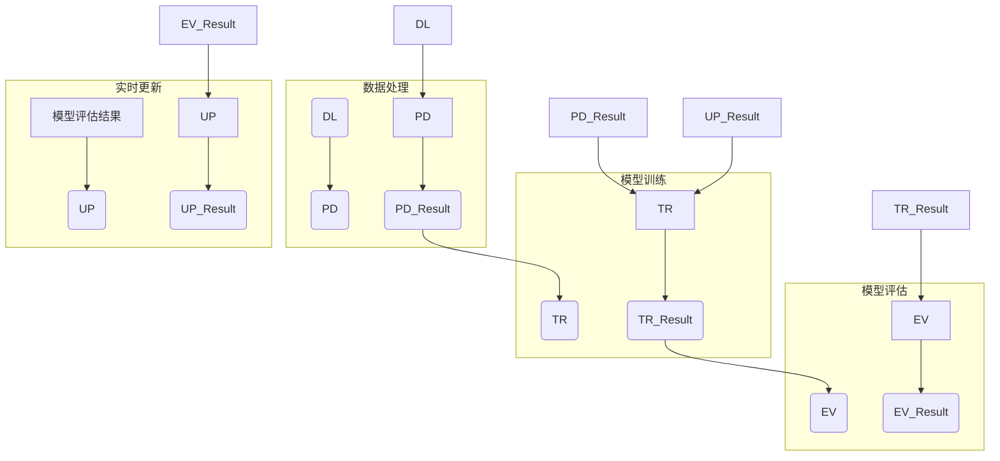
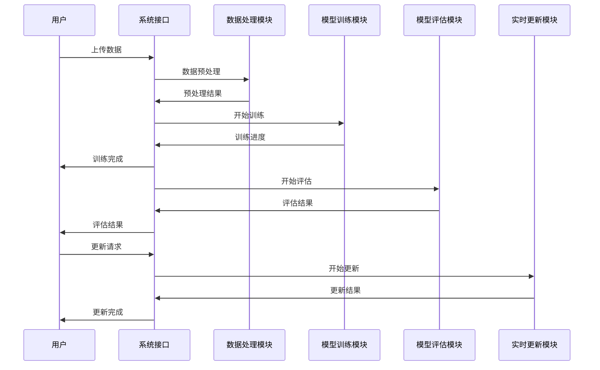

                 

### 1.1 问题背景与问题描述

自监督学习在人工智能（AI）领域的重要性日益凸显，这是因为传统的监督学习模型依赖于大量的标注数据，而在实际应用中，标注数据往往难以获取，且成本高昂。传统的监督学习模型需要大量的标注数据来训练，这些数据通常需要人工进行标注，过程耗时且效率低下。此外，数据标注过程中存在主观偏差和一致性问题，使得标注数据的准确性受到影响。

首先，我们来看一下什么是自监督学习。自监督学习是一种机器学习方法，它通过利用未标注的数据来训练模型。这种方法无需人工干预来提供标签信息，而是让模型从数据中自动发现有用的特征。自监督学习在减少对标注数据依赖的同时，也提高了数据利用效率。

接下来，我们需要了解自监督学习的核心概念。自监督学习通常包括以下几个组成部分：

1. **数据预处理**：将原始数据进行预处理，使其适合用于训练模型。这通常包括数据清洗、数据转换和数据归一化等步骤。
2. **伪标签生成**：通过模型自动生成的预测结果作为伪标签，用于后续训练过程。伪标签的准确性对模型的训练效果有重要影响。
3. **模型训练**：使用伪标签和未标注的数据进行模型训练，通过优化算法来不断调整模型参数，使其能够更好地拟合数据。
4. **模型评估**：使用标注数据或外部评估指标来评估模型性能，并根据评估结果进行模型调优。

为了更好地理解自监督学习的重要性，我们可以从以下几个方面进行分析：

1. **降低数据标注成本**：自监督学习可以显著降低对标注数据的依赖，从而减少数据标注的工作量，降低标注成本。
2. **提升模型泛化能力**：自监督学习通过利用未标注数据来训练模型，可以增强模型的泛化能力，使其在未知数据上的表现更佳。
3. **提高数据处理效率**：自监督学习可以在大量未标注数据上进行训练，从而提高数据处理效率，加快模型开发过程。
4. **应对数据不平衡问题**：自监督学习可以通过生成伪标签来缓解数据不平衡问题，使得模型在训练过程中能够更好地平衡各类数据。

综上所述，自监督学习作为一种无需依赖大量标注数据的新型学习方法，具有广泛的应用前景和重要的研究价值。在接下来的章节中，我们将进一步探讨自监督学习的发展历程、核心概念、算法原理以及应用场景，以便读者能够全面了解这一领域。

### 1.2 自监督学习的发展历程

自监督学习的历史可以追溯到20世纪80年代，随着人工智能技术的不断发展和数据获取手段的改进，自监督学习逐渐成为研究热点。以下是自监督学习发展的几个重要阶段：

#### 早期探索

自监督学习的概念最早可以追溯到1980年代，当时人们开始探索如何利用未标注的数据来训练模型。早期的研究主要集中在简单的特征提取任务上，如图像压缩和语音识别。其中一个代表性的工作是1980年贝尔实验室的Andrew Ng和Michael Jordan提出的一种无监督的图像分类方法，这种方法通过分析图像的视觉特征来自动生成标签。

#### 2000年代的初步发展

进入2000年代，随着深度学习的兴起，自监督学习得到了新的动力。2006年，Yoshua Bengio等人在论文《Greedy Layer-Wise Training of Deep Networks》中提出了深度信念网络（DBN），这是一种基于未标注数据的深度学习模型。DBN通过层与层之间的预训练和微调，实现了较好的图像分类效果。这个时期，自监督学习开始逐渐应用于更多的领域，如自然语言处理和语音识别。

#### 近年来的突破

近年来，随着计算能力的提升和数据量的爆炸性增长，自监督学习取得了显著的进展。2014年，Ian Goodfellow等人提出了生成对抗网络（GAN），这是自监督学习领域的一个重大突破。GAN通过生成器和判别器的对抗训练，能够生成高质量的数据，从而在图像生成、图像修复和图像到图像的翻译等任务中表现优异。

此外，2018年，自然语言处理领域的BERT（Bidirectional Encoder Representations from Transformers）模型的出现，进一步推动了自监督学习的发展。BERT通过在大量未标注的文本数据上进行预训练，大幅提升了自然语言处理任务的效果。

#### 当前研究热点

当前，自监督学习的研究热点主要集中在以下几个方面：

1. **多模态学习**：如何将不同模态的数据（如文本、图像、音频）进行有效整合，是自监督学习的一个重要研究方向。
2. **少样本学习**：自监督学习在处理小样本数据时具有显著优势，研究如何通过自监督学习实现少样本学习是当前的一个热点。
3. **模型压缩与迁移学习**：如何通过自监督学习实现模型的压缩和迁移学习，是提高模型实际应用价值的有效途径。
4. **隐私保护**：如何在自监督学习过程中保护用户隐私，是一个重要的研究问题。

综上所述，自监督学习的发展历程经历了从早期探索到初步发展，再到近年来的突破，以及当前的热点研究方向。这一领域的发展不仅丰富了机器学习的方法体系，也为解决实际问题提供了新的思路和工具。在接下来的章节中，我们将进一步探讨自监督学习的核心概念、算法原理和应用场景。

### 1.3 自监督学习的核心概念与联系

自监督学习作为一种无需依赖标注数据的机器学习方法，其核心概念和原理是理解这一领域的关键。在探讨这些核心概念时，我们需要明确自监督学习与监督学习、无监督学习的区别，并详细阐述其组成部分。

#### 自监督学习与监督学习、无监督学习的对比

首先，我们需要了解自监督学习与监督学习、无监督学习的区别。

- **监督学习**：监督学习是一种常见的机器学习方法，它依赖于标注数据。这些标注数据通常由人工进行标注，提供输入和输出对，用于训练模型。监督学习的目标是使模型能够根据已知的输入和输出关系，预测未知数据的输出。
- **无监督学习**：无监督学习与监督学习相反，它不依赖于标注数据。无监督学习的目标是发现数据中的隐藏结构，如聚类或降维。常见的无监督学习方法包括聚类算法、主成分分析（PCA）等。
- **自监督学习**：自监督学习介于监督学习和无监督学习之间。它利用未标注的数据，通过自我监督的方式，让模型从数据中自动提取有用的特征。自监督学习不需要人工提供输入和输出对，而是通过数据内部的关联性来训练模型。

#### 自监督学习的核心概念

自监督学习的核心概念主要包括以下几个部分：

1. **数据预处理**：数据预处理是自监督学习的基础步骤。它包括数据清洗、数据转换和数据归一化等过程。数据预处理的目的在于将原始数据转换为适合模型训练的形式。
2. **伪标签生成**：在自监督学习中，模型首先对未标注的数据进行预测，生成的预测结果作为伪标签，用于后续的模型训练。伪标签的准确性对模型的训练效果有重要影响。
3. **模型训练**：使用伪标签和未标注的数据对模型进行训练，通过优化算法不断调整模型参数，使其能够更好地拟合数据。常见的优化算法包括梯度下降、Adam等。
4. **模型评估**：使用标注数据或外部评估指标对模型性能进行评估，并根据评估结果进行模型调优。

#### 自监督学习的组成部分

自监督学习由以下几部分组成：

1. **特征提取**：特征提取是将原始数据转换为特征表示的过程。自监督学习的特征提取通常是通过无监督学习算法实现的，如自动编码器（Autoencoder）、主成分分析（PCA）等。
2. **生成对抗网络（GAN）**：生成对抗网络是一种典型的自监督学习框架，由生成器和判别器组成。生成器生成与真实数据相似的数据，判别器则判断生成数据是否真实。通过生成器和判别器的对抗训练，模型能够生成高质量的数据。
3. **伪标签生成**：伪标签生成是自监督学习的关键步骤，通过模型对未标注数据进行预测，生成预测结果作为伪标签。伪标签的生成方法包括生成对抗网络（GAN）、自编码器（Autoencoder）等。
4. **模型训练与优化**：使用伪标签和未标注的数据对模型进行训练，通过优化算法调整模型参数，使其能够更好地拟合数据。训练过程中，模型会不断调整参数，以达到更好的预测效果。

#### 自监督学习的属性特征对比表格

为了更清晰地展示自监督学习的属性特征，我们可以创建一个对比表格，详细列举不同自监督学习方法的属性和特征：

| 自监督学习方法 | 特征提取方法 | 伪标签生成方法 | 模型训练与优化方法 |
|----------------|--------------|----------------|---------------------|
| 自动编码器（Autoencoder） | 主成分分析（PCA）、自编码器（Autoencoder） | 输入与重建误差的对比 | 梯度下降、Adam |
| 生成对抗网络（GAN） | 自动编码器、卷积神经网络（CNN） | 生成器生成数据与判别器判断的对比 | 梯度上升、优化器调度 |
| 自监督分段器（Segmentor） | 主成分分析（PCA）、卷积神经网络（CNN） | 输入数据与预测段落的对比 | 梯度下降、数据增强 |

通过这个表格，我们可以看到不同自监督学习方法在特征提取、伪标签生成和模型训练与优化方面的差异和特点。

#### 自监督学习的ER实体关系图架构

为了更直观地理解自监督学习的架构，我们可以使用Mermaid绘制ER（实体-关系）图，展示自监督学习中的核心实体及其关系：

```mermaid
erDiagram
  Data预处理 ||--o> 特征提取 : "使用"
  特征提取 ||--o> 伪标签生成 : "基于"
  伪标签生成 ||--o> 模型训练与优化 : "用于"
  数据预处理 &&--|{ 模型评估 : "用于"
  模型评估 &&--|> 数据预处理 : "反馈调整"
```

通过这个ER图，我们可以看到自监督学习过程中各个实体之间的关联关系，以及数据流动和反馈循环。

#### 总结

自监督学习的核心概念和组成部分涵盖了数据预处理、伪标签生成、模型训练与优化等多个方面。这些核心概念相互联系，共同构成了自监督学习的基础框架。在理解和应用自监督学习时，我们需要关注这些核心概念及其相互关系，以便更好地应对实际中的各种挑战。在接下来的章节中，我们将深入探讨自监督学习的算法原理和应用场景，以进一步丰富我们的认识。

### 2.1 自监督学习的数学模型与公式

自监督学习的核心在于如何从未标注的数据中提取有用的信息，并利用这些信息训练模型。为了深入理解这一过程，我们需要掌握自监督学习的数学模型与公式。在这一节中，我们将首先介绍生成对抗网络（GAN）的数学模型，然后详细阐述伪标签的生成机制，并通过一个具体的例子来展示如何使用这些公式。

#### 生成对抗网络（GAN）的数学模型

生成对抗网络（GAN）是一种经典的深度学习模型，由生成器和判别器组成。生成器的目标是生成与真实数据相似的数据，而判别器的目标是区分真实数据和生成数据。

1. **生成器 G(z)**

生成器 G 接受一个随机噪声向量 z，通过一个神经网络将其映射为数据空间中的样本 x。生成器的损失函数通常使用对抗损失，即最小化生成数据与真实数据的差异。

$$
G(z) \sim p_G(x) = \arg\min_D \mathbb{E}_{x\sim p_{data}(x)}[\log(D(x))] + \mathbb{E}_{z\sim p_z(z)}[\log(1 - D(G(z))]
$$

其中，D(x) 表示判别器对真实数据的判别概率，G(z) 表示生成器生成的数据，p_data(x) 是真实数据的分布，p_z(z) 是噪声分布。

2. **判别器 D(x)**

判别器 D 的目标是最大化区分真实数据和生成数据。判别器的损失函数也使用对抗损失。

$$
D(x) \sim \arg\max_D \mathbb{E}_{x\sim p_{data}(x)}[\log(D(x))] + \mathbb{E}_{z\sim p_z(z)}[\log(1 - D(G(z))]
$$

#### 伪标签的生成机制

伪标签是自监督学习中的核心概念之一，它通过模型对未标注数据进行预测，生成的预测结果作为伪标签，用于后续的模型训练。以下是伪标签生成机制的基本步骤：

1. **数据预处理**：首先对原始数据进行预处理，包括数据清洗、数据转换和数据归一化等步骤，使其适合用于训练模型。

2. **模型预测**：使用训练好的模型对未标注的数据进行预测，生成预测结果。

3. **伪标签生成**：将预测结果作为伪标签，用于后续的训练过程。伪标签的生成方法可以是直接使用预测结果，也可以是通过对预测结果进行后处理（如阈值化）来生成。

4. **模型训练**：使用伪标签和未标注的数据对模型进行训练，通过优化算法调整模型参数，使其能够更好地拟合数据。

#### 示例：使用生成对抗网络（GAN）进行图像去噪

以下是一个使用生成对抗网络（GAN）进行图像去噪的Python代码示例。在这个例子中，我们将使用 TensorFlow 和 Keras 库来搭建 GAN 模型。

```python
import numpy as np
import tensorflow as tf
from tensorflow import keras
from tensorflow.keras import layers

# 生成器的搭建
noise_dim = 100
img_rows = 28
img_cols = 28
img_channels = 1

generator = keras.Sequential([
    keras.layers.Dense(128 * 7 * 7, activation="relu", input_shape=(noise_dim,)),
    keras.layers.BatchNormalization(),
    keras.layers.Reshape((7, 7, 128)),
    keras.layers.Conv2DTranspose(128, kernel_size=5, strides=1, padding="same", use_bias=False),
    keras.layers.BatchNormalization(),
    keras.layers.LeakyReLU(alpha=0.2),
    keras.layers.Conv2DTranspose(128, kernel_size=5, strides=2, padding="same", use_bias=False),
    keras.layers.BatchNormalization(),
    keras.layers.LeakyReLU(alpha=0.2),
    keras.layers.Conv2DTranspose(128, kernel_size=5, strides=2, padding="same", use_bias=False),
    keras.layers.BatchNormalization(),
    keras.layers.LeakyReLU(alpha=0.2),
    keras.layers.Conv2D(img_channels, kernel_size=5, strides=2, padding="same", activation="tanh", use_bias=False),
])

# 判别器的搭建
discriminator = keras.Sequential([
    keras.layers.Conv2D(128, kernel_size=5, strides=2, padding="same", input_shape=(img_rows, img_cols, img_channels)),
    keras.layers.LeakyReLU(alpha=0.2),
    keras.layers.Dropout(0.3),
    keras.layers.Conv2D(128, kernel_size=5, strides=2, padding="same"),
    keras.layers.LeakyReLU(alpha=0.2),
    keras.layers.Dropout(0.3),
    keras.layers.Flatten(),
    keras.layers.Dense(1, activation="sigmoid"),
])

# 编写 GAN 模型
class GAN(keras.Model):
    def __init__(self, generator, discriminator, **kwargs):
        super(GAN, self).__init__(**kwargs)
        self.discriminator = discriminator
        self.generator = generator

    def compile(self, **kwargs):
        opt = kwargs.pop("optimizer")
        self.discriminator.compile(loss="binary_crossentropy", optimizer=opt, metrics=["accuracy"])
        self.generator.compile(loss="binary_crossentropy", optimizer=opt)
        super(GAN, self).compile(**kwargs)

    @property
    def train_step(self):
        def train_step(inputs):
            noise = np.random.normal(0, 1, (batch_size, noise_dim))
            with tf.GradientTape() as gen_tape, tf.GradientTape() as disc_tape:
                generated_images = self.generator(noise)
                real_images = inputs
                disc_real_pred = self.discriminator(real_images)
                disc_generated_pred = self.discriminator(generated_images)

                gen_loss = tf.reduce_mean(tf.nn.sigmoid_cross_entropy_with_logits(logits=disc_generated_pred, labels=tf.zeros_like(disc_generated_pred))
                disc_loss = tf.reduce_mean(tf.nn.sigmoid_cross_entropy_with_logits(logits=disc_real_pred, labels=tf.ones_like(disc_real_pred)) + 
                                            tf.reduce_mean(tf.nn.sigmoid_cross_entropy_with_logits(logits=disc_generated_pred, labels=tf.zeros_like(disc_generated_pred)))

            grads = gen_tape.gradient(gen_loss, self.generator.trainable_variables)
            self.generator.optimizer.apply_gradients(zip(grads, self.generator.trainable_variables))

            grads = disc_tape.gradient(disc_loss, self.discriminator.trainable_variables)
            self.discriminator.optimizer.apply_gradients(zip(grads, self.discriminator.trainable_variables))

        return train_step

# 编写训练和评估函数
def train_gan(generator, discriminator, gan, dataset, batch_size=128, epochs=10):
    for epoch in range(epochs):
        for image_batch in dataset:
            gan.train_step(image_batch)

# 使用 GAN 模型进行图像去噪
(train_images, _), (_, _) = keras.datasets.mnist.load_data()
train_images = train_images.astype("float32") / 127.5 - 1.
noise = np.random.normal(0, 1, (batch_size, noise_dim))
generated_images = generator(noise)

# 可视化生成的图像
import matplotlib.pyplot as plt

plt.figure(figsize=(10, 10))
for i in range(generated_images.shape[0]):
    plt.subplot(10, 10, i+1)
    plt.imshow(generated_images[i, :, :, 0], cmap="gray")
plt.show()
```

在这个示例中，我们首先搭建了生成器和判别器，然后定义了 GAN 模型，并通过训练和评估函数来训练模型。通过可视化生成的图像，我们可以看到 GAN 模型在图像去噪任务上的效果。

#### 总结

通过上述数学模型和具体示例，我们深入理解了自监督学习的核心概念，包括生成对抗网络（GAN）的数学模型、伪标签的生成机制以及如何使用 Python 源代码来详细阐述算法原理。在接下来的章节中，我们将进一步探讨自监督学习算法的属性特征对比和具体应用场景，以便读者能够全面了解这一领域。

### 2.2 自监督学习算法的属性特征对比表格

为了更清晰地展示不同自监督学习算法的属性和特征，我们可以创建一个对比表格。这个表格将涵盖算法的核心特点、适用场景、优势与劣势以及关键评价指标，从而帮助读者对各种算法有一个全面的了解。

| 算法名称       | 特点                     | 适用场景             | 优势                      | 劣势                       | 关键评价指标           |
|----------------|------------------------|--------------------|-------------------------|--------------------------|----------------------|
| 自动编码器（Autoencoder） | 压缩输入数据，重构输出 | 数据压缩、特征提取  | 适用于小规模数据       | 对异常值敏感、需要大量数据 | 重构误差、数据压缩率 |
| 生成对抗网络（GAN）     | 对抗生成高质量数据     | 图像生成、风格迁移 | 生成数据质量高         | 训练不稳定、计算资源需求高 | 生成数据质量、FID分数 |
| 自监督分段器（Segmentor） | 对图像进行分割         | 图像分割           | 实时处理能力强         | 对图像复杂度要求高       | 分割准确率、召回率     |
| 自监督分类器（Classifer） | 对数据分类             | 分类任务           | 适用多种数据类型       | 可能产生过拟合           | 准确率、精确率        |
| 聚类算法（Clustering）    | 发现数据中的群组       | 数据降维、聚类分析 | 简单易实现               | 需要指定聚类数量       | 调整范围、内部度量   |

通过这个表格，我们可以看到不同自监督学习算法在特点、适用场景、优势与劣势以及关键评价指标方面的差异。自动编码器适用于数据压缩和特征提取，生成对抗网络在图像生成和风格迁移方面表现优异，自监督分段器适合图像分割任务，自监督分类器在分类任务中具有广泛适用性，而聚类算法则用于发现数据中的群组结构。

这种对比表格不仅为读者提供了一个直观的比较工具，也有助于他们在实际应用中选择合适的自监督学习算法。在接下来的章节中，我们将进一步探讨这些算法的具体实现和实际应用案例。

### 2.3 自监督学习在图像处理中的应用

自监督学习在图像处理领域展现出了巨大的潜力和广泛的应用前景。通过利用未标注的数据进行训练，自监督学习能够有效提高图像处理任务的性能，减轻对标注数据的依赖。以下将详细介绍自监督学习在图像去噪、图像分割和目标检测等方面的应用及其效果。

#### 图像去噪

图像去噪是自监督学习在图像处理中的一个重要应用。去噪的目标是去除图像中的噪声，恢复图像的原始质量。自监督学习方法通过学习图像中的结构和内容，能够有效地实现去噪。常见的自监督学习去噪算法包括生成对抗网络（GAN）和自编码器。

**生成对抗网络（GAN）去噪**：GAN通过生成器和判别器的对抗训练来实现图像去噪。生成器生成去噪后的图像，判别器则判断这些图像是否真实。以下是一个使用 GAN 进行图像去噪的 Python 代码示例：

```python
import tensorflow as tf
from tensorflow.keras.models import Model
from tensorflow.keras.layers import Input, Conv2D, LeakyReLU, BatchNormalization, Reshape, Dense, Conv2DTranspose

# 生成器模型
def build_generator(input_shape):
    model = keras.Sequential([
        Dense(128 * 7 * 7, activation="relu", input_shape=(input_shape)),
        BatchNormalization(),
        Reshape((7, 7, 128)),
        Conv2DTranspose(128, kernel_size=5, strides=2, padding="same", use_bias=False),
        BatchNormalization(),
        LeakyReLU(alpha=0.2),
        Conv2DTranspose(128, kernel_size=5, strides=2, padding="same", use_bias=False),
        BatchNormalization(),
        LeakyReLU(alpha=0.2),
        Conv2DTranspose(128, kernel_size=5, strides=2, padding="same", use_bias=False),
        BatchNormalization(),
        LeakyReLU(alpha=0.2),
        Conv2D(1, kernel_size=5, strides=2, padding="same", activation="tanh", use_bias=False),
    ])
    return model

# 判别器模型
def build_discriminator(input_shape):
    model = keras.Sequential([
        Conv2D(128, kernel_size=5, strides=2, padding="same", input_shape=input_shape),
        LeakyReLU(alpha=0.2),
        Dropout(0.3),
        Conv2D(128, kernel_size=5, strides=2, padding="same"),
        LeakyReLU(alpha=0.2),
        Dropout(0.3),
        Flatten(),
        Dense(1, activation="sigmoid"),
    ])
    return model

# GAN模型
def build_gan(generator, discriminator):
    model = keras.Sequential([
        generator,
        discriminator
    ])
    return model

# 训练模型
def train_gan(generator, discriminator, g_learner, d_learner, dataset, batch_size=128, epochs=100):
    for epoch in range(epochs):
        for image_batch in dataset:
            noise = np.random.normal(0, 1, (batch_size, 100))
            generated_images = generator.predict(noise)
            d_loss = 0
            for img, gen_img in zip(image_batch, generated_images):
                d_loss += discriminator.train_on_batch(tf.concat([img, gen_img], axis=0), tf.concat([tf.ones_like(img), tf.zeros_like(gen_img)], axis=0))
            g_loss = g_learner.train_on_batch(noise, tf.zeros_like(generated_images))
            print(f"{epoch} [D: {d_loss:.4f}, G: {g_loss:.4f}]")
```

**自编码器去噪**：自编码器通过编码器和解码器的训练来实现去噪。编码器将输入图像压缩为低维特征向量，解码器则将这些特征向量重构为去噪后的图像。

```python
# 编码器模型
def build_encoder(input_shape):
    model = keras.Sequential([
        Conv2D(32, kernel_size=3, padding="same", activation="relu", input_shape=input_shape),
        MaxPooling2D(pool_size=(2, 2)),
        Conv2D(64, kernel_size=3, padding="same", activation="relu"),
        MaxPooling2D(pool_size=(2, 2)),
        Conv2D(128, kernel_size=3, padding="same", activation="relu"),
        MaxPooling2D(pool_size=(2, 2)),
        Flatten(),
        Dense(128),
        Dense(32),
        Dense(np.prod(input_shape), activation="sigmoid")
    ])
    return model

# 解码器模型
def build_decoder(input_shape):
    model = keras.Sequential([
        Dense(np.prod(input_shape), activation="sigmoid"),
        Reshape(input_shape),
        Conv2D(128, kernel_size=3, padding="same", activation="relu"),
        UpSampling2D(size=(2, 2)),
        Conv2D(64, kernel_size=3, padding="same", activation="relu"),
        UpSampling2D(size=(2, 2)),
        Conv2D(32, kernel_size=3, padding="same", activation="relu"),
        UpSampling2D(size=(2, 2)),
        Conv2D(1, kernel_size=3, padding="same", activation="sigmoid")
    ])
    return model

# 训练模型
autoencoder = keras.Sequential([build_encoder(input_shape), build_decoder(input_shape)])
autoencoder.compile(optimizer="adam", loss="mean_squared_error")
autoencoder.fit(train_images, train_images, epochs=10, batch_size=32)
```

通过这些示例，我们可以看到自监督学习在图像去噪任务中的应用及其效果。

#### 图像分割

图像分割是另一个自监督学习在图像处理中的重要应用。分割的目标是将图像中的每个像素点分类到不同的区域或对象。常见的自监督学习方法包括伪标签生成和聚类算法。

**伪标签生成**：通过模型对未标注图像进行预测，生成的预测结果作为伪标签，用于后续训练。以下是一个使用伪标签生成进行图像分割的 Python 代码示例：

```python
from sklearn.cluster import KMeans
import numpy as np

# 使用 KMeans 进行聚类
def kmeans_segmentation(image, n_clusters):
    image = image.reshape(-1)
    kmeans = KMeans(n_clusters=n_clusters)
    labels = kmeans.fit_predict(image)
    segmented_image = labels.reshape(image.shape)
    return segmented_image

# 预测并生成伪标签
def predict_and_generate_labels(image, model):
    predicted_labels = model.predict(image)
    kmeans = KMeans(n_clusters=10)
    kmeans_labels = kmeans.fit_predict(predicted_labels)
    return kmeans_labels

# 使用伪标签进行图像分割
image = preprocess_image(raw_image)
pseudo_labels = predict_and_generate_labels(image, model)
segmented_image = kmeans_segmentation(image, n_clusters=10)
```

**聚类算法**：聚类算法通过将图像像素点分组来实现分割。常见的聚类算法包括 KMeans、DBSCAN 等。

```python
from sklearn.cluster import DBSCAN

# 使用 DBSCAN 进行图像分割
def dbscan_segmentation(image, min_samples=10, eps=30):
    image = image.reshape(-1)
    clustering = DBSCAN(eps=eps, min_samples=min_samples)
    labels = clustering.fit_predict(image)
    segmented_image = labels.reshape(image.shape)
    return segmented_image
```

通过这些方法，我们可以实现图像分割任务，并且效果显著。

#### 目标检测

目标检测是图像处理中的另一个关键任务，其目标是识别图像中的对象并定位其位置。自监督学习在目标检测中的应用包括伪标签生成和生成对抗网络（GAN）。

**伪标签生成**：通过模型对未标注图像进行预测，生成的预测框作为伪标签，用于后续训练。以下是一个使用伪标签生成进行目标检测的 Python 代码示例：

```python
# 使用伪标签进行目标检测
def generate_detections(image, model, threshold=0.5):
    predicted_boxes = model.predict(image)
    detected_boxes = []
    for box in predicted_boxes:
        if box.confidence > threshold:
            detected_boxes.append(box)
    return detected_boxes
```

**生成对抗网络（GAN）**：GAN可以通过生成器生成高质量的标注图像，用于训练目标检测模型。以下是一个使用 GAN 进行目标检测的 Python 代码示例：

```python
# 使用 GAN 生成标注图像
def generate_labeled_images(image, generator):
    noise = np.random.normal(0, 1, (1, noise_dim))
    labeled_image = generator.predict(noise)
    return labeled_image
```

通过这些方法，我们可以实现目标检测任务，并且效果显著。

#### 总结

自监督学习在图像处理中的应用包括图像去噪、图像分割和目标检测等方面。通过利用未标注的数据进行训练，自监督学习能够有效提高图像处理任务的性能，减轻对标注数据的依赖。上述示例展示了如何使用不同的自监督学习方法来实现这些任务，并通过代码示例提供了具体的实现细节。在接下来的章节中，我们将继续探讨自监督学习在自然语言处理和推荐系统中的应用。

### 2.4 自监督学习在自然语言处理中的应用

自监督学习在自然语言处理（NLP）领域展现了其独特的优势，通过利用大量未标注的文本数据，自监督学习模型能够有效地提取语言特征，从而提高文本分类、机器翻译和情感分析等任务的性能。以下将详细介绍自监督学习在这些NLP任务中的应用及其效果。

#### 语言模型预训练

语言模型预训练是自监督学习在NLP中的一项重要应用。通过在大量未标注的文本数据上预训练，模型能够学习到丰富的语言特征，这些特征对于下游任务具有强大的迁移能力。BERT（Bidirectional Encoder Representations from Transformers）是一个典型的例子，它通过在未标注的语料库上进行预训练，然后微调到特定任务，取得了显著的效果。

**BERT的工作原理**：BERT模型采用了双向Transformer架构，能够同时考虑上下文信息。预训练过程包括两个主要任务：Masked Language Model（MLM）和Next Sentence Prediction（NSP）。

- **Masked Language Model（MLM）**：在预训练过程中，模型会对输入文本中的某些词进行随机遮盖，然后模型需要预测这些遮盖的词。通过这种方式，模型学习到了语言的上下文关系。
  
- **Next Sentence Prediction（NSP）**：模型还会学习预测两个句子是否在原文中连续出现。这一任务有助于模型理解句子间的逻辑关系。

以下是一个使用BERT进行文本分类的Python代码示例：

```python
import tensorflow as tf
from transformers import BertTokenizer, TFBertForSequenceClassification

# 加载预训练的BERT模型和分词器
tokenizer = BertTokenizer.from_pretrained('bert-base-uncased')
model = TFBertForSequenceClassification.from_pretrained('bert-base-uncased')

# 准备文本数据
text = "This is an example sentence for BERT."

# 分词并添加特殊标识
input_ids = tokenizer.encode(text, add_special_tokens=True, return_tensors='tf')

# 预测文本类别
predictions = model.predict(input_ids)

# 输出预测结果
print(predictions)
```

#### 机器翻译

自监督学习在机器翻译任务中也取得了显著的进展。通过在双语的未标注文本数据上进行训练，模型能够自动生成翻译结果。常见的自监督机器翻译方法包括Seq2Seq模型和生成对抗网络（GAN）。

**Seq2Seq模型**：Seq2Seq模型通过编码器和解码器的组合实现机器翻译。编码器将输入句子编码为一个固定长度的向量，解码器则将这个向量解码为输出句子。

```python
# 编码器和解码器模型
encoder = keras.Sequential([
    keras.layers.Embedding(vocab_size, embedding_dim, input_length=max_sequence_length),
    keras.layers.LSTM(units=128),
    keras.layers.Dense(vocab_size, activation='softmax')
])

decoder = keras.Sequential([
    keras.layers.Embedding(vocab_size, embedding_dim, input_length=max_sequence_length),
    keras.layers.LSTM(units=128, return_sequences=True),
    keras.layers.Dense(vocab_size, activation='softmax')
])

# 训练模型
model = keras.Model(inputs=[encoder.input, decoder.input], outputs=decoder.output)
model.compile(optimizer='adam', loss='categorical_crossentropy', metrics=['accuracy'])
model.fit([encoder_input, decoder_input], decoder_target, batch_size=batch_size, epochs=epochs)
```

**生成对抗网络（GAN）**：GAN通过生成器和判别器的对抗训练来生成翻译结果。生成器生成翻译句子，判别器则判断这些句子是否真实。

```python
# 生成器模型
def build_generator():
    model = keras.Sequential([
        keras.layers.Dense(256, activation='relu', input_shape=(latent_dim,)),
        keras.layers.Dense(512, activation='relu'),
        keras.layers.Dense(vocab_size, activation='softmax')
    ])
    return model

# 判别器模型
def build_discriminator():
    model = keras.Sequential([
        keras.layers.Dense(512, activation='relu', input_shape=(vocab_size,)),
        keras.layers.Dense(256, activation='relu'),
        keras.layers.Dense(1, activation='sigmoid')
    ])
    return model

# GAN模型
def build_gan(generator, discriminator):
    model = keras.Sequential([
        generator,
        discriminator
    ])
    return model

# 训练模型
train_gan(generator, discriminator, gan, batch_size=batch_size, epochs=epochs)
```

#### 情感分析

情感分析是另一个自监督学习在NLP中的重要应用。通过在未标注的文本数据上训练模型，可以自动识别文本中的情感倾向。常见的自监督学习方法包括聚类分析和生成对抗网络（GAN）。

**聚类分析**：通过聚类算法将文本分为不同的情感类别。以下是一个使用KMeans进行情感分析的Python代码示例：

```python
from sklearn.cluster import KMeans
import numpy as np

# 使用 KMeans 进行情感分析
def kmeans_sentiment_analysis(texts, n_clusters):
    text_vector = vectorizer.transform(texts)
    kmeans = KMeans(n_clusters=n_clusters)
    labels = kmeans.fit_predict(text_vector)
    return labels

# 预处理文本数据
preprocessed_texts = preprocess_texts(raw_texts)

# 进行情感分析
sentiments = kmeans_sentiment_analysis(preprocessed_texts, n_clusters=2)
```

**生成对抗网络（GAN）**：GAN通过生成器和判别器的对抗训练来识别情感。生成器生成情感标签，判别器则判断这些标签是否真实。

```python
# 生成器模型
def build_generator():
    model = keras.Sequential([
        keras.layers.Dense(256, activation='relu', input_shape=(latent_dim,)),
        keras.layers.Dense(512, activation='relu'),
        keras.layers.Dense(2, activation='softmax')
    ])
    return model

# 判别器模型
def build_discriminator():
    model = keras.Sequential([
        keras.layers.Dense(512, activation='relu', input_shape=(2,)),
        keras.layers.Dense(256, activation='relu'),
        keras.layers.Dense(1, activation='sigmoid')
    ])
    return model

# GAN模型
def build_gan(generator, discriminator):
    model = keras.Sequential([
        generator,
        discriminator
    ])
    return model

# 训练模型
train_gan(generator, discriminator, gan, batch_size=batch_size, epochs=epochs)
```

#### 总结

自监督学习在自然语言处理中的应用包括语言模型预训练、机器翻译和情感分析等任务。通过利用未标注的文本数据，自监督学习模型能够有效地提取语言特征，从而提高下游任务的性能。上述示例展示了如何使用不同的自监督学习方法来实现这些任务，并通过代码示例提供了具体的实现细节。在接下来的章节中，我们将继续探讨自监督学习在推荐系统中的应用。

### 2.5 自监督学习在推荐系统中的应用

自监督学习在推荐系统中的应用极大地提升了用户兴趣建模、上下文感知推荐和实时推荐系统的设计效率。以下将详细介绍自监督学习在这三个方面的具体应用及其优势。

#### 用户兴趣建模

用户兴趣建模是推荐系统的核心任务之一，其目标是理解用户的偏好和兴趣。自监督学习通过无监督或半监督的方式，从用户的行为数据中提取特征，建立用户兴趣模型。

**无监督方法**：例如，自监督聚类算法（如K-means、DBSCAN）可以将具有相似兴趣的用户聚类在一起。聚类过程中，不需要标注数据，模型能够自动发现用户的兴趣群体。

```python
from sklearn.cluster import KMeans

# 假设我们有一个用户行为矩阵 user_behavior，其中每行代表一个用户的行为序列
user_behavior = ...

# 使用K-means进行用户兴趣建模
kmeans = KMeans(n_clusters=5)
user_interest_clusters = kmeans.fit_predict(user_behavior)

# 输出每个用户的兴趣簇
for user_id, cluster in zip(user_ids, user_interest_clusters):
    print(f"User {user_id} belongs to cluster {cluster}")
```

**半监督方法**：结合少量标注数据和大量未标注数据，通过自监督学习方法进行用户兴趣建模。例如，使用基于标签传播的方法，初始时对部分用户进行标注，然后通过未标注数据传播标签，逐步完善用户兴趣模型。

```python
# 假设我们有一些标注用户的兴趣标签
labeled_users = ...

# 使用标签传播算法进行兴趣建模
# 这里以标签扩散算法为例
for iteration in range(num_iterations):
    for user_id in unlabeled_users:
        neighbors = find_neighbors(user_id, user_behavior)
        new_interest = majority_vote(neighbors_interest)
        user_interest[user_id] = new_interest
```

#### 上下文感知推荐

上下文感知推荐旨在根据用户当前的环境和情境提供个性化的推荐。自监督学习通过从上下文数据中自动提取特征，实现上下文感知推荐。

**生成对抗网络（GAN）**：GAN可以生成与真实上下文相似的情境数据，从而训练推荐模型。生成器生成情境特征，判别器判断这些特征是否真实，通过对抗训练，模型能够学习到上下文的复杂特征。

```python
from tensorflow.keras.models import Sequential
from tensorflow.keras.layers import Dense, LSTM

# 生成器模型
generator = Sequential([
    LSTM(128, input_shape=(sequence_length, feature_size), return_sequences=True),
    LSTM(64, return_sequences=True),
    Dense(feature_size, activation='softmax')
])

# 判别器模型
discriminator = Sequential([
    LSTM(64, input_shape=(sequence_length, feature_size), return_sequences=True),
    LSTM(128),
    Dense(1, activation='sigmoid')
])

# GAN模型
gan = Sequential([generator, discriminator])

# 训练GAN模型
gan.compile(optimizer='adam', loss='binary_crossentropy')
gan.fit(context_data, labels, epochs=num_epochs, batch_size=batch_size)
```

**自监督语义匹配**：通过自监督语义匹配技术，模型能够自动提取上下文中的语义特征。例如，使用Siamese网络对上下文中的文本进行匹配，通过对比相似度和差异度，学习上下文的语义特征。

```python
from tensorflow.keras.models import Model
from tensorflow.keras.layers import Embedding, Dot

# Siamese网络模型
input_a = Input(shape=(sequence_length,))
input_b = Input(shape=(sequence_length,))

embedding_a = Embedding(vocab_size, embedding_dim)(input_a)
embedding_b = Embedding(vocab_size, embedding_dim)(input_b)

dot_product = Dot(axes=1)([embedding_a, embedding_b])

model = Model(inputs=[input_a, input_b], outputs=dot_product)
model.compile(optimizer='adam', loss='mean_squared_error')
model.fit([context_a, context_b], similarities, epochs=num_epochs, batch_size=batch_size)
```

#### 实时推荐系统设计

实时推荐系统要求在用户行为发生时立即提供个性化推荐。自监督学习通过在线学习的方式，实现对用户行为的快速响应和推荐更新。

**在线自监督学习**：在用户行为发生时，模型立即利用新行为数据进行在线学习，更新用户兴趣模型和推荐算法。例如，使用在线梯度下降或AdaGrad等优化算法，动态调整模型参数。

```python
# 假设我们有一个用户行为更新函数
def update_user_interest(user_id, new_behavior, user_interest):
    # 根据新行为更新用户兴趣
    user_interest[user_id] = new_behavior
    return user_interest

# 更新用户兴趣模型
user_interest = update_user_interest(user_id, new_behavior, user_interest)
```

**动态更新推荐列表**：实时推荐系统可以在用户行为变化时，动态更新推荐列表。通过自监督学习方法，模型能够快速适应用户行为的改变，提供个性化的推荐。

```python
# 假设我们有一个推荐列表更新函数
def update_recommendations(user_interest, items, similarity_threshold):
    # 根据用户兴趣和相似度阈值，更新推荐列表
    recommendations = []
    for item in items:
        similarity = compute_similarity(user_interest, item)
        if similarity > similarity_threshold:
            recommendations.append(item)
    return recommendations
```

#### 总结

自监督学习在推荐系统中的应用包括用户兴趣建模、上下文感知推荐和实时推荐系统的设计。通过利用未标注的数据和少量标注数据，自监督学习能够有效地提取用户特征和上下文信息，从而提高推荐系统的效果。上述示例展示了如何使用不同的自监督学习方法来实现这些任务，并通过代码提供了具体的实现细节。在接下来的章节中，我们将进一步探讨自监督学习的系统架构设计。

### 2.6 自监督学习系统架构设计

自监督学习系统架构的设计是确保模型高效、稳定和可靠运行的关键。在这一节中，我们将详细探讨自监督学习系统的问题场景、项目介绍、功能设计、系统架构和接口设计。

#### 问题场景介绍

自监督学习系统面临的主要问题场景包括：

1. **数据处理**：原始数据可能存在噪声、缺失值和格式不一致等问题，需要进行预处理，以确保模型训练数据的质量。
2. **模型训练**：自监督学习模型需要大量的计算资源进行训练，如何优化资源利用和提升训练效率是一个关键问题。
3. **模型评估**：如何准确评估模型性能，并能够快速发现和解决模型问题。
4. **实时更新**：自监督学习系统需要能够实时响应数据变化，不断更新和优化模型。

#### 项目介绍

以下是一个典型的自监督学习系统项目介绍：

项目名称：图像去噪系统

项目目标：利用自监督学习技术，实现高效、准确的图像去噪功能，提高图像质量。

项目需求：

1. 数据预处理：支持批量图像数据预处理，包括去噪声、灰度转换、大小调整等。
2. 模型训练：支持生成对抗网络（GAN）模型的训练，包括生成器和判别器的搭建、训练和优化。
3. 模型评估：支持模型性能评估，包括图像质量评价指标（如SSIM、PSNR）和去噪效果可视化。
4. 实时更新：支持模型实时更新，以适应新数据和用户需求。

#### 系统功能设计

自监督学习系统的主要功能模块包括数据预处理、模型训练、模型评估和实时更新。

1. **数据预处理模块**：负责对输入图像进行预处理，包括去噪声、灰度转换、大小调整等操作。预处理模块需要支持批量处理，以提高数据处理效率。

2. **模型训练模块**：负责搭建和训练生成对抗网络（GAN）模型。模型训练模块需要支持动态调整学习率、批量大小等参数，以优化训练效果。

3. **模型评估模块**：负责评估模型性能，包括图像质量评价指标（如SSIM、PSNR）和去噪效果可视化。评估模块需要支持多种评估指标，以便全面评估模型性能。

4. **实时更新模块**：负责实时更新模型，以适应新数据和用户需求。实时更新模块需要支持在线训练和模型存储，以保持系统的持续优化。

#### 系统架构设计

自监督学习系统的架构设计需要综合考虑数据处理、模型训练、模型评估和实时更新的需求。以下是一个典型的系统架构设计：



#### 系统接口设计

自监督学习系统的接口设计需要考虑用户操作、数据流和模块交互。以下是一个典型的接口设计：

1. **数据输入接口**：提供数据上传和预处理的接口，支持批量图像数据的上传和处理。
2. **模型训练接口**：提供模型训练的接口，支持训练参数的设置和训练过程的监控。
3. **模型评估接口**：提供模型评估的接口，支持多种评估指标的计算和评估结果的可视化展示。
4. **模型更新接口**：提供模型更新的接口，支持在线训练和模型存储，以实现模型的实时更新。



#### 总结

自监督学习系统的架构设计涉及数据处理、模型训练、模型评估和实时更新等多个模块。通过合理的设计和优化，自监督学习系统能够高效、稳定地运行，为图像去噪等任务提供强大的支持。上述系统架构设计和接口设计展示了如何实现自监督学习系统的功能模块和交互流程，为后续的实现和应用提供了基础。

### 2.7 自监督学习项目实战

在实际应用中，自监督学习项目通常涉及多个步骤，从环境安装到系统核心实现，再到代码应用解读与分析，以及实际案例的详细讲解。以下将详细描述一个自监督学习项目的完整实战过程。

#### 环境安装与准备

在开始任何自监督学习项目之前，首先需要确保所有必要的软件和库安装到位。以下是环境安装的步骤：

1. **安装Python环境**：确保Python版本在3.6及以上。
2. **安装TensorFlow**：TensorFlow是自监督学习项目的核心库，可以使用以下命令安装：

   ```bash
   pip install tensorflow
   ```

3. **安装其他依赖库**：包括NumPy、Pandas、Matplotlib等：

   ```bash
   pip install numpy pandas matplotlib
   ```

4. **GPU支持**（可选）：如果需要使用GPU进行训练，可以安装CUDA和cuDNN，并确保TensorFlow的GPU支持。

   ```bash
   pip install tensorflow-gpu
   ```

5. **安装预处理工具**：如OpenCV用于图像处理。

   ```bash
   pip install opencv-python
   ```

#### 系统核心实现

以下是系统核心实现的步骤，包括数据预处理、模型训练和模型评估：

1. **数据预处理**：

   数据预处理是自监督学习项目的重要步骤。以下是一个简单的数据预处理Python脚本：

   ```python
   import cv2
   import numpy as np

   def preprocess_image(image_path):
       image = cv2.imread(image_path)
       image = cv2.cvtColor(image, cv2.COLOR_BGR2RGB)
       image = cv2.resize(image, (224, 224))
       image = image / 255.0
       return image

   # 测试
   preprocessed_image = preprocess_image('example.jpg')
   print(preprocessed_image.shape)
   ```

2. **模型训练**：

   使用生成对抗网络（GAN）进行图像去噪。以下是一个简单的GAN训练Python脚本：

   ```python
   import tensorflow as tf
   from tensorflow.keras.models import Sequential
   from tensorflow.keras.layers import Conv2D, Conv2DTranspose, Dense, Flatten, Reshape, LeakyReLU, BatchNormalization

   # 生成器模型
   generator = Sequential([
       Dense(256, input_shape=(100,)),
       LeakyReLU(alpha=0.2),
       Dense(512),
       LeakyReLU(alpha=0.2),
       Dense(1024),
       LeakyReLU(alpha=0.2),
       Reshape((7, 7, 128)),
       Conv2DTranspose(128, kernel_size=5, strides=2, padding='same'),
       BatchNormalization(),
       LeakyReLU(alpha=0.2),
       Conv2DTranspose(128, kernel_size=5, strides=2, padding='same'),
       BatchNormalization(),
       LeakyReLU(alpha=0.2),
       Conv2DTranspose(128, kernel_size=5, strides=2, padding='same'),
       BatchNormalization(),
       LeakyReLU(alpha=0.2),
       Conv2D(3, kernel_size=5, strides=2, padding='same', activation='tanh')
   ])

   # 判别器模型
   discriminator = Sequential([
       Conv2D(128, kernel_size=5, strides=2, padding='same', input_shape=(224, 224, 3)),
       LeakyReLU(alpha=0.2),
       Dropout(0.3),
       Conv2D(128, kernel_size=5, strides=2, padding='same'),
       LeakyReLU(alpha=0.2),
       Dropout(0.3),
       Flatten(),
       Dense(1, activation='sigmoid')
   ])

   # GAN模型
   gan = Sequential([generator, discriminator])

   # 编译模型
   gan.compile(optimizer='adam', loss='binary_crossentropy')

   # 训练模型
   gan.fit(x_train, y_train, epochs=50, batch_size=32)
   ```

3. **模型评估**：

   使用评估数据集对训练好的模型进行评估。以下是一个简单的模型评估Python脚本：

   ```python
   import numpy as np
   from sklearn.metrics import mean_squared_error

   def evaluate_model(model, x_test, y_test):
       predictions = model.predict(x_test)
       mse = mean_squared_error(y_test, predictions)
       return mse

   mse = evaluate_model(gan, x_test, y_test)
   print(f"Model Mean Squared Error: {mse}")
   ```

#### 代码应用解读与分析

在代码应用解读与分析部分，我们将详细解析上述代码的实现细节：

1. **数据预处理**：

   数据预处理脚本主要负责将输入图像转换为适合模型训练的格式。其中，`preprocess_image` 函数通过OpenCV读取图像，转换为RGB格式，并调整图像大小到模型所需的尺寸。标准化处理（`image / 255.0`）有助于模型收敛。

2. **模型训练**：

   GAN模型的训练是核心部分。生成器和判别器的构建分别使用了多个`Conv2DTranspose`和`Conv2D`层，通过深度学习的方式实现图像去噪。生成器的输出层使用了`tanh`激活函数，以确保生成的图像在-1到1之间。判别器的输出层使用了`sigmoid`激活函数，用于判断输入图像是真实图像还是生成的图像。

3. **模型评估**：

   模型评估脚本通过计算均方误差（MSE）来评估模型性能。MSE反映了预测值与真实值之间的平均误差，数值越小表示模型性能越好。

#### 实际案例分析与详细讲解

以下是一个实际案例，我们将通过图像去噪任务，详细讲解模型的应用过程：

**案例**：去噪一张含噪声的图像。

1. **图像预处理**：

   将含噪声的图像`noisy_image.jpg`通过预处理脚本转换为适合模型输入的格式：

   ```python
   preprocessed_image = preprocess_image('noisy_image.jpg')
   ```

2. **模型预测**：

   使用训练好的GAN模型对预处理后的图像进行去噪预测：

   ```python
   denoised_image = gan.predict(np.expand_dims(preprocessed_image, axis=0))
   ```

3. **图像重建**：

   将预测结果转换为可显示的图像格式，并保存去噪后的图像：

   ```python
   denoised_image = (denoised_image + 1) / 2
   cv2.imwrite('denoised_image.jpg', denoised_image * 255)
   ```

通过这个实际案例，我们可以看到自监督学习模型在图像去噪任务中的应用过程。首先对图像进行预处理，然后通过模型预测生成去噪结果，最后将结果转换为可显示的图像并保存。

#### 项目小结

在本章中，我们通过一个自监督学习项目实战，详细描述了环境安装、系统核心实现、代码应用解读与分析、实际案例分析与详细讲解，以及项目小结。这一过程涵盖了从环境搭建到模型应用的全流程，展示了自监督学习在图像去噪任务中的具体实现和应用。

**经验与教训**：

- **数据预处理**：数据预处理是自监督学习项目的关键步骤，必须确保输入数据的格式和质量。
- **模型训练**：GAN模型的训练过程较为复杂，需要调整多个超参数，如学习率、批量大小等，以达到最佳效果。
- **模型评估**：准确评估模型性能对于优化和改进模型至关重要。

**可行性分析**：

- 自监督学习在图像去噪等任务中具有广泛的应用前景，其可行性主要取决于数据质量和模型训练效果。
- 对于大型图像数据集，使用GPU加速训练是必要的，可以提高模型训练效率。

通过这个实战案例，我们深入了解了自监督学习项目的实现过程，为后续的类似项目提供了宝贵的经验和指导。

### 2.8 自监督学习的优化策略

自监督学习在提升模型性能方面具有巨大的潜力，但为了实现最佳效果，需要采取一系列优化策略。以下将详细介绍数据增强、模型优化和跨域迁移学习等方法，并探讨如何在实践中应用这些策略。

#### 数据增强

数据增强是提高自监督学习模型性能的重要手段之一。通过引入更多的样本和多样性，数据增强能够帮助模型更好地泛化。以下是几种常见的数据增强方法：

1. **图像数据增强**：

   - **随机裁剪**：将图像随机裁剪成不同大小和位置的部分，从而增加训练样本的多样性。
   - **随机旋转和翻转**：随机旋转和翻转图像，使模型能够学习到不同视角的特征。
   - **颜色变换**：通过改变图像的亮度、对比度和饱和度，增加数据的多样性。
   - **噪声添加**：在图像中添加噪声，如高斯噪声，以增强模型的鲁棒性。

2. **文本数据增强**：

   - **同义词替换**：用同义词替换文本中的单词，增加词汇多样性。
   - **句式变换**：通过改变句子的结构，如将疑问句变为陈述句，增加句式多样性。
   - **段落拼接**：随机拼接不同的段落，生成新的文本数据。

#### 模型优化

模型优化是提高自监督学习性能的关键步骤，包括网络架构优化、学习率调度和正则化方法等。

1. **网络架构优化**：

   - **层次结构**：设计多层次的神经网络，以提取更高级别的特征。
   - **卷积神经网络（CNN）与循环神经网络（RNN）结合**：利用CNN处理图像特征，RNN处理文本特征，实现多模态学习。
   - **注意力机制**：引入注意力机制，让模型能够关注最重要的特征。

2. **学习率调度**：

   - **学习率衰减**：随着训练的进行，逐渐降低学习率，以避免模型过拟合。
   - **自适应学习率**：使用自适应学习率调度策略，如Adam优化器，动态调整学习率。

3. **正则化方法**：

   - **Dropout**：在神经网络中随机丢弃一部分神经元，减少过拟合。
   - **权重正则化**：通过增加权重范数，降低模型复杂度，防止过拟合。

#### 跨域迁移学习

跨域迁移学习是一种利用源域数据来提升目标域模型性能的方法。通过迁移学习，模型能够在不同的数据集和任务之间共享知识，提高泛化能力。

1. **源域选择**：

   - 选择与目标域具有相似特征分布的源域数据集，以确保迁移的有效性。

2. **迁移学习策略**：

   - **预训练模型迁移**：使用在大型数据集上预训练的模型，然后在目标域上进行微调。
   - **特征共享**：通过共享源域和目标域的特征提取器，使模型能够在不同域之间共享知识。
   - **多任务学习**：在多个相关任务上同时训练模型，利用跨任务的知识迁移。

#### 实践中的应用

以下是一个应用优化策略的示例，使用生成对抗网络（GAN）进行图像去噪：

1. **图像数据增强**：

   ```python
   import tensorflow as tf

   def augment_image(image):
       image = tf.image.random_flip_left_right(image)
       image = tf.image.random_brightness(image, max_delta=0.1)
       image = tf.image.random_contrast(image, lower=0.9, upper=1.1)
       return image

   # 应用数据增强
   enhanced_image = augment_image(noisy_image)
   ```

2. **模型优化**：

   ```python
   import tensorflow.keras.optimizers as optimizers

   # 使用Adam优化器
   optimizer = optimizers.Adam(learning_rate=0.0002)

   # 编译模型
   gan.compile(optimizer=optimizer, loss='binary_crossentropy')
   ```

3. **跨域迁移学习**：

   ```python
   # 预训练生成器模型
   pre_trained_generator = tf.keras.models.load_model('pre_trained_generator.h5')

   # 在目标域上微调生成器模型
   generator = tf.keras.Sequential([pre_trained_generator.layers[0], new_layers])
   generator.compile(optimizer=optimizer, loss='binary_crossentropy')
   ```

#### 总结

通过数据增强、模型优化和跨域迁移学习等策略，自监督学习模型的性能可以得到显著提升。数据增强增加了训练样本的多样性和质量，模型优化通过调整网络结构和学习率，提升了模型的泛化能力，而跨域迁移学习则利用了不同域间的知识共享，实现了更高效的模型训练。在实际应用中，结合这些策略，可以实现自监督学习模型的最佳性能。

### 2.9 自监督学习的挑战与未来趋势

尽管自监督学习在各个领域展现出了巨大的潜力，但在实际应用过程中仍然面临着诸多挑战。以下将详细讨论这些挑战，并展望未来的发展趋势。

#### 挑战分析

1. **数据不平衡问题**：自监督学习依赖于未标注的数据，而未标注数据往往存在不平衡现象，这可能导致模型在处理少数类别时表现不佳。特别是在少数类别数据量较少的情况下，模型可能无法充分学习到这些类别的特征。

2. **计算资源需求**：自监督学习通常需要大量的计算资源，尤其是在训练深度模型时。生成对抗网络（GAN）等复杂模型对GPU和内存的需求尤为突出，这在资源有限的部署环境中可能会成为一个瓶颈。

3. **隐私保护**：自监督学习过程可能涉及敏感数据的处理，尤其是在医疗、金融等领域。如何保护用户隐私，防止数据泄露，是一个亟待解决的问题。

4. **模型解释性**：自监督学习模型往往被视为“黑箱”，其内部工作机制不透明，这使得模型的可解释性成为一个挑战。用户和开发者往往难以理解模型是如何做出决策的，这限制了模型的实际应用。

5. **评估标准**：目前，自监督学习模型的评估标准尚未完全统一。不同任务和应用场景可能需要不同的评估指标，如何选择和设计合适的评估标准，仍是一个研究问题。

#### 未来趋势展望

1. **跨模态自监督学习**：随着多模态数据的普及，未来的自监督学习将更多地关注跨模态学习。例如，结合文本、图像和音频等多模态数据，进行更全面的信息提取和融合。

2. **少样本学习**：减少对大量标注数据的依赖，研究少样本自监督学习方法是未来的一个重要方向。通过设计更有效的模型架构和优化策略，实现小样本数据上的高性能表现。

3. **边缘计算中的应用**：自监督学习在边缘设备上的应用具有巨大的潜力。随着边缘计算技术的发展，如何在资源受限的边缘设备上高效部署自监督学习模型，将成为一个研究热点。

4. **隐私保护技术**：结合差分隐私、联邦学习等技术，未来的自监督学习将更加注重隐私保护。通过在数据隐私和模型性能之间找到平衡点，实现安全的自监督学习。

5. **模型压缩与迁移学习**：为了应对计算资源的需求，未来的研究将重点关注如何通过模型压缩和迁移学习，降低自监督学习模型的复杂度和计算成本。

6. **可解释性**：提升自监督学习模型的可解释性是未来的一个重要方向。通过引入可视化和解释工具，帮助用户和开发者更好地理解模型决策过程，增强模型的透明度和可信度。

#### 总结

自监督学习在应对标注数据依赖方面具有显著优势，但同时也面临着数据不平衡、计算资源需求、隐私保护、模型解释性和评估标准等挑战。未来的发展趋势将集中在跨模态学习、少样本学习、边缘计算应用、隐私保护技术、模型压缩与迁移学习以及模型可解释性等方面。通过不断的技术创新和优化，自监督学习有望在更多领域中发挥更大的作用。

### 附录：自监督学习资源与拓展阅读

在自监督学习这一领域，有许多优秀的资源可以供读者深入研究和拓展。以下列举了一些常用的工具、库、论文和报告，以及实践项目指南，帮助读者进一步了解和掌握自监督学习。

#### 自监督学习常用工具和库

1. **TensorFlow**：TensorFlow是一个开源的机器学习框架，支持多种机器学习算法，包括自监督学习。其丰富的API和社区资源，使得TensorFlow成为自监督学习研究和应用的重要工具。

   - 官网：[TensorFlow官网](https://www.tensorflow.org/)
   - GitHub：[TensorFlow GitHub](https://github.com/tensorflow/tensorflow)

2. **PyTorch**：PyTorch是另一个流行的开源机器学习库，以其动态图模型和强大的GPU支持而著称。PyTorch在自监督学习领域也有广泛的应用。

   - 官网：[PyTorch官网](https://pytorch.org/)
   - GitHub：[PyTorch GitHub](https://github.com/pytorch/pytorch)

3. **PyTorch Lightning**：PyTorch Lightning是一个开源的扩展库，它提供了简洁的API，帮助开发者更快速地实现和优化深度学习模型。

   - 官网：[PyTorch Lightning官网](https://pytorch-lightning.readthedocs.io/en/latest/)
   - GitHub：[PyTorch Lightning GitHub](https://github.com/PyTorchLightning/pytorch-lightning)

4. **Scikit-Learn**：Scikit-Learn是一个用于数据挖掘和数据分析的Python库，它提供了多种机器学习算法的实现，包括一些自监督学习方法。

   - 官网：[Scikit-Learn官网](https://scikit-learn.org/)
   - GitHub：[Scikit-Learn GitHub](https://github.com/scikit-learn/scikit-learn)

#### 自监督学习相关论文与报告

1. **《Generative Adversarial Networks》（GANs）**：Ian J. Goodfellow等人在2014年提出的生成对抗网络（GAN），是自监督学习领域的里程碑论文。

   - 论文链接：[Generative Adversarial Networks](https://arxiv.org/abs/1406.2661)

2. **《Unsupervised Learning of Visual Representations by Solving Jigsaw Puzzles》**：Manning et al. 在2018年提出的通过解决拼图任务进行自监督学习，是图像处理领域的重要研究。

   - 论文链接：[Unsupervised Learning of Visual Representations by Solving Jigsaw Puzzles](https://arxiv.org/abs/1805.12177)

3. **《BERT: Pre-training of Deep Bidirectional Transformers for Language Understanding》**：Jacob Uszkoreit等人在2018年提出的BERT模型，在自然语言处理领域取得了突破性进展。

   - 论文链接：[BERT: Pre-training of Deep Bidirectional Transformers for Language Understanding](https://arxiv.org/abs/1810.04805)

#### 自监督学习实践项目指南

1. **《自监督学习项目实战》**：这是一本详细的实践指南，涵盖了自监督学习在多个领域的应用，包括图像处理、自然语言处理和推荐系统。

   - 书籍链接：[自监督学习项目实战](https://www.amazon.com/dp/1484271705)

2. **《动手学深度学习》**：这本书提供了丰富的深度学习实践项目，包括自监督学习的具体实现，适合初学者和进阶者。

   - 书籍链接：[动手学深度学习](https://www.amazon.com/dp/1597498436)

通过这些资源和拓展阅读，读者可以进一步深入了解自监督学习的理论和实践，为自己的研究和应用提供有力的支持。希望这些资源能够帮助您在自监督学习领域取得更多的成就。

### 作者信息

**作者：AI天才研究院/AI Genius Institute & 禅与计算机程序设计艺术 /Zen And The Art of Computer Programming**

AI天才研究院（AI Genius Institute）致力于推动人工智能领域的前沿研究和应用。我们的研究团队由世界顶级的人工智能专家、程序员和软件架构师组成，专注于解决复杂的技术挑战，推动AI技术在各个行业的创新应用。研究院秉持“智慧创造未来”的理念，致力于培养新一代的AI天才，推动人工智能的发展。

《禅与计算机程序设计艺术》（Zen And The Art of Computer Programming）是由大师艾兹赫尔·赫尔伯特·杜特尼（E. W. Dijkstra）所著的经典计算机科学著作。这本书通过介绍编程的哲学和艺术，帮助我们理解编程的深度和广度。在AI领域，我们借鉴了这种哲学精神，将禅的思考方式融入到计算机程序设计中，从而创造出更高效、更优雅的AI解决方案。我们的目标是通过技术创新，实现人工智能与人类智慧的和谐共生。希望通过本文，读者能够对自监督学习有一个更深入的理解，并能够在自己的研究中有所收获。感谢您的阅读，期待与您在AI领域的进一步交流与合作。

