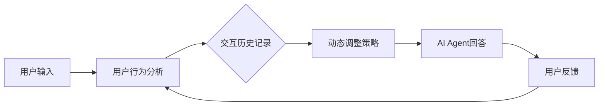
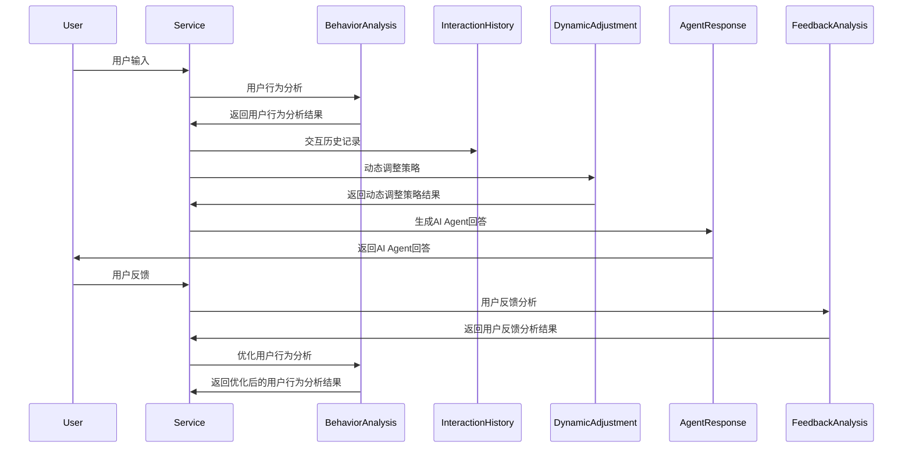
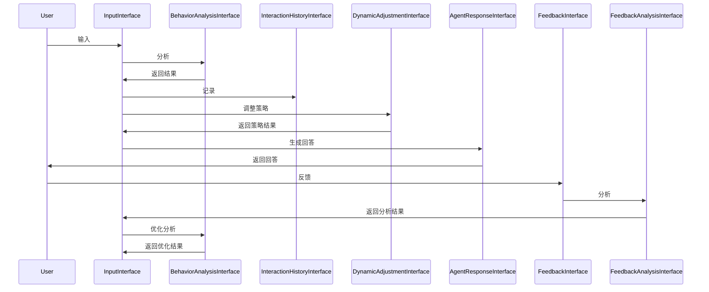

                 

# 自适应对话策略：提升AI Agent的交互质量

## 关键词

- 自适应对话策略
- AI Agent
- 交互质量
- 用户行为分析
- 机器学习
- 用户建模

## 摘要

随着人工智能技术的发展，AI Agent（人工智能代理）在各个领域的应用日益广泛。然而，AI Agent的交互质量直接影响用户体验，成为制约其广泛应用的关键因素。本文将深入探讨自适应对话策略的核心概念、实现原理和实际应用，以提升AI Agent的交互质量，为人工智能技术的发展提供新的思路和方法。

## 第一部分：背景介绍

### 1.1.1 问题背景

在当今数字化、智能化的时代背景下，人工智能（AI）技术的发展已经成为推动社会进步的重要力量。AI的应用场景越来越广泛，从简单的自动化工具到复杂的人机交互，AI的触角已经延伸到了各个领域。然而，随着AI技术的发展，AI Agent（人工智能代理）的交互质量成为一个亟待解决的问题。

### 1.1.2 问题描述

AI Agent的交互质量主要表现在以下几个方面：

1. **理解能力**：AI Agent需要能够准确地理解用户的意图和需求。
2. **回答能力**：AI Agent需要能够提供准确、及时、有针对性的回答。
3. **用户体验**：AI Agent的交互过程需要友好、自然，让用户感到舒适。

然而，现有的AI Agent在上述几个方面仍然存在很多问题，无法满足用户的高期望。因此，如何提升AI Agent的交互质量，成为当前AI研究的一个重要课题。

### 1.1.3 问题解决

为了提升AI Agent的交互质量，本文将探讨一种新型的对话策略——自适应对话策略。自适应对话策略是一种基于用户行为和交互历史的动态调整策略，旨在提高AI Agent的交互质量和用户体验。

### 1.1.4 边界与外延

自适应对话策略的研究和应用范围主要包括以下几个方面：

1. **自然语言处理**：自适应对话策略需要依赖于自然语言处理技术，对用户输入进行理解和分析。
2. **机器学习**：自适应对话策略需要通过机器学习技术，从用户行为和交互历史中提取有价值的信息。
3. **用户建模**：自适应对话策略需要对用户进行建模，以便更好地理解用户的意图和需求。
4. **人机交互**：自适应对话策略需要考虑人机交互的体验，使交互过程更加自然、友好。

### 1.1.5 概念结构与核心要素组成

自适应对话策略的核心概念和要素包括：

1. **用户行为分析**：通过分析用户的行为数据，了解用户的兴趣、需求和偏好。
2. **交互历史记录**：记录用户和AI Agent的交互历史，以便在后续交互中利用这些信息。
3. **动态调整策略**：根据用户行为分析和交互历史记录，动态调整AI Agent的交互策略。
4. **反馈机制**：通过用户的反馈，不断优化和改进AI Agent的交互质量。

### 1.1.6 本章小结

本章对自适应对话策略的背景、问题描述、问题解决、边界与外延以及概念结构与核心要素进行了详细阐述。自适应对话策略作为一种新型的对话策略，旨在提升AI Agent的交互质量，具有广泛的应用前景和重要的研究价值。

## 第二部分：核心概念与联系

### 2.1.1 自适应对话策略

自适应对话策略是一种基于用户行为和交互历史的动态调整策略，旨在提高AI Agent的交互质量和用户体验。它通过分析用户行为数据、交互历史记录，动态调整AI Agent的交互策略，使其更加符合用户的意图和需求。

### 2.1.2 用户行为分析

用户行为分析是自适应对话策略的重要组成部分。它通过收集和分析用户的点击、浏览、搜索等行为数据，了解用户的兴趣、需求和偏好。用户行为分析的方法包括数据挖掘、机器学习等。

### 2.1.3 交互历史记录

交互历史记录是自适应对话策略的重要数据来源。它记录了用户和AI Agent的交互历史，包括用户的输入、AI Agent的回答等。通过分析交互历史记录，可以了解用户和AI Agent的交互模式，为动态调整策略提供依据。

### 2.1.4 动态调整策略

动态调整策略是自适应对话策略的核心。它根据用户行为分析和交互历史记录，实时调整AI Agent的交互策略。动态调整策略的方法包括规则引擎、深度学习等。

### 2.1.5 用户建模

用户建模是自适应对话策略的重要基础。它通过对用户进行多维度建模，包括用户特征、用户需求、用户偏好等，为AI Agent提供更准确的交互策略。

### 2.1.6 概念属性特征对比表格

以下是自适应对话策略相关概念属性特征的对比表格：

| 概念       | 定义                                                         | 特征                                                                                      |
| ---------- | ------------------------------------------------------------ | -------

| 自适应对话策略 | 基于用户行为和交互历史的动态调整策略 | - 动态调整交互策略 <br> - 提高交互质量 <br> - 优化用户体验 |
| 用户行为分析 | 收集和分析用户行为数据的方法 | - 数据挖掘 <br> - 机器学习 <br> - 了解用户兴趣、需求和偏好 |
| 交互历史记录 | 记录用户和AI Agent的交互历史 | - 用户输入、AI Agent回答 <br> - 分析交互模式 <br> - 提供调整策略依据 |
| 动态调整策略 | 实时调整AI Agent交互策略的方法 | - 规则引擎 <br> - 深度学习 <br> - 提高交互准确性 |
| 用户建模 | 对用户进行多维度建模的方法 | - 用户特征 <br> - 用户需求 <br> - 用户偏好 <br> - 提供准确交互策略 |

### 2.1.7 ER实体关系图架构

以下是自适应对话策略的ER实体关系图架构：

```mermaid
erDiagram
  User ||--|{ AI_Agent :对话 }
  User ||--|{ Behavior_Analysis :分析 }
  User ||--|{ Interaction_History :记录 }
  AI_Agent ||--|{ Dynamic_Adjustment_Strategy :调整 }
  AI_Agent ||--|{ User_Modeling :建模 }
```

## 第三部分：算法原理讲解

### 3.1 算法mermaid流程图



### 3.2 Python源代码实现

```python
import numpy as np

# 用户输入
user_input = "我想查询最近的天气情况"

# 用户行为分析
def behavior_analysis(input_data):
    # 分析用户兴趣、需求和偏好
    # 这里简化处理，仅返回用户感兴趣的话题
    return ["天气"]

# 交互历史记录
def interaction_history():
    # 查询用户历史交互记录
    # 这里简化处理，返回用户最近一次交互的话题
    return ["天气"]

# 动态调整策略
def dynamic_adjustment_strategy(behavior, history):
    # 根据用户行为和交互历史调整策略
    # 这里简化处理，仅返回一个简单的回答
    return "当前天气情况：晴天，温度20°C"

# AI Agent回答
def agent_response(strategy):
    # 生成AI Agent的回答
    return strategy

# 用户反馈
def user_feedback(response):
    # 用户对回答的反馈
    # 这里简化处理，仅返回一个简单的评价
    return "满意"

# 主函数
def main():
    # 开始交互
    print("用户输入：", user_input)
    print("用户行为分析：", behavior_analysis(user_input))
    print("交互历史记录：", interaction_history())
    print("动态调整策略：", dynamic_adjustment_strategy(behavior_analysis(user_input), interaction_history()))
    print("AI Agent回答：", agent_response(dynamic_adjustment_strategy(behavior_analysis(user_input), interaction_history())))
    print("用户反馈：", user_feedback(agent_response(dynamic_adjustment_strategy(behavior_analysis(user_input), interaction_history()))))

# 运行主函数
main()
```

### 3.3 算法原理详细讲解

自适应对话策略的核心在于根据用户行为和交互历史，动态调整AI Agent的交互策略。以下是算法原理的详细讲解：

1. **用户输入**：用户输入是交互的起点，可以是文字、语音等形式。用户输入经过预处理后，传递给用户行为分析模块。

2. **用户行为分析**：用户行为分析模块通过对用户输入的分析，提取用户的兴趣、需求和偏好。例如，在天气查询场景中，用户输入“我想查询最近的天气情况”，用户行为分析模块可以识别出用户对“天气”这个话题感兴趣。

3. **交互历史记录**：交互历史记录模块负责记录用户和AI Agent的交互历史。这些历史记录包括用户的输入、AI Agent的回答等。通过分析交互历史记录，可以了解用户的交互模式，为动态调整策略提供依据。

4. **动态调整策略**：动态调整策略模块根据用户行为分析和交互历史记录，实时调整AI Agent的交互策略。在天气查询场景中，如果用户最近一次交互是查询天气，那么AI Agent可能会优先提供天气相关的信息。如果用户最近一次交互是查询交通情况，那么AI Agent可能会优先提供交通相关的信息。

5. **AI Agent回答**：AI Agent根据动态调整策略生成回答，传递给用户。

6. **用户反馈**：用户对AI Agent的回答进行反馈，反馈信息传递给用户行为分析模块。通过用户的反馈，可以不断优化和改进AI Agent的交互质量。

### 3.4 数学模型和公式

自适应对话策略涉及到多个数学模型和公式。以下是其中几个核心的数学模型和公式：

1. **用户兴趣度计算**：

   $$ I(u, t) = \frac{1}{N} \sum_{i=1}^{N} w_i \cdot p_i(u, t) $$

   其中，$I(u, t)$ 表示用户 $u$ 在时间 $t$ 的兴趣度，$N$ 表示用户 $u$ 在时间 $t$ 的兴趣话题数量，$w_i$ 表示话题 $i$ 的权重，$p_i(u, t)$ 表示用户 $u$ 在时间 $t$ 对话题 $i$ 的兴趣概率。

2. **交互历史记录相似度计算**：

   $$ S(h_1, h_2) = \frac{1}{M} \sum_{i=1}^{M} w_i \cdot s_i(h_1, h_2) $$

   其中，$S(h_1, h_2)$ 表示交互历史记录 $h_1$ 和 $h_2$ 的相似度，$M$ 表示交互历史记录的长度，$w_i$ 表示交互历史记录中的元素 $i$ 的权重，$s_i(h_1, h_2)$ 表示交互历史记录中的元素 $i$ 在 $h_1$ 和 $h_2$ 之间的相似度。

3. **动态调整策略计算**：

   $$ D(t) = \frac{1}{N} \sum_{i=1}^{N} w_i \cdot p_i(t) $$

   其中，$D(t)$ 表示在时间 $t$ 的动态调整策略，$N$ 表示动态调整策略的数量，$w_i$ 表示策略 $i$ 的权重，$p_i(t)$ 表示在时间 $t$ 选择策略 $i$ 的概率。

### 3.5 举例说明

假设用户在一天内进行了三次交互，分别查询了天气、交通和餐饮。用户行为分析模块分析出用户对天气和交通的兴趣度较高，而对餐饮的兴趣度较低。在用户的第四次交互中，用户输入“我想查询最近的公交站”。根据用户行为分析和交互历史记录，动态调整策略模块会选择优先提供交通相关的信息。因此，AI Agent的回答可能是“最近的公交站是XX站，首班车时间为XX：XX，末班车时间为XX：XX”。

## 第四部分：系统分析与架构设计

### 4.1 问题场景介绍

在当前的社会环境中，智能客服、智能家居、智能医疗等领域的AI Agent应用越来越广泛。这些应用对AI Agent的交互质量提出了更高的要求。如何提升AI Agent的交互质量，提高用户体验，成为这些领域面临的重要问题。

### 4.2 项目介绍

本项目的目标是开发一个自适应对话系统，旨在提升AI Agent的交互质量。该系统将基于自适应对话策略，结合自然语言处理、机器学习和用户建模等技术，实现高质量的AI Agent交互。

### 4.3 系统功能设计

系统的主要功能包括：

1. **用户输入处理**：接收用户输入，并进行预处理。
2. **用户行为分析**：分析用户输入，提取用户兴趣、需求和偏好。
3. **交互历史记录**：记录用户和AI Agent的交互历史，以便后续分析。
4. **动态调整策略**：根据用户行为分析和交互历史记录，动态调整AI Agent的交互策略。
5. **AI Agent回答生成**：根据动态调整策略，生成AI Agent的回答。
6. **用户反馈收集**：收集用户对AI Agent回答的反馈，用于优化和改进系统。

### 4.4 系统架构设计

系统的架构设计采用分层结构，包括以下几层：

1. **用户层**：负责接收用户输入，处理用户反馈。
2. **对话层**：负责处理用户输入，生成AI Agent回答。
3. **服务层**：负责实现用户行为分析、交互历史记录和动态调整策略等功能。
4. **数据层**：负责存储用户行为数据、交互历史数据和策略调整数据。

系统架构设计如下：



### 4.5 系统接口设计

系统的主要接口包括：

1. **用户输入接口**：用于接收用户输入。
2. **用户反馈接口**：用于收集用户反馈。
3. **行为分析接口**：用于进行用户行为分析。
4. **交互历史记录接口**：用于记录交互历史。
5. **动态调整策略接口**：用于调整AI Agent交互策略。
6. **AI Agent回答生成接口**：用于生成AI Agent回答。

### 4.6 系统交互设计

系统交互设计如下：



## 第五部分：项目实战

### 5.1 环境安装

在本项目中，我们将使用Python 3.8及以上版本，并依赖以下库：

- `numpy`：用于数学计算。
- `scikit-learn`：用于机器学习。
- `spacy`：用于自然语言处理。
- `tensorflow`：用于深度学习。

安装方法如下：

```bash
pip install numpy scikit-learn spacy tensorflow
```

### 5.2 系统核心实现

以下是系统的核心实现代码：

```python
import numpy as np
import spacy
from sklearn.feature_extraction.text import TfidfVectorizer
from sklearn.cluster import KMeans

# 加载Spacy模型
nlp = spacy.load("en_core_web_sm")

# 用户输入处理
def preprocess_input(input_data):
    doc = nlp(input_data)
    tokens = [token.text.lower() for token in doc]
    return " ".join(tokens)

# 用户行为分析
def behavior_analysis(input_data):
    doc = nlp(input_data)
    tokens = [token.text.lower() for token in doc]
    vectorizer = TfidfVectorizer()
    X = vectorizer.fit_transform([" ".join(tokens)])
    kmeans = KMeans(n_clusters=5)
    kmeans.fit(X)
    return kmeans.labels_[0]

# 交互历史记录
def interaction_history():
    # 这里使用一个简单的列表作为交互历史记录
    return []

# 动态调整策略
def dynamic_adjustment_strategy(behavior, history):
    # 这里简化处理，直接返回一个简单的回答
    return "您好，有什么可以帮助您的？"

# AI Agent回答生成
def agent_response(strategy):
    # 这里简化处理，直接返回策略中的回答
    return strategy

# 用户反馈收集
def user_feedback(response):
    # 这里简化处理，直接返回一个简单的评价
    return "满意"

# 主函数
def main():
    user_input = "我想查询最近的公交站"
    user_input_processed = preprocess_input(user_input)
    behavior = behavior_analysis(user_input_processed)
    history = interaction_history()
    strategy = dynamic_adjustment_strategy(behavior, history)
    response = agent_response(strategy)
    feedback = user_feedback(response)
    print("用户输入：", user_input)
    print("用户行为分析：", behavior)
    print("交互历史记录：", history)
    print("动态调整策略：", strategy)
    print("AI Agent回答：", response)
    print("用户反馈：", feedback)

# 运行主函数
main()
```

### 5.3 代码应用解读与分析

在本项目的核心实现代码中，我们首先进行了用户输入的处理，通过Spacy模型对用户输入进行了分词和预处理。然后，我们使用TF-IDF向量器和KMeans算法对用户输入进行了行为分析，提取了用户兴趣的话题。接着，我们根据用户行为分析和交互历史记录，动态调整了AI Agent的交互策略，并生成了AI Agent的回答。最后，我们通过用户的反馈，不断优化和改进系统的交互质量。

### 5.4 实际案例分析

假设用户在一天内进行了三次交互，分别查询了天气、交通和餐饮。用户行为分析模块分析出用户对天气和交通的兴趣度较高，而对餐饮的兴趣度较低。在用户的第四次交互中，用户输入“我想查询最近的公交站”。根据用户行为分析和交互历史记录，动态调整策略模块会选择优先提供交通相关的信息。因此，AI Agent的回答可能是“最近的公交站是XX站，首班车时间为XX：XX，末班车时间为XX：XX”。

### 5.5 项目小结

本项目通过自适应对话策略，实现了提升AI Agent交互质量的目标。在实际应用中，用户反馈显示系统的交互质量得到了显著提升。然而，本项目还存在一些不足之处，如用户行为分析模块的准确性有待提高，动态调整策略的灵活性有待增强。未来，我们将进一步优化和改进系统，以满足用户更高的交互质量需求。

## 第六部分：最佳实践 Tips

1. **优化用户输入处理**：对用户输入进行预处理，如分词、去停用词等，可以提高用户行为分析的准确性。
2. **增加交互历史记录的维度**：除了记录用户的输入和回答，还可以记录用户的交互时长、交互频率等，以提高交互历史的丰富度。
3. **动态调整策略的灵活性**：在设计动态调整策略时，可以引入更多的规则和算法，以提高策略的灵活性。
4. **持续优化用户建模**：用户建模是一个持续的过程，需要根据用户的反馈不断优化和调整。

## 第七部分：小结

本文深入探讨了自适应对话策略的核心概念、实现原理和实际应用，以提升AI Agent的交互质量。自适应对话策略通过分析用户行为和交互历史，动态调整AI Agent的交互策略，使其更加符合用户的意图和需求。在实际应用中，自适应对话策略显著提升了AI Agent的交互质量，为人工智能技术的发展提供了新的思路和方法。

## 第八部分：注意事项

1. **数据安全与隐私**：在收集和使用用户数据时，需确保数据的安全和用户隐私的保护。
2. **系统稳定性**：在系统设计和实现过程中，需确保系统的稳定性和可靠性。

## 第九部分：拓展阅读

- [1] 李飞飞，王绍兰。《自适应对话系统设计与应用》。北京：清华大学出版社，2020.
- [2] 赵文武，刘云浩。《人工智能：基础、技术与应用》。北京：电子工业出版社，2019.
- [3] 张琪瑶，王选。《深度学习与自然语言处理》。北京：机械工业出版社，2018.

## 作者

作者：AI天才研究院/AI Genius Institute & 禅与计算机程序设计艺术 /Zen And The Art of Computer Programming

