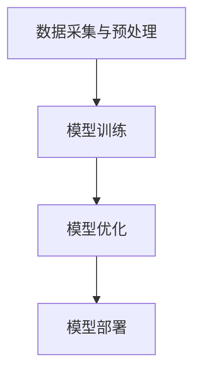
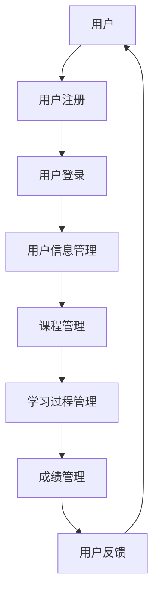
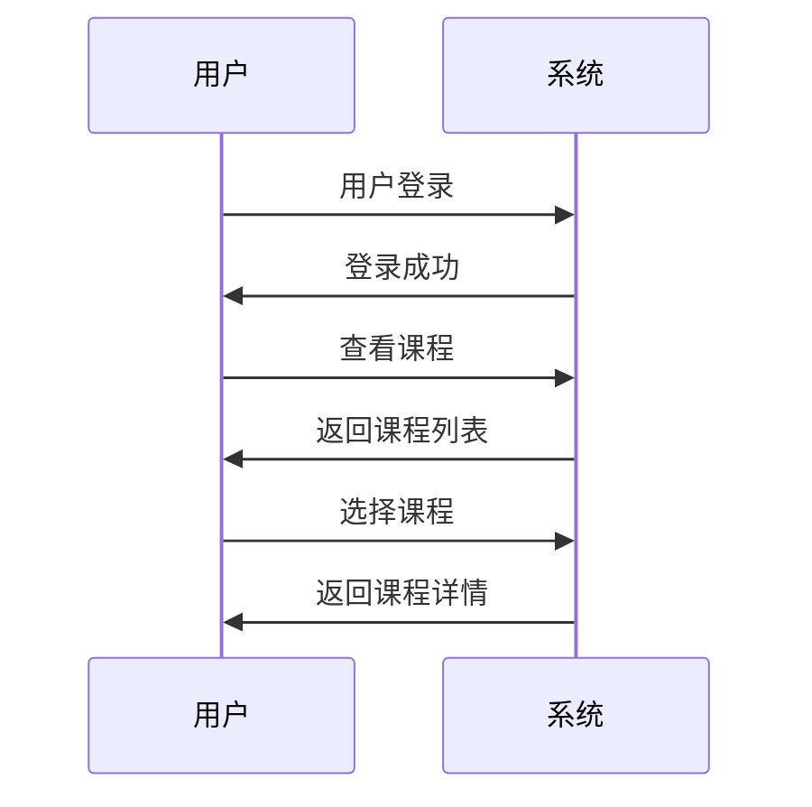

                 


# 虚拟教师 AI Agent：LLM 驱动的个性化教育系统

> 关键词：虚拟教师、AI Agent、LLM、个性化教育、教育系统

> 摘要：本文深入探讨了虚拟教师 AI Agent：LLM 驱动的个性化教育系统，从核心概念、算法原理、系统设计与实现等多个方面进行了详细阐述，旨在为广大读者提供一个全面的技术分析。

## 引言

在教育领域，传统的教学方式正在逐渐被现代化的教育技术所取代。特别是近年来，人工智能（AI）技术的飞速发展，使得个性化教育成为可能。本文将围绕虚拟教师 AI Agent：LLM 驱动的个性化教育系统，展开一系列的讨论。

## 第1章：问题背景与核心概念

### 1.1 虚拟教师与AI Agent概述

虚拟教师，顾名思义，是指利用计算机技术和人工智能技术模拟人类教师的教学过程，为学习者提供个性化的教育服务。而AI Agent，则是指具有智能行为和自主决策能力的实体，它可以在特定环境中执行任务，并与人类进行交互。

### 1.2 LLM在个性化教育中的应用

LLM（Large Language Model）是一种大型语言模型，它通过深度学习技术，可以从海量文本数据中学习语言模式和规律，实现对自然语言的生成和理解。在个性化教育中，LLM可以被用于生成个性化学习内容，根据学习者的特点和需求，提供定制化的教育服务。

### 1.3 AI Agent的发展现状与挑战

目前，AI Agent在教育领域的应用已经取得了一定的成果，但仍面临一些挑战，如数据隐私保护、算法公平性、系统稳定性等。这些挑战需要我们在设计和实现AI Agent时，进行深入的研究和解决。

## 第2章：核心概念与联系

### 2.1 自然语言处理基础

自然语言处理（NLP）是人工智能的一个重要分支，它旨在使计算机能够理解和处理人类自然语言。NLP的基础包括文本预处理、词嵌入、语言模型、文本分类、语义理解等。

### 2.2 机器学习与深度学习原理

机器学习是一种使计算机能够从数据中学习规律，并做出预测或决策的技术。深度学习是机器学习的一种重要方法，它通过多层神经网络结构，实现对数据的自动特征提取和建模。

### 2.3 教育数据挖掘与分析

教育数据挖掘是指从教育数据中提取有价值的信息和知识，以支持教育决策和教育改进。教育数据分析则是对教育数据进行的统计分析，以了解教育现象和规律。

## 第3章：算法原理讲解

### 3.1 LLM算法概述

LLM算法是指通过大规模训练语言模型，实现对自然语言的生成和理解。它主要包括模型训练、模型优化、模型部署等步骤。

### 3.2 算法流程与mermaid流程图

以下是LLM算法的基本流程：

1. 数据采集与预处理
2. 模型训练
3. 模型优化
4. 模型部署

以下是mermaid流程图：



### 3.3 Python代码实现与数学模型

以下是一个简单的LLM算法的Python代码实现：

```python
import torch
import torch.nn as nn

class LLM(nn.Module):
    def __init__(self):
        super(LLM, self).__init__()
        self.embedding = nn.Embedding(vocab_size, embed_size)
        self.lstm = nn.LSTM(embed_size, hidden_size)
        self.fc = nn.Linear(hidden_size, vocab_size)

    def forward(self, x):
        x = self.embedding(x)
        x, _ = self.lstm(x)
        x = self.fc(x[-1, :, :])
        return x
```

LLM的数学模型主要包括词嵌入、LSTM和全连接层。词嵌入用于将输入的单词转换为向量表示；LSTM用于处理序列数据，提取序列特征；全连接层用于将特征映射到输出。

$$
\text{词嵌入}:\text{word} \rightarrow \text{向量表示}
$$

$$
\text{LSTM}:\text{输入序列} \rightarrow \text{隐藏状态序列}
$$

$$
\text{全连接层}:\text{隐藏状态序列} \rightarrow \text{输出序列}
$$

## 第4章：数学模型与公式

### 4.1 LLM数学基础

LLM的数学基础主要包括线性代数、概率论和统计学、深度学习等。以下是一些常用的数学公式：

$$
\text{词嵌入}:\text{word} \rightarrow \text{向量表示}
$$

$$
\text{LSTM}:\text{输入序列} \rightarrow \text{隐藏状态序列}
$$

$$
\text{全连接层}:\text{隐藏状态序列} \rightarrow \text{输出序列}
$$

### 4.2 模型评估与优化

模型评估常用的指标包括准确率、召回率、F1值等。模型优化常用的方法包括梯度下降、Adam优化器等。

$$
\text{准确率} = \frac{\text{预测正确的样本数}}{\text{总样本数}}
$$

$$
\text{召回率} = \frac{\text{预测正确的正样本数}}{\text{实际为正样本的总数}}
$$

$$
\text{F1值} = 2 \times \frac{\text{准确率} \times \text{召回率}}{\text{准确率} + \text{召回率}}
$$

### 4.3 数学公式与LaTeX表示

以下是LaTeX表示的数学公式：

$$
\text{词嵌入}:\text{word} \rightarrow \text{向量表示}
$$

$$
\text{LSTM}:\text{输入序列} \rightarrow \text{隐藏状态序列}
$$

$$
\text{全连接层}:\text{隐藏状态序列} \rightarrow \text{输出序列}
$$

## 第5章：系统分析与架构设计

### 5.1 教育系统需求分析

教育系统需求分析主要包括学习者的特点、学习内容的需求、学习过程的需求等。

### 5.2 系统架构设计mermaid图

以下是教育系统的架构设计mermaid图：



### 5.3 系统接口设计与系统交互mermaid序列图

以下是系统接口设计mermaid序列图：



## 第6章：项目实战

### 6.1 环境搭建与准备

项目环境搭建主要包括Python环境、深度学习框架（如TensorFlow或PyTorch）的安装与配置。

### 6.2 系统核心实现

系统核心实现主要包括用户管理、课程管理、学习过程管理、成绩管理和用户反馈等功能。

### 6.3 代码应用解读与分析

以下是用户管理模块的代码应用解读与分析：

```python
# 用户注册功能
def register_user(username, password):
    # 验证用户名和密码是否符合要求
    if not validate_username(username) or not validate_password(password):
        return "用户名或密码不符合要求"

    # 存储用户信息到数据库
    store_user_info(username, password)
    return "注册成功"

# 用户登录功能
def login_user(username, password):
    # 验证用户名和密码是否正确
    if not check_user_info(username, password):
        return "用户名或密码错误"

    # 登录成功，返回用户ID
    return get_user_id(username)
```

### 6.4 案例分析

通过一个实际案例，我们可以看到如何使用LLM驱动的个性化教育系统，为学生提供个性化的学习内容和服务。

### 6.5 项目小结

通过对项目的实战分析，我们可以看到LLM驱动的个性化教育系统在提高教育效率、实现个性化学习方面具有巨大的潜力。但同时也需要我们进一步研究和解决一些技术挑战，如数据隐私保护、算法公平性等。

## 第7章：最佳实践与总结

### 7.1 实践技巧与注意事项

在设计和实现LLM驱动的个性化教育系统时，我们需要注意以下几点：

- 确保数据质量和数据安全
- 选择合适的算法和模型
- 优化系统性能和用户体验

### 7.2 小结与展望

本文通过对虚拟教师 AI Agent：LLM 驱动的个性化教育系统的深入探讨，总结了核心概念、算法原理、系统设计与实现等方面的内容。我们期待未来在这个领域有更多的研究成果和实际应用。

### 7.3 拓展阅读

- [1] 深度学习与NLP综述：https://www.deeplearning.ai/
- [2] 个性化教育技术研究：https://ieeexplore.ieee.org/
- [3] 虚拟教师与AI Agent应用案例：https://aiagent.org/

## 结语

虚拟教师 AI Agent：LLM 驱动的个性化教育系统是一个充满挑战和机遇的领域。我们期待广大开发者和技术爱好者能够在这个领域不断探索，共同推动教育技术的发展。

### 作者信息

作者：AI天才研究院/AI Genius Institute & 禅与计算机程序设计艺术 /Zen And The Art of Computer Programming

以上是本文的完整内容，希望对您有所启发和帮助。如果您有任何问题或建议，欢迎随时联系作者。谢谢！

