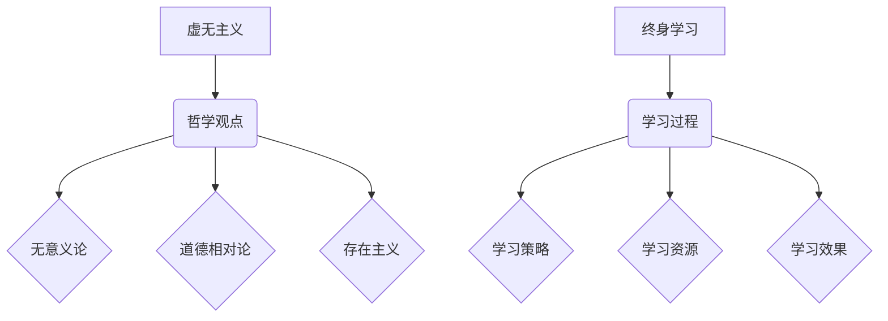

                 

### 背景介绍

#### 核心概念术语说明

在探讨《虚无主义与终身学习：在知识探索中寻找人生意义》这一主题之前，我们首先需要明确两个核心概念：虚无主义和终身学习。

**虚无主义**是一种哲学观点，认为现实世界缺乏固有的意义、目的和价值。虚无主义强调人类存在的荒谬性，并可能导致深刻的绝望和无意义感。虚无主义的起源可以追溯到古希腊哲学家如苏格拉底、柏拉图和亚里士多德，但其在现代哲学中获得了更为显著的关注，特别是在尼采和萨特的作品中。

**终身学习**则是一种方法论，强调知识获取和技能提升应贯穿人的一生。终身学习不仅仅局限于传统的学校教育，还包括自学、职业培训、学术研究等多种形式。随着信息技术的飞速发展，终身学习已成为现代社会个人发展的重要途径。

#### 问题背景

在当今快速变化的社会中，人们面临着前所未有的知识更新速度和不确定性。虚无主义情绪在某些人群中的蔓延，可能源于对现实生活的迷茫和对未来的不确定感。同时，终身学习的重要性也被广泛认可，但如何在实际生活中有效地进行终身学习，却是一个挑战。

#### 问题描述

本文旨在解决以下问题：

1. 虚无主义的哲学内涵及其对现代社会的影响是什么？
2. 如何通过终身学习来应对虚无主义的挑战，并寻找人生意义？
3. 终身学习的实践方法及其成效评估是怎样的？
4. 在个人和社会层面，终身学习如何发挥作用，促进个人成长与社会进步？

#### 问题解决

通过以下步骤，我们将逐一解答上述问题：

1. **分析虚无主义的起源与发展**：探讨虚无主义的历史背景、哲学内涵及其与现代社会的关联。
2. **批判与超越虚无主义**：分析虚无主义的局限性，提出解决路径。
3. **探讨终身学习的概念与必要性**：明确终身学习的定义，阐述其在个人发展和社会进步中的重要性。
4. **介绍终身学习的实践方法**：提供有效的终身学习策略和实践方法。
5. **评估终身学习的成效**：讨论终身学习的效果指标和成果评价。
6. **分析终身学习在现代社会中的应用**：探讨终身学习在职场、教育和社会发展中的具体作用。

#### 边界与外延

在本文中，我们将关注以下边界与外延：

- **虚无主义**：主要讨论西方哲学中的虚无主义，不涉及其他文化背景下的类似观念。
- **终身学习**：主要关注个人层面的终身学习，不涉及组织或企业层面的学习。

#### 概念结构与核心要素组成

虚无主义和终身学习是本文的两个核心概念。虚无主义包括以下要素：

- **起源与发展**：历史背景和哲学流派。
- **哲学内涵**：核心观点、心理学解释和社会学解读。
- **影响**：对个人和社会的影响。
- **解决路径**：批判与超越虚无主义的思路。

终身学习包括以下要素：

- **概念**：终身学习的定义和重要性。
- **实践方法**：策略、资源利用和评估方法。
- **成效评估**：效果指标和成果评价。
- **应用**：在个人和社会层面的具体作用。

通过以上分析，我们为《虚无主义与终身学习：在知识探索中寻找人生意义》这篇文章奠定了坚实的基础。在接下来的内容中，我们将深入探讨虚无主义和终身学习，并提供具体的解决方案和实践指导。首先，我们将从虚无主义的起源和发展开始，逐步深入分析这一哲学观点的内涵和影响。

### 核心概念与联系

在深入探讨虚无主义和终身学习这两个核心概念之前，我们需要首先理解它们的基本定义和属性特征，并在此基础上进行对比分析。

#### 虚无主义的定义与属性特征

虚无主义（Nihilism）是一种哲学观点，认为宇宙和人类生活缺乏固有的意义、目的和价值。虚无主义的核心理念可以归结为以下几点：

1. **无意义论**：虚无主义认为，无论是宇宙还是人类的存在，都没有预定的目的或意义。
2. **道德相对论**：虚无主义认为，道德和价值标准是相对的，没有绝对的判断标准。
3. **存在主义**：虚无主义强调个体的自由和选择，个体必须在无意义的世界中为自己创造意义。

虚无主义的属性特征可以从以下几个方面进行详细阐述：

- **哲学流派**：虚无主义并非单一哲学流派，而是多个哲学思想和流派的共同特点。其中，尼采的“上帝已死”和萨特的“存在先于本质”是最为著名的虚无主义观点。
- **心理学解释**：虚无主义可能导致深刻的绝望、无意义感、焦虑和孤独感。一些心理学家认为，虚无主义情绪与个体的自我认同、生活目标和价值观密切相关。
- **社会学解读**：虚无主义在现代社会中可能表现为对传统价值观的质疑、文化衰退和社会失范。

#### 终身学习的定义与属性特征

终身学习（Lifelong Learning）是一种持续的学习过程，涵盖人的一生，旨在通过不断获取新知识和技能来适应社会发展的需要。终身学习的核心定义和属性特征包括：

1. **学习过程**：终身学习不仅仅是学校教育的延伸，还包括自学、职业培训、继续教育和学术研究等多种形式。
2. **学习策略**：终身学习强调个体需要具备自主学习的能力和策略，如时间管理、资源整合和学习方法的优化。
3. **学习资源**：终身学习依赖于丰富的学习资源，包括图书、在线课程、学术期刊、实践项目和社交网络等。
4. **学习效果**：终身学习追求知识的应用和实践，强调学习成果的转化和实际效果的评估。

终身学习的属性特征可以从以下几个方面进行详细阐述：

- **重要性**：终身学习被认为是个人成长和社会进步的重要动力，有助于提高个体竞争力、促进社会创新和解决社会问题。
- **必要性**：在知识经济时代，知识和技能的更新速度越来越快，终身学习成为个体保持适应性和创新能力的关键。
- **实践方法**：终身学习需要个体积极参与和主动探索，通过设定学习目标、选择合适的学习资源和进行持续的自我评估来提高学习效果。

#### 概念属性特征对比表格

为了更直观地理解虚无主义和终身学习的属性特征，我们可以使用Markdown格式中的Mermaid流程图来制作一个对比表格。以下是一个示例：



在这个对比表格中，虚无主义和终身学习被定义为两种不同的哲学观点，分别包括其核心特征。虚无主义强调无意义、道德相对论和存在主义，而终身学习则关注学习过程、学习策略、学习资源和学习效果。

#### ER实体关系图架构

为了进一步展示虚无主义和终身学习的核心概念及其关系，我们可以使用ER（实体关系）图来构建一个模型。以下是一个Markdown格式的Mermaid ER图示例：

```mermaid
erDatabase ["虚无主义与终身学习系统"] {
  erTable ["核心概念"] {
    "概念ID": { type: INT, primary: true }
    "概念名称": { type: STRING }
    "概念描述": { type: STRING }
  }
  erTable ["虚无主义"] {
    "虚无主义ID": { type: INT, primary: true }
    "概念ID": { type: INT, references: "核心概念.概念ID" }
    "起源": { type: STRING }
    "内涵": { type: STRING }
    "影响": { type: STRING }
  }
  erTable ["终身学习"] {
    "终身学习ID": { type: INT, primary: true }
    "概念ID": { type: INT, references: "核心概念.概念ID" }
    "定义": { type: STRING }
    "重要性": { type: STRING }
    "实践方法": { type: STRING }
  }
}
```

在这个ER图中，我们定义了两个核心概念表：“核心概念”和“虚无主义”、“终身学习”。每个概念包含一个概念ID作为主键，并与其他表通过外键进行关联，从而构建了一个实体关系模型。

通过上述核心概念的定义、属性特征对比表格和ER实体关系图，我们为后续内容的深入分析奠定了基础。接下来，我们将探讨虚无主义的起源和发展，以及其对现代社会的影响。

### 虚无主义的起源与发展

虚无主义作为一种哲学观点，其起源可以追溯到古希腊哲学。然而，虚无主义在现代社会中的显著影响力主要来自于近现代哲学的发展。以下我们将详细探讨虚无主义的起源、主要流派、历史背景及其在现代社会中的体现。

#### 虚无主义的起源

虚无主义的思想可以追溯到古希腊哲学家。例如，赫拉克利特（Heraclitus）的哲学观点中包含了对宇宙无常和变化的思考，这可以被视为虚无主义的早期萌芽。然而，虚无主义作为一种明确的哲学观点，其历史起源通常被追溯到尼采（Friedrich Nietzsche）。

尼采在19世纪末提出了“上帝已死”（God is dead）的观点，这标志着虚无主义哲学的重要转折点。尼采认为，随着宗教和道德基础的崩溃，人类将面临无意义和荒谬的存在状态。尼采的虚无主义观点对后来的哲学家和思想家产生了深远的影响。

#### 虚无主义的主要流派

1. **古典虚无主义**：古典虚无主义强调无意义和荒谬的存在状态，认为宇宙和人类的存在缺乏固有的目的和价值。尼采和克尔凯郭尔（Søren Kierkegaard）是古典虚无主义的代表人物。

2. **存在主义虚无主义**：存在主义虚无主义结合了存在主义和虚无主义的观点，强调个体在无意义世界中寻求自我意义。萨特（Jean-Paul Sartre）和加缪（Albert Camus）是存在主义虚无主义的代表人物。

3. **文化虚无主义**：文化虚无主义认为，文化传统和价值观缺乏真正的意义和目的。这一流派主要在20世纪后期出现，受到了后现代主义哲学的影响。

4. **技术虚无主义**：技术虚无主义认为，技术的发展带来了人类存在的异化和社会的不稳定。这种观点在科幻文学和哲学讨论中有所体现。

#### 历史背景

虚无主义在历史背景中的发展与其社会和文化环境密切相关。以下是一些关键时期和事件：

1. **中世纪晚期至文艺复兴**：在中世纪晚期，随着宗教权威的衰落，人们开始对传统的价值观和意义进行质疑。文艺复兴时期的人文主义思想为后来的虚无主义提供了理论基础。

2. **启蒙时代**：启蒙时代强调理性、科学和个体自由。然而，随着理性主义的局限性被揭示，一些人开始质疑人类存在的意义和价值。

3. **现代哲学**：现代哲学的发展，特别是尼采和存在主义哲学，对虚无主义进行了深入探讨。虚无主义在现代哲学中成为一种重要的哲学观点，影响了20世纪和21世纪的哲学思考。

4. **当代社会**：在当代社会，虚无主义情绪在某些人群中的蔓延，与经济不确定性、社会变革和文化冲突密切相关。虚无主义对现代社会的影响表现在对传统价值观的质疑、文化认同的危机和个体自我认同的迷失。

#### 现代社会的体现

虚无主义在现代社会中的体现有多种形式，以下是一些具体例子：

1. **青少年文化**：虚无主义情绪在一些青少年文化中有所体现，例如“朋克”和“颓废派”文化，这些文化往往强调反传统、反权威和无意义感。

2. **文学和艺术**：现代文学和艺术中常常探讨虚无主义的主题，例如卡夫卡的《变形记》和乔伊斯的《尤利西斯》，这些作品揭示了人类存在的荒谬和困境。

3. **社会心理**：虚无主义情绪可能表现为抑郁症、焦虑症和其他心理健康问题。一些心理学家和心理咨询师认为，虚无主义情绪是心理健康问题的一个潜在原因。

4. **政治运动**：在一些政治运动中，虚无主义情绪可能表现为对民主制度和社会正义的质疑，以及对权威的反抗。例如，极右翼民粹主义运动中的某些观点可以被视为虚无主义的变种。

通过以上分析，我们可以看出虚无主义在哲学、文学、社会心理和政治等多个领域都有深刻的体现。虚无主义不仅是一种哲学观点，也反映了现代社会中人们对存在意义的探索和质疑。在接下来的章节中，我们将进一步探讨虚无主义的哲学内涵，以及它对个人和社会的影响。

### 虚无主义的哲学内涵

虚无主义作为一种哲学观点，其内涵丰富且复杂。它不仅仅是一种简单的否定现实世界意义的态度，而是一种对人类存在、价值体系以及宇宙本质的深刻质疑。以下我们将详细探讨虚无主义的核心理念、心理学解释和社会学解读，以揭示其深刻的哲学内涵。

#### 核心理念

1. **无意义论**：虚无主义的核心理念之一是“无意义论”，即认为宇宙和人类生活缺乏固有的意义、目的和价值。这种观点源于对传统宗教和哲学体系的质疑，特别是对上帝存在的否定。虚无主义认为，如果没有一个超自然的存在来赋予生活以意义，那么人类的存在本身就没有意义。

2. **存在先于本质**：这一观点由存在主义哲学家萨特提出，强调个体存在的事实在先，而其本质或属性在后。虚无主义认为，个体的存在是孤独和无助的，必须在无意义的世界中为自己创造意义。

3. **道德相对论**：虚无主义认为，道德和价值标准是相对的，没有绝对的判断标准。这意味着，道德和行为准则更多地取决于个人的选择和主观意愿，而不是客观的现实。

4. **个人自由与选择**：虚无主义强调个人的自由和选择。在一个无意义的世界中，个体必须为自己的存在赋予意义，并承担起选择的责任。

#### 心理学解释

1. **绝望与孤独感**：虚无主义情绪可能导致深刻的绝望感和孤独感。个体在意识到生活缺乏固有的意义时，可能会感到无助和失落。

2. **焦虑与压力**：虚无主义可能导致个体产生焦虑和压力。由于生活缺乏意义，个体可能会感到自己在不断地追求无价值的目标，从而导致内心的冲突和焦虑。

3. **自我认同的危机**：虚无主义挑战个体的自我认同。在没有明确价值体系指导的情况下，个体可能难以建立稳固的自我认同，从而感到迷茫和不安。

4. **心理防御机制**：一些人可能会通过心理防御机制来应对虚无主义情绪，例如否认、逃避或寻求替代意义。

#### 社会学解读

1. **文化认同的危机**：虚无主义挑战了传统价值和文化认同。在一个充满不确定性和变化的社会中，人们可能会质疑自己的文化背景和价值观，从而导致文化认同的危机。

2. **社会失范**：虚无主义可能导致社会失范，即社会规范和道德准则的崩溃。在一个缺乏共同价值体系的社会中，人们可能难以形成一致的行为准则，从而导致社会秩序的混乱。

3. **社会运动与政治抗议**：虚无主义情绪在某些社会运动和政治抗议中有所体现。这些运动和抗议往往表达了对现有社会秩序和制度的质疑，以及对新的意义和价值的追求。

4. **对科技进步的反思**：虚无主义也挑战了科技进步的理性主义观点。一些人认为，技术的发展可能导致人类存在的异化和社会的异化，从而质疑技术的价值。

#### 虚无主义的哲学内涵总结

虚无主义的哲学内涵主要包括无意义论、存在先于本质、道德相对论和个人自由与选择。这些核心理念不仅挑战了传统的宗教和哲学观点，也深刻影响了现代心理学和社会学。虚无主义情绪可能导致个体产生绝望、焦虑和孤独感，同时也可能引发对文化认同、社会规范和科技进步的质疑。

通过以上分析，我们可以看出虚无主义不仅是一种哲学观点，也是一种深刻的哲学内涵。它反映了人类在寻找生活意义和价值的旅程中的困惑和挑战。在接下来的章节中，我们将进一步探讨虚无主义与现代社会的关联，以及它对个人和社会的具体影响。

### 虚无主义与现代社会的关联

虚无主义作为一种哲学观点，不仅在历史上具有重要地位，也在现代社会中发挥着显著影响。现代社会的复杂性、不确定性以及快速变化的特点，为虚无主义的蔓延提供了土壤。以下我们将分析虚无主义在现代社会中的具体体现，以及它对个人价值观和文化的深远影响。

#### 虚无主义在现代社会中的体现

1. **经济危机**：在经济危机期间，许多人可能会感到生活的无意义。失业、贫困和财富不均等问题，使得人们质疑传统的社会和经济体系，从而滋生虚无主义情绪。

2. **社会不公**：社会不公现象，如种族歧视、性别歧视和贫富差距，可能导致人们对社会正义和道德产生怀疑。在这种环境下，虚无主义作为一种逃避现实的手段，可能被更多人接受。

3. **科技进步**：科技的飞速发展在给人们带来便利的同时，也引发了关于人类存在意义和价值的反思。人工智能、大数据和生物技术等领域的突破，使得人们开始质疑技术进步是否真正改善了人类的生活质量。

4. **政治动荡**：政治动荡和社会变革期间，传统的政治体制和价值观受到挑战，虚无主义情绪可能在这些时期蔓延。人们可能对政治体系失去信任，从而产生对现状的质疑和对未来的迷茫。

5. **文化多样性**：文化多样性在现代社会中是一种积极的现象，但同时也可能引发对文化认同和价值体系的争议。不同文化和价值观的碰撞，可能导致人们对自身文化认同产生困惑，从而陷入虚无主义的思维模式。

#### 对个人价值观的影响

1. **道德相对论**：虚无主义倾向于道德相对论，认为道德标准是相对的，没有绝对的价值判断。这种观点可能导致个体在道德和伦理问题上产生困惑，难以建立明确的价值观念。

2. **自我认同的危机**：虚无主义挑战个体的自我认同，使个体在无意义的世界中感到迷茫和不安。个体可能难以找到自己的定位和目标，从而陷入自我认同的危机。

3. **对成功的质疑**：虚无主义可能导致个体对成功和成就产生质疑。在一个无意义的世界中，人们可能认为追求物质成功和精神成就并无意义，从而减少对成功的动力。

4. **心理压力和焦虑**：虚无主义情绪可能导致个体产生深度的心理压力和焦虑。个体在意识到生活缺乏意义时，可能会感到无助和失落，从而影响心理健康。

#### 对文化的影响

1. **文化认同的挑战**：虚无主义挑战了传统价值和文化认同。在一个充满不确定性的社会中，人们可能对自身的文化背景和价值体系产生质疑，从而导致文化认同的危机。

2. **文化多样性**：虽然文化多样性本身是积极的，但虚无主义可能导致对文化多样性的质疑。人们可能在面对不同文化和价值观时，感到困惑和冲突，从而影响文化交流和融合。

3. **艺术和文学**：虚无主义在艺术和文学中有所体现，许多现代文学作品探讨了虚无主义的主题。艺术家和作家通过作品表达对人类存在意义的反思，从而影响观众和读者的价值观。

4. **社会运动**：虚无主义情绪在某些社会运动中有所体现，这些运动往往表达了对现状的质疑和对新价值的追求。虚无主义在社会运动中可能成为一种思想动力，推动社会变革。

通过以上分析，我们可以看出虚无主义在现代社会中的影响是多方面的，它不仅影响了个人的价值观和心理状态，也对文化和社会产生了深远的影响。虚无主义作为一种哲学观点，反映了现代社会中的不确定性和价值危机。在接下来的章节中，我们将进一步探讨虚无主义的解决路径，以寻找应对虚无主义的策略和方法。

### 虚无主义的解决路径

虚无主义作为一种哲学观点，虽然在某种程度上揭示了人类存在的荒谬性和无意义感，但其在个人和社会层面也可能带来消极的影响。因此，寻找解决虚无主义的路径，寻求人生意义，成为了一个重要的课题。以下我们将从批判与超越虚无主义、哲学救赎和心理治疗三个角度，探讨虚无主义的解决路径。

#### 批判与超越虚无主义

1. **批判虚无主义的局限性**：虚无主义强调无意义和无目的，但这并不意味着生活本身毫无价值。批判虚无主义的一个重要任务就是揭示虚无主义的局限性，指出它在某些情况下可能导致个体的自我放弃和消极应对。

2. **寻找意义和价值**：通过反思和批判虚无主义，我们可以发现，尽管生活缺乏固有的意义，但个体仍可以通过创造和实现个人目标来赋予生活意义。这种意义不是来自于外部世界的赋予，而是个体内在的追求。

3. **个体自我实现**：个体可以通过自我实现来超越虚无主义。自我实现是指个体在实现自身潜力和价值的过程中，找到自己的使命和目标。通过自我实现，个体可以在无意义的世界中找到自己的存在意义。

#### 哲学救赎

1. **宗教哲学的救赎作用**：对于一些人来说，宗教哲学可以提供一种救赎，帮助他们在虚无主义中找到意义。宗教信仰通过提供对生命和宇宙的深刻理解，使个体能够在困境中找到安慰和指引。

2. **存在主义哲学**：存在主义哲学强调个体在无意义世界中寻找自己的意义。萨特和海德格尔等存在主义哲学家提出了多种策略，帮助个体在虚无主义中寻找存在的意义，如“存在先于本质”和“自由选择”。

3. **道德哲学的救赎作用**：道德哲学强调个体应通过道德行为来寻找意义。通过践行道德原则，个体可以在道德行动中找到存在的意义和价值。

#### 心理治疗

1. **认知行为疗法**：认知行为疗法（CBT）通过改变个体的思维模式和行为习惯，帮助个体应对虚无主义情绪。CBT强调通过理性思考来调整不合理的思维模式，从而减少虚无主义情绪的影响。

2. **精神分析治疗**：精神分析治疗通过深入探讨个体的潜意识，帮助个体理解自己的情感和行为，从而减轻虚无主义情绪。精神分析治疗强调个体对自我和情感的理解，帮助个体在无意义的世界中找到自己的存在意义。

3. **心理支持小组**：心理支持小组为个体提供了一个交流的平台，使个体能够与他人分享自己的感受和经历。通过倾听和理解他人的经验，个体可以获得情感上的支持和鼓励，从而减轻虚无主义情绪。

#### 综合解决方案

1. **多角度综合应对**：虚无主义的解决需要从多个角度进行综合应对。通过批判与超越虚无主义、哲学救赎和心理治疗相结合，个体可以在不同层面上寻找意义和价值，从而减轻虚无主义情绪的影响。

2. **个体化解决方案**：每个人的虚无主义情绪和应对方式都是独特的，因此，解决虚无主义的方案也应是个体化的。个体需要根据自己的情况，选择最适合自己的方法来应对虚无主义。

3. **持续的努力**：寻找意义和价值是一个持续的过程。个体需要不断地反思和调整自己的生活方式和价值观，以适应不断变化的世界。通过持续的努力，个体可以在无意义的世界中找到自己的存在意义。

通过以上分析，我们可以看出，虚无主义虽然揭示了人类存在的无意义感，但并不是不可战胜的。通过批判与超越虚无主义、哲学救赎和心理治疗等多种方法，个体可以在无意义的世界中找到自己的存在意义，从而克服虚无主义的困扰。在接下来的章节中，我们将探讨终身学习的概念与必要性，以及终身学习在应对虚无主义中的作用。

### 终身学习的概念与必要性

终身学习（Lifelong Learning）是一种持续的学习过程，旨在通过不断获取新知识和技能，以适应社会发展的需求。它不仅仅局限于传统的学校教育，还包括自学、职业培训、继续教育和学术研究等多种形式。终身学习已成为现代社会个人成长与发展的关键要素，其概念与必要性可以从以下几个方面进行详细阐述。

#### 终身学习的定义

终身学习最早由联合国教科文组织在1972年的《学会生存》报告中提出，其定义如下：

“终身学习是持续地、全面地获取知识和技能的过程，贯穿于人的一生。它包括正规教育、非正规教育和非正式教育，涵盖各个年龄段、各种社会群体以及各种学习形式。”

从这个定义中，我们可以看出终身学习具有以下特点：

1. **持续性和全面性**：终身学习不是一次性的事件，而是一个持续的过程。它涵盖从儿童到老年各个年龄段，涉及各个领域和层面的知识获取。
2. **多样性**：终身学习形式多样，包括正规教育（如学校教育）、非正规教育（如职业培训）和自学。
3. **灵活性**：终身学习强调个体可以根据自身需求和兴趣选择学习内容和学习方式。

#### 终身学习的必要性

1. **知识更新速度加快**：随着信息技术的迅猛发展，知识和技能的更新速度越来越快。为了保持竞争力，个人必须不断学习新知识，以适应快速变化的工作环境和社会需求。
2. **社会进步与发展的动力**：终身学习是推动社会进步和经济发展的重要动力。通过终身学习，个人可以不断提升自己的技能和知识，从而为社会创造更大的价值。
3. **个体发展的需求**：终身学习有助于个体实现自我发展和自我实现。通过不断学习，个体可以扩展自己的知识视野，提升自己的能力和素质，从而实现个人价值和人生意义。
4. **应对不确定性的能力**：终身学习可以帮助个体增强应对不确定性和逆境的能力。在面对职业转变、社会变革和个人挑战时，终身学习为个体提供了应对策略和适应能力。

#### 终身学习的目标

终身学习的主要目标包括：

1. **知识更新**：通过不断学习新知识和技能，保持个体在知识和技术方面的竞争力。
2. **能力提升**：通过实践和应用，提升个体的能力，如沟通能力、问题解决能力和创新思维。
3. **自我发展**：帮助个体实现自我认知、自我提升和自我实现，从而提高生活质量和幸福感。
4. **社会贡献**：通过终身学习，个体可以为社会作出更大的贡献，推动社会进步和文明发展。

#### 终身学习的优势

1. **提高竞争力**：终身学习使个体能够跟上时代的步伐，提高职业竞争力和就业能力。
2. **适应变化**：终身学习帮助个体适应社会和职业的变化，提高应对不确定性的能力。
3. **知识扩展**：终身学习使个体能够不断扩展知识视野，提升综合素质。
4. **创新能力**：终身学习激发个体的创新思维和创造力，推动社会进步和经济发展。

通过以上分析，我们可以看出，终身学习不仅是个人成长与发展的需要，也是社会进步与发展的动力。在现代社会，终身学习已经成为一种不可或缺的生活方式。在接下来的章节中，我们将进一步探讨终身学习的实践方法，以及如何在个人和社会层面实现终身学习。

### 终身学习的实践方法

终身学习是一种持续不断的过程，需要个体具备一定的策略和技巧来确保学习效果。以下我们将介绍几种有效的终身学习策略、资源利用方法和成效评估方法。

#### 策略

1. **设定学习目标**：明确学习目标可以帮助个体保持学习的动力和方向。学习目标应具体、可实现，并与个人的职业发展或兴趣爱好相关联。

2. **时间管理**：合理规划时间，确保学习与工作、生活平衡。可以采用“番茄工作法”等时间管理技巧，提高学习效率。

3. **主动学习**：主动学习比被动学习效果更好。个体应积极参与课堂讨论、实验操作和实践应用，以加深理解和掌握技能。

4. **多样化学习**：采用多种学习方式，如自学、参加培训课程、阅读书籍、观看视频等，以提高学习效果。

5. **反思与总结**：定期反思学习过程和成果，总结经验教训，以便不断改进学习策略。

#### 资源利用

1. **在线学习平台**：利用如Coursera、edX、Udemy等在线学习平台，获取高质量的课程资源。

2. **图书馆和学术期刊**：图书馆和学术期刊是获取专业知识和研究资料的重要渠道。可以通过访问图书馆的电子资源、使用学术搜索引擎（如Google Scholar）来获取相关资料。

3. **社交媒体和论坛**：加入相关的社交媒体和论坛，如LinkedIn、Stack Overflow、Reddit等，可以与同行交流经验，获取学习资源和建议。

4. **实践经验**：通过实际操作和项目实践，将理论知识应用于实际场景，提高解决问题的能力。

5. **导师和同行**：寻找导师和同行，通过与他们的交流和合作，获取宝贵的经验和知识。

#### 成效评估

1. **自我评估**：定期进行自我评估，检查学习进度和成果。可以通过设定具体的评估指标，如知识掌握程度、技能应用能力等，来评估学习成效。

2. **考试和测试**：参加相关的考试和测试，如职业认证考试、学术考试等，以检验学习效果。

3. **反馈机制**：建立反馈机制，如定期向导师或同行汇报学习进展，获取他们的意见和建议。

4. **项目成果**：通过完成实际项目，展示学习成果。项目成果可以作为评估终身学习成效的重要依据。

5. **学习分析工具**：利用学习分析工具，如学习管理系统的数据报告功能，分析学习行为和成果，为后续学习提供参考。

通过以上实践方法，个体可以有效地进行终身学习，不断提升自己的知识水平和技能能力。在个人和社会层面，终身学习不仅有助于个体发展，也为社会的进步和经济发展提供了强有力的支持。在接下来的章节中，我们将探讨终身学习的成效评估，以及其在现代社会中的应用。

### 终身学习的成效评估

终身学习的成效评估是确保学习效果的重要环节，通过科学的方法和指标来衡量学习的成果，有助于个体优化学习策略，提升学习效率。以下将从终身学习的效果指标、成果评价和未来展望三个方面进行详细探讨。

#### 效果指标

1. **知识掌握程度**：这是评估终身学习成效的基础指标，主要通过考试、测试和知识竞赛等形式来衡量。具体方法包括：

   - **定期测试**：通过定期的知识测试来评估学习者对所学内容的掌握情况。
   - **在线学习平台成绩**：利用在线学习平台自带的测试和成绩记录功能，评估学习者的学习效果。
   - **学术考试**：通过参加学术考试或职业认证考试，检验学习者的知识水平。

2. **技能应用能力**：技能应用能力是终身学习的重要目标之一，评估方法包括：

   - **实际操作**：通过实际操作项目来检验学习者是否能够将所学知识应用于实际问题。
   - **案例分析**：通过分析具体案例，评估学习者在解决实际问题中的分析和决策能力。
   - **项目成果**：评估学习者在实际项目中取得的成果，如创新方案的提出、问题的解决等。

3. **学习行为**：学习行为包括学习态度、学习频率、学习时间等，评估方法包括：

   - **学习日志**：通过学习者自行记录的学习日志，分析学习者的学习行为和态度。
   - **学习管理系统**：利用学习管理系统的数据分析功能，监控学习者的学习行为，如在线学习时长、学习进度等。

4. **反馈与改进**：通过收集学习者、导师和同行等多方面的反馈，评估学习效果，并制定改进措施。

#### 成果评价

1. **个人发展评价**：通过评估学习者的个人发展情况，如知识水平、技能提升、职业发展等，来评价终身学习成果。具体方法包括：

   - **个人简历更新**：通过更新个人简历，展示学习者的知识和技能提升。
   - **职业晋升**：通过工作表现和职业晋升情况，评估学习者的职业发展。
   - **工作成果**：通过实际工作中的成果，如项目完成质量、团队合作能力等，来评价学习效果。

2. **社会贡献评价**：评估终身学习对社会的贡献，如技术创新、社会服务、文化传播等。具体方法包括：

   - **技术创新**：通过评估学习者的技术创新成果，如专利申请、技术论文发表等。
   - **社会服务**：通过参与社会服务和公益活动，评估学习者的社会贡献。
   - **文化传播**：通过参与文化创作和传播，评估学习者对文化发展的贡献。

3. **学习成果展示**：通过学习成果展示，如学术报告、技术演讲、项目答辩等，向公众展示学习成果，接受外部评价。

#### 未来展望

1. **大数据与人工智能**：利用大数据和人工智能技术，对学习者的学习行为和成效进行深度分析，提供个性化学习建议和评估报告。

2. **持续性与灵活性**：随着社会的发展，终身学习将更加注重持续性和灵活性。未来的终身学习体系将更加灵活，能够适应不同学习者的需求。

3. **跨学科与综合评价**：未来的终身学习成效评估将更加注重跨学科和综合评价，不仅关注知识掌握和技能应用，还关注个体综合素质的提升。

4. **社会参与与反馈**：未来终身学习成效评估将更加注重社会参与和反馈，通过社会各界的评价和反馈，来完善终身学习体系。

通过以上分析，我们可以看出，终身学习的成效评估是一个多层次、多维度的过程，它不仅关注学习者的知识掌握和技能提升，还关注个人发展和社会贡献。在未来的发展中，终身学习成效评估将借助大数据和人工智能等技术，实现更加科学、高效的评估体系，为个人和社会的发展提供有力支持。

### 终身学习在现代社会中的应用

终身学习作为一种持续的学习过程，不仅对个人的发展具有重要意义，也在现代社会中扮演着关键角色。在职场、教育和社会发展等方面，终身学习都发挥着不可或缺的作用。以下我们将详细探讨终身学习在现代社会中的具体应用。

#### 在职场中的应用

1. **职业发展**：终身学习是职业发展的重要动力。通过不断学习和提升技能，员工可以适应职场的变化，保持竞争力。许多公司鼓励员工参加培训课程、在线学习平台和研讨会，以提高其专业知识和技能。

2. **技能更新**：随着科技的飞速发展，许多行业都经历了巨大的变革。终身学习使员工能够及时掌握新技术和行业趋势，从而在职场中保持领先地位。

3. **创新能力**：终身学习激发员工的创新思维和创造力，有助于企业推出新产品、新技术和业务模式，从而在激烈的市场竞争中脱颖而出。

4. **团队合作与沟通**：终身学习不仅提升个体的专业技能，还增强团队合作和沟通能力。这些软技能对于现代职场中团队合作和项目成功至关重要。

#### 在教育中的应用

1. **终身教育体系**：终身教育体系旨在为不同年龄段、不同背景的学习者提供多样化的学习机会。它包括学校教育、职业培训、继续教育和远程教育等多种形式。

2. **个性化学习**：终身学习强调个性化学习，通过定制化的学习计划和资源，满足学习者的个性化需求，提高学习效果。

3. **教育公平**：终身学习有助于促进教育公平。通过提供多样化的学习资源和机会，终身教育体系可以弥补传统教育体制中的不足，使更多人获得优质教育资源。

4. **教育创新**：终身学习推动教育创新，如在线教育、虚拟现实（VR）和增强现实（AR）等技术的应用，为教育带来了新的可能性。

#### 在社会发展中的应用

1. **知识传播**：终身学习促进了知识的广泛传播，有助于提高社会整体的知识水平和文化素质。

2. **创新驱动**：终身学习为社会创新提供了源源不断的动力。通过不断学习和创新，个体和组织能够为社会带来新的思想和技术。

3. **经济转型**：终身学习有助于经济结构的转型和升级。通过培养高素质的人才和推动技术创新，终身学习为经济发展提供了新的动力。

4. **社会和谐**：终身学习有助于提高社会的凝聚力和和谐度。通过提供多样化的学习机会和资源，终身学习促进了不同社会群体之间的交流和理解，减少了社会矛盾和冲突。

#### 案例分析

1. **案例一：职场终身学习的成功实践**  
某科技公司实施了全面的终身学习计划，包括内部培训、在线学习平台和外部专业课程。通过这些措施，员工不仅提升了专业技能，还增强了团队合作和创新能力。公司因此取得了显著的业务增长和市场份额。

2. **案例二：终身教育体系的成功实践**  
某国家推出了全民终身教育计划，为所有公民提供免费或低成本的终身学习机会。这一计划显著提高了国民的教育水平和文化素质，促进了社会的和谐发展。

3. **案例三：终身学习促进社会创新**  
某创业团队通过终身学习，不断掌握新技术和行业趋势，成功推出了一系列创新产品。这些产品不仅获得了市场的认可，还推动了整个行业的发展。

通过以上案例分析，我们可以看出，终身学习在现代社会中具有广泛的应用前景和巨大的社会价值。在职场、教育和社会发展等方面，终身学习都发挥着不可或缺的作用。在未来的发展中，终身学习将继续推动个人和社会的进步，成为现代社会不可或缺的重要组成部分。

### 终身学习的最佳实践与未来展望

#### 最佳实践

1. **明确学习目标**：在进行终身学习之前，明确自己的学习目标至关重要。这些目标应具体、可实现，并与个人的职业发展或兴趣爱好相关联。设定清晰的学习目标可以帮助个体保持学习的动力和方向。

2. **合理安排时间**：合理规划时间，确保学习与工作、生活的平衡。可以采用“番茄工作法”等时间管理技巧，提高学习效率。同时，要确保有足够的时间进行深度学习，避免学习任务的积压。

3. **多样化学习资源**：利用多种学习资源，如在线学习平台、图书馆、学术期刊、专业书籍和社交媒体等，以获取丰富的知识和信息。多样化的学习资源可以提高学习的趣味性和效果。

4. **积极参与实践**：将理论知识应用于实际场景，通过实际操作和项目实践，提高解决问题的能力。实践是检验学习成果的最佳方式，也是提升技能和知识的重要途径。

5. **定期反思与评估**：定期进行自我反思和评估，检查学习进度和成果。通过反思和评估，可以及时调整学习策略，优化学习过程。

#### 未来展望

1. **技术驱动的终身学习**：随着人工智能、大数据和虚拟现实等技术的发展，终身学习将变得更加智能化和个性化。利用这些技术，学习平台可以提供更加精准的学习推荐，提升学习效果。

2. **跨学科融合**：未来的终身学习将更加注重跨学科融合，通过跨学科的学习和研究，个体可以更全面地理解和应对复杂问题。

3. **全球化的终身学习体系**：随着全球化的推进，终身学习将形成一个更加开放和互联的体系。人们可以通过在线平台和远程教育，随时随地获取全球优质教育资源。

4. **终身学习与社会责任**：终身学习不仅关注个人发展，也将更加注重社会责任。通过终身学习，个体可以提升自身素质，为社会做出更大贡献。

通过以上最佳实践和未来展望，我们可以看到，终身学习在现代社会中具有巨大的潜力和发展前景。在未来的发展中，终身学习将继续推动个人和社会的进步，成为现代社会不可或缺的重要组成部分。

### 总结

在《虚无主义与终身学习：在知识探索中寻找人生意义》这篇文章中，我们探讨了虚无主义和终身学习这两个核心概念，并分析了它们在现代社会中的影响和作用。虚无主义作为一种哲学观点，揭示了人类存在的荒谬性和无意义感，对个人价值观和文化产生了深远的影响。而终身学习作为一种持续不断的学习过程，不仅有助于个人发展，也是社会进步的重要动力。

通过深入探讨虚无主义的起源、哲学内涵和现代社会体现，我们认识到虚无主义情绪可能导致个人产生绝望、焦虑和孤独感，同时也反映了现代社会中的不确定性和价值危机。然而，通过批判与超越虚无主义、哲学救赎和心理治疗等多种方法，个体可以在无意义的世界中找到自己的存在意义。

终身学习作为应对虚无主义的有效策略，不仅能够提升个体的知识水平和技能能力，还能帮助个体适应社会发展的需求。我们介绍了终身学习的策略、资源利用方法和成效评估，并探讨了终身学习在职场、教育和社会发展中的应用。

总之，虚无主义和终身学习是现代社会中不可忽视的重要课题。通过理解和应用终身学习，个体可以在虚无主义的困扰中找到人生意义，实现自我发展和价值实现。在未来的发展中，终身学习将继续发挥重要作用，推动个人和社会的进步。因此，我们鼓励读者积极参与终身学习，不断探索和追求知识，以实现个人和社会的更大价值。

### 注意事项与拓展阅读

#### 注意事项

1. **保持学习动力**：终身学习是一个长期且持续的过程，需要保持持续的学习动力。可以通过设定学习目标、分享学习经验、参加学习小组等方式来保持学习热情。

2. **合理安排时间**：在学习过程中，合理规划时间至关重要。建议使用时间管理工具，如日历、时间表和提醒功能，确保学习与工作、生活平衡。

3. **多样化学习资源**：利用多种学习资源，如在线课程、专业书籍、学术期刊、实践项目和同行交流等，以提高学习效果。

4. **实践与应用**：理论知识需要通过实践来验证和应用。参与实际项目和实验，将所学知识应用于实际场景，以提升解决问题的能力。

5. **定期反思与评估**：定期进行自我反思和评估，检查学习进度和成果。通过反思和评估，及时调整学习策略，优化学习过程。

#### 拓展阅读

1. **《学会生存》**：联合国教科文组织著，详细介绍了终身学习的概念和重要性，对终身学习的理论和实践提供了全面的指导。

2. **《虚无主义的挑战》**：A.C.格雷林著，深入探讨了虚无主义的起源、发展和影响，对理解虚无主义的哲学内涵有重要参考价值。

3. **《终身学习：如何成为知识型员工》**：斯图尔特·布朗著，提供了实用的终身学习策略和方法，帮助读者在实际工作中不断提升自己的知识水平和技能能力。

4. **《终身学习与职业教育》**：黄天明著，分析了终身学习在职业教育中的作用和意义，对职业教育的改革和发展提供了有益的思考。

通过拓展阅读，读者可以进一步深化对虚无主义和终身学习的理解，提升自身的学习能力和实践能力。希望这篇文章能够激发读者对终身学习和知识探索的热情，助力个人成长与职业发展。作者：AI天才研究院/AI Genius Institute & 禅与计算机程序设计艺术 /Zen And The Art of Computer Programming。

