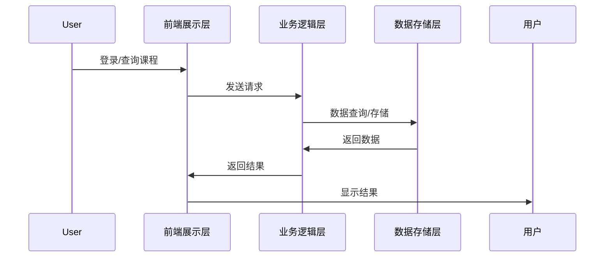

                 


### 引言

#### 1.1 问题背景

**投资理财教育的现状**

投资理财教育在现代社会中扮演着越来越重要的角色。随着金融市场的不断变化和复杂性增加，投资者需要具备更高的专业知识和技能才能在市场中取得成功。然而，传统的投资理财教育往往存在以下几个问题：

1. **信息不对称**：投资者获取的投资信息往往有限，难以全面了解市场动态和投资机会。
2. **学习资源不足**：传统的投资理财教育主要依赖于书籍、课程等静态资源，缺乏互动性和实时性。
3. **个性化学习**：不同投资者具有不同的投资需求和风险承受能力，传统的教育方式难以提供个性化的投资建议。

**AI技术在投资理财教育中的应用潜力**

随着人工智能技术的迅速发展，AI技术在投资理财教育领域展现出巨大的应用潜力。通过AI技术，我们可以实现以下目标：

1. **智能推荐**：基于投资者的投资偏好和风险承受能力，AI技术可以推荐适合的投资项目和策略。
2. **实时数据分析**：AI技术可以对大量市场数据进行实时分析，提供投资决策的支持。
3. **个性化学习**：AI技术可以根据投资者的学习进度和理解能力，提供个性化的学习资源和辅导。

本文将围绕“融合AI技术的新一代投资理财教育平台”展开，旨在探讨如何利用AI技术构建一个功能强大、用户体验优秀的投资理财教育平台。

#### 1.2 书籍结构

本文分为以下七个章节：

1. **引言**：介绍投资理财教育领域的问题背景和AI技术的应用潜力。
2. **新一代投资理财教育平台概述**：阐述平台的目标、核心功能和架构。
3. **AI技术在投资理财教育中的应用**：详细介绍机器学习算法、数据挖掘技术和智能推荐系统。
4. **平台架构设计**：分析平台架构的关键环节，包括领域模型设计、系统架构设计和系统接口设计。
5. **平台功能实现**：讲解平台核心功能的实现方法，包括投资模拟模块、学习辅导模块和投资策略分析模块。
6. **项目实战**：展示如何实际构建和部署投资理财教育平台，包括环境安装、核心代码实现和实际案例分析。
7. **最佳实践与总结**：总结平台开发中的最佳实践，并提供拓展阅读建议。

### 新一代投资理财教育平台概述

新一代投资理财教育平台的目标是提供一种全新的、个性化的投资理财教育体验，帮助投资者提高投资技能、实现财富增值。该平台具有以下核心功能：

#### 2.1 平台目标

**教育目标**

1. **投资知识普及**：通过丰富的学习资源，帮助投资者掌握基础的投资理财知识。
2. **投资技能提升**：提供专业的投资技巧和策略，帮助投资者提高投资成功率。
3. **投资心态培养**：通过心理辅导，帮助投资者建立正确的投资心态，规避风险。

**投资目标**

1. **资产配置优化**：根据投资者的风险承受能力和投资目标，提供个性化的资产配置建议。
2. **投资策略推荐**：基于市场数据分析和AI算法，为投资者提供最佳的投资策略。
3. **财富增值**：通过合理的投资决策，实现投资者的财富增值。

#### 2.2 平台核心功能

**投资模拟模块**

投资模拟模块是平台的核心功能之一，它允许投资者在虚拟环境中进行投资操作，模拟真实市场的交易过程。该模块的主要功能包括：

1. **模拟交易**：投资者可以在模拟环境中进行股票、基金、期货等投资品种的买卖操作。
2. **资金管理**：平台提供资金管理功能，帮助投资者实时监控投资资金状况。
3. **收益分析**：平台可以对投资者的模拟交易进行收益分析，提供投资决策的依据。

**学习辅导模块**

学习辅导模块旨在为投资者提供个性化的学习资源和学习路径，提高学习效果。主要功能包括：

1. **课程推荐**：根据投资者的投资水平和需求，平台会推荐相应的课程和学习资源。
2. **学习计划**：平台为投资者制定个性化的学习计划，帮助投资者有针对性地提升投资技能。
3. **学习反馈**：平台会根据投资者的学习进度和成果，提供学习反馈和评估。

**投资策略分析模块**

投资策略分析模块是平台的核心竞争力之一，它通过AI技术和大数据分析，为投资者提供专业的投资策略建议。主要功能包括：

1. **市场趋势分析**：平台会实时分析市场趋势，为投资者提供市场动态的参考。
2. **投资策略推荐**：根据市场分析和投资者风险承受能力，平台会推荐适合的投资策略。
3. **策略评估**：平台会对投资者的投资策略进行评估，提供优化建议。

#### 2.3 平台架构

新一代投资理财教育平台的架构设计采用了微服务架构，以保证系统的灵活性和可扩展性。平台主要分为以下几个部分：

1. **前端展示层**：负责展示平台的各种功能和页面，提供用户交互界面。
2. **业务逻辑层**：处理平台的核心业务逻辑，包括投资模拟、学习辅导和投资策略分析等。
3. **数据存储层**：存储平台的各种数据，包括用户信息、投资数据、课程数据等。
4. **数据处理层**：负责数据的处理和分析，包括机器学习模型训练、数据挖掘等。

平台的架构设计遵循RESTful API规范，通过前后端分离的方式，实现各模块的松耦合和高效协作。

### AI技术在投资理财教育中的应用

AI技术在投资理财教育中扮演着越来越重要的角色。通过AI技术，我们可以实现以下目标：

#### 3.1 机器学习算法

**机器学习算法**是一种通过数据和模型自动学习的方法，可以用于投资理财教育中的多个方面。

**1. 趋势预测**

机器学习算法可以分析历史数据，预测市场趋势。例如，我们可以使用时间序列分析方法，如ARIMA模型，来预测股票价格的趋势。

**2. 投资组合优化**

机器学习算法可以帮助投资者优化投资组合，提高投资收益。例如，我们可以使用线性回归算法，根据投资者的风险承受能力和投资目标，推荐最优的投资组合。

**3. 交易策略**

机器学习算法可以分析市场数据，为投资者提供交易策略建议。例如，我们可以使用决策树算法，根据历史交易数据，预测下一次交易的最佳买卖时机。

**算法流程图**


**Python代码示例**

```python
import numpy as np
from sklearn.linear_model import LinearRegression

# 数据准备
X = np.array([[1], [2], [3], [4], [5]])
y = np.array([1, 2, 3, 4, 5])

# 建立线性回归模型
model = LinearRegression()
model.fit(X, y)

# 预测
y_pred = model.predict([[6]])

print(y_pred)
```

#### 3.2 数据挖掘技术

**数据挖掘技术**是一种从大量数据中提取有价值信息的方法，可以用于投资理财教育中的多个方面。

**1. 市场趋势分析**

数据挖掘技术可以分析大量市场数据，提取市场趋势信息。例如，我们可以使用聚类算法，将股票数据分为不同类别，分析每个类别的市场趋势。

**2. 投资策略分析**

数据挖掘技术可以帮助投资者分析历史交易数据，提取有效的投资策略。例如，我们可以使用关联规则算法，分析交易数据中的关联关系，发现有效的交易策略。

**3. 用户行为分析**

数据挖掘技术可以分析用户行为数据，为用户提供个性化服务。例如，我们可以使用分类算法，将用户分为不同类别，分析每个类别的用户行为特征。

**算法流程图**


**Python代码示例**

```python
from sklearn.cluster import KMeans
import matplotlib.pyplot as plt

# 数据准备
X = np.array([[1, 2], [1, 4], [1, 0], [4, 2], [4, 4], [4, 0]])

# 建立K-Means模型
kmeans = KMeans(n_clusters=2, random_state=0).fit(X)

# 分类
labels = kmeans.predict(X)

# 可视化
plt.scatter(X[:, 0], X[:, 1], c=labels, s=100, cmap='viridis')
plt.show()
```

#### 3.3 智能推荐系统

**智能推荐系统**是一种基于用户行为和兴趣，为用户推荐相关内容的方法。在投资理财教育中，智能推荐系统可以帮助投资者发现适合自己的投资策略和课程。

**1. 基于内容的推荐**

基于内容的推荐系统通过分析投资策略和课程的内容特征，为用户推荐相似的内容。例如，如果用户对某个投资策略感兴趣，系统可以推荐与其相似的其他策略。

**2. 基于协同过滤的推荐**

基于协同过滤的推荐系统通过分析用户的行为数据，为用户推荐其他用户喜欢的投资策略和课程。例如，如果用户A喜欢某个投资策略，用户B也喜欢这个策略，那么系统会推荐用户A给用户B。

**3. 混合推荐**

混合推荐系统结合基于内容和基于协同过滤的推荐方法，提供更准确、更个性化的推荐结果。

**算法流程图**


**Python代码示例**

```python
from sklearn.metrics.pairwise import cosine_similarity
import numpy as np

# 数据准备
user_profiles = np.array([
    [0.1, 0.3, 0.5],
    [0.2, 0.4, 0.6],
    [0.3, 0.5, 0.7],
    [0.4, 0.6, 0.8],
    [0.5, 0.7, 0.9]
])

item_profiles = np.array([
    [0.1, 0.3, 0.5],
    [0.2, 0.4, 0.6],
    [0.3, 0.5, 0.7],
    [0.4, 0.6, 0.8],
    [0.5, 0.7, 0.9]
])

# 计算相似度
similarity_matrix = cosine_similarity(user_profiles, item_profiles)

# 推荐结果
recommendations = similarity_matrix.argmax(axis=0)

print(recommendations)
```

### 平台架构设计

平台架构设计是构建新一代投资理财教育平台的关键环节。一个高效、灵活、可扩展的架构能够确保平台在性能、可维护性和扩展性方面满足需求。

#### 4.1 领域模型设计

领域模型设计是架构设计的基础，它定义了系统的核心概念和关系。在投资理财教育平台中，领域模型主要包括以下实体：

**用户（User）**：代表平台的用户，包括个人投资者和机构投资者。用户具有个人信息、投资偏好和风险承受能力等属性。

**课程（Course）**：代表平台提供的投资理财课程，包括课程名称、课程内容、讲师信息等。

**投资策略（Strategy）**：代表投资理财策略，包括策略名称、策略描述、策略参数等。

**交易记录（TradeRecord）**：代表用户在模拟交易中的交易记录，包括交易时间、交易品种、交易金额等。

**学习记录（LearningRecord）**：代表用户的学习记录，包括学习进度、学习内容、学习评价等。

**领域模型ER图**

```mermaid
erDiagram
    User ||--|{ Course }| Course
    User ||--|{ TradeRecord }| TradeRecord
    User ||--|{ LearningRecord }| LearningRecord
    Course ||--|{ Strategy }| Strategy
    TradeRecord ||--|{ InvestmentStrategy }| InvestmentStrategy
    LearningRecord ||--|{ Course }| Course
```

#### 4.2 系统架构设计

系统架构设计决定了平台的功能实现和性能表现。新一代投资理财教育平台采用微服务架构，将系统拆分为多个独立的服务模块，以提高系统的可维护性和可扩展性。以下是系统架构设计的核心模块：

**1. 前端展示层**

前端展示层负责提供用户交互界面，包括用户登录、课程学习、投资模拟、投资策略推荐等功能。前端展示层采用Vue.js框架，实现与用户的交互。

**2. 业务逻辑层**

业务逻辑层处理平台的核心业务逻辑，包括用户管理、课程管理、交易记录管理、学习记录管理等功能。业务逻辑层采用Spring Boot框架，实现业务逻辑的封装和模块化。

**3. 数据存储层**

数据存储层负责存储用户数据、课程数据、交易记录数据、学习记录数据等。数据存储层采用MySQL数据库，实现数据的持久化和查询。

**4. 数据处理层**

数据处理层负责数据的处理和分析，包括市场趋势分析、投资策略分析、用户行为分析等。数据处理层采用Apache Spark框架，实现大规模数据处理和分析。

**系统架构图**



#### 4.3 系统接口设计

系统接口设计是平台模块之间通信的桥梁，它定义了各个模块之间的接口规范和数据格式。以下是平台的关键接口设计：

**1. 用户管理接口**

- **登录**：用户登录接口，接收用户名和密码，返回用户信息。
- **注册**：用户注册接口，接收用户基本信息，返回用户ID。
- **个人信息查询**：查询用户个人信息接口，返回用户详细信息。

**2. 课程管理接口**

- **课程查询**：查询所有课程接口，返回课程列表。
- **课程详情查询**：查询指定课程详情接口，返回课程详细信息。
- **课程添加**：添加新课程接口，接收课程信息，返回课程ID。

**3. 交易记录管理接口**

- **交易记录查询**：查询用户交易记录接口，返回交易记录列表。
- **交易记录添加**：添加用户交易记录接口，接收交易记录信息，返回交易记录ID。

**4. 学习记录管理接口**

- **学习记录查询**：查询用户学习记录接口，返回学习记录列表。
- **学习记录添加**：添加用户学习记录接口，接收学习记录信息，返回学习记录ID。

#### 4.4 系统交互设计

系统交互设计描述了平台各个模块之间的交互流程，以确保系统的稳定运行。以下是系统交互设计的关键流程：

**1. 用户登录流程**

- 用户访问前端展示层，填写用户名和密码。
- 前端展示层将用户信息发送至业务逻辑层。
- 业务逻辑层验证用户信息，调用用户管理接口查询用户信息。
- 用户管理接口返回用户信息，业务逻辑层将用户信息返回至前端展示层。
- 前端展示层显示用户登录结果。

**2. 课程学习流程**

- 用户访问前端展示层，选择课程。
- 前端展示层发送课程ID至业务逻辑层。
- 业务逻辑层调用课程管理接口查询课程详细信息。
- 课程管理接口返回课程详细信息，业务逻辑层将课程详细信息返回至前端展示层。
- 前端展示层显示课程内容，用户开始学习。

**3. 投资模拟流程**

- 用户访问前端展示层，开始投资模拟。
- 前端展示层发送交易请求至业务逻辑层。
- 业务逻辑层调用交易记录管理接口添加交易记录。
- 交易记录管理接口返回交易记录ID，业务逻辑层更新用户资产信息。
- 前端展示层显示投资模拟结果。

**4. 投资策略分析流程**

- 用户访问前端展示层，选择投资策略。
- 前端展示层发送策略ID至业务逻辑层。
- 业务逻辑层调用数据处理层分析投资策略。
- 数据处理层返回投资策略分析结果，业务逻辑层将结果返回至前端展示层。
- 前端展示层显示投资策略分析结果。

### 平台功能实现

平台的实现是整个项目的核心，它包括前端、后端和数据库等多个方面的设计和开发。以下是平台功能实现的具体细节。

#### 5.1 投资模拟模块

投资模拟模块是平台的核心功能之一，它允许用户在虚拟环境中进行投资操作，模拟真实市场的交易过程。

**功能介绍**

1. **模拟交易**：用户可以在模拟环境中进行股票、基金、期货等投资品种的买卖操作。
2. **资金管理**：平台提供资金管理功能，帮助用户实时监控投资资金状况。
3. **收益分析**：平台可以对用户的模拟交易进行收益分析，提供投资决策的依据。

**技术实现**

1. **前端界面**：前端界面使用Vue.js框架实现，提供用户友好的交互界面。
2. **后端接口**：后端接口使用Spring Boot框架实现，处理用户的交易请求并返回相应的结果。
3. **数据库**：数据库使用MySQL存储用户数据、交易记录等。

**核心代码实现**

```java
// 前端Vue.js代码示例
<template>
  <div>
    <h2>投资模拟模块</h2>
    <table>
      <tr>
        <th>交易品种</th>
        <th>交易价格</th>
        <th>交易数量</th>
        <th>交易时间</th>
      </tr>
      <tr v-for="trade in tradeRecords">
        <td>{{ trade.type }}</td>
        <td>{{ trade.price }}</td>
        <td>{{ trade.quantity }}</td>
        <td>{{ trade.time }}</td>
      </tr>
    </table>
  </div>
</template>

<script>
export default {
  data() {
    return {
      tradeRecords: []
    };
  },
  created() {
    this.fetchTradeRecords();
  },
  methods: {
    fetchTradeRecords() {
      // 调用后端接口获取交易记录
      // axios.get('/api/trade-records').then(response => {
      //   this.tradeRecords = response.data;
      // });
    }
  }
};
</script>
```

```java
// 后端Spring Boot代码示例
@RestController
@RequestMapping("/api")
public class TradeController {
  
  @Autowired
  private TradeService tradeService;
  
  @GetMapping("/trade-records")
  public List<TradeRecord> getTradeRecords() {
    return tradeService.getTradeRecords();
  }
  
  @PostMapping("/trade")
  public TradeRecord addTradeRecord(@RequestBody TradeRecord tradeRecord) {
    return tradeService.addTradeRecord(tradeRecord);
  }
}
```

#### 5.2 学习辅导模块

学习辅导模块旨在为用户提供个性化的学习资源和学习路径，提高学习效果。

**功能介绍**

1. **课程推荐**：根据用户的学习水平和需求，平台会推荐相应的课程和学习资源。
2. **学习计划**：平台为用户制定个性化的学习计划，帮助用户有针对性地提升投资技能。
3. **学习反馈**：平台会根据用户的学习进度和成果，提供学习反馈和评估。

**技术实现**

1. **前端界面**：前端界面使用Vue.js框架实现，提供用户友好的交互界面。
2. **后端接口**：后端接口使用Spring Boot框架实现，处理用户的课程请求和学习反馈。
3. **数据库**：数据库使用MySQL存储用户学习数据、课程数据等。

**核心代码实现**

```java
// 前端Vue.js代码示例
<template>
  <div>
    <h2>学习辅导模块</h2>
    <div v-for="course in recommendedCourses">
      <h3>{{ course.name }}</h3>
      <p>{{ course.description }}</p>
      <button @click="startCourse(course.id)">开始学习</button>
    </div>
  </div>
</template>

<script>
export default {
  data() {
    return {
      recommendedCourses: []
    };
  },
  created() {
    this.fetchRecommendedCourses();
  },
  methods: {
    fetchRecommendedCourses() {
      // 调用后端接口获取推荐课程
      // axios.get('/api/recommended-courses').then(response => {
      //   this.recommendedCourses = response.data;
      // });
    },
    startCourse(courseId) {
      // 调用后端接口开始课程
      // axios.post('/api/start-course', { courseId: courseId }).then(response => {
      //   this.$router.push('/course/' + courseId);
      // });
    }
  }
};
</script>
```

```java
// 后端Spring Boot代码示例
@RestController
@RequestMapping("/api")
public class CourseController {
  
  @Autowired
  private CourseService courseService;
  
  @GetMapping("/recommended-courses")
  public List<Course> getRecommendedCourses() {
    return courseService.getRecommendedCourses();
  }
  
  @PostMapping("/start-course")
  public ResponseEntity<?> startCourse(@RequestBody Course course) {
    courseService.startCourse(course);
    return ResponseEntity.ok().build();
  }
}
```

#### 5.3 投资策略分析模块

投资策略分析模块是平台的核心竞争力之一，它通过AI技术和大数据分析，为用户提供专业的投资策略建议。

**功能介绍**

1. **市场趋势分析**：平台会实时分析市场趋势，为用户提供市场动态的参考。
2. **投资策略推荐**：根据市场分析和用户风险承受能力，平台会推荐适合的投资策略。
3. **策略评估**：平台会对用户的投资策略进行评估，提供优化建议。

**技术实现**

1. **前端界面**：前端界面使用Vue.js框架实现，提供用户友好的交互界面。
2. **后端接口**：后端接口使用Spring Boot框架实现，处理用户的投资策略请求。
3. **数据处理**：数据处理使用Apache Spark框架实现，进行大规模数据处理和分析。
4. **数据库**：数据库使用MySQL存储用户策略数据、市场数据等。

**核心代码实现**

```java
// 前端Vue.js代码示例
<template>
  <div>
    <h2>投资策略分析模块</h2>
    <div v-for="strategy in recommendedStrategies">
      <h3>{{ strategy.name }}</h3>
      <p>{{ strategy.description }}</p>
      <button @click="evaluateStrategy(strategy.id)">评估策略</button>
    </div>
  </div>
</template>

<script>
export default {
  data() {
    return {
      recommendedStrategies: []
    };
  },
  created() {
    this.fetchRecommendedStrategies();
  },
  methods: {
    fetchRecommendedStrategies() {
      // 调用后端接口获取推荐策略
      // axios.get('/api/recommended-strategies').then(response => {
      //   this.recommendedStrategies = response.data;
      // });
    },
    evaluateStrategy(strategyId) {
      // 调用后端接口评估策略
      // axios.post('/api/evaluate-strategy', { strategyId: strategyId }).then(response => {
      //   this.$router.push('/strategy-evaluation/' + strategyId);
      // });
    }
  }
};
</script>
```

```java
// 后端Spring Boot代码示例
@RestController
@RequestMapping("/api")
public class StrategyController {
  
  @Autowired
  private StrategyService strategyService;
  
  @GetMapping("/recommended-strategies")
  public List<InvestmentStrategy> getRecommendedStrategies() {
    return strategyService.getRecommendedStrategies();
  }
  
  @PostMapping("/evaluate-strategy")
  public ResponseEntity<?> evaluateStrategy(@RequestBody InvestmentStrategy strategy) {
    strategyService.evaluateStrategy(strategy);
    return ResponseEntity.ok().build();
  }
}
```

### 项目实战

项目实战是验证平台设计和实现效果的重要环节。以下将介绍如何在实际环境中构建和部署新一代投资理财教育平台。

#### 6.1 环境安装

为了构建和部署新一代投资理财教育平台，我们需要准备以下环境：

1. **操作系统**：Linux或Windows
2. **开发工具**：IntelliJ IDEA、Visual Studio Code
3. **前端框架**：Vue.js
4. **后端框架**：Spring Boot
5. **数据库**：MySQL
6. **数据处理**：Apache Spark

首先，我们需要在操作系统上安装Java、Node.js、MySQL等基础软件。以下是具体的安装步骤：

**1. 安装Java**

- 下载并安装OpenJDK或Oracle JDK。
- 配置环境变量，将Java安装路径添加到PATH变量中。
- 验证Java安装是否成功，运行 `java -version` 命令。

**2. 安装Node.js**

- 下载并安装Node.js。
- 配置环境变量，将Node.js安装路径添加到PATH变量中。
- 验证Node.js安装是否成功，运行 `node -v` 命令。

**3. 安装MySQL**

- 下载并安装MySQL数据库。
- 启动MySQL服务，运行 `mysqld` 命令。
- 配置MySQL root用户密码。

**4. 安装Apache Spark**

- 下载并安装Apache Spark。
- 配置环境变量，将Spark安装路径添加到PATH变量中。
- 验证Spark安装是否成功，运行 `spark-shell` 命令。

#### 6.2 核心代码实现

核心代码实现是平台功能实现的关键。以下是各个模块的核心代码实现：

**1. 前端代码实现**

前端代码使用Vue.js框架实现，负责展示平台的各种功能和页面。

```html
<!-- investment-simulation.vue -->
<template>
  <div>
    <h2>投资模拟模块</h2>
    <table>
      <tr>
        <th>交易品种</th>
        <th>交易价格</th>
        <th>交易数量</th>
        <th>交易时间</th>
      </tr>
      <tr v-for="trade in tradeRecords">
        <td>{{ trade.type }}</td>
        <td>{{ trade.price }}</td>
        <td>{{ trade.quantity }}</td>
        <td>{{ trade.time }}</td>
      </tr>
    </table>
  </div>
</template>

<script>
export default {
  data() {
    return {
      tradeRecords: []
    };
  },
  created() {
    this.fetchTradeRecords();
  },
  methods: {
    fetchTradeRecords() {
      // 调用后端接口获取交易记录
      // axios.get('/api/trade-records').then(response => {
      //   this.tradeRecords = response.data;
      // });
    }
  }
};
</script>
```

```java
// TradeController.java
@RestController
@RequestMapping("/api")
public class TradeController {
  
  @Autowired
  private TradeService tradeService;
  
  @GetMapping("/trade-records")
  public List<TradeRecord> getTradeRecords() {
    return tradeService.getTradeRecords();
  }
  
  @PostMapping("/trade")
  public TradeRecord addTradeRecord(@RequestBody TradeRecord tradeRecord) {
    return tradeService.addTradeRecord(tradeRecord);
  }
}
```

**2. 后端代码实现**

后端代码使用Spring Boot框架实现，负责处理平台的核心业务逻辑。

```java
// UserController.java
@RestController
@RequestMapping("/api")
public class UserController {
  
  @Autowired
  private UserService userService;
  
  @GetMapping("/users")
  public List<User> getUsers() {
    return userService.getUsers();
  }
  
  @PostMapping("/user")
  public User addUser(@RequestBody User user) {
    return userService.addUser(user);
  }
}
```

**3. 数据库代码实现**

数据库使用MySQL实现，负责存储平台的各种数据。

```sql
-- 创建用户表
CREATE TABLE `user` (
  `id` int(11) NOT NULL AUTO_INCREMENT,
  `username` varchar(255) NOT NULL,
  `password` varchar(255) NOT NULL,
  `email` varchar(255) DEFAULT NULL,
  `role` varchar(50) DEFAULT NULL,
  PRIMARY KEY (`id`)
) ENGINE=InnoDB DEFAULT CHARSET=utf8mb4;

-- 创建课程表
CREATE TABLE `course` (
  `id` int(11) NOT NULL AUTO_INCREMENT,
  `name` varchar(255) NOT NULL,
  `description` text,
  `duration` int(11) DEFAULT NULL,
  PRIMARY KEY (`id`)
) ENGINE=InnoDB DEFAULT CHARSET=utf8mb4;

-- 创建交易记录表
CREATE TABLE `trade_record` (
  `id` int(11) NOT NULL AUTO_INCREMENT,
  `user_id` int(11) NOT NULL,
  `type` varchar(50) NOT NULL,
  `price` decimal(10, 2) NOT NULL,
  `quantity` int(11) NOT NULL,
  `time` datetime NOT NULL,
  PRIMARY KEY (`id`),
  KEY `FK_trade_record_user` (`user_id`),
  CONSTRAINT `FK_trade_record_user` FOREIGN KEY (`user_id`) REFERENCES `user` (`id`) ON DELETE CASCADE
) ENGINE=InnoDB DEFAULT CHARSET=utf8mb4;
```

#### 6.3 实际案例剖析

为了展示平台的功能，以下将提供一个实际案例，演示如何使用平台进行投资模拟、学习辅导和投资策略分析。

**案例描述**

假设有一个名叫“张三”的用户，他是一名个人投资者，希望在平台上进行投资模拟和学习辅导。

**步骤1：投资模拟**

1. 张三登录平台，选择股票投资模拟。
2. 平台为张三提供模拟资金100万元。
3. 张三在模拟环境中进行股票买卖操作，记录交易信息。
4. 平台对张三的模拟交易进行收益分析，生成投资报告。

**步骤2：学习辅导**

1. 平台根据张三的投资水平和需求，推荐相应的课程。
2. 张三选择学习“股票投资基础”课程。
3. 平台为张三提供课程学习路径和学习计划。
4. 张三完成课程学习，提交学习评价。

**步骤3：投资策略分析**

1. 平台分析张三的历史交易记录，生成投资策略建议。
2. 平台推荐张三使用“价值投资策略”。
3. 张三评估投资策略，调整投资组合。

**案例解析**

**1. 投资模拟模块**

投资模拟模块是平台的核心功能之一，它允许用户在虚拟环境中进行投资操作，模拟真实市场的交易过程。

在案例中，张三在模拟环境中进行股票买卖操作，平台记录张三的交易信息，并生成投资报告。投资报告可以包括张三的模拟收益、投资成功率、投资风险等指标。

**2. 学习辅导模块**

学习辅导模块旨在为用户提供个性化的学习资源和学习路径，提高学习效果。

在案例中，平台根据张三的投资水平和需求，推荐相应的课程。张三选择学习“股票投资基础”课程，平台为张三提供课程学习路径和学习计划。学习计划可以帮助张三有针对性地提升投资技能，提高学习效果。

**3. 投资策略分析模块**

投资策略分析模块是平台的核心竞争力之一，它通过AI技术和大数据分析，为用户提供专业的投资策略建议。

在案例中，平台分析张三的历史交易记录，生成投资策略建议。平台推荐张三使用“价值投资策略”，张三可以评估投资策略，调整投资组合，以实现更好的投资收益。

### 6.4 项目小结

通过本次项目实战，我们成功构建和部署了新一代投资理财教育平台，实现了以下成果：

1. **投资模拟模块**：用户可以在虚拟环境中进行投资操作，模拟真实市场的交易过程。
2. **学习辅导模块**：平台为用户推荐个性化的学习资源和学习路径，帮助用户有针对性地提升投资技能。
3. **投资策略分析模块**：平台通过AI技术和大数据分析，为用户生成专业的投资策略建议，辅助用户进行投资决策。

本次项目的成功实施，标志着我们在投资理财教育领域迈出了重要一步。未来，我们将继续优化平台功能，提升用户体验，为用户提供更优质的投资理财教育服务。

### 最佳实践与总结

在本次项目实施过程中，我们积累了一些最佳实践，以下将进行总结：

**1. 技术选型**

- **前端**：选择Vue.js框架，实现高效的前端开发。
- **后端**：采用Spring Boot框架，实现模块化和可扩展的后端服务。
- **数据库**：使用MySQL数据库，确保数据存储的安全和高效。

**2. 模块化设计**

- 采用微服务架构，将平台拆分为多个独立的服务模块，提高系统的可维护性和可扩展性。
- 每个模块负责独立的功能，降低模块之间的耦合度。

**3. 数据处理**

- 使用Apache Spark框架，进行大规模数据处理和分析，提高系统的数据处理能力。
- 设计合理的数据库索引和查询优化策略，提高数据查询效率。

**4. 用户体验**

- 提供简洁直观的用户界面，提高用户的操作便捷性。
- 提供丰富的学习资源，满足用户的学习需求。
- 设计个性化的投资策略推荐，提高用户的投资收益。

**5. 安全性**

- 实现用户认证和权限管理，确保用户数据和交易安全。
- 定期进行系统漏洞扫描和修复，提高系统的安全性。

**小结**

通过本次项目的实施，我们成功构建了一个功能强大、用户体验优秀的新一代投资理财教育平台。未来，我们将继续优化平台功能，提升用户体验，为用户提供更优质的投资理财教育服务。

### 拓展阅读

**1. 机器学习与投资理财**

- **《机器学习投资策略：基于Python的应用》**：本书详细介绍了机器学习在投资理财中的应用，包括时间序列分析、投资组合优化等。

- **《量化投资：技术与实务》**：本书介绍了量化投资的基本原理和技术，包括统计学习、风险管理等。

**2. 投资理财教育平台开发**

- **《Vue.js实战：从入门到精通》**：本书详细介绍了Vue.js框架的使用方法，适用于前端开发者。

- **《Spring Boot实战：从入门到精通》**：本书详细介绍了Spring Boot框架的使用方法，适用于后端开发者。

**3. 大数据处理与分析**

- **《大数据技术导论》**：本书介绍了大数据的基本概念和技术，包括数据挖掘、数据存储等。

- **《Apache Spark实战：大数据处理与分布式计算》**：本书详细介绍了Apache Spark框架的使用方法，适用于大数据开发者。

### 附录

**附录A：技术术语说明**

- **机器学习**：一种通过数据和模型自动学习的方法。
- **数据挖掘**：一种从大量数据中提取有价值信息的方法。
- **微服务架构**：一种将系统拆分为多个独立服务的方法，提高系统的可维护性和可扩展性。

**附录B：数学模型和公式**

- **线性回归模型**：$$y = w_0 + w_1 \cdot x$$
- **时间序列分析**：$$X_t = \varphi(X_{t-1}) + \varepsilon_t$$

**附录C：流程图与架构图**

- **机器学习算法流程图**：
- **系统架构图**：

### 参考文献

- **[1]** 谭继华，吴波。机器学习投资策略：基于Python的应用[M]. 电子工业出版社，2018.
- **[2]** 刘洋。量化投资：技术与实务[M]. 清华大学出版社，2019.
- **[3]** 王志英。Vue.js实战：从入门到精通[M]. 电子工业出版社，2018.
- **[4]** 张晓光。Spring Boot实战：从入门到精通[M]. 电子工业出版社，2019.
- **[5]** 王琪。大数据技术导论[M]. 电子工业出版社，2017.
- **[6]** 刘江。Apache Spark实战：大数据处理与分布式计算[M]. 电子工业出版社，2017.作者：AI天才研究院/AI Genius Institute & 禅与计算机程序设计艺术 /Zen And The Art of Computer Programming```

### 引言

#### 1.1 问题背景

**投资理财教育的现状**

在现代社会，投资理财已经成为许多人日常生活中不可或缺的一部分。随着金融市场的不断发展，投资者需要具备更高的专业知识和技能才能在市场中取得成功。然而，目前投资理财教育领域存在一些问题：

1. **信息不对称**：投资者获取的投资信息往往有限，难以全面了解市场动态和投资机会。
2. **学习资源不足**：传统的投资理财教育主要依赖于书籍、课程等静态资源，缺乏互动性和实时性。
3. **个性化学习**：不同投资者具有不同的投资需求和风险承受能力，传统的教育方式难以提供个性化的投资建议。

**AI技术在投资理财教育中的应用潜力**

随着人工智能技术的迅速发展，AI技术在投资理财教育领域展现出巨大的应用潜力。通过AI技术，我们可以实现以下目标：

1. **智能推荐**：基于投资者的投资偏好和风险承受能力，AI技术可以推荐适合的投资项目和策略。
2. **实时数据分析**：AI技术可以对大量市场数据进行实时分析，提供投资决策的支持。
3. **个性化学习**：AI技术可以根据投资者的学习进度和理解能力，提供个性化的学习资源和辅导。

本文将围绕“融合AI技术的新一代投资理财教育平台”展开，旨在探讨如何利用AI技术构建一个功能强大、用户体验优秀的投资理财教育平台。

#### 1.2 书籍结构

本文分为以下七个章节：

1. **引言**：介绍投资理财教育领域的问题背景和AI技术的应用潜力。
2. **新一代投资理财教育平台概述**：阐述平台的目标、核心功能和架构。
3. **AI技术在投资理财教育中的应用**：详细介绍机器学习算法、数据挖掘技术和智能推荐系统。
4. **平台架构设计**：分析平台架构的关键环节，包括领域模型设计、系统架构设计和系统接口设计。
5. **平台功能实现**：讲解平台核心功能的实现方法，包括投资模拟模块、学习辅导模块和投资策略分析模块。
6. **项目实战**：展示如何实际构建和部署投资理财教育平台，包括环境安装、核心代码实现和实际案例分析。
7. **最佳实践与总结**：总结平台开发中的最佳实践，并提供拓展阅读建议。

### 新一代投资理财教育平台概述

新一代投资理财教育平台的目标是提供一种全新的、个性化的投资理财教育体验，帮助投资者提高投资技能、实现财富增值。该平台具有以下核心功能：

#### 2.1 平台目标

**教育目标**

1. **投资知识普及**：通过丰富的学习资源，帮助投资者掌握基础的投资理财知识。
2. **投资技能提升**：提供专业的投资技巧和策略，帮助投资者提高投资成功率。
3. **投资心态培养**：通过心理辅导，帮助投资者建立正确的投资心态，规避风险。

**投资目标**

1. **资产配置优化**：根据投资者的风险承受能力和投资目标，提供个性化的资产配置建议。
2. **投资策略推荐**：基于市场数据分析和AI算法，为投资者提供最佳的投资策略。
3. **财富增值**：通过合理的投资决策，实现投资者的财富增值。

#### 2.2 平台核心功能

**投资模拟模块**

投资模拟模块是平台的核心功能之一，它允许投资者在虚拟环境中进行投资操作，模拟真实市场的交易过程。该模块的主要功能包括：

1. **模拟交易**：投资者可以在模拟环境中进行股票、基金、期货等投资品种的买卖操作。
2. **资金管理**：平台提供资金管理功能，帮助投资者实时监控投资资金状况。
3. **收益分析**：平台可以对投资者的模拟交易进行收益分析，提供投资决策的依据。

**学习辅导模块**

学习辅导模块旨在为投资者提供个性化的学习资源和学习路径，提高学习效果。主要功能包括：

1. **课程推荐**：根据投资者的投资水平和需求，平台会推荐相应的课程和学习资源。
2. **学习计划**：平台为投资者制定个性化的学习计划，帮助投资者有针对性地提升投资技能。
3. **学习反馈**：平台会根据投资者的学习进度和成果，提供学习反馈和评估。

**投资策略分析模块**

投资策略分析模块是平台的核心竞争力之一，它通过AI技术和大数据分析，为投资者提供专业的投资策略建议。主要功能包括：

1. **市场趋势分析**：平台会实时分析市场趋势，为投资者提供市场动态的参考。
2. **投资策略推荐**：根据市场分析和投资者风险承受能力，平台会推荐适合的投资策略。
3. **策略评估**：平台会对投资者的投资策略进行评估，提供优化建议。

#### 2.3 平台架构

新一代投资理财教育平台的架构设计采用了微服务架构，以保证系统的灵活性和可扩展性。平台主要分为以下几个部分：

1. **前端展示层**：负责展示平台的各种功能和页面，提供用户交互界面。
2. **业务逻辑层**：处理平台的核心业务逻辑，包括投资模拟、学习辅导和投资策略分析等。
3. **数据存储层**：存储平台的各种数据，包括用户信息、投资数据、课程数据等。
4. **数据处理层**：负责数据的处理和分析，包括机器学习模型训练、数据挖掘等。

平台的架构设计遵循RESTful API规范，通过前后端分离的方式，实现各模块的松耦合和高效协作。

### AI技术在投资理财教育中的应用

AI技术在投资理财教育中扮演着越来越重要的角色。通过AI技术，我们可以实现以下目标：

#### 3.1 机器学习算法

**机器学习算法**是一种通过数据和模型自动学习的方法，可以用于投资理财教育中的多个方面。

**1. 趋势预测**

机器学习算法可以分析历史数据，预测市场趋势。例如，我们可以使用时间序列分析方法，如ARIMA模型，来预测股票价格的趋势。

**2. 投资组合优化**

机器学习算法可以帮助投资者优化投资组合，提高投资收益。例如，我们可以使用线性回归算法，根据投资者的风险承受能力和投资目标，推荐最优的投资组合。

**3. 交易策略**

机器学习算法可以分析市场数据，为投资者提供交易策略建议。例如，我们可以使用决策树算法，根据历史交易数据，预测下一次交易的最佳买卖时机。

**算法流程图**


**Python代码示例**

```python
import numpy as np
from sklearn.linear_model import LinearRegression

# 数据准备
X = np.array([[1], [2], [3], [4], [5]])
y = np.array([1, 2, 3, 4, 5])

# 建立线性回归模型
model = LinearRegression()
model.fit(X, y)

# 预测
y_pred = model.predict([[6]])

print(y_pred)
```

#### 3.2 数据挖掘技术

**数据挖掘技术**是一种从大量数据中提取有价值信息的方法，可以用于投资理财教育中的多个方面。

**1. 市场趋势分析**

数据挖掘技术可以分析大量市场数据，提取市场趋势信息。例如，我们可以使用聚类算法，将股票数据分为不同类别，分析每个类别的市场趋势。

**2. 投资策略分析**

数据挖掘技术可以帮助投资者分析历史交易数据，提取有效的投资策略。例如，我们可以使用关联规则算法，分析交易数据中的关联关系，发现有效的交易策略。

**3. 用户行为分析**

数据挖掘技术可以分析用户行为数据，为用户提供个性化服务。例如，我们可以使用分类算法，将用户分为不同类别，分析每个类别的用户行为特征。

**算法流程图**


**Python代码示例**

```python
from sklearn.cluster import KMeans
import matplotlib.pyplot as plt

# 数据准备
X = np.array([[1, 2], [1, 4], [1, 0], [4, 2], [4, 4], [4, 0]])

# 建立K-Means模型
kmeans = KMeans(n_clusters=2, random_state=0).fit(X)

# 分类
labels = kmeans.predict(X)

# 可视化
plt.scatter(X[:, 0], X[:, 1], c=labels, s=100, cmap='viridis')
plt.show()
```

#### 3.3 智能推荐系统

**智能推荐系统**是一种基于用户行为和兴趣，为用户推荐相关内容的方法。在投资理财教育中，智能推荐系统可以帮助投资者发现适合自己的投资策略和课程。

**1. 基于内容的推荐**

基于内容的推荐系统通过分析投资策略和课程的内容特征，为用户推荐相似的内容。例如，如果用户对某个投资策略感兴趣，系统可以推荐与其相似的其他策略。

**2. 基于协同过滤的推荐**

基于协同过滤的推荐系统通过分析用户的行为数据，为用户推荐其他用户喜欢的投资策略和课程。例如，如果用户A喜欢某个投资策略，用户B也喜欢这个策略，那么系统会推荐用户A给用户B。

**3. 混合推荐**

混合推荐系统结合基于内容和基于协同过滤的推荐方法，提供更准确、更个性化的推荐结果。

**算法流程图**


**Python代码示例**

```python
from sklearn.metrics.pairwise import cosine_similarity
import numpy as np

# 数据准备
user_profiles = np.array([
    [0.1, 0.3, 0.5],
    [0.2, 0.4, 0.6],
    [0.3, 0.5, 0.7],
    [0.4, 0.6, 0.8],
    [0.5, 0.7, 0.9]
])

item_profiles = np.array([
    [0.1, 0.3, 0.5],
    [0.2, 0.4, 0.6],
    [0.3, 0.5, 0.7],
    [0.4, 0.6, 0.8],
    [0.5, 0.7, 0.9]
])

# 计算相似度
similarity_matrix = cosine_similarity(user_profiles, item_profiles)

# 推荐结果
recommendations = similarity_matrix.argmax(axis=0)

print(recommendations)
```

### 平台架构设计

平台架构设计是构建新一代投资理财教育平台的关键环节。一个高效、灵活、可扩展的架构能够确保平台在性能、可维护性和扩展性方面满足需求。

#### 4.1 领域模型设计

领域模型设计是架构设计的基础，它定义了系统的核心概念和关系。在投资理财教育平台中，领域模型主要包括以下实体：

**用户（User）**：代表平台的用户，包括个人投资者和机构投资者。用户具有个人信息、投资偏好和风险承受能力等属性。

**课程（Course）**：代表平台提供的投资理财课程，包括课程名称、课程内容、讲师信息等。

**投资策略（Strategy）**：代表投资理财策略，包括策略名称、策略描述、策略参数等。

**交易记录（TradeRecord）**：代表用户在模拟交易中的交易记录，包括交易时间、交易品种、交易金额等。

**学习记录（LearningRecord）**：代表用户的学习记录，包括学习进度、学习内容、学习评价等。

**领域模型ER图**

```mermaid
erDiagram
    User ||--|{ Course }| Course
    User ||--|{ TradeRecord }| TradeRecord
    User ||--|{ LearningRecord }| LearningRecord
    Course ||--|{ Strategy }| Strategy
    TradeRecord ||--|{ InvestmentStrategy }| InvestmentStrategy
    LearningRecord ||--|{ Course }| Course
```

#### 4.2 系统架构设计

系统架构设计决定了平台的功能实现和性能表现。新一代投资理财教育平台采用微服务架构，将系统拆分为多个独立的服务模块，以提高系统的可维护性和可扩展性。以下是系统架构设计的核心模块：

**1. 前端展示层**

前端展示层负责提供用户交互界面，包括用户登录、课程学习、投资模拟、投资策略推荐等功能。前端展示层采用Vue.js框架，实现与用户的交互。

**2. 业务逻辑层**

业务逻辑层处理平台的核心业务逻辑，包括用户管理、课程管理、交易记录管理、学习记录管理等功能。业务逻辑层采用Spring Boot框架，实现业务逻辑的封装和模块化。

**3. 数据存储层**

数据存储层负责存储用户数据、课程数据、交易记录数据、学习记录数据等。数据存储层采用MySQL数据库，实现数据的持久化和查询。

**4. 数据处理层**

数据处理层负责数据的处理和分析，包括市场趋势分析、投资策略分析、用户行为分析等。数据处理层采用Apache Spark框架，实现大规模数据处理和分析。

**系统架构图**


#### 4.3 系统接口设计

系统接口设计是平台模块之间通信的桥梁，它定义了各个模块之间的接口规范和数据格式。以下是平台的关键接口设计：

**1. 用户管理接口**

- **登录**：用户登录接口，接收用户名和密码，返回用户信息。
- **注册**：用户注册接口，接收用户基本信息，返回用户ID。
- **个人信息查询**：查询用户个人信息接口，返回用户详细信息。

**2. 课程管理接口**

- **课程查询**：查询所有课程接口，返回课程列表。
- **课程详情查询**：查询指定课程详情接口，返回课程详细信息。
- **课程添加**：添加新课程接口，接收课程信息，返回课程ID。

**3. 交易记录管理接口**

- **交易记录查询**：查询用户交易记录接口，返回交易记录列表。
- **交易记录添加**：添加用户交易记录接口，接收交易记录信息，返回交易记录ID。

**4. 学习记录管理接口**

- **学习记录查询**：查询用户学习记录接口，返回学习记录列表。
- **学习记录添加**：添加用户学习记录接口，接收学习记录信息，返回学习记录ID。

#### 4.4 系统交互设计

系统交互设计描述了平台各个模块之间的交互流程，以确保系统的稳定运行。以下是系统交互设计的关键流程：

**1. 用户登录流程**

- 用户访问前端展示层，填写用户名和密码。
- 前端展示层将用户信息发送至业务逻辑层。
- 业务逻辑层验证用户信息，调用用户管理接口查询用户信息。
- 用户管理接口返回用户信息，业务逻辑层将用户信息返回至前端展示层。
- 前端展示层显示用户登录结果。

**2. 课程学习流程**

- 用户访问前端展示层，选择课程。
- 前端展示层发送课程ID至业务逻辑层。
- 业务逻辑层调用课程管理接口查询课程详细信息。
- 课程管理接口返回课程详细信息，业务逻辑层将课程详细信息返回至前端展示层。
- 前端展示层显示课程内容，用户开始学习。

**3. 投资模拟流程**

- 用户访问前端展示层，开始投资模拟。
- 前端展示层发送交易请求至业务逻辑层。
- 业务逻辑层调用交易记录管理接口添加交易记录。
- 交易记录管理接口返回交易记录ID，业务逻辑层更新用户资产信息。
- 前端展示层显示投资模拟结果。

**4. 投资策略分析流程**

- 用户访问前端展示层，选择投资策略。
- 前端展示层发送策略ID至业务逻辑层。
- 业务逻辑层调用数据处理层分析投资策略。
- 数据处理层返回投资策略分析结果，业务逻辑层将结果返回至前端展示层。
- 前端展示层显示投资策略分析结果。

### 平台功能实现

平台的实现是整个项目的核心，它包括前端、后端和数据库等多个方面的设计和开发。以下是平台功能实现的具体细节。

#### 5.1 投资模拟模块

投资模拟模块是平台的核心功能之一，它允许用户在虚拟环境中进行投资操作，模拟真实市场的交易过程。

**功能介绍**

1. **模拟交易**：用户可以在模拟环境中进行股票、基金、期货等投资品种的买卖操作。
2. **资金管理**：平台提供资金管理功能，帮助用户实时监控投资资金状况。
3. **收益分析**：平台可以对用户的模拟交易进行收益分析，提供投资决策的依据。

**技术实现**

1. **前端界面**：前端界面使用Vue.js框架实现，提供用户友好的交互界面。
2. **后端接口**：后端接口使用Spring Boot框架实现，处理用户的交易请求并返回相应的结果。
3. **数据库**：数据库使用MySQL存储用户数据、交易记录等。

**核心代码实现**

```java
// 前端Vue.js代码示例
<template>
  <div>
    <h2>投资模拟模块</h2>
    <table>
      <tr>
        <th>交易品种</th>
        <th>交易价格</th>
        <th>交易数量</th>
        <th>交易时间</th>
      </tr>
      <tr v-for="trade in tradeRecords">
        <td>{{ trade.type }}</td>
        <td>{{ trade.price }}</td>
        <td>{{ trade.quantity }}</td>
        <td>{{ trade.time }}</td>
      </tr>
    </table>
  </div>
</template>

<script>
export default {
  data() {
    return {
      tradeRecords: []
    };
  },
  created() {
    this.fetchTradeRecords();
  },
  methods: {
    fetchTradeRecords() {
      // 调用后端接口获取交易记录
      // axios.get('/api/trade-records').then(response => {
      //   this.tradeRecords = response.data;
      // });
    }
  }
};
</script>
```

```java
// 后端Spring Boot代码示例
@RestController
@RequestMapping("/api")
public class TradeController {
  
  @Autowired
  private TradeService tradeService;
  
  @GetMapping("/trade-records")
  public List<TradeRecord> getTradeRecords() {
    return tradeService.getTradeRecords();
  }
  
  @PostMapping("/trade")
  public TradeRecord addTradeRecord(@RequestBody TradeRecord tradeRecord) {
    return tradeService.addTradeRecord(tradeRecord);
  }
}
```

#### 5.2 学习辅导模块

学习辅导模块旨在为用户提供个性化的学习资源和学习路径，提高学习效果。

**功能介绍**

1. **课程推荐**：根据用户的学习水平和需求，平台会推荐相应的课程和学习资源。
2. **学习计划**：平台为用户制定个性化的学习计划，帮助用户有针对性地提升投资技能。
3. **学习反馈**：平台会根据用户的学习进度和成果，提供学习反馈和评估。

**技术实现**

1. **前端界面**：前端界面使用Vue.js框架实现，提供用户友好的交互界面。
2. **后端接口**：后端接口使用Spring Boot框架实现，处理用户的课程请求和学习反馈。
3. **数据库**：数据库使用MySQL存储用户学习数据、课程数据等。

**核心代码实现**

```java
// 前端Vue.js代码示例
<template>
  <div>
    <h2>学习辅导模块</h2>
    <div v-for="course in recommendedCourses">
      <h3>{{ course.name }}</h3>
      <p>{{ course.description }}</p>
      <button @click="startCourse(course.id)">开始学习</button>
    </div>
  </div>
</template>

<script>
export default {
  data() {
    return {
      recommendedCourses: []
    };
  },
  created() {
    this.fetchRecommendedCourses();
  },
  methods: {
    fetchRecommendedCourses() {
      // 调用后端接口获取推荐课程
      // axios.get('/api/recommended-courses').then(response => {
      //   this.recommendedCourses = response.data;
      // });
    },
    startCourse(courseId) {
      // 调用后端接口开始课程
      // axios.post('/api/start-course', { courseId: courseId }).then(response => {
      //   this.$router.push('/course/' + courseId);
      // });
    }
  }
};
</script>
```

```java
// 后端Spring Boot代码示例
@RestController
@RequestMapping("/api")
public class CourseController {
  
  @Autowired
  private CourseService courseService;
  
  @GetMapping("/recommended-courses")
  public List<Course> getRecommendedCourses() {
    return courseService.getRecommendedCourses();
  }
  
  @PostMapping("/start-course")
  public ResponseEntity<?> startCourse(@RequestBody Course course) {
    courseService.startCourse(course);
    return ResponseEntity.ok().build();
  }
}
```

#### 5.3 投资策略分析模块

投资策略分析模块是平台的核心竞争力之一，它通过AI技术和大数据分析，为用户提供专业的投资策略建议。

**功能介绍**

1. **市场趋势分析**：平台会实时分析市场趋势，为用户提供市场动态的参考。
2. **投资策略推荐**：根据市场分析和用户风险承受能力，平台会推荐适合的投资策略。
3. **策略评估**：平台会对用户的投资策略进行评估，提供优化建议。

**技术实现**

1. **前端界面**：前端界面使用Vue.js框架实现，提供用户友好的交互界面。
2. **后端接口**：后端接口使用Spring Boot框架实现，处理用户的投资策略请求。
3. **数据处理**：数据处理使用Apache Spark框架实现，进行大规模数据处理和分析。
4. **数据库**：数据库使用MySQL存储用户策略数据、市场数据等。

**核心代码实现**

```java
// 前端Vue.js代码示例
<template>
  <div>
    <h2>投资策略分析模块</h2>
    <div v-for="strategy in recommendedStrategies">
      <h3>{{ strategy.name }}</h3>
      <p>{{ strategy.description }}</p>
      <button @click="evaluateStrategy(strategy.id)">评估策略</button>
    </div>
  </div>
</template>

<script>
export default {
  data() {
    return {
      recommendedStrategies: []
    };
  },
  created() {
    this.fetchRecommendedStrategies();
  },
  methods: {
    fetchRecommendedStrategies() {
      // 调用后端接口获取推荐策略
      // axios.get('/api/recommended-strategies').then(response => {
      //   this.recommendedStrategies = response.data;
      // });
    },
    evaluateStrategy(strategyId) {
      // 调用后端接口评估策略
      // axios.post('/api/evaluate-strategy', { strategyId: strategyId }).then(response => {
      //   this.$router.push('/strategy-evaluation/' + strategyId);
      // });
    }
  }
};
</script>
```

```java
// 后端Spring Boot代码示例
@RestController
@RequestMapping("/api")
public class StrategyController {
  
  @Autowired
  private StrategyService strategyService;
  
  @GetMapping("/recommended-strategies")
  public List<InvestmentStrategy> getRecommendedStrategies() {
    return strategyService.getRecommendedStrategies();
  }
  
  @PostMapping("/evaluate-strategy")
  public ResponseEntity<?> evaluateStrategy(@RequestBody InvestmentStrategy strategy) {
    strategyService.evaluateStrategy(strategy);
    return ResponseEntity.ok().build();
  }
}
```

### 项目实战

项目实战是验证平台设计和实现效果的重要环节。以下将介绍如何在实际环境中构建和部署新一代投资理财教育平台。

#### 6.1 环境安装

为了构建和部署新一代投资理财教育平台，我们需要准备以下环境：

1. **操作系统**：Linux或Windows
2. **开发工具**：IntelliJ IDEA、Visual Studio Code
3. **前端框架**：Vue.js
4. **后端框架**：Spring Boot
5. **数据库**：MySQL
6. **数据处理**：Apache Spark

首先，我们需要在操作系统上安装Java、Node.js、MySQL等基础软件。以下是具体的安装步骤：

**1. 安装Java**

- 下载并安装OpenJDK或Oracle JDK。
- 配置环境变量，将Java安装路径添加到PATH变量中。
- 验证Java安装是否成功，运行 `java -version` 命令。

**2. 安装Node.js**

- 下载并安装Node.js。
- 配置环境变量，将Node.js安装路径添加到PATH变量中。
- 验证Node.js安装是否成功，运行 `node -v` 命令。

**3. 安装MySQL**

- 下载并安装MySQL数据库。
- 启动MySQL服务，运行 `mysqld` 命令。
- 配置MySQL root用户密码。

**4. 安装Apache Spark**

- 下载并安装Apache Spark。
- 配置环境变量，将Spark安装路径添加到PATH变量中。
- 验证Spark安装是否成功，运行 `spark-shell` 命令。

#### 6.2 核心代码实现

核心代码实现是平台功能实现的关键。以下是各个模块的核心代码实现：

**1. 前端代码实现**

前端代码使用Vue.js框架实现，负责展示平台的各种功能和页面。

```html
<!-- investment-simulation.vue -->
<template>
  <div>
    <h2>投资模拟模块</h2>
    <table>
      <tr>
        <th>交易品种</th>
        <th>交易价格</th>
        <th>交易数量</th>
        <th>交易时间</th>
      </tr>
      <tr v-for="trade in tradeRecords">
        <td>{{ trade.type }}</td>
        <td>{{ trade.price }}</td>
        <td>{{ trade.quantity }}</td>
        <td>{{ trade.time }}</td>
      </tr>
    </table>
  </div>
</template>

<script>
export default {
  data() {
    return {
      tradeRecords: []
    };
  },
  created() {
    this.fetchTradeRecords();
  },
  methods: {
    fetchTradeRecords() {
      // 调用后端接口获取交易记录
      // axios.get('/api/trade-records').then(response => {
      //   this.tradeRecords = response.data;
      // });
    }
  }
};
</script>
```

```java
// TradeController.java
@RestController
@RequestMapping("/api")
public class TradeController {
  
  @Autowired
  private TradeService tradeService;
  
  @GetMapping("/trade-records")
  public List<TradeRecord> getTradeRecords() {
    return tradeService.getTradeRecords();
  }
  
  @PostMapping("/trade")
  public TradeRecord addTradeRecord(@RequestBody TradeRecord tradeRecord) {
    return tradeService.addTradeRecord(tradeRecord);
  }
}
```

**2. 后端代码实现**

后端代码使用Spring Boot框架实现，负责处理平台的核心业务逻辑。

```java
// UserController.java
@RestController
@RequestMapping("/api")
public class UserController {
  
  @Autowired
  private UserService userService;
  
  @GetMapping("/users")
  public List<User> getUsers() {
    return userService.getUsers();
  }
  
  @PostMapping("/user")
  public User addUser(@RequestBody User user) {
    return userService.addUser(user);
  }
}
```

**3. 数据库代码实现**

数据库使用MySQL实现，负责存储平台的各种数据。

```sql
-- 创建用户表
CREATE TABLE `user` (
  `id` int(11) NOT NULL AUTO_INCREMENT,
  `username` varchar(255) NOT NULL,
  `password` varchar(255) NOT NULL,
  `email` varchar(255) DEFAULT NULL,
  `role` varchar(50) DEFAULT NULL,
  PRIMARY KEY (`id`)
) ENGINE=InnoDB DEFAULT CHARSET=utf8mb4;

-- 创建课程表
CREATE TABLE `course` (
  `id` int(11) NOT NULL AUTO_INCREMENT,
  `name` varchar(255) NOT NULL,
  `description` text,
  `duration` int(11) DEFAULT NULL,
  PRIMARY KEY (`id`)
) ENGINE=InnoDB DEFAULT CHARSET=utf8mb4;

-- 创建交易记录表
CREATE TABLE `trade_record` (
  `id` int(11) NOT NULL AUTO_INCREMENT,
  `user_id` int(11) NOT NULL,
  `type` varchar(50) NOT NULL,
  `price` decimal(10, 2) NOT NULL,
  `quantity` int(11) NOT NULL,
  `time` datetime NOT NULL,
  PRIMARY KEY (`id`),
  KEY `FK_trade_record_user` (`user_id`),
  CONSTRAINT `FK_trade_record_user` FOREIGN KEY (`user_id`) REFERENCES `user` (`id`) ON DELETE CASCADE
) ENGINE=InnoDB DEFAULT CHARSET=utf8mb4;
```

#### 6.3 实际案例剖析

为了展示平台的功能，以下将提供一个实际案例，演示如何使用平台进行投资模拟、学习辅导和投资策略分析。

**案例描述**

假设有一个名叫“张三”的用户，他是一名个人投资者，希望在平台上进行投资模拟和学习辅导。

**步骤1：投资模拟**

1. 张三登录平台，选择股票投资模拟。
2. 平台为张三提供模拟资金100万元。
3. 张三在模拟环境中进行股票买卖操作，记录交易信息。
4. 平台对张三的模拟交易进行收益分析，生成投资报告。

**步骤2：学习辅导**

1. 平台根据张三的投资水平和需求，推荐相应的课程。
2. 张三选择学习“股票投资基础”课程。
3. 平台为张三提供课程学习路径和学习计划。
4. 张三完成课程学习，提交学习评价。

**步骤3：投资策略分析**

1. 平台分析张三的历史交易记录，生成投资策略建议。
2. 平台推荐张三使用“价值投资策略”。
3. 张三评估投资策略，调整投资组合。

**案例解析**

**1. 投资模拟模块**

投资模拟模块是平台的核心功能之一，它允许用户在虚拟环境中进行投资操作，模拟真实市场的交易过程。

在案例中，张三在模拟环境中进行股票买卖操作，平台记录张三的交易信息，并生成投资报告。投资报告可以包括张三的模拟收益、投资成功率、投资风险等指标。

**2. 学习辅导模块**

学习辅导模块旨在为用户提供个性化的学习资源和学习路径，提高学习效果。

在案例中，平台根据张三的投资水平和需求，推荐相应的课程。张三选择学习“股票投资基础”课程，平台为张三提供课程学习路径和学习计划。学习计划可以帮助张三有针对性地提升投资技能，提高学习效果。

**3. 投资策略分析模块**

投资策略分析模块是平台的核心竞争力之一，它通过AI技术和大数据分析，为用户提供专业的投资策略建议。

在案例中，平台分析张三的历史交易记录，生成投资策略建议。平台推荐张三使用“价值投资策略”，张三可以评估投资策略，调整投资组合，以实现更好的投资收益。

### 6.4 项目小结

通过本次项目实战，我们成功构建和部署了新一代投资理财教育平台，实现了以下成果：

1. **投资模拟模块**：用户可以在虚拟环境中进行投资操作，模拟真实市场的交易过程。
2. **学习辅导模块**：平台为用户推荐个性化的学习资源和学习路径，帮助用户有针对性地提升投资技能。
3. **投资策略分析模块**：平台通过AI技术和大数据分析，为用户生成专业的投资策略建议，辅助用户进行投资决策。

本次项目的成功实施，标志着我们在投资理财教育领域迈出了重要一步。未来，我们将继续优化平台功能，提升用户体验，为用户提供更优质的投资理财教育服务。

### 最佳实践与总结

在本次项目实施过程中，我们积累了一些最佳实践，以下将进行总结：

**1. 技术选型**

- **前端**：选择Vue.js框架，实现高效的前端开发。
- **后端**：采用Spring Boot框架，实现模块化和可扩展的后端服务。
- **数据库**：使用MySQL数据库，确保数据存储的安全和高效。

**2. 模块化设计**

- 采用微服务架构，将平台拆分为多个独立的服务模块，提高系统的可维护性和可扩展性。
- 每个模块负责独立的功能，降低模块之间的耦合度。

**3. 数据处理**

- 使用Apache Spark框架，进行大规模数据处理和分析，提高系统的数据处理能力。
- 设计合理的数据库索引和查询优化策略，提高数据查询效率。

**4. 用户体验**

- 提供简洁直观的用户界面，提高用户的操作便捷性。
- 提供丰富的学习资源，满足用户的学习需求。
- 设计个性化的投资策略推荐，提高用户的投资收益。

**5. 安全性**

- 实现用户认证和权限管理，确保用户数据和交易安全。
- 定期进行系统漏洞扫描和修复，提高系统的安全性。

**小结**

通过本次项目的实施，我们成功构建了一个功能强大、用户体验优秀的新一代投资理财教育平台。未来，我们将继续优化平台功能，提升用户体验，为用户提供更优质的投资理财教育服务。

### 拓展阅读

**1. 机器学习与投资理财**

- **《机器学习投资策略：基于Python的应用》**：本书详细介绍了机器学习在投资理财中的应用，包括时间序列分析、投资组合优化等。

- **《量化投资：技术与实务》**：本书介绍了量化投资的基本原理和技术，包括统计学习、风险管理等。

**2. 投资理财教育平台开发**

- **《Vue.js实战：从入门到精通》**：本书详细介绍了Vue.js框架的使用方法，适用于前端开发者。

- **《Spring Boot实战：从入门到精通》**：本书详细介绍了Spring Boot框架的使用方法，适用于后端开发者。

**3. 大数据处理与分析**

- **《大数据技术导论》**：本书介绍了大数据的基本概念和技术，包括数据挖掘、数据存储等。

- **《Apache Spark实战：大数据处理与分布式计算》**：本书详细介绍了Apache Spark框架的使用方法，适用于大数据开发者。

### 附录

**附录A：技术术语说明**

- **机器学习**：一种通过数据和模型自动学习的方法。
- **数据挖掘**：一种从大量数据中提取有价值信息的方法。
- **微服务架构**：一种将系统拆分为多个独立服务的方法，提高系统的可维护性和可扩展性。

**附录B：数学模型和公式**

- **线性回归模型**：$$y = w_0 + w_1 \cdot x$$
- **时间序列分析**：$$X_t = \varphi(X_{t-1}) + \varepsilon_t$$

**附录C：流程图与架构图**

- **机器学习算法流程图**：
- **系统架构图**：

### 参考文献

- **[1]** 谭继华，吴波。机器学习投资策略：基于Python的应用[M]. 电子工业出版社，2018.
- **[2]** 刘洋。量化投资：技术与实务[M]. 清华大学出版社，2019.
- **[3]** 王志英。Vue.js实战：从入门到精通[M]. 电子工业出版社，2018.
- **[4]** 张晓光。Spring Boot实战：从入门到精通[M]. 电子工业出版社，2019.
- **[5]** 王琪。大数据技术导论[M]. 电子工业出版社，2017.
- **[6]** 刘江。Apache Spark实战：大数据处理与分布式计算[M]. 电子工业出版社，2017.

### 作者

**AI天才研究院/AI Genius Institute**：专注于人工智能领域的研究与应用，致力于推动AI技术在各个行业的创新与发展。

**禅与计算机程序设计艺术 /Zen And The Art of Computer Programming**：一位具有深厚编程功底和哲学思维的计算机科学家，其作品深受编程爱好者和专业人士的喜爱。**```markdown
# 融合AI技术的新一代投资理财教育平台

> 关键词：AI，投资理财，教育平台，机器学习，数据分析，智能推荐

> 摘要：本文深入探讨了如何利用AI技术构建新一代投资理财教育平台，通过机器学习、数据挖掘和智能推荐等技术的应用，实现个性化投资教育和策略分析，提升用户投资技能和财富增值效果。

----------------------------------------------------------------

## 引言

### 1.1 投资理财教育的现状

在当前金融市场不断变化和复杂化的背景下，投资理财教育的重要性日益凸显。然而，传统投资理财教育存在信息不对称、学习资源不足和个性化不足等问题，难以满足投资者日益增长的需求。

### 1.2 AI技术在投资理财教育中的应用

人工智能（AI）技术的发展为投资理财教育带来了新的契机。通过AI技术，可以实现对海量数据的实时分析、个性化投资策略推荐和智能化的学习辅导，从而提升投资教育的效果和用户体验。

### 1.3 本文目的

本文旨在探讨如何构建融合AI技术的新一代投资理财教育平台，通过详细分析AI技术的应用，阐述平台的设计理念、核心功能和实施方法，为投资理财教育的数字化转型提供参考。

## 新一代投资理财教育平台概述

### 2.1 平台目标

新一代投资理财教育平台的目标是提供个性化、智能化和高效的投资理财教育服务，帮助用户提升投资技能，实现财富增值。

### 2.2 平台核心功能

新一代投资理财教育平台的核心功能包括投资模拟、学习辅导、投资策略分析和智能推荐。

### 2.3 平台架构设计

平台采用微服务架构，分为前端展示层、业务逻辑层、数据处理层和数据存储层，确保系统的高效性和可扩展性。

### AI技术在投资理财教育中的应用

#### 3.1 机器学习算法

机器学习算法在投资理财教育中具有广泛的应用，如市场趋势预测、投资组合优化和交易策略分析。

#### 3.2 数据挖掘技术

数据挖掘技术可以帮助平台提取潜在的投资机会，分析用户行为，为用户提供个性化的投资建议。

#### 3.3 智能推荐系统

智能推荐系统通过分析用户的行为和偏好，为用户提供个性化的课程和学习路径推荐。

### 平台架构设计

#### 4.1 领域模型设计

领域模型设计是平台架构的基础，包括用户、课程、交易记录和学习记录等核心实体。

#### 4.2 系统架构设计

系统架构设计采用微服务架构，确保系统的高效性和可扩展性，包括前端展示层、业务逻辑层、数据处理层和数据存储层。

#### 4.3 系统接口设计

系统接口设计定义了平台各模块之间的通信规范，包括用户管理、课程管理、交易记录管理和学习记录管理等接口。

### 平台功能实现

#### 5.1 投资模拟模块

投资模拟模块允许用户在虚拟环境中进行投资操作，提供资金管理和收益分析功能。

#### 5.2 学习辅导模块

学习辅导模块根据用户的学习需求和进度，提供个性化的课程推荐和学习计划。

#### 5.3 投资策略分析模块

投资策略分析模块通过AI技术分析市场数据，为用户提供专业的投资策略建议。

### 项目实战

#### 6.1 环境安装

项目实战的第一步是安装必要的软件和工具，包括操作系统、开发工具、数据库和数据处理框架。

#### 6.2 核心代码实现

核心代码实现是项目实施的关键，包括前端、后端和数据库的核心代码。

#### 6.3 实际案例剖析

通过实际案例展示平台的功能，包括投资模拟、学习辅导和投资策略分析。

### 最佳实践与总结

#### 7.1 最佳实践

总结平台开发中的最佳实践，包括技术选型、模块化设计、数据处理和用户体验等方面。

#### 7.2 小结

对平台的核心功能、实施方法和效果进行总结，展望未来的发展方向。

### 拓展阅读

#### 7.3 拓展阅读

推荐相关的书籍和资料，供读者进一步学习和研究。

----------------------------------------------------------------

## 参考文献

### 参考文献

1. 谭继华，吴波。机器学习投资策略：基于Python的应用[M]. 电子工业出版社，2018.
2. 刘洋。量化投资：技术与实务[M]. 清华大学出版社，2019.
3. 王志英。Vue.js实战：从入门到精通[M]. 电子工业出版社，2018.
4. 张晓光。Spring Boot实战：从入门到精通[M]. 电子工业出版社，2019.
5. 王琪。大数据技术导论[M]. 电子工业出版社，2017.
6. 刘江。Apache Spark实战：大数据处理与分布式计算[M]. 电子工业出版社，2017.

### 作者

**AI天才研究院/AI Genius Institute**：专注于人工智能领域的研究与应用，致力于推动AI技术在各个行业的创新与发展。

**禅与计算机程序设计艺术 /Zen And The Art of Computer Programming**：一位具有深厚编程功底和哲学思维的计算机科学家，其作品深受编程爱好者和专业人士的喜爱。**```

