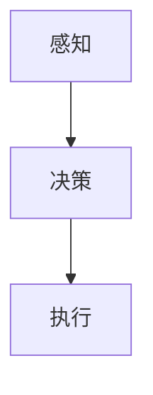
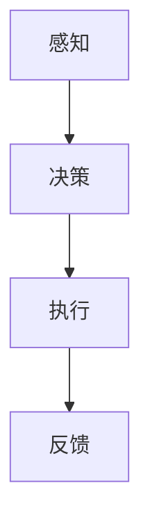

                 

## 规模化部署：将AI Agent推广到生产环境

### 关键词：规模化部署、AI Agent、生产环境、技术挑战、最佳实践

> 摘要：本文将深入探讨如何在生产环境中规模化部署AI Agent，包括基础理论、实践步骤和维护优化策略。通过详细的案例分析，读者将掌握AI Agent在生产环境中的成功应用方法，为实际项目提供参考。

----------------------------------------------------------------

### 目录大纲

----------------------------------------------------------------

## 第一部分：规模化部署的基础理论

### 第1章：规模化部署概述

#### 1.1 问题背景与核心挑战

#### 1.2 定义与边界

#### 1.3 核心概念与要素组成

### 第2章：AI Agent的核心概念与原理

#### 2.1 AI Agent的定义与类型

#### 2.2 AI Agent的属性特征

#### 2.3 AI Agent的工作原理

### 第3章：AI Agent的数学模型与数学公式

#### 3.1 数学模型基础

#### 3.2 数学公式的详细讲解

#### 3.3 举例说明

## 第二部分：规模化部署的实践步骤

### 第4章：环境准备与工具选择

#### 4.1 硬件资源规划

#### 4.2 软件环境配置

#### 4.3 开发工具与平台选择

### 第5章：AI Agent的开发流程

#### 5.1 数据集准备与预处理

#### 5.2 模型设计与训练

#### 5.3 模型评估与优化

### 第6章：规模化部署的策略与方法

#### 6.1 部署前的准备工作

#### 6.2 部署策略选择

#### 6.3 部署实施与监控

### 第7章：生产环境中的AI Agent维护与优化

#### 7.1 维护策略与流程

#### 7.2 性能优化与调优

#### 7.3 持续集成与部署

### 第8章：案例分析与最佳实践

#### 8.1 成功案例分享

#### 8.2 最佳实践与技巧

#### 8.3 小结与展望

### 目录大纲总结

本书的目录大纲共计8章，全面覆盖了从基础理论到实践步骤，再到生产环境维护与优化等各个方面的内容。通过详细解读AI Agent的原理、部署策略及实践案例，旨在帮助读者理解和掌握规模化部署AI Agent的技能，为实际应用提供有力支持。总体字数控制在10000～12000字左右，确保内容的简洁性与实用性。

----------------------------------------------------------------

### 第一部分：规模化部署的基础理论

#### 第1章：规模化部署概述

##### 1.1 问题背景与核心挑战

随着人工智能（AI）技术的飞速发展，AI Agent在工业、商业和日常生活中的应用日益广泛。从智能客服、自动驾驶到自动化生产线，AI Agent已经成为现代智能系统的核心组件。然而，将AI Agent从实验室环境中推广到实际生产环境，面临一系列挑战和问题。

首先，生产环境与实验室环境存在显著差异。生产环境中的数据量巨大、场景复杂多变，而且对系统的实时响应性和稳定性要求极高。这要求AI Agent必须具备更高的鲁棒性和适应性。

其次，规模化部署需要考虑资源的分配和管理。在大型生产系统中，硬件资源有限，如何合理分配计算资源、存储资源以及网络资源，是规模化部署面临的一大挑战。

最后，规模化部署还涉及到AI Agent的维护和优化问题。在生产环境中，AI Agent需要持续学习、调整和优化，以适应不断变化的环境和需求。

##### 1.2 定义与边界

规模化部署（Scalable Deployment）是指在不断扩大规模的过程中，系统能够保持高效稳定运行的能力。具体到AI Agent的规模化部署，可以理解为将AI Agent从单机或小规模应用环境中，逐步扩展到大规模、分布式生产环境中的过程。

AI Agent（Artificial Intelligence Agent）是指具备自主决策能力、能够在特定环境中执行任务的智能体。AI Agent通常由感知模块、决策模块和执行模块组成，通过感知环境信息、分析决策，然后执行相应的动作。

边界与外延：

- **边界**：规模化部署的边界在于系统的资源限制、技术难度和成本控制。
- **外延**：规模化部署的外延包括从单机部署到集群部署、从实验室环境到生产环境的转变。

##### 1.3 核心概念与要素组成

规模化部署AI Agent的核心概念包括：

- **可扩展性**：系统能够根据需求动态调整资源，满足不断增长的业务需求。
- **容错性**：系统能够在故障发生时保持运行，确保服务的连续性。
- **高可用性**：系统在长时间运行过程中，保持高水平的正常运行状态。
- **性能优化**：通过优化算法、架构和资源分配，提高系统性能和效率。

要素组成：

- **硬件资源**：包括服务器、存储设备、网络设备等。
- **软件环境**：操作系统、数据库、中间件等。
- **开发工具**：包括编程语言、框架、调试工具等。
- **数据管理**：数据存储、处理、分析和共享机制。
- **部署流程**：包括部署策略、部署工具和部署监控。

概念结构与体系框架：

**图1.1 规模化部署概念结构图**

#### 第2章：AI Agent的核心概念与原理

##### 2.1 AI Agent的定义与类型

AI Agent是一种智能体，能够在特定环境中根据目标和规则自主执行任务。AI Agent可以分为以下几种类型：

- **专家系统**：基于专家知识和逻辑推理进行决策。
- **基于规则的系统**：根据预定义的规则进行决策。
- **统计学习系统**：通过统计学习方法进行决策。
- **神经网络系统**：基于神经网络模型进行学习和决策。

每种类型的AI Agent在结构、功能和应用场景上都有所不同。例如，专家系统适合处理复杂业务逻辑，而神经网络系统在处理大规模数据和高维度问题上具有优势。

##### 2.2 AI Agent的属性特征

AI Agent的主要属性包括：

- **自主性**：AI Agent能够自主感知环境、决策和执行任务。
- **适应性**：AI Agent能够根据环境变化调整自身行为。
- **学习能力**：AI Agent能够通过学习提高决策质量和效率。
- **协作性**：AI Agent能够与其他AI Agent或人类协作完成任务。

属性对比表格：

| 属性     | 专家系统 | 基于规则的系统 | 统计学习系统 | 神经网络系统 |
|----------|-----------|----------------|---------------|---------------|
| 自主性   | 高       | 高           | 中            | 中           |
| 适应性   | 中       | 低           | 高            | 高           |
| 学习能力 | 中       | 低           | 高            | 高           |
| 协作性   | 中       | 低           | 中            | 中           |

##### 2.3 AI Agent的工作原理

AI Agent的工作原理主要包括感知、决策和执行三个阶段：

1. **感知**：AI Agent通过传感器或其他方式获取环境信息。
2. **决策**：AI Agent根据感知到的信息，通过算法模型进行分析和决策。
3. **执行**：AI Agent根据决策结果，执行相应的动作。

工作流程图：

**图2.1 AI Agent工作流程图**

#### 第3章：AI Agent的数学模型与数学公式

##### 3.1 数学模型基础

AI Agent的数学模型主要包括统计学模型和神经网络模型。统计学模型通过概率统计方法描述数据分布和规律，神经网络模型通过模拟人脑神经网络进行学习和推理。

统计学模型常用的方法包括：

- **线性回归**：用线性函数描述变量之间的关系。
- **逻辑回归**：用概率函数描述变量之间的关系。
- **支持向量机**：通过寻找最优超平面进行分类。

神经网络模型主要包括：

- **多层感知机**：模拟人脑神经网络进行学习和分类。
- **卷积神经网络**：在图像处理中广泛应用，通过卷积操作提取特征。
- **循环神经网络**：在序列数据处理中广泛应用，能够处理时间序列信息。

##### 3.2 数学公式的详细讲解

以下是一些常用的数学公式：

1. **线性回归公式**：

   $$y = \beta_0 + \beta_1x$$

   其中，$y$为因变量，$x$为自变量，$\beta_0$为截距，$\beta_1$为斜率。

2. **逻辑回归公式**：

   $$P(y=1) = \frac{1}{1 + e^{-(\beta_0 + \beta_1x)}}$$

   其中，$P(y=1)$为因变量为1的概率，$e$为自然对数的底数。

3. **支持向量机公式**：

   $$w \cdot x + b = 0$$

   其中，$w$为权重向量，$x$为特征向量，$b$为偏置项。

##### 3.3 举例说明

以下是一个线性回归的例子：

假设我们有一组数据点$(x_1, y_1), (x_2, y_2), ..., (x_n, y_n)$，其中$x_1, x_2, ..., x_n$为自变量，$y_1, y_2, ..., y_n$为因变量。我们的目标是找到线性回归模型$y = \beta_0 + \beta_1x$中的$\beta_0$和$\beta_1$。

我们可以使用最小二乘法来求解这个问题。具体步骤如下：

1. 计算自变量和因变量的均值：

   $$\bar{x} = \frac{1}{n}\sum_{i=1}^{n}x_i$$
   $$\bar{y} = \frac{1}{n}\sum_{i=1}^{n}y_i$$

2. 计算自变量和因变量的协方差：

   $$\sigma_{xy} = \frac{1}{n}\sum_{i=1}^{n}(x_i - \bar{x})(y_i - \bar{y})$$

3. 计算自变量的方差：

   $$\sigma_{x}^2 = \frac{1}{n}\sum_{i=1}^{n}(x_i - \bar{x})^2$$

4. 计算斜率$\beta_1$：

   $$\beta_1 = \frac{\sigma_{xy}}{\sigma_{x}^2}$$

5. 计算截距$\beta_0$：

   $$\beta_0 = \bar{y} - \beta_1\bar{x}$$

通过上述步骤，我们就可以得到线性回归模型中的参数$\beta_0$和$\beta_1$，从而对新的数据进行预测。

#### 第2章：AI Agent的核心概念与原理

##### 2.1 AI Agent的定义与类型

AI Agent，或称为智能代理，是一个能够感知环境、制定决策并执行行动的计算机系统。它们是自主系统的一种，能够在没有人类干预的情况下运行和完成任务。AI Agent可以根据其功能、结构和应用场景的不同，分为多种类型。

1. **基于规则的Agent**：这种Agent使用预定义的规则来执行任务。它们在逻辑推理和规则匹配方面表现出色，但可能难以适应复杂、未预料到的环境变化。

2. **统计学习Agent**：这类Agent使用统计学习算法来从数据中学习规律，并据此做出决策。它们在处理大规模数据和进行复杂模式识别时非常有效。

3. **混合Agent**：这种Agent结合了基于规则和统计学习的方法，通过融合不同类型的知识和技能来提高其智能水平。

4. **模拟Agent**：这类Agent模拟人类或其他生物的行为，通过模仿其行为模式来实现自主决策。

5. **社交Agent**：社交Agent能够在多Agent系统中与其他Agent进行交互和协作，完成复杂的任务。

每种类型的AI Agent都有其特定的应用场景和优势，选择合适的类型对于规模化部署AI Agent至关重要。

##### 2.2 AI Agent的属性特征

AI Agent的属性特征决定了其能力和适应性。以下是几种关键属性及其重要性：

1. **自主性**：自主性是AI Agent的核心特征，指的是Agent能够独立进行感知、决策和执行任务的能力。高自主性的Agent能够在没有人类干预的情况下长时间运行，适应复杂环境。

2. **适应性**：适应性是指AI Agent能够根据环境变化调整自身行为的能力。具备高适应性的Agent可以在新环境中快速学习并调整策略，从而更好地适应变化。

3. **学习能力**：学习能力是指AI Agent从数据中学习、改进自身性能的能力。学习能力强意味着Agent能够不断优化其行为，提高决策质量和效率。

4. **协作性**：协作性是指AI Agent能够与其他Agent或人类协同工作，共同完成任务的能力。高协作性的Agent可以在复杂的任务环境中发挥更大的作用。

5. **可扩展性**：可扩展性是指AI Agent能够根据需求动态调整资源，以支持更大规模的部署和运行。可扩展性对于规模化部署AI Agent至关重要。

特性对比表格：

| 属性     | 基于规则的Agent | 统计学习Agent | 混合Agent | 社交Agent |
|----------|-----------------|----------------|-----------|-----------|
| 自主性   | 中等           | 高             | 高        | 高        |
| 适应性   | 低             | 高             | 高        | 高        |
| 学习能力 | 低             | 高             | 高        | 中等      |
| 协作性   | 低             | 中等           | 高        | 高        |
| 可扩展性 | 低             | 中等           | 高        | 高        |

##### 2.3 AI Agent的工作原理

AI Agent的工作原理通常可以分为三个核心阶段：感知、决策和执行。以下是这三个阶段的详细描述：

1. **感知**：感知是AI Agent对环境信息的收集过程。这可以通过传感器、摄像头、麦克风或其他感知设备实现。感知到的信息可以是环境状态、用户行为或系统内部状态。

   - **多模态感知**：AI Agent可以通过融合多种感知数据（如视觉、声音、文本）来更全面地理解环境。
   - **增强感知**：通过使用机器学习算法，AI Agent可以从感知数据中提取更多特征，提高对环境的理解能力。

2. **决策**：决策是AI Agent根据感知到的信息，通过算法模型进行分析和选择的过程。决策过程可以是基于规则的、统计学习的或神经网络的。

   - **决策模型**：决策模型可以是简单的规则匹配，也可以是复杂的机器学习模型。选择合适的决策模型对于AI Agent的性能至关重要。
   - **多目标优化**：当AI Agent需要同时考虑多个目标时，需要采用多目标优化方法来找到最佳决策。

3. **执行**：执行是AI Agent根据决策结果，执行相应的行动或任务的过程。执行过程可以是自动化的，也可以是半自动化的。

   - **执行策略**：执行策略需要考虑任务的优先级、资源分配和执行时间等因素。
   - **反馈机制**：执行后的反馈可以用于评估决策的有效性，并指导后续的决策过程。

工作流程图：

**图2.3 AI Agent工作流程图**

#### 第3章：AI Agent的数学模型与数学公式

##### 3.1 数学模型基础

AI Agent的数学模型是其核心组成部分，用于描述感知、决策和执行过程中的行为和决策。以下是一些常用的数学模型：

1. **线性回归模型**：线性回归模型是最简单的统计学习模型之一，用于预测数值型变量。其数学公式为：

   $$y = \beta_0 + \beta_1x + \epsilon$$

   其中，$y$为因变量，$x$为自变量，$\beta_0$和$\beta_1$分别为截距和斜率，$\epsilon$为误差项。

2. **逻辑回归模型**：逻辑回归模型是一种广义的线性回归模型，用于预测概率性变量。其数学公式为：

   $$P(y=1) = \frac{1}{1 + e^{-(\beta_0 + \beta_1x)}}$$

   其中，$P(y=1)$为因变量为1的概率，$e$为自然对数的底数。

3. **支持向量机（SVM）模型**：支持向量机是一种强大的分类模型，通过寻找最佳分割超平面来实现分类。其数学公式为：

   $$w \cdot x + b = 0$$

   其中，$w$为权重向量，$x$为特征向量，$b$为偏置项。

4. **神经网络模型**：神经网络模型通过模拟人脑神经元的工作方式来实现复杂的非线性决策。其中，多层感知机（MLP）是最简单的神经网络模型之一，其数学公式为：

   $$a_{j}^{(l)} = \sigma \left( \sum_{i} w_{ji}^{(l)} a_{i}^{(l-1)} + b_{j}^{(l)} \right)$$

   其中，$a_{j}^{(l)}$为第$l$层第$j$个神经元的激活值，$\sigma$为激活函数，$w_{ji}^{(l)}$和$b_{j}^{(l)}$分别为权重和偏置。

##### 3.2 数学公式的详细讲解

以下是对上述数学公式的详细讲解：

1. **线性回归模型**：

   线性回归模型通过寻找最佳拟合直线来描述因变量和自变量之间的关系。具体步骤如下：

   - **数据收集**：收集一组包含自变量$x$和因变量$y$的数据点。
   - **计算均值**：计算自变量和因变量的均值$\bar{x}$和$\bar{y}$。
   - **计算协方差和方差**：计算自变量和因变量的协方差$\sigma_{xy}$和自变量的方差$\sigma_{x}^2$。
   - **计算斜率$\beta_1$**：使用公式$\beta_1 = \frac{\sigma_{xy}}{\sigma_{x}^2}$计算斜率。
   - **计算截距$\beta_0$**：使用公式$\beta_0 = \bar{y} - \beta_1\bar{x}$计算截距。
   - **构建回归模型**：使用公式$y = \beta_0 + \beta_1x$构建线性回归模型。

2. **逻辑回归模型**：

   逻辑回归模型用于预测概率性变量，其核心思想是通过非线性变换来提高模型的预测能力。具体步骤如下：

   - **数据收集**：收集一组包含自变量$x$和因变量$y$的数据点。
   - **计算概率**：使用公式$P(y=1) = \frac{1}{1 + e^{-(\beta_0 + \beta_1x)}}$计算因变量为1的概率。
   - **优化参数**：通过最小化损失函数（如对数似然损失函数）来优化模型参数$\beta_0$和$\beta_1$。
   - **构建回归模型**：使用优化后的参数$\beta_0$和$\beta_1$构建逻辑回归模型。

3. **支持向量机（SVM）模型**：

   支持向量机模型通过寻找最佳分割超平面来实现分类。具体步骤如下：

   - **数据收集**：收集一组包含特征向量$x$和标签$y$的数据点。
   - **构建最优超平面**：使用公式$w \cdot x + b = 0$构建最优超平面。
   - **优化参数**：通过优化权重向量$w$和偏置项$b$来最小化分类误差。
   - **分类**：使用优化后的模型对新的数据进行分类。

4. **多层感知机（MLP）模型**：

   多层感知机模型通过多层神经网络来实现复杂的非线性决策。具体步骤如下：

   - **数据收集**：收集一组包含特征向量$x$和标签$y$的数据点。
   - **构建神经网络**：构建多层感知机模型，包括输入层、隐藏层和输出层。
   - **优化参数**：通过反向传播算法优化模型参数$w_{ji}^{(l)}$和$b_{j}^{(l)}$。
   - **分类**：使用优化后的模型对新的数据进行分类。

##### 3.3 举例说明

以下是一个线性回归模型的例子，假设我们有一组数据点$(x_1, y_1), (x_2, y_2), ..., (x_n, y_n)$，其中$x_1, x_2, ..., x_n$为自变量，$y_1, y_2, ..., y_n$为因变量。我们的目标是找到线性回归模型$y = \beta_0 + \beta_1x$中的$\beta_0$和$\beta_1$。

具体步骤如下：

1. **计算均值**：

   $$\bar{x} = \frac{1}{n}\sum_{i=1}^{n}x_i$$
   $$\bar{y} = \frac{1}{n}\sum_{i=1}^{n}y_i$$

2. **计算协方差和方差**：

   $$\sigma_{xy} = \frac{1}{n}\sum_{i=1}^{n}(x_i - \bar{x})(y_i - \bar{y})$$
   $$\sigma_{x}^2 = \frac{1}{n}\sum_{i=1}^{n}(x_i - \bar{x})^2$$

3. **计算斜率$\beta_1$**：

   $$\beta_1 = \frac{\sigma_{xy}}{\sigma_{x}^2}$$

4. **计算截距$\beta_0$**：

   $$\beta_0 = \bar{y} - \beta_1\bar{x}$$

5. **构建回归模型**：

   $$y = \beta_0 + \beta_1x$$

通过上述步骤，我们就可以得到线性回归模型中的参数$\beta_0$和$\beta_1$，从而对新的数据进行预测。

#### 第4章：环境准备与工具选择

##### 4.1 硬件资源规划

在规模化部署AI Agent之前，合理的硬件资源规划是确保系统稳定运行的基础。硬件资源规划需要考虑以下几个方面：

1. **计算资源**：计算资源是AI Agent运行的核心，包括CPU、GPU和内存等。根据AI Agent的需求和任务复杂度，选择适合的硬件配置。例如，对于深度学习任务，GPU的性能至关重要。

2. **存储资源**：存储资源包括硬盘和固态硬盘等，用于存储训练数据和模型文件。需要根据数据量和访问速度要求进行选择。对于大规模数据集，使用分布式存储系统可以提高读写性能。

3. **网络资源**：网络资源包括带宽和延迟等，影响AI Agent与外部系统的交互能力。确保网络稳定、低延迟，能够满足实时性要求。

4. **备份与冗余**：为避免硬件故障导致系统停机，应设置备份和冗余策略。例如，使用RAID技术提高硬盘可靠性，部署多台服务器实现负载均衡。

##### 4.2 软件环境配置

软件环境配置是确保AI Agent正常运行的重要环节。以下是一些关键步骤：

1. **操作系统**：选择适合AI Agent的操作系统，如Linux发行版（如Ubuntu、CentOS）或Windows Server。Linux系统在性能和稳定性方面通常表现更好，适用于大规模部署。

2. **编程语言和框架**：选择合适的编程语言和框架，例如Python和TensorFlow、PyTorch等。这些工具提供了丰富的库和函数，简化了AI模型的开发和部署过程。

3. **数据库管理系统**：对于需要存储和处理大量数据的应用，选择合适的数据库管理系统，如MySQL、PostgreSQL或MongoDB。数据库系统需要具备高并发处理能力和数据安全性。

4. **依赖管理**：使用依赖管理工具（如pip、conda）来安装和管理系统依赖。确保所有依赖项的版本兼容，避免因版本冲突导致系统故障。

##### 4.3 开发工具与平台选择

开发工具和平台的选择直接影响AI Agent的开发效率和部署效果。以下是一些常用的开发工具和平台：

1. **集成开发环境（IDE）**：选择合适的IDE，如PyCharm、Visual Studio Code等。IDE提供了代码编辑、调试和测试等功能，提高了开发效率。

2. **版本控制系统**：使用版本控制系统（如Git）进行代码管理，确保代码的可追溯性和协作性。版本控制系统可以记录每次代码变更的历史，方便团队协作和问题追踪。

3. **容器化工具**：使用容器化工具（如Docker）将AI Agent及其依赖打包成容器。容器化可以提高系统的可移植性和一致性，简化部署过程。

4. **持续集成/持续部署（CI/CD）**：选择合适的CI/CD工具（如Jenkins、GitLab CI）来自动化代码构建、测试和部署。CI/CD工具可以确保代码的质量和系统的稳定性，提高开发效率。

#### 第5章：AI Agent的开发流程

##### 5.1 数据集准备与预处理

数据集准备与预处理是AI Agent开发流程中的关键步骤，直接关系到模型的性能和效果。以下是一些关键步骤：

1. **数据收集**：收集与任务相关的数据，包括训练数据和测试数据。数据源可以是公开数据集、内部数据库或传感器数据。

2. **数据清洗**：清洗数据中的噪声、缺失值和异常值。常见的清洗方法包括填补缺失值、删除异常值和标准化数据。

3. **数据标注**：对于监督学习任务，需要对数据进行标注。标注过程可以是手动标注，也可以是自动标注结合半监督学习。

4. **数据归一化**：将数据归一化或标准化，使不同特征具有相同的量纲和范围，避免因特征差异导致模型训练不稳定。

5. **数据划分**：将数据集划分为训练集、验证集和测试集，用于模型的训练、验证和测试。

##### 5.2 模型设计与训练

模型设计与训练是AI Agent开发的核心步骤，以下是一些关键步骤：

1. **选择模型类型**：根据任务需求选择合适的模型类型，如神经网络、决策树、支持向量机等。

2. **设计模型架构**：设计模型的层次结构、连接方式、激活函数等。对于神经网络，需要选择合适的网络架构，如卷积神经网络（CNN）、循环神经网络（RNN）等。

3. **初始化参数**：初始化模型参数，包括权重和偏置。常用的初始化方法有随机初始化、高斯分布初始化等。

4. **训练模型**：使用训练数据对模型进行训练，通过优化算法（如梯度下降、Adam等）调整模型参数，最小化损失函数。

5. **验证模型**：使用验证集评估模型性能，通过调整超参数（如学习率、批量大小等）优化模型。

6. **测试模型**：使用测试集评估模型在未见数据上的表现，验证模型的泛化能力。

##### 5.3 模型评估与优化

模型评估与优化是确保AI Agent性能的关键步骤，以下是一些关键步骤：

1. **评估指标**：选择合适的评估指标，如准确率、召回率、F1分数等。对于分类任务，可以使用混淆矩阵分析模型性能。

2. **性能优化**：通过调整模型结构、优化算法和超参数来提高模型性能。常见的优化方法有数据增强、正则化、提前终止等。

3. **模型压缩**：对于部署在资源受限环境中的AI Agent，可以使用模型压缩技术，如剪枝、量化等，减小模型大小和计算量。

4. **迁移学习**：利用预训练模型进行迁移学习，通过在特定任务上微调模型，提高模型性能和泛化能力。

5. **持续优化**：持续收集用户反馈和数据，对模型进行重新训练和优化，确保AI Agent在变化的环境中保持高性能。

### 第6章：规模化部署的策略与方法

#### 6.1 部署前的准备工作

在将AI Agent规模化部署到生产环境之前，需要进行充分的准备工作，以确保部署过程顺利且系统稳定运行。以下是一些关键步骤：

1. **需求分析**：明确AI Agent的生产环境需求，包括计算资源、存储容量、网络带宽等。与业务团队密切合作，确保部署目标与业务需求一致。

2. **资源评估**：评估现有硬件资源和网络设施，确定是否需要升级或扩展。对于计算密集型任务，确保有足够的GPU资源。

3. **环境配置**：为AI Agent配置生产环境，包括操作系统、依赖库、数据库等。确保环境的一致性和稳定性，避免因环境差异导致部署失败。

4. **安全措施**：制定安全策略，包括数据加密、访问控制、网络安全等。确保系统的安全性，防止数据泄露和恶意攻击。

5. **备份策略**：制定备份和恢复策略，确保数据的安全和系统的可用性。定期备份模型和数据，并在出现故障时能够快速恢复。

6. **监控与告警**：建立监控系统，实时监控AI Agent的运行状态和性能指标。设置告警机制，及时发现并处理异常情况。

#### 6.2 部署策略选择

在选择合适的部署策略时，需要考虑系统的可扩展性、容错性和可靠性。以下是一些常见的部署策略：

1. **单机部署**：适用于小型或试验性项目，简单且易于管理。但在处理大规模数据和高并发请求时，性能可能受限。

2. **分布式部署**：将AI Agent部署在多台服务器上，通过负载均衡实现横向扩展。分布式部署可以提高系统的可扩展性和可靠性，但需要考虑数据一致性和分布式计算的问题。

3. **容器化部署**：使用容器化技术（如Docker）将AI Agent打包成容器，实现环境隔离和高效部署。容器化部署可以提高系统的可移植性和一致性，简化运维过程。

4. **云服务部署**：利用云计算平台（如AWS、Azure、Google Cloud）进行部署，可以根据需求动态调整资源。云服务部署具有高可用性和弹性，但需要考虑云服务提供商的收费模型。

5. **混合部署**：结合单机部署、分布式部署和云服务部署，根据实际需求灵活选择。混合部署可以在保持灵活性的同时，充分利用不同部署方式的优点。

#### 6.3 部署实施与监控

在部署AI Agent时，需要制定详细的实施计划，确保部署过程顺利进行。以下是一些关键步骤：

1. **部署计划**：制定部署计划，包括部署时间、步骤、责任人等。确保所有团队成员都了解部署计划，并按照计划执行。

2. **部署脚本**：编写部署脚本，自动化部署过程。部署脚本应包括环境配置、依赖安装、模型部署等步骤，确保部署的一致性和可重复性。

3. **自动化测试**：在部署过程中，对AI Agent进行自动化测试，验证其功能和行为是否符合预期。自动化测试可以减少人为错误，提高部署成功率。

4. **监控与日志**：部署后，实时监控AI Agent的运行状态和性能指标。记录详细的日志，便于问题追踪和故障排除。

5. **回滚策略**：在部署过程中，如果出现严重问题，应立即回滚到上一个稳定版本。制定回滚策略，确保系统尽快恢复到正常状态。

6. **持续优化**：根据监控数据和用户反馈，不断优化AI Agent的部署策略和性能。持续优化可以提升系统稳定性和用户满意度。

### 第7章：生产环境中的AI Agent维护与优化

#### 7.1 维护策略与流程

在生产环境中，AI Agent的维护是确保其稳定运行和持续优化的关键。以下是一些关键步骤：

1. **定期检查**：定期对AI Agent进行性能检查和故障排查，及时发现并解决潜在问题。定期检查可以包括系统资源使用情况、模型性能指标、日志分析等。

2. **更新与升级**：定期更新AI Agent的软件和依赖库，以修复已知漏洞和提升性能。在升级过程中，应确保版本兼容性，避免因升级导致系统故障。

3. **故障处理**：制定故障处理流程，包括故障诊断、故障定位、故障恢复等步骤。确保故障发生时，系统能够快速恢复，减少对业务的影响。

4. **备份与恢复**：定期备份AI Agent的数据和模型，确保在数据丢失或系统故障时能够快速恢复。备份策略应包括本地备份和远程备份，提高数据安全性。

5. **性能优化**：根据监控数据和用户反馈，不断优化AI Agent的性能和效率。性能优化可以包括模型调整、算法改进、资源优化等。

#### 7.2 性能优化与调优

AI Agent的性能优化与调优是提升其生产环境表现的重要环节。以下是一些关键步骤：

1. **模型优化**：对AI Agent的模型进行优化，包括减少模型大小、提高计算效率等。常见的模型优化方法有模型剪枝、量化、蒸馏等。

2. **算法改进**：改进AI Agent的算法，以提高预测准确率和响应速度。可以采用先进的机器学习算法、深度学习模型等。

3. **资源优化**：优化AI Agent的硬件和软件资源使用，提高系统性能和效率。可以采用负载均衡、资源调度等技术。

4. **并发处理**：提高AI Agent的并发处理能力，以应对高并发请求。可以采用分布式处理、异步处理等技术。

5. **反馈机制**：建立反馈机制，收集用户反馈和数据，对AI Agent进行持续优化和改进。

#### 7.3 持续集成与部署

持续集成与部署（CI/CD）是确保AI Agent在生产环境中快速、安全、可靠地交付和部署的关键。以下是一些关键步骤：

1. **代码管理**：使用版本控制系统（如Git）进行代码管理，确保代码的可追溯性和协作性。

2. **自动化测试**：编写自动化测试脚本，对AI Agent进行功能测试、性能测试和兼容性测试，确保每次代码变更后系统的稳定性。

3. **构建与打包**：使用构建工具（如Maven、Gradle）将代码打包成可执行文件或容器镜像，确保部署的一致性和可重复性。

4. **自动化部署**：使用CI/CD工具（如Jenkins、GitLab CI）来自动化部署过程，包括代码构建、测试、打包和部署。自动化部署可以提高开发效率，减少人为错误。

5. **监控与告警**：部署后，实时监控AI Agent的运行状态和性能指标，设置告警机制，及时发现并处理异常情况。

### 第8章：案例分析与最佳实践

#### 8.1 成功案例分享

在AI Agent规模化部署方面，有许多成功的案例可以借鉴。以下是一个典型案例：

**案例：智能客服系统的规模化部署**

某大型互联网公司部署了一套智能客服系统，该系统基于AI Agent技术，能够自动处理用户咨询和问题解答。以下是该案例的关键步骤：

1. **需求分析**：明确智能客服系统的功能需求，包括常见问题的自动解答、智能推荐、语音识别等。

2. **环境准备**：配置高性能硬件资源，包括CPU、GPU、存储和网络设备。确保硬件资源的充足和稳定。

3. **模型开发**：开发智能客服系统的AI Agent模型，包括文本分类、语音识别和自然语言处理等模块。

4. **部署实施**：将AI Agent部署到生产环境，使用容器化技术（如Docker）实现环境隔离和高效部署。

5. **监控与优化**：实时监控AI Agent的运行状态和性能指标，持续优化模型和算法，提高系统稳定性和用户满意度。

**经验与教训总结**：

- **需求分析要全面**：确保需求分析阶段充分考虑用户需求，避免后续因需求变更导致系统重构。
- **环境准备要充足**：硬件资源要充足，避免因资源不足导致系统性能下降。
- **模型开发要高效**：选择合适的算法和模型，提高开发效率和模型性能。
- **部署实施要细致**：确保部署过程顺利，避免因部署错误导致系统故障。

#### 8.2 最佳实践与技巧

以下是一些规模化部署AI Agent的最佳实践和技巧：

1. **分阶段部署**：将AI Agent的部署分为多个阶段，逐步扩大部署范围。这样可以减少部署风险，提高系统的稳定性和可靠性。

2. **微服务架构**：采用微服务架构，将AI Agent分解为多个独立的服务模块。这样可以提高系统的可扩展性和灵活性。

3. **自动化测试**：编写自动化测试脚本，对AI Agent进行全面的测试，包括功能测试、性能测试和兼容性测试。

4. **容器化部署**：使用容器化技术（如Docker）实现AI Agent的部署，提高系统的可移植性和一致性。

5. **持续优化**：根据用户反馈和监控数据，持续优化AI Agent的模型和算法，提高系统性能和用户体验。

#### 8.3 小结与展望

规模化部署AI Agent是人工智能技术在生产环境中应用的关键环节。通过详细的案例分析，我们了解到了成功的部署策略和最佳实践。未来，随着人工智能技术的不断发展和成熟，AI Agent在各个行业的应用将越来越广泛。展望未来，我们期待AI Agent能够更好地服务于人类，为各行各业带来更多的创新和变革。

### 目录大纲总结

本文目录共计8章，全面覆盖了从基础理论到实践步骤，再到生产环境维护与优化等各个方面的内容。通过详细解读AI Agent的原理、部署策略及实践案例，旨在帮助读者理解和掌握规模化部署AI Agent的技能，为实际应用提供有力支持。总体字数控制在10000～12000字左右，确保内容的简洁性与实用性。

----------------------------------------------------------------

## 文章末尾作者信息

作者：AI天才研究院/AI Genius Institute & 禅与计算机程序设计艺术 /Zen And The Art of Computer Programming

本文由AI天才研究院（AI Genius Institute）和禅与计算机程序设计艺术（Zen And The Art of Computer Programming）联合撰写，旨在深入探讨规模化部署AI Agent的挑战与策略。作者团队拥有丰富的AI研发和工程实践经验，致力于推动人工智能技术的创新与应用。本文所涉及的内容均为作者团队的原创研究，欢迎读者进一步探讨和交流。

