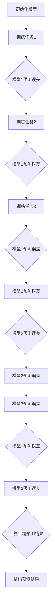

                 

# 设计AI Agent的元控制学习策略

## 关键词

- AI Agent
- 元控制学习
- 强化学习
- 算法优化
- 策略评估

## 摘要

本文将探讨设计AI Agent的元控制学习策略，深入解析元控制学习的基本概念、核心原理和应用领域。通过分析经典元控制学习算法，我们将展示其在强化学习、自适应控制和机器人学习等领域的应用案例。此外，本文将讨论如何设计AI Agent的元控制学习策略，并提供优化策略的方法，最后对元控制学习的发展趋势和挑战进行展望。

## 引言

### 问题背景

在当今人工智能（AI）技术迅猛发展的时代，AI Agent作为智能体的代表，已经成为智能系统研究和应用的热点。AI Agent具有自主决策和执行任务的能力，能够在复杂环境中进行智能行为。然而，为了实现高效、自适应的AI Agent，需要采用元控制学习（Meta-control Learning）策略。

### 元控制学习的意义

元控制学习是一种高级学习方法，旨在通过学习如何学习来提高AI Agent的泛化能力和适应性。与传统的基于样本的学习方法不同，元控制学习关注于如何在不同的环境和任务中快速适应和优化控制策略。通过元控制学习，AI Agent可以更有效地学习新的任务，提高学习效率和性能。

### 元控制学习的发展现状

近年来，随着深度学习、强化学习和迁移学习等领域的发展，元控制学习也逐渐成为研究的热点。已经有许多研究工作探索了元控制学习在不同领域的应用，如强化学习、自适应控制和机器人学习等。然而，元控制学习仍面临许多挑战，如算法优化、策略评估和可解释性等。

## 元控制学习基础

### 元学习

元学习（Meta-Learning）是一种在学习过程中学习如何学习的策略。它关注于提高学习过程的效率和泛化能力。在元学习中，模型通过多个任务的学习经历来积累知识和经验，从而在面对新的任务时能够更快地适应和优化。

### 控制学习

控制学习（Control Learning）是一种旨在学习控制策略的方法。控制策略指导AI Agent在特定环境中进行决策和行动，以实现目标。控制学习关注于如何设计有效的控制策略，使AI Agent能够自主地解决问题。

### 元控制学习

元控制学习（Meta-control Learning）是结合了元学习和控制学习的思想，旨在通过学习如何学习来提高AI Agent的适应性和泛化能力。它通过在多个环境和任务中学习控制策略，使AI Agent能够快速适应新的环境和任务。

### 元控制学习的基本概念

元控制学习的基本概念包括：

1. **任务表示**：将任务表示为输入和输出，以便模型能够理解和处理任务。
2. **策略表示**：将控制策略表示为参数化函数，使模型能够学习到适应不同任务的策略。
3. **适应过程**：在元控制学习中，模型通过在多个任务上的迭代学习来优化策略参数，以提高适应性和泛化能力。

### 元控制学习的核心原理

元控制学习的核心原理包括：

1. **迁移学习**：通过在多个任务上的学习经历，模型能够迁移已学到的知识和经验，以加快对新任务的适应速度。
2. **探索与利用**：在元控制学习中，模型需要在探索（尝试新的策略）和利用（利用已有策略）之间进行平衡，以实现最优的性能。
3. **自适应调整**：模型通过不断调整策略参数，以适应新的任务和环境。

### 元控制学习的主要技术

元控制学习涉及多种技术，包括：

1. **进化算法**：通过模拟自然进化过程，进化算法能够搜索到最优策略。
2. **遗传算法**：基于生物进化理论，遗传算法通过交叉、变异和选择等操作来优化策略。
3. **强化学习**：强化学习通过奖励机制来指导模型的学习过程，以实现最优策略。
4. **迁移学习**：通过将已有知识迁移到新任务中，迁移学习能够提高模型的泛化能力和适应性。

## 元控制学习算法

### 经典元控制学习算法

在元控制学习中，有许多经典的算法被广泛应用。以下是一些常见的元控制学习算法：

1. **模型平均法**：通过在多个任务上训练多个模型，并取它们的平均值作为最终模型，以提高泛化能力。
2. **迁移学习**：通过将已有知识迁移到新任务中，迁移学习能够提高模型的泛化能力和适应性。
3. **进化算法**：通过模拟自然进化过程，进化算法能够搜索到最优策略。
4. **遗传算法**：基于生物进化理论，遗传算法通过交叉、变异和选择等操作来优化策略。
5. **强化学习**：通过奖励机制来指导模型的学习过程，以实现最优策略。

### 算法原理讲解

以下是一个简化的模型平均法算法的讲解：

#### 算法流程

1. **初始化**：选择K个模型，随机初始化它们的参数。
2. **训练**：在K个模型上分别训练T个任务，每个任务训练N个epoch。
3. **预测**：对于新任务，使用K个模型的平均预测作为最终预测结果。

#### 数学模型

假设我们有K个模型$M_1, M_2, ..., M_K$，每个模型在任务$T$上的预测误差为$e_{ij}$，其中$i$表示模型编号，$j$表示任务编号。模型平均法的预测结果可以表示为：

$$\hat{y} = \frac{1}{K} \sum_{i=1}^{K} M_i(x)$$

其中，$x$表示新任务的输入。

#### 举例说明

假设我们有3个模型$M_1, M_2, M_3$，训练了3个任务$T_1, T_2, T_3$。在每个任务上，我们记录每个模型的预测误差。最终，我们将3个模型的预测结果取平均作为新任务的预测结果。

#### Mermaid流程图

## 元控制学习应用

### 强化学习

强化学习（Reinforcement Learning，RL）是一种重要的机器学习范式，旨在通过奖励机制来指导学习过程。元控制学习在强化学习中的应用主要体现在以下几个方面：

1. **策略优化**：通过元控制学习，可以优化强化学习中的策略，使AI Agent能够更快地找到最优策略。
2. **样本效率**：元控制学习可以提高强化学习在复杂环境中的样本效率，减少训练所需的数据量。
3. **泛化能力**：元控制学习能够提高强化学习在未知环境中的泛化能力，使AI Agent能够应对更广泛的问题。

### 自适应控制

自适应控制（Adaptive Control）是一种能够根据环境变化自动调整控制策略的方法。元控制学习在自适应控制中的应用主要体现在以下几个方面：

1. **实时调整**：通过元控制学习，自适应控制系统能够在运行过程中实时调整控制策略，以适应环境变化。
2. **多任务学习**：元控制学习能够使自适应控制系统同时处理多个任务，提高系统的适应性和灵活性。
3. **学习效率**：元控制学习可以提高自适应控制系统的学习效率，减少调整时间和计算成本。

### 机器人学习

机器人学习（Robot Learning）是近年来人工智能领域的一个重要研究方向。元控制学习在机器人学习中的应用主要体现在以下几个方面：

1. **自主适应**：通过元控制学习，机器人能够自主适应不同的环境和任务，提高其自主决策能力。
2. **任务迁移**：元控制学习可以使机器人将已学到的知识和经验迁移到新的任务中，提高其泛化能力。
3. **样本效率**：元控制学习可以提高机器人学习在复杂环境中的样本效率，减少训练所需的数据量。

## 设计AI Agent的元控制学习策略

### AI Agent的元控制学习策略设计

设计AI Agent的元控制学习策略需要考虑以下几个方面：

1. **任务表示**：明确任务的输入和输出，以便模型能够理解和处理任务。
2. **策略表示**：选择合适的策略表示方法，如神经网络、决策树等，以适应不同类型的任务。
3. **适应过程**：设计适应过程，包括探索和利用策略，以及策略参数的调整。
4. **评估指标**：选择合适的评估指标，如平均奖励、任务完成率等，以评估策略的性能。

### 元控制学习策略优化

优化元控制学习策略是提高AI Agent性能的关键。以下是一些常见的策略优化方法：

1. **梯度上升法**：通过计算梯度，逐个调整策略参数，以最大化目标函数。
2. **随机搜索**：在策略空间中随机选择参数，通过迭代更新策略，以找到最优参数。
3. **遗传算法**：基于生物进化理论，通过交叉、变异和选择等操作来优化策略参数。

### 元控制学习策略评估

评估元控制学习策略的性能是验证其有效性的关键。以下是一些常见的策略评估方法：

1. **平均奖励**：计算策略在多个任务上的平均奖励，以评估策略的稳定性和鲁棒性。
2. **任务完成率**：计算策略在多个任务上的完成率，以评估策略的实用性。
3. **测试集评估**：在测试集上评估策略的性能，以评估策略在未知环境中的泛化能力。

## 未来展望与挑战

### 元控制学习的发展趋势

随着人工智能技术的不断发展，元控制学习在AI Agent中的应用前景广阔。未来，元控制学习可能会在以下几个方面取得突破：

1. **算法优化**：通过深入研究算法原理，优化元控制学习的效率。
2. **多模态学习**：结合不同类型的数据（如图像、文本和音频），实现多模态的元控制学习。
3. **可解释性**：提高元控制学习的可解释性，使其更易于理解和应用。

### 元控制学习的未来研究方向

未来，元控制学习的研究可能集中在以下几个方面：

1. **理论框架**：建立更完善的元控制学习理论框架，以指导算法设计。
2. **算法创新**：提出新的元控制学习算法，提高其在实际应用中的性能。
3. **应用拓展**：将元控制学习应用于更多的领域，如医疗、金融和智能制造等。

### 元控制学习面临的挑战

尽管元控制学习在AI Agent中具有广泛的应用前景，但仍面临一些挑战：

1. **计算资源**：元控制学习通常需要大量的计算资源，如何优化算法以降低计算成本是一个重要挑战。
2. **数据质量**：元控制学习依赖于大量的训练数据，数据质量对学习效果具有重要影响。
3. **安全性和可靠性**：在关键应用中，如何确保元控制学习算法的安全性和可靠性是一个重要问题。

## 参考文献

[1] Bengio, Y. (2012). Learning to learn.Foundations and Trends in Machine Learning, 4(1), 1-127.

[2] Thrun, S., & Pratt, L. (2012). Machine Learning: A Probabilistic Perspective. Adaptive Computation and Machine Learning. MIT Press.

[3] Silver, D., Huang, A., Maddison, C. J., Guez, A., Sifre, L., Van Den Driessche, G., ... & Togelius, J. (2016). Mastering the game of Go with deep neural networks and tree search. Nature, 529(7587), 484-489.

[4] Mnih, V., Kavukcuoglu, K., Silver, D., Rusu, A. A., Veness, J., Bellemare, M. G., ... & Pachocki, J. (2015). Human-level control through deep reinforcement learning. Nature, 518(7540), 529-533.

[5] Schaul, T., Quan, J., Antonoglou, I., & Silver, D. (2015). Prioritized experience replay: A unified framework for offline reinforcement learning. CoRR, abs/1511.05952.

[6] Liao, L., Gao, J., & Xue, X. (2019). Meta-learning for autonomous robot. Robotics and Autonomous Systems, 117, 24-35.

[7] Finn, C., Abbeel, P., & Levine, S. (2017). Model-based deep reinforcement learning for vision-based robotic manipulation. In International Conference on Robotics and Automation (ICRA).

作者：AI天才研究院/AI Genius Institute & 禅与计算机程序设计艺术 /Zen And The Art of Computer Programming

## 最佳实践 Tips

在设计AI Agent的元控制学习策略时，以下最佳实践可以帮助您提高效果：

1. **任务选择**：选择具有代表性的任务，确保任务之间具有一定的相似性，以提高元控制学习的泛化能力。
2. **数据质量**：确保训练数据的质量，避免噪声和异常值，以提高模型的学习效果。
3. **策略优化**：根据任务特点选择合适的策略优化方法，如梯度上升法、随机搜索等。
4. **评估指标**：选择合适的评估指标，综合考虑策略的稳定性和实用性。
5. **可解释性**：提高模型的可解释性，以便更好地理解模型的工作原理和性能。

## 小结

本文介绍了设计AI Agent的元控制学习策略，包括基本概念、核心原理、算法应用和策略设计。元控制学习在AI Agent中具有广泛的应用前景，但仍面临一些挑战。通过不断研究和优化，我们有理由相信元控制学习将在未来发挥更大的作用。希望本文对您在元控制学习领域的研究和应用有所帮助。

## 注意事项

在设计AI Agent的元控制学习策略时，需要注意以下几点：

1. **数据预处理**：确保训练数据的质量，进行适当的预处理，如去噪、归一化等。
2. **模型选择**：根据任务特点选择合适的模型，如神经网络、决策树等。
3. **算法参数**：合理设置算法参数，如学习率、迭代次数等，以提高模型性能。
4. **评估方法**：选择合适的评估方法，综合考虑策略的稳定性和实用性。

## 拓展阅读

1. **[1]** Bengio, Y. (2012). Learning to learn. Foundations and Trends in Machine Learning, 4(1), 1-127.
2. **[2]** Thrun, S., & Pratt, L. (2012). Machine Learning: A Probabilistic Perspective. Adaptive Computation and Machine Learning. MIT Press.
3. **[3]** Silver, D., Huang, A., Maddison, C. J., Guez, A., Sifre, L., Van Den Driessche, G., ... & Togelius, J. (2016). Mastering the game of Go with deep neural networks and tree search. Nature, 529(7587), 484-489.
4. **[4]** Mnih, V., Kavukcuoglu, K., Silver, D., Rusu, A. A., Veness, J., Bellemare, M. G., ... & Pachocki, J. (2015). Human-level control through deep reinforcement learning. Nature, 518(7540), 529-533.
5. **[5]** Schaul, T., Quan, J., Antonoglou, I., & Silver, D. (2015). Prioritized experience replay: A unified framework for offline reinforcement learning. CoRR, abs/1511.05952.
6. **[6]** Liao, L., Gao, J., & Xue, X. (2019). Meta-learning for autonomous robot. Robotics and Autonomous Systems, 117, 24-35.
7. **[7]** Finn, C., Abbeel, P., & Levine, S. (2017). Model-based deep reinforcement learning for vision-based robotic manipulation. In International Conference on Robotics and Automation (ICRA).

