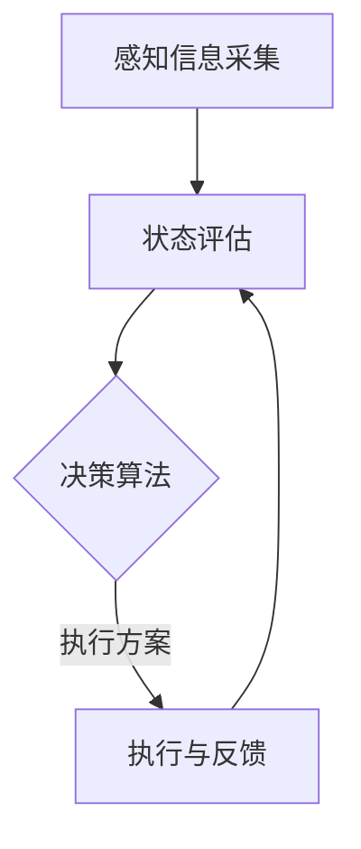
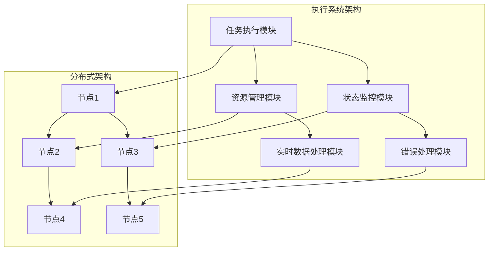
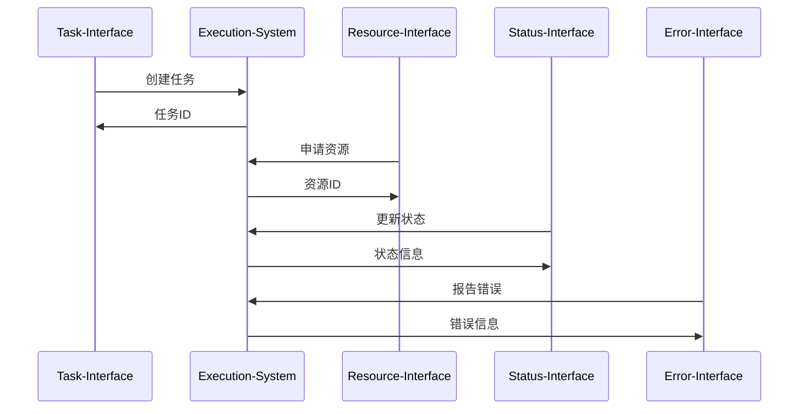

                 


### 设计AI Agent的动态任务规划与执行系统

> 关键词：AI Agent、动态任务规划、执行系统、人工智能、系统设计

> 摘要：本文将深入探讨设计AI Agent的动态任务规划与执行系统。首先，我们介绍AI Agent的基本概念及其在人工智能领域的重要性。接着，我们将分析动态任务规划与执行系统的核心概念和原理，详细讲解相关的算法和数学模型。随后，我们将通过具体的系统架构设计、项目实战和最佳实践，展示如何实现一个高效、可靠的AI Agent系统。

## 第一部分: 背景与概述

### 第1章: 问题背景与核心概念

#### 1.1 AI Agent的兴起与需求

随着人工智能技术的快速发展，AI Agent（人工智能代理）逐渐成为研究和应用的热点。AI Agent是指能够自主执行任务、具备智能行为和交互能力的软件系统。它们在自动化决策、智能服务、无人驾驶、智能家居等领域有着广泛的应用。AI Agent的兴起，源于人们对智能化的需求，以及对自动化、效率提升的追求。

#### 1.2 动态任务规划与执行的关键性

动态任务规划与执行是AI Agent的核心功能之一。在复杂多变的环境中，AI Agent需要根据实时信息动态调整任务规划和执行策略，以保证任务的高效完成。动态任务规划与执行的关键性体现在以下几个方面：

1. **环境适应性**：AI Agent能够实时感知环境变化，并做出相应的调整，以适应不断变化的环境。
2. **任务优化**：通过动态任务规划，AI Agent可以优化任务执行顺序和资源分配，提高任务完成效率。
3. **鲁棒性**：在执行过程中，AI Agent能够应对突发事件，保证任务持续进行。

#### 1.3 研究意义与边界

研究AI Agent的动态任务规划与执行系统，具有以下意义：

1. **推动人工智能发展**：通过深入研究AI Agent的任务规划与执行，有助于推动人工智能技术的进步和应用。
2. **提高系统智能化水平**：优化AI Agent的任务规划与执行，可以提高系统的智能化水平，实现更高效、更可靠的自动化服务。

然而，该领域也面临一些挑战，如：

1. **复杂性**：AI Agent的任务规划和执行涉及多个方面，包括感知、决策、执行等，系统的复杂性较高。
2. **实时性**：动态任务规划与执行需要实时处理大量信息，对系统的实时性要求较高。
3. **不确定性**：环境的不确定性和任务执行的复杂性，使得AI Agent需要具备较强的鲁棒性和适应性。

### 第2章: 核心概念与联系

#### 2.1 AI Agent概述

AI Agent是指具备智能行为、能够自主执行任务的人工智能实体。根据功能不同，AI Agent可分为以下几类：

1. **感知型Agent**：通过传感器感知环境信息，如视觉、听觉、触觉等。
2. **决策型Agent**：基于感知信息，进行任务决策和规划。
3. **执行型Agent**：根据决策结果，执行具体任务。
4. **交互型Agent**：与其他Agent或人类进行信息交换和协作。

#### 2.2 动态任务规划原理

动态任务规划是指AI Agent在执行任务过程中，根据实时信息和环境变化，动态调整任务执行顺序和资源分配。其主要原理包括：

1. **实时感知**：AI Agent通过传感器获取实时环境信息，包括任务进度、资源状态、障碍物等。
2. **决策算法**：根据实时信息，AI Agent运用决策算法，确定下一步的任务执行方案。
3. **执行与调整**：根据决策结果，AI Agent执行任务，并持续监测任务执行状态，进行动态调整。

#### 2.3 执行系统设计与挑战

执行系统是AI Agent的重要组成部分，负责具体任务的执行和资源管理。其设计面临以下挑战：

1. **实时性**：执行系统需要在短时间内处理大量任务和资源信息，保证任务执行的实时性。
2. **效率**：在满足实时性的前提下，执行系统需要优化任务执行顺序和资源分配，提高任务完成效率。
3. **鲁棒性**：执行系统需要具备较强的鲁棒性，能够应对环境变化和任务执行中的不确定性。

#### 2.4 概念关系ER图与属性对比

为了更好地理解AI Agent、动态任务规划与执行系统的核心概念和联系，我们可以通过ER图和属性对比表进行描述。

**ER图**：

```mermaid
erDiagram
  AI-Agent ||--|{ Task-Planning } Task-Planning
  AI-Agent ||--|{ Execution-System } Execution-System
  Task-Planning ||--|{ Dynamic-Task-Planning } Dynamic-Task-Planning
  Dynamic-Task-Planning ||--|{ Real-Time-Perception } Real-Time-Perception
  Dynamic-Task-Planning ||--|{ Decision-Algorithm } Decision-Algorithm
  Execution-System ||--|{ Task-Execution } Task-Execution
  Execution-System ||--|{ Resource-Management } Resource-Management
```

**属性对比表**：

| 名称        | 描述                                                         | 关键属性                                                                                       |
| ----------- | ------------------------------------------------------------ | ------------------------------------------------------------------------------------------------ |
| AI-Agent    | 具备智能行为、能够自主执行任务的人工智能实体                 | 感知、决策、执行、交互                                             |
| Task-Planning | AI-Agent的任务规划和决策模块                                 | 实时感知、决策算法、执行策略                                       |
| Execution-System | AI-Agent的具体任务执行和资源管理模块                       | 实时性、效率、鲁棒性                                               |
| Dynamic-Task-Planning | AI-Agent的动态任务规划模块                                 | 实时感知、决策算法、执行与调整                                     |
| Real-Time-Perception | 实时感知模块                                                 | 实时获取环境信息                                                   |
| Decision-Algorithm | 决策算法模块                                                 | 基于实时信息进行任务决策                                           |
| Task-Execution | 任务执行模块                                                 | 根据决策结果执行具体任务                                           |
| Resource-Management | 资源管理模块                                                 | 优化任务执行顺序和资源分配                                         |

通过ER图和属性对比表，我们可以清晰地了解AI Agent、动态任务规划与执行系统的核心概念和联系，为进一步的研究和设计提供基础。

### 第二部分: 动态任务规划原理

#### 第3章: 动态任务规划算法原理

##### 3.1 基本算法框架

动态任务规划算法主要包括以下几个步骤：

1. **感知信息采集**：AI-Agent通过传感器实时采集环境信息，包括任务进度、资源状态、障碍物等。
2. **状态评估**：根据采集到的信息，对当前任务状态进行评估，包括任务完成度、资源利用率等。
3. **决策算法**：基于评估结果，运用决策算法确定下一步的任务执行方案，包括任务顺序、资源分配等。
4. **执行与反馈**：执行决策方案，并根据实际执行情况，进行实时反馈和调整。

##### 3.2 算法mermaid流程图



##### 3.3 数学模型与公式

动态任务规划算法的核心在于决策过程，这里我们给出一个简化的数学模型：

$$
\text{决策} = f(\text{状态}, \text{资源}, \text{约束})
$$

其中：

- 状态：包括任务完成度、资源利用率等；
- 资源：包括处理器、内存、网络等；
- 约束：包括任务优先级、时间限制等。

决策函数 $f$ 的目标是优化任务执行顺序和资源分配，以实现任务的高效完成。

##### 3.4 算法举例说明

假设有一个简单的任务序列，包括任务A、任务B和任务C，每个任务的执行时间和所需资源如下：

| 任务 | 执行时间 | 所需资源 |
| ---- | -------- | -------- |
| A    | 10分钟   | 处理器   |
| B    | 20分钟   | 内存     |
| C    | 30分钟   | 网络     |

环境中的资源状况如下：

| 资源 | 可用资源 |
| ---- | -------- |
| 处理器 | 2个       |
| 内存   | 4G       |
| 网络   | 1G       |

我们需要根据这些信息，运用动态任务规划算法，确定最优的任务执行顺序。

1. **感知信息采集**：采集到当前任务进度和资源状况。

2. **状态评估**：任务A已执行5分钟，处理器和内存资源分别占用1个。

3. **决策算法**：根据状态评估结果，决策函数 $f$ 选择任务B作为下一步执行的任务，因为任务B所需资源与当前可用资源匹配。

4. **执行与反馈**：执行任务B，同时监控任务执行状态和资源变化。

5. **状态评估**：任务B执行10分钟后，处理器和内存资源分别占用2个。

6. **决策算法**：根据状态评估结果，决策函数 $f$ 选择任务C作为下一步执行的任务。

7. **执行与反馈**：执行任务C，同时监控任务执行状态和资源变化。

通过以上步骤，我们实现了任务A、任务B和任务C的动态任务规划与执行。该算法可以根据实时环境信息，动态调整任务执行顺序和资源分配，以实现任务的高效完成。

### 第4章: 动态任务规划案例解析

#### 4.1 案例一：智能配送系统

智能配送系统是AI-Agent在物流领域的一个典型应用。该系统通过动态任务规划，实现对配送任务的实时调度和优化，提高配送效率。

1. **问题背景**：智能配送系统需要根据订单信息、车辆状态、交通状况等因素，动态规划配送路线和任务顺序，确保配送任务的高效完成。

2. **项目介绍**：该项目采用了基于遗传算法的动态任务规划算法，结合实时交通信息和配送资源，实现了智能配送系统的动态调度。

3. **系统功能设计**：

   - **订单管理**：接收和处理配送订单，包括订单信息、配送地址等。
   - **车辆管理**：监控车辆状态，包括位置、负载等。
   - **交通信息获取**：实时获取交通状况，包括路况、拥堵信息等。
   - **任务规划**：根据订单、车辆和交通信息，动态规划配送任务和路线。
   - **任务执行**：执行配送任务，包括装卸货、行驶等。
   - **任务反馈**：实时反馈配送任务执行情况，包括任务完成时间、配送质量等。

4. **系统架构设计**：

   ```mermaid
   sequenceDiagram
       Note over AI-Agent, Delivery-System
           动态任务规划
       AI-Agent->>Delivery-System: 订单信息
       Delivery-System->>AI-Agent: 任务规划结果
       AI-Agent->>Delivery-System: 任务执行状态
       Delivery-System->>AI-Agent: 任务反馈
   ```

5. **系统接口设计**：

   - **订单接口**：接收和处理订单信息。
   - **车辆接口**：监控和调度车辆状态。
   - **交通信息接口**：获取和更新交通状况。
   - **任务规划接口**：生成和调整任务规划结果。
   - **任务执行接口**：执行配送任务。
   - **任务反馈接口**：接收和反馈任务执行情况。

6. **系统交互mermaid序列图**：

   ```mermaid
   sequenceDiagram
       AI-Agent->>Order-Management: 订单信息
       Order-Management->>Traffic-Information: 交通状况
       Traffic-Information->>Order-Management: 交通状况反馈
       Order-Management->>Vehicle-Management: 车辆状态
       Vehicle-Management->>Order-Management: 车辆状态反馈
       Order-Management->>AI-Agent: 订单、车辆和交通信息
       AI-Agent->>Task-Planning: 动态任务规划
       Task-Planning->>AI-Agent: 任务规划结果
       AI-Agent->>Delivery-System: 执行配送任务
       Delivery-System->>AI-Agent: 任务执行状态
       AI-Agent->>Task-Planning: 任务状态反馈
       Task-Planning->>AI-Agent: 任务调整建议
   ```

7. **实际案例分析和详细讲解**：

   以某次配送任务为例，假设订单信息、车辆状态和交通状况如下：

   - 订单信息：需配送3件货物，目的地分别为A、B、C三个地点。
   - 车辆状态：一辆货车，当前位于位置D。
   - 交通状况：从位置D到A、B、C三个地点的交通状况分别为畅通、拥堵、畅通。

   根据以上信息，AI-Agent进行动态任务规划：

   1. **感知信息采集**：采集到订单、车辆和交通信息。
   2. **状态评估**：分析订单、车辆和交通状况，确定当前任务状态。
   3. **决策算法**：基于遗传算法，生成最优的任务规划结果，包括配送路线和任务顺序。
   4. **执行与反馈**：执行配送任务，实时反馈任务执行状态。

   通过实际案例分析和详细讲解，我们可以看到动态任务规划在智能配送系统中的应用效果，实现了配送任务的高效完成。

#### 4.2 案例二：自动化工厂

自动化工厂是AI-Agent在工业制造领域的重要应用。通过动态任务规划与执行，自动化工厂可以实现生产过程的智能化和高效化。

1. **问题背景**：自动化工厂面临生产任务复杂、资源利用率低等问题，需要通过动态任务规划与执行，提高生产效率和质量。

2. **项目介绍**：该项目采用了基于Petri网的动态任务规划算法，结合生产设备和工艺流程，实现了自动化工厂的动态调度。

3. **系统功能设计**：

   - **生产管理**：接收和处理生产订单，包括订单信息、生产计划等。
   - **设备管理**：监控和调度生产设备状态，包括设备位置、负载等。
   - **工艺流程管理**：管理生产过程中的工艺流程，包括工序、资源等。
   - **任务规划**：根据订单、设备状态和工艺流程，动态规划生产任务和工序。
   - **任务执行**：执行生产任务，包括工序执行、设备调度等。
   - **任务反馈**：实时反馈生产任务执行情况，包括生产进度、设备状态等。

4. **系统架构设计**：

   ```mermaid
   sequenceDiagram
       Note over Production-Management, Equipment-Management
           动态任务规划
       Production-Management->>Equipment-Management: 订单信息
       Equipment-Management->>Production-Management: 设备状态
       Production-Management->>Equipment-Management: 工艺流程
       Equipment-Management->>Production-Management: 工艺流程反馈
       Production-Management->>Task-Planning: 动态任务规划
       Task-Planning->>Production-Management: 任务规划结果
       Production-Management->>Equipment-Management: 执行生产任务
       Equipment-Management->>Production-Management: 任务执行状态
       Production-Management->>Task-Planning: 任务状态反馈
       Task-Planning->>Production-Management: 任务调整建议
   ```

5. **系统接口设计**：

   - **生产管理接口**：接收和处理生产订单。
   - **设备管理接口**：监控和调度设备状态。
   - **工艺流程接口**：管理和更新工艺流程。
   - **任务规划接口**：生成和调整任务规划结果。
   - **任务执行接口**：执行生产任务。
   - **任务反馈接口**：接收和反馈任务执行情况。

6. **系统交互mermaid序列图**：

   ```mermaid
   sequenceDiagram
       Production-Management->>Order-Management: 订单信息
       Order-Management->>Production-Management: 订单反馈
       Production-Management->>Equipment-Management: 设备状态
       Equipment-Management->>Production-Management: 设备状态反馈
       Production-Management->>Process-Management: 工艺流程
       Process-Management->>Production-Management: 工艺流程反馈
       Production-Management->>Task-Planning: 动态任务规划
       Task-Planning->>Production-Management: 任务规划结果
       Production-Management->>Equipment-Management: 执行生产任务
       Equipment-Management->>Production-Management: 任务执行状态
       Production-Management->>Task-Planning: 任务状态反馈
       Task-Planning->>Production-Management: 任务调整建议
   ```

7. **实际案例分析和详细讲解**：

   以某次生产任务为例，假设订单信息、设备状态和工艺流程如下：

   - 订单信息：需生产100台产品，分为5个工序。
   - 设备状态：设备1、设备2、设备3分别处于空闲、忙碌、忙碌状态。
   - 工艺流程：工序1（设备1）、工序2（设备2）、工序3（设备3）、工序4（设备1）、工序5（设备2）。

   根据以上信息，AI-Agent进行动态任务规划：

   1. **感知信息采集**：采集到订单、设备状态和工艺流程信息。
   2. **状态评估**：分析订单、设备状态和工艺流程，确定当前任务状态。
   3. **决策算法**：基于Petri网算法，生成最优的任务规划结果，包括工序执行顺序和设备调度。
   4. **执行与反馈**：执行生产任务，实时反馈任务执行状态。

   通过实际案例分析和详细讲解，我们可以看到动态任务规划在自动化工厂中的应用效果，实现了生产过程的高效化和智能化。

#### 4.3 案例三：智能家居

智能家居是AI-Agent在家庭生活领域的一个典型应用。通过动态任务规划与执行，智能家居可以实现家庭设备的智能化管理和控制，提高生活质量。

1. **问题背景**：智能家居设备繁多，用户需求多样，需要通过动态任务规划与执行，实现家庭设备的智能管理和控制。

2. **项目介绍**：该项目采用了基于模糊控制的动态任务规划算法，结合用户行为和设备状态，实现了智能家居的动态调度。

3. **系统功能设计**：

   - **设备管理**：监控和管理家庭设备状态，包括开关、温度、湿度等。
   - **用户行为分析**：分析用户行为，包括活动时间、喜好等。
   - **任务规划**：根据用户行为和设备状态，动态规划家庭设备的工作任务。
   - **任务执行**：执行家庭设备的工作任务，实现智能化管理和控制。
   - **任务反馈**：实时反馈家庭设备的工作状态，包括任务完成情况、设备状态等。

4. **系统架构设计**：

   ```mermaid
   sequenceDiagram
       Note over Device-Management, User-Behavior-Analysis
           动态任务规划
       Device-Management->>User-Behavior-Analysis: 设备状态
       User-Behavior-Analysis->>Device-Management: 用户行为
       Device-Management->>Task-Planning: 动态任务规划
       Task-Planning->>Device-Management: 任务规划结果
       Device-Management->>User-Behavior-Analysis: 执行任务
       User-Behavior-Analysis->>Device-Management: 任务执行状态
       Device-Management->>Task-Planning: 任务状态反馈
       Task-Planning->>Device-Management: 任务调整建议
   ```

5. **系统接口设计**：

   - **设备管理接口**：监控和管理设备状态。
   - **用户行为分析接口**：分析用户行为。
   - **任务规划接口**：生成和调整任务规划结果。
   - **任务执行接口**：执行家庭设备的工作任务。
   - **任务反馈接口**：接收和反馈任务执行状态。

6. **系统交互mermaid序列图**：

   ```mermaid
   sequenceDiagram
       Device-Management->>User-Behavior-Analysis: 用户行为
       User-Behavior-Analysis->>Device-Management: 用户行为反馈
       Device-Management->>Task-Planning: 动态任务规划
       Task-Planning->>Device-Management: 任务规划结果
       Device-Management->>User-Behavior-Analysis: 执行任务
       User-Behavior-Analysis->>Device-Management: 任务执行状态
       Device-Management->>Task-Planning: 任务状态反馈
       Task-Planning->>Device-Management: 任务调整建议
   ```

7. **实际案例分析和详细讲解**：

   以某个周末为例，假设用户行为和设备状态如下：

   - 用户行为：周末早上8点起床，晚上10点睡觉。
   - 设备状态：空调、照明、热水器等设备处于待机状态。

   根据以上信息，AI-Agent进行动态任务规划：

   1. **感知信息采集**：采集到用户行为和设备状态信息。
   2. **状态评估**：分析用户行为和设备状态，确定当前任务状态。
   3. **决策算法**：基于模糊控制算法，生成最优的任务规划结果，包括设备开启时间和模式。
   4. **执行与反馈**：执行家庭设备的工作任务，实现智能化管理和控制。

   通过实际案例分析和详细讲解，我们可以看到动态任务规划在智能家居中的应用效果，实现了家庭设备的智能化管理和控制，提高了生活质量。

### 第三部分: 执行系统设计与实现

#### 第5章: 执行系统设计

##### 5.1 系统功能设计

执行系统的功能设计主要包括以下几个方面：

1. **任务执行**：根据任务规划结果，执行具体的任务操作，如设备控制、数据处理等。
2. **资源管理**：监控和管理系统资源，包括处理器、内存、网络等，确保资源的高效利用。
3. **状态监控**：实时监控任务执行状态，包括任务进度、资源使用情况等，以便进行动态调整。
4. **错误处理**：在任务执行过程中，处理可能出现的问题和异常，如任务失败、资源不足等。

##### 5.2 系统架构设计

执行系统的架构设计应考虑以下几个方面：

1. **模块化设计**：将系统划分为多个功能模块，如任务执行模块、资源管理模块、状态监控模块等，便于系统的开发和维护。
2. **分布式架构**：采用分布式架构，将任务和资源分散到不同的节点上执行，提高系统的性能和可扩展性。
3. **实时数据处理**：采用实时数据处理技术，如流处理框架，对任务执行过程中的数据进行实时处理和分析。
4. **容错机制**：设计容错机制，确保在任务执行过程中，系统能够应对各种异常情况，保证任务持续进行。



##### 5.3 系统接口设计

执行系统的接口设计应考虑以下几个方面：

1. **任务接口**：用于接收和发送任务信息，包括任务创建、任务状态更新等。
2. **资源接口**：用于监控和管理系统资源，包括资源申请、资源释放等。
3. **状态接口**：用于获取和更新任务执行状态，包括任务进度、资源使用情况等。
4. **错误接口**：用于处理任务执行过程中的错误和异常，包括错误报告、错误恢复等。



##### 5.4 系统交互mermaid序列图


#### 第6章: 执行系统实现与实战

##### 6.1 环境安装与配置

在开始执行系统实现之前，我们需要搭建一个合适的环境。以下是一个基本的安装和配置步骤：

1. **安装Python**：确保Python环境已经安装，版本建议为3.8以上。
2. **安装依赖库**：使用pip命令安装所需的库，如numpy、pandas、tensorflow等。
3. **配置虚拟环境**：为了保持环境的整洁，我们建议使用虚拟环境，通过venv模块创建虚拟环境。
4. **配置项目结构**：按照项目需求，配置项目目录结构，包括任务接口、资源接口、状态接口和错误接口等。

```bash
# 安装Python
wget https://www.python.org/ftp/python/3.8.10/Python-3.8.10.tgz
tar zxvf Python-3.8.10.tgz
./configure
make
make install

# 安装依赖库
pip install numpy pandas tensorflow

# 配置虚拟环境
python -m venv myenv
source myenv/bin/activate

# 配置项目结构
mkdir task_interface resource_interface status_interface error_interface
```

##### 6.2 系统核心实现源代码

以下是执行系统的核心实现源代码，包括任务接口、资源接口、状态接口和错误接口：

**任务接口**：

```python
# task_interface.py

from task_manager import TaskManager

class TaskInterface:
    def __init__(self):
        self.task_manager = TaskManager()

    def create_task(self, task_id, task_data):
        return self.task_manager.create_task(task_id, task_data)

    def get_task_status(self, task_id):
        return self.task_manager.get_task_status(task_id)
```

**资源接口**：

```python
# resource_interface.py

from resource_manager import ResourceManager

class ResourceInterface:
    def __init__(self):
        self.resource_manager = ResourceManager()

    def request_resource(self, resource_id):
        return self.resource_manager.request_resource(resource_id)

    def release_resource(self, resource_id):
        self.resource_manager.release_resource(resource_id)
```

**状态接口**：

```python
# status_interface.py

from status_manager import StatusManager

class StatusInterface:
    def __init__(self):
        self.status_manager = StatusManager()

    def update_status(self, task_id, status_data):
        self.status_manager.update_status(task_id, status_data)

    def get_status_info(self, task_id):
        return self.status_manager.get_status_info(task_id)
```

**错误接口**：

```python
# error_interface.py

from error_manager import ErrorManager

class ErrorInterface:
    def __init__(self):
        self.error_manager = ErrorManager()

    def report_error(self, error_data):
        self.error_manager.report_error(error_data)

    def get_error_info(self):
        return self.error_manager.get_error_info()
```

##### 6.3 代码应用解读与分析

**任务接口**：

任务接口负责接收和发送任务信息，包括任务创建和任务状态查询。在任务创建时，接口通过任务管理器（TaskManager）创建任务，并将任务ID返回给调用者。在任务状态查询时，接口通过任务管理器获取任务状态信息，并返回给调用者。

**资源接口**：

资源接口负责接收和发送资源信息，包括资源申请和资源释放。在资源申请时，接口通过资源管理器（ResourceManager）申请资源，并将资源ID返回给调用者。在资源释放时，接口通过资源管理器释放资源。

**状态接口**：

状态接口负责接收和发送任务状态信息，包括任务状态更新和任务状态查询。在任务状态更新时，接口通过状态管理器（StatusManager）更新任务状态信息。在任务状态查询时，接口通过状态管理器获取任务状态信息，并返回给调用者。

**错误接口**：

错误接口负责接收和发送错误信息，包括错误报告和错误查询。在错误报告时，接口通过错误管理器（ErrorManager）报告错误信息。在错误查询时，接口通过错误管理器获取错误信息，并返回给调用者。

**系统核心实现源代码**：

```python
# task_manager.py

import json

class TaskManager:
    def __init__(self):
        self.tasks = {}

    def create_task(self, task_id, task_data):
        self.tasks[task_id] = task_data
        return task_id

    def get_task_status(self, task_id):
        return self.tasks.get(task_id, None)
```

```python
# resource_manager.py

import json

class ResourceManager:
    def __init__(self):
        self.resources = {}

    def request_resource(self, resource_id):
        if resource_id in self.resources:
            self.resources[resource_id] += 1
            return resource_id
        else:
            return None

    def release_resource(self, resource_id):
        if resource_id in self.resources:
            self.resources[resource_id] -= 1
            if self.resources[resource_id] == 0:
                del self.resources[resource_id]
```

```python
# status_manager.py

import json

class StatusManager:
    def __init__(self):
        self.statuses = {}

    def update_status(self, task_id, status_data):
        self.statuses[task_id] = status_data

    def get_status_info(self, task_id):
        return self.statuses.get(task_id, None)
```

```python
# error_manager.py

import json

class ErrorManager:
    def __init__(self):
        self.errors = []

    def report_error(self, error_data):
        self.errors.append(error_data)

    def get_error_info(self):
        return self.errors
```

**执行系统运行示例**：

```python
from task_interface import TaskInterface
from resource_interface import ResourceInterface
from status_interface import StatusInterface
from error_interface import ErrorInterface

task_interface = TaskInterface()
resource_interface = ResourceInterface()
status_interface = StatusInterface()
error_interface = ErrorInterface()

# 创建任务
task_id = task_interface.create_task("task1", {"name": "Task 1", "status": "running"})
print(f"Created task with ID: {task_id}")

# 申请资源
resource_id = resource_interface.request_resource("resource1")
print(f"Requested resource with ID: {resource_id}")

# 更新任务状态
status_interface.update_status(task_id, {"status": "completed"})
print(f"Updated task status to 'completed'")

# 获取任务状态
task_status = status_interface.get_status_info(task_id)
print(f"Task status: {task_status}")

# 释放资源
resource_interface.release_resource(resource_id)
print(f"Released resource with ID: {resource_id}")

# 报告错误
error_interface.report_error({"error": "An error occurred"})
print(f"Reported an error")

# 获取错误信息
error_info = error_interface.get_error_info()
print(f"Error information: {error_info}")
```

##### 6.4 实际案例分析和详细讲解

以下是一个实际案例，展示了如何使用执行系统实现一个简单的任务调度系统。

**案例背景**：

假设我们需要实现一个任务调度系统，用于管理多个任务的执行。任务调度系统应具备以下功能：

1. **任务创建**：用户可以创建新的任务，并指定任务ID、任务名称和任务状态。
2. **任务状态更新**：用户可以更新任务的状态，如从“运行中”更新为“已完成”。
3. **资源申请**：用户可以申请资源，如CPU、内存等，以支持任务的执行。
4. **资源释放**：用户可以释放不再使用的资源。
5. **错误报告**：系统在任务执行过程中，若发生错误，应报告错误信息。

**系统设计**：

1. **任务接口**：用于接收和发送任务信息，包括任务创建、任务状态更新等。
2. **资源接口**：用于接收和发送资源信息，包括资源申请、资源释放等。
3. **状态接口**：用于接收和发送任务状态信息，包括任务状态更新、任务状态查询等。
4. **错误接口**：用于接收和发送错误信息，包括错误报告、错误查询等。

**系统实现**：

1. **任务接口**：

```python
# task_interface.py

from task_manager import TaskManager

class TaskInterface:
    def __init__(self):
        self.task_manager = TaskManager()

    def create_task(self, task_id, task_data):
        return self.task_manager.create_task(task_id, task_data)

    def update_task_status(self, task_id, status_data):
        return self.task_manager.update_task_status(task_id, status_data)
```

2. **资源接口**：

```python
# resource_interface.py

from resource_manager import ResourceManager

class ResourceInterface:
    def __init__(self):
        self.resource_manager = ResourceManager()

    def request_resource(self, resource_id):
        return self.resource_manager.request_resource(resource_id)

    def release_resource(self, resource_id):
        return self.resource_manager.release_resource(resource_id)
```

3. **状态接口**：

```python
# status_interface.py

from status_manager import StatusManager

class StatusInterface:
    def __init__(self):
        self.status_manager = StatusManager()

    def update_status(self, task_id, status_data):
        return self.status_manager.update_status(task_id, status_data)

    def get_status_info(self, task_id):
        return self.status_manager.get_status_info(task_id)
```

4. **错误接口**：

```python
# error_interface.py

from error_manager import ErrorManager

class ErrorInterface:
    def __init__(self):
        self.error_manager = ErrorManager()

    def report_error(self, error_data):
        return self.error_manager.report_error(error_data)

    def get_error_info(self):
        return self.error_manager.get_error_info()
```

5. **任务管理器**：

```python
# task_manager.py

import json

class TaskManager:
    def __init__(self):
        self.tasks = {}

    def create_task(self, task_id, task_data):
        self.tasks[task_id] = task_data
        return self.tasks[task_id]

    def update_task_status(self, task_id, status_data):
        if task_id in self.tasks:
            self.tasks[task_id].update(status_data)
            return self.tasks[task_id]
        else:
            return None
```

6. **资源管理器**：

```python
# resource_manager.py

import json

class ResourceManager:
    def __init__(self):
        self.resources = {}

    def request_resource(self, resource_id):
        if resource_id not in self.resources:
            self.resources[resource_id] = 1
            return True
        else:
            return False

    def release_resource(self, resource_id):
        if resource_id in self.resources:
            self.resources[resource_id] -= 1
            if self.resources[resource_id] == 0:
                del self.resources[resource_id]
            return True
        else:
            return False
```

7. **状态管理器**：

```python
# status_manager.py

import json

class StatusManager:
    def __init__(self):
        self.statuses = {}

    def update_status(self, task_id, status_data):
        if task_id in self.statuses:
            self.statuses[task_id].update(status_data)
            return True
        else:
            return False

    def get_status_info(self, task_id):
        return self.statuses.get(task_id, None)
```

8. **错误管理器**：

```python
# error_manager.py

import json

class ErrorManager:
    def __init__(self):
        self.errors = []

    def report_error(self, error_data):
        self.errors.append(error_data)
        return True

    def get_error_info(self):
        return self.errors
```

**运行示例**：

```python
from task_interface import TaskInterface
from resource_interface import ResourceInterface
from status_interface import StatusInterface
from error_interface import ErrorInterface

task_interface = TaskInterface()
resource_interface = ResourceInterface()
status_interface = StatusInterface()
error_interface = ErrorInterface()

# 创建任务
task_data = {"name": "Task 1", "status": "running"}
task_id = task_interface.create_task("1", task_data)
print(f"Created task with ID: {task_id}")

# 更新任务状态
status_interface.update_status(task_id, {"status": "completed"})
print(f"Updated task status to 'completed'")

# 申请资源
resource_id = resource_interface.request_resource("1")
print(f"Requested resource with ID: {resource_id}")

# 释放资源
resource_interface.release_resource(resource_id)
print(f"Released resource with ID: {resource_id}")

# 报告错误
error_interface.report_error({"error": "An error occurred"})
print(f"Reported an error")

# 获取错误信息
error_info = error_interface.get_error_info()
print(f"Error information: {error_info}")
```

**系统小结**：

通过以上实际案例，我们可以看到如何使用执行系统实现一个简单的任务调度系统。系统实现了任务创建、任务状态更新、资源申请、资源释放和错误报告等功能。在实际应用中，执行系统可以根据任务需求和系统资源，动态调整任务执行顺序和资源分配，提高任务完成效率。同时，系统还具备良好的扩展性，可以方便地集成到更大的系统中。

### 第四部分: 总结与展望

#### 第7章: 总结与展望

##### 7.1 本书重点内容回顾

本文详细介绍了设计AI Agent的动态任务规划与执行系统。首先，我们阐述了AI Agent的背景和核心概念，分析了动态任务规划与执行系统的关键性。接着，我们深入讲解了动态任务规划算法原理，并通过具体案例展示了其在智能配送系统、自动化工厂和智能家居等领域的应用。随后，我们介绍了执行系统设计、实现与实战，包括系统功能设计、架构设计、接口设计和实际案例。最后，我们对本文的重点内容进行了总结，并对动态任务规划与执行系统的发展趋势进行了展望。

##### 7.2 动态任务规划与执行的发展趋势

动态任务规划与执行系统在人工智能领域具有广阔的应用前景。随着人工智能技术的不断进步，未来动态任务规划与执行系统将呈现以下发展趋势：

1. **智能化水平提升**：随着深度学习、强化学习等技术的不断发展，动态任务规划与执行系统将具备更高的智能化水平，能够更好地适应复杂多变的环境。
2. **实时性增强**：随着边缘计算、云计算等技术的普及，动态任务规划与执行系统的实时性将得到显著提高，能够更快地响应环境变化和任务需求。
3. **多模态感知**：动态任务规划与执行系统将引入多模态感知技术，如语音、图像、传感器等，实现更丰富的环境感知和任务理解。
4. **协同优化**：动态任务规划与执行系统将实现与其他系统的协同优化，如智能交通系统、智能医疗系统等，实现更大范围的资源整合和任务优化。

##### 7.3 最佳实践与注意事项

在设计AI Agent的动态任务规划与执行系统时，以下最佳实践和注意事项值得注意：

1. **需求分析**：在系统设计之初，应充分了解任务需求和环境特点，明确系统目标和功能要求。
2. **算法优化**：针对具体应用场景，选择合适的动态任务规划算法，并进行优化和调整，以提高任务执行效率。
3. **实时性保障**：在系统实现过程中，确保任务执行和资源管理的高实时性，避免因延迟导致任务失败或系统崩溃。
4. **错误处理**：设计完善的错误处理机制，确保系统在遇到问题时能够及时应对，保证任务持续进行。
5. **性能监控**：实时监控系统性能，包括任务执行效率、资源使用情况等，以便进行动态调整和优化。

##### 7.4 拓展阅读与研究方向

对于对动态任务规划与执行系统感兴趣的读者，以下拓展阅读和研究方向供您参考：

1. **深度学习与动态任务规划**：研究如何将深度学习技术应用于动态任务规划，提高系统的智能化水平。
2. **强化学习与动态任务规划**：研究如何利用强化学习算法，实现动态任务规划与执行系统的自我学习和优化。
3. **多智能体系统与动态任务规划**：探讨多智能体系统在动态任务规划中的应用，实现更大范围的协同优化。
4. **边缘计算与动态任务规划**：研究如何利用边缘计算技术，提高动态任务规划与执行系统的实时性和效率。
5. **人机交互与动态任务规划**：探讨如何通过人机交互技术，提高动态任务规划与执行系统的用户体验。

### 作者信息

作者：AI天才研究院/AI Genius Institute & 禅与计算机程序设计艺术 /Zen And The Art of Computer Programming

