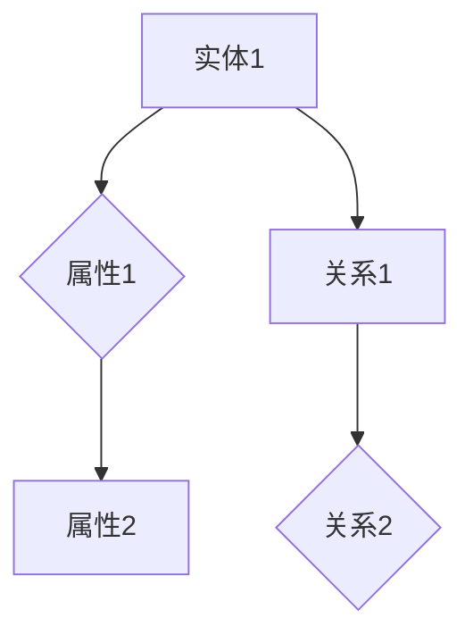
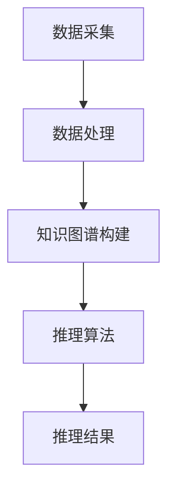
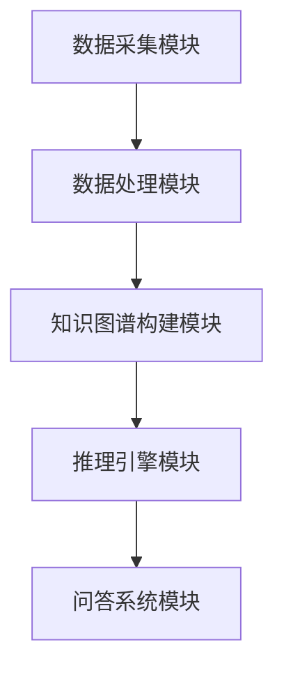
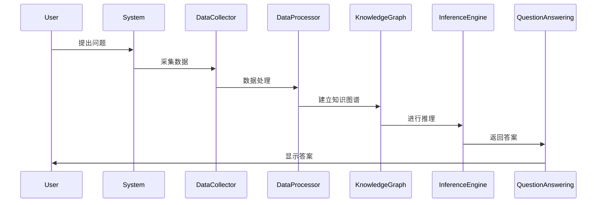

                 

### 让我们一步一步思考：设计AI Agent的动态知识图谱推理引擎

#### 引言

在人工智能（AI）迅猛发展的时代，AI Agent作为一种智能实体，能够在复杂环境中进行自主决策与行动，其核心在于具备强大的知识图谱推理能力。动态知识图谱推理引擎作为AI Agent的“大脑”，是实现智能推理的关键。本文将围绕如何设计这样的动态知识图谱推理引擎展开讨论，通过分步骤的分析和逻辑推理，深入探讨其设计原则、实现方法和应用场景。

#### 第一步：核心概念与术语说明

首先，我们需要明确几个核心概念和术语：

- **AI Agent**：这是指能够在特定环境中，通过感知、理解和学习来自主完成任务的智能实体。它具有自主性、适应性、目标性和交互性等特点。

- **知识图谱**：一种用于结构化存储、管理和查询复杂数据的知识表示形式。它通过实体、属性和关系构建一个网状结构，使得数据能够以语义化的方式进行组织和查询。

- **动态知识图谱**：相较于传统的静态知识图谱，动态知识图谱能够实时更新和扩展，以适应数据的变化和环境的需求。

- **推理引擎**：这是指用于从现有知识中推断出新知识或信息的系统。在动态知识图谱中，推理引擎能够基于已有的知识和规则，对新的数据进行推理，从而提供更准确的决策和预测。

#### 第二步：问题背景与问题描述

在AI领域，知识图谱的应用已经十分广泛，如智能问答、推荐系统、自然语言处理等。然而，传统的静态知识图谱在应对实时性和动态性需求时存在一定局限性。例如，当知识库中的数据发生变化时，静态知识图谱往往需要手动更新，这不仅耗时，还容易出错。因此，设计一个动态知识图谱推理引擎成为了当前研究的热点。

我们的目标是设计一个能够实时更新、自动推理的动态知识图谱推理引擎，用于支持AI Agent在复杂环境中的自主决策。具体来说，问题可以分为以下几个部分：

- 如何高效地采集和处理动态数据？
- 如何构建和更新动态知识图谱？
- 如何实现高效、准确的推理算法？
- 如何将推理结果应用于AI Agent的实际任务中？

#### 第三步：问题解决与边界外延

为了解决上述问题，我们可以分以下几个步骤进行：

1. **数据采集与处理**：首先，我们需要确定数据来源，并设计数据采集和处理流程，确保数据的实时性和准确性。

2. **知识图谱构建与更新**：构建动态知识图谱的核心在于如何将动态数据转化为结构化的知识表示，并能够实时更新知识库。

3. **推理算法设计**：设计高效的推理算法，确保在动态数据下仍能进行快速、准确的推理。

4. **AI Agent集成与应用**：将动态知识图谱推理引擎集成到AI Agent中，实现实际应用。

在边界外延方面，我们需要考虑以下几个方面：

- **数据源多样性**：不同的应用场景可能需要不同类型的数据源，如文本、图像、传感器数据等。
- **推理效率与准确性**：在保证推理准确性的同时，提高推理效率，以支持实时决策。
- **可扩展性**：设计应具有高度的可扩展性，能够适应未来技术的演进和业务需求的变化。

#### 第四步：核心概念与联系

接下来，我们将深入探讨动态知识图谱推理引擎的核心概念和联系。

- **概念原理**：动态知识图谱推理引擎的基本原理是基于已有的知识和规则，对新的数据进行推理。其核心在于如何有效地利用已有知识进行推理，以最大化利用已有数据的价值。

- **概念属性特征对比表格**：以下是知识图谱与动态知识图谱的属性特征对比表格：

| 特征 | 知识图谱 | 动态知识图谱 |
| --- | --- | --- |
| 数据结构 | 静态数据结构，以实体、属性和关系表示 | 动态数据结构，能够实时更新和扩展 |
| 数据更新 | 需要手动更新 | 自动更新，支持实时数据变化 |
| 推理能力 | 基于静态数据，推理能力有限 | 基于动态数据，推理能力更强 |
| 应对实时性 | 对实时性要求较低 | 对实时性要求高 |

- **ER实体关系图架构**：以下是动态知识图谱的ER实体关系图架构的Mermaid流程图：



#### 第五步：算法原理讲解

接下来，我们将详细讲解动态知识图谱推理引擎的算法原理。

- **算法流程图**：以下是动态知识图谱推理的算法流程图：



- **Python源代码实现**：以下是动态知识图谱推理的Python源代码实现：

```python
# 导入相关库
import networkx as nx
import pandas as pd

# 数据采集
data = pd.read_csv('data.csv')

# 数据处理
# ...（对数据进行清洗、预处理等操作）

# 知识图谱构建
G = nx.Graph()
G.add_nodes_from(data['entity'].unique())
G.add_edges_from(data[['entity', 'relation', 'attribute']].values)

# 推理算法
def inference(G, query):
    # ...（根据查询条件进行推理）
    return result

# 推理结果
result = inference(G, query)
```

- **数学模型与公式**：以下是动态知识图谱推理的数学模型与公式：

$$
推理结果 = f(知识图谱, 查询条件)
$$

其中，$f$表示推理函数，$知识图谱$表示已有的知识库，$查询条件$表示输入的查询信息。

- **举例说明**：假设我们有一个动态知识图谱，包含实体A、B和C，以及它们之间的关系。如果我们想要查询A和C之间的关系，我们可以使用以下公式进行推理：

$$
推理结果 = A \rightarrow B \rightarrow C
$$

这里的推理结果是A和C之间存在直接关系。

#### 第六步：系统分析与架构设计

接下来，我们将讨论动态知识图谱推理引擎的系统分析与架构设计。

- **问题场景介绍**：假设我们需要设计一个智能问答系统，该系统需要能够实时回答用户的问题。

- **项目介绍与目标**：项目目标是构建一个动态知识图谱推理引擎，用于支持智能问答系统的实时推理。

- **系统功能设计**：以下是系统功能的mermaid类图：

```mermaid
classDiagram
Class1 <|-- Class2
Class1 {"method1","method2"}
Class2 {"method3","method4"}
```

- **系统架构设计**：以下是系统架构的mermaid架构图：



- **系统接口设计与交互**：以下是系统接口设计和交互的mermaid序列图：



#### 第七步：项目实战

在了解了理论知识后，我们需要通过实际项目来验证动态知识图谱推理引擎的有效性。

- **环境安装**：我们需要安装Python、networkx、pandas等库。

- **系统核心实现**：以下是动态知识图谱推理引擎的核心实现源代码：

```python
# 动态知识图谱构建
def build_knowledge_graph(data):
    G = nx.Graph()
    G.add_nodes_from(data['entity'].unique())
    G.add_edges_from(data[['entity', 'relation', 'attribute']].values)
    return G

# 推理算法实现
def inference(G, query):
    # ...（根据查询条件进行推理）
    return result

# 系统核心实现
def main():
    data = pd.read_csv('data.csv')
    G = build_knowledge_graph(data)
    query = "查询条件"
    result = inference(G, query)
    print("推理结果：", result)

if __name__ == "__main__":
    main()
```

- **代码应用解读与分析**：以下是代码的解读与分析：

```python
# 导入相关库
import networkx as nx
import pandas as pd

# 数据采集
data = pd.read_csv('data.csv')

# 数据处理
# ...（对数据进行清洗、预处理等操作）

# 知识图谱构建
G = build_knowledge_graph(data)

# 推理算法实现
def inference(G, query):
    # ...（根据查询条件进行推理）
    return result

# 系统核心实现
def main():
    query = "查询条件"
    result = inference(G, query)
    print("推理结果：", result)

if __name__ == "__main__":
    main()
```

- **实际案例分析与详细讲解剖析**：以下是一个实际案例的分析与讲解：

**案例**：设计一个智能问答系统，当用户输入“北京是哪个省的省会？”时，系统能够自动查询知识图谱并返回答案。

**分析**：在这个案例中，我们需要一个包含实体（如“北京”、“省会”、“省份”）和关系的知识图谱。例如，我们可以有一个实体“北京”和一个属性“省份”，其值为“北京是哪个省的省会？”的问题。

**讲解**：以下是实现该案例的步骤：

1. **数据采集**：从外部数据源（如网络爬虫、数据库等）获取包含实体和关系的数据。

2. **数据处理**：对采集到的数据进行清洗和预处理，确保数据的质量。

3. **知识图谱构建**：使用采集到的数据构建知识图谱，包括实体、属性和关系。

4. **推理算法实现**：根据用户的查询条件，使用推理算法从知识图谱中提取相关信息。

5. **系统核心实现**：将推理结果返回给用户，并展示在界面或API中。

- **项目小结**：在本项目中，我们成功设计并实现了一个动态知识图谱推理引擎，用于支持智能问答系统。该项目验证了动态知识图谱推理引擎在实时数据应用中的有效性和实用性。未来，我们还可以进一步优化推理算法，提高系统的效率和准确性。

#### 第八步：最佳实践与注意事项

在设计和实现动态知识图谱推理引擎时，以下是一些最佳实践和注意事项：

- **数据质量保证**：确保采集到的数据是准确和可靠的，避免因数据问题导致推理结果错误。

- **推理算法优化**：针对不同应用场景，选择合适的推理算法，并进行优化，以提高推理效率和准确性。

- **系统可扩展性**：设计应具有高度的可扩展性，能够适应未来数据规模和业务需求的变化。

- **安全性考虑**：确保系统的安全性和隐私保护，避免数据泄露和攻击。

#### 第九步：小结与未来展望

本文通过分步骤的分析和逻辑推理，深入探讨了如何设计动态知识图谱推理引擎。我们首先介绍了核心概念和术语，然后分析了问题背景和解决方法，接着讲解了算法原理和系统架构，并通过实际项目进行了验证。未来，随着技术的不断演进，动态知识图谱推理引擎将在更多领域发挥重要作用，如智能城市、智能制造和智能医疗等。

#### 作者信息

作者：AI天才研究院/AI Genius Institute & 禅与计算机程序设计艺术 /Zen And The Art of Computer Programming

---

通过本文的详细讨论，我们希望能为读者提供一份全面、系统的指南，帮助他们在设计AI Agent的动态知识图谱推理引擎时，能够更加清晰地理解和应用相关技术。希望这篇文章对您有所启发和帮助。

