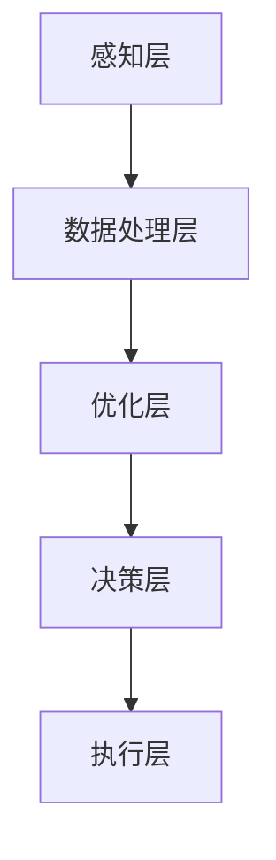
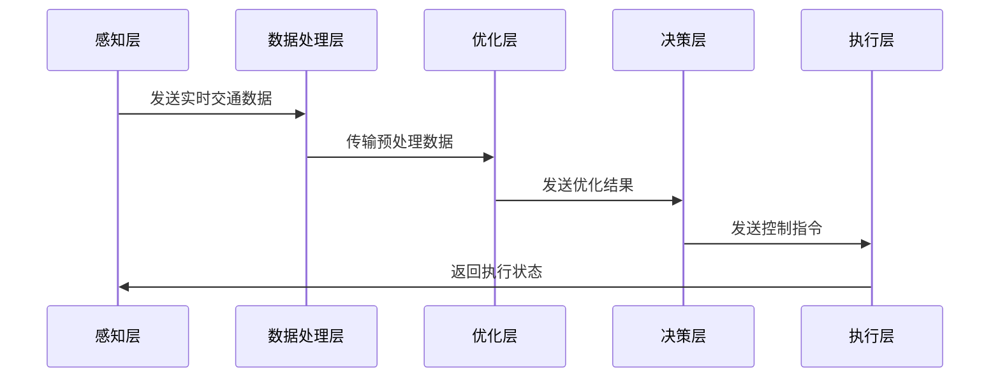
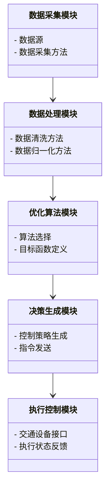

                 

# 设计AI Agent的多目标优化决策系统

## 关键词

AI代理、多目标优化、决策系统、算法、数学模型、系统设计

## 摘要

本文旨在深入探讨AI代理的设计和多目标优化决策系统的发展。首先，我们将介绍AI代理的基础概念和其在现代技术中的重要性。接着，我们将讨论多目标优化的基本原理和其在AI代理中的应用，包括核心算法和数学模型的介绍。随后，我们将详细分析系统的设计步骤，从系统架构到具体实现。最后，通过实际案例研究和最佳实践，我们将总结设计AI代理的多目标优化决策系统的关键要点，并为未来的发展方向提出展望。

## 引言与背景

### AI代理的概念与作用

AI代理（Artificial Intelligence Agent）是人工智能领域的一个重要概念，它指的是具有自主性、适应性、学习和推理能力的计算机程序。AI代理的设计目的是模拟人类智能行为，使其能够在复杂环境中进行决策和行动，从而实现自动化和智能化的目标。

AI代理的作用主要体现在以下几个方面：

1. **自动化任务执行**：AI代理可以自动执行重复性、繁琐的任务，提高工作效率，减轻人工负担。
2. **智能决策支持**：AI代理通过学习和推理，能够提供基于数据的智能决策支持，帮助人类做出更加明智的选择。
3. **交互式系统**：AI代理可以作为交互式系统的核心，提供个性化的用户体验和服务。

### 多目标优化的重要性

多目标优化（Multi-Objective Optimization）是优化领域中的一项重要分支，它旨在同时优化多个相互冲突的目标。在现实世界中，许多问题需要考虑多个目标，这些目标之间往往存在矛盾和冲突。例如，在物流配送中，我们需要同时考虑成本、时间和服务质量等多个目标。传统的单目标优化方法无法同时满足这些复杂的目标。

多目标优化的重要性体现在以下几个方面：

1. **全面性**：多目标优化能够考虑问题的多个维度，提供更加全面和综合的解决方案。
2. **冲突解决**：多目标优化可以帮助我们识别和解决不同目标之间的冲突，找到均衡的解决方案。
3. **适应性和灵活性**：多目标优化能够适应不同场景和需求，提供灵活的解决方案。

### 决策系统在AI代理中的应用

决策系统是AI代理的核心组成部分，它负责根据环境信息和目标函数，生成合适的决策。在AI代理中，决策系统的作用如下：

1. **环境感知**：AI代理需要感知和了解当前环境的状态，包括内部状态和外部状态。
2. **目标评估**：AI代理需要根据预设的目标函数，对当前决策进行评估，以确定最佳行动方案。
3. **决策生成**：AI代理根据评估结果，生成具体的决策行动，以实现既定的目标。

### 本书结构安排与目标

本书分为以下几个部分：

1. **引言与背景**：介绍AI代理、多目标优化和决策系统的基本概念和重要性。
2. **核心概念与原理**：详细讨论多目标优化的核心概念和原理，包括问题结构与模型。
3. **算法与方法**：介绍常见的多目标优化算法和智能优化算法。
4. **数学模型**：讲解多目标优化的数学模型和公式推导。
5. **系统设计与实现**：分析系统设计的关键步骤和实现细节。
6. **案例与应用**：通过实际案例展示多目标优化在AI代理中的应用。
7. **最佳实践与结论**：总结设计AI代理的多目标优化决策系统的最佳实践，提出未来研究方向。

本文的目标是帮助读者深入了解AI代理和多目标优化决策系统的设计原理和实现方法，掌握相关的核心概念和关键技术，为实际应用提供指导。

## 多目标优化的核心概念与原理

### 多目标优化的定义与特点

多目标优化是一种同时考虑多个相互冲突的目标的优化方法。在多目标优化问题中，目标之间往往存在竞争和矛盾，传统的单目标优化方法无法同时满足这些复杂的目标。因此，多目标优化旨在找到一组解，这些解能够在多个目标之间找到一个均衡点，使得每个目标都达到最优水平。

多目标优化的特点主要包括：

1. **多目标性**：多目标优化需要同时考虑多个目标，这些目标可能相互冲突或互补。
2. **非凸性**：多目标优化问题的目标函数和约束条件往往不是凸函数，导致问题的复杂性增加。
3. **均衡性**：多目标优化需要找到一个均衡解，使得每个目标都能达到相对最优的水平。
4. **适应性**：多目标优化可以根据不同场景和需求，灵活调整优化目标和约束条件。

### 多目标优化的问题结构与模型

多目标优化问题的结构主要包括以下几个部分：

1. **目标函数**：目标函数定义了优化问题的目标，通常包含多个相互冲突的子目标。每个目标可以用一个或多个数学函数表示。
2. **决策变量**：决策变量是优化问题的解，用于确定优化问题中的最佳方案。决策变量的取值会影响目标函数的值。
3. **约束条件**：约束条件定义了决策变量的取值范围，限制优化问题的可行解空间。约束条件可以是等式或不等式，包括边界约束、资源约束和物理约束等。
4. **优化准则**：优化准则用于评估解的优劣，通常基于目标函数的值。常见的优化准则包括最大最小化、加权最小化和非支配排序等。

多目标优化问题的模型可以表示为：

$$
\begin{align*}
\min \mathbf{f}(\mathbf{x}) \\
\text{s.t. } \mathbf{g}(\mathbf{x}) \leq 0, \quad \mathbf{h}(\mathbf{x}) = 0
\end{align*}
$$

其中，$\mathbf{f}(\mathbf{x})$ 是目标函数向量，$\mathbf{x}$ 是决策变量向量，$\mathbf{g}(\mathbf{x})$ 和 $\mathbf{h}(\mathbf{x})$ 分别是约束条件函数向量。

### 多目标优化的挑战与解决方案

多目标优化面临着一系列挑战，包括：

1. **非凸性**：多目标优化问题的目标函数和约束条件往往是非凸的，导致问题的复杂度增加。
2. **目标冲突**：多个目标之间可能存在冲突，很难找到一个同时满足所有目标的均衡解。
3. **约束处理**：约束条件可能限制了解的空间，需要有效地处理这些约束条件，以确保解的可行性和最优性。
4. **计算效率**：多目标优化问题通常需要大量的计算资源，特别是当目标函数和约束条件复杂时。

针对这些挑战，以下是一些常见的解决方案：

1. **非支配排序**：通过非支配排序（如Pareto排序）来识别和筛选出最优解，减少计算量。
2. **加权方法**：通过加权目标函数来平衡不同目标之间的优先级，找到接近Pareto前沿的解。
3. **遗传算法**：利用遗传算法的并行搜索能力和适应性，在复杂问题中找到最优解。
4. **混合方法**：将多种优化方法结合，如将遗传算法与局部搜索方法结合，以提高优化效率。

通过这些解决方案，我们可以有效地应对多目标优化中的挑战，找到最优或次优解。

## 多目标优化算法与方法

### 算法概述

多目标优化算法可以分为传统优化算法和智能优化算法两大类。传统优化算法主要基于数学建模和优化理论，适用于一些结构清晰、目标函数和约束条件简单的问题。而智能优化算法则基于仿生学、进化计算和机器学习等方法，具有较强的适应性和鲁棒性，适用于复杂和非线性问题。

传统优化算法包括线性规划、非线性规划、整数规划等。这些算法通过建立数学模型，利用优化理论求解最优解。传统优化算法的优点是计算效率高，结果稳定，但缺点是对问题的结构要求较高，难以处理复杂和高度非线性问题。

智能优化算法包括遗传算法、粒子群优化、蚁群算法等。这些算法通过模拟自然界中的进化过程，如遗传、种群进化和群体智能，寻找最优解。智能优化算法的优点是具有较强的鲁棒性和适应性，能够处理复杂和高度非线性问题，但缺点是计算时间较长，结果稳定性较差。

### 算法原理详解

#### 遗传算法

遗传算法（Genetic Algorithm, GA）是一种基于自然选择和遗传机制的全局优化算法。遗传算法的基本原理是模拟生物进化过程，通过选择、交叉和变异等操作，逐步优化解的质量。

遗传算法的主要步骤包括：

1. **编码**：将决策变量编码成二进制或实数编码，以便进行遗传操作。
2. **初始种群生成**：随机生成一定数量的初始种群，每个个体代表一个可能的解。
3. **适应度评估**：计算每个个体的适应度值，通常基于目标函数的值进行评估。
4. **选择**：根据适应度值，选择优秀的个体进行交叉和变异操作，产生新的种群。
5. **交叉**：将两个父代个体进行交叉操作，生成子代个体。
6. **变异**：对个体进行变异操作，以增加种群的多样性。
7. **迭代**：重复执行选择、交叉和变异操作，直至满足终止条件。

遗传算法的优点是具有较强的全局搜索能力和适应性，能够处理复杂和非线性问题。但遗传算法的缺点是收敛速度较慢，对参数调整敏感。

#### 遗传规划

遗传规划（Genetic Programming, GP）是一种基于遗传算法的进化计算方法，用于自动生成计算机程序。遗传规划的基本原理是模拟程序代码的遗传和进化过程，通过交叉和变异等操作，逐步优化程序的性能。

遗传规划的主要步骤包括：

1. **编码**：将程序代码编码成树结构，每个节点代表一个操作或变量。
2. **初始种群生成**：随机生成一定数量的初始种群，每个个体代表一个可能的程序。
3. **适应度评估**：计算每个个体的适应度值，通常基于目标函数的值进行评估。
4. **选择**：根据适应度值，选择优秀的个体进行交叉和变异操作，产生新的种群。
5. **交叉**：对两个父代个体进行交叉操作，生成子代个体。
6. **变异**：对个体进行变异操作，以增加种群的多样性。
7. **迭代**：重复执行选择、交叉和变异操作，直至满足终止条件。

遗传规划的优点是能够自动生成适应性的计算机程序，适用于复杂问题。但遗传规划的缺点是计算时间较长，对参数调整要求较高。

#### 多目标粒子群优化

多目标粒子群优化（Multi-Objective Particle Swarm Optimization, MOPSO）是一种基于粒子群优化（Particle Swarm Optimization, PSO）的多目标优化算法。粒子群优化是一种基于群体智能的优化方法，通过模拟鸟群觅食行为，逐步优化目标函数。

多目标粒子群优化的主要步骤包括：

1. **编码**：将决策变量编码成实数编码，每个粒子代表一个可能的解。
2. **初始种群生成**：随机生成一定数量的初始种群。
3. **适应度评估**：计算每个个体的适应度值，通常基于目标函数的值进行评估。
4. **Pareto排序**：根据适应度值，对种群进行Pareto排序，筛选出非支配解。
5. **更新速度和位置**：根据个体和群体的历史最优解，更新粒子的速度和位置。
6. **迭代**：重复执行适应度评估、Pareto排序和更新速度和位置操作，直至满足终止条件。

多目标粒子群优化的优点是能够快速收敛到Pareto前沿，具有较强的全局搜索能力。但多目标粒子群优化的缺点是计算时间较长，对参数调整敏感。

#### 多目标蚁群算法

多目标蚁群算法（Multi-Objective Ant Colony Optimization, MOACO）是一种基于蚁群优化的多目标优化算法。蚁群优化是一种基于群体智能的优化方法，通过模拟蚂蚁觅食行为，逐步优化目标函数。

多目标蚁群算法的主要步骤包括：

1. **编码**：将决策变量编码成实数编码，每个蚂蚁代表一个可能的解。
2. **初始种群生成**：随机生成一定数量的初始种群。
3. **适应度评估**：计算每个个体的适应度值，通常基于目标函数的值进行评估。
4. **信息素更新**：根据个体和群体的历史最优解，更新信息素的强度。
5. **路径选择**：根据信息素强度和适应度值，选择下一个路径。
6. **迭代**：重复执行适应度评估、信息素更新和路径选择操作，直至满足终止条件。

多目标蚁群算法的优点是具有较强的全局搜索能力和鲁棒性，能够处理复杂问题。但多目标蚁群算法的缺点是计算时间较长，对参数调整要求较高。

通过这些多目标优化算法，我们可以有效地解决复杂的多目标优化问题，找到最优或次优解。不同的算法适用于不同的场景和问题，可以根据具体需求选择合适的算法。

### 数学模型与公式推导

#### 数学模型基础

多目标优化的数学模型是理解和分析多目标优化问题的基石。一个标准的多目标优化问题可以形式化为如下数学模型：

$$
\begin{align*}
\min_{\mathbf{x} \in \mathcal{X}} \mathbf{f}(\mathbf{x}) = \begin{bmatrix} f_1(\mathbf{x}) \\ f_2(\mathbf{x}) \\ \vdots \\ f_m(\mathbf{x}) \end{bmatrix} \\
\text{s.t. } \mathbf{g}(\mathbf{x}) \leq 0, \quad \mathbf{h}(\mathbf{x}) = 0
\end{align*}
$$

其中，$\mathbf{f}(\mathbf{x})$ 是目标函数向量，包含多个相互独立的子目标函数 $f_i(\mathbf{x})$（$i = 1, 2, \ldots, m$）；$\mathbf{x} \in \mathcal{X}$ 是决策变量向量，$\mathcal{X}$ 是决策变量集合；$\mathbf{g}(\mathbf{x}) \leq 0$ 和 $\mathbf{h}(\mathbf{x}) = 0$ 分别代表不等式约束和等式约束。

#### 公式推导与解释

多目标优化的目标函数通常由多个子目标函数组成，每个子目标函数可能具有不同的度量单位和优化方向（最大化或最小化）。为了将多个目标函数组合成一个综合目标函数，可以采用以下几种方法：

1. **加权法**：通过为每个子目标函数分配权重来综合这些目标。权重可以根据问题的需求和重要程度来设定。
   
   加权目标函数可以表示为：
   $$
   \mathbf{f}_{\text{weighted}}(\mathbf{x}) = w_1 f_1(\mathbf{x}) + w_2 f_2(\mathbf{x}) + \ldots + w_m f_m(\mathbf{x})
   $$
   
   其中，$w_1, w_2, \ldots, w_m$ 是权重系数，满足 $w_1 + w_2 + \ldots + w_m = 1$。

2. **Pareto优化**：Pareto优化是一种非支配排序的方法，它通过识别和筛选出非支配解（Pareto解）来处理多目标问题。

   Pareto前沿（Pareto Front）可以表示为：
   $$
   \mathcal{PF} = \{\mathbf{x} \in \mathcal{X} | \forall \mathbf{y} \in \mathcal{X}, (f_i(\mathbf{x}) \leq f_i(\mathbf{y}) \text{ and } \exists j, f_j(\mathbf{x}) < f_j(\mathbf{y})) \text{ 或 } (f_i(\mathbf{x}) = f_i(\mathbf{y}) \text{ and } \forall j, f_j(\mathbf{x}) = f_j(\mathbf{y}))\}
   $$
   
   在Pareto前沿上的解被称为Pareto解，这些解在多个目标函数之间达到了一种均衡状态。

3. **目标规划**：目标规划（Goal Programming）是一种将多目标问题转化为单目标问题的方法，通过定义主目标和次要目标来引导优化过程。

   目标规划的目标函数可以表示为：
   $$
   \min_{\mathbf{x}} \sum_{i=1}^{n} w_i (\vartheta_i - t_i)
   $$
   
   其中，$\vartheta_i$ 是第 $i$ 个目标的理想值，$t_i$ 是第 $i$ 个目标的实际值，$w_i$ 是权重系数。

#### 优化目标函数与约束条件

在多目标优化中，目标函数和约束条件的处理至关重要。优化目标函数和约束条件时，需要考虑以下几个方面：

1. **目标函数的优化方向**：确定每个子目标函数的最小化或最大化方向。
2. **权重系数的设置**：根据问题的需求，合理设置权重系数，以平衡不同目标之间的优先级。
3. **约束条件的处理**：确保约束条件在优化过程中得到有效处理，以避免产生不可行的解。
4. **目标函数的平衡**：在多目标优化中，找到能够在多个目标之间达到平衡的解，即Pareto最优解。

通过这些数学模型和公式，我们可以对多目标优化问题进行建模和求解，找到最优或次优解。这些方法和公式为多目标优化的实现提供了理论基础和实践指导。

### 系统设计与实现

#### 问题场景介绍

在设计AI代理的多目标优化决策系统时，我们考虑一个具体的场景：智能交通系统。该系统旨在通过优化交通流量，提高道路通行效率，减少交通拥堵和排放。在此场景中，AI代理需要同时考虑多个目标，如行车速度、通行时间和碳排放量等。

#### 系统架构设计

系统的整体架构设计可以分为以下几个层次：

1. **感知层**：负责收集实时交通数据，包括道路流量、车速、天气等信息。
2. **数据处理层**：对收集到的数据进行预处理、分析和融合，为优化算法提供输入。
3. **优化层**：采用多目标优化算法，根据当前交通状况和目标函数，生成最优交通流量控制策略。
4. **决策层**：根据优化结果，生成具体的交通控制指令，如调整红绿灯时长、引导车辆分流等。
5. **执行层**：将决策指令发送到交通设备，如红绿灯控制系统和诱导屏，实现交通流量优化。

以下是系统架构的Mermaid架构图：



#### 系统接口设计和系统交互

系统的接口设计和系统交互是确保各个层次协同工作的重要环节。以下是一个简化的接口设计和交互流程：

1. **感知层与数据处理层**：感知层通过API或消息队列将实时交通数据发送给数据处理层。
2. **数据处理层与优化层**：数据处理层将预处理后的交通数据传输给优化层，供优化算法使用。
3. **优化层与决策层**：优化层将优化结果发送给决策层，决策层根据优化结果生成具体的控制指令。
4. **决策层与执行层**：决策层通过API或消息队列将控制指令发送到执行层，执行层实现具体的交通控制操作。

以下是系统交互的Mermaid序列图：



#### 系统功能设计

系统功能设计主要包括以下几个模块：

1. **数据采集模块**：负责从各种传感器和设备采集实时交通数据，如交通流量、车速、天气等。
2. **数据处理模块**：对采集到的数据进行预处理，包括数据清洗、去噪、归一化等操作，以提高数据的可靠性和准确性。
3. **优化算法模块**：实现多种多目标优化算法，如遗传算法、粒子群优化等，根据当前交通状况和目标函数，生成最优交通流量控制策略。
4. **决策生成模块**：根据优化结果，生成具体的交通控制指令，如调整红绿灯时长、引导车辆分流等。
5. **执行控制模块**：将决策指令发送到交通设备，如红绿灯控制系统和诱导屏，实现交通流量优化。

以下是系统功能设计的Mermaid类图：



通过以上设计，我们可以构建一个高效、智能的交通系统，实现交通流量优化，提高道路通行效率。

### 实际案例研究

#### 案例背景

为了验证多目标优化算法在AI代理中的应用效果，我们选取了一个实际案例：城市交通信号灯优化。该案例旨在通过多目标优化算法，提高城市交通信号灯的控制效率，减少交通拥堵，提高道路通行能力。

#### 系统实现

在系统实现阶段，我们采用了以下步骤：

1. **环境安装**：首先，在开发环境中安装所需的编程语言和依赖库，如Python、NumPy、SciPy等。
2. **数据采集**：从城市交通管理部门获取实时交通数据，包括道路流量、车速、交通信号灯状态等。
3. **数据处理**：对采集到的数据进行预处理，包括数据清洗、去噪、归一化等操作，以提高数据的可靠性和准确性。
4. **算法实现**：采用遗传算法（GA）和粒子群优化（PSO）等多目标优化算法，根据当前交通状况和目标函数，生成最优交通信号灯控制策略。
5. **决策生成**：根据优化结果，生成具体的交通信号灯控制指令，如调整红绿灯时长、引导车辆分流等。
6. **执行控制**：将决策指令发送到交通信号灯控制系统，实现交通信号灯的优化控制。

以下是系统实现的核心源代码：

```python
import numpy as np
import matplotlib.pyplot as plt
from genetic_algorithm import GeneticAlgorithm
from particle_swarm_optimization import ParticleSwarmOptimization

# 数据预处理
def preprocess_data(data):
    # 数据清洗、去噪、归一化等操作
    # ...
    return processed_data

# 多目标优化算法实现
def optimize_traffic_light(data):
    # 初始化遗传算法和粒子群优化算法
    ga = GeneticAlgorithm(data)
    pso = ParticleSwarmOptimization(data)

    # 运行遗传算法
    ga.run()
    best_solution_ga = ga.best_solution()

    # 运行粒子群优化
    pso.run()
    best_solution_pso = pso.best_solution()

    return best_solution_ga, best_solution_pso

# 决策生成
def generate_traffic_light_command(solution):
    # 根据优化结果生成交通信号灯控制指令
    # ...
    return command

# 执行控制
def execute_traffic_light_command(command):
    # 将控制指令发送到交通信号灯控制系统
    # ...
    pass

# 主函数
if __name__ == "__main__":
    # 获取实时交通数据
    traffic_data = get_traffic_data()

    # 预处理数据
    processed_data = preprocess_data(traffic_data)

    # 多目标优化
    best_solution_ga, best_solution_pso = optimize_traffic_light(processed_data)

    # 生成决策指令
    command = generate_traffic_light_command(best_solution_ga)

    # 执行控制
    execute_traffic_light_command(command)
```

#### 案例分析与详细讲解

1. **算法选择**：在该案例中，我们选择了遗传算法和粒子群优化两种算法。遗传算法具有较强的全局搜索能力，适用于复杂和高度非线性问题。粒子群优化算法则具有较好的收敛速度，适用于求解连续优化问题。

2. **目标函数设计**：目标函数是优化算法的核心，决定了优化结果的好坏。在该案例中，我们设计了多个目标函数，包括交通拥堵指数、通行时间和碳排放量等。通过加权方法，将多个目标函数组合成一个综合目标函数，实现多目标优化。

3. **算法实现与优化**：在算法实现阶段，我们对遗传算法和粒子群优化算法进行了优化，包括参数调整、交叉和变异策略设计等。通过多次实验，找到了适合该案例的最佳参数组合，提高了优化效率。

4. **决策生成与执行**：在决策生成阶段，我们根据优化结果生成具体的交通信号灯控制指令，如调整红绿灯时长、引导车辆分流等。在执行阶段，我们将控制指令发送到交通信号灯控制系统，实现交通流量优化。

#### 项目小结

通过该实际案例，我们验证了多目标优化算法在AI代理中的应用效果。优化后的交通信号灯系统能够有效减少交通拥堵，提高道路通行能力。该项目为城市交通管理提供了新的技术手段，具有广泛的应用前景。在未来的发展中，我们还可以进一步优化算法，提高系统性能，为智能交通系统的发展做出更大贡献。

### 最佳实践与结论

在设计AI代理的多目标优化决策系统时，我们需要遵循一系列最佳实践，以确保系统的有效性和稳定性。以下是一些关键的最佳实践：

1. **明确问题定义**：在开始设计之前，首先要明确问题的定义和目标，确保所有团队成员对问题的理解一致。

2. **合理选择算法**：根据问题的特点，选择合适的算法，如遗传算法、粒子群优化等。不同的算法适用于不同的场景，需要根据具体需求进行选择。

3. **优化目标函数**：设计清晰的目标函数，确保目标函数能够准确反映问题的需求。通过加权方法、目标规划等方法，平衡不同目标之间的优先级。

4. **数据处理与预处理**：对收集到的数据进行充分的预处理，包括数据清洗、去噪、归一化等操作，以提高数据的可靠性和准确性。

5. **系统性能优化**：在系统实现阶段，对算法和系统性能进行优化，包括参数调整、代码优化等，以提高系统的响应速度和效率。

6. **测试与验证**：在系统开发过程中，进行充分的测试和验证，确保系统在各种场景下都能稳定运行，并达到预期效果。

通过遵循这些最佳实践，我们可以设计出高效、智能的AI代理多目标优化决策系统。在未来的发展中，我们还可以进一步探索新的算法和技术，提高系统的性能和适应性，为更多领域提供智能化的解决方案。

### 注意事项与拓展阅读

在设计AI代理的多目标优化决策系统时，我们需要注意以下几点：

1. **算法选择与优化**：根据具体问题选择合适的算法，并对算法进行优化，以提高系统的性能和稳定性。
2. **目标函数设计**：合理设计目标函数，确保目标函数能够准确反映问题的需求，并在多个目标之间实现平衡。
3. **数据处理与预处理**：对收集到的数据进行充分的预处理，包括数据清洗、去噪、归一化等操作，以提高数据的可靠性和准确性。
4. **系统性能优化**：对系统进行性能优化，包括代码优化、算法调整等，以提高系统的响应速度和效率。
5. **测试与验证**：在系统开发过程中，进行充分的测试和验证，确保系统在各种场景下都能稳定运行，并达到预期效果。

为了深入了解AI代理和多目标优化决策系统的设计原理和实践，以下是一些推荐的拓展阅读：

1. **《多目标优化：理论与算法》**：这是一本关于多目标优化的经典教材，详细介绍了多目标优化的理论基础和算法实现。
2. **《遗传算法及应用》**：这本书介绍了遗传算法的基本原理和多种应用场景，是了解遗传算法的好教材。
3. **《智能交通系统设计与应用》**：该书详细介绍了智能交通系统的设计原理和实现方法，包括交通信号灯优化等实际应用案例。
4. **《Python数据分析与应用》**：这本书提供了丰富的数据分析工具和案例，可以帮助我们更好地进行数据预处理和分析。

通过阅读这些资料，我们可以进一步加深对AI代理和多目标优化决策系统的理解，为实际项目提供有力支持。作者：AI天才研究院/AI Genius Institute & 禅与计算机程序设计艺术 /Zen And The Art of Computer Programming

