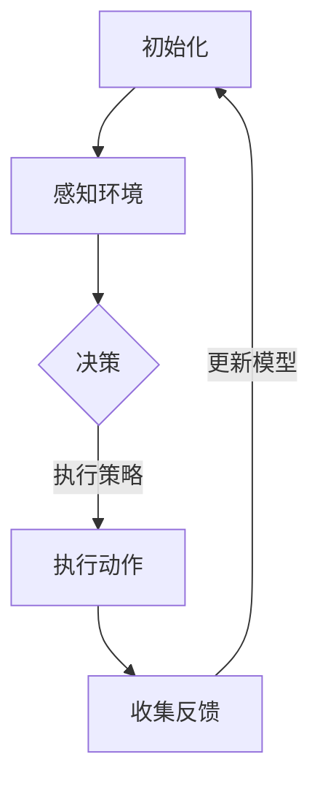
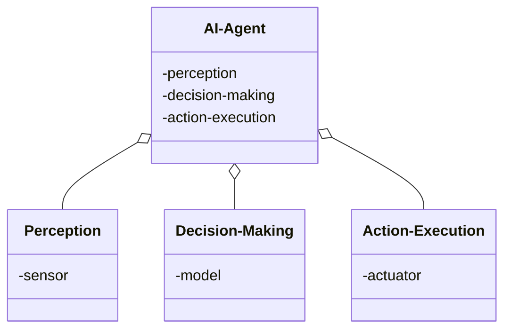
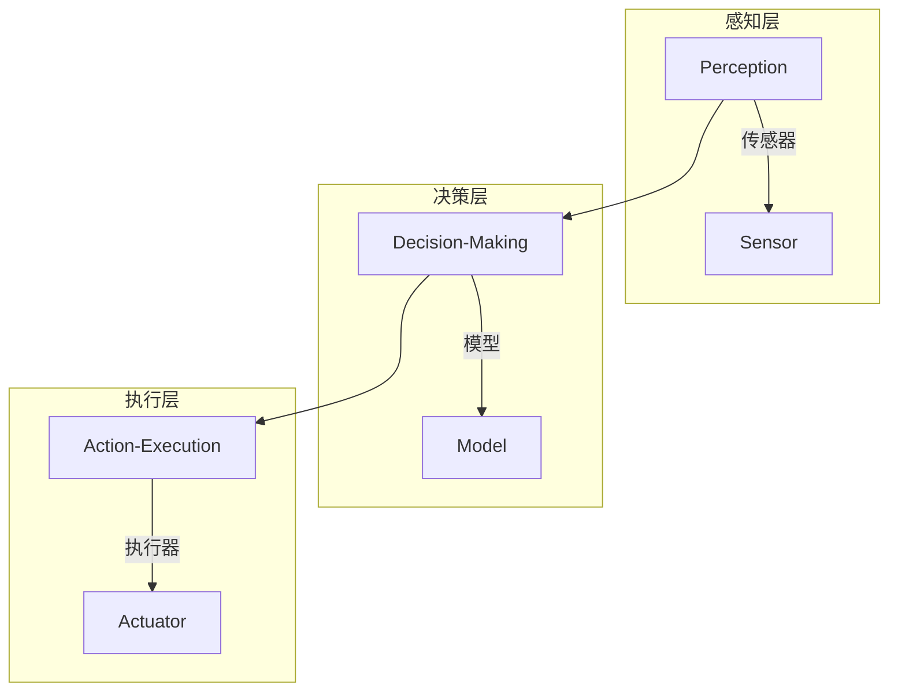
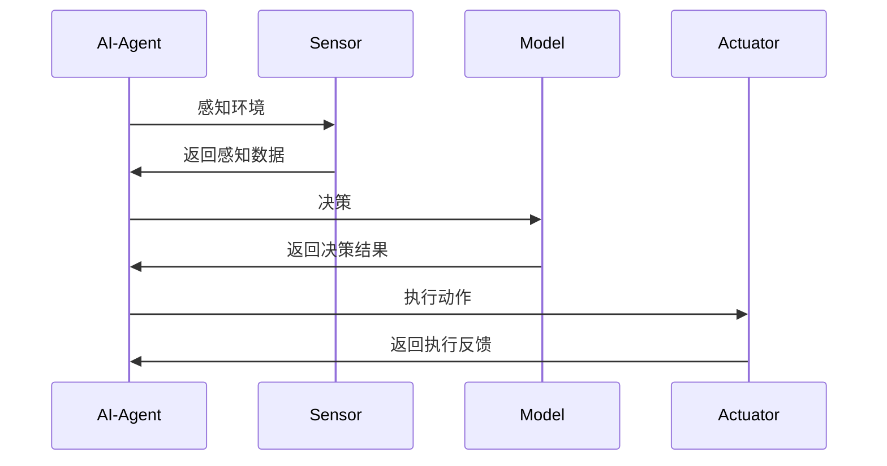
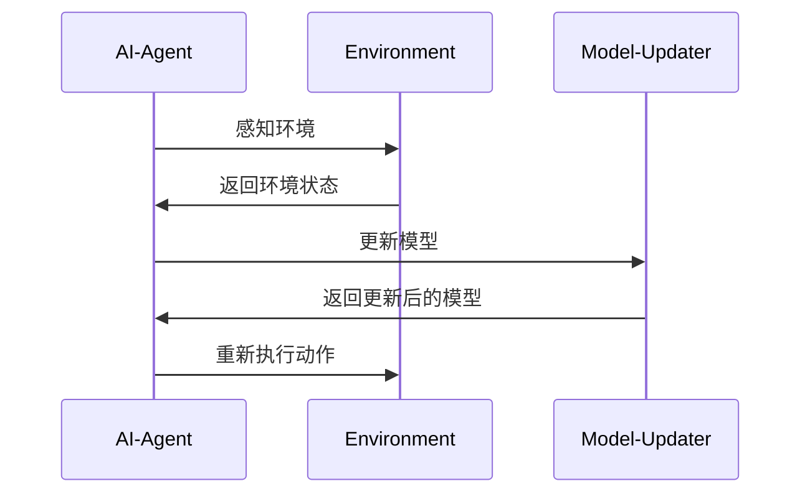

                 

### 文章标题：设计AI Agent的持续学习与模型更新机制

#### 关键词：
- AI Agent
- 持续学习
- 模型更新机制
- 数学模型
- 系统架构设计
- 项目实战

#### 摘要：
本文将深入探讨AI Agent的持续学习与模型更新机制的设计。首先，我们将介绍AI Agent的核心概念及其在持续学习和模型更新中的作用。随后，我们将详细讲解持续学习的算法原理，包括数学模型和Python源代码示例。接着，我们将分析AI Agent的系统架构设计，涵盖系统功能设计、架构设计、接口设计和交互设计。最后，我们将通过项目实战，展示实际操作过程和案例分析，总结最佳实践并给出未来研究方向。

### 第一部分：引言

#### 第1章：问题背景与介绍

##### 1.1 问题背景
人工智能（AI）技术正迅速发展，广泛应用于各个领域，如自然语言处理、计算机视觉和推荐系统等。在这些应用中，AI Agent——能够执行任务并适应环境的智能体——起着至关重要的作用。然而，随着AI应用场景的复杂化，AI Agent需要具备持续学习和适应环境变化的能力，以确保其表现和性能的持续提升。

##### 1.2 问题描述
目前，大多数AI Agent的模型更新主要依赖于离线学习和定期更新，这种方式在静态环境中表现良好，但在动态和复杂的环境中，其表现可能会受到影响。因此，设计一种能够使AI Agent在运行过程中持续学习和更新的机制，成为当前研究的一个重要课题。

##### 1.3 问题解决
本文旨在提出一种基于持续学习和模型更新的AI Agent设计框架，包括算法原理、系统架构和实际应用案例。通过这种框架，AI Agent能够在动态环境中自动调整和优化其行为，从而提升其性能和适应能力。

##### 1.4 边界与外延
本文讨论的AI Agent主要关注智能体在动态环境中的学习和适应问题，不考虑静态环境中的离线学习。同时，本文主要探讨基于机器学习和深度学习的方法，对于其他类型的AI Agent设计，如基于规则或强化学习的方法，也需要进行相应的调整和扩展。

##### 1.5 核心概念
在本章中，我们将介绍以下几个核心概念：
- AI Agent：能够执行任务并适应环境的智能体。
- 持续学习：在运行过程中，通过不断接收新数据和反馈，自动调整和优化模型参数。
- 模型更新机制：使AI Agent能够自动调整模型参数，以适应新环境和任务。

##### 1.5.1 AI Agent定义
AI Agent是指一种能够在动态环境中执行任务并具备学习能力的人工智能实体。它通常由一个或多个智能组件组成，包括感知器、决策器和执行器。感知器负责收集环境信息，决策器根据感知信息生成行动策略，执行器则执行这些策略。

##### 1.5.2 持续学习
持续学习是指AI Agent在运行过程中，通过不断接收新数据和反馈，自动调整和优化模型参数的过程。持续学习的目标是使AI Agent能够适应新的环境变化和任务要求，从而提升其性能和适应能力。

##### 1.5.3 模型更新机制
模型更新机制是指使AI Agent能够自动调整模型参数的过程。模型更新机制通常包括数据收集、模型训练、模型评估和模型更新等步骤。通过这些步骤，AI Agent能够不断调整其模型参数，以适应新的环境变化和任务要求。

#### 第2章：核心概念与联系

##### 2.1 持续学习的概念与属性特征对比
持续学习是AI Agent的核心功能之一，它使得AI Agent能够适应动态环境。在本节中，我们将对比分析不同持续学习方法的属性特征，包括基于监督学习、无监督学习和强化学习的方法。

##### 2.2 模型更新机制的概念与属性特征对比
模型更新机制是实现AI Agent持续学习的关键技术。在本节中，我们将对比分析不同模型更新机制的属性特征，包括基于模型重训练、在线学习和迁移学习的方法。

##### 2.3 AI Agent中的ER实体关系图
为了更好地理解AI Agent的持续学习和模型更新机制，我们将使用ER（实体关系）图来描述AI Agent的核心实体和关系。在本节中，我们将介绍ER图的构成和含义，并使用Mermaid语言绘制ER图。

$$
\text{ER图示例：}
$$

```mermaid
erDiagram
    AI-Agent ||--|{Perception} Perception
    AI-Agent ||--|{Decision-Making} Decision-Making
    AI-Agent ||--|{Action-Execution} Action-Execution
    Perception ||--|{Sensor} Sensor
    Decision-Making ||--|{Model} Model
    Action-Execution ||--|{Actuator} Actuator
```

#### 第二部分：算法原理与数学模型

##### 第3章：算法原理讲解

##### 3.1 算法Mermaid流程图
在本节中，我们将使用Mermaid语言绘制AI Agent持续学习和模型更新算法的流程图，以便更好地理解其工作原理。



##### 3.2 Python源代码讲解
在本节中，我们将提供Python源代码示例，详细讲解AI Agent持续学习和模型更新算法的实现过程。

```python
# 初始化模型
model = initialize_model()

# 感知环境
perception = sense_environment()

# 决策
action = make_decision(perception, model)

# 执行动作
execute_action(action)

# 收集反馈
feedback = collect_feedback()

# 更新模型
update_model(model, feedback)
```

##### 3.3 数学模型与公式讲解
在本节中，我们将介绍AI Agent持续学习和模型更新算法的数学模型和公式，以便读者能够更好地理解其数学原理。

$$
\text{损失函数：} L(\theta) = \frac{1}{m} \sum_{i=1}^{m} \ell(y_i, \theta(x_i))
$$

$$
\text{梯度下降：} \theta_{\text{new}} = \theta_{\text{old}} - \alpha \cdot \nabla L(\theta)
$$

##### 3.4 举例说明
在本节中，我们将通过一个简单的例子，说明AI Agent持续学习和模型更新算法的实现过程。

#### 第三部分：系统分析与架构设计方案

##### 第4章：系统分析与架构设计方案

##### 4.1 问题场景介绍
在本节中，我们将介绍一个典型的问题场景，以说明AI Agent持续学习和模型更新机制的应用。

##### 4.2 项目介绍
在本节中，我们将介绍一个基于AI Agent持续学习和模型更新机制的项目，包括项目目标、功能和实现方法。

##### 4.3 系统功能设计（领域模型Mermaid类图）
在本节中，我们将使用Mermaid语言绘制系统功能设计的领域模型类图，以便更好地理解系统功能模块及其关系。



##### 4.4 系统架构设计（Mermaid架构图）
在本节中，我们将使用Mermaid语言绘制系统架构设计，包括感知层、决策层和执行层的组件及其关系。



##### 4.5 系统接口设计
在本节中，我们将介绍系统接口设计，包括感知层、决策层和执行层的接口定义及其关系。



##### 4.6 系统交互Mermaid序列图
在本节中，我们将使用Mermaid语言绘制系统交互的序列图，展示AI Agent在持续学习和模型更新过程中的交互过程。



#### 第四部分：项目实战

##### 第5章：环境安装

##### 5.1 安装步骤
在本节中，我们将介绍环境安装的详细步骤，包括软件安装、配置和依赖关系。

##### 5.2 遇到的问题与解决方案
在本节中，我们将介绍在环境安装过程中可能遇到的问题及其解决方案。

##### 第6章：系统核心实现源代码

##### 6.1 核心代码片段
在本节中，我们将提供系统核心实现的源代码片段，并对其进行详细解读和分析。

```python
# 初始化模型
model = initialize_model()

# 感知环境
perception = sense_environment()

# 决策
action = make_decision(perception, model)

# 执行动作
execute_action(action)

# 收集反馈
feedback = collect_feedback()

# 更新模型
update_model(model, feedback)
```

##### 6.2 代码应用解读与分析
在本节中，我们将对核心代码片段进行应用解读和分析，以便读者更好地理解其实现原理。

##### 第7章：实际案例分析与详细讲解剖析

##### 7.1 案例背景
在本节中，我们将介绍一个实际案例，说明AI Agent持续学习和模型更新机制在具体应用中的效果。

##### 7.2 案例分析
在本节中，我们将对案例进行分析，探讨AI Agent在持续学习和模型更新过程中的表现。

##### 7.3 深入剖析
在本节中，我们将对案例进行深入剖析，分析AI Agent持续学习和模型更新机制的关键因素。

##### 第8章：项目小结

在本节中，我们将对项目进行总结，讨论项目的成功经验和不足之处，并提出改进建议。

#### 第五部分：最佳实践与总结

##### 第9章：最佳实践Tips

在本节中，我们将分享最佳实践技巧，包括环境安装、代码实现和项目优化等方面。

##### 第10章：小结与注意事项

在本节中，我们将对文章内容进行小结，强调关键概念和实现要点，并提出注意事项。

##### 第11章：拓展阅读

在本节中，我们将推荐一些相关领域的拓展阅读，以便读者进一步深入学习。

---

**作者：AI天才研究院/AI Genius Institute & 禅与计算机程序设计艺术 /Zen And The Art of Computer Programming**

本文旨在为读者提供关于AI Agent持续学习与模型更新机制的全面介绍。通过对核心概念、算法原理、系统架构和项目实战的详细讲解，读者可以更好地理解并掌握这一关键技术。在实际应用中，持续学习和模型更新机制有助于提升AI Agent的性能和适应能力，使其在动态环境中表现出色。然而，本文仅作为引玉之砖，读者还需不断探索和实践，以推动AI技术的发展。希望本文能对读者有所启发和帮助。**

