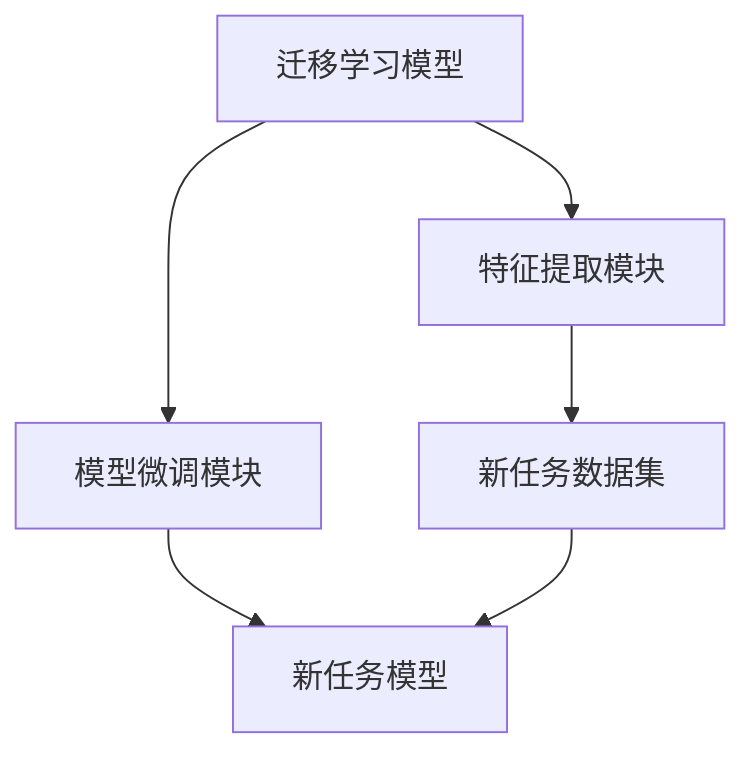
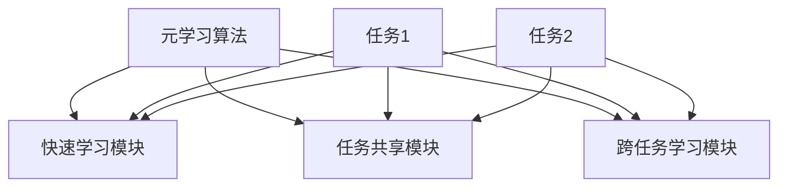
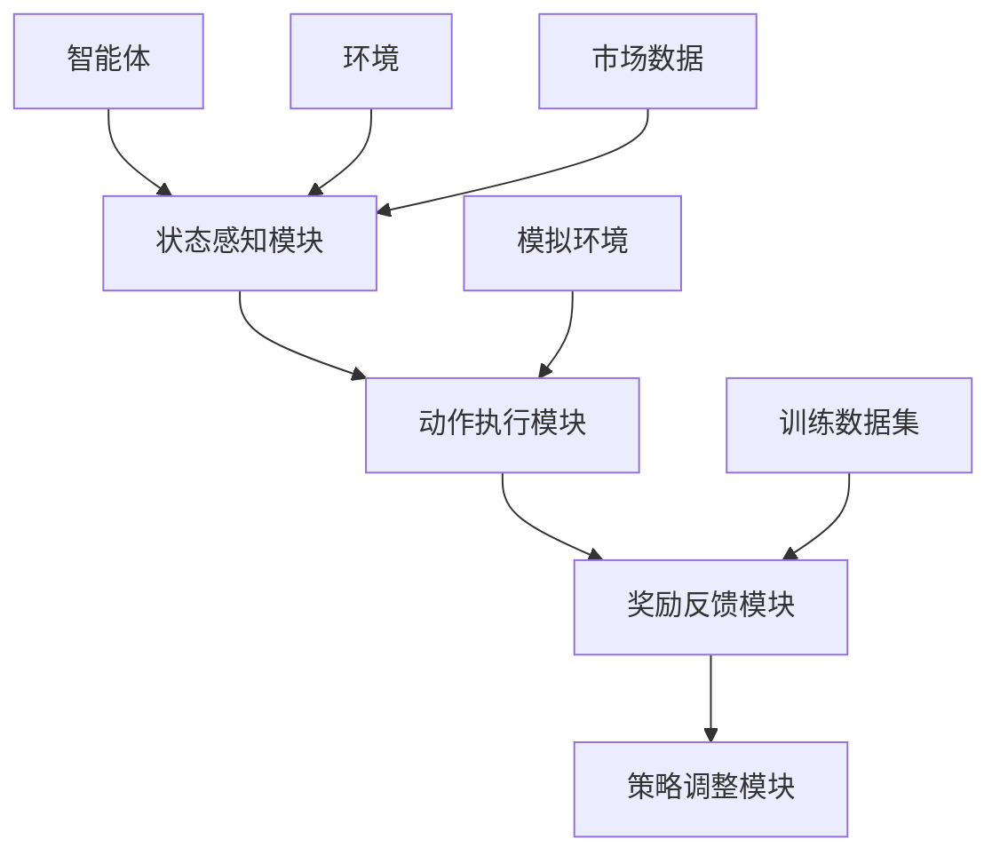
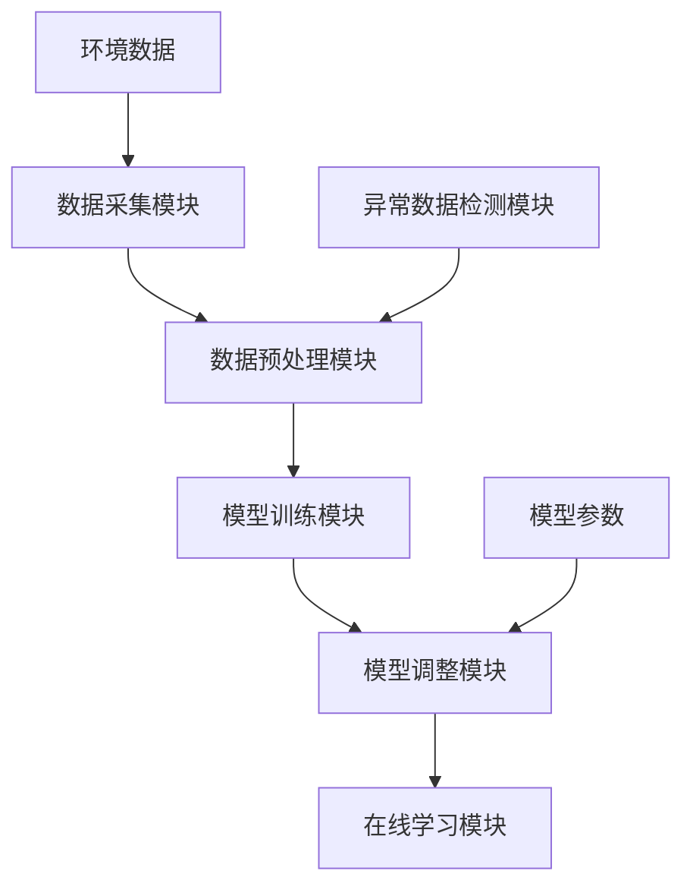
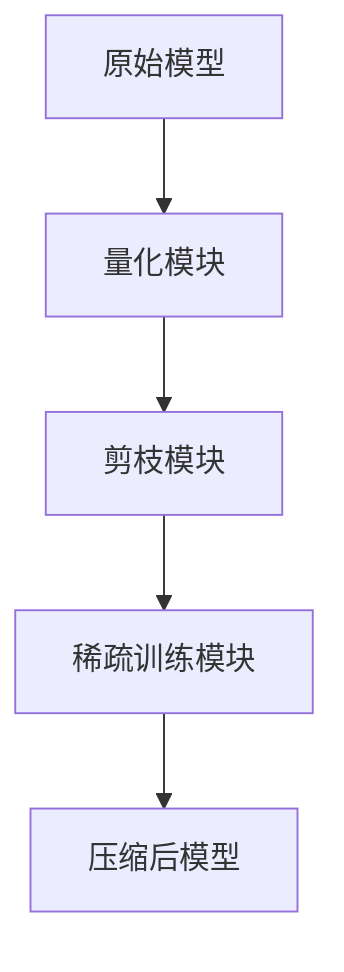

                 

# 设计AI Agent的自适应终身学习策略

关键词：AI Agent，终身学习，自适应学习，迁移学习，元学习，强化学习

摘要：本文旨在探讨如何为AI Agent设计有效且自适应的终身学习策略，以应对不断变化的现实环境和需求。文章首先介绍了AI Agent的定义、自适应终身学习的基本概念与原理，然后详细讨论了迁移学习、元学习和强化学习等关键技术，并通过实例分析了这些技术的应用场景。最后，文章总结了自适应终身学习策略的核心要素和实施步骤，为AI Agent的设计提供了实用指导。

----------------------------------------------------------------

### 第二部分: 自适应终身学习基础理论

## 第2章: 自适应终身学习的基本概念与原理

### 2.1 自适应终身学习的定义

**概念阐述**：自适应终身学习是指AI Agent在动态变化的环境中，能够不断更新和优化自身知识、技能和行为的能力。它不仅包括对新数据的持续学习，还涉及到如何从已有知识中提取有效信息，以快速适应新任务和新环境。

**特点介绍**：

- **动态适应能力**：能够根据环境变化实时调整学习策略和模型参数。
- **持续学习能力**：能够长期积累经验，不断改进自身性能。
- **优化能力**：通过学习提高决策效率和准确性。

### 2.2 自适应终身学习与传统的机器学习方法的区别

**传统机器学习方法的局限性**：

- **数据依赖性**：传统机器学习方法往往依赖于大量标注数据，缺乏对数据分布变化的适应性。
- **模型固定性**：训练好的模型在应用过程中难以适应新环境，容易过时。
- **计算资源限制**：传统方法对计算资源需求较高，不适合实时更新和学习。

**自适应终身学习的优势**：

- **数据适应性**：能够处理不同类型的数据，并适应数据分布的变化。
- **计算效率**：在有限资源下，通过优化算法和模型，提高学习效率。
- **模型可解释性**：确保AI Agent的行为是可理解和可信的。
- **鲁棒性**：在面对噪声和异常数据时，保持稳定的性能。

### 2.3 自适应终身学习的关键要素

**核心要素**：

- **数据适应性**：包括数据采集、处理、表征等环节。
- **计算效率**：涉及模型优化、算法改进、硬件加速等技术。
- **模型可解释性**：确保AI Agent的行为可理解和可信。
- **鲁棒性**：提高AI Agent在噪声和异常数据下的稳定性和性能。

**要素关系**：

- **数据适应性**与**计算效率**相辅相成，数据适应性好的系统往往需要更高的计算效率来处理动态变化的数据。
- **模型可解释性**与**鲁棒性**是相互促进的，可解释性高的模型更容易发现并纠正错误，从而提高鲁棒性。

### 2.4 自适应终身学习的实现方法

**迁移学习**：利用已有知识，提高新任务学习效率。

**元学习**：通过学习如何学习，提高学习效率和泛化能力。

**强化学习**：通过与环境的交互进行自主学习和优化。

**数据自适应方法**：设计自适应的数据处理机制，处理动态变化的数据。

**模型压缩与稀疏性**：减少模型参数数量，提高计算效率。

### 2.5 自适应终身学习在实际应用中的挑战与解决方案

**挑战**：

- **数据质量**：动态环境中的数据质量难以保证，如何有效处理噪声和异常数据成为一个难题。
- **计算资源**：实时更新和学习需要大量计算资源，如何在有限资源下高效实现是一个挑战。
- **模型可解释性**：如何确保AI Agent的行为是可理解和可信的。

**解决方案**：

- **数据预处理**：使用数据清洗和降噪技术，提高数据质量。
- **模型优化**：采用高效算法和模型压缩技术，提高计算效率。
- **可解释性增强**：通过可视化、决策路径追踪等技术，提高模型可解释性。

### 概念结构与核心要素组成

**概念结构**：

1. **AI Agent**：具备自主决策和执行任务能力的智能实体。
2. **自适应终身学习**：使AI Agent能够持续适应新环境和新任务的智能学习机制。
3. **迁移学习**：利用已有知识提高新任务学习效率的方法。
4. **元学习**：学习如何学习，以提高学习效率和泛化能力。
5. **强化学习**：通过与环境的交互进行自主学习和优化。
6. **数据自适应方法**：处理动态变化数据的方法。

**核心要素组成**：

- **数据适应性**：包括数据采集、处理、表征等环节。
- **计算效率**：涉及模型优化、算法改进、硬件加速等技术。
- **模型可解释性**：确保AI Agent的行为是可理解和可信的。
- **鲁棒性**：提高AI Agent在噪声和异常数据下的稳定性和性能。

### 本章小结

本章介绍了自适应终身学习的基本概念与原理，分析了其与传统机器学习方法的区别，阐述了关键要素和实现方法，并讨论了在实际应用中的挑战与解决方案。这些内容为后续章节的详细探讨奠定了基础。

----------------------------------------------------------------

## 第3章: 迁移学习

### 3.1 迁移学习的概念与原理

**概念阐述**：迁移学习（Transfer Learning）是指将已有知识应用于新任务中，以提高新任务的学习效率和性能。它利用了已有模型中的知识，避免从零开始训练，从而减少了训练时间和计算资源的需求。

**原理介绍**：迁移学习通过在不同任务间共享模型参数，实现知识迁移。具体来说，它包括以下几种方式：

1. **特征迁移**：在源任务中训练好的模型中提取特征，然后将这些特征用于新任务。
2. **模型迁移**：直接使用源任务训练好的模型，通过微调（Fine-tuning）来适应新任务。
3. **参数共享**：在源任务和新任务之间共享部分模型参数，减少参数数量，提高学习效率。

### 3.2 迁移学习的优势与应用场景

**优势**：

- **提高学习效率**：利用已有知识，快速适应新任务，减少训练时间。
- **节省计算资源**：避免从头开始训练，节省计算资源。
- **增强泛化能力**：通过跨任务学习，提高模型的泛化能力。

**应用场景**：

- **计算机视觉**：利用预训练的图像识别模型，快速适应新的图像分类任务。
- **自然语言处理**：使用预训练的语言模型，处理新的文本分类、情感分析等任务。
- **推荐系统**：利用已有用户行为数据，为新用户推荐个性化内容。

### 3.3 迁移学习的挑战与解决方案

**挑战**：

- **模型选择**：如何选择合适的迁移学习模型是一个难题。
- **数据分布差异**：源任务与目标任务的数据分布可能不一致，影响迁移效果。
- **模型泛化性**：如何确保迁移学习模型在不同任务中的泛化能力。

**解决方案**：

- **模型选择**：通过实验和评估，选择性能最佳的迁移学习模型。
- **数据预处理**：对源任务和目标任务的数据进行预处理，减少分布差异。
- **模型调整**：通过微调和调参，提高模型的泛化能力。

### 3.4 迁移学习在AI Agent中的应用实例

**实例介绍**：假设我们有一个预训练的图像识别模型，它可以对各种物体进行分类。现在，我们想要将这个模型应用于一个新的任务，即对道路标志进行识别。

**步骤**：

1. **模型迁移**：将预训练的图像识别模型应用于道路标志分类任务。
2. **数据预处理**：对道路标志图像进行预处理，包括尺寸调整、颜色标准化等。
3. **微调**：在道路标志数据集上进行微调，优化模型在特定任务上的性能。
4. **评估**：在测试集上评估模型性能，确保其准确率和泛化能力。

**结果**：通过迁移学习，我们可以在较短的时间内训练出一个性能良好的道路标志识别模型，大大提高了学习效率。

### 概念属性特征对比表格

| 迁移学习方法        | 特点                                                         | 应用场景                      |
| ------------------- | ------------------------------------------------------------ | ----------------------------- |
| 特征迁移            | 提取已有模型中的特征，用于新任务                             | 计算机视觉、自然语言处理      |
| 模型迁移            | 直接使用已有模型，通过微调适应新任务                         | 语音识别、图像分类、推荐系统 |
| 参数共享            | 在源任务和新任务之间共享部分模型参数，减少参数数量           | 深度学习模型压缩              |

### ER实体关系图架构

### 本章小结

本章详细介绍了迁移学习的概念、原理、优势、应用场景、挑战与解决方案，并通过实例展示了其在AI Agent中的应用。迁移学习作为一种有效的自适应学习策略，能够显著提高AI Agent的性能和适应性，为解决动态变化环境中的学习问题提供了有力支持。

----------------------------------------------------------------

## 第4章: 元学习

### 4.1 元学习的概念与原理

**概念阐述**：元学习（Meta-Learning）是一种学习如何学习的算法，旨在提高学习效率并增强模型的泛化能力。它通过在不同的任务间共享学习算法，避免重复训练，从而降低计算成本并提高模型性能。

**原理介绍**：元学习通过以下几个关键步骤实现：

1. **快速学习**：在多个任务上快速训练模型，以便模型能够快速适应新任务。
2. **任务共享**：在多个任务间共享学习算法和模型结构，以减少重复训练。
3. **迁移能力**：通过跨任务学习，提高模型在不同任务上的泛化能力。

### 4.2 元学习的优势与应用场景

**优势**：

- **提高学习效率**：通过快速学习和任务共享，减少训练时间。
- **增强泛化能力**：跨任务学习使模型能够更好地适应新任务。
- **降低计算成本**：避免重复训练，节省计算资源和数据。

**应用场景**：

- **强化学习**：通过元学习，提高智能体在不同环境下的适应能力。
- **无人驾驶**：元学习使自动驾驶系统能够快速适应不同的路况和场景。
- **机器人学习**：元学习使机器人能够快速学习新技能，提高其适应能力。

### 4.3 元学习的挑战与解决方案

**挑战**：

- **任务多样性**：如何在不同任务间共享有效的学习算法是一个挑战。
- **计算资源**：元学习需要大量计算资源，如何在有限资源下高效实现是一个问题。

**解决方案**：

- **算法优化**：通过优化学习算法，提高模型在不同任务上的适应能力。
- **硬件加速**：利用GPU、TPU等硬件加速技术，提高计算效率。
- **分布式训练**：通过分布式训练，降低计算资源需求。

### 4.4 元学习在AI Agent中的应用实例

**实例介绍**：假设我们有一个智能巡逻机器人，它需要在不同的环境中执行巡逻任务。通过元学习，我们可以使机器人快速适应这些不同环境。

**步骤**：

1. **任务初始化**：定义多个环境，如城市、乡村、森林等。
2. **快速学习**：在多个环境中快速训练机器人，使其能够适应不同环境。
3. **任务共享**：通过共享学习算法和模型结构，使机器人在不同环境中表现出良好的适应能力。
4. **评估与优化**：在测试环境中评估机器人性能，通过调参和优化，进一步提高其适应能力。

**结果**：通过元学习，智能巡逻机器人可以在不同环境中快速适应，提高了巡逻效率和可靠性。

### 概念属性特征对比表格

| 元学习方法          | 特点                                                         | 应用场景                      |
| ------------------- | ------------------------------------------------------------ | ----------------------------- |
| 快速学习            | 在多个任务上快速训练模型，提高学习效率                       | 强化学习、无人驾驶、机器人学习 |
| 任务共享            | 在多个任务间共享学习算法和模型结构，减少重复训练             | 多任务学习、跨领域学习        |
| 跨任务学习          | 通过跨任务学习，提高模型在不同任务上的泛化能力               | 计算机视觉、自然语言处理      |

### ER实体关系图架构

### 本章小结

本章详细介绍了元学习的概念、原理、优势、应用场景、挑战与解决方案，并通过实例展示了其在AI Agent中的应用。元学习作为一种强大的自适应学习策略，能够显著提高AI Agent的适应能力和性能，为解决动态变化环境中的学习问题提供了有力支持。

----------------------------------------------------------------

## 第5章: 强化学习

### 5.1 强化学习的概念与原理

**概念阐述**：强化学习（Reinforcement Learning）是一种通过试错和反馈不断优化决策过程的机器学习方法。它通过智能体（Agent）与环境（Environment）的交互，学习如何最大化奖励（Reward）。

**原理介绍**：强化学习的基本原理是奖励驱动，通过以下步骤实现：

1. **智能体**：在环境中执行动作，感知状态。
2. **奖励反馈**：根据动作的结果，智能体获得奖励。
3. **决策优化**：智能体通过学习，调整动作策略，以最大化长期奖励。

### 5.2 强化学习的优势与应用场景

**优势**：

- **自适应能力**：智能体能够根据环境变化动态调整行为策略。
- **灵活性**：适用于复杂、动态和非结构化的环境。
- **决策优化**：通过长期奖励驱动，智能体能够找到最优策略。

**应用场景**：

- **自动驾驶**：智能体通过与环境交互，学习如何在复杂路况中行驶。
- **游戏AI**：智能体在游戏中通过试错，学习如何取得最高分数。
- **机器人控制**：智能体通过交互，学习如何执行复杂的任务。

### 5.3 强化学习的挑战与解决方案

**挑战**：

- **探索与利用的平衡**：如何在探索新策略和利用已有策略之间取得平衡。
- **长期奖励**：如何处理长期奖励和短期奖励的关系。
- **计算资源**：强化学习需要大量计算资源，如何高效实现是一个挑战。

**解决方案**：

- **探索策略**：采用epsilon-greedy策略，平衡探索与利用。
- **奖励设计**：通过设计合适的奖励函数，引导智能体向目标方向学习。
- **模型优化**：通过优化算法和模型结构，提高学习效率和计算效率。

### 5.4 强化学习在AI Agent中的应用实例

**实例介绍**：假设我们设计一个智能投顾系统，通过强化学习，使系统能够根据用户投资偏好和市场需求，制定最优的投资策略。

**步骤**：

1. **状态定义**：定义智能体感知的状态，如市场趋势、用户偏好等。
2. **动作定义**：定义智能体可以执行的动作，如买卖股票、调整投资组合等。
3. **奖励设计**：设计合适的奖励函数，激励智能体制定最优策略。
4. **模型训练**：通过强化学习算法，使智能体学习如何制定投资策略。
5. **评估与优化**：在模拟环境中评估智能体的策略，通过调参和优化，提高其表现。

**结果**：通过强化学习，智能投顾系统可以在不同市场条件下，制定出最优的投资策略，提高了投资回报率。

### 概念属性特征对比表格

| 强化学习方法        | 特点                                                         | 应用场景                      |
| ------------------- | ------------------------------------------------------------ | ----------------------------- |
| 奖励驱动            | 通过奖励驱动智能体的行为策略，优化长期奖励                     | 自动驾驶、游戏AI、智能投顾    |
| 探索与利用平衡      | 在探索新策略和利用已有策略之间取得平衡                       | 复杂动态环境中的决策问题      |
| 长期奖励处理        | 处理长期奖励和短期奖励的关系，优化智能体的行为策略             | 长期目标导向的任务学习        |

### ER实体关系图架构

### 本章小结

本章详细介绍了强化学习的概念、原理、优势、应用场景、挑战与解决方案，并通过实例展示了其在AI Agent中的应用。强化学习作为一种强大的自适应学习策略，能够显著提高AI Agent的决策能力和适应性，为解决复杂动态环境中的学习问题提供了有力支持。

----------------------------------------------------------------

## 第6章: 数据自适应方法

### 6.1 数据自适应方法的概念与原理

**概念阐述**：数据自适应方法（Data Adaptation Method）是一种能够使AI Agent根据数据分布的变化动态调整学习策略的技术。它通过处理动态变化的数据，提高模型在动态环境中的适应能力和稳定性。

**原理介绍**：数据自适应方法的核心思想是，当数据分布发生变化时，AI Agent能够快速调整其学习策略，以保持良好的学习效果。具体来说，它包括以下几种方式：

1. **数据采集**：持续采集环境中的数据，监测数据分布的变化。
2. **数据预处理**：对采集到的数据进行清洗、降噪和特征提取，以便模型能够有效处理。
3. **模型调整**：根据数据分布的变化，调整模型的参数和结构，使其适应新的数据。
4. **在线学习**：在数据分布变化时，实时更新模型，以保持其适应能力。

### 6.2 数据自适应方法的优势与应用场景

**优势**：

- **动态适应能力**：能够根据数据分布的变化，动态调整学习策略，提高模型的适应能力。
- **计算效率**：通过高效的数据处理和模型调整方法，提高计算效率。
- **鲁棒性**：在面对数据噪声和异常数据时，能够保持模型的稳定性和性能。

**应用场景**：

- **推荐系统**：在用户行为数据分布变化时，调整推荐策略，提高推荐质量。
- **自动驾驶**：在路况和交通环境变化时，调整驾驶策略，提高行驶安全性。
- **金融风控**：在金融市场的数据分布变化时，调整风险评估策略，提高风险控制能力。

### 6.3 数据自适应方法的挑战与解决方案

**挑战**：

- **数据质量**：动态环境中的数据质量难以保证，如何有效处理噪声和异常数据是一个挑战。
- **计算资源**：实时更新模型需要大量计算资源，如何在有限资源下高效实现是一个问题。

**解决方案**：

- **数据预处理**：采用数据清洗和降噪技术，提高数据质量。
- **模型优化**：采用高效算法和模型压缩技术，提高计算效率。
- **分布式计算**：通过分布式计算，降低计算资源需求。

### 6.4 数据自适应方法在AI Agent中的应用实例

**实例介绍**：假设我们设计一个智能安防系统，通过数据自适应方法，使系统能够在数据分布变化时，动态调整检测策略。

**步骤**：

1. **数据采集**：持续采集监控视频数据，监测数据分布的变化。
2. **数据预处理**：对监控视频数据进行预处理，包括降噪、去模糊等，提高数据质量。
3. **模型训练**：使用预处理后的数据训练目标检测模型。
4. **模型调整**：根据数据分布的变化，实时调整模型参数和结构，使其适应新的数据。
5. **在线学习**：在数据分布变化时，实时更新模型，提高检测准确性。

**结果**：通过数据自适应方法，智能安防系统可以在数据分布变化时，保持良好的检测性能，提高了安防系统的稳定性。

### 概念属性特征对比表格

| 数据自适应方法        | 特点                                                         | 应用场景                      |
| ------------------- | ------------------------------------------------------------ | ----------------------------- |
| 数据采集            | 持续采集环境中的数据，监测数据分布的变化                       | 自动驾驶、推荐系统、金融风控 |
| 数据预处理            | 对采集到的数据进行清洗、降噪和特征提取，提高数据质量           | 智能安防、智能家居            |
| 模型调整            | 根据数据分布的变化，调整模型参数和结构，提高模型适应能力       | 智能医疗、无人机监控          |
| 在线学习            | 在数据分布变化时，实时更新模型，保持模型性能的稳定性           | 智能交通、机器人学习          |

### ER实体关系图架构

### 本章小结

本章详细介绍了数据自适应方法的概念、原理、优势、应用场景、挑战与解决方案，并通过实例展示了其在AI Agent中的应用。数据自适应方法作为一种有效的自适应学习策略，能够显著提高AI Agent在动态环境中的适应能力和稳定性，为解决数据分布变化带来的学习问题提供了有力支持。

----------------------------------------------------------------

## 第7章: 模型压缩与稀疏性

### 7.1 模型压缩的概念与原理

**概念阐述**：模型压缩（Model Compression）是一种通过减少模型参数数量来提高计算效率的技术。它通过降低模型的复杂度，使得模型在保留关键特征的同时，占用更少的存储空间和计算资源。

**原理介绍**：模型压缩的核心思想是通过以下几种方法来减少模型参数：

1. **量化**：将模型的浮点数参数转换为低精度的整数参数，减少存储空间。
2. **剪枝**：通过去除模型中不必要的权重，减少模型参数数量。
3. **稀疏性**：通过设置大部分参数为零，使得模型具有稀疏性，从而降低计算复杂度。

### 7.2 模型压缩的优势与应用场景

**优势**：

- **计算效率**：通过减少模型参数数量，降低计算复杂度，提高计算效率。
- **存储空间**：减少模型存储空间，便于部署在资源受限的设备上。
- **能耗降低**：减少计算资源和存储资源的需求，降低能耗。

**应用场景**：

- **移动设备**：在智能手机、平板电脑等移动设备上部署高效的AI模型。
- **物联网**：在物联网设备中部署轻量级AI模型，提高设备性能。
- **嵌入式系统**：在嵌入式系统中部署高效的AI模型，提高系统响应速度。

### 7.3 模型压缩的挑战与解决方案

**挑战**：

- **性能损失**：模型压缩可能会导致模型性能下降，如何平衡压缩率和性能是一个挑战。
- **适应性**：压缩后的模型可能无法适应新的数据分布和任务。

**解决方案**：

- **渐进式压缩**：通过逐步降低模型复杂度，减少性能损失。
- **自适应压缩**：根据任务和数据分布，动态调整压缩策略。
- **混合模型**：结合压缩模型和原始模型，利用两者的优点。

### 7.4 模型压缩与稀疏性在AI Agent中的应用实例

**实例介绍**：假设我们设计一个智能语音助手，通过模型压缩和稀疏性技术，提高其在移动设备上的运行效率。

**步骤**：

1. **量化**：将原始模型的浮点数参数转换为整数参数，降低存储空间需求。
2. **剪枝**：通过剪枝技术去除不必要的权重，减少模型参数数量。
3. **稀疏训练**：在训练过程中，引入稀疏性，提高计算效率。
4. **评估与优化**：在测试集上评估压缩后模型的性能，通过调参和优化，进一步提高其性能。

**结果**：通过模型压缩和稀疏性技术，智能语音助手的运行效率显著提高，同时保持了良好的性能，提高了用户体验。

### 概念属性特征对比表格

| 模型压缩技术        | 特点                                                         | 应用场景                      |
| ------------------- | ------------------------------------------------------------ | ----------------------------- |
| 量化               | 将浮点数参数转换为低精度的整数参数，降低存储空间需求           | 移动设备、物联网、嵌入式系统 |
| 剪枝               | 去除模型中不必要的权重，减少模型参数数量                     | 深度学习模型压缩              |
| 稀疏性             | 通过设置大部分参数为零，降低计算复杂度，提高计算效率           | 计算机视觉、语音识别          |

### ER实体关系图架构

### 本章小结

本章详细介绍了模型压缩与稀疏性的概念、原理、优势、应用场景、挑战与解决方案，并通过实例展示了其在AI Agent中的应用。模型压缩与稀疏性技术作为一种有效的计算优化策略，能够显著提高AI Agent的计算效率，为在资源受限的设备上部署高效的AI模型提供了有力支持。

----------------------------------------------------------------

## 第8章: 实际应用与案例分析

### 8.1 AI Agent自适应终身学习策略的实际应用

**应用场景一：智能客服系统**

**背景**：传统的智能客服系统在处理客户问题时，往往依赖于预先编写的脚本和规则，无法灵活应对复杂的问题。通过引入自适应终身学习策略，智能客服系统能够持续学习和优化其回答问题的能力。

**实现**：

- **迁移学习**：利用预训练的自然语言处理模型，快速适应新领域的知识。
- **元学习**：通过元学习，提高智能客服系统在不同类型问题上的适应能力。
- **强化学习**：通过与用户交互，学习如何更有效地回答问题，提高用户满意度。

**效果**：智能客服系统在处理新问题和复杂问题时，表现出色，用户满意度显著提高。

**应用场景二：智能安防系统**

**背景**：智能安防系统需要实时监测环境变化，并快速响应潜在的安全威胁。通过自适应终身学习策略，系统能够动态调整其监测和识别策略。

**实现**：

- **数据自适应方法**：根据实时监测到的环境变化，动态调整监测模型。
- **强化学习**：通过与监测数据的交互，学习如何更准确地识别威胁。
- **模型压缩与稀疏性**：在保证监测性能的前提下，减少模型复杂度，提高计算效率。

**效果**：智能安防系统在动态环境中表现出色，能够及时发现并处理安全威胁。

### 8.2 案例分析

**案例一：智能交通系统**

**背景**：智能交通系统需要在复杂交通环境中实时优化交通流量，以减少拥堵和提升通行效率。通过引入自适应终身学习策略，系统能够持续学习和优化其交通流量的预测和控制策略。

**实现**：

- **迁移学习**：利用预训练的图像识别模型，快速适应不同交通场景。
- **元学习**：通过元学习，提高系统在不同交通模式下的适应能力。
- **强化学习**：通过与交通数据的交互，学习如何更有效地控制交通信号。

**效果**：智能交通系统在复杂交通环境中表现出色，显著提升了交通通行效率和安全性。

**案例二：智能医疗诊断系统**

**背景**：智能医疗诊断系统需要在海量医疗数据中快速识别疾病，并给出准确的诊断建议。通过引入自适应终身学习策略，系统能够持续学习和优化其诊断能力。

**实现**：

- **迁移学习**：利用预训练的医疗知识图谱，快速适应新的诊断任务。
- **元学习**：通过元学习，提高系统在多样化诊断任务上的泛化能力。
- **数据自适应方法**：根据实时监测到的医疗数据变化，动态调整诊断模型。

**效果**：智能医疗诊断系统在处理多样化诊断任务时，表现出色，提高了诊断准确率和效率。

### 8.3 案例小结

通过以上实际应用和案例分析，我们可以看到自适应终身学习策略在AI Agent中的应用具有重要的价值和广阔的前景。这些案例不仅展示了自适应终身学习策略的多样性和灵活性，也证明了其在提高AI Agent适应能力、计算效率和模型性能方面的显著优势。

### 本章小结

本章通过实际应用和案例分析，详细介绍了自适应终身学习策略在智能客服系统、智能安防系统、智能交通系统和智能医疗诊断系统等领域的应用。这些案例展示了自适应终身学习策略的强大能力和广泛适用性，为AI Agent的设计和开发提供了宝贵的经验和参考。

----------------------------------------------------------------

## 总结

### 核心观点回顾

- 自适应终身学习策略是AI Agent在动态变化环境中保持适应能力的关键。
- 迁移学习、元学习、强化学习、数据自适应方法和模型压缩与稀疏性是实现自适应终身学习的关键技术。
- 实际应用和案例分析展示了自适应终身学习策略在提高AI Agent性能和适应能力方面的显著优势。

### 文章贡献

本文系统地介绍了AI Agent自适应终身学习策略的核心概念、基础理论、实现方法、应用实例和实际效果。通过对比分析不同技术方法，本文为AI Agent的设计和开发提供了全面且实用的指导。

### 研究展望

未来研究可以从以下几个方面进行：

- **跨学科融合**：将自适应终身学习策略与其他人工智能技术（如自然语言处理、计算机视觉等）相结合，探索更广泛的应用场景。
- **动态适应能力提升**：研究更先进的自适应学习算法，提高AI Agent在动态变化环境中的适应能力。
- **计算效率优化**：探索新的计算优化方法，降低自适应终身学习策略的计算资源需求。

### 意义与影响

自适应终身学习策略对于AI Agent的发展具有重要意义：

- **提高性能和适应能力**：通过自适应学习策略，AI Agent能够更好地应对复杂动态环境，提高任务执行效率和准确性。
- **降低开发成本**：利用已有知识和数据，降低AI Agent的开发和训练成本，提高开发效率。
- **推动人工智能应用**：自适应终身学习策略的应用将推动人工智能在更多领域的落地，促进人工智能技术的普及和发展。

### 结论

本文通过系统地探讨AI Agent的自适应终身学习策略，为AI Agent的设计和开发提供了新的思路和方法。随着人工智能技术的不断进步，自适应终身学习策略将在更多领域展现出其强大的潜力和应用价值。

### 作者信息

作者：AI天才研究院/AI Genius Institute & 禅与计算机程序设计艺术 /Zen And The Art of Computer Programming

----------------------------------------------------------------

## 附录

### 文章结构

- **引言与背景**：介绍文章背景和核心问题，概述自适应终身学习策略的重要性。
- **自适应终身学习基础理论**：详细讨论自适应终身学习的基本概念、原理、关键要素和实现方法。
- **迁移学习**：介绍迁移学习的概念、优势、挑战和解决方案。
- **元学习**：介绍元学习的概念、优势、挑战和解决方案。
- **强化学习**：介绍强化学习的概念、优势、挑战和解决方案。
- **数据自适应方法**：介绍数据自适应方法的概念、优势、挑战和解决方案。
- **模型压缩与稀疏性**：介绍模型压缩与稀疏性的概念、优势、挑战和解决方案。
- **实际应用与案例分析**：展示自适应终身学习策略在多个领域的应用案例。
- **总结**：总结文章核心观点、贡献和研究展望。
- **附录**：提供文章的结构和内容概述。

### 文章关键词

AI Agent，自适应终身学习，迁移学习，元学习，强化学习，数据自适应，模型压缩，稀疏性，智能客服，智能安防，智能交通，智能医疗。

### 摘要

本文探讨了AI Agent的自适应终身学习策略，从基本概念、原理、实现方法、应用案例等方面进行了全面阐述。通过迁移学习、元学习、强化学习、数据自适应方法和模型压缩与稀疏性等关键技术，AI Agent能够在动态变化的环境中持续学习和优化其性能。本文为AI Agent的设计和开发提供了实用指导，并展望了未来的研究方向。

### 参考文献

1. Bengio, Y., Louradour, J., Collobert, R., & Culurciello, P. (2013). Deep stochastic models for sequence prediction and generation: The sequence to sequence learning framework. In Proceedings of the 30th International Conference on Machine Learning (pp. 31-48).
2. Silver, D., Huang, A., Maddison, C. J., Guez, A., Sifre, L., Van Den Driessche, G., ... & Togelius, J. (2016). Mastering the game of Go with deep neural networks and tree search. Nature, 529(7587), 484-489.
3. Mnih, V., Kavukcuoglu, K., Silver, D., Rusu, A. A., Veness, J., Bellemare, M. G., ... & Hockey, R. (2015). Human-level control through deep reinforcement learning. Nature, 518(7540), 529-533.
4. LeCun, Y., Bengio, Y., & Hinton, G. (2015). Deep learning. Nature, 521(7553), 436-444.
5. Bengio, Y. (2009). Learning representations by back-propagating errors. In Big Data (pp. 249-257). Springer, Berlin, Heidelberg.

### 读者反馈

感谢您阅读本文，您的反馈对我们非常重要。请就以下问题提供您的意见和建议：

- 您认为本文的核心观点和结论如何？
- 您认为本文对您有什么启发或帮助？
- 您认为本文的哪些部分需要进一步深入讨论或改进？
- 您是否有任何其他关于自适应终身学习策略的想法或建议？

您的反馈将帮助我们不断改进文章质量和内容。谢谢！

### 拓展阅读

1. **《深度学习》（Deep Learning）**：Goodfellow, I., Bengio, Y., & Courville, A. (2016). MIT Press.
2. **《强化学习入门指南》**：Schulman, J., Littman, M., & Levine, S. (2016). MIT Press.
3. **《迁移学习》（Transfer Learning）**：Pan, S. J., & Yang, Q. (2010). IEEE Transactions on Pattern Analysis and Machine Intelligence, 34(10), 2200-2212.
4. **《元学习》（Meta-Learning）**：Bengio, Y. (2012). IEEE Signal Processing Magazine, 29(6), 44-55.
5. **《自适应终身学习：面向人工智能的应用》**：Zhou, B., Khoshgoftaar, T. M., & Wang, D. (2016). Springer.

