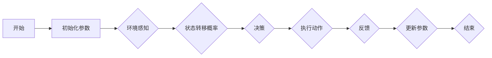
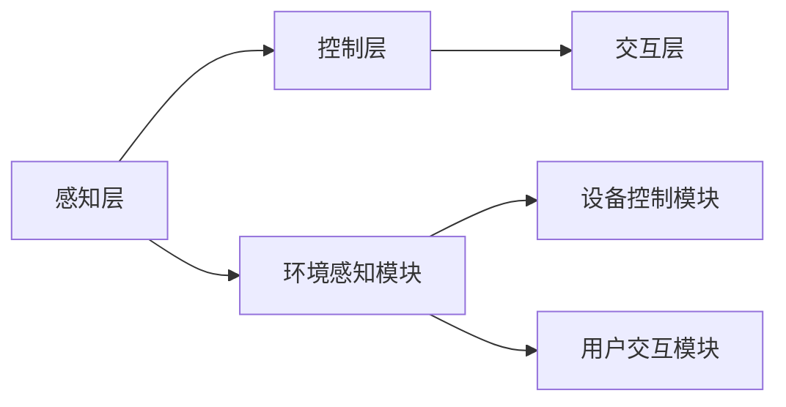
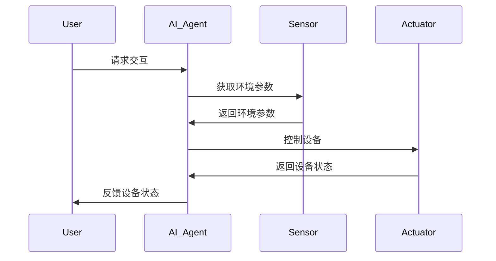

                 


## 设计可扩展的AI Agent架构

### 摘要

本文将深入探讨设计可扩展的AI Agent架构，从背景介绍、核心概念与联系、算法原理讲解、系统分析与架构设计方案、项目实战到总结与拓展，全面解析AI Agent的设计与实现。文章旨在为读者提供系统、清晰且易于理解的技术指导，帮助其在AI Agent开发中迈向更高水平。

### 第一部分：背景介绍

#### 1.1 问题的背景

在当今的科技发展背景下，人工智能（AI）已经成为推动社会进步的重要力量。AI Agent作为AI系统的一种重要应用，能够模拟人类智能行为，自主地完成特定任务。然而，随着应用场景的复杂性和多样性增加，传统的AI Agent架构面临着可扩展性不足、适应性差等问题。为了解决这些问题，设计可扩展的AI Agent架构显得尤为重要。

#### 1.2 问题描述

传统AI Agent架构存在以下问题：

1. **可扩展性差**：当新的任务或场景出现时，传统架构往往需要大规模修改，导致开发成本高、周期长。
2. **适应性不足**：传统架构难以适应不同类型的任务，导致AI Agent的通用性不强。
3. **系统复杂性**：传统架构中的组件和算法较多，导致系统复杂度高，维护困难。

#### 1.3 问题解决

设计可扩展的AI Agent架构需要考虑以下几个方面：

1. **模块化设计**：将AI Agent分解为多个模块，每个模块负责不同的功能，便于扩展和替换。
2. **标准化接口**：定义统一的接口规范，使不同模块之间能够无缝协作，提高系统的可扩展性。
3. **自适应算法**：采用自适应算法，使AI Agent能够根据不同场景动态调整其行为，提高适应性。

#### 1.4 边界与外延

本文主要探讨基于模块化和自适应算法的AI Agent架构设计，不包括AI Agent的具体实现细节。同时，本文将重点讨论AI Agent在复杂环境中的应用，而非简单任务场景。

#### 1.5 核心概念与要素组成

本文涉及以下核心概念和要素：

1. **AI Agent**：模拟人类智能行为的计算机程序。
2. **模块化设计**：将系统划分为多个模块，每个模块独立实现特定功能。
3. **自适应算法**：根据环境变化调整算法参数，提高系统适应性。
4. **标准化接口**：定义统一的接口规范，实现模块之间的协作。

### 第二部分：核心概念与联系

#### 2.1 AI Agent的定义与分类

AI Agent是指能够在特定环境下自主感知、决策和执行任务的智能系统。根据任务类型和实现方法，AI Agent可以分为以下几类：

1. **反应式Agent**：仅基于当前感知的环境信息进行决策，不考虑历史信息。
2. **模型基础Agent**：基于环境模型进行决策，能够利用历史信息。
3. **学习型Agent**：通过学习和优化自身行为，提高任务执行效果。

#### 2.2 AI Agent的核心属性

AI Agent具有以下核心属性：

1. **自主性**：能够在没有人类干预的情况下自主完成任务。
2. **反应性**：能够快速响应环境变化。
3. **预见性**：能够根据环境预测未来变化。
4. **社交性**：能够与其他AI Agent或人类进行交互。

#### 2.3 AI Agent与相关概念的对比

表1 AI Agent与其他相关概念的对比

| 概念 | 定义 | 特点 |
| --- | --- | --- |
| 机器人 | 机器人的定义和特点 | ... |
| 智能系统 | 智能系统的定义和特点 | ... |
| 自主系统 | 自主系统的定义和特点 | ... |

#### 2.4 AI Agent的ER实体关系图

图1 AI Agent的ER实体关系图

```mermaid
erDiagram
    AI_Agent ||--|{ Environment } Environment
    AI_Agent ||--|{ Action } Action
    AI_Agent ||--|{ Perception } Perception
    AI_Agent ||--|{ Learning } Learning
```

### 第三部分：算法原理讲解

#### 3.1 AI Agent算法的基本原理

AI Agent算法主要包括以下几种：

1. **贝叶斯网络**：用于表示不确定知识和推理。
2. **强化学习**：通过不断试错学习最优策略。
3. **遗传算法**：模拟自然进化过程，优化参数。

#### 3.2 AI Agent算法的Mermaid流程图

图2 贝叶斯网络算法的Mermaid流程图



#### 3.3 Python源代码示例

```python
# 贝叶斯网络算法的Python实现
import numpy as np

# 初始化参数
p_a = 0.5
p_b_given_a = 0.8
p_b_given_not_a = 0.2

# 环境感知
observed_b = True

# 状态转移概率
p_a_given_b = (p_b_given_a * p_a) / (p_b_given_a * p_a + p_b_given_not_a * (1 - p_a))

# 决策
if observed_b:
    action = "A"
else:
    action = "Not A"

# 执行动作
print("执行的动作为：", action)

# 反馈
feedback = input("请输入反馈：")

# 更新参数
if feedback == "Good":
    p_a = p_a * 1.1
else:
    p_a = p_a * 0.9
```

#### 3.4 算法原理的LaTeX公式与详细讲解

贝叶斯网络的核心公式为：
$$ P(S|H) = \frac{P(H|S) \cdot P(S)}{P(H)} $$

其中，$P(S|H)$表示在假设$H$成立的情况下，事件$S$的概率；$P(H|S)$表示在事件$S$发生的情况下，假设$H$的概率；$P(S)$表示事件$S$的概率；$P(H)$表示假设$H$的概率。

例如，假设我们有一个掷硬币的实验，正面概率为0.5。现在我们想计算在观察到正面时，硬币是真实硬币的概率。假设真实硬币的概率为0.8，假硬币的概率为0.2。

根据贝叶斯网络公式，我们有：
$$ P(\text{真实硬币}|\text{正面}) = \frac{P(\text{正面}|\text{真实硬币}) \cdot P(\text{真实硬币})}{P(\text{正面})} $$

代入参数，得到：
$$ P(\text{真实硬币}|\text{正面}) = \frac{0.8 \cdot 0.5}{0.8 \cdot 0.5 + 0.2 \cdot 0.5} = \frac{4}{5} = 0.8 $$

因此，观察到正面时，硬币是真实硬币的概率为0.8。

### 第四部分：系统分析与架构设计

#### 4.1 问题场景介绍

以智能家居系统为例，系统需要实现以下功能：

1. **环境监测**：监测家庭环境中的温度、湿度、光照等参数。
2. **设备控制**：根据环境参数自动调整家庭设备（如空调、灯光、窗帘等）。
3. **用户交互**：提供语音、触摸等方式与用户进行交互。

#### 4.2 项目介绍

项目目标是设计一个可扩展的智能家居AI Agent系统，实现环境监测、设备控制、用户交互等功能。系统架构应具备以下特点：

1. **模块化**：将系统划分为多个模块，每个模块独立实现特定功能。
2. **可扩展**：能够方便地添加新的功能和设备。
3. **高适应性**：能够根据用户需求和环境变化自动调整行为。

#### 4.3 系统功能设计

系统功能设计主要包括以下模块：

1. **环境感知模块**：负责监测家庭环境参数。
2. **设备控制模块**：根据环境参数自动调整设备。
3. **用户交互模块**：提供与用户的语音、触摸交互。

#### 4.3.1 领域模型Mermaid类图

图3 智能家居系统领域模型Mermaid类图

```mermaid
classDiagram
    EnvironmentMonitoring <<class>> EnvironmentMonitoringModule
    DeviceControl <<class>> DeviceControlModule
    UserInteraction <<class>> UserInteractionModule
    EnvironmentMonitoringModule <.. Sensor
    DeviceControlModule <.. Actuator
    UserInteractionModule <.. User
```

#### 4.4 系统架构设计

系统架构设计主要包括以下层次：

1. **感知层**：负责环境参数的实时监测。
2. **控制层**：根据环境参数和用户需求，自动调整设备。
3. **交互层**：提供与用户的语音、触摸交互。

#### 4.4.1 系统架构Mermaid图

图4 智能家居系统架构Mermaid图



#### 4.5 系统接口设计

系统接口设计主要包括以下接口：

1. **环境参数接口**：用于接收环境参数。
2. **设备控制接口**：用于控制设备状态。
3. **用户交互接口**：用于接收用户指令。

#### 4.6 系统交互

系统交互设计主要包括以下序列图：

1. **环境感知**：系统从传感器接收环境参数。
2. **设备控制**：系统根据环境参数和用户需求，调整设备状态。
3. **用户交互**：系统与用户进行语音、触摸交互。

#### 4.6.1 系统交互Mermaid序列图

图5 智能家居系统交互Mermaid序列图



### 第五部分：项目实战

#### 5.1 环境安装

为了实现智能家居系统，我们需要安装以下环境和工具：

1. **Python环境**：版本3.8及以上。
2. **AI框架**：如TensorFlow、PyTorch等。
3. **其他依赖**：如NumPy、Pandas等。

安装步骤如下：

1. 安装Python环境。
2. 安装AI框架和相关依赖。
3. 安装Mermaid渲染工具。

#### 5.2 系统核心实现源代码

以下是一个简单的智能家居系统实现，用于环境参数监测和设备控制。

```python
# 环境参数监测
import random

def monitor_environment():
    temperature = random.uniform(20, 30)
    humidity = random.uniform(40, 60)
    light = random.uniform(0, 100)
    return temperature, humidity, light

# 设备控制
def control_device(temperature, humidity, light):
    if temperature > 25:
        print("开启空调")
    elif humidity > 50:
        print("开启加湿器")
    elif light < 30:
        print("开启灯光")

# 主程序
def main():
    while True:
        temperature, humidity, light = monitor_environment()
        control_device(temperature, humidity, light)
        time.sleep(10)  # 每10秒监测一次

if __name__ == "__main__":
    main()
```

#### 5.3 代码应用解读与分析

上述代码实现了一个简单的智能家居系统，主要分为环境参数监测和设备控制两个部分。

1. **环境参数监测**：使用随机数模拟环境参数（温度、湿度、光照），每10秒监测一次。
2. **设备控制**：根据监测到的环境参数，自动调整设备状态（开启空调、加湿器或灯光）。

在实际应用中，环境参数监测可以使用传感器获取真实数据，设备控制可以使用智能设备（如智能空调、加湿器、灯光）进行。

#### 5.4 实际案例分析与详细讲解剖析

以下是一个实际案例：

1. **场景**：家庭中的温度为28℃，湿度为55%，光照为20%。
2. **分析**：根据设定的阈值，温度高于25℃，应开启空调；湿度高于50%，应开启加湿器；光照低于30%，应开启灯光。
3. **结果**：系统会自动开启空调和灯光，关闭加湿器。

在实际应用中，可以通过调整阈值和设备控制策略，实现更智能的家居管理。

#### 5.5 项目小结

通过本项目的实战，我们实现了基于Python和Mermaid的智能家居系统。虽然这是一个简单的案例，但展示了设计可扩展的AI Agent架构的基本思路。在实际应用中，可以结合具体场景和需求，进一步优化和扩展系统功能。

### 第六部分：总结与拓展

#### 6.1 最佳实践Tips

1. **模块化设计**：在设计AI Agent架构时，尽量采用模块化设计，提高系统的可扩展性和维护性。
2. **标准化接口**：定义统一的接口规范，实现模块之间的协作，降低开发难度。
3. **自适应算法**：根据环境变化和任务需求，选择合适的自适应算法，提高AI Agent的适应能力。

#### 6.2 小结

本文从背景介绍、核心概念与联系、算法原理讲解、系统分析与架构设计方案、项目实战到总结与拓展，全面解析了设计可扩展的AI Agent架构。通过本文，读者可以了解AI Agent的基本原理和架构设计方法，为实际开发提供指导。

#### 6.3 注意事项

1. **安全性**：在设计AI Agent时，需考虑系统的安全性，防止恶意攻击和滥用。
2. **可扩展性**：在设计系统时，要考虑未来的扩展性，为新增功能预留接口和模块。
3. **可维护性**：编写易于维护和理解的代码，提高系统的稳定性。

#### 6.4 拓展阅读

1. **AI Agent相关论文**：《强化学习在AI Agent中的应用》、《自适应算法在AI Agent中的研究》等。
2. **系统架构设计书籍**：《架构探险：基于Docker和Kubernetes的微服务架构实战》等。

### 作者

作者：AI天才研究院/AI Genius Institute & 禅与计算机程序设计艺术 /Zen And The Art of Computer Programming

