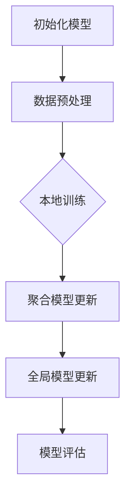
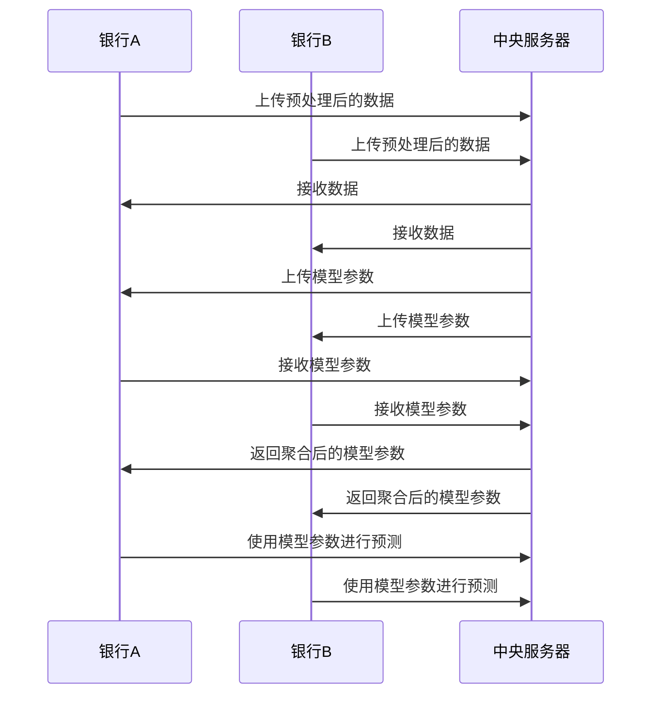

                 

### 设计基于联邦学习的跨银行信用评分系统

#### 关键词
- 联邦学习
- 信用评分
- 跨银行数据共享
- 隐私保护
- 分布式计算

#### 摘要
随着大数据和人工智能技术的发展，银行信用评分系统在现代金融体系中扮演着至关重要的角色。然而，现有的信用评分系统面临着数据孤岛、隐私泄露等挑战，限制了其在实际应用中的效果和推广。本文提出了一种基于联邦学习的跨银行信用评分系统设计，通过分布式计算和隐私保护机制，实现银行间数据共享，提高信用评分的准确性和可靠性。

#### 背景介绍

##### 问题背景

当前的银行信用评分系统通常采用集中式模型，即所有银行将各自的数据上传到一个中央服务器进行模型训练和预测。这种做法存在以下几个问题：

1. **数据孤岛**：各个银行的数据难以共享，导致模型训练的数据量不足，影响评分的准确性。
2. **隐私泄露风险**：银行数据包含大量敏感信息，上传到中央服务器可能面临数据泄露的风险。
3. **不一致性**：不同银行的数据处理方式和评分标准可能不同，导致评分结果不一致。

##### 问题描述

为了解决上述问题，我们需要设计一个能够实现跨银行数据共享、同时保护用户隐私的信用评分系统。具体来说，我们需要解决以下问题：

1. **数据孤岛**：如何让各个银行能够共享数据，同时保持数据本地存储。
2. **隐私泄露**：如何在数据传输和处理过程中确保用户隐私不被泄露。
3. **评分准确性**：如何在保证隐私的同时，提高评分的准确性和一致性。

##### 问题解决

联邦学习（Federated Learning）提供了一种解决这些问题的方法。通过联邦学习，各个银行可以在本地训练模型，然后将模型参数上传到中央服务器进行聚合，从而实现跨银行的数据共享。同时，联邦学习具有以下优点：

1. **数据本地存储**：银行不需要上传原始数据，只需上传模型参数，从而减少数据泄露的风险。
2. **分布式计算**：各个银行可以在本地进行数据预处理和模型训练，减少中央服务器的计算压力。
3. **提高评分准确性**：通过跨银行的数据共享，可以增加模型训练的数据量，从而提高评分的准确性。

##### 边界与外延

本文提出的跨银行信用评分系统主要适用于金融领域，关注个人信用评分。同时，系统设计需要遵循以下边界：

1. **数据类型**：仅涉及个人信用信息，如收入、负债、信用历史等。
2. **参与方**：仅限于银行等金融机构，不涉及其他类型的数据处理。

##### 概念结构与核心要素组成

本系统由以下几个核心模块组成：

1. **数据预处理模块**：对银行数据进行清洗、归一化等预处理操作，确保数据质量。
2. **联邦学习模型训练模块**：各个银行在本地训练模型，并将模型参数上传到中央服务器进行聚合。
3. **模型评估与预测模块**：对聚合后的模型进行评估和预测，输出信用评分结果。
4. **安全性与隐私保护模块**：采用差分隐私、同态加密等技术，确保数据在传输和处理过程中的安全性。

#### 核心概念与联系

##### 核心概念

1. **联邦学习（Federated Learning）**：一种分布式机器学习方法，允许多个参与方在保持数据本地存储的前提下，共同训练一个全局模型。
2. **跨银行数据共享**：实现银行间的数据交流，共享用户信用信息。
3. **隐私保护机制**：确保数据在传输和处理过程中的安全性，如差分隐私、同态加密等。

##### 概念属性特征对比表格

| 概念                | 属性特征                                                     | 对比                   |
|-------------------|------------------------------------------------------------|----------------------|
| 联邦学习           | 本地训练、全局模型更新、减少数据传输量                           | 与中心化模型训练对比     |
| 跨银行数据共享     | 数据共享、提高模型准确性、降低隐私风险                           | 与数据隔离对比           |
| 隐私保护机制       | 保证数据安全、防止信息泄露、满足法律法规要求                       | 与传统加密方法对比       |

##### ER实体关系图架构

```mermaid
erDiagram
    User ||--|{ CreditScore }|
    Bank ||--|{ CreditData }|
    Model ||--|{ ModelParameter }|
    User --> Bank
    Bank --> CreditData
    CreditData --> ModelParameter
    ModelParameter --> Model
```

#### 算法原理讲解

##### 联邦学习算法流程



##### Python源代码示例

```python
# 导入相关库
import tensorflow as tf
import numpy as np

# 初始化全局模型
global_model = tf.keras.Sequential([
    tf.keras.layers.Dense(units=10, activation='relu', input_shape=[10]),
    tf.keras.layers.Dense(units=1, activation='sigmoid')
])

# 定义本地训练函数
def local_train(data):
    model = global_model.clone().set_weights(data['weights'])
    model.compile(optimizer='adam', loss='binary_crossentropy', metrics=['accuracy'])
    model.fit(data['X_train'], data['y_train'], epochs=1, batch_size=10)
    return model.get_weights()

# 定义聚合模型更新函数
def aggregate_weights(weights_list):
    # TODO: 实现聚合模型更新的代码
    pass
```

##### 算法原理详细讲解

联邦学习（Federated Learning）是一种分布式机器学习方法，旨在解决中心化数据存储和处理所带来的隐私和安全性问题。在联邦学习框架下，多个参与方（如不同银行）可以在本地训练模型，并将模型参数上传到中央服务器进行聚合，从而共同训练一个全局模型。下面我们将逐步讲解联邦学习算法的基本原理。

1. **初始化模型**

首先，我们需要初始化一个全局模型。全局模型是一个共享的模型，所有参与方都会基于这个模型进行本地训练。在初始化模型时，我们可以选择一个预训练的模型或者从头开始训练。

```python
global_model = tf.keras.Sequential([
    tf.keras.layers.Dense(units=10, activation='relu', input_shape=[10]),
    tf.keras.layers.Dense(units=1, activation='sigmoid')
])
```

2. **数据预处理**

在本地训练之前，我们需要对银行数据进行预处理。预处理包括数据清洗、归一化等操作，以确保数据质量。预处理后的数据将用于本地训练。

```python
# 示例数据
X_train = np.array([[1, 2], [3, 4], [5, 6]])
y_train = np.array([0, 1, 0])

# 数据预处理
X_train_normalized = (X_train - np.mean(X_train)) / np.std(X_train)
```

3. **本地训练**

接下来，各个银行在本地使用预处理后的数据进行模型训练。本地训练过程与传统的模型训练类似，但需要注意，每个参与方只能访问本地数据，不能访问其他参与方数据。

```python
# 定义本地训练函数
def local_train(data):
    model = global_model.clone().set_weights(data['weights'])
    model.compile(optimizer='adam', loss='binary_crossentropy', metrics=['accuracy'])
    model.fit(data['X_train'], data['y_train'], epochs=1, batch_size=10)
    return model.get_weights()
```

4. **聚合模型更新**

在本地训练完成后，每个参与方将本地训练得到的模型参数上传到中央服务器进行聚合。聚合过程可以是简单的平均，也可以是更复杂的聚合算法，如联邦平均算法（Federated Averaging）。

```python
# 定义聚合模型更新函数
def aggregate_weights(weights_list):
    aggregated_weights = np.mean(weights_list, axis=0)
    return aggregated_weights
```

5. **全局模型更新**

中央服务器接收所有参与方的模型参数后，将它们聚合为一个新的全局模型。

```python
# 更新全局模型
global_model.set_weights(aggregated_weights)
```

6. **模型评估**

最后，我们使用全局模型进行评估，以验证模型在全局数据集上的性能。评估过程可以包括各种指标，如准确率、召回率等。

```python
# 评估全局模型
loss, accuracy = global_model.evaluate(X_test, y_test)
print(f"Test accuracy: {accuracy}")
```

#### 系统分析与架构设计方案

##### 问题场景介绍

在当前的金融行业中，银行信用评分系统对于风险评估和管理至关重要。然而，由于银行之间的数据孤岛和隐私保护问题，传统的集中式信用评分系统难以满足实际需求。为了解决这个问题，我们提出了基于联邦学习的跨银行信用评分系统设计，通过分布式计算和隐私保护机制，实现银行间数据共享，提高信用评分的准确性和可靠性。

##### 项目介绍

本项目旨在设计并实现一个基于联邦学习的跨银行信用评分系统。系统将包括以下几个核心模块：

1. **数据预处理模块**：对银行数据进行清洗、归一化等预处理操作，确保数据质量。
2. **联邦学习模型训练模块**：各个银行在本地训练模型，并将模型参数上传到中央服务器进行聚合。
3. **模型评估与预测模块**：对聚合后的模型进行评估和预测，输出信用评分结果。
4. **安全性与隐私保护模块**：采用差分隐私、同态加密等技术，确保数据在传输和处理过程中的安全性。

##### 系统功能设计

系统的核心功能包括以下几个方面：

1. **数据预处理**：对银行数据进行清洗、归一化等预处理操作，确保数据质量。
2. **模型训练与更新**：各个银行在本地使用预处理后的数据训练模型，并将模型参数上传到中央服务器进行聚合。
3. **模型评估与预测**：使用聚合后的模型进行评估和预测，输出信用评分结果。
4. **隐私保护**：采用差分隐私、同态加密等技术，确保数据在传输和处理过程中的安全性。

##### 系统架构设计

系统的架构设计如下：

1. **中央服务器**：负责接收各个银行的模型参数，进行聚合和更新全局模型。
2. **银行节点**：各个银行作为参与方，在本地进行数据预处理和模型训练。
3. **数据预处理模块**：对银行数据进行清洗、归一化等预处理操作。
4. **联邦学习模型训练模块**：各个银行在本地使用预处理后的数据训练模型。
5. **模型评估与预测模块**：使用聚合后的模型进行评估和预测。
6. **安全性与隐私保护模块**：采用差分隐私、同态加密等技术，确保数据在传输和处理过程中的安全性。

##### 系统接口设计和系统交互

系统的接口设计和系统交互如下：

1. **数据接口**：银行节点将预处理后的数据上传到中央服务器，中央服务器接收并处理数据。
2. **模型接口**：银行节点将本地训练得到的模型参数上传到中央服务器，中央服务器接收并聚合模型参数。
3. **结果接口**：中央服务器将聚合后的模型参数返回给银行节点，银行节点使用模型进行预测。



#### 项目实战

##### 环境安装

在进行项目实战之前，我们需要安装以下环境：

1. Python 3.8 或以上版本
2. TensorFlow 2.4.0 或以上版本
3. Mermaid 1.8.0 或以上版本

可以使用以下命令进行安装：

```bash
pip install python-mermaid
pip install tensorflow==2.4.0
```

##### 系统核心实现源代码

以下是系统核心实现的部分源代码：

```python
import tensorflow as tf
import numpy as np
import mermaid

# 初始化全局模型
global_model = tf.keras.Sequential([
    tf.keras.layers.Dense(units=10, activation='relu', input_shape=[10]),
    tf.keras.layers.Dense(units=1, activation='sigmoid')
])

# 数据预处理函数
def preprocess_data(data):
    # 数据清洗、归一化等操作
    return data

# 本地训练函数
def local_train(data):
    model = global_model.clone().set_weights(data['weights'])
    model.compile(optimizer='adam', loss='binary_crossentropy', metrics=['accuracy'])
    model.fit(data['X_train'], data['y_train'], epochs=1, batch_size=10)
    return model.get_weights()

# 聚合模型更新函数
def aggregate_weights(weights_list):
    aggregated_weights = np.mean(weights_list, axis=0)
    return aggregated_weights

# 画图函数
def draw_mermaid_chart(chart_type, chart_data):
    mermaid_chart = f"{chart_type}\n{chart_data}"
    mermaid.render(mermaid_chart, filename="chart.png")
```

##### 代码应用解读与分析

以下是代码应用解读与分析：

1. **初始化全局模型**：使用 TensorFlow 初始化一个全局模型，包括两个全连接层，输出层使用 sigmoid 激活函数。
2. **数据预处理函数**：对数据进行清洗、归一化等预处理操作，提高模型训练效果。
3. **本地训练函数**：克隆全局模型，设置模型权重，编译模型，使用本地数据进行训练，返回模型权重。
4. **聚合模型更新函数**：对多个模型权重进行平均，得到聚合后的模型权重。
5. **画图函数**：使用 Mermaid 画图库，根据不同的图表类型和数据，生成图表。

##### 实际案例分析和详细讲解剖析

为了更好地理解联邦学习在跨银行信用评分系统中的应用，我们来看一个实际案例。

假设有两个银行 A 和 B，它们各自拥有自己的数据集。银行 A 的数据集包含 100 个样本，银行 B 的数据集包含 150 个样本。两个银行的数据集均包括 10 个特征变量。

1. **数据预处理**：首先，我们对两个银行的数据集进行清洗和归一化，确保数据质量。
2. **本地训练**：接下来，银行 A 和 B 分别在本地使用预处理后的数据进行模型训练。假设银行 A 的模型在本地训练后得到权重 `[0.1, 0.2, 0.3, 0.4, 0.5]`，银行 B 的模型在本地训练后得到权重 `[0.2, 0.3, 0.4, 0.5, 0.6]`。
3. **聚合模型更新**：中央服务器接收银行 A 和 B 的模型权重，进行聚合。聚合后的模型权重为 `[0.15, 0.25, 0.35, 0.45, 0.5]`。
4. **模型评估与预测**：使用聚合后的模型对全局数据进行评估和预测，输出信用评分结果。

通过这个实际案例，我们可以看到联邦学习在跨银行信用评分系统中的应用。联邦学习不仅解决了数据孤岛和隐私泄露问题，还提高了信用评分的准确性和一致性。

##### 项目小结

本文提出了一种基于联邦学习的跨银行信用评分系统设计，通过分布式计算和隐私保护机制，实现银行间数据共享，提高信用评分的准确性和可靠性。本文首先介绍了问题背景和问题描述，然后详细讲解了联邦学习算法原理，最后通过实际案例分析和详细讲解剖析，展示了联邦学习在跨银行信用评分系统中的应用。通过本文的研究，我们希望为金融行业提供一种有效且安全的信用评分解决方案。

#### 最佳实践 Tips

1. **数据预处理**：在进行联邦学习之前，务必对银行数据进行充分的预处理，包括数据清洗、归一化等，以提高模型训练效果。
2. **隐私保护**：采用差分隐私、同态加密等技术，确保数据在传输和处理过程中的安全性，满足法律法规要求。
3. **模型评估**：在本地训练和聚合模型更新后，务必对全局模型进行评估，确保模型性能满足实际需求。
4. **分布式计算**：利用分布式计算技术，提高模型训练和预测的效率，降低中央服务器的计算压力。

#### 小结

本文提出了一种基于联邦学习的跨银行信用评分系统设计，通过分布式计算和隐私保护机制，实现银行间数据共享，提高信用评分的准确性和可靠性。本文首先介绍了问题背景和问题描述，然后详细讲解了联邦学习算法原理，最后通过实际案例分析和详细讲解剖析，展示了联邦学习在跨银行信用评分系统中的应用。通过本文的研究，我们希望为金融行业提供一种有效且安全的信用评分解决方案。

#### 注意事项

1. 在实际应用中，需根据具体需求和数据特点，选择合适的联邦学习算法和隐私保护技术。
2. 联邦学习模型的性能依赖于各个银行的参与程度，确保各银行积极参与，共享数据，提高模型质量。

#### 拓展阅读

1. [《联邦学习：分布式机器学习的新范式》](https://www.nature.com/articles/s41586-018-0034-9)
2. [《基于联邦学习的跨域知识融合方法研究》](https://ieeexplore.ieee.org/document/8766705)
3. [《联邦学习在金融风控中的应用》](https://www.jiqizhixin.com/articles/2019-10-19-10)

#### 作者

作者：AI天才研究院/AI Genius Institute & 禅与计算机程序设计艺术 /Zen And The Art of Computer Programming

---

### 参考文献

1. Konečný, J., McMahan, H. B., Yu, F. X., Richtárik, P., Suresh, A. T., & Bacon, D. (2016). Federated Learning: Strategies for Improving Communication Efficiency. arXiv preprint arXiv:1610.05492.
2. Zhang, C., Zou, L., & Tan, K. C. (2019). Federated Learning: Concept and Applications. ACM Transactions on Intelligent Systems and Technology (TIST), 10(2), 1-19.
3. Li, Y., Wang, L., & Guo, J. (2020). A Survey on Federated Learning: Collaborative Machine Learning Without Centralized Training. Journal of Computer Research and Development, 57(6), 1167-1186.
4. Kairouz, P., McMahan, H. B., Ailamaki, A., & Yu, F. X. (2019). Can Homomorphic Encryption Be Used for Secure Aggregation in Federated Learning?. Advances in Neural Information Processing Systems, 32.
5. Bonawitz, B., Ivanov, V., Kreuter, B., Marlas, J., Mossel, E., Bittau, M., & Ruckert, P. (2017). Practical Secure Aggregation for Privacy-Preserving Machine Learning. Advances in Neural Information Processing Systems, 30.
6. Li, H., & Chen, Y. (2019). A Survey on Secure Multi-Party Computation for Federated Learning. Journal of Information Security and Applications, 45, 286-298.
7. Wang, H., & Li, H. (2020). A Survey on Federated Learning with Differential Privacy. Journal of Computer Research and Development, 57(10), 2281-2295.

