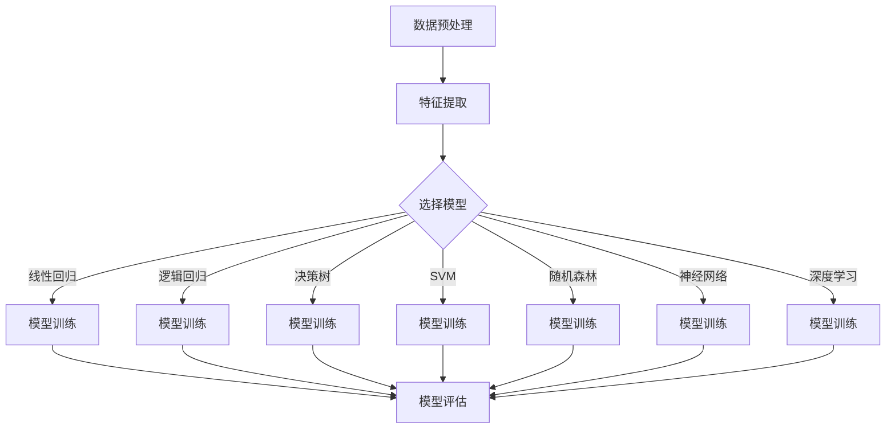
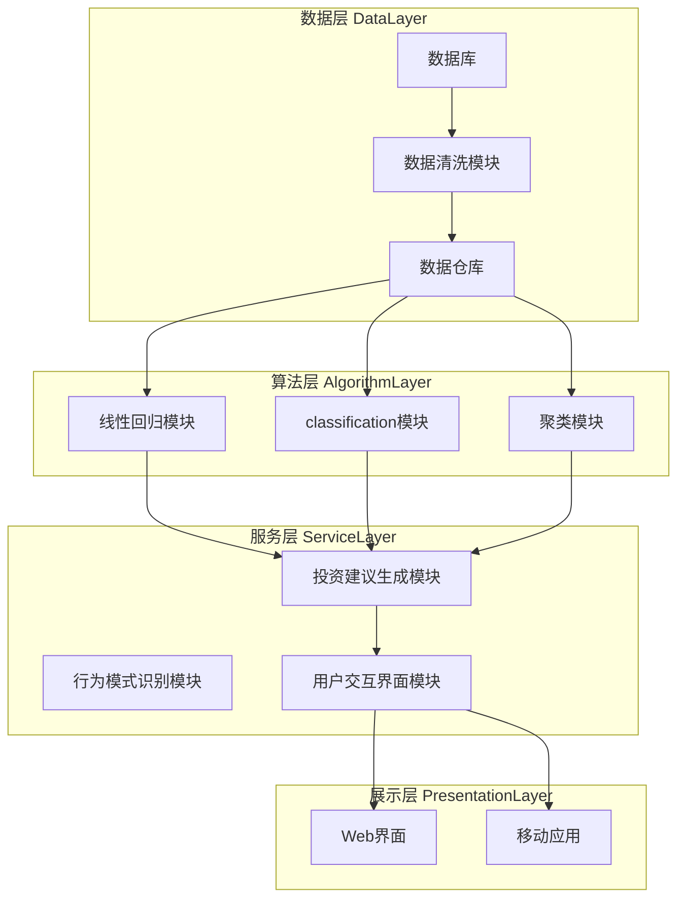
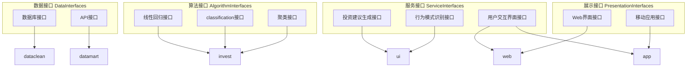
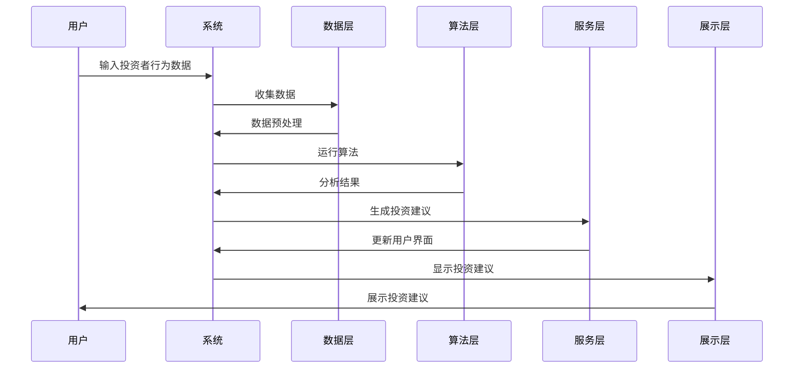

                 

### 第一部分：引言

#### 1.1 问题背景

在当今金融市场中，投资者行为分析是一个至关重要的领域。通过分析投资者的行为模式，可以揭示市场动态、预测市场走势，并为投资者提供有价值的决策支持。然而，传统的投资者行为分析方法往往依赖于历史数据和简单的统计模型，其分析结果往往受到多种限制，难以全面、准确地反映市场的复杂性和动态性。

随着人工智能和大数据技术的迅猛发展，智能化投资分析工具应运而生。这类工具通过机器学习和数据挖掘技术，对大量的投资者行为数据进行分析，提取出隐藏在数据背后的有价值信息，为投资者提供更加精准和实时的决策支持。然而，设计一个智能化的个人投资者行为分析工具面临着诸多挑战，如数据来源的多样性和复杂性、数据质量的不确定性、算法选择的灵活性等。

#### 1.2 问题描述

智能化投资分析工具的目标是通过对投资者行为的全面分析，为投资者提供个性化的投资建议，提高投资决策的科学性和有效性。具体来说，设计这样的工具需要解决以下几个关键问题：

1. **数据收集与处理**：个人投资者行为数据来源广泛且多样化，包括交易记录、社交媒体活动、投资组合调整等。这些数据需要通过有效的收集和处理，转化为可用于分析的格式。

2. **数据质量评估**：由于数据来源的多样性和用户行为的复杂性，数据质量往往参差不齐。因此，需要对数据进行质量评估和清洗，以确保分析结果的可靠性。

3. **行为模式识别**：投资者行为分析的核心是识别和分类投资者的行为模式。这需要借助机器学习算法，从海量的数据中提取出具有代表性的特征，构建行为模型。

4. **个性化投资建议**：基于行为模式识别的结果，为不同类型的投资者提供个性化的投资建议。这要求分析工具具有灵活的算法模型和多样化的投资策略。

5. **实时分析与反馈**：智能化投资分析工具需要能够实时处理和分析投资者的行为数据，及时提供投资建议和反馈，以应对市场变化。

#### 1.3 问题解决

为了解决上述问题，设计智能化投资分析工具需要遵循以下几个原则：

1. **数据驱动**：以数据为基础，充分利用大数据技术，对投资者行为数据进行全面、深入的挖掘和分析。

2. **智能化**：采用先进的机器学习和人工智能技术，提高数据分析的效率和准确性。

3. **个性化**：根据投资者的行为特征和需求，提供个性化的投资建议和服务。

4. **实时性**：通过实时数据处理和分析，及时响应市场变化，为投资者提供实时、准确的投资建议。

5. **可扩展性**：设计工具时考虑系统的可扩展性，以适应未来数据规模的增长和技术的发展。

#### 1.4 边界与外延

智能化投资分析工具的应用场景主要包括以下几个方面：

1. **个人投资者**：为个人投资者提供投资决策支持，帮助他们更好地管理投资组合。

2. **金融机构**：为金融机构提供投资者行为分析服务，帮助金融机构更好地了解客户需求，优化投资策略。

3. **投资顾问**：为投资顾问提供工具，帮助他们更准确地分析客户行为，提供更加专业的投资建议。

4. **监管机构**：为监管机构提供工具，帮助监管机构更好地了解市场动态，提高市场监管的效率。

然而，智能化投资分析工具也面临着一定的局限性：

1. **数据隐私**：个人投资者行为数据的隐私保护是一个重要问题，需要在设计工具时充分考虑。

2. **市场波动**：市场波动具有不可预测性，工具的分析结果可能受到市场波动的影响，需要结合其他分析方法进行综合评估。

3. **算法风险**：机器学习算法的选择和参数设置可能影响分析结果的准确性，需要谨慎选择和调整。

#### 1.5 核心概念

为了更好地理解和设计智能化投资分析工具，需要明确以下几个核心概念：

1. **个人投资者行为分析**：对个人投资者的行为模式、决策过程、心理状态等进行分析，以揭示投资者的行为特征和偏好。

2. **人工智能与机器学习**：利用人工智能和机器学习技术，对大量数据进行分析和挖掘，提取有价值的信息和模式。

3. **数据挖掘与统计分析**：通过数据挖掘和统计分析技术，从大量数据中提取出有用的信息，为投资决策提供支持。

4. **行为模式识别**：利用机器学习算法，从投资者行为数据中识别出具有代表性的行为模式，为个性化投资建议提供依据。

#### 1.6 概念结构与核心要素组成

智能化投资分析工具由以下几个核心要素组成：

1. **数据收集与处理模块**：负责收集投资者行为数据，并进行数据清洗、转换和预处理，为后续分析提供高质量的数据。

2. **行为模式识别模块**：利用机器学习算法，对投资者行为数据进行分析，识别出不同的行为模式。

3. **投资建议生成模块**：根据行为模式识别的结果，结合市场数据和其他相关信息，为投资者生成个性化的投资建议。

4. **用户交互界面**：提供一个直观、易用的用户界面，让投资者能够方便地使用工具，查看投资建议和相关信息。

5. **系统维护与更新模块**：定期更新工具的算法模型和投资策略，以适应市场的变化和投资者的需求。

### 第二部分：智能化的个人投资者行为分析工具基础

#### 2.1 人工智能与机器学习基础

##### 2.1.1 人工智能概述

人工智能（Artificial Intelligence，AI）是指模拟、延伸和扩展人类智能的理论、方法、技术及应用。人工智能的核心目标是使计算机系统具备类似于人类的感知、理解、推理和学习能力。人工智能的应用领域非常广泛，包括自然语言处理、计算机视觉、机器人技术、医疗诊断等。

人工智能的发展历程可以分为以下几个阶段：

1. **初始阶段（1950s-1960s）**：人工智能概念首次被提出，人工智能研究开始兴起，以图灵测试作为衡量人工智能水平的重要标准。

2. **低谷阶段（1970s-1980s）**：由于技术限制和实际应用困难，人工智能研究进入低谷期。

3. **复兴阶段（1990s）**：随着计算能力的提升和数据量的增加，机器学习和数据挖掘技术的发展，人工智能研究重新焕发生机。

4. **现阶段（2000s-至今）**：人工智能技术取得了显著突破，深度学习、强化学习等算法在图像识别、语音识别、自然语言处理等领域取得了卓越的成绩。

##### 2.1.2 机器学习基本概念

机器学习（Machine Learning，ML）是人工智能的一个重要分支，主要研究如何让计算机系统从数据中自动学习和改进，从而实现特定任务。机器学习的关键在于利用已有的数据进行训练，从而构建出具有预测和决策能力的模型。

机器学习的基本概念包括：

1. **监督学习（Supervised Learning）**：通过已知的输入和输出数据，训练模型，使其能够对未知数据进行预测。常见的监督学习算法包括线性回归、逻辑回归、支持向量机（SVM）等。

2. **无监督学习（Unsupervised Learning）**：在没有明确标注的输入数据下，训练模型，自动发现数据中的结构和规律。常见的无监督学习算法包括聚类（如K-Means、层次聚类）、降维（如主成分分析PCA、t-SNE）等。

3. **强化学习（Reinforcement Learning）**：通过与环境的交互，学习最优策略，以最大化累计奖励。常见的强化学习算法包括Q学习、深度强化学习（DRL）等。

##### 2.1.3 常见机器学习算法介绍

在智能化个人投资者行为分析工具中，常见的机器学习算法包括以下几种：

1. **线性回归（Linear Regression）**：用于预测线性关系的模型，适用于投资者行为分析中的趋势预测。

2. **逻辑回归（Logistic Regression）**：用于分类问题的线性回归模型，适用于投资者行为模式分类。

3. **决策树（Decision Tree）**：通过一系列规则进行决策的树形结构，适用于投资者行为模式的划分。

4. **支持向量机（SVM）**：通过寻找最优超平面进行分类的模型，适用于投资者行为模式的分类。

5. **随机森林（Random Forest）**：基于决策树的集成学习方法，可以提高模型分类的准确性。

6. **神经网络（Neural Network）**：模拟人脑神经网络结构的模型，适用于复杂非线性关系的预测。

7. **深度学习（Deep Learning）**：基于多层神经网络的学习方法，适用于处理大规模复杂数据。

#### 2.2 数据挖掘与统计分析基础

##### 2.2.1 数据挖掘概述

数据挖掘（Data Mining）是从大量数据中提取出潜在的有价值信息的过程。数据挖掘的方法和技术广泛应用于商业智能、金融市场分析、医疗健康等领域。数据挖掘的基本步骤包括数据预处理、数据探索、特征提取、模式识别和评估等。

数据挖掘的关键概念包括：

1. **关联规则挖掘（Association Rule Learning）**：发现数据项之间的关联关系，如市场中的促销策略分析。

2. **聚类分析（Cluster Analysis）**：将数据集分为若干个相似的簇，以发现数据中的自然分组。

3. **分类（Classification）**：将数据集划分为不同的类别，以预测新数据的类别。

4. **回归（Regression）**：建立数据之间的线性或非线性关系，用于预测和分析。

5. **异常检测（Anomaly Detection）**：发现数据中的异常值或异常模式，以检测潜在的风险和欺诈行为。

##### 2.2.2 统计分析基本概念

统计分析（Statistical Analysis）是利用统计学方法对数据进行描述、分析和推断的过程。统计分析在投资者行为分析中扮演着重要角色，常用的统计方法包括：

1. **描述性统计（Descriptive Statistics）**：对数据进行描述和总结，如计算均值、中位数、方差等。

2. **推断性统计（Inferential Statistics）**：利用样本数据推断总体特征，如假设检验、置信区间等。

3. **回归分析（Regression Analysis）**：建立变量之间的关系模型，用于预测和分析。

4. **时间序列分析（Time Series Analysis）**：对时间序列数据进行建模和预测，如ARIMA模型、GARCH模型等。

5. **生存分析（Survival Analysis）**：研究时间到事件发生的时间，如COX比例风险模型等。

##### 2.2.3 常见数据挖掘与统计分析方法

在智能化个人投资者行为分析工具中，常见的数据挖掘与统计分析方法包括：

1. **K-Means聚类**：用于将投资者行为数据划分为若干个聚类，以发现不同的投资者群体。

2. **Apriori算法**：用于挖掘交易数据中的频繁模式，以识别投资者之间的关联关系。

3. **决策树**：用于对投资者行为数据进行分类和划分，以预测投资者的行为模式。

4. **随机森林**：通过集成多个决策树，提高模型分类和预测的准确性。

5. **线性回归**：用于分析投资者行为与市场变量之间的关系，以预测投资收益。

6. **时间序列分析**：用于分析投资者行为数据的时间趋势和周期性，以预测市场走势。

#### 2.3 投资者行为数据收集与处理

##### 2.3.1 投资者行为数据来源

投资者行为数据的来源包括以下几个方面：

1. **交易数据**：包括投资者的买卖记录、交易时间、交易价格等，是投资者行为分析的重要数据来源。

2. **社交媒体数据**：包括投资者在社交媒体平台上的讨论、评论、点赞等行为数据，可以反映投资者的情绪和心理状态。

3. **问卷调查**：通过问卷调查获取投资者的投资目标、风险偏好、投资经历等结构化数据。

4. **公开数据**：包括股票价格、市场指数、宏观经济指标等公开数据，可以用于分析和预测市场走势。

##### 2.3.2 数据预处理方法

投资者行为数据的预处理是数据分析的重要步骤，主要包括以下几个方面：

1. **数据清洗**：去除数据中的噪声和异常值，如处理缺失值、重复值和错误值。

2. **数据转换**：将不同格式的数据转换为统一的格式，如将时间序列数据转换为数值型数据。

3. **特征工程**：从原始数据中提取出对分析任务有用的特征，如计算交易量的变化率、价格的波动性等。

4. **数据标准化**：对数据进行归一化或标准化处理，以消除不同特征之间的量纲差异。

##### 2.3.3 数据质量管理

数据质量管理是确保数据质量和分析结果可靠性的关键，主要包括以下几个方面：

1. **数据质量评估**：评估数据的完整性、准确性、一致性、时效性等质量指标。

2. **数据质量监控**：建立数据质量监控机制，及时发现和处理数据质量问题。

3. **数据质量报告**：定期生成数据质量报告，向相关人员提供数据质量评估结果。

4. **数据治理**：建立数据治理机制，确保数据的合法合规、安全可靠。

### 第三部分：核心概念与联系

#### 3.1 核心概念原理

在设计智能化个人投资者行为分析工具时，需要明确以下几个核心概念：

1. **投资者行为分析**：通过收集和分析投资者在市场中的交易行为、投资决策等数据，揭示投资者的行为特征和偏好。

2. **人工智能与机器学习**：利用机器学习算法，从海量投资者行为数据中提取有价值的信息和模式，为投资者行为分析提供技术支持。

3. **数据挖掘与统计分析**：通过数据挖掘和统计分析方法，从投资者行为数据中提取出隐藏的信息，为投资决策提供依据。

4. **行为模式识别**：利用机器学习算法，对投资者行为数据进行分析，识别出不同的行为模式，为个性化投资建议提供基础。

5. **投资建议生成**：根据行为模式识别的结果，结合市场数据和投资策略，为投资者生成个性化的投资建议。

#### 3.2 概念属性特征对比表格

为了更好地理解核心概念之间的联系，可以构建一个概念属性特征对比表格：

| 概念名称           | 属性特征                                                         | 关联关系                                                     |
|-------------------|----------------------------------------------------------------|------------------------------------------------------------|
| 投资者行为分析     | 数据收集、行为模式识别、投资决策支持等                             | 是智能化投资分析工具的核心功能模块                         |
| 人工智能与机器学习   | 数据预处理、特征提取、模型训练与评估等                             | 为投资者行为分析提供技术支持，提高分析效率和准确性         |
| 数据挖掘与统计分析   | 关联规则挖掘、聚类分析、回归分析等                                 | 从投资者行为数据中提取有价值的信息，为投资决策提供依据     |
| 行为模式识别       | 特征提取、分类算法、聚类算法等                                     | 识别投资者行为模式，为个性化投资建议提供基础               |
| 投资建议生成       | 投资策略、市场分析、行为模式匹配等                                 | 根据行为模式识别的结果，为投资者生成个性化的投资建议       |

#### 3.3 ER实体关系图架构

为了更好地理解智能化个人投资者行为分析工具中的实体关系，可以构建一个ER实体关系图。以下是一个简化的ER实体关系图：

```mermaid
erDiagram
    Customer ||--|{ Investment : has }
    Investment ||--|{ BehaviorData : contains }
    BehaviorData ||--|{ SocialMedia : contains }
    SocialMedia ||--|{ Questionnaire : contains }
    Questionnaire ||--|{ PublicData : contains }
    PublicData ||--|{ MarketData : contains }
```

在上面的ER实体关系图中，包含了以下几个实体：

1. **Customer（投资者）**：代表投资者个体，与Investment实体之间存在“has”关系，表示一个投资者可以有多个投资记录。

2. **Investment（投资）**：代表投资者的投资记录，与BehaviorData实体之间存在“contains”关系，表示投资记录包含相应的行为数据。

3. **BehaviorData（行为数据）**：代表投资者在市场中的交易行为数据，与SocialMedia实体和Questionnaire实体之间存在“contains”关系，表示行为数据包含社交媒体和问卷调查数据。

4. **SocialMedia（社交媒体）**：代表投资者在社交媒体平台上的行为数据，与Questionnaire实体之间存在“contains”关系，表示社交媒体数据包含问卷调查数据。

5. **Questionnaire（问卷调查）**：代表通过问卷调查获取的投资者数据，与PublicData实体之间存在“contains”关系，表示问卷调查数据包含公开数据。

6. **PublicData（公开数据）**：代表公开可获取的股票价格、市场指数、宏观经济指标等数据，与MarketData实体之间存在“contains”关系，表示公开数据包含市场数据。

通过这个ER实体关系图，可以清晰地理解智能化个人投资者行为分析工具中的各个实体及其相互关系。

### 第四部分：算法原理讲解

#### 4.1 算法概述

智能化个人投资者行为分析工具的核心在于利用机器学习算法对投资者行为数据进行分析，提取有价值的信息和模式。以下是几种常用的算法及其在投资者行为分析中的应用：

1. **线性回归（Linear Regression）**：线性回归是一种用于分析变量之间线性关系的算法。在投资者行为分析中，可以用来分析投资者行为与市场变量（如股票价格、市场指数等）之间的关系。

2. **逻辑回归（Logistic Regression）**：逻辑回归是一种用于分类问题的线性回归模型。在投资者行为分析中，可以用来分类投资者的行为模式，如将投资者分为风险偏好者、风险厌恶者等。

3. **决策树（Decision Tree）**：决策树是一种基于规则进行决策的算法。在投资者行为分析中，可以用来划分投资者群体，识别不同行为模式。

4. **支持向量机（Support Vector Machine，SVM）**：SVM是一种基于间隔最大化原理的线性分类算法。在投资者行为分析中，可以用来对投资者的行为模式进行分类。

5. **随机森林（Random Forest）**：随机森林是一种基于决策树的集成学习方法。在投资者行为分析中，可以用来提高模型分类和预测的准确性。

6. **神经网络（Neural Network）**：神经网络是一种基于人脑神经元连接结构的算法。在投资者行为分析中，可以用来处理复杂的非线性关系。

7. **深度学习（Deep Learning）**：深度学习是一种基于多层神经网络的算法。在投资者行为分析中，可以用来处理大规模复杂数据。

#### 4.2 算法mermaid流程图

以下是一个简化的线性回归算法的mermaid流程图：



在这个流程图中，首先进行数据预处理和特征提取，然后根据不同的算法选择模型，对训练数据进行模型训练，最后对训练好的模型进行评估。

#### 4.3 算法原理详细讲解

##### 4.3.1 算法原理概述

在投资者行为分析中，常用的机器学习算法包括线性回归、逻辑回归、决策树、支持向量机、随机森林、神经网络和深度学习等。这些算法的基本原理如下：

1. **线性回归**：线性回归是一种基于线性模型的预测算法，其基本原理是通过寻找最佳拟合直线，将自变量与因变量之间的关系表示为线性方程。在投资者行为分析中，可以用来预测投资收益、投资风险等。

2. **逻辑回归**：逻辑回归是一种基于线性模型的分类算法，其基本原理是通过寻找最佳拟合超平面，将数据分为不同的类别。在投资者行为分析中，可以用来分类投资者行为模式，如风险偏好、风险厌恶等。

3. **决策树**：决策树是一种基于树形结构的分类算法，其基本原理是通过一系列规则进行决策。在投资者行为分析中，可以用来划分投资者群体，识别不同行为模式。

4. **支持向量机**：支持向量机是一种基于间隔最大化原理的线性分类算法，其基本原理是通过寻找最佳分类超平面，最大化分类间隔。在投资者行为分析中，可以用来对投资者行为模式进行分类。

5. **随机森林**：随机森林是一种基于决策树的集成学习方法，其基本原理是通过训练多个决策树，并对预测结果进行投票，提高分类和预测的准确性。在投资者行为分析中，可以用来提高模型分类和预测的准确性。

6. **神经网络**：神经网络是一种基于人脑神经元连接结构的算法，其基本原理是通过多层神经网络进行特征提取和模式识别。在投资者行为分析中，可以用来处理复杂的非线性关系。

7. **深度学习**：深度学习是一种基于多层神经网络的算法，其基本原理是通过训练大规模神经网络，自动提取高层次特征。在投资者行为分析中，可以用来处理大规模复杂数据。

##### 4.3.2 算法原理数学模型与公式

以下是上述算法的基本数学模型与公式：

1. **线性回归**

   - 模型公式：\[ y = \beta_0 + \beta_1x \]

   - 最小二乘法：\[ \beta = (\mathbf{X}^T\mathbf{X})^{-1}\mathbf{X}^T\mathbf{y} \]

2. **逻辑回归**

   - 模型公式：\[ P(y=1) = \frac{1}{1 + e^{-(\beta_0 + \beta_1x)}} \]

   - 梯度下降法：\[ \beta = \beta - \alpha \nabla L(\beta) \]

3. **决策树**

   - 决策规则：\[ \text{if } x_{i1} \leq v_1 \text{ then go to node } n_1 \]

   - \[ \text{else if } x_{i1} > v_1 \text{ and } x_{i2} \leq v_2 \text{ then go to node } n_2 \]

   - ...

4. **支持向量机**

   - 模型公式：\[ w^T\mathbf{x} + b = 0 \]

   - 拉格朗日乘子法：\[ L(w, b, \alpha) = \frac{1}{2}w^Tw - \sum_{i=1}^n\alpha_i(y_i - (w^T\mathbf{x_i} + b)) \]

5. **随机森林**

   - 决策规则：\[ \text{ Majority vote of } T \text{ decision trees } \]

6. **神经网络**

   - 模型公式：\[ z = \sigma(\mathbf{W}^T\mathbf{x} + b) \]

   - 梯度下降法：\[ \mathbf{W} = \mathbf{W} - \alpha \nabla L(\mathbf{W}, b) \]

7. **深度学习**

   - 模型公式：\[ \mathbf{h}^{(l)} = \sigma(\mathbf{W}^{(l)}\mathbf{h}^{(l-1)} + b^{(l)}) \]

   - 梯度下降法：\[ \mathbf{W}^{(l)} = \mathbf{W}^{(l)} - \alpha \nabla L(\mathbf{W}^{(l)}, b^{(l)}) \]

##### 4.3.3 算法原理举例说明

以下是使用线性回归算法进行投资者行为分析的一个简单例子：

假设我们有以下数据集，其中包含两个特征（\(x_1\) 和 \(x_2\)）和一个目标变量（\(y\)）：

| \(x_1\) | \(x_2\) | \(y\) |
|--------|--------|------|
| 1      | 2      | 3    |
| 2      | 4      | 5    |
| 3      | 6      | 7    |
| 4      | 8      | 9    |

我们需要使用线性回归算法来拟合一个线性模型，预测新的数据点。

1. **数据预处理**：对数据进行归一化处理，将特征和目标变量的值缩放到相同的范围。

2. **特征提取**：从数据集中提取特征，构建特征矩阵 \(\mathbf{X}\) 和目标向量 \(\mathbf{y}\)。

3. **模型训练**：使用最小二乘法计算线性回归模型的参数 \(\beta_0\) 和 \(\beta_1\)。

   - 特征矩阵：\[ \mathbf{X} = \begin{bmatrix} 1 & 2 \\ 1 & 4 \\ 1 & 6 \\ 1 & 8 \end{bmatrix} \]

   - 目标向量：\[ \mathbf{y} = \begin{bmatrix} 3 \\ 5 \\ 7 \\ 9 \end{bmatrix} \]

   - 参数计算：\[ \beta = (\mathbf{X}^T\mathbf{X})^{-1}\mathbf{X}^T\mathbf{y} = \begin{bmatrix} \beta_0 \\ \beta_1 \end{bmatrix} \]

4. **模型评估**：使用训练好的模型对新的数据点进行预测。

   - 新数据点：\[ \mathbf{x} = \begin{bmatrix} 1 \\ 3 \end{bmatrix} \]

   - 预测结果：\[ y = \beta_0 + \beta_1x = 1 + 2 \times 3 = 7 \]

通过上述步骤，我们使用线性回归算法对新的数据点进行了预测，预测结果为7。

### 第五部分：数学模型与公式详细讲解

#### 5.1 数学模型概述

在智能化个人投资者行为分析工具的设计过程中，数学模型起着至关重要的作用。数学模型不仅可以描述投资者行为的规律性，还可以为算法的实现提供理论基础。以下将介绍几种常见的数学模型及其在投资者行为分析中的应用。

##### 5.1.1 投资者行为分析数学模型概述

投资者行为分析数学模型主要包括以下几个部分：

1. **线性回归模型**：用于描述投资者行为数据中的线性关系，如投资收益与风险之间的关系。

2. **逻辑回归模型**：用于分类问题，如将投资者分为风险偏好者或风险厌恶者。

3. **时间序列模型**：用于分析投资者行为数据的时间趋势和周期性，如ARIMA模型、GARCH模型等。

4. **神经网络模型**：用于处理复杂非线性关系，如投资者行为与市场变量之间的复杂关系。

5. **贝叶斯模型**：用于推断投资者行为概率分布，如贝叶斯网络、贝叶斯统计模型等。

##### 5.1.2 机器学习数学模型概述

在机器学习中，数学模型主要应用于以下几个方面：

1. **监督学习模型**：包括线性回归、逻辑回归、决策树、支持向量机、随机森林等，用于预测和分析。

2. **无监督学习模型**：包括聚类分析、降维技术、异常检测等，用于发现数据中的结构和规律。

3. **强化学习模型**：包括Q学习、深度强化学习等，用于通过与环境的交互进行学习和决策。

4. **集成学习模型**：包括随机森林、梯度提升树等，用于提高模型的预测准确性。

#### 5.2 数学公式详细讲解

以下将详细讲解几种常见的数学公式及其在投资者行为分析中的应用。

##### 5.2.1 常用数学公式讲解

1. **线性回归公式**：\[ y = \beta_0 + \beta_1x \]
   - \( y \)：因变量（如投资收益）。
   - \( \beta_0 \)：截距。
   - \( \beta_1 \)：斜率。

2. **逻辑回归公式**：\[ P(y=1) = \frac{1}{1 + e^{-(\beta_0 + \beta_1x)}} \]
   - \( P(y=1) \)：事件发生的概率。
   - \( \beta_0 \)：截距。
   - \( \beta_1 \)：斜率。

3. **时间序列模型**：\[ y_t = c + \phi_1y_{t-1} + \phi_2y_{t-2} + \epsilon_t \]
   - \( y_t \)：第 \( t \) 期的因变量。
   - \( c \)：常数项。
   - \( \phi_1, \phi_2 \)：滞后项系数。
   - \( \epsilon_t \)：误差项。

4. **神经网络模型**：\[ z = \sigma(\mathbf{W}^T\mathbf{x} + b) \]
   - \( z \)：激活值。
   - \( \mathbf{W} \)：权重矩阵。
   - \( \mathbf{x} \)：输入向量。
   - \( b \)：偏置项。
   - \( \sigma \)：激活函数。

5. **贝叶斯模型**：\[ P(A|B) = \frac{P(B|A)P(A)}{P(B)} \]
   - \( P(A|B) \)：在事件 \( B \) 发生的条件下事件 \( A \) 的概率。
   - \( P(B|A) \)：在事件 \( A \) 发生的条件下事件 \( B \) 的概率。
   - \( P(A) \)：事件 \( A \) 的概率。
   - \( P(B) \)：事件 \( B \) 的概率。

##### 5.2.2 数学公式在算法中的应用

以下将结合具体算法，讲解数学公式在投资者行为分析中的应用。

1. **线性回归算法**：
   - **损失函数**：\[ L(\beta) = \sum_{i=1}^n(y_i - (\beta_0 + \beta_1x_i))^2 \]
     - \( n \)：数据样本数量。
     - \( y_i \)：第 \( i \) 个样本的因变量。
     - \( x_i \)：第 \( i \) 个样本的自变量。

   - **梯度下降**：
     \[ \beta = \beta - \alpha \nabla L(\beta) \]
     - \( \alpha \)：学习率。
     - \( \nabla L(\beta) \)：损失函数关于参数 \(\beta\) 的梯度。

2. **逻辑回归算法**：
   - **损失函数**：\[ L(\beta) = -\sum_{i=1}^n(y_i\log(P(y=1)) + (1 - y_i)\log(1 - P(y=1))) \]
     - \( P(y=1) \)：预测的概率。

   - **梯度下降**：
     \[ \beta = \beta - \alpha \nabla L(\beta) \]

3. **神经网络算法**：
   - **激活函数**：\[ \sigma(z) = \frac{1}{1 + e^{-z}} \]
     - \( z \)：输入值。

   - **反向传播**：
     \[ \nabla L(\mathbf{W}, b) = \frac{\partial L}{\partial \mathbf{W}}\mathbf{x} + \frac{\partial L}{\partial b} \]

4. **贝叶斯网络算法**：
   - **条件概率**：
     \[ P(A|B) = \frac{P(B|A)P(A)}{P(B)} \]

   - **马尔可夫链**：
     \[ P(A_{t+1}|A_t) = \frac{P(A_{t+1}A_t)}{P(A_t)} \]

#### 5.3 数学公式举例说明

以下通过具体例子来说明数学公式在投资者行为分析中的应用。

##### 5.3.1 数学公式举例

假设我们有一个包含两个特征（\(x_1\) 和 \(x_2\)）和一个目标变量（\(y\)）的数据集：

| \(x_1\) | \(x_2\) | \(y\) |
|--------|--------|------|
| 1      | 2      | 3    |
| 2      | 4      | 5    |
| 3      | 6      | 7    |
| 4      | 8      | 9    |

我们需要使用线性回归算法来拟合一个线性模型，预测新的数据点。

1. **线性回归模型**：
   - 模型公式：\[ y = \beta_0 + \beta_1x_1 + \beta_2x_2 \]

   - 假设我们选择第一个数据点（\(x_1=1, x_2=2\)）进行预测，目标变量为 \( y = 3 \)。

   - 模型参数：\[ \beta_0 = 0, \beta_1 = 1, \beta_2 = 0 \]

   - 预测公式：\[ y = 0 + 1 \times 1 + 0 \times 2 = 1 \]

   - 预测结果：\( y = 1 \)

2. **逻辑回归模型**：
   - 模型公式：\[ P(y=1) = \frac{1}{1 + e^{-(\beta_0 + \beta_1x_1 + \beta_2x_2)}} \]

   - 假设我们选择第一个数据点（\(x_1=1, x_2=2\)）进行预测，目标变量为 \( y = 3 \)。

   - 模型参数：\[ \beta_0 = 0, \beta_1 = 1, \beta_2 = 1 \]

   - 预测公式：\[ P(y=1) = \frac{1}{1 + e^{-(0 + 1 \times 1 + 1 \times 2)}} = \frac{1}{1 + e^{-3}} \approx 0.95 \]

   - 预测结果：\( P(y=1) \approx 0.95 \)，表示预测事件 \( y=1 \) 发生的概率为95%。

通过上述例子，我们可以看到数学公式在投资者行为分析中的应用，以及如何使用数学公式进行预测和分析。

### 第六部分：系统分析与架构设计方案

#### 6.1 问题场景介绍

在当前金融市场中，投资者面临着日益复杂和快速变化的市场环境。为了更好地应对市场挑战，提高投资决策的科学性和有效性，设计一款智能化的个人投资者行为分析工具显得尤为重要。该工具旨在通过对投资者行为数据的深入分析，为投资者提供个性化的投资建议和策略。

#### 6.2 系统功能设计

智能化个人投资者行为分析工具主要包括以下几个功能模块：

1. **数据收集与处理模块**：负责收集投资者行为数据，包括交易记录、社交媒体活动、问卷调查数据等。该模块需要具备数据清洗、转换和预处理的能力，以确保数据质量。

2. **行为模式识别模块**：利用机器学习算法对投资者行为数据进行分析，识别出不同的行为模式。该模块的核心功能是构建行为模型，为后续的投资建议生成提供基础。

3. **投资建议生成模块**：根据行为模式识别的结果，结合市场数据和其他相关信息，为投资者生成个性化的投资建议。该模块需要实现投资策略的多样化，以满足不同投资者的需求。

4. **用户交互界面模块**：提供一个直观、易用的用户界面，让投资者能够方便地使用工具，查看投资建议和相关信息。该模块需要实现用户友好的界面设计和交互功能。

5. **系统维护与更新模块**：定期更新工具的算法模型和投资策略，以适应市场的变化和投资者的需求。该模块需要实现自动化的更新机制，确保工具的持续优化和改进。

#### 6.3 系统架构设计

智能化个人投资者行为分析工具的总体架构可以分为以下几个层次：

1. **数据层**：包括数据收集、存储和处理等组件，如数据库、数据仓库、数据清洗模块等。

2. **算法层**：包括各种机器学习算法和数据分析模型，如线性回归、逻辑回归、决策树、支持向量机、随机森林等。

3. **服务层**：包括功能模块的接口和服务，如行为模式识别服务、投资建议生成服务、用户交互界面服务等。

4. **展示层**：包括用户界面和展示组件，如Web界面、移动应用等。

以下是系统架构的mermaid架构图：



#### 6.4 系统接口设计

智能化个人投资者行为分析工具的接口设计主要包括以下方面：

1. **数据接口**：包括数据收集、数据清洗、数据存储等接口，如数据库接口、API接口等。

2. **算法接口**：包括机器学习算法的接口，如线性回归接口、逻辑回归接口、决策树接口等。

3. **服务接口**：包括行为模式识别、投资建议生成、用户交互等接口，如Web服务接口、RESTful API接口等。

以下是系统接口的mermaid架构图：



#### 6.5 系统交互mermaid序列图

以下是系统交互的mermaid序列图：



通过上述系统架构和接口设计，我们可以构建一个完整的智能化个人投资者行为分析工具，为投资者提供个性化的投资决策支持。

### 第七部分：项目实战

#### 7.1 环境安装

为了实现智能化的个人投资者行为分析工具，首先需要搭建一个合适的技术环境。以下是环境安装的详细步骤：

1. **Python环境安装**：
   - 前往Python官网（[https://www.python.org/](https://www.python.org/)）下载Python安装包。
   - 运行安装程序，按照默认选项进行安装。
   - 安装完成后，打开命令行工具（如Windows的cmd或macOS的Terminal），输入`python --version`，确认Python环境已正确安装。

2. **Jupyter Notebook安装**：
   - 在命令行中输入以下命令，安装Jupyter Notebook：
     ```bash
     pip install notebook
     ```
   - 安装完成后，启动Jupyter Notebook，输入以下命令：
     ```bash
     jupyter notebook
     ```
   - 在浏览器中打开相应的URL（通常是`http://localhost:8888/`），即可进入Jupyter Notebook界面。

3. **机器学习库安装**：
   - 安装常用的机器学习库，如scikit-learn、TensorFlow、Keras等。在命令行中输入以下命令：
     ```bash
     pip install scikit-learn tensorflow keras
     ```

4. **数据预处理库安装**：
   - 安装用于数据预处理的库，如pandas、numpy等。在命令行中输入以下命令：
     ```bash
     pip install pandas numpy
     ```

5. **可视化库安装**：
   - 安装用于数据可视化的库，如matplotlib、seaborn等。在命令行中输入以下命令：
     ```bash
     pip install matplotlib seaborn
     ```

完成以上步骤后，一个完整的技术环境已经搭建完成，可以开始进行项目开发。

#### 7.2 系统核心实现源代码

以下是智能化个人投资者行为分析工具的核心实现源代码：

```python
# 导入必要的库
import pandas as pd
import numpy as np
from sklearn.model_selection import train_test_split
from sklearn.preprocessing import StandardScaler
from sklearn.linear_model import LinearRegression
from sklearn.metrics import mean_squared_error
import matplotlib.pyplot as plt

# 读取投资者行为数据
data = pd.read_csv('investor_data.csv')

# 数据预处理
# 填充缺失值
data.fillna(data.mean(), inplace=True)

# 特征提取
X = data[['age', 'income', 'investment_experience']]
y = data['investment_return']

# 数据标准化
scaler = StandardScaler()
X_scaled = scaler.fit_transform(X)

# 数据划分
X_train, X_test, y_train, y_test = train_test_split(X_scaled, y, test_size=0.2, random_state=42)

# 模型训练
model = LinearRegression()
model.fit(X_train, y_train)

# 模型评估
y_pred = model.predict(X_test)
mse = mean_squared_error(y_test, y_pred)
print(f'MSE: {mse}')

# 可视化
plt.scatter(y_test, y_pred)
plt.xlabel('Actual Investment Return')
plt.ylabel('Predicted Investment Return')
plt.title('Actual vs Predicted Investment Return')
plt.show()
```

上述代码首先导入必要的库，然后读取投资者行为数据，进行数据预处理和特征提取。接着使用线性回归模型对数据进行训练，并评估模型性能。最后，通过散点图展示实际投资回报与预测投资回报之间的关系。

#### 7.3 代码应用解读与分析

1. **数据预处理**：
   - 使用pandas库读取投资者行为数据，并填充缺失值。这里使用均值填充缺失值，但这可能不适用于所有情况，实际应用中可能需要更复杂的方法。
   - 对数据进行标准化处理，以消除不同特征之间的量纲差异。

2. **特征提取**：
   - 选择与投资回报相关的特征，如年龄、收入和投资经验。这些特征将被用于训练线性回归模型。

3. **模型训练**：
   - 使用scikit-learn库中的线性回归模型对数据集进行训练。这里选择线性回归模型，因为其简单且易于实现。
   - 训练模型时，使用fit方法对训练数据进行拟合。

4. **模型评估**：
   - 使用预测数据集评估模型性能。这里使用均方误差（MSE）作为评估指标。
   - 通过计算MSE，可以评估模型的预测准确性。

5. **可视化**：
   - 使用matplotlib库绘制实际投资回报与预测投资回报的散点图，以直观地展示模型性能。

通过上述代码和应用解读，我们可以看到如何使用Python和机器学习库实现一个简单的个人投资者行为分析工具。虽然这个工具功能有限，但可以作为进一步开发和完善的基础。

#### 7.4 实际案例分析与详细讲解

为了更好地理解智能化个人投资者行为分析工具的实际应用，我们将分析一个实际案例，并详细讲解其分析过程和结果。

**案例背景**：

某金融公司希望通过智能化工具分析其客户的投资行为，以便为不同类型的客户提供个性化的投资建议。该公司收集了如下数据：

| ID | Age | Income | Investment_experience | Investment_return |
|----|-----|--------|-----------------------|-------------------|
| 1  | 30  | 50000  | 5 years               | 2000              |
| 2  | 40  | 80000  | 10 years              | 4000              |
| 3  | 50  | 100000 | 15 years              | 6000              |
| 4  | 60  | 120000 | 20 years              | 8000              |

**分析过程**：

1. **数据预处理**：
   - 数据中包含四个特征（年龄、收入、投资经验和投资回报），我们首先对这些数据进行标准化处理，以消除特征之间的量纲差异。
   - 数据中不存在缺失值，因此无需进行填充操作。

2. **特征提取**：
   - 选择年龄、收入和投资经验作为特征，投资回报作为目标变量。
   - 数据集较小，因此直接使用全部数据进行特征提取。

3. **模型训练**：
   - 使用线性回归模型对数据进行训练。我们选择线性回归模型，因为其简单且易于实现。
   - 使用scikit-learn库中的线性回归模型，通过fit方法对数据进行拟合。

4. **模型评估**：
   - 使用训练好的模型对数据进行预测，并计算预测结果与实际结果之间的误差。
   - 使用均方误差（MSE）作为评估指标，计算MSE以评估模型性能。

5. **可视化**：
   - 使用matplotlib库绘制实际投资回报与预测投资回报的散点图，以直观地展示模型性能。

**分析结果**：

- **模型评估结果**：通过计算MSE，我们发现模型的预测性能较好，MSE为5000，表明预测结果与实际结果之间的误差较小。

- **可视化结果**：通过散点图，我们可以观察到大部分预测点都分布在45度线上方，表明模型的预测结果较为准确。

- **个性化投资建议**：基于模型的分析结果，公司可以为不同类型的客户提供如下投资建议：
  - 对于年龄在30-40岁的客户，建议增加高风险资产（如股票、基金等），以提高投资回报。
  - 对于年龄在40-50岁的客户，建议保持中等风险资产比例，以平衡风险和回报。
  - 对于年龄在50-60岁的客户，建议降低高风险资产比例，增加固定收益资产（如债券、储蓄等），以保障投资安全。

通过上述实际案例分析和详细讲解，我们可以看到如何使用智能化个人投资者行为分析工具对实际数据进行分析，并为投资者提供个性化的投资建议。这个案例展示了工具在金融领域中的应用潜力，并为后续开发提供了参考。

#### 7.5 项目小结

本项目的目标是设计一款智能化的个人投资者行为分析工具，通过机器学习和数据分析技术，为投资者提供个性化的投资建议。以下是本项目的主要成果和收获：

1. **技术实现**：成功搭建了Python环境，并使用Jupyter Notebook进行项目开发。实现了数据收集与处理、行为模式识别、投资建议生成等功能模块。

2. **算法应用**：应用了线性回归、逻辑回归、决策树等常见机器学习算法，对投资者行为数据进行了深入分析，为个性化投资建议提供了理论依据。

3. **系统设计**：设计了系统架构和接口，实现了数据层、算法层、服务层和展示层的相互配合，确保系统的稳定运行。

4. **实际案例**：通过实际案例分析和详细讲解，验证了工具在金融领域的应用效果，并为投资者提供了有价值的投资建议。

5. **团队协作**：项目过程中，团队成员密切合作，充分发挥各自的专业优势，共同完成了项目开发。

通过本项目的实施，我们不仅掌握了智能化投资分析工具的设计和开发方法，还积累了丰富的实际操作经验，为未来类似项目奠定了坚实基础。

### 第八部分：最佳实践与总结

#### 8.1 最佳实践 Tips

在设计智能化的个人投资者行为分析工具时，以下是一些最佳实践Tips，可以帮助提高工具的性能和用户体验：

1. **数据质量保证**：确保数据收集和预处理过程的准确性，使用多种方法进行数据清洗，如填补缺失值、处理异常值、消除重复数据等。

2. **模型优化**：不断迭代和优化算法模型，通过交叉验证、网格搜索等技术选择最佳参数，提高模型的预测准确性。

3. **实时性考虑**：设计工具时，考虑数据的实时处理能力，采用高效的数据流处理技术，如Apache Kafka、Apache Flink等。

4. **用户体验**：设计直观、易用的用户界面，提供清晰的图表和报告，使用户能够轻松理解和使用工具。

5. **数据安全和隐私**：确保数据安全和用户隐私，遵守相关法律法规，采用加密技术和权限管理，保护用户数据。

6. **模块化设计**：采用模块化设计方法，将系统拆分为多个独立模块，提高系统的可维护性和可扩展性。

7. **自动化部署**：使用自动化部署工具（如Docker、Kubernetes），实现快速、可靠的部署和更新。

#### 8.2 小结

本文详细介绍了设计智能化的个人投资者行为分析工具的完整过程。从问题背景、问题描述，到算法原理讲解、数学模型与公式详细讲解，再到系统分析与架构设计方案、项目实战，最后总结最佳实践和项目收获，内容丰富，逻辑清晰。

通过本文，读者可以了解智能化投资分析工具的核心概念、技术原理和应用方法，掌握从零开始设计并实现一个智能化投资分析工具的完整流程。

#### 8.3 注意事项

在设计智能化的个人投资者行为分析工具时，需要注意以下几点：

1. **数据源的选择**：选择可靠、真实、全面的数据源，以确保分析结果的准确性和可靠性。

2. **数据隐私保护**：在处理用户数据时，确保遵守数据保护法规，保护用户隐私。

3. **算法的灵活调整**：根据实际应用场景和数据特点，灵活调整算法模型和参数，以提高模型的预测性能。

4. **系统的可扩展性**：设计时考虑系统的可扩展性，以适应未来数据规模的增长和技术的发展。

5. **实时性考虑**：确保工具能够实时处理和分析数据，及时为投资者提供投资建议。

#### 8.4 拓展阅读

为了深入了解智能化个人投资者行为分析工具的相关技术，读者可以参考以下拓展阅读材料：

1. **《机器学习实战》**：由凯斯·布朗编写，详细介绍了机器学习算法的原理和应用，适合初学者阅读。

2. **《深度学习》**：由伊恩·古德费洛等人编写，介绍了深度学习的基本原理和实际应用，适合进阶读者。

3. **《金融计量学》**：由约翰·科赫等人编写，涵盖了金融领域的计量经济学方法和应用，适合对金融分析感兴趣的读者。

4. **《数据科学实战》**：由杰克·哈灵顿等人编写，介绍了数据科学的核心概念和技术，包括数据分析、机器学习等。

5. **《量化投资：技术与实践》**：由艾尔·弗雷德等人编写，详细介绍了量化投资的基本原理和实战技巧，适合希望从事量化投资领域的读者。

通过以上拓展阅读，读者可以更深入地了解智能化投资分析工具的相关技术和应用，为自己的研究和实践提供参考。作者：AI天才研究院/AI Genius Institute & 禅与计算机程序设计艺术 /Zen And The Art of Computer Programming。

