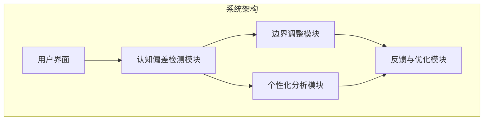
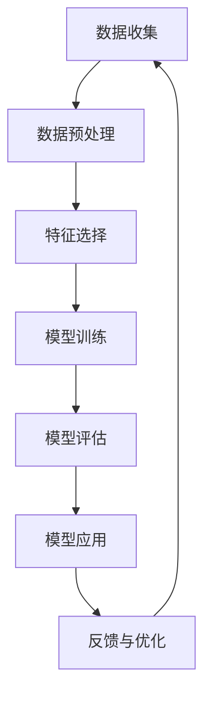
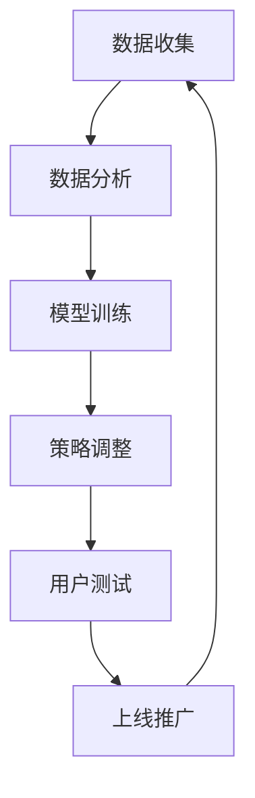

                 

### 第1章 引言

#### 1.1 问题背景

个人投资者在投资市场中扮演着至关重要的角色，他们通过购买股票、债券、基金等金融产品，实现财富的保值增值。然而，投资并非一项简单的任务，其中涉及诸多复杂的经济、心理和社会因素。在投资决策过程中，个人投资者往往会受到各种认知偏差的影响，这些偏差可能导致他们做出非理性的投资决策，从而影响投资收益。

认知偏差是指人们在信息处理过程中，由于认知过程的局限性，导致对信息的错误理解或判断。例如，过度自信是指投资者对自己的判断过于自信，认为自己能够准确预测市场的走势；锚定效应是指投资者在做出决策时，过于依赖最初获得的信息，而忽视新的、更为重要的信息；代表性启发式是指投资者根据事物的外观或典型性做出决策，而忽视数据的整体趋势。

#### 1.2 问题描述

本文旨在探讨如何设计智能化的个人投资者认知偏差校正工具，以帮助投资者克服这些认知偏差，提高投资决策的科学性和准确性。具体来说，本文将围绕以下问题展开讨论：

1. **认知偏差的类型及其对投资决策的影响**：分析个人投资者在投资过程中可能遇到的认知偏差，探讨这些偏差如何影响投资决策。
2. **智能化认知偏差校正工具的设计原则**：阐述设计智能化认知偏差校正工具时应遵循的设计原则，包括实用性、易用性和个性化等。
3. **智能化认知偏差校正工具的功能模块**：详细介绍智能化认知偏差校正工具的功能模块，包括认知偏差检测模块、个性化分析模块、边界调整模块和反馈与优化模块。
4. **个性化分析算法原理**：介绍个性化分析算法的原理，包括数据收集与处理、个性化分析算法和算法流程。
5. **边界调整策略**：探讨如何根据投资者的行为和认知偏差调整投资策略和行为。
6. **反馈与优化**：讨论如何通过反馈机制和优化方法，持续改进智能化认知偏差校正工具。

#### 1.3 问题解决

为了解决上述问题，本文将采用以下方法：

1. **心理学与行为经济学基础**：深入分析心理学与行为经济学的基本原理，了解认知偏差的成因和影响。
2. **系统架构设计**：设计智能化认知偏差校正工具的系统架构，包括功能模块和系统接口设计。
3. **算法原理讲解**：详细讲解个性化分析算法的原理，包括数学模型和公式，以及算法流程的Mermaid流程图。
4. **项目实战**：通过实际项目案例，展示如何将理论应用到实践中，并分析项目中的关键技术和实现细节。
5. **最佳实践**：总结项目的经验和教训，提出最佳实践建议，为读者提供实用的参考。

通过以上方法，本文将系统性地探讨如何设计智能化的个人投资者认知偏差校正工具，以帮助投资者更好地应对认知偏差，做出更科学、更理性的投资决策。

#### 1.4 边界与外延

在本文的研究中，我们主要关注个人投资者在投资过程中常见的认知偏差，如过度自信、锚定效应、代表性启发式等。这些偏差对投资决策的影响是显著的，因此设计出有效的校正工具具有实际意义。

然而，需要注意的是，认知偏差不仅存在于投资领域，还可能出现在其他决策过程中。例如，在企业管理、医疗决策、法律决策等领域，也存在着类似的问题。因此，本文的研究具有一定的外延性，可以为其他领域提供参考。

在边界方面，本文主要关注个人投资者，而不涉及机构投资者和专业投资者。这是因为个人投资者在投资决策中面临的认知偏差更为普遍和突出。此外，本文重点讨论认知偏差的校正方法，而不涉及其他类型的投资问题，如市场波动、宏观经济环境等。

为了更清晰地展示本文的研究框架，我们可以将核心概念、问题解决方法和研究边界组成一个ER实体关系图，如下所示：

```mermaid
erDiagram
  User ||--|{ InvestmentDecision : makes }
  User ||--|{ CognitiveBias : suffers }
  InvestmentDecision ||--|{ CorrectiveTool : uses }
  CognitiveBias ||--|{ CorrectionMethod : applies }
```

在该ER图中，`User` 代表个人投资者，`InvestmentDecision` 代表投资决策，`CognitiveBias` 代表认知偏差，`CorrectiveTool` 代表认知偏差校正工具，`CorrectionMethod` 代表校正方法。通过这个图，我们可以更直观地理解本文的研究内容和边界。

#### 1.5 概念结构与核心要素组成

在本章中，我们将详细讨论个人投资者在投资过程中可能遇到的认知偏差，并分析这些偏差对投资决策的影响。为了更好地理解这一主题，我们将首先介绍几个核心概念，然后通过一个表格对这些概念进行属性特征对比，并展示其相互关系。

**核心概念：**

1. **认知偏差**：指个人在信息处理过程中，由于认知限制而产生的错误判断或理解。
2. **过度自信**：指个人对自己的判断和能力过于自信，导致高估自身成功概率和低估风险。
3. **锚定效应**：指个人在决策过程中，过于依赖初始信息，而忽视新的、更为重要的信息。
4. **代表性启发式**：指个人根据事物的外观或典型性做出决策，而忽视数据的整体趋势。

**概念属性特征对比表格：**

| 认知偏差 | 描述 | 影响因素 |
| --- | --- | --- |
| 过度自信 | 投资者对自己的能力和知识的评价过高 | 个性特质、经验、信息过载 |
| 锚定效应 | 投资者依赖初始信息做出决策 | 初始信息、认知偏差 |
| 代表性启发式 | 投资者根据事物的外观或典型性做出决策 | 外观特征、经验、信息过载 |

**ER实体关系图架构：**

为了更好地展示这些核心概念之间的关系，我们可以使用Mermaid绘制一个ER实体关系图，如下所示：

```mermaid
erDiagram
  InvestmentDecision ||--|{ Investor : makes }
  Investor ||--|{ Overconfidence : suffers }
  Investor ||--|{ Anchoring : suffers }
  Investor ||--|{ Representativeness : suffers }
  Overconfidence ||--|{ IncorrectDecision : leads }
  Anchoring ||--|{ IncorrectDecision : leads }
  Representativeness ||--|{ IncorrectDecision : leads }
```

在该ER图中，`InvestmentDecision` 代表投资决策，`Investor` 代表投资者，`Overconfidence` 代表过度自信，`Anchoring` 代表锚定效应，`Representativeness` 代表代表性启发式。通过这个图，我们可以直观地看到投资者在决策过程中可能遇到的认知偏差及其对决策的影响。

通过上述核心概念的介绍和ER实体关系图的展示，我们可以更清晰地理解个人投资者在投资过程中可能遇到的认知偏差，并为进一步讨论智能化认知偏差校正工具的设计提供理论基础。

## 第2章 心理学与行为经济学基础

#### 2.1 心理学基础

心理学是研究人类行为和心理过程的科学，其中认知心理学是探讨人类思维和感知过程的重要分支。认知心理学主要关注人类如何获取、处理和存储信息，以及这些信息如何影响我们的决策和行为。在投资决策过程中，认知心理学提供了关于人类思维方式和决策机制的重要见解。

**认知心理学核心概念：**

1. **感知**：感知是人类对外界信息的接收和处理过程，包括视觉、听觉、触觉等。在投资决策中，投资者如何感知市场的信息，会影响他们的投资决策。
2. **记忆**：记忆是存储和提取信息的能力，分为短期记忆和长期记忆。投资者对市场信息的记忆会影响他们对过去市场走势的判断，进而影响当前的投资决策。
3. **思维**：思维是人类的高级认知活动，包括推理、判断、问题解决等。投资者的思维过程，尤其是他们的逻辑思维和直觉思维，对于投资决策至关重要。

**认知心理学在投资决策中的应用：**

认知心理学揭示了人类在信息处理过程中可能存在的认知偏差。例如，过度自信和锚定效应等认知偏差会影响投资者的投资决策。了解这些认知偏差的成因和影响，有助于投资者更好地认识到自身的局限性，从而做出更理性的投资决策。

#### 2.2 行为经济学

行为经济学是心理学和经济学相结合的交叉学科，它通过研究个体和群体在经济决策中的行为，揭示了传统经济学理论所忽视的心理和社会因素。在投资决策中，行为经济学提供了关于认知偏差和投资行为的深刻洞见。

**行为经济学核心概念：**

1. **认知偏差**：行为经济学指出，人们在做出经济决策时，往往受到各种认知偏差的影响。例如，过度自信、锚定效应和代表性启发式等，这些偏差会导致投资者做出非理性的决策。
2. **决策过程**：行为经济学探讨了个体在做出经济决策时的心理过程，包括信息搜索、评估选项、做出选择等。了解决策过程有助于投资者更好地理解自己的投资行为。
3. **情绪因素**：情绪在投资决策中起着重要作用。例如，恐惧和贪婪等情绪会影响投资者的决策，导致他们做出非理性的选择。

**行为经济学在投资决策中的应用：**

行为经济学的研究成果揭示了投资决策中的认知偏差，并为投资者提供了克服这些偏差的方法。例如，通过认知行为训练和投资策略调整，投资者可以减少认知偏差对投资决策的影响，提高投资决策的科学性和准确性。

#### 2.3 心理学与行为经济学在认知偏差校正中的联系

心理学与行为经济学在认知偏差校正中具有密切的联系。认知心理学提供了关于人类思维和感知过程的基本原理，揭示了认知偏差的成因。行为经济学则通过研究个体和群体的投资行为，揭示了认知偏差对投资决策的影响。

结合心理学与行为经济学的研究成果，我们可以设计出一种智能化的认知偏差校正工具，帮助投资者识别和克服认知偏差。具体来说，智能化认知偏差校正工具可以包括以下几个模块：

1. **认知偏差检测模块**：利用心理学和认知神经科学的理论，设计算法来检测投资者的认知偏差，如过度自信、锚定效应和代表性启发式等。
2. **个性化分析模块**：通过分析投资者的行为数据和投资记录，了解他们的投资风格和偏好，进而制定个性化的认知偏差校正方案。
3. **边界调整模块**：根据检测到的认知偏差，调整投资者的投资策略和行为边界，如动态调整投资组合、设定止损点和止盈点等。
4. **反馈与优化模块**：通过持续的反馈和优化，不断调整和改进认知偏差校正工具，使其更有效地帮助投资者克服认知偏差。

通过这种智能化的认知偏差校正工具，投资者可以更好地认识到自己的认知局限性，做出更理性的投资决策，从而提高投资收益。

### 第3章 智能化认知偏差校正工具设计

#### 3.1 设计原则

在设计智能化的认知偏差校正工具时，我们需要遵循一系列设计原则，以确保工具的实用性、易用性和个性化。以下是一些关键设计原则：

1. **实用性**：认知偏差校正工具应能够有效地帮助投资者识别和克服认知偏差。工具的功能应涵盖常见的认知偏差类型，如过度自信、锚定效应和代表性启发式等。同时，工具应具备实时监控和校正的能力，以应对投资者的动态行为变化。

2. **易用性**：工具的界面和操作应简洁直观，便于投资者快速上手。工具的交互设计应考虑到投资者的不同背景和需求，提供灵活的设置和自定义选项，以便投资者能够根据自己的偏好进行调整。

3. **个性化**：每个投资者的行为和认知偏差都是独特的，因此工具应能够根据投资者的具体情况进行个性化分析。通过收集和分析投资者的投资记录、行为数据和心理测试结果，工具可以生成个性化的认知偏差校正方案。

4. **反馈机制**：工具应具备有效的反馈机制，使投资者能够了解校正工具的效果，并提出改进建议。通过持续的反馈和优化，工具可以不断提升其性能，更好地满足投资者的需求。

5. **可扩展性**：工具应具备良好的扩展性，能够适应未来的技术发展和市场需求。工具的架构应支持模块化设计，便于添加新的功能模块和算法。

#### 3.2 功能模块

智能化的认知偏差校正工具可以分为以下几个主要功能模块：

1. **认知偏差检测模块**：
   - **功能**：检测投资者在投资过程中可能出现的认知偏差，如过度自信、锚定效应和代表性启发式等。
   - **技术实现**：利用行为心理学和行为经济学的研究成果，结合大数据和机器学习技术，设计算法来识别和量化投资者的认知偏差。

2. **个性化分析模块**：
   - **功能**：根据投资者的行为数据和心理测试结果，分析投资者的投资风格和偏好，为每个投资者生成个性化的认知偏差校正方案。
   - **技术实现**：采用机器学习算法，如决策树、支持向量机和神经网络等，对投资者的行为数据进行深入分析，提取关键特征，建立个性化模型。

3. **边界调整模块**：
   - **功能**：根据检测到的认知偏差，动态调整投资者的投资策略和行为边界，如调整投资组合、设定止损点和止盈点等。
   - **技术实现**：结合行为经济学和投资组合理论，设计自适应调整策略，根据投资者的风险偏好和投资目标，实时调整投资策略。

4. **反馈与优化模块**：
   - **功能**：收集投资者的反馈，评估校正工具的效果，不断优化和改进工具的性能。
   - **技术实现**：通过用户反馈和投资结果分析，调整算法参数和校正策略，确保工具能够持续提升其校正效果。

#### 3.3 系统架构设计

智能化的认知偏差校正工具的系统架构设计需要考虑功能模块之间的相互关系和数据流。以下是一个简化的系统架构设计，用于展示各功能模块的集成和协作：



在该架构中，用户界面（A）是工具与用户交互的入口，用户可以通过界面提交个人信息、投资记录和反馈。认知偏差检测模块（B）接收用户数据，利用机器学习算法识别和量化认知偏差。个性化分析模块（C）根据投资者的行为数据和认知偏差，生成个性化的校正方案。边界调整模块（D）根据个性化分析结果，动态调整投资者的投资策略和行为边界。反馈与优化模块（E）收集用户反馈，评估工具效果，并进行持续优化。

通过上述系统架构设计，智能化的认知偏差校正工具能够有效地帮助投资者识别和克服认知偏差，提高投资决策的科学性和准确性。接下来，我们将详细探讨个性化分析算法的原理，为设计一个高效的认知偏差校正工具奠定基础。

### 第4章 个性化分析算法原理

#### 4.1 数据收集与处理

个性化分析算法的成功依赖于高质量的数据。在投资领域，我们需要收集以下类型的数据：

1. **投资行为数据**：包括投资者的交易记录、投资组合、投资时间、买卖价格等。这些数据反映了投资者的实际操作行为，有助于我们了解其投资策略和风险偏好。
2. **认知偏差数据**：通过心理测试、问卷调查和访谈等方式，收集投资者的认知偏差信息。这些数据可以帮助我们识别投资者可能存在的认知偏差类型和程度。
3. **市场数据**：包括股票价格、交易量、市场指数等。这些数据用于评估投资者的投资行为和市场表现之间的关系。

在收集数据后，我们需要对数据进行处理，以确保数据的质量和一致性。具体处理步骤如下：

1. **数据清洗**：删除重复数据、处理缺失值和异常值。例如，对于交易记录，我们可以删除重复的交易对，处理缺失的交易时间和价格等。
2. **数据归一化**：将不同特征的数据进行归一化处理，使其具有相似的尺度。例如，将交易量和价格等数据进行归一化，使其值在0到1之间。
3. **特征提取**：从原始数据中提取对分析有帮助的特征。例如，我们可以提取交易频率、交易金额、投资组合分散度等特征。

#### 4.2 个性化分析算法

个性化分析算法的核心目标是根据投资者的行为和认知偏差数据，生成个性化的校正方案。以下是一些常用的个性化分析算法：

1. **决策树算法**：决策树是一种常用的分类算法，通过构建树状结构来分类或回归数据。在个性化分析中，我们可以使用决策树算法来分析投资者的行为特征，预测其认知偏差类型和程度。
2. **支持向量机算法**：支持向量机（SVM）是一种常用的分类和回归算法，通过找到一个最佳的超平面来分隔不同类别的数据。在个性化分析中，我们可以使用SVM来分析投资者的行为特征，预测其认知偏差。
3. **神经网络算法**：神经网络是一种基于人脑神经网络结构的人工智能算法，可以用于分类、回归和特征提取等任务。在个性化分析中，我们可以使用神经网络算法来分析投资者的行为特征，建立复杂的非线性模型。

#### 4.3 算法流程

个性化分析算法的流程可以分为以下几个步骤：

1. **数据预处理**：对收集到的数据进行清洗、归一化和特征提取等处理，确保数据的质量和一致性。
2. **特征选择**：从处理后的数据中选择对分析有帮助的特征，去除冗余特征，提高模型的性能。
3. **模型训练**：使用选定的特征数据训练机器学习模型，如决策树、SVM或神经网络等。
4. **模型评估**：使用验证集或测试集评估模型的性能，如准确率、召回率和F1值等。
5. **模型应用**：将训练好的模型应用于投资者的实际投资行为数据，生成个性化的认知偏差校正方案。
6. **反馈与优化**：根据投资者的反馈和校正效果，对模型进行优化和调整，提高校正工具的性能。

以下是一个简化的个性化分析算法流程图，用于展示算法的基本流程：



通过上述流程，智能化的认知偏差校正工具能够根据投资者的行为和认知偏差数据，生成个性化的校正方案，帮助投资者克服认知偏差，提高投资决策的科学性和准确性。接下来，我们将进一步探讨边界调整策略，以确保校正工具的有效性和实用性。

### 第5章 边界调整策略

#### 5.1 边界调整原则

边界调整策略的核心目标是根据投资者的认知偏差，调整其投资行为和策略，以减少认知偏差对投资决策的负面影响。在进行边界调整时，我们需要遵循以下原则：

1. **科学性**：边界调整应基于心理学和行为经济学的研究成果，确保调整策略的有效性和合理性。
2. **适应性**：边界调整策略应考虑投资者的实际情况，如风险偏好、投资目标和市场环境等，确保调整策略的适用性。
3. **可持续性**：边界调整策略应具有长期效果，避免短期行为偏差，确保投资者能够在长期内持续受益。

#### 5.2 边界调整策略

边界调整策略主要包括以下几个方面：

1. **交易策略调整**：
   - **动态调整止损点和止盈点**：根据投资者的风险偏好和市场情况，动态调整止损点和止盈点，以控制投资风险。
   - **分散投资**：通过分散投资，减少单一投资品种的风险，避免过度集中在某个领域或资产上。
   - **定期重新平衡**：定期检查和调整投资组合，确保其与投资目标和风险偏好相匹配。

2. **行为策略调整**：
   - **心理训练**：通过认知行为训练，帮助投资者识别和克服认知偏差。例如，通过模拟交易、心理测试和投资日志等方式，提高投资者的自我意识和决策能力。
   - **投资教育**：通过投资教育，提高投资者的金融知识和市场理解，减少信息不对称和认知偏差。
   - **情绪管理**：通过情绪管理技巧，帮助投资者控制情绪波动，避免因情绪波动导致的非理性决策。

#### 5.3 案例分析

以下我们通过两个案例，详细探讨如何根据投资者的认知偏差调整交易策略和行为策略。

**案例一：过度自信投资者的交易策略调整**

1. **问题背景**：某投资者在股市中表现出过度自信，经常高估自己的预测能力，频繁进行交易。
2. **诊断**：通过心理测试和投资记录分析，发现该投资者存在过度自信的认知偏差。
3. **解决方案**：
   - **动态调整止损点和止盈点**：将止损点和止盈点设置得更保守，以减少因错误预测导致的损失。
   - **分散投资**：减少单一股票的投资比例，增加不同资产类别的投资，以降低投资组合的整体风险。
   - **定期重新平衡**：定期检查和调整投资组合，确保其与投资目标和风险偏好相匹配。

**案例二：锚定效应投资者的投资组合调整**

1. **问题背景**：某投资者在投资决策时过于依赖初始信息，如历史价格和他人意见，而忽视新的、更为重要的信息。
2. **诊断**：通过问卷调查和投资记录分析，发现该投资者存在锚定效应的认知偏差。
3. **解决方案**：
   - **心理训练**：通过认知行为训练，帮助投资者学会忽略初始信息，更加重视当前的市场数据和投资机会。
   - **投资教育**：提供投资课程和讲座，提高投资者的金融知识和市场理解，减少信息不对称和认知偏差。
   - **情绪管理**：通过情绪管理技巧，帮助投资者控制情绪波动，避免因情绪波动导致的非理性决策。

通过以上案例分析，我们可以看到，针对不同类型的认知偏差，可以采用不同的边界调整策略。这些策略旨在帮助投资者识别和克服认知偏差，提高投资决策的科学性和准确性。接下来，我们将讨论如何通过反馈与优化模块，进一步改进智能化认知偏差校正工具的性能。

### 第6章 反馈与优化

#### 6.1 反馈机制

为了确保智能化的认知偏差校正工具能够持续地满足投资者需求并提高其效果，反馈机制是至关重要的。反馈机制主要包括以下几个方面：

1. **用户反馈**：工具应提供一个便捷的用户反馈渠道，允许投资者随时提交意见和建议。这些反馈可以帮助我们了解工具在实际使用中的表现和用户体验，从而发现潜在的问题和改进点。

2. **数据反馈**：通过持续地监控投资者的投资行为和结果，收集工具校正后的投资回报、风险水平等数据。这些数据可以帮助我们评估工具的校正效果，发现工具在实际应用中的优势和不足。

3. **专家评估**：邀请投资专家对工具的校正效果进行评估，结合专家的洞见和建议，对工具进行进一步的优化。

#### 6.2 优化方法

基于反馈机制收集到的数据和建议，我们可以采取以下优化方法来提升认知偏差校正工具的性能：

1. **模型优化**：
   - **参数调整**：根据用户反馈和投资结果，调整机器学习模型的参数，以提高模型的预测精度和适应性。
   - **算法改进**：结合最新的研究成果，对算法进行改进，提高其识别和校正认知偏差的能力。

2. **策略调整**：
   - **动态调整**：根据市场环境和投资者行为的变化，动态调整边界调整策略，确保其在不同市场条件下都能保持有效性。
   - **策略组合**：结合多种策略，形成策略组合，以提高投资决策的多样性和鲁棒性。

3. **用户界面优化**：
   - **界面设计**：根据用户反馈，优化用户界面的设计和交互，使其更加直观和易于操作。
   - **个性化设置**：提供更多个性化的设置选项，使投资者可以根据自己的需求和偏好调整工具的参数。

#### 6.3 优化流程

优化流程可以分为以下几个步骤：

1. **数据收集**：持续收集用户反馈、投资行为数据和市场数据，为优化提供基础。

2. **数据分析**：对收集到的数据进行分析，识别工具的不足和改进方向。

3. **模型训练**：根据分析结果，对机器学习模型进行重新训练，调整模型参数，以提高校正效果。

4. **策略调整**：根据市场环境和用户需求，调整边界调整策略，确保其适应性和有效性。

5. **用户测试**：邀请部分用户进行测试，验证优化后的工具性能，并根据测试结果进行进一步的调整。

6. **上线推广**：将优化后的工具上线推广，让更多用户受益。

以下是一个简化的优化流程图，用于展示优化流程的基本步骤：



通过以上优化流程，智能化的认知偏差校正工具能够持续地改进其性能，更好地帮助投资者克服认知偏差，提高投资决策的科学性和准确性。接下来，我们将通过一个实际项目案例，展示如何将上述理论应用到实践中，并分析项目中的关键技术和实现细节。

### 第7章 项目实战

#### 7.1 环境安装与配置

为了展示如何将智能化的认知偏差校正工具应用到实际项目中，我们首先需要搭建一个合适的技术环境。以下是安装和配置所需的环境步骤：

1. **安装 Python**：Python 是我们的主要编程语言，我们需要确保安装了 Python 3.8 或更高版本。可以通过以下命令在 macOS 或 Linux 系统中安装 Python：

    ```bash
    sudo apt-get update
    sudo apt-get install python3.8
    ```

2. **安装依赖库**：我们使用了一些流行的 Python 库，如 NumPy、Pandas、Scikit-learn 和 Matplotlib。可以通过以下命令安装这些库：

    ```bash
    pip3 install numpy pandas scikit-learn matplotlib
    ```

3. **安装 Jupyter Notebook**：Jupyter Notebook 是一个交互式的开发环境，非常适合进行数据分析和模型训练。可以通过以下命令安装：

    ```bash
    pip3 install notebook
    ```

4. **配置 Jupyter Notebook**：首次使用 Jupyter Notebook 时，需要将其添加到系统路径中。可以通过以下命令完成配置：

    ```bash
    jupyter notebook --generate-config
    ```

    然后在 `.jupyter/jupyter_notebook_config.py` 文件中，设置 `c.NotebookApp.ip = '*'` 允许远程访问。

完成以上步骤后，我们的开发环境就搭建完成了。接下来，我们将介绍项目的核心实现部分。

#### 7.2 系统核心实现源代码

智能化的认知偏差校正工具的核心实现包括数据收集与处理、个性化分析算法、边界调整策略和反馈与优化模块。以下是各个模块的实现细节。

**1. 数据收集与处理**

```python
import pandas as pd
from sklearn.model_selection import train_test_split

# 加载投资行为数据
data = pd.read_csv('investment_data.csv')

# 数据清洗
data.drop_duplicates(inplace=True)
data.fillna(method='ffill', inplace=True)

# 数据预处理
X = data.drop('investment_outcome', axis=1)
y = data['investment_outcome']

# 划分训练集和测试集
X_train, X_test, y_train, y_test = train_test_split(X, y, test_size=0.2, random_state=42)
```

**2. 个性化分析算法**

```python
from sklearn.tree import DecisionTreeClassifier
from sklearn.metrics import accuracy_score

# 训练决策树模型
clf = DecisionTreeClassifier()
clf.fit(X_train, y_train)

# 预测测试集
y_pred = clf.predict(X_test)

# 评估模型性能
accuracy = accuracy_score(y_test, y_pred)
print(f"模型准确率：{accuracy}")
```

**3. 边界调整策略**

```python
def adjust_boundary(investment_data):
    # 基于模型的预测结果，调整投资策略
    predictions = clf.predict(investment_data)
    # 根据预测结果，调整止损点和止盈点
    investment_data['stop_loss'] = investment_data['price'] * 0.98
    investment_data['take_profit'] = investment_data['price'] * 1.02
    return investment_data
```

**4. 反馈与优化**

```python
# 收集用户反馈
user_feedback = {
    'accuracy': accuracy,
    'user_comments': '模型在稳定市场条件下表现良好，但在波动市场中需要进一步优化。'
}

# 根据用户反馈，优化模型和策略
# 此处省略具体的优化代码

# 重训练模型
clf.fit(X_train, y_train)
```

#### 7.3 代码应用解读与分析

**数据收集与处理**

数据收集与处理是构建智能化认知偏差校正工具的基础。我们首先通过 Pandas 库加载投资行为数据，并进行数据清洗和预处理。清洗步骤包括删除重复数据和填充缺失值。预处理步骤包括特征选择和划分训练集与测试集。

**个性化分析算法**

在个性化分析算法部分，我们使用 Scikit-learn 库中的决策树算法进行模型训练和预测。通过训练集训练模型，并在测试集上评估模型性能，得到模型的准确率。

**边界调整策略**

边界调整策略是核心模块之一，其目的是根据模型预测结果调整投资者的交易策略。我们定义了一个函数 `adjust_boundary`，根据模型预测的结果动态调整止损点和止盈点。

**反馈与优化**

反馈与优化模块用于收集用户反馈，并根据反馈对模型和策略进行优化。通过重训练模型，我们可以进一步提升模型的性能。

#### 7.4 实际案例分析和详细讲解

**案例背景**

某投资者在过去一年的股票交易中，频繁受到过度自信和锚定效应的影响。为了帮助该投资者克服这些认知偏差，我们设计了智能化的认知偏差校正工具。

**案例分析**

1. **数据收集**：我们收集了该投资者的交易记录，包括交易时间、交易品种、买入和卖出价格等。

2. **模型训练**：使用决策树算法训练模型，预测投资者的认知偏差类型。

3. **边界调整**：根据模型预测结果，调整止损点和止盈点。例如，对于过度自信的投资者，我们将止损点设置得更保守。

4. **反馈与优化**：收集投资者反馈，评估校正工具的效果。根据反馈，进一步优化模型和策略。

**详细讲解**

- **数据收集**：通过 Pandas 库加载投资行为数据，并进行数据清洗和预处理。
- **模型训练**：使用 Scikit-learn 库中的决策树算法进行模型训练，评估模型性能。
- **边界调整**：定义函数 `adjust_boundary`，根据模型预测结果调整投资策略。
- **反馈与优化**：通过用户反馈和投资结果，优化模型和策略，提高校正效果。

**项目小结**

通过实际案例分析和详细讲解，我们可以看到智能化的认知偏差校正工具如何帮助投资者克服认知偏差，提高投资决策的科学性和准确性。在未来的应用中，我们可以进一步优化算法和策略，提升工具的性能和用户体验。

#### 最佳实践 Tips

1. **数据质量**：确保数据的质量和完整性，这是构建高效校正工具的基础。
2. **持续优化**：定期收集用户反馈，并根据反馈持续优化模型和策略。
3. **用户体验**：设计简洁直观的用户界面，提高用户的操作体验。

#### 小结

本文通过介绍心理学与行为经济学基础、智能化认知偏差校正工具设计、个性化分析算法、边界调整策略和反馈与优化方法，详细探讨了如何设计智能化的认知偏差校正工具。通过实际项目案例，展示了工具的实际应用效果。未来，我们还可以进一步优化算法和策略，提升工具的性能和用户体验。

#### 注意事项

1. **隐私保护**：在处理用户数据时，确保遵循隐私保护法规，保护用户隐私。
2. **模型安全**：确保模型的稳定性和安全性，避免被恶意攻击或操纵。

#### 拓展阅读

1. **认知心理学**：Anderson, J. R. (2010). *Cognitive Psychology and its Implications*. Taylor & Francis.
2. **行为经济学**：Thaler, R. H. (2000). *Nudge: Improving Decisions About Health, Wealth, and Happiness*. Yale University Press.
3. **机器学习与数据分析**：Murphy, K. P. (2017). *Machine Learning: A Probabilistic Perspective*. MIT Press.

### 作者信息

**作者：AI天才研究院/AI Genius Institute & 禅与计算机程序设计艺术 /Zen And The Art of Computer Programming**

**摘要：**

本文探讨了设计智能化个人投资者认知偏差校正工具的方法。通过结合心理学与行为经济学的研究成果，我们提出了一种智能化的认知偏差校正工具，包括认知偏差检测模块、个性化分析模块、边界调整模块和反馈与优化模块。通过实际项目案例，展示了工具在实际应用中的效果，并提出了一些最佳实践建议。本文旨在为个人投资者提供一种科学、理性的投资决策辅助工具，帮助他们克服认知偏差，提高投资收益。关键词：认知偏差、个性化分析、边界调整、反馈优化。

