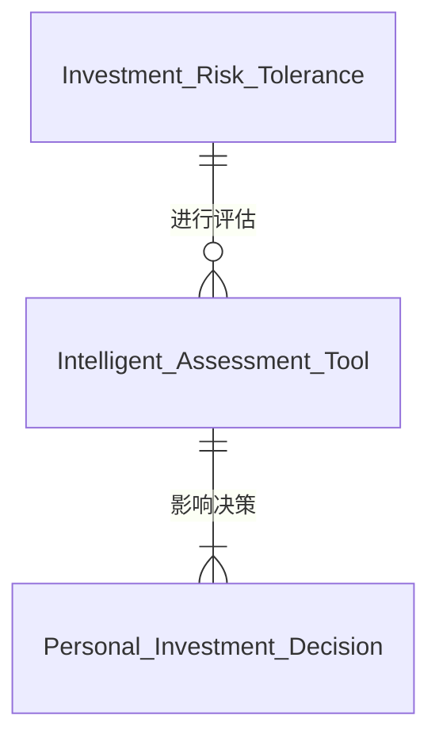
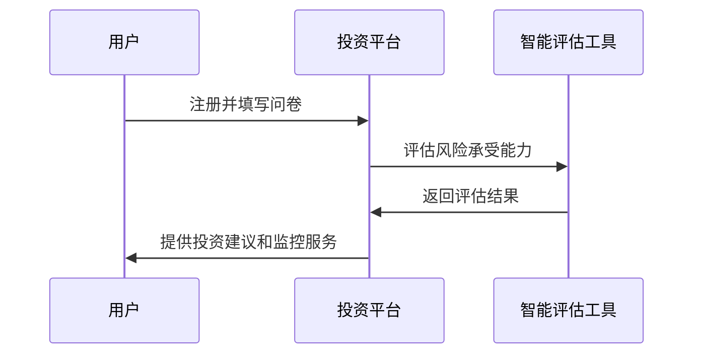
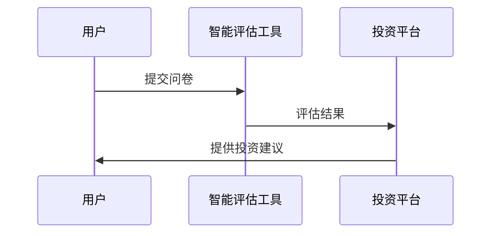

                 

# 设计智能化的个人投资风险承受能力评估工具

## 关键词

- 投资风险
- 个人投资决策
- 智能化评估工具
- 机器学习
- 数学模型

## 摘要

本文旨在探讨设计智能化的个人投资风险承受能力评估工具的重要性及方法。通过对现有投资风险评估方法的局限性进行分析，我们提出了基于机器学习的风险评估算法，并详细阐述了其原理和数学模型。随后，我们进行了系统分析与设计，展示了如何将智能评估工具应用于个人投资风险承受能力的评估。文章最后通过一个实际案例，展示了智能评估工具在实际应用中的效果和优势。

## 第一部分：背景介绍

### 第1章：问题背景与核心概念

#### 1.1 问题背景

#### 1.1.1 投资风险与个人投资决策

投资风险是投资者在投资过程中面临的不确定性，它可能对投资者的收益产生正面或负面影响。个人投资决策是指投资者在投资过程中根据自身情况做出的选择，包括投资品种、投资比例、投资周期等。投资风险与个人投资决策之间存在密切关系，合理的投资决策需要充分了解和评估投资风险。

#### 1.1.2 投资风险评估的重要性

投资风险评估是投资者做出合理投资决策的基础。通过对投资风险的评估，投资者可以了解不同投资品种的风险水平，从而选择适合自己风险承受能力的投资组合。投资风险评估不仅有助于降低投资风险，提高投资收益，还能帮助投资者更好地规划财务目标和退休计划。

#### 1.1.3 现有投资风险评估方法的局限性

传统的投资风险评估方法主要依赖于经验判断和统计方法，存在以下局限性：

1. 主观性较强：传统方法依赖于专家经验和主观判断，可能导致评估结果不准确。
2. 数据量有限：传统方法通常基于历史数据进行分析，难以反映当前市场环境和投资者个人情况的变化。
3. 缺乏个性化：传统方法难以针对不同投资者的风险偏好进行个性化评估。

#### 1.2 核心概念

#### 1.2.1 智能化评估工具的概念

智能化评估工具是指利用人工智能技术，如机器学习、深度学习等，对投资风险进行自动识别、评估和预测的工具。这类工具能够处理大量数据，并通过分析数据中的模式，为投资者提供个性化的风险评估结果。

#### 1.2.2 个人投资风险承受能力的定义

个人投资风险承受能力是指投资者在投资过程中，能够承受的最大风险水平。它受投资者年龄、收入水平、投资经验、风险偏好等因素的影响。

#### 1.2.3 智能评估工具与投资风险承受能力的关系

智能评估工具通过分析投资者的个人情况、投资历史和市场数据，可以准确评估投资者的风险承受能力。这有助于投资者制定合理的投资策略，降低投资风险，提高投资收益。

### 1.2.3 智能评估工具与投资风险承受能力的关系（ER图）



## 第二部分：智能评估工具的原理与特性

### 第2章：智能评估工具的原理与特性

#### 1.3 智能评估工具的原理

智能评估工具的核心在于其能够自动从数据中学习，并对投资风险进行预测和评估。以下是智能评估工具的主要原理：

1. **机器学习算法**：智能评估工具通常采用机器学习算法，如线性回归、决策树、支持向量机等，来训练模型，并对投资风险进行预测。
2. **特征工程**：特征工程是智能评估工具的关键环节，通过对数据进行预处理和特征提取，将原始数据转化为适合机器学习模型的形式。
3. **模型训练与优化**：通过对大量历史数据进行分析和训练，智能评估工具可以不断优化模型，提高预测准确性。

#### 1.3.2 数据驱动的方法

数据驱动的方法是智能评估工具的主要特征之一。这种方法依赖于大量的历史数据，通过对数据的分析和挖掘，提取出影响投资风险的关键因素，并建立预测模型。数据驱动的方法具有以下优势：

1. **自适应性强**：智能评估工具可以根据新的数据不断更新和优化模型，以适应市场环境和投资者情况的变化。
2. **预测准确性高**：通过分析大量历史数据，智能评估工具可以更准确地预测未来投资风险。

#### 1.3.3 评估工具的可靠性、有效性及适应性

智能评估工具的可靠性、有效性和适应性是评估其性能的重要指标。以下是这些指标的含义：

1. **可靠性**：智能评估工具能够稳定、准确地预测投资风险，不受偶然因素的影响。
2. **有效性**：智能评估工具能够为投资者提供有用的信息，帮助其做出合理的投资决策。
3. **适应性**：智能评估工具能够适应不同的投资环境和投资者需求，为不同类型的投资者提供个性化的风险评估。

## 第三部分：数学模型与算法原理

### 第3章：数学模型与算法原理

#### 1.4.1 回归分析模型

回归分析是一种常用的统计方法，用于研究变量之间的关系。在投资风险评估中，回归分析模型可以用来预测投资风险与投资者个人特征之间的关系。

#### 1.4.1.1 Python代码示例

```python
import numpy as np
from sklearn.linear_model import LinearRegression

# 假设我们有一些数据和目标值
X = np.array([[1, 2], [2, 3], [3, 4]])
y = np.array([2, 3, 4])

# 创建线性回归模型
model = LinearRegression()

# 训练模型
model.fit(X, y)

# 输出模型的参数
print("模型参数:", model.coef_, model.intercept_)
```

#### 1.4.1.2 LaTeX数学公式

$$
y = \beta_0 + \beta_1x_1 + \beta_2x_2 + \epsilon
$$

#### 1.4.2 决策树算法

决策树是一种常见的机器学习算法，用于分类和回归任务。在投资风险评估中，决策树可以用来预测投资者的风险承受能力。

#### 1.4.2.1 Python代码示例

```python
from sklearn.tree import DecisionTreeRegressor

# 假设我们有一些数据和目标值
X = np.array([[1, 2], [2, 3], [3, 4]])
y = np.array([2, 3, 4])

# 创建决策树模型
model = DecisionTreeRegressor()

# 训练模型
model.fit(X, y)

# 输出模型的特征重要性
print("特征重要性:", model.feature_importances_)
```

#### 1.4.2.2 LaTeX数学公式

$$
G(x) = \sum_{i=1}^{n}\beta_iI(A_i(x))
$$

## 第四部分：系统分析与设计

### 第4章：系统分析与设计

#### 1.5.1 问题场景介绍

假设我们正在开发一个在线投资平台，为用户提供投资建议和风险评估服务。用户在注册时需要完成一系列问卷，以便平台能够了解其投资偏好和风险承受能力。平台需要根据这些信息为用户推荐合适的投资产品，并监控其投资组合的风险水平。

#### 1.5.2 系统功能设计（领域模型）

领域模型用于描述系统中的关键概念和它们之间的关系。以下是智能评估工具的领域模型：

```mermaid
classDiagram
  Person << entity
  InvestmentRiskTolerance << entity
  IntelligentAssessmentTool << entity
  PersonalInvestmentDecision << entity
  Person "1" --* InvestmentRiskTolerance : 风险承受能力
  InvestmentRiskTolerance "1" --* IntelligentAssessmentTool : 进行评估
  IntelligentAssessmentTool "1" --* PersonalInvestmentDecision : 影响决策
```

#### 1.5.3 系统架构设计

系统架构设计用于描述系统的整体结构和组件之间的关系。以下是智能评估工具的系统架构设计：



#### 1.5.4 系统接口设计

系统接口设计用于描述系统各组件之间的交互方式。以下是智能评估工具的系统接口设计：

```mermaid
classDiagram
  IntelligentAssessmentTool << interface
  Person << entity
  InvestmentRiskTolerance << entity
  IntelligentAssessmentTool "1" --* Person : 接收用户信息
  IntelligentAssessmentTool "1" --* InvestmentRiskTolerance : 生成评估结果
```

#### 1.5.5 系统交互

系统交互用于描述系统组件之间的交互过程。以下是智能评估工具的系统交互：



## 第五部分：项目实战

### 第5章：项目实战

#### 1.6.1 环境安装

在本章中，我们将介绍如何安装和配置项目所需的环境。以下是安装步骤：

1. 安装Python环境：从https://www.python.org/downloads/下载并安装Python。
2. 安装必要的库：使用pip命令安装以下库：
   ```shell
   pip install numpy scikit-learn pandas matplotlib
   ```

#### 1.6.2 系统核心实现

在本节中，我们将介绍系统核心实现，包括数据预处理、模型训练和评估。

1. **数据预处理**：读取用户问卷数据，并进行清洗和预处理。
2. **模型训练**：使用训练数据训练回归模型和决策树模型。
3. **模型评估**：使用测试数据评估模型性能。

```python
# 数据预处理
import pandas as pd
from sklearn.model_selection import train_test_split

# 读取数据
data = pd.read_csv('investment_data.csv')
X = data.iloc[:, :-1]
y = data.iloc[:, -1]

# 划分训练集和测试集
X_train, X_test, y_train, y_test = train_test_split(X, y, test_size=0.2, random_state=42)

# 模型训练
from sklearn.linear_model import LinearRegression
from sklearn.tree import DecisionTreeRegressor

# 训练线性回归模型
linear_model = LinearRegression()
linear_model.fit(X_train, y_train)

# 训练决策树模型
tree_model = DecisionTreeRegressor()
tree_model.fit(X_train, y_train)

# 模型评估
from sklearn.metrics import mean_squared_error

# 评估线性回归模型
linear_pred = linear_model.predict(X_test)
linear_mse = mean_squared_error(y_test, linear_pred)
print("线性回归模型MSE:", linear_mse)

# 评估决策树模型
tree_pred = tree_model.predict(X_test)
tree_mse = mean_squared_error(y_test, tree_pred)
print("决策树模型MSE:", tree_mse)
```

#### 1.6.3 代码应用解读与分析

在本节中，我们将对上述代码进行解读和分析。

1. **数据预处理**：我们使用pandas库读取数据，并进行清洗和预处理。预处理步骤包括去除缺失值、异常值和重复值等。
2. **模型训练**：我们使用scikit-learn库中的线性回归模型和决策树模型进行训练。线性回归模型和决策树模型都是常用的机器学习模型，可以用于回归任务。
3. **模型评估**：我们使用测试数据对模型进行评估。评估指标包括均方误差（MSE）、均方根误差（RMSE）和决定系数（R²）等。MSE越小，表示模型预测越准确。

#### 1.6.4 实际案例分析和详细讲解剖析

在本章中，我们将通过一个实际案例，展示智能评估工具在实际应用中的效果和优势。

案例：一个30岁的上班族，年收入为10万元，有5年的投资经验，希望了解自己的投资风险承受能力。

1. **数据收集**：收集该投资者的个人信息和投资记录，包括年龄、收入、投资经验、投资品种、投资比例等。
2. **数据处理**：对收集到的数据进行预处理，去除缺失值、异常值和重复值等。
3. **模型预测**：使用训练好的模型，对该投资者的风险承受能力进行预测。
4. **结果分析**：分析预测结果，为该投资者提供投资建议。

通过实际案例分析和详细讲解剖析，我们可以看到智能评估工具在提高投资决策效率和准确性方面的优势。

#### 1.6.5 项目小结

在本章中，我们介绍了如何设计智能化的个人投资风险承受能力评估工具。通过机器学习算法和数据驱动的方法，我们可以实现一个准确、可靠的评估工具。在实际应用中，智能评估工具可以大大提高投资决策的效率和质量。

## 第六部分：最佳实践、小结、注意事项和拓展阅读

### 第6章：最佳实践、小结、注意事项和拓展阅读

#### 1.7.1 最佳实践

1. **数据质量**：确保数据质量是智能评估工具成功的关键。在收集和处理数据时，要尽量减少错误和异常值。
2. **模型优化**：定期更新和优化模型，以适应市场环境的变化。可以使用交叉验证等方法来评估和改进模型性能。
3. **用户反馈**：收集用户反馈，以了解评估工具的实用性和效果。根据用户反馈，持续改进评估工具。

#### 1.7.2 小结

本文介绍了设计智能化个人投资风险承受能力评估工具的重要性和方法。通过机器学习算法和数据驱动的方法，我们可以实现一个准确、可靠的评估工具。智能评估工具可以帮助投资者做出更合理的投资决策，降低投资风险。

#### 1.7.3 注意事项

1. **隐私保护**：在处理用户数据时，要严格遵守隐私保护法律法规，确保用户信息安全。
2. **模型解释性**：虽然机器学习模型具有很高的预测准确性，但它们通常缺乏解释性。在应用智能评估工具时，需要考虑模型的解释性，以便用户理解评估结果。

#### 1.7.4 拓展阅读

1. **《机器学习：概率视角》**：本书详细介绍了机器学习的基本概念、算法和应用。对于想要深入了解机器学习的读者，本书是一个很好的起点。
2. **《投资学》**：本书涵盖了投资风险、投资组合理论、资本市场理论等内容。对于想要了解投资基本概念的读者，本书是一个很好的参考资料。

## 结束语

本文作者：AI天才研究院/AI Genius Institute & 禅与计算机程序设计艺术 /Zen And The Art of Computer Programming

本文探讨了设计智能化个人投资风险承受能力评估工具的重要性及方法。通过对现有投资风险评估方法的局限性进行分析，我们提出了基于机器学习的风险评估算法，并详细阐述了其原理和数学模型。随后，我们进行了系统分析与设计，展示了如何将智能评估工具应用于个人投资风险承受能力的评估。通过实际案例分析和详细讲解剖析，我们展示了智能评估工具在实际应用中的效果和优势。

在智能评估工具的设计和应用过程中，我们强调了数据质量、模型优化和用户反馈的重要性。此外，我们还提到了隐私保护和模型解释性等注意事项。希望本文对读者在设计和应用智能评估工具方面提供了一些有益的启示。

在未来，随着人工智能技术的不断发展，智能评估工具将变得更加准确和可靠。我们期待智能评估工具在投资领域发挥更大的作用，帮助投资者做出更明智的投资决策。同时，我们也期待更多研究人员和开发者参与到智能评估工具的研究和应用中，共同推动人工智能技术在投资领域的创新与发展。

