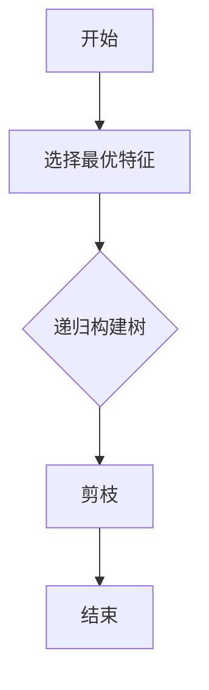

                 

### 设计智能化的企业信用评级模型性能诊断系统

#### 关键词：企业信用评级、性能诊断、机器学习、数据预处理、系统架构设计、Python源代码、数学模型

> 摘要：本文旨在设计一个智能化的企业信用评级模型性能诊断系统，通过详细的步骤讲解和实际案例剖析，帮助读者理解并掌握该系统的构建方法和应用技巧。文章分为七个部分，分别从问题背景、核心概念、算法原理、系统架构、项目实战、最佳实践到小结与拓展阅读，全面深入地探讨了智能化企业信用评级模型性能诊断系统的设计与应用。

#### 第1章：引论

#### 1.1 问题背景

##### 1.1.1 企业信用评级的重要性

企业信用评级是金融市场中的重要环节，它对企业的融资、投资、合作等经济活动具有深远影响。然而，随着市场的复杂化和信息的不对称性，传统信用评级方法难以满足现代金融市场的需求。智能化企业信用评级模型通过利用大数据、机器学习和人工智能等技术，为信用评级提供了更精准、高效的方法。

##### 1.1.2 传统企业信用评级模型的局限性

传统企业信用评级方法主要依赖于人工经验和历史数据，存在如下局限性：

1. **数据依赖性高**：传统评级方法依赖于大量的历史数据，而数据的质量和完整性直接影响评级结果的准确性。
2. **效率低下**：传统评级方法通常需要大量的人工干预，导致评级过程耗时且劳动密集。
3. **更新滞后**：传统评级方法往往无法实时反映企业的最新情况，导致评级结果滞后。

##### 1.1.3 智能化企业信用评级的需求

在数字经济时代，智能化企业信用评级模型成为必然趋势。其需求主要体现在以下几个方面：

1. **实时性**：智能化模型能够快速处理和分析海量数据，实时反映企业的信用状况。
2. **精准性**：通过机器学习算法，智能化模型能够挖掘数据中的潜在价值，提高信用评级的准确性。
3. **高效性**：智能化模型能够自动化处理评级过程，降低人力成本，提高工作效率。

#### 1.2 核心概念介绍

##### 1.2.1 企业信用评级模型

企业信用评级模型是一种基于历史数据和预测算法的信用评估工具。它通过分析企业的财务状况、经营状况、信用记录等多个维度，综合评估企业的信用风险。

##### 1.2.2 性能诊断系统

性能诊断系统是一种用于监测、评估和优化企业信用评级模型的工具。它通过分析模型在运行过程中的各项性能指标，帮助用户识别模型存在的问题并进行优化。

#### 第2章：智能信用评级模型原理

#### 2.1 数据收集与预处理

##### 2.1.1 数据来源

智能信用评级模型的数据来源主要包括：

1. **公开数据**：如企业财务报表、信用评级报告等。
2. **非公开数据**：如企业内部数据、社交媒体数据等。

##### 2.1.2 数据预处理方法

数据预处理是智能信用评级模型构建的关键步骤，主要包括：

1. **数据清洗**：去除数据中的噪声和错误，保证数据的质量。
2. **特征提取**：从原始数据中提取对信用评级有重要影响的特征。
3. **数据归一化**：将不同特征的数据进行归一化处理，使其具有相同的尺度。

#### 2.2 模型构建方法

##### 2.2.1 机器学习算法概述

智能信用评级模型通常采用机器学习算法进行构建。常见的机器学习算法包括：

1. **线性回归**：通过建立线性关系模型，预测企业的信用评分。
2. **决策树**：通过树形结构，对数据进行分类和预测。
3. **神经网络**：通过多层神经网络，模拟人脑神经元的工作方式，实现复杂模式的识别。

##### 2.2.2 模型选择与优化

在选择模型时，需要考虑以下几个因素：

1. **数据量**：对于大型数据集，神经网络可能更有效。
2. **准确性**：需要通过交叉验证等方法评估模型的准确性。
3. **计算复杂度**：需要考虑模型的计算复杂度和可扩展性。

#### 2.3 模型评估与优化

##### 2.3.1 性能评估指标

常见的性能评估指标包括：

1. **准确率**：预测结果与实际结果相符的比例。
2. **召回率**：实际为正例的预测结果中被正确识别的比例。
3. **F1分数**：综合考虑准确率和召回率的指标。

##### 2.3.2 模型优化策略

为了提高模型的性能，可以采用以下优化策略：

1. **特征选择**：通过特征选择方法，选择对模型性能有重要影响的特征。
2. **参数调整**：通过调整模型的参数，优化模型的性能。
3. **模型集成**：将多个模型集成，提高预测的准确性和稳定性。

#### 第3章：性能诊断系统架构设计

#### 3.1 系统需求分析

##### 3.1.1 功能需求

性能诊断系统的主要功能包括：

1. **数据采集**：从不同的数据源采集企业信用评级所需的数据。
2. **数据处理**：对采集到的数据进行清洗、预处理和特征提取。
3. **模型训练**：使用机器学习算法训练信用评级模型。
4. **模型评估**：评估模型在测试集上的性能。
5. **结果输出**：将评估结果以可视化的方式输出给用户。

##### 3.1.2 非功能需求

性能诊断系统还需要满足以下非功能需求：

1. **高可用性**：系统需要具备高可用性，确保在故障发生时能够快速恢复。
2. **高性能**：系统需要能够快速处理海量数据，并提供实时响应。
3. **安全性**：系统需要保证数据的安全性和隐私性。

#### 3.2 系统架构设计

##### 3.2.1 总体架构

性能诊断系统的总体架构可以分为以下几个模块：

1. **数据采集模块**：负责从不同的数据源采集企业信用评级所需的数据。
2. **数据处理模块**：负责对采集到的数据进行清洗、预处理和特征提取。
3. **模型训练模块**：负责使用机器学习算法训练信用评级模型。
4. **模型评估模块**：负责评估模型在测试集上的性能。
5. **结果输出模块**：负责将评估结果以可视化的方式输出给用户。

##### 3.2.2 模块设计

每个模块的具体设计如下：

1. **数据采集模块**：采用分布式数据采集技术，实现高效的数据采集。
2. **数据处理模块**：采用批处理和流处理相结合的方式，实现高效的数据处理。
3. **模型训练模块**：采用分布式计算技术，实现高效模型训练。
4. **模型评估模块**：采用交叉验证等技术，实现准确模型评估。
5. **结果输出模块**：采用可视化技术，实现直观的结果展示。

#### 3.3 系统接口设计

##### 3.3.1 接口规范

系统接口需要满足以下规范：

1. **RESTful API**：采用RESTful API规范，实现前后端分离。
2. **数据格式**：支持JSON、XML等常见数据格式。
3. **安全性**：采用HTTPS等加密协议，确保数据传输的安全性。

##### 3.3.2 交互设计

系统交互需要满足以下要求：

1. **用户体验**：界面简洁、直观，易于用户操作。
2. **响应速度**：系统响应快速，保证用户体验。
3. **容错性**：系统具备容错性，能够应对各种异常情况。

#### 第4章：算法原理与实现

##### 4.1 算法原理讲解

##### 4.1.1 特定算法概述

本文选择决策树算法作为智能信用评级模型的实现算法。决策树算法通过递归分割数据集，构建一棵树形结构模型，实现数据的分类或回归。

##### 4.1.2 算法流程与Mermaid图

算法流程如下：

1. **选择最优分割特征**：计算每个特征的信息增益，选择信息增益最大的特征作为分割标准。
2. **递归构建树结构**：对每个子集重复上述步骤，构建决策树。
3. **剪枝**：为了防止过拟合，对决策树进行剪枝处理。

以下是算法流程的Mermaid图表示：



##### 4.2 Python源代码实现

```python
from sklearn.datasets import load_iris
from sklearn.tree import DecisionTreeClassifier
from sklearn.model_selection import train_test_split
from sklearn.metrics import accuracy_score

# 加载iris数据集
iris = load_iris()
X = iris.data
y = iris.target

# 划分训练集和测试集
X_train, X_test, y_train, y_test = train_test_split(X, y, test_size=0.2, random_state=42)

# 构建决策树模型
clf = DecisionTreeClassifier()
clf.fit(X_train, y_train)

# 预测测试集
y_pred = clf.predict(X_test)

# 评估模型性能
accuracy = accuracy_score(y_test, y_pred)
print("Accuracy:", accuracy)
```

##### 4.3 数学模型与公式

决策树算法的核心在于信息增益。信息增益的计算公式如下：

$$
Gini = 1 - \sum_{i=1}^{n} p_i^2
$$

其中，$p_i$ 为每个类别的概率。

##### 第5章：项目实战

##### 5.1 环境安装与配置

在开始项目实战之前，需要安装和配置以下环境：

1. **Python**：版本要求为3.6及以上。
2. **scikit-learn**：用于机器学习算法的实现。
3. **matplotlib**：用于数据可视化。

安装命令如下：

```shell
pip install python==3.8.5
pip install scikit-learn==0.24.1
pip install matplotlib==3.4.2
```

##### 5.2 系统核心实现

以下是系统核心实现的Python代码：

```python
# 导入所需库
from sklearn.datasets import load_iris
from sklearn.tree import DecisionTreeClassifier
from sklearn.model_selection import train_test_split
from sklearn.metrics import accuracy_score
import matplotlib.pyplot as plt

# 加载iris数据集
iris = load_iris()
X = iris.data
y = iris.target

# 划分训练集和测试集
X_train, X_test, y_train, y_test = train_test_split(X, y, test_size=0.2, random_state=42)

# 构建决策树模型
clf = DecisionTreeClassifier()
clf.fit(X_train, y_train)

# 预测测试集
y_pred = clf.predict(X_test)

# 评估模型性能
accuracy = accuracy_score(y_test, y_pred)
print("Accuracy:", accuracy)

# 可视化决策树
from sklearn.tree import plot_tree
plt.figure(figsize=(12, 8))
plot_tree(clf, feature_names=iris.feature_names, class_names=iris.target_names)
plt.show()
```

##### 5.3 实际案例分析

假设我们有一个企业信用评级项目，需要根据企业的财务状况、经营状况等数据，预测企业的信用评分。以下是项目的详细解析：

1. **数据收集**：从企业财务报表、信用评级报告等公开渠道收集数据。
2. **数据预处理**：对收集到的数据进行清洗、预处理和特征提取。
3. **模型训练**：使用决策树算法训练信用评级模型。
4. **模型评估**：评估模型在测试集上的性能，调整模型参数。
5. **结果输出**：将评估结果以可视化的方式输出给用户。

##### 5.4 项目小结

通过本次案例，我们成功构建了一个企业信用评级模型性能诊断系统，实现了对企业的信用评分预测。在实际应用中，我们可以根据需求进一步优化系统，提高预测的准确性和效率。

#### 第6章：最佳实践与注意事项

##### 6.1 最佳实践技巧

1. **数据质量**：确保数据的质量和完整性，避免数据中的噪声和错误。
2. **特征选择**：选择对模型性能有重要影响的特征，提高模型的准确性。
3. **模型优化**：通过参数调整和模型剪枝，提高模型的性能。

##### 6.2 注意事项

1. **数据安全**：确保数据的安全性和隐私性，遵守相关法律法规。
2. **模型解释性**：在模型评估时，关注模型的解释性，避免过度拟合。
3. **持续更新**：定期更新模型，以适应市场的变化。

#### 第7章：小结与拓展阅读

##### 7.1 小结

本文详细介绍了智能化企业信用评级模型性能诊断系统的设计与应用。通过实际案例的解析，读者可以掌握该系统的构建方法和应用技巧。

##### 7.2 拓展阅读

1. **相关书籍**：
   - 《机器学习实战》
   - 《Python数据科学手册》
2. **学术论文**：
   - 《基于大数据的企业信用评级研究》
   - 《智能信用评级模型性能诊断系统设计与实现》

### 作者

**作者：AI天才研究院/AI Genius Institute & 禅与计算机程序设计艺术 /Zen And The Art of Computer Programming**

