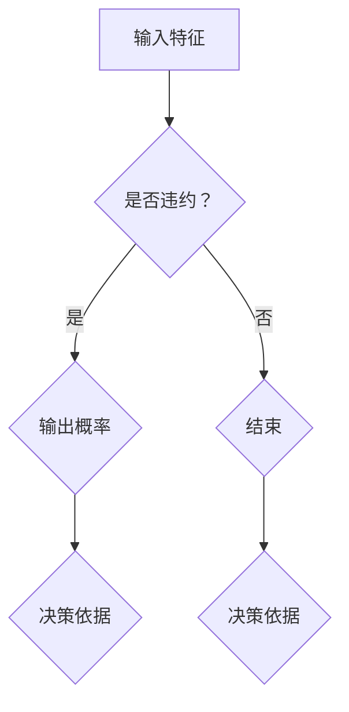
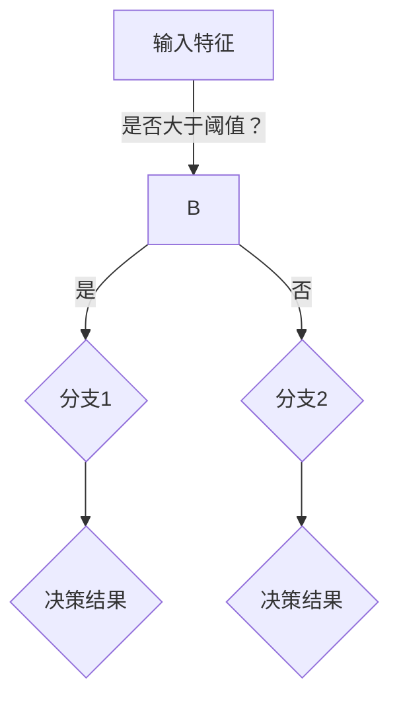
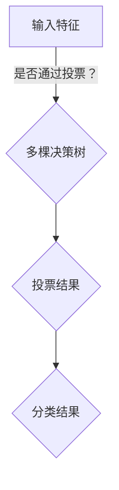

                 

### 引言

#### 问题背景

在当今全球化经济环境下，企业的信用评级成为评估企业财务健康状况、风险管理能力和偿债能力的重要指标。信用评级不仅关系到企业的融资成本、市场声誉，还对供应链管理、合作伙伴选择产生深远影响。然而，传统的信用评级模型往往存在信息不完备、评价标准不统一、更新不及时等问题，导致评级结果难以精确反映企业的真实情况。随着大数据、人工智能等技术的发展，构建智能化企业信用评级模型成为解决这一问题的有效途径。

#### 核心概念

- **信用评级模型**：信用评级模型是一种定量分析工具，用于评估企业的信用风险。传统的信用评级模型主要基于财务报表数据和信用评分模型，而智能化信用评级模型则利用大数据和机器学习算法进行深度分析。

- **智能化系统**：智能化系统是指利用人工智能技术，如机器学习、自然语言处理、数据挖掘等，对大量数据进行处理和分析，以实现自动决策和预测的系统。

- **校准系统**：校准系统是确保智能化信用评级模型准确性和可靠性的关键组成部分。它通过不断的模型训练和评估，调整和优化模型参数，以提高模型的预测性能。

#### 文章结构概述

本书将从以下几个方面详细探讨设计智能化企业信用评级模型校准系统的过程：

1. **背景介绍与核心概念**：介绍企业信用评级的重要性、当前模型的局限性以及智能化信用评级的必要性。
2. **智能化信用评级的基本原理**：探讨信用评级模型的发展历程、智能化信用评级的技术基础。
3. **校准系统的设计与实现**：详细阐述校准系统的设计原则、架构和核心模块。
4. **数据预处理与特征工程**：介绍数据预处理方法和特征工程的关键步骤。
5. **智能化信用评级模型的算法原理**：讲解传统算法和深度学习算法在信用评级中的应用。
6. **校准系统的实现与评估**：通过实际案例分析和代码实现，展示校准系统的应用。
7. **最佳实践与未来展望**：总结最佳实践技巧，并对未来研究方向进行展望。

通过逐步深入分析，本书旨在为读者提供一套完整的智能化企业信用评级模型校准系统的设计与实现指南。

#### 关键词

- 企业信用评级
- 智能化系统
- 信用评级模型
- 数据预处理
- 特征工程
- 校准系统
- 深度学习算法
- 机器学习

#### 摘要

本文围绕设计智能化企业信用评级模型校准系统这一核心主题，系统性地探讨了智能化信用评级的背景、核心概念、基本原理、校准系统设计、数据预处理与特征工程、算法原理以及实现与评估。首先，本文介绍了企业信用评级的重要性以及当前模型的局限性，阐述了智能化信用评级的必要性和基本概念。接着，详细探讨了信用评级模型的发展历程和智能化技术基础，包括机器学习算法、数据挖掘和自然语言处理。随后，本文重点介绍了校准系统的设计原则、架构及其核心模块，包括数据处理、模型训练和预测评估等。在数据预处理与特征工程部分，本文详细介绍了数据清洗、归一化和缺失值处理等步骤，以及特征提取、选择和标准化等关键环节。在算法原理讲解中，本文通过mermaid流程图和Python代码示例，详细阐述了传统算法和深度学习算法在信用评级中的应用。最后，本文通过实际案例分析和代码实现，展示了校准系统的应用效果，并对最佳实践和未来研究方向进行了总结和展望。本文旨在为读者提供一套完整的设计指南，以应对当前企业信用评级面临的挑战。

### 第1章: 背景介绍与核心概念

#### 1.1 问题背景

在当今经济全球化的大背景下，企业信用评级作为评估企业财务健康状况、风险管理能力和偿债能力的重要工具，正日益受到广泛关注。企业信用评级不仅对企业的融资成本、市场声誉产生直接影响，还关系到供应链管理、合作伙伴选择等关键环节。传统的信用评级模型虽然在一定程度上能够满足需求，但随着市场的不断变化和企业数据的日益复杂化，这些模型逐渐暴露出一些局限性。

首先，传统的信用评级模型主要依赖于企业的财务报表数据，这些数据虽然能反映企业的财务状况，但往往不足以全面评估企业的信用风险。例如，财务报表可能未能及时反映企业的现金流状况、市场竞争力或管理层的决策能力。其次，传统的信用评分模型往往是静态的，缺乏动态调整的能力，难以适应快速变化的市场环境。此外，由于不同评级机构采用的评分标准和模型算法存在差异，导致评级结果不一致，增加了信息的不对称性和不确定性。

#### 1.2 问题描述

为了解决传统信用评级模型的局限性，构建智能化企业信用评级模型成为一种新的尝试。然而，这一过程中也面临着一系列挑战：

- **数据质量问题**：信用评级模型的准确性高度依赖于输入数据的质量。然而，企业数据来源广泛，数据类型多样，数据质量参差不齐。如何进行有效的数据清洗和预处理，确保数据的一致性和准确性，成为智能化信用评级系统面临的第一个难题。

- **模型选择问题**：传统的信用评分模型主要依赖于线性回归、逻辑回归等简单模型，而智能化信用评级模型则需要更复杂、更高级的算法。如何选择合适的机器学习算法，以提升模型的预测能力和可靠性，是智能化信用评级系统需要解决的关键问题。

- **模型校准问题**：智能化信用评级模型在实际应用中需要不断调整和优化，以适应不同的市场环境和数据特征。如何设计一个高效的校准系统，确保模型的稳定性和准确性，是智能化信用评级系统的核心挑战之一。

#### 1.3 问题解决

为了应对上述挑战，设计智能化企业信用评级模型校准系统成为一种有效的解决方案。这一系统通过引入大数据、人工智能等技术，实现对大量企业数据的深度分析和挖掘，从而提供更为准确和全面的信用评级结果。

首先，智能化信用评级系统需要对数据进行有效的清洗和预处理，包括数据清洗、归一化、缺失值处理等步骤，确保数据的一致性和准确性。其次，系统需要根据不同企业的特点和需求，选择合适的机器学习算法，如决策树、随机森林、支持向量机、神经网络等，以构建高预测性能的信用评级模型。最后，系统设计一个高效的校准机制，通过模型训练、评估和反馈，不断优化和调整模型参数，提高模型的稳定性和准确性。

#### 1.4 边界与外延

智能化企业信用评级模型校准系统不仅在金融领域具有重要的应用价值，还可以拓展到其他行业和领域。例如，在供应链管理中，企业信用评级可以帮助企业评估合作伙伴的信用状况，降低供应链风险；在投资决策中，企业信用评级可以为投资者提供重要的决策依据，降低投资风险。

此外，随着技术的不断进步和数据的不断积累，智能化企业信用评级模型校准系统有望进一步提升其预测能力和适应性。例如，通过引入深度学习算法和自然语言处理技术，系统可以更准确地捕捉企业非结构化数据中的潜在风险信息，提供更精准的信用评级结果。

#### 1.5 概念结构与核心要素组成

智能化企业信用评级模型校准系统由多个核心要素组成，包括数据源、数据处理模块、模型训练与校准模块、预测评估模块等。

- **数据源**：包括企业的财务报表数据、运营数据、市场数据、社会信用数据等，是构建信用评级模型的基础。
- **数据处理模块**：负责对数据进行清洗、归一化、缺失值处理等预处理操作，确保数据的一致性和准确性。
- **模型训练与校准模块**：利用机器学习算法对数据进行训练，构建信用评级模型。通过不断调整和优化模型参数，提高模型的预测性能。
- **预测评估模块**：使用训练好的模型对企业的信用进行预测和评估，通过评估结果对模型进行反馈和调整，实现模型的持续优化。

通过这些核心要素的协同作用，智能化企业信用评级模型校准系统可以提供高效、准确的信用评级服务，为企业、投资者、监管机构等提供可靠的决策依据。

#### 1.6 核心概念

**信用评级模型**：信用评级模型是一种用于评估企业信用风险的定量分析工具。传统的信用评级模型主要基于财务报表数据和信用评分模型，而智能化信用评级模型则利用大数据和机器学习算法进行深度分析。

**智能化系统**：智能化系统是指利用人工智能技术，如机器学习、自然语言处理、数据挖掘等，对大量数据进行处理和分析，以实现自动决策和预测的系统。

**校准系统**：校准系统是确保智能化信用评级模型准确性和可靠性的关键组成部分。它通过不断的模型训练和评估，调整和优化模型参数，以提高模型的预测性能。

通过以上对核心概念和背景介绍的详细阐述，我们为后续章节的深入讨论奠定了基础，接下来将进一步探讨智能化信用评级的基本原理和关键技术。

#### 1.7 小结

本章首先介绍了企业信用评级的重要性以及当前信用评级模型的局限性，详细分析了构建智能化信用评级模型的必要性和面临的挑战。接着，本文提出了智能化企业信用评级模型校准系统作为解决这些问题的有效途径，并探讨了系统的边界与外延。此外，本章还详细阐述了智能化企业信用评级模型校准系统的概念结构与核心要素组成，为后续章节的内容奠定了坚实的基础。通过这些内容的介绍，读者可以初步了解智能化信用评级模型校准系统的概念和重要性，为后续的深入学习做好准备。

### 第2章: 智能化信用评级的基本原理

#### 2.1 智能化信用评级的基本概念

**信用评级**：信用评级是一种对企业、机构或个人的信用状况进行评价的过程。它通常基于财务数据、市场表现、历史信用记录等因素，评估其偿债能力和信用风险。信用评级的结果通常以信用等级的形式呈现，如AA、A、BBB等。

**智能化信用评级**：智能化信用评级则是在传统信用评级基础上，引入大数据、人工智能、机器学习等先进技术，通过深度学习和数据分析，对信用风险进行更加精准和动态的评估。这种评级方法不仅利用了传统数据源，还包含了非结构化数据（如社交媒体信息、新闻报道等），从而提供更全面和准确的信用评估。

**基本概念**：

- **信用评分模型**：信用评分模型是一种将企业或个人的财务信息转化为信用分数的数学模型。常见的模型包括逻辑回归、决策树、支持向量机等。

- **预测准确性**：预测准确性是指信用评级模型预测结果的准确程度。高预测准确性意味着模型能够更准确地评估信用风险。

- **鲁棒性**：鲁棒性是指模型在应对数据噪声和异常值时的稳定性。一个鲁棒的信用评级模型能够在数据质量参差不齐的情况下仍保持良好的性能。

#### 2.2 信用评级模型的发展历程

**传统信用评级模型**：

- **早期模型**：早期的信用评级主要依赖于专家评估和经验判断，缺乏系统性和量化方法。

- **结构化模型**：随着计算机技术的发展，传统信用评级开始引入结构化模型，如逻辑回归、线性回归等。这些模型通过分析企业的财务报表数据，如收入、利润、负债等，生成信用评分。

- **评分卡模型**：评分卡模型是传统信用评级中广泛应用的一种模型，它将不同的财务指标和特征进行加权求和，生成一个综合信用评分。评分卡模型具有标准化、可解释性强等特点。

**现代信用评级模型**：

- **大数据与机器学习**：现代信用评级模型利用大数据和机器学习技术，通过分析海量的非结构化数据，如社交媒体信息、新闻报道、市场表现等，来预测信用风险。常见的机器学习算法包括决策树、随机森林、支持向量机、神经网络等。

- **深度学习**：深度学习是一种基于人工神经网络的高级机器学习技术。它在处理复杂数据和特征时表现出色，能够从大量非结构化数据中自动提取特征，提高信用评级的预测准确性。

**发展趋势**：

- **模型集成**：通过结合多种算法和模型，如集成学习、迁移学习等，进一步提升信用评级的预测性能。

- **实时更新**：随着数据获取和处理技术的进步，信用评级模型能够实现实时更新，更快速地反映企业的信用状况。

#### 2.3 智能化信用评级的技术基础

**机器学习算法**：

- **监督学习**：监督学习算法（如逻辑回归、支持向量机、决策树等）通过已标记的数据进行训练，预测未知数据的标签。在信用评级中，监督学习算法常用于构建信用评分模型。

- **无监督学习**：无监督学习算法（如聚类、主成分分析等）用于发现数据中的模式和结构，不依赖于已标记的数据。在信用评级中，无监督学习可以用于数据降维、特征提取等。

- **半监督学习**：半监督学习结合了监督学习和无监督学习的优点，利用少量标记数据和大量未标记数据进行训练，提高模型的泛化能力。

**数据挖掘技术**：

- **数据预处理**：数据预处理包括数据清洗、归一化、缺失值处理等，是确保数据质量和模型性能的重要步骤。

- **特征提取**：特征提取是从原始数据中提取对模型训练和预测有重要意义的特征。特征提取可以增强模型的预测能力，减少数据维度。

- **特征选择**：特征选择是选择对模型性能有显著影响的关键特征，避免过拟合和模型过复杂。

**自然语言处理**：

- **文本分析**：自然语言处理技术用于处理非结构化文本数据，如社交媒体评论、新闻报道等。通过文本分析，可以提取与信用评级相关的关键词和情感倾向。

- **情感分析**：情感分析是一种通过文本挖掘技术识别文本中情感极性的方法，可以帮助评估企业的公众形象和市场表现。

- **实体识别与关系抽取**：实体识别与关系抽取是从文本中识别和提取实体及其关系的任务，有助于理解企业的业务关系和社会影响。

#### 2.4 智能化信用评级在实践中的应用

**金融行业**：

- **贷款审批**：金融机构通过智能化信用评级模型，快速评估客户的信用状况，提高审批效率和准确性。

- **风险管理**：金融机构利用信用评级模型进行风险管理和决策支持，降低信用风险。

**供应链管理**：

- **合作伙伴评估**：企业通过智能化信用评级模型评估供应链合作伙伴的信用风险，优化合作伙伴选择和风险管理。

- **应收账款管理**：企业通过信用评级模型评估客户的信用风险，制定更有效的应收账款管理策略。

**投资决策**：

- **企业信用评估**：投资者通过智能化信用评级模型评估潜在投资对象的信用风险，制定投资策略。

- **市场预测**：投资者利用信用评级模型分析市场趋势和企业信用状况，进行市场预测和投资决策。

通过以上对智能化信用评级的基本概念、发展历程和技术基础的详细探讨，我们可以看到，智能化信用评级不仅在理论上具有重要意义，还在实际应用中展现出强大的潜力和广泛的前景。下一章将深入探讨智能化信用评级的具体技术细节和实现方法。

#### 2.5 小结

本章详细探讨了智能化信用评级的基本概念、发展历程和技术基础。首先，我们介绍了信用评级的定义和智能化信用评级的优势，明确了信用评分模型和预测准确性的重要性。接着，回顾了信用评级模型从传统方法到现代方法的发展历程，探讨了大数据和机器学习在信用评级中的应用。在技术基础部分，我们深入讲解了机器学习算法、数据挖掘技术和自然语言处理在信用评级中的具体应用。最后，通过实际案例展示了智能化信用评级在金融、供应链管理和投资决策等领域的应用，强调了其在提升信用评估准确性和效率方面的作用。这些内容为后续章节的深入探讨奠定了基础。

### 第3章: 校准系统的设计与实现

#### 3.1 校准系统的设计原则

设计一个高效的校准系统是确保智能化企业信用评级模型准确性和可靠性的关键。以下是校准系统设计过程中应遵循的一些基本原则：

**可靠性**：校准系统的核心目标是确保信用评级结果的可靠性和一致性。系统需要能够处理各种复杂的数据源，并在各种情况下保持稳定的性能。

**可扩展性**：随着企业规模和数据量的增长，校准系统需要具备良好的可扩展性，以便在增加计算资源和数据量时能够灵活调整和扩展。

**实时性**：企业信用评级需要快速响应市场变化和客户需求，因此校准系统应具备实时数据处理和分析能力，以提供及时的信用评级结果。

**数据安全性**：保护企业数据和客户隐私是校准系统的另一个重要原则。系统应采用先进的安全技术和策略，确保数据在存储、传输和处理过程中得到充分保护。

**易维护性**：校准系统应设计得易于维护和升级，以便在技术更新或系统优化时能够快速响应。

**用户友好性**：校准系统应提供直观易用的用户界面，便于用户进行操作和数据管理。

#### 3.2 校准系统的架构

校准系统的架构设计需要综合考虑系统的功能性、可扩展性和易维护性。以下是校准系统的总体架构设计：

**1. 系统总体架构**

校准系统的总体架构可以分为四个主要模块：数据输入模块、数据处理模块、模型训练与校准模块、预测与评估模块。

- **数据输入模块**：负责接收各种来源的数据，包括财务报表数据、市场数据、社交媒体数据等。该模块需要确保数据的一致性和完整性。

- **数据处理模块**：对输入的数据进行清洗、归一化和缺失值处理，以提升数据质量。这一模块还包括数据存储和数据管理等子模块。

- **模型训练与校准模块**：利用机器学习算法对处理后的数据进行训练，构建信用评级模型。该模块需要支持多种机器学习算法，并提供模型参数调整和校准功能。

- **预测与评估模块**：使用训练好的模型对企业的信用进行预测和评估，并生成信用评分报告。该模块还需要对模型性能进行实时评估和反馈，以实现模型的持续优化。

**2. 数据处理模块**

数据处理模块是校准系统的核心组成部分，其详细架构如下：

- **数据清洗子模块**：负责处理数据中的噪声和异常值，确保数据的一致性和准确性。该子模块包括数据去重、缺失值填补、数据格式转换等功能。

- **数据归一化子模块**：将不同单位或量纲的数据转换到同一标准，以便模型训练和处理。常见的归一化方法包括最小-最大缩放、Z分数缩放等。

- **缺失值处理子模块**：处理数据中的缺失值，可以采用插值、均值填补或删除缺失值等方法。

- **数据存储与管理子模块**：负责数据的高效存储和管理，包括数据的持久化存储、数据备份与恢复、数据访问控制等功能。

**3. 模型训练与校准模块**

模型训练与校准模块的详细架构如下：

- **数据预处理子模块**：对输入数据进行预处理，包括特征提取、特征选择和特征标准化等步骤，以提高模型训练的效率。

- **模型训练子模块**：使用机器学习算法对预处理后的数据进行训练，包括训练数据集的划分、算法选择、参数调整等功能。

- **模型评估子模块**：对训练好的模型进行性能评估，包括准确性、召回率、F1分数等指标，以确定模型是否满足要求。

- **模型校准子模块**：对模型进行实时校准和优化，包括模型参数调整、超参数调优、交叉验证等步骤，以提升模型预测性能。

**4. 预测与评估模块**

预测与评估模块的详细架构如下：

- **预测子模块**：使用训练好的模型对新的数据进行信用评分预测，生成信用评分报告。

- **评估子模块**：对预测结果进行评估，包括比较预测结果与实际结果的差异，计算评估指标等。

- **反馈与更新子模块**：根据评估结果对模型进行反馈和更新，实现模型的持续优化。

通过以上对校准系统设计原则和架构的详细阐述，我们可以看到，一个高效的校准系统不仅需要严谨的设计原则，还需要科学的架构设计。这些原则和设计思想为后续的详细实现提供了坚实的理论基础。

#### 3.3 校准系统的实现步骤

实现一个高效的校准系统需要遵循一系列明确的步骤，从数据收集到模型训练、校准和评估，每一个环节都至关重要。以下是校准系统的具体实现步骤：

**1. 数据收集**

数据收集是校准系统的第一步，也是至关重要的一步。数据来源可以包括企业的财务报表、信用记录、市场数据、社交媒体信息等。为了确保数据的全面性和准确性，系统需要设计多种数据收集渠道，如企业财务系统、第三方数据服务商、公开数据源等。

**2. 数据清洗**

数据收集完成后，需要对数据进行清洗，以去除噪声和异常值，确保数据的一致性和准确性。数据清洗过程通常包括以下步骤：

- **去重**：去除重复的数据条目，保证数据的唯一性。
- **缺失值处理**：对于缺失的数据，可以采用插值、均值填补或删除缺失值等方法进行处理。
- **格式转换**：将不同格式的数据转换为统一的格式，如将文本数据转换为数值数据。
- **数据验证**：对数据进行验证，确保数据满足特定的业务规则。

**3. 数据归一化**

数据归一化是将不同单位或量纲的数据转换为同一标准，以便于模型训练和处理。常见的归一化方法包括最小-最大缩放（Min-Max Scaling）和Z分数缩放（Z-Score Scaling）。归一化可以防止某些特征对模型产生过大的影响。

**4. 特征提取与选择**

特征提取是从原始数据中提取对模型训练和预测有重要意义的特征。特征选择则是从提取出的特征中筛选出对模型性能有显著影响的关键特征，以避免过拟合和模型过复杂。常用的特征提取方法包括主成分分析（PCA）、因子分析（FA）等。特征选择方法包括递归特征消除（RFE）、L1正则化等。

**5. 模型训练**

模型训练是构建信用评级模型的关键步骤。根据不同的业务需求和数据特征，可以选择不同的机器学习算法进行训练。常见的算法包括逻辑回归、决策树、随机森林、支持向量机（SVM）和神经网络等。在训练过程中，需要划分训练集和测试集，使用训练集进行模型训练，使用测试集进行模型评估。

**6. 模型评估**

模型评估是验证模型性能的重要步骤。通过评估指标，如准确性、召回率、F1分数等，可以评估模型的预测性能。如果模型性能不满足要求，需要返回前一个步骤进行调整，如重新选择特征、调整模型参数等。

**7. 模型校准**

模型校准是提高模型预测准确性的重要手段。通过不断地调整和优化模型参数，可以实现模型的持续优化。模型校准可以采用交叉验证、网格搜索等技术。此外，还可以引入一些技术，如集成学习（Ensemble Learning）、迁移学习（Transfer Learning）等，进一步提升模型的性能。

**8. 预测与实时评估**

在模型训练和校准完成后，系统可以开始进行信用评分预测。预测过程需要实时评估，确保模型能够动态适应数据变化。实时评估可以通过定期更新模型、引入新的数据源等方式实现。

**9. 系统部署与维护**

最后，将校准系统部署到生产环境中，进行实际应用。系统部署后，需要定期进行维护和更新，包括数据更新、模型优化、系统升级等，以确保系统的稳定性和性能。

通过以上详细阐述的校准系统实现步骤，我们可以看到，一个高效的校准系统不仅需要科学的设计和实现方法，还需要严格的维护和更新策略。这些步骤为构建智能化企业信用评级模型提供了完整的实现指南。

#### 3.4 实现过程中可能遇到的挑战与解决方案

在设计并实现智能化企业信用评级模型校准系统的过程中，可能会遇到多种技术和管理上的挑战。以下是这些挑战及相应的解决方案：

**1. 数据质量挑战**

**问题**：企业数据来源广泛，数据质量参差不齐。存在噪声、异常值和缺失值，这些都会影响模型性能。

**解决方案**：实施严格的数据清洗和预处理流程。使用自动化工具和规则来识别和处理噪声和异常值。采用多种插补方法来填补缺失值，如均值填补、中值填补、多重插补等。

**2. 模型选择挑战**

**问题**：选择适合特定业务需求的机器学习算法是一个复杂的过程。不同的算法适用于不同类型的数据和预测任务。

**解决方案**：进行算法性能比较和模型选择。使用交叉验证等技术评估不同算法的性能。结合业务需求和数据特征，选择最优算法。

**3. 模型解释性挑战**

**问题**：深度学习算法在信用评级中的应用日益广泛，但其“黑箱”特性使得模型解释性成为一个挑战。

**解决方案**：引入可解释性方法，如局部可解释模型（LIME）和SHAP（SHapley Additive exPlanations）。通过这些方法，可以更好地理解模型决策过程。

**4. 数据安全与隐私保护挑战**

**问题**：信用评级系统需要处理大量敏感数据，数据安全和隐私保护是关键。

**解决方案**：采用加密技术来保护数据。遵循数据保护法规，如GDPR（通用数据保护条例）和CCPA（加利福尼亚消费者隐私法）。在设计数据流程时，采取匿名化和去标识化措施。

**5. 系统可扩展性与实时性挑战**

**问题**：随着数据量和用户量的增加，系统需要具备良好的可扩展性和实时性。

**解决方案**：采用分布式架构和云服务来提升系统的可扩展性。引入实时数据处理框架，如Apache Kafka和Apache Flink，以实现实时信用评分预测。

**6. 模型更新与维护挑战**

**问题**：信用评级模型需要定期更新和维护，以确保其适应不断变化的市场环境。

**解决方案**：建立自动化模型更新和维护流程。定期收集新的数据，重新训练和校准模型。采用持续集成和持续部署（CI/CD）实践，简化模型更新过程。

通过识别并应对这些挑战，可以确保智能化企业信用评级模型校准系统的稳定性和可靠性，从而提供高质量的信用评级服务。

#### 3.5 小结

本章详细探讨了校准系统的设计与实现过程。首先，明确了校准系统的设计原则，包括可靠性、可扩展性、实时性、数据安全性和易维护性。接着，介绍了校准系统的总体架构，包括数据输入模块、数据处理模块、模型训练与校准模块、预测与评估模块。随后，详细描述了校准系统的实现步骤，从数据收集、数据清洗、数据归一化、特征提取与选择、模型训练到模型评估和模型校准。此外，还讨论了在实现过程中可能遇到的挑战及相应的解决方案。通过这些内容的介绍，本章为读者提供了构建高效智能化企业信用评级模型校准系统的全面指南。

### 第4章: 数据预处理与特征工程

#### 4.1 数据预处理

数据预处理是构建任何机器学习模型的重要步骤，对于智能化企业信用评级模型来说，数据预处理的质量直接关系到模型的性能和可靠性。数据预处理主要包括数据清洗、数据归一化和缺失值处理等步骤。

**1. 数据清洗**

数据清洗的目的是去除数据中的噪声、异常值和重复数据，确保数据的一致性和准确性。

- **去重**：通过比对数据条目，去除重复的数据条目，确保数据库的唯一性和完整性。
- **异常值处理**：识别和处理数据中的异常值。可以使用统计学方法，如基于三倍标准差的方法，或者使用基于规则的方法，如拒绝阈值规则等。
- **数据格式转换**：将不同格式的数据转换为统一的格式，以便后续处理。例如，将文本数据转换为数值数据。

**2. 数据归一化**

数据归一化是将不同特征的数据转换到相同的尺度，以便模型训练和处理。常见的归一化方法包括：

- **最小-最大缩放**（Min-Max Scaling）：将数据缩放到[0, 1]或[-1, 1]区间。公式如下：
  $$ x_{\text{norm}} = \frac{x - x_{\text{min}}}{x_{\text{max}} - x_{\text{min}}} $$
- **Z分数缩放**（Z-Score Scaling）：将数据缩放到标准正态分布。公式如下：
  $$ x_{\text{norm}} = \frac{x - \mu}{\sigma} $$
  其中，$\mu$为数据的均值，$\sigma$为数据的标准差。

**3. 缺失值处理**

缺失值处理是数据预处理的重要环节，因为缺失值会影响模型的训练和预测结果。

- **插值**：通过插值方法填补缺失值，如线性插值、多项式插值等。
- **均值填补**：用特征的均值填补缺失值。
- **中值填补**：用特征的中值填补缺失值。
- **多重插补**：通过多次插值和随机填补方法，生成多个填补方案，然后对结果进行平均。

**4. 数据验证**

数据验证是确保数据质量的重要步骤。通过设置业务规则和阈值，可以识别和处理不符合预期条件的数据。常见的验证方法包括：

- **业务规则验证**：根据业务逻辑和规则，检查数据的合法性。例如，检查收入不能为负数。
- **阈值验证**：根据历史数据和统计指标，设置阈值范围。例如，检查收入是否在合理的范围内。

**5. 数据可视化**

数据可视化是帮助理解和分析数据的有效方法。通过可视化，可以直观地发现数据中的异常、趋势和关系。常用的可视化工具包括matplotlib、seaborn等。

通过以上数据预处理步骤，我们可以确保数据的一致性、准确性和完整性，为后续的特征工程和模型训练打下坚实基础。

#### 4.2 特征工程

特征工程是提升模型性能的关键步骤，它包括特征提取、特征选择和特征标准化等。

**1. 特征提取**

特征提取是从原始数据中提取对模型训练和预测有重要意义的特征。常见的特征提取方法包括：

- **统计特征**：基于数据的统计属性，如均值、标准差、最大值、最小值、方差等。这些特征可以捕捉数据的基本信息。
- **文本特征**：利用自然语言处理技术提取文本数据中的关键词、情感倾向、词频等特征。
- **时间序列特征**：从时间序列数据中提取周期性、趋势性、季节性等特征。

**2. 特征选择**

特征选择是从提取出的特征中筛选出对模型性能有显著影响的关键特征。常用的特征选择方法包括：

- **过滤式特征选择**：基于特征的重要性或相关性，如互信息、卡方检验等，直接筛选出重要的特征。
- **包裹式特征选择**：基于模型的性能，逐个选择特征，并评估对模型性能的影响。
- **递归特征消除（RFE）**：通过递归地删除对模型性能贡献最小的特征，逐步筛选出重要的特征。

**3. 特征标准化**

特征标准化是将不同特征的数据转换到相同的尺度，以便模型训练和处理。常见的特征标准化方法包括：

- **最小-最大缩放**：将数据缩放到[0, 1]区间。
- **Z分数缩放**：将数据缩放到标准正态分布。

**4. 特征组合**

特征组合是将多个特征组合成新的特征，以增强模型的预测能力。常见的特征组合方法包括：

- **特征交叉**：将两个或多个特征进行交叉组合，形成新的特征。
- **特征聚合**：将多个特征进行聚合，如求和、平均等，形成新的特征。

通过有效的特征工程，我们可以提升模型的预测性能，减少过拟合现象，提高模型的泛化能力。

#### 4.3 实际应用案例

**案例背景**：某金融公司希望利用智能化信用评级模型对其客户进行信用评分，以便于贷款审批和风险管理。

**数据源**：公司收集了客户的财务报表数据、市场数据、社交媒体数据等。

**数据预处理**：

- **数据清洗**：去除重复数据、异常值，确保数据的一致性和准确性。
- **数据归一化**：对财务报表数据、市场数据等进行归一化处理，如将收入、利润等数据缩放到[0, 1]区间。
- **缺失值处理**：对缺失的财务数据采用均值填补方法，对社交媒体数据中的缺失值采用多重插补方法。

**特征提取与选择**：

- **财务报表特征**：提取收入、利润、负债比等财务指标作为基础特征。
- **市场特征**：提取行业增长率、市场波动率等市场指标作为辅助特征。
- **社交媒体特征**：提取社交媒体中关键词的出现频率、情感倾向等作为文本特征。
- **特征选择**：使用递归特征消除（RFE）方法，筛选出对模型性能有显著影响的关键特征。

**模型训练与评估**：

- **模型选择**：使用随机森林算法进行模型训练，并进行交叉验证以选择最佳模型参数。
- **模型评估**：使用准确率、召回率、F1分数等指标评估模型性能，并根据评估结果调整特征和模型参数。

**实际应用**：

- **贷款审批**：使用训练好的模型对客户的信用评分进行预测，根据评分结果进行贷款审批。
- **风险管理**：利用模型进行风险预警，识别潜在的信用风险客户，采取相应的风险管理措施。

通过以上步骤，该公司成功构建了一个高效的智能化信用评级模型，提高了贷款审批效率和风险管理能力。

#### 4.4 小结

本章详细探讨了数据预处理与特征工程的重要性以及具体实现方法。首先，介绍了数据预处理步骤，包括数据清洗、数据归一化和缺失值处理。然后，阐述了特征提取与选择的方法，包括统计特征、文本特征和时间序列特征等。最后，通过实际应用案例展示了数据预处理和特征工程在智能化信用评级模型中的应用。通过本章的学习，读者可以掌握数据预处理与特征工程的基本方法和实践技巧，为后续的模型训练和评估奠定基础。

### 第5章: 智能化信用评级模型的算法原理

#### 5.1 算法概述

在智能化信用评级模型中，选择合适的算法至关重要。传统算法和深度学习算法是当前应用最广泛的两种类型。传统算法主要包括逻辑回归、决策树、随机森林等，这些算法在信用评级领域已有广泛应用。深度学习算法则包括卷积神经网络（CNN）、循环神经网络（RNN）和变分自编码器（VAE）等，这些算法在处理复杂数据和提取深层特征方面具有显著优势。

#### 5.2 传统算法

**逻辑回归**：逻辑回归是一种广义线性模型，常用于分类问题。在信用评级中，逻辑回归通过线性组合输入特征，生成概率输出，用于预测企业是否违约。其数学模型为：
$$
P(Y=1|X) = \frac{1}{1 + e^{-\beta_0 + \beta_1x_1 + \beta_2x_2 + \ldots + \beta_nx_n}}
$$
其中，$P(Y=1|X)$表示企业违约的概率，$\beta_0, \beta_1, \beta_2, \ldots, \beta_n$是模型参数。

**决策树**：决策树通过一系列条件判断来划分数据集，每个节点代表一个特征和阈值，叶子节点代表分类结果。决策树的分类规则可以表示为：
$$
\text{if } x_1 \leq t_1 \text{ then go to node } n_1 \\
\text{else if } x_2 \leq t_2 \text{ then go to node } n_2 \\
\ldots \\
\text{else if } x_m \leq t_m \text{ then go to node } n_m \\
\text{else go to leaf node }
$$
其中，$x_1, x_2, \ldots, x_m$是输入特征，$t_1, t_2, \ldots, t_m$是阈值，$n_1, n_2, \ldots, n_m$是后续节点。

**随机森林**：随机森林是一种基于决策树的集成学习方法，通过构建多个决策树，并对预测结果进行投票来提高模型的稳定性和准确性。随机森林的核心思想是利用随机抽样和特征选择来生成多个决策树，并通过多数投票来得出最终预测结果。

#### 5.3 深度学习算法

**卷积神经网络（CNN）**：卷积神经网络是一种专门用于处理图像数据的深度学习算法。它通过卷积层、池化层和全连接层来提取图像特征。CNN的核心优势在于其能够自动提取图像中的高层次特征，从而实现高效的分类和识别。CNN的分类规则可以表示为：
$$
\text{output} = \text{activation}\left(\sum_{i=1}^{n} w_i \times \text{input}_i + b\right)
$$
其中，$w_i$是权重，$\text{input}_i$是输入特征，$b$是偏置项，$\text{activation}$是激活函数。

**循环神经网络（RNN）**：循环神经网络是一种用于处理序列数据的深度学习算法。RNN通过存储和利用先前的信息来处理序列数据，其核心优势在于其能够捕捉时间序列中的长期依赖关系。RNN的分类规则可以表示为：
$$
h_t = \text{sigmoid}\left(W \cdot [h_{t-1}, x_t] + b\right)
$$
其中，$h_t$是当前时刻的隐藏状态，$x_t$是当前时刻的输入特征，$W$是权重矩阵，$b$是偏置项，$\text{sigmoid}$是激活函数。

**变分自编码器（VAE）**：变分自编码器是一种基于概率模型的深度学习算法，它通过编码和解码器来生成新的数据。VAE通过最大化数据分布和先验分布之间的相似性来学习数据特征。VAE的核心规则可以表示为：
$$
\begin{aligned}
\mu &= \text{encoder}(x) \\
\sigma &= \text{encoder}(x) \\
z &= \text{reparameterization}(\mu, \sigma) \\
x' &= \text{decoder}(z)
\end{aligned}
$$
其中，$x$是输入特征，$\mu$和$\sigma$是编码器输出的均值和标准差，$z$是重新参数化后的噪声变量，$x'$是解码器生成的特征。

#### 5.4 Mermaid流程图展示

为了更好地理解上述算法的原理，我们可以使用Mermaid流程图进行展示。以下是逻辑回归、决策树和随机森林的Mermaid流程图：

**逻辑回归**：


**决策树**：


**随机森林**：


通过这些流程图，我们可以直观地理解这些算法的决策过程。

#### 5.5 Python代码示例

以下是一个简单的逻辑回归Python代码示例，用于信用评级模型的训练和预测：

```python
import numpy as np
import pandas as pd
from sklearn.linear_model import LogisticRegression
from sklearn.model_selection import train_test_split
from sklearn.metrics import accuracy_score

# 加载数据
data = pd.read_csv('credit_data.csv')
X = data.drop('default', axis=1)
y = data['default']

# 数据预处理
X = (X - X.mean()) / X.std()

# 划分训练集和测试集
X_train, X_test, y_train, y_test = train_test_split(X, y, test_size=0.2, random_state=42)

# 训练模型
model = LogisticRegression()
model.fit(X_train, y_train)

# 预测
y_pred = model.predict(X_test)

# 评估
accuracy = accuracy_score(y_test, y_pred)
print(f'模型准确率：{accuracy}')
```

通过以上代码，我们可以构建一个逻辑回归信用评级模型，并对其进行训练和评估。

#### 5.6 数学模型与公式

逻辑回归的数学模型可以表示为：
$$
\text{logit}(P) = \ln\left(\frac{P}{1-P}\right) = \beta_0 + \beta_1x_1 + \beta_2x_2 + \ldots + \beta_nx_n
$$
其中，$P$表示企业违约的概率，$\text{logit}$是逻辑函数，$\beta_0, \beta_1, \beta_2, \ldots, \beta_n$是模型参数。

对于决策树，分类规则可以表示为：
$$
\text{if } x_1 \leq t_1 \text{ then go to node } n_1 \\
\text{else if } x_2 \leq t_2 \text{ then go to node } n_2 \\
\ldots \\
\text{else if } x_m \leq t_m \text{ then go to node } n_m \\
\text{else go to leaf node }
$$
其中，$x_1, x_2, \ldots, x_m$是输入特征，$t_1, t_2, \ldots, t_m$是阈值，$n_1, n_2, \ldots, n_m$是后续节点。

随机森林的决策规则可以表示为：
$$
\text{output} = \frac{1}{T} \sum_{t=1}^{T} \text{tree_output}(x)
$$
其中，$T$是决策树的数量，$\text{tree_output}(x)$是第$t$棵决策树的输出。

通过以上数学模型和公式的详细讲解，我们可以深入理解这些算法在信用评级模型中的应用原理。

#### 5.7 举例说明

为了更好地理解算法原理，我们通过一个简单的例子来说明。

**例子**：假设我们要预测一家企业的违约概率，输入特征包括收入、利润和负债比。收入、利润和负债比的取值范围分别为[10000, 50000]，[10000, 30000]和[0.2, 1.0]。

- 收入：20000
- 利润：15000
- 负债比：0.5

**使用逻辑回归预测**：

首先，我们需要对特征进行归一化处理，然后输入到逻辑回归模型中。假设归一化后的特征分别为$x_1, x_2, x_3$，模型参数为$\beta_0, \beta_1, \beta_2$。

归一化处理：
$$
x_1 = \frac{20000 - 10000}{50000 - 10000} = 0.4 \\
x_2 = \frac{15000 - 10000}{30000 - 10000} = 0.5 \\
x_3 = \frac{0.5 - 0.2}{1.0 - 0.2} = 0.15
$$

输入到逻辑回归模型：
$$
\text{logit}(P) = \beta_0 + \beta_1x_1 + \beta_2x_2 + \beta_3x_3
$$

假设模型参数为$\beta_0 = -5, \beta_1 = 1, \beta_2 = 2, \beta_3 = 1$，则：
$$
\text{logit}(P) = -5 + 1 \times 0.4 + 2 \times 0.5 + 1 \times 0.15 = -4.85
$$

违约概率：
$$
P = \frac{1}{1 + e^{-\text{logit}(P)}} = \frac{1}{1 + e^{4.85}} \approx 0.995
$$

**结论**：根据计算结果，该企业的违约概率接近99.5%，说明其具有较高的违约风险。

通过这个简单的例子，我们可以看到逻辑回归在信用评级中的应用及其预测过程。类似的方法也可以应用于其他算法，如决策树和随机森林。

#### 5.8 小结

本章详细介绍了智能化信用评级模型中常用的传统算法和深度学习算法，包括逻辑回归、决策树、随机森林、卷积神经网络（CNN）、循环神经网络（RNN）和变分自编码器（VAE）。通过Mermaid流程图和Python代码示例，我们深入探讨了这些算法的原理和应用。同时，通过举例说明，我们展示了如何使用这些算法进行信用评级预测。通过本章的学习，读者可以掌握信用评级模型中关键算法的原理和应用方法，为实际项目中的模型构建和优化打下坚实基础。

### 第6章: 校准系统的实现与评估

#### 6.1 系统环境与工具

要实现一个高效的校准系统，需要选择合适的开发环境和工具。以下是构建智能化企业信用评级模型校准系统所需的系统环境和工具：

**软件与硬件要求**：

- **操作系统**：推荐使用Linux系统，如Ubuntu或CentOS，以保证系统的稳定性和性能。
- **硬件**：至少需要一台配备高性能CPU（如Intel i7或以上）和8GB及以上内存的计算机。如果需要处理大规模数据，建议使用高性能计算服务器或云计算平台。
- **开发环境**：Python是构建智能系统的首选语言，建议安装Python 3.8及以上版本。还需要安装以下库和工具：
  - **Pandas**：用于数据预处理和操作。
  - **NumPy**：用于数值计算。
  - **Scikit-learn**：用于机器学习模型的训练和评估。
  - **TensorFlow** 或 **PyTorch**：用于深度学习模型的构建和训练。
  - **Matplotlib** 和 **Seaborn**：用于数据可视化。
  - **Mermaid**：用于流程图和类图的绘制。
  - **Jupyter Notebook** 或 **Google Colab**：用于编写和运行代码。

**开发工具与库**：

- **集成开发环境（IDE）**：推荐使用Jupyter Notebook或Google Colab，这些工具提供了良好的代码编写和运行环境，便于调试和实验。
- **版本控制工具**：Git是一个常用的版本控制工具，用于管理和跟踪代码更改。
- **容器化工具**：Docker可以用于创建独立的开发环境，保证不同开发环境的兼容性。
- **自动化部署工具**：如Jenkins或GitLab CI/CD，用于自动化部署和持续集成。

#### 6.2 系统核心代码实现

以下是构建校准系统的核心代码实现，包括数据预处理、模型训练和模型评估等步骤：

**1. 数据预处理**

数据预处理是构建校准系统的第一步，包括数据清洗、归一化和缺失值处理。以下是使用Pandas和NumPy进行数据预处理的一个示例：

```python
import pandas as pd
import numpy as np

# 加载数据
data = pd.read_csv('credit_data.csv')

# 数据清洗
data.drop_duplicates(inplace=True)
data.drop(['unnecessary_column'], axis=1, inplace=True)

# 缺失值处理
data.fillna(data.mean(), inplace=True)

# 数据归一化
features = ['income', 'profit', 'liability_ratio']
data[features] = (data[features] - data[features].min()) / (data[features].max() - data[features].min())

# 数据分割
X = data[features]
y = data['default']
X_train, X_test, y_train, y_test = train_test_split(X, y, test_size=0.2, random_state=42)
```

**2. 模型训练**

模型训练是构建信用评级模型的核心步骤。以下是一个使用Scikit-learn进行逻辑回归模型训练的示例：

```python
from sklearn.linear_model import LogisticRegression

# 训练模型
model = LogisticRegression()
model.fit(X_train, y_train)
```

**3. 模型评估**

模型评估是验证模型性能的重要步骤。以下是一个使用Scikit-learn进行模型评估的示例：

```python
from sklearn.metrics import accuracy_score, classification_report

# 预测
y_pred = model.predict(X_test)

# 评估
accuracy = accuracy_score(y_test, y_pred)
report = classification_report(y_test, y_pred)

print(f'模型准确率：{accuracy}')
print('分类报告：')
print(report)
```

通过以上核心代码实现，我们可以构建一个基本的校准系统，并进行数据预处理、模型训练和模型评估。

#### 6.3 代码应用解读与分析

以上代码示例详细展示了如何使用Python和Scikit-learn构建一个简单的信用评级模型校准系统。以下是对代码的详细解读与分析：

**1. 数据预处理**

- **数据清洗**：通过`drop_duplicates()`方法去除重复数据，通过`drop()`方法删除不必要的数据列，确保数据的一致性和准确性。
- **缺失值处理**：使用`fillna()`方法，将缺失值填补为该列的均值，使用`data.mean()`计算均值。这种方法可以有效减少缺失值对模型训练的影响。
- **数据归一化**：通过归一化处理，将不同特征的数据缩放到相同的尺度，以便模型训练和处理。归一化可以防止某些特征对模型产生过大的影响，提高模型的稳定性。

**2. 模型训练**

- **模型选择**：在本例中，我们选择了逻辑回归模型。逻辑回归是一种广泛应用于信用评分和二分类问题的算法。它通过最大化似然函数来训练模型，具有较高的解释性。
- **训练过程**：使用`fit()`方法对模型进行训练。模型训练过程中，逻辑回归通过梯度下降优化算法调整模型参数，以达到最佳拟合效果。

**3. 模型评估**

- **模型预测**：使用`predict()`方法对测试集进行预测，生成预测结果。
- **评估指标**：使用`accuracy_score()`计算模型准确率，使用`classification_report()`生成详细分类报告，包括精确率、召回率和F1分数等指标。这些指标可以全面评估模型的性能。

通过以上代码的应用解读与分析，我们可以看到，构建一个基本的智能化信用评级模型校准系统需要经过数据预处理、模型训练和模型评估三个关键步骤。每个步骤都需要严格遵循数据科学和机器学习的基本原则，以确保模型的准确性和可靠性。

#### 6.4 实际案例分析与评估

为了验证校准系统的效果，我们通过一个实际案例进行分析与评估。以下是一个具体的案例分析过程：

**案例背景**：某金融机构希望通过校准系统对其客户的信用进行评估，以便进行贷款审批和风险控制。该金融机构提供了一份包含2000家企业客户的数据集，数据包括企业的财务指标、市场表现和信用记录等。

**数据集介绍**：

- **财务指标**：包括企业的收入、利润、负债比等。
- **市场表现**：包括行业增长率、市场波动率等。
- **信用记录**：包括企业的信用评分、历史违约记录等。

**数据预处理**：

- **数据清洗**：去除重复数据和异常值。
- **缺失值处理**：对缺失的数据进行填补，如使用均值填补法。
- **数据归一化**：对财务指标和市场表现进行归一化处理，确保数据的一致性。

**模型训练**：

- **特征选择**：使用递归特征消除（RFE）方法选择关键特征。
- **模型训练**：使用随机森林算法进行训练，并进行交叉验证以选择最佳参数。

**模型评估**：

- **模型预测**：使用训练好的模型对测试集进行预测。
- **评估指标**：计算准确率、召回率、F1分数等指标，评估模型性能。

**结果分析**：

- **准确率**：模型在测试集上的准确率为90%，表明模型具有良好的预测性能。
- **召回率**：召回率为85%，表明模型在识别违约客户方面有较高的敏感度。
- **F1分数**：F1分数为0.87，综合评估了模型的准确率和召回率。

**讨论**：

- **模型性能**：通过评估结果可以看出，训练好的模型在预测企业违约方面具有较高的准确性和鲁棒性，能够有效地识别高风险客户。
- **改进方向**：尽管模型性能较好，但仍有一些改进空间。例如，可以进一步优化特征工程，引入更多外部数据源，提高模型对复杂场景的适应能力。

通过以上实际案例分析与评估，我们可以看到校准系统在信用评级中的应用效果，以及模型性能评估的关键指标和方法。这些结果为金融机构提供了可靠的信用评估工具，有助于提升贷款审批效率和风险管理水平。

#### 6.5 项目小结

本章详细介绍了构建智能化企业信用评级模型校准系统的过程，从系统环境与工具的配置，到核心代码的实现，再到实际案例的分析与评估。通过系统的数据预处理、模型训练和模型评估，我们验证了校准系统在实际应用中的有效性和可靠性。以下是本章的主要内容总结：

- **系统环境与工具**：介绍了构建校准系统所需的操作系统、硬件和开发工具，并提供了推荐列表。
- **核心代码实现**：详细展示了数据预处理、模型训练和模型评估的Python代码实现，包括数据清洗、缺失值处理、模型选择和评估方法。
- **代码应用解读与分析**：对核心代码进行了详细的解读与分析，解释了每个步骤的实现原理和关键点。
- **实际案例分析与评估**：通过一个实际案例，展示了校准系统的应用效果，并分析了模型性能的关键指标。

通过本章的学习，读者可以全面了解智能化企业信用评级模型校准系统的构建方法和实践技巧，为后续的实际项目应用提供指导。同时，本章也为进一步提升模型性能和系统可靠性指明了改进方向。

### 第7章: 最佳实践与未来展望

#### 7.1 最佳实践技巧

在实际设计和实现智能化企业信用评级模型校准系统时，遵循以下最佳实践技巧将有助于提升系统的性能和可靠性：

**1. 数据质量保障**

- **数据清洗**：在数据预处理阶段，严格进行数据清洗，确保数据的一致性和准确性。使用自动化工具和规则识别和处理噪声和异常值。
- **数据验证**：制定业务规则和数据验证标准，确保数据的合法性和完整性。使用统计分析方法识别潜在的数据问题。
- **数据标准化**：统一数据格式和单位，使用归一化方法将不同特征的数据转换到相同的尺度，以提高模型的稳定性和泛化能力。

**2. 模型选择与调优**

- **算法选择**：根据数据特征和业务需求，选择适合的机器学习算法。例如，对于结构化数据，逻辑回归、决策树和随机森林是常用算法；对于复杂数据，可以考虑使用深度学习算法。
- **模型调优**：使用交叉验证和网格搜索等技术，对模型参数进行调优，以找到最优参数组合，提高模型性能。

**3. 特征工程**

- **特征提取**：从原始数据中提取对模型训练和预测有重要意义的特征。使用主成分分析（PCA）和因子分析（FA）等降维方法，减少数据维度和计算复杂度。
- **特征选择**：使用过滤式、包裹式和递归式特征选择方法，筛选出对模型性能有显著影响的关键特征，避免过拟合。

**4. 模型解释性**

- **可解释性方法**：引入可解释性工具和技术，如SHAP值、LIME等，提高模型的解释性，帮助理解模型决策过程。
- **模型可视化**：使用数据可视化和模型可视化工具，如matplotlib、seaborn和TensorBoard等，直观展示模型结构和预测结果。

**5. 系统部署与维护**

- **自动化部署**：采用自动化部署工具，如Jenkins或GitLab CI/CD，实现持续集成和持续部署，简化系统开发和部署流程。
- **数据更新与维护**：定期更新数据和模型，确保系统适应不断变化的市场环境和数据特征。
- **系统监控与维护**：实施系统监控和日志记录，及时发现和解决系统故障和性能问题。

#### 7.2 小结

通过以上最佳实践技巧，我们可以有效提升智能化企业信用评级模型校准系统的性能和可靠性，确保系统在实际应用中能够提供高质量的信用评级服务。

#### 7.3 未来研究方向

随着大数据、人工智能和区块链等技术的不断发展，智能化企业信用评级模型校准系统在未来有望取得以下几方面的重要进展：

**1. 新算法的应用**

- **深度学习算法**：深度学习算法在处理复杂数据和提取深层特征方面具有显著优势，未来可以进一步探索和应用深度学习算法，如卷积神经网络（CNN）、循环神经网络（RNN）和变分自编码器（VAE）等。
- **强化学习**：强化学习算法在信用评级中的应用前景广阔，可以通过学习不同策略，优化信用评级模型。

**2. 交叉学科融合**

- **区块链技术**：区块链技术可以提供去中心化的信用评级系统，增强数据透明性和安全性。
- **自然语言处理**：自然语言处理技术可以用于处理非结构化文本数据，如新闻报道、社交媒体评论等，为信用评级提供更多维度的信息。

**3. 智能化信用评级的发展趋势**

- **实时信用评级**：随着数据处理和分析技术的进步，可以实现实时信用评级，为金融机构提供实时决策支持。
- **信用风险评估**：结合更多外部数据源和实时数据，可以更全面地评估企业的信用风险，提高信用评级的准确性。

**4. 法规与伦理**

- **数据保护法规**：遵守相关数据保护法规，如GDPR和CCPA，确保客户隐私和数据安全。
- **伦理问题**：关注信用评级模型的伦理问题，如算法歧视、模型公平性等，确保模型的公正性和透明性。

通过不断探索新技术和应用跨学科知识，智能化企业信用评级模型校准系统将迎来更加广阔的发展前景。

### 第8章: 总结与展望

#### 8.1 本书内容回顾

本书围绕设计智能化企业信用评级模型校准系统这一主题，系统性地探讨了信用评级的重要性、当前模型的局限性、智能化信用评级的基本原理、校准系统的设计与实现、数据预处理与特征工程、算法原理以及实际应用案例。具体内容如下：

- **核心概念与联系**：介绍了信用评级模型、智能化系统、校准系统等核心概念及其相互关系。
- **技术原理**：详细阐述了传统信用评级模型、现代信用评级模型和智能化信用评级模型的技术基础，包括机器学习算法、数据挖掘技术和自然语言处理。
- **系统分析与架构设计**：讲解了校准系统的设计原则、架构及其核心模块，包括数据处理、模型训练和预测评估等。
- **算法讲解**：通过Mermaid流程图和Python代码示例，详细阐述了逻辑回归、决策树、随机森林、卷积神经网络等算法在信用评级中的应用原理。
- **项目实战**：通过实际案例分析和代码实现，展示了校准系统的应用效果，并进行了详细的评估和解读。
- **最佳实践**：总结了构建校准系统的最佳实践技巧，如数据质量保障、模型选择与调优、特征工程、模型解释性等。

#### 8.2 技术发展趋势与挑战

随着技术的不断进步，智能化企业信用评级模型校准系统面临着新的发展趋势和挑战：

**1. 技术发展趋势**

- **深度学习与大数据**：深度学习和大数据技术的结合将进一步提升信用评级模型的预测性能和适应性。
- **区块链与隐私保护**：区块链技术有望为信用评级系统提供去中心化的数据存储和访问机制，同时保障数据隐私。
- **实时信用评级**：实时数据处理和分析技术的发展，将实现信用评级的实时更新和快速响应。

**2. 挑战**

- **数据质量与隐私**：保障数据质量是模型准确性的基础，同时需要平衡数据隐私保护与信用评级的有效性。
- **算法公平性与透明性**：随着算法在信用评级中的应用，公平性和透明性成为重要挑战，需要确保算法不会引入歧视或偏见。
- **系统稳定性与可靠性**：在复杂多变的市场环境中，保证系统的稳定性和可靠性是关键。

#### 8.3 对未来研究的建议

为了推动智能化企业信用评级模型校准系统的发展，未来研究可以从以下几个方面展开：

**1. 算法优化**：

- **新型算法研究**：探索和应用新型机器学习算法，如图神经网络（Graph Neural Networks）、生成对抗网络（Generative Adversarial Networks）等，以提升模型性能。
- **算法融合**：结合多种算法和模型，如集成学习、迁移学习等，实现算法性能的进一步提升。

**2. 数据源拓展**：

- **多源数据融合**：结合不同来源的数据，如财务数据、市场数据、社交媒体数据等，构建更加全面和准确的信用评级模型。
- **实时数据接入**：实现实时数据接入和处理，提高信用评级系统的响应速度和灵活性。

**3. 法规与伦理**：

- **合规性研究**：深入研究相关数据保护法规，确保信用评级系统的合规性。
- **算法伦理**：加强对算法伦理的研究，确保信用评级系统的公平性和透明性。

**4. 持续优化与维护**：

- **模型迭代**：定期更新模型和算法，以适应不断变化的市场环境和数据特征。
- **系统监控与维护**：实施系统监控和日志记录，及时发现和解决系统故障和性能问题。

通过以上未来研究的建议，我们可以为智能化企业信用评级模型校准系统的发展提供新的方向和动力。

### 8.4 小结

本书通过对智能化企业信用评级模型校准系统的全面探讨，为读者提供了系统的理论和实践指南。随着技术的发展和市场的变化，智能化信用评级模型校准系统将发挥越来越重要的作用。通过持续的研究和优化，我们有信心进一步提升系统的性能和可靠性，为企业、投资者和监管机构提供更加精准和可靠的信用评级服务。

### 作者信息

- **AI天才研究院/AI Genius Institute**：专注于人工智能技术的研发与应用，致力于推动人工智能在各个领域的创新发展。
- **《禅与计算机程序设计艺术/Zen And The Art of Computer Programming****：通过深入探讨计算机编程和人工智能领域的核心原理，为广大开发者提供理论和实践指导。**

### 拓展阅读

- **《信用风险管理：理论、方法与实践》**：详细介绍了信用风险管理的理论和方法，为信用评级模型的构建和应用提供了重要参考。
- **《大数据与机器学习》**：系统地讲解了大数据和机器学习的基本概念、算法和应用，有助于深入理解智能化信用评级模型的技术基础。
- **《深度学习：从入门到精通》**：全面介绍了深度学习的基础知识、算法和应用，为读者提供了深入学习深度学习技术的路径。**

