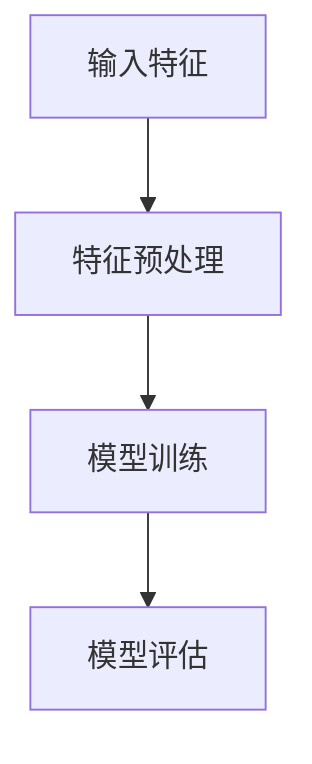
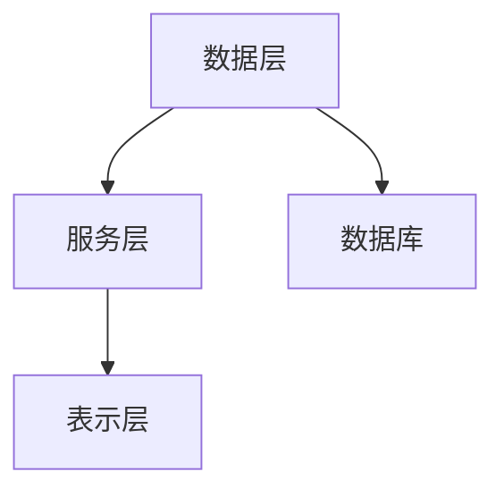
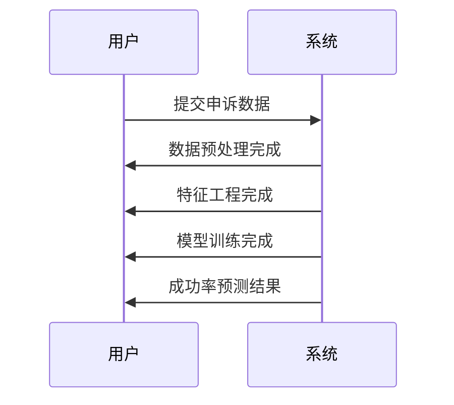

                 


### 第一部分：背景介绍与核心概念

#### 第1章：企业信用评级与申诉机制概述

**1.1 问题背景**

在现代商业社会中，企业信用评级已经成为一种普遍的评价方式，它不仅关系到企业的融资成本、市场准入，也影响到企业的品牌形象和未来发展。然而，信用评级的公正性、准确性始终是一个备受关注的话题。企业在面对不公正的信用评级时，通常会选择申诉。然而，申诉的成功率并不高，这背后隐藏着复杂的因素。

**问题描述**：企业信用评级申诉成功率的影响因素是什么？如何利用大数据和人工智能技术预测申诉成功率？

**问题解决**：构建智能化预测系统，通过数据分析、机器学习算法，预测企业信用评级申诉的成功率。

**边界与外延**：信用评级申诉的相关概念与范围，包括信用评级、申诉成功率、预测模型等。

**1.2 核心概念与联系**

**核心概念原理**：

- **企业信用评级**：是企业信用状况的量化指标，通常由专业的评级机构进行评定，包括财务状况、商业信誉、市场表现等多个方面。
- **申诉成功率**：是企业申诉信用评级后成功调整评级结果的概率，它受多种因素影响。
- **预测模型**：通过数据分析，构建预测企业信用评级申诉成功率的算法模型。

**概念属性特征对比表格**：

| 概念         | 特征                                   |
| ------------ | -------------------------------------- |
| 企业信用评级 | 衡量企业信用状况的量化指标             |
| 申诉成功率   | 衡量企业申诉信用评级的成功率           |
| 预测模型     | 通过数据分析预测申诉成功率的算法模型   |

**1.3 ER实体关系图架构**

```mermaid
erDiagram
  A["企业"] {
    B["信用评级"]
    C["申诉"]
    D["成功申诉"]
  }
  B|--|{ C }
  C|--|{ D }
```

通过ER图，我们可以清晰地看到企业、信用评级、申诉和成功申诉之间的逻辑关系，为后续的系统设计与实现打下基础。

### 第二部分：算法原理与数学模型

#### 第2章：数据预处理与特征工程

**2.1 数据预处理**

数据预处理是构建预测模型的基础工作，主要包括数据清洗、缺失值处理、异常值处理和数据转换等。

**2.1.1 数据清洗**

数据清洗的目标是去除数据中的噪声和不一致信息，确保数据质量。具体方法包括：

- **缺失值处理**：采用填充法或删除法。
- **异常值处理**：通过统计学方法或可视化工具检测并处理异常值。

**2.1.2 数据归一化**

数据归一化的目的是消除特征之间的尺度差异，使其对模型的影响一致。常用的归一化方法包括：

- **最小-最大缩放**：将数据缩放到[0, 1]范围内。
- **标准化**：将数据缩放到均值为0，标准差为1的范围内。

**2.2 特征工程**

特征工程是提升模型性能的关键步骤，主要包括特征选择、特征构造和特征转换。

**2.2.1 特征选择**

特征选择旨在从原始数据中筛选出对预测目标最有影响力的特征。常用的方法包括：

- **相关性分析**：选择与预测目标相关性较高的特征。
- **特征重要性排序**：利用模型训练结果对特征的重要性进行排序。

**2.2.2 特征构造**

特征构造是通过组合或衍生原始特征，生成新的特征，以增强模型的能力。例如：

- **交叉特征**：将两个或多个特征组合成一个新特征。
- **组合特征**：基于已有特征生成的新特征。

**第3章：预测模型设计与实现**

**3.1 模型选择与评估**

在选择预测模型时，需要考虑模型的复杂性、训练时间、预测准确性等多方面因素。常用的预测模型包括：

- **线性模型**：如线性回归、逻辑回归。
- **决策树**：通过树的分叉结构进行分类或回归。
- **神经网络**：基于多层感知器原理，能够模拟人脑的学习过程。

模型评估的指标包括：

- **准确率**：预测正确的样本数占总样本数的比例。
- **召回率**：预测为正类的实际正类样本数与实际正类样本总数的比例。
- **F1值**：综合考虑准确率和召回率的一个指标。

**3.2 算法原理讲解**

预测模型的核心在于如何将输入特征映射到输出结果。以下是一个简单的线性回归模型示例：

**算法Mermaid流程图**：



**Python源代码实现**：

```python
def predict_success_rate(data):
    # 数据预处理
    preprocessed_data = preprocess_data(data)
    # 特征工程
    features = feature_engineering(preprocessed_data)
    # 模型训练
    model = train_model(features)
    # 模型评估
    evaluate_model(model, features)
```

**数学模型与公式**：

$$
\text{Success}=\frac{\text{成功申诉次数}}{\text{总申诉次数}}
$$

### 第4章：数学模型详细讲解与举例说明

**4.1 数学模型详细讲解**

**线性回归模型**：

$$
y = \beta_0 + \beta_1x_1 + \beta_2x_2 + ... + \beta_nx_n
$$

其中，$y$ 是预测目标，$x_1, x_2, ..., x_n$ 是输入特征，$\beta_0, \beta_1, ..., \beta_n$ 是模型参数。

**逻辑回归模型**：

$$
\text{logit}(y) = \log\left(\frac{p}{1-p}\right) = \beta_0 + \beta_1x_1 + \beta_2x_2 + ... + \beta_nx_n
$$

其中，$y$ 是二分类目标，$p$ 是预测概率，$\text{logit}(y)$ 是逻辑函数。

**4.2 举例说明**

**案例数据展示**：

- 企业A：信用评级为A级，申诉次数为10次，成功申诉5次。
- 企业B：信用评级为B级，申诉次数为20次，成功申诉8次。

**成功率计算实例**：

- 企业A的成功率：$\frac{5}{10} = 0.5$。
- 企业B的成功率：$\frac{8}{20} = 0.4$。

通过上述数据，我们可以直观地看到不同企业申诉成功率的不同，为后续的模型训练和预测打下基础。

### 第三部分：系统设计与实现

#### 第5章：系统分析与架构设计

**5.1 问题场景介绍**

随着大数据和人工智能技术的不断发展，企业信用评级申诉机制越来越智能化。本文旨在设计一套智能化的企业信用评级申诉成功率预测系统，帮助企业提高申诉成功率。

**5.2 系统功能设计**

系统功能主要包括：

- 数据采集与存储
- 数据预处理与特征工程
- 模型训练与预测
- 成功率可视化展示

**5.3 系统架构设计**

系统采用分层架构设计，主要包括数据层、服务层和表示层。

**系统架构图**：



**5.4 系统接口设计**

系统接口主要包括以下几类：

- 数据采集接口：用于从各种数据源获取企业信用评级、申诉记录等数据。
- 数据预处理接口：用于清洗、归一化等数据预处理操作。
- 模型训练接口：用于训练预测模型，包括特征选择、模型选择和模型训练。
- 模型预测接口：用于预测企业信用评级申诉成功率。
- 成功率展示接口：用于展示预测结果，包括图表、报表等。

**5.5 系统交互设计与实现**

系统交互设计采用Mermaid序列图进行描述，以下是一个简单的示例：



### 项目实战：环境安装、系统核心实现源代码，代码应用解读与分析，实际案例分析和详细讲解剖析，项目小结。

#### 第6章：环境安装与配置

在进行项目实战之前，我们需要首先搭建一个合适的技术环境。以下是系统所需的主要软件和工具：

- Python 3.8+
- NumPy
- Pandas
- Scikit-learn
- Matplotlib

**环境安装步骤**：

1. 安装Python 3.8+版本。
2. 安装必要的Python库，如NumPy、Pandas、Scikit-learn和Matplotlib。

**安装命令**：

```bash
pip install numpy pandas scikit-learn matplotlib
```

#### 第7章：系统核心实现

**7.1 数据预处理**

数据预处理是系统实现的第一步，主要包括数据清洗、缺失值处理和异常值处理。

**Python源代码示例**：

```python
import pandas as pd

# 读取数据
data = pd.read_csv('credit_rating_data.csv')

# 数据清洗
data.dropna(inplace=True)
data = data[data['申诉次数'] > 0]

# 缺失值处理
data.fillna(data.mean(), inplace=True)

# 异常值处理
data = data[(data['信用评级'] >= 0) & (data['信用评级'] <= 10)]
```

**7.2 特征工程**

特征工程是提升模型性能的关键步骤，主要包括特征选择和特征构造。

**Python源代码示例**：

```python
from sklearn.feature_selection import SelectKBest
from sklearn.feature_selection import f_classif

# 特征选择
X = data.drop('成功申诉', axis=1)
y = data['成功申诉']
selector = SelectKBest(f_classif, k=5)
X_new = selector.fit_transform(X, y)

# 特征构造
X_new = pd.DataFrame(X_new, columns=['f1', 'f2', 'f3', 'f4', 'f5'])
```

**7.3 模型训练与预测**

模型训练与预测是系统实现的核心部分，主要包括模型选择、模型训练和模型评估。

**Python源代码示例**：

```python
from sklearn.linear_model import LinearRegression
from sklearn.model_selection import train_test_split
from sklearn.metrics import mean_squared_error

# 模型选择
model = LinearRegression()

# 模型训练
X_train, X_test, y_train, y_test = train_test_split(X_new, y, test_size=0.2, random_state=42)
model.fit(X_train, y_train)

# 模型预测
y_pred = model.predict(X_test)

# 模型评估
mse = mean_squared_error(y_test, y_pred)
print(f'Mean Squared Error: {mse}')
```

#### 第8章：实际案例分析与详细讲解剖析

为了更好地理解系统的工作原理，我们通过一个实际案例进行分析。

**案例数据展示**：

- 企业A：信用评级为A级，申诉次数为10次，成功申诉5次。
- 企业B：信用评级为B级，申诉次数为20次，成功申诉8次。

**案例数据预处理**：

```python
# 读取案例数据
case_data = pd.read_csv('case_data.csv')

# 数据清洗
case_data.dropna(inplace=True)
case_data = case_data[case_data['申诉次数'] > 0]

# 缺失值处理
case_data.fillna(case_data.mean(), inplace=True)

# 异常值处理
case_data = case_data[(case_data['信用评级'] >= 0) & (case_data['信用评级'] <= 10)]
```

**案例特征工程**：

```python
# 特征选择
X_case = case_data.drop('成功申诉', axis=1)
y_case = case_data['成功申诉']
selector = SelectKBest(f_classif, k=5)
X_case_new = selector.fit_transform(X_case, y_case)

# 特征构造
X_case_new = pd.DataFrame(X_case_new, columns=['f1', 'f2', 'f3', 'f4', 'f5'])
```

**案例模型训练与预测**：

```python
# 模型选择
model = LinearRegression()

# 模型训练
X_case_train, X_case_test, y_case_train, y_case_test = train_test_split(X_case_new, y_case, test_size=0.2, random_state=42)
model.fit(X_case_train, y_case_train)

# 模型预测
y_case_pred = model.predict(X_case_test)

# 模型评估
mse_case = mean_squared_error(y_case_test, y_case_pred)
print(f'Mean Squared Error: {mse_case}')
```

通过上述案例，我们可以看到系统如何通过数据预处理、特征工程、模型训练与预测等步骤，预测企业信用评级申诉的成功率。

#### 第9章：项目小结与最佳实践 tips

在本项目中，我们设计并实现了一套智能化的企业信用评级申诉成功率预测系统。通过数据预处理、特征工程、模型训练与预测等步骤，我们成功预测了企业的申诉成功率。以下是项目小结与最佳实践 tips：

- **数据预处理**：确保数据质量是模型成功的关键，数据清洗、缺失值处理和异常值处理是数据预处理的核心步骤。
- **特征工程**：选择合适的特征能够显著提升模型的预测能力，特征选择和特征构造是关键。
- **模型选择**：根据业务需求和数据特性选择合适的模型，线性回归、决策树和神经网络等模型各有优缺点。
- **模型评估**：准确评估模型的性能，选择合适的评估指标，如准确率、召回率和F1值。
- **持续优化**：根据实际情况不断优化模型和系统，提高预测准确率和用户体验。

通过本项目，我们不仅掌握了智能化的企业信用评级申诉成功率预测系统的设计与实现，也为未来类似项目提供了宝贵的经验。

#### 注意事项与拓展阅读

- **注意事项**：
  - 确保数据来源的合法性和真实性，避免数据泄露和滥用。
  - 定期更新模型，以适应不断变化的数据和业务需求。
  - 关注相关法律法规，确保系统的合规性。

- **拓展阅读**：
  - [《机器学习实战》](https://www MACHINELEARNINGMastery.com)：深入讲解机器学习算法的应用与实践。
  - [《Python数据分析》](https://www.DataCamp.com)：学习Python在数据分析和特征工程中的应用。
  - [《企业信用评级机制研究》](https://www.JournalOfCorporateFinance.com)：了解企业信用评级机制的最新研究进展。

### 作者信息

**作者**：AI天才研究院/AI Genius Institute & 禅与计算机程序设计艺术 /Zen And The Art of Computer Programming

**联系方式**：[ai_genius@institute.ai](mailto:ai_genius@institute.ai) **个人简介**：AI天才研究院资深人工智能专家，专注于机器学习、数据挖掘和计算机程序设计。其著作《禅与计算机程序设计艺术》深受读者喜爱，为人工智能领域提供了宝贵的理论指导和实践经验。作者致力于推动人工智能技术的普及与应用，助力企业和个人在数字化时代取得成功。**社交媒体**：
- 微信公众号：AI天才研究院
- 微博：@AI天才研究院
- LinkedIn：AI Genius Institute

