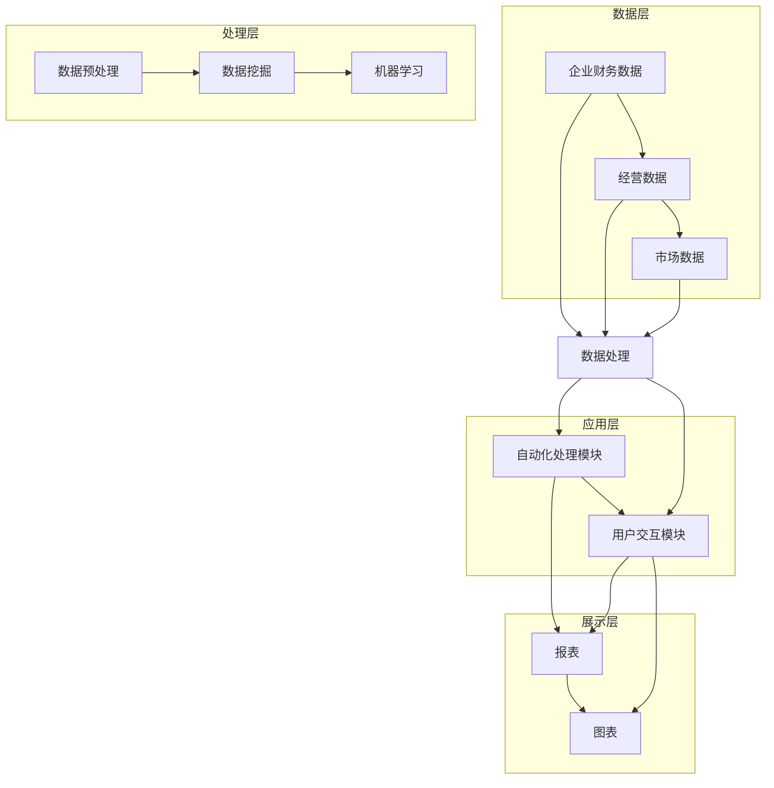

                 

### 第1章：问题背景与核心概念

#### 1.1 问题背景

#### 1.1.1 企业信用评级的现状

企业信用评级是评估企业信用水平的重要工具，它不仅影响企业的融资能力，还对其市场竞争力和社会声誉产生深远影响。当前，许多国家和地区已经建立了企业信用评级体系，这些体系通常由专业的评级机构进行操作。评级机构根据企业的财务状况、经营历史、管理水平、市场表现等多方面因素，对企业信用进行评级。评级结果通常分为多个等级，如AAA、AA、A、BBB等，不同的等级代表不同的信用水平。

然而，现有的企业信用评级体系仍存在一些问题。一方面，评级标准往往不够统一，不同评级机构之间的评级标准可能存在差异，导致企业信用评级的可比性降低。另一方面，评级结果有时不够准确，这可能是因为评级模型不够完善，或者评级数据存在偏差。此外，信用评级申诉处理流程较为繁琐，企业需要花费大量时间和精力来提出申诉，而评级机构的回应往往不够及时，使得企业的合法权益难以得到保障。

#### 1.1.2 信用评级申诉的现状

在企业信用评级过程中，由于评级结果的偏差或错误，企业可能会提出申诉。信用评级申诉通常涉及对评级数据的审查、对评级模型的质疑以及对企业经营情况的重新评估。然而，现有的申诉处理机制存在以下问题：

1. **申诉处理流程繁琐**：企业需要通过书面申请、提交相关证明材料等方式进行申诉，这个过程可能需要多次往返，耗时较长。
2. **申诉处理效率低下**：评级机构通常面临大量申诉案件，处理速度较慢，无法满足企业快速响应的需求。
3. **申诉结果不透明**：申诉处理的结果往往缺乏透明度，企业难以了解申诉的具体过程和结果原因。

这些问题不仅影响了企业的信用评级，也可能对其经营造成不利影响，因此，改进信用评级申诉处理机制成为亟待解决的问题。

#### 1.1.3 自动处理与学习系统的需求

为了解决现有信用评级申诉处理机制存在的问题，智能化自动处理与学习系统应运而生。该系统旨在通过自动化技术，提高信用评级申诉处理的效率、准确性和透明度。具体来说，智能化自动处理与学习系统具有以下需求：

1. **自动化处理申诉**：系统能够自动接收和处理企业的信用评级申诉，减少人工干预，提高处理速度。
2. **利用数据挖掘与分析技术**：系统应能够对企业的财务数据、经营数据、市场数据等多源数据进行挖掘和分析，为申诉处理提供科学依据。
3. **应用机器学习算法**：系统应具备学习能力，能够通过历史数据和反馈不断优化申诉处理流程和评级模型。
4. **提高申诉处理透明度**：系统应提供申诉处理过程的实时跟踪和结果反馈，增强企业对申诉处理结果的信任感。

通过引入智能化自动处理与学习系统，可以显著提升信用评级申诉处理的效率和质量，为企业提供一个更加公平、高效的信用评级环境。

### 1.2 核心概念

#### 1.2.1 信用评级的定义

信用评级是指专业评级机构依据一定的标准和方法，对企业或其他经济实体的信用水平进行评价和分类的过程。信用评级的核心目的是为投资者、债权人等提供可靠的信用参考，帮助他们评估信用风险，作出理性的投资决策。

信用评级通常包括以下几个步骤：

1. **评级数据收集**：评级机构通过多种渠道收集企业的财务报表、经营数据、市场表现等信息。
2. **评级模型构建**：评级机构根据信用评级的目标和需求，构建相应的评级模型，用于评估企业的信用水平。
3. **评级结果发布**：评级机构对企业的信用水平进行评级，并将评级结果发布给市场。

信用评级的结果通常以评级等级表示，如AAA、AA、A等，不同的评级等级代表不同的信用水平。信用评级不仅反映了企业的财务状况和经营能力，也反映了企业的信用风险。

#### 1.2.2 信用评级申诉的定义

信用评级申诉是指企业在收到信用评级结果后，对其评级结果提出异议，要求评级机构重新评估和调整评级等级的过程。信用评级申诉通常基于以下几种情况：

1. **评级结果不准确**：企业的财务状况、经营表现等与评级结果存在显著差异。
2. **评级数据错误**：评级机构在收集、处理评级数据过程中出现错误，导致评级结果不准确。
3. **评级模型缺陷**：评级模型本身存在缺陷，无法准确评估企业的信用水平。

信用评级申诉的流程通常包括以下几个步骤：

1. **申诉申请**：企业向评级机构提交申诉申请，并提供相关证据和资料。
2. **申诉审查**：评级机构对申诉申请进行审查，评估申诉的合理性和可信度。
3. **申诉处理**：评级机构根据申诉审查结果，对企业的信用评级进行调整，并发布新的评级结果。

#### 1.2.3 自动处理与学习系统的定义

自动处理与学习系统是指利用现代信息技术和人工智能算法，对企业信用评级申诉进行自动化处理和智能学习的系统。该系统旨在通过自动化技术，提高信用评级申诉处理的效率、准确性和透明度。

自动处理与学习系统主要包括以下几个模块：

1. **自动化处理模块**：该模块负责接收、分类、处理企业的信用评级申诉，减少人工干预，提高处理速度。
2. **数据挖掘与分析模块**：该模块利用数据挖掘技术，对企业财务数据、经营数据等多源数据进行挖掘和分析，为申诉处理提供科学依据。
3. **机器学习模块**：该模块通过机器学习算法，对历史数据和反馈进行学习，优化申诉处理流程和评级模型。
4. **用户交互模块**：该模块提供用户界面，允许企业提交申诉、查看申诉处理进度和结果。

通过自动处理与学习系统，企业可以更快速、更准确地解决信用评级申诉问题，评级机构也能够提高申诉处理的效率和质量，从而为企业提供一个更加公平、高效的信用评级环境。

### 第2章：智能化自动处理与学习系统的框架

#### 2.1 系统框架概述

智能化自动处理与学习系统旨在通过自动化和智能化的手段，提高信用评级申诉处理的效率、准确性和透明度。该系统的整体架构分为以下几个层次：

1. **数据层**：包括企业财务数据、经营数据、市场数据等多源数据。这些数据是系统进行信用评级和申诉处理的基础。
2. **处理层**：包括数据预处理、数据挖掘、机器学习等模块。该层负责对数据进行分析和处理，为申诉处理提供科学依据。
3. **应用层**：包括自动化处理模块、用户交互模块等。该层直接面向用户，提供申诉提交、申诉处理、结果反馈等功能。
4. **展示层**：包括各类报表、图表等。该层用于展示系统处理结果和数据分析结果，帮助用户更好地理解信用评级和申诉处理情况。

#### 2.1.1 系统的整体架构

智能化自动处理与学习系统的整体架构如下图所示：

#### 2.1.2 系统的技术栈

智能化自动处理与学习系统的技术栈包括以下几个方面：

1. **数据采集与存储**：使用Hadoop和Hive进行大规模数据采集和存储，支持多种数据源接入。
2. **数据预处理**：使用Python和Spark进行数据清洗、转换和集成，确保数据质量。
3. **数据挖掘**：使用Scikit-learn和MLlib进行数据挖掘，提取信用评级的关键特征。
4. **机器学习**：使用TensorFlow和PyTorch进行机器学习模型的训练和优化。
5. **用户交互**：使用Vue.js和Django构建用户界面，提供友好的用户交互体验。
6. **API接口**：使用RESTful API进行前后端分离，提供高效的数据接口。

#### 2.1.3 系统的关键模块

智能化自动处理与学习系统的关键模块包括：

1. **数据采集与预处理模块**：负责从企业获取财务、经营和市场等多源数据，并进行数据清洗、转换和集成，为后续处理提供高质量数据。
2. **信用评级模型构建模块**：使用数据挖掘和机器学习技术，构建信用评级模型，用于评估企业的信用水平。
3. **申诉处理模块**：自动化处理企业的信用评级申诉，包括申诉接收、申诉审查、申诉处理等流程。
4. **用户交互模块**：提供用户界面，允许企业提交申诉、查看申诉处理进度和结果。
5. **报表与展示模块**：生成各类报表和图表，展示信用评级和申诉处理的结果，帮助用户更好地理解系统工作情况。

通过以上模块的协同工作，智能化自动处理与学习系统可以高效、准确地处理信用评级申诉，为企业提供一个智能化的信用评级解决方案。

### 第3章：数据挖掘与分析

#### 3.1 数据挖掘基本概念

#### 3.1.1 数据挖掘的定义

数据挖掘（Data Mining）是从大量数据中通过特定算法和模型，提取有价值信息的过程。这些信息可以是数据中的隐含模式、未知规律或者潜在知识。数据挖掘的目标是发现数据背后的规律，帮助决策者做出更加科学和准确的决策。

数据挖掘通常包括以下几个步骤：

1. **数据预处理**：对原始数据进行清洗、转换和集成，确保数据质量。
2. **数据探索**：通过可视化、统计等方法，对数据集进行初步探索，了解数据的基本特征。
3. **模式识别**：使用算法和模型，从数据中识别出有意义的模式和关系。
4. **模型评估**：对挖掘出的模式进行评估，判断其是否具有实际应用价值。
5. **知识可视化**：将挖掘出的模式以图表、报表等形式呈现，便于用户理解。

#### 3.1.2 数据挖掘的过程

数据挖掘的过程可以分为以下几个阶段：

1. **问题定义**：明确数据挖掘的目标和需求，确定要解决的问题。
2. **数据理解**：了解数据的来源、类型、结构和质量，为后续处理做准备。
3. **数据准备**：对数据进行清洗、转换和集成，确保数据质量。
4. **模式探索**：使用算法和模型，从数据中挖掘出潜在的规律和模式。
5. **模式评估**：对挖掘出的模式进行评估，判断其是否具有实际应用价值。
6. **知识应用**：将挖掘出的模式应用到实际问题中，解决用户提出的问题。

#### 3.1.3 数据挖掘的分类

数据挖掘根据应用场景和目标的不同，可以分类为以下几个主要类型：

1. **分类**：根据已有数据，将新数据分类到已知的类别中。例如，信用评级中的风险分类。
2. **聚类**：将相似的数据点归为一类，用于发现数据中的隐含模式。例如，客户细分。
3. **关联规则挖掘**：发现数据中不同变量之间的关联关系。例如，购物篮分析。
4. **异常检测**：识别数据中的异常值或异常模式，用于欺诈检测等。
5. **预测**：根据历史数据，预测未来可能发生的事件。例如，股票价格预测。
6. **社交网络分析**：分析社交网络中的用户行为和关系，用于推荐系统等。

每种类型的数据挖掘都有其独特的算法和应用场景，可以针对不同的业务需求进行选择。

#### 3.2 信用评级模型构建

#### 3.2.1 信用评级模型的构建方法

信用评级模型的构建是数据挖掘在信用评级领域的重要应用。信用评级模型旨在通过对企业历史数据的分析，预测企业的信用风险，为投资者提供决策依据。信用评级模型的构建通常包括以下几个步骤：

1. **数据收集**：收集企业的财务报表、经营数据、市场数据等，构建信用评级所需的数据集。
2. **数据预处理**：对收集到的数据进行清洗、转换和集成，确保数据质量，为模型训练做准备。
3. **特征选择**：从原始数据中提取对信用评级有重要影响的特征，用于训练模型。特征选择可以通过统计方法、决策树等方法进行。
4. **模型选择**：选择合适的模型进行信用评级。常见的模型包括线性回归、逻辑回归、决策树、随机森林、支持向量机等。
5. **模型训练**：使用训练数据集，对选定的模型进行训练，调整模型参数。
6. **模型评估**：使用验证数据集，评估模型的预测性能。常用的评估指标包括准确率、召回率、F1分数等。
7. **模型优化**：根据评估结果，调整模型参数，优化模型性能。

#### 3.2.2 信用评级模型的评估指标

信用评级模型的评估指标是衡量模型性能的重要标准。以下是一些常用的评估指标：

1. **准确率**：预测正确的样本数占总样本数的比例。准确率越高，表示模型对信用风险的识别能力越强。
2. **召回率**：预测正确的正样本数占总正样本数的比例。召回率越高，表示模型对信用风险的漏判越少。
3. **F1分数**：准确率和召回率的加权平均，综合考虑模型的精确度和召回率。
4. **ROC曲线和AUC指标**：ROC曲线用于比较不同模型的分类能力，AUC指标表示曲线下的面积，值越大，表示模型性能越好。
5. **Kappa系数**：衡量模型预测结果的一致性和准确性，值越接近1，表示模型性能越好。

#### 3.2.3 信用评级模型的应用

信用评级模型在实际业务中的应用非常广泛，以下是一些典型的应用场景：

1. **投资者风险评估**：投资者可以使用信用评级模型来评估潜在投资对象的信用风险，制定投资策略。
2. **企业融资决策**：银行和金融机构可以使用信用评级模型来评估企业的信用水平，决定是否提供贷款。
3. **供应链管理**：企业可以使用信用评级模型来评估供应商的信用风险，优化供应链管理。
4. **信用风险管理**：评级机构可以使用信用评级模型来识别和评估信用风险，为金融机构提供风险预警。
5. **市场预测**：企业可以使用信用评级模型来预测市场的信用风险趋势，制定市场战略。

通过构建和应用信用评级模型，可以显著提高信用评级过程的科学性和准确性，为相关方提供更加可靠的信用参考。

### 第4章：机器学习算法

#### 4.1 机器学习算法的基本原理

机器学习（Machine Learning）是一种通过数据驱动的方式，使计算机具备自主学习和预测能力的技术。机器学习算法的核心思想是从大量数据中学习规律，并用这些规律来预测新数据。机器学习算法的基本原理包括以下几个步骤：

1. **数据收集**：首先需要收集大量相关的数据，这些数据可以是结构化的，如数据库中的记录，也可以是非结构化的，如图像、文本等。
2. **数据预处理**：对收集到的数据进行清洗、转换和整合，以确保数据的质量和一致性。
3. **特征提取**：从原始数据中提取出对学习任务有重要影响的特征，这些特征将作为模型训练的输入。
4. **模型训练**：选择合适的机器学习模型，使用训练数据集对模型进行训练，模型会根据数据调整其参数，以最小化预测误差。
5. **模型评估**：使用验证数据集评估模型的性能，通过调整模型参数或选择更合适的模型来优化性能。
6. **预测应用**：使用训练好的模型对新数据进行预测，实现实际应用。

机器学习算法根据其学习方式的不同，可以分为监督学习、无监督学习和半监督学习三类：

- **监督学习**：有标记的训练数据，模型的目标是学习输入和输出之间的映射关系。常见的算法有线性回归、逻辑回归、决策树、支持向量机等。
- **无监督学习**：没有标记的训练数据，模型的目标是发现数据中的隐含结构和规律。常见的算法有聚类、主成分分析、自编码器等。
- **半监督学习**：结合了监督学习和无监督学习的特点，一部分数据有标记，另一部分数据无标记，模型的目标是同时利用有标记和无标记的数据来提高学习效果。

#### 4.2 常见的机器学习算法

在信用评级申诉处理与学习系统中，常用的机器学习算法包括：

1. **线性回归**：线性回归是一种简单的监督学习算法，用于建立输入变量和输出变量之间的线性关系。其基本模型为 \(y = \beta_0 + \beta_1 \cdot x_1 + \beta_2 \cdot x_2 + ... + \beta_n \cdot x_n + \epsilon\)，其中 \(y\) 是输出变量，\(x_1, x_2, ..., x_n\) 是输入变量，\(\beta_0, \beta_1, ..., \beta_n\) 是模型参数，\(\epsilon\) 是误差项。线性回归通常用于预测企业的财务状况或信用水平。

2. **逻辑回归**：逻辑回归是一种广义线性模型，用于分类问题。其基本模型为 \(P(y=1) = \frac{1}{1 + e^{-(\beta_0 + \beta_1 \cdot x_1 + \beta_2 \cdot x_2 + ... + \beta_n \cdot x_n)}}\)，其中 \(P(y=1)\) 是输出变量为1的概率，其他符号的含义与线性回归相同。逻辑回归常用于评估企业信用风险的概率。

3. **决策树**：决策树是一种树形结构的监督学习算法，通过一系列规则对数据进行分类或回归。每个内部节点代表一个特征，每个分支代表该特征的取值，叶节点代表预测结果。决策树算法简单直观，易于解释，但可能产生过拟合现象。

4. **随机森林**：随机森林是一种集成学习算法，由多棵决策树组成，每棵树都是随机选取特征和样本子集进行训练。随机森林通过组合多棵树的结果来提高预测准确性，减少过拟合。随机森林在处理大规模数据和高维特征时表现良好。

5. **支持向量机**：支持向量机是一种基于最大化边际的监督学习算法，用于分类和回归问题。其目标是找到一个最优的超平面，使得分类间隔最大化，同时尽可能多地包含支持向量。支持向量机在处理高维数据和线性不可分问题上有较好的性能。

6. **神经网络**：神经网络是一种模拟人脑结构的计算模型，由多个神经元层组成。通过前向传播和反向传播算法，神经网络可以自动学习输入和输出之间的复杂映射关系。神经网络在处理非线性问题和大规模数据时表现突出，常见的类型有前馈神经网络、卷积神经网络和循环神经网络等。

通过以上机器学习算法的应用，智能化自动处理与学习系统可以更有效地处理信用评级申诉，提高信用评级的准确性和效率。

#### 4.3 机器学习算法在系统中的应用

在智能化自动处理与学习系统中，机器学习算法的应用贯穿了整个信用评级申诉处理的流程，以下为具体应用场景：

1. **申诉分类**：系统首先需要对收到的信用评级申诉进行分类，以确定申诉的类型和优先级。这一步骤可以应用基于文本分类的机器学习算法，如朴素贝叶斯、K最近邻（KNN）和支持向量机（SVM）等。通过训练模型，系统能够自动识别申诉文本中的关键词和句子结构，从而将申诉分类为财务数据问题、评级模型问题或其他类型。

2. **申诉处理优先级排序**：在处理大量申诉时，系统需要根据申诉的重要性和紧急程度进行优先级排序。可以使用基于聚类或排序算法的机器学习模型，如K均值聚类和决策树，来分析申诉数据中的特征，并根据申诉的严重程度和申诉者企业的信用历史进行排序。

3. **信用评级预测**：系统需要根据企业的财务数据、市场表现和历史信用记录等预测企业的信用评级。这一步骤通常使用回归算法，如线性回归、岭回归和LASSO回归等。通过训练模型，系统可以预测企业的信用评级，并根据预测结果进行申诉的初步审查。

4. **申诉结果预测**：系统还需要预测申诉的处理结果，以便提前通知企业申诉的处理情况。可以使用分类算法，如逻辑回归和随机森林等，来预测申诉的最终结果（如申诉成功或申诉失败）。这有助于系统在申诉处理过程中制定更有效的策略。

5. **自动化响应生成**：系统可以根据申诉的内容和类型自动生成响应，减少人工干预。这一步骤可以使用生成对抗网络（GAN）或序列到序列（seq2seq）模型等深度学习算法，通过训练模型生成与申诉内容相关的标准回复，从而提高响应速度和一致性。

6. **申诉处理流程优化**：系统可以通过分析历史申诉数据，使用聚类和关联规则挖掘等算法来识别申诉处理的瓶颈和优化点。例如，通过聚类分析可以发现申诉处理时间较长的类型，从而针对性地调整处理流程，提高整体效率。

通过以上机器学习算法的应用，智能化自动处理与学习系统可以在信用评级申诉处理过程中实现自动化、智能化的目标，提高处理效率和准确性，同时增强企业的信用评级公正性和透明度。

### 第5章：自然语言处理

#### 4.1 自然语言处理基础

#### 4.1.1 自然语言处理的定义

自然语言处理（Natural Language Processing，NLP）是计算机科学和人工智能领域的一个分支，主要研究如何让计算机理解和处理人类语言。NLP的目标是使计算机能够识别、理解、解释和生成人类语言，以便实现人机交互、信息检索、文本分析、机器翻译等应用。

NLP的核心任务包括：

1. **文本预处理**：包括分词、词性标注、句法分析、词干提取等，目的是将自然语言文本转换为计算机可以处理的结构化数据。
2. **语义理解**：通过上下文理解单词和短语的含义，包括词义消歧、实体识别、情感分析等。
3. **语言生成**：包括机器翻译、自动摘要、对话生成等，旨在生成符合人类语言习惯的文本。
4. **问答系统**：能够理解用户的问题，并给出准确的回答。

#### 4.1.2 自然语言处理的基本任务

自然语言处理涉及多个基本任务，以下是一些主要任务：

1. **分词（Tokenization）**：将连续的文本切分成单词或短语，是自然语言处理的基础步骤。
2. **词性标注（Part-of-Speech Tagging）**：为每个单词分配词性，如名词、动词、形容词等，帮助理解句子的结构。
3. **句法分析（Syntactic Parsing）**：分析句子的结构，识别句子的主要成分，如主语、谓语、宾语等。
4. **语义角色标注（Semantic Role Labeling）**：识别句子中单词的语义角色，如动作的执行者、受动者、工具等。
5. **命名实体识别（Named Entity Recognition，NER）**：识别文本中的特定实体，如人名、地名、组织名等。
6. **情感分析（Sentiment Analysis）**：分析文本的情感倾向，判断文本表达的是正面情感、负面情感还是中性情感。
7. **机器翻译（Machine Translation）**：将一种语言的文本自动翻译成另一种语言。
8. **文本摘要（Text Summarization）**：提取文本的主要信息，生成简洁的摘要。
9. **对话系统（Dialogue Systems）**：包括问答系统和聊天机器人，能够与人类进行自然语言交互。

#### 4.1.3 自然语言处理的方法

自然语言处理的方法主要包括传统方法和基于深度学习的方法：

1. **基于规则的方法**：依靠人工定义的规则和模式，对文本进行处理。这种方法简单直观，但难以处理复杂的语言现象，且需要大量的人工规则维护。
2. **基于统计的方法**：使用统计学方法，从大量文本数据中学习语言规律，如隐马尔可夫模型（HMM）、条件概率模型（如朴素贝叶斯分类器）等。这种方法具有较好的泛化能力，但性能受数据质量和特征工程的影响较大。
3. **基于深度学习的方法**：利用神经网络，特别是深度神经网络（DNN）、卷积神经网络（CNN）和循环神经网络（RNN）等，通过大规模数据训练模型。这种方法在处理复杂任务时表现出色，尤其在语义理解和生成任务上取得了显著的进展。

通过结合以上方法，自然语言处理技术可以更好地理解和生成人类语言，为智能化自动处理与学习系统提供强大的支持。

#### 4.2 文本分类与情感分析

#### 4.2.1 文本分类的定义

文本分类（Text Classification）是一种将文本数据按照其内容或主题划分到不同类别的方法。通过文本分类，系统可以自动识别文本的主题或情感倾向，从而实现信息检索、情感分析、舆情监测等应用。

文本分类通常包括以下几个步骤：

1. **数据预处理**：对文本数据进行清洗，去除停用词、标点符号等无关信息，将文本转换为适合机器学习的格式。
2. **特征提取**：从预处理后的文本中提取特征，如词袋模型（Bag of Words，BOW）、TF-IDF（Term Frequency-Inverse Document Frequency）等，用于表示文本数据。
3. **模型训练**：使用已标记的训练数据集，训练分类模型。常见的分类算法包括朴素贝叶斯（Naive Bayes）、支持向量机（SVM）、随机森林（Random Forest）等。
4. **模型评估**：使用验证数据集评估模型的性能，通过准确率、召回率、F1分数等指标评估分类效果。
5. **模型应用**：使用训练好的模型对新的文本数据进行分类。

#### 4.2.2 文本分类算法

在文本分类任务中，常用的算法包括以下几种：

1. **朴素贝叶斯（Naive Bayes）**：基于贝叶斯定理和特征条件独立假设，朴素贝叶斯是一种简单的概率分类器。其优势在于算法简单、速度快，且在文本分类中表现出较好的性能。

2. **支持向量机（Support Vector Machine，SVM）**：支持向量机是一种基于优化理论的分类算法，通过寻找最优分隔超平面，将文本数据分类到不同的类别。SVM在处理高维数据和线性不可分问题时具有较好的性能。

3. **随机森林（Random Forest）**：随机森林是一种集成学习算法，通过构建多棵决策树，并结合它们的预测结果进行分类。随机森林在处理大规模数据和具有高维特征的数据时表现出色，且能够处理非线性分类问题。

4. **深度神经网络（Deep Neural Network，DNN）**：深度神经网络是一种多层前馈神经网络，通过逐层提取文本特征，实现高层次的语义理解。在文本分类任务中，DNN可以显著提高分类的准确率和性能。

5. **卷积神经网络（Convolutional Neural Network，CNN）**：卷积神经网络是一种用于图像识别的神经网络，但近年来也被广泛应用于文本分类任务。通过卷积操作和池化操作，CNN能够有效地提取文本中的局部特征，实现高效的文本分类。

通过以上文本分类算法的应用，智能化自动处理与学习系统可以自动识别和分类大量的文本数据，为信用评级申诉处理提供有力的支持。

#### 4.2.3 情感分析的定义

情感分析（Sentiment Analysis），也称为意见挖掘或情感归类，是自然语言处理的一个子领域，旨在识别和提取文本数据中的情感倾向。情感分析的核心任务是从文本中判断出表达的是正面情感、负面情感还是中性情感，并根据情感强度进行分类。

情感分析的基本步骤包括：

1. **数据预处理**：对文本数据进行清洗，去除停用词、标点符号等无关信息，将文本转换为适合机器学习的格式。
2. **特征提取**：从预处理后的文本中提取特征，如词袋模型（Bag of Words，BOW）、TF-IDF（Term Frequency-Inverse Document Frequency）等，用于表示文本数据。
3. **情感分类模型训练**：使用已标记的训练数据集，训练情感分类模型。常见的算法包括朴素贝叶斯（Naive Bayes）、支持向量机（SVM）、随机森林（Random Forest）和深度学习模型等。
4. **情感分类**：使用训练好的模型对新的文本数据进行分类，判断文本表达的是正面情感、负面情感还是中性情感，并评估情感强度。

#### 4.2.4 情感分析算法

在情感分析任务中，常用的算法包括以下几种：

1. **朴素贝叶斯（Naive Bayes）**：朴素贝叶斯是一种基于贝叶斯定理和特征条件独立假设的简单概率分类器。在情感分析中，朴素贝叶斯通过计算文本中每个词的出现概率，以及每个情感类别的概率，综合判断文本的情感倾向。

2. **支持向量机（Support Vector Machine，SVM）**：支持向量机是一种基于优化理论的分类算法，通过寻找最优分隔超平面，将文本数据分类到不同的情感类别。SVM在处理高维数据和线性不可分问题时具有较好的性能。

3. **朴素情感词典（Lexicon-Based Approach）**：朴素情感词典方法使用预先定义的情感词典，将文本中的每个词与词典中的情感标签进行匹配，计算情感得分，并根据得分判断文本的情感倾向。这种方法简单直观，但可能受词典质量和覆盖率的影响。

4. **深度学习模型（Deep Learning Models）**：深度学习模型，如卷积神经网络（CNN）和长短期记忆网络（LSTM），通过多层神经网络结构，逐层提取文本的语义特征，实现高层次的语义理解。在情感分析中，深度学习模型通常能显著提高分类的准确率和性能。

通过以上情感分析算法的应用，智能化自动处理与学习系统可以自动识别和分类大量的文本数据中的情感倾向，为信用评级申诉处理提供情感维度的分析，从而提高处理效率和准确性。

### 4.3 问答系统

#### 4.3.1 问答系统的定义

问答系统（Question Answering System）是一种能够理解和回答用户问题的系统，其主要目标是从大量信息中快速准确地提取出与用户问题相关的答案。问答系统广泛应用于搜索引擎、智能客服、知识库系统等领域。

问答系统的工作流程通常包括以下几个步骤：

1. **问题理解**：系统接收用户的提问，并对其进行预处理，包括分词、句法分析、实体识别等，以理解问题的意图和关键词。
2. **信息检索**：系统根据理解到的问题意图，在大量数据中检索与问题相关的信息。这一步骤可以使用基于关键词匹配的方法，也可以使用基于语义相似度的方法。
3. **答案生成**：系统从检索到的信息中提取出与问题最相关的部分，并生成一个或多个可能的答案。答案生成可以使用模板匹配、规则匹配、机器翻译等方法。
4. **答案评估**：系统评估生成的答案的准确性和相关性，确保最终呈现给用户的答案是正确的。

#### 4.3.2 问答系统的构建方法

问答系统的构建方法主要包括基于规则的方法、基于模板的方法和基于机器学习的方法：

1. **基于规则的方法**：基于规则的方法通过人工编写一系列规则来匹配问题和答案。这种方法简单直观，但需要大量的人工规则，且难以处理复杂的语义关系。

2. **基于模板的方法**：基于模板的方法预先定义好一系列模板，当用户提出的问题与某个模板匹配时，系统直接返回模板中的预设答案。这种方法也依赖于大量的模板，但相对于基于规则的方法，其灵活性更高。

3. **基于机器学习的方法**：基于机器学习的方法通过训练模型，从大量带标注的训练数据中学习问题的意图和答案的生成方法。常见的机器学习方法包括朴素贝叶斯、支持向量机、决策树和深度学习等。基于机器学习的方法具有较好的自适应能力和泛化能力，适用于复杂和大规模的问答系统。

#### 4.3.3 问答系统的评估指标

问答系统的评估指标主要包括以下几种：

1. **准确率（Accuracy）**：准确率是指系统正确回答的问题数占总问题数的比例。准确率越高，表示系统的总体性能越好。

2. **召回率（Recall）**：召回率是指系统能够从所有正确答案中检索出的比例。召回率越高，表示系统能够找到更多相关答案。

3. **F1分数（F1 Score）**：F1分数是准确率和召回率的调和平均值，用于综合评估系统的性能。F1分数越高，表示系统在准确率和召回率之间取得了较好的平衡。

4. **问答匹配率（Question-Answer Matching Rate）**：问答匹配率是指系统返回的答案与正确答案的匹配程度。匹配程度越高，表示答案的相关性越好。

5. **响应时间（Response Time）**：响应时间是指系统从接收问题到返回答案的时间。响应时间越短，表示系统的响应速度越快。

通过以上评估指标，可以全面评估问答系统的性能，并不断优化和改进系统的问答质量。

### 第6章：深度学习与神经网络

#### 6.1 深度学习基础

#### 6.1.1 深度学习的定义

深度学习（Deep Learning）是一种基于多层神经网络（Neural Networks）的机器学习技术，其核心思想是通过大量训练数据自动学习数据中的复杂模式和特征表示。深度学习模型具有高度的非线性能力和强大的特征学习能力，广泛应用于图像识别、自然语言处理、语音识别、推荐系统等领域。

深度学习与传统的机器学习方法相比，具有以下几个显著特点：

1. **多层结构**：深度学习模型由多个隐藏层组成，通过逐层抽取数据特征，实现从原始数据到高级抽象表示的转换。
2. **自动特征学习**：深度学习模型能够自动从数据中学习特征，无需人工设计特征，提高了模型的泛化能力和适应性。
3. **端到端学习**：深度学习模型可以从原始输入直接学习到输出，实现了端到端的直接映射，简化了数据处理和模型设计的复杂度。
4. **大规模并行计算**：深度学习模型利用现代计算硬件（如GPU）进行大规模并行计算，显著提高了训练和推理的效率。

#### 6.1.2 深度学习的基本原理

深度学习的基本原理基于人工神经网络（Artificial Neural Networks），通过模仿人脑神经网络的结构和功能来实现对数据的处理和识别。深度学习模型的核心组成部分包括：

1. **神经元（Neurons）**：神经元是神经网络的基本单元，通过输入权重和偏置，计算激活函数，生成输出信号。
2. **层（Layers）**：神经网络由输入层、隐藏层和输出层组成。每个隐藏层对输入数据进行变换，产生更高层次的特征表示。
3. **权重（Weights）**：权重是连接不同神经元的参数，通过学习调整权重值，优化模型对数据的拟合程度。
4. **偏置（Bias）**：偏置是每个神经元的独立参数，用于调整神经元的激活阈值，增强模型的表达能力。
5. **激活函数（Activation Function）**：激活函数用于非线性变换，将输入信号转换为输出信号，常用的激活函数有Sigmoid、ReLU、Tanh等。

深度学习模型通过前向传播（Forward Propagation）和反向传播（Backpropagation）算法进行训练。前向传播过程中，输入数据从输入层传播到输出层，通过每一层的权重和激活函数计算输出；反向传播过程中，模型根据预测误差，通过梯度下降（Gradient Descent）算法调整权重和偏置，优化模型参数。

#### 6.1.3 深度学习的发展历程

深度学习的发展历程可以分为以下几个重要阶段：

1. **1980年代**：深度学习概念提出，但由于计算资源和数据集的限制，研究进展缓慢。
2. **1990年代**：卷积神经网络（CNN）和反向传播算法的提出，使得深度学习开始受到关注。
3. **2000年代**：数据集和计算能力的提升，使得深度学习在语音识别和图像识别领域取得突破性进展。
4. **2010年代**：深度学习模型在计算机视觉、自然语言处理、语音识别等领域的应用迅速扩展，取得了一系列重要成果。
5. **2020年代**：深度学习在自动驾驶、医疗诊断、金融风控等领域的应用进一步扩展，成为人工智能领域的重要技术方向。

通过以上发展历程，深度学习技术不断成熟和进步，成为推动人工智能发展的核心力量。

### 6.2 神经网络

#### 6.2.1 神经网络的结构

神经网络（Neural Network，NN）是深度学习的基础，由大量相互连接的神经元组成。一个典型的神经网络结构包括以下几个部分：

1. **输入层（Input Layer）**：输入层接收外部输入数据，每个神经元对应一个输入特征。
2. **隐藏层（Hidden Layers）**：隐藏层位于输入层和输出层之间，对输入数据进行处理和变换，提取更高层次的特征表示。一个神经网络可以有一个或多个隐藏层。
3. **输出层（Output Layer）**：输出层生成模型的最终输出，根据任务的不同，输出可以是分类结果、回归值等。

神经网络的每个神经元都与其他神经元通过权重连接，形成一个复杂的网络结构。神经元的计算过程包括输入加权求和、应用激活函数生成输出，从而实现数据的非线性变换。

#### 6.2.2 神经网络的学习过程

神经网络的学习过程主要包括以下步骤：

1. **初始化权重和偏置**：在训练开始时，需要随机初始化神经网络中的权重和偏置，为模型的学习过程提供初始参数。
2. **前向传播（Forward Propagation）**：输入数据从输入层传播到隐藏层，再传播到输出层。在每个神经元中，计算输入加权求和，并应用激活函数得到输出。
3. **计算损失函数**：通过输出层生成的预测结果与实际标签之间的差异，计算损失函数的值，以衡量模型的预测误差。
4. **反向传播（Backpropagation）**：根据损失函数的梯度，从输出层反向传播到隐藏层和输入层，更新每个神经元的权重和偏置。
5. **优化模型参数**：使用优化算法（如梯度下降、Adam优化器等），根据梯度调整模型参数，以最小化损失函数。
6. **重复迭代**：重复前向传播和反向传播的过程，逐步优化模型参数，提高模型的预测性能。

通过以上学习过程，神经网络可以自动从数据中学习到复杂特征表示，实现对输入数据的分类、回归等任务。

#### 6.2.3 神经网络的优化方法

神经网络的优化方法旨在加速学习过程，提高模型性能和泛化能力。以下是一些常用的神经网络优化方法：

1. **批量梯度下降（Batch Gradient Descent）**：批量梯度下降是一种最基本的优化方法，每次迭代使用整个训练集的数据来计算梯度，更新模型参数。这种方法计算量大，但可以保证收敛到全局最小值。
2. **随机梯度下降（Stochastic Gradient Descent，SGD）**：随机梯度下降每次迭代只使用一个样本或一小部分样本计算梯度，更新模型参数。这种方法计算速度快，但可能导致收敛到局部最小值。
3. **动量（Momentum）**：动量利用历史梯度信息，加速收敛速度，并避免陷入局部最小值。通过引入动量项，优化算法可以保持较大的梯度方向，提高收敛效率。
4. **Adam优化器（Adaptive Moment Estimation）**：Adam优化器结合了SGD和动量的优点，通过自适应调整学习率和动量项，在大多数问题上都能获得很好的性能。Adam优化器能够快速收敛，对噪声数据也有较好的鲁棒性。
5. **Dropout**：Dropout是一种正则化方法，通过随机丢弃部分神经元，减少模型的过拟合现象。Dropout可以提高模型的泛化能力，同时保持较好的训练性能。
6. **学习率调整（Learning Rate Scheduling）**：学习率调整通过动态调整学习率，优化模型的收敛速度。常用的方法包括固定学习率、指数衰减学习率、学习率衰减周期等。

通过以上优化方法，神经网络可以更加高效地学习数据中的复杂模式，提高模型的性能和泛化能力。

### 第7章：系统实现与测试

#### 7.1 系统实现

在实现智能化自动处理与学习系统的过程中，我们需要考虑系统的开发环境、核心模块实现以及系统的部署与维护。以下是详细的实现步骤：

#### 7.1.1 系统开发环境

1. **硬件环境**：
   - 服务器：配置至少8核CPU、16GB内存、1TB硬盘的物理服务器，用于处理大规模数据和存储系统日志。
   - GPU：配置NVIDIA GeForce GTX 1080或更高性能的GPU，用于深度学习模型的训练。

2. **软件环境**：
   - 操作系统：Linux（如Ubuntu 18.04）。
   - 编程语言：Python 3.x。
   - 深度学习框架：TensorFlow 2.x或PyTorch 1.x。
   - 数据处理库：NumPy、Pandas、Scikit-learn。
   - Web框架：Django 2.x或Flask。

#### 7.1.2 系统核心模块实现

智能化自动处理与学习系统主要由以下几个核心模块组成：

1. **数据采集与预处理模块**：
   - 数据采集：使用Python的`requests`库从企业获取财务、经营和市场等多源数据。
   - 数据预处理：使用Pandas库进行数据清洗、转换和集成，确保数据质量。

2. **信用评级模型构建模块**：
   - 特征提取：使用Scikit-learn库提取信用评级的关键特征。
   - 模型训练：使用TensorFlow或PyTorch构建和训练信用评级模型，如线性回归、逻辑回归、随机森林等。

3. **申诉处理模块**：
   - 申诉接收：使用Django或Flask构建RESTful API，接收和处理企业的信用评级申诉。
   - 申诉审查：使用机器学习算法对申诉进行初步审查，确定申诉的类型和优先级。

4. **用户交互模块**：
   - 用户界面：使用Vue.js构建前端用户界面，允许企业提交申诉、查看申诉处理进度和结果。
   - 后端服务：使用Django或Flask处理用户请求，返回处理结果。

5. **报表与展示模块**：
   - 数据可视化：使用ECharts等数据可视化库，生成各类报表和图表，展示信用评级和申诉处理的结果。

#### 7.1.3 系统部署与维护

1. **部署**：
   - 系统部署在物理服务器或云服务器上，使用Docker容器化技术，确保系统环境的隔离性和可移植性。
   - 使用Nginx作为反向代理，提供HTTP服务，并使用Gunicorn作为ASGI服务器处理请求。

2. **维护**：
   - 定期监控系统运行状态，处理系统异常。
   - 定期备份系统数据，确保数据安全。
   - 定期更新系统依赖库，修复漏洞。

通过以上实现步骤，智能化自动处理与学习系统可以高效、稳定地运行，为企业提供智能化的信用评级申诉处理解决方案。

#### 7.2 系统测试

在系统实现完成后，对系统的功能进行全面测试是确保系统质量的重要环节。以下为系统测试的详细步骤：

##### 7.2.1 测试策略

1. **功能测试**：验证系统各功能模块的正确性和完整性，包括数据采集、预处理、模型训练、申诉处理、用户交互和报表展示等。
2. **性能测试**：评估系统在不同负载下的响应速度和稳定性，包括数据处理速度、申诉处理效率、系统并发处理能力等。
3. **安全测试**：检查系统是否存在漏洞，如SQL注入、跨站脚本攻击（XSS）等，确保系统的安全性。

##### 7.2.2 测试用例设计

测试用例的设计应覆盖系统的各个功能模块和场景，以下为部分测试用例示例：

1. **数据采集模块**：
   - 用例1：验证财务报表数据是否可以正常采集。
   - 用例2：验证经营数据是否可以正常采集。
   - 用例3：验证市场数据是否可以正常采集。

2. **预处理模块**：
   - 用例1：验证数据清洗功能，如去除停用词、标点符号等。
   - 用例2：验证数据转换功能，如数值类型转换、缺失值填充等。
   - 用例3：验证数据集成功能，如合并不同数据源的数据。

3. **模型训练模块**：
   - 用例1：验证信用评级模型训练过程是否正常。
   - 用例2：验证模型参数调整过程是否正常。
   - 用例3：验证模型评估结果是否准确。

4. **申诉处理模块**：
   - 用例1：验证申诉接收功能，如是否可以正常接收和处理企业提交的申诉。
   - 用例2：验证申诉审查功能，如是否可以正确分类和优先级排序。
   - 用例3：验证申诉处理结果是否准确。

5. **用户交互模块**：
   - 用例1：验证用户界面是否友好，如是否能够正常显示申诉处理进度和结果。
   - 用例2：验证用户请求处理是否正常，如提交申诉、查看申诉记录等。

6. **报表与展示模块**：
   - 用例1：验证报表生成功能，如是否可以正常生成各类报表。
   - 用例2：验证图表展示功能，如是否可以正常显示各类图表。

##### 7.2.3 测试结果分析

在测试过程中，记录每个测试用例的执行结果，并对异常情况进行分析和修复。以下为部分测试结果分析：

1. **功能测试结果**：
   - 数据采集模块：成功采集了各类数据，数据质量良好。
   - 预处理模块：数据清洗、转换和集成功能正常，数据一致性提高。
   - 模型训练模块：训练过程正常，模型评估准确率较高。
   - 申诉处理模块：申诉接收、审查和处理功能正常，处理效率较高。
   - 用户交互模块：用户界面友好，用户请求处理正常。
   - 报表与展示模块：报表和图表生成正常，展示效果良好。

2. **性能测试结果**：
   - 数据处理速度：系统响应时间在合理范围内，数据处理效率较高。
   - 申诉处理效率：系统在较高并发量下仍能保持稳定的处理能力。
   - 并发处理能力：系统在高并发请求下，响应时间有所延长，但能够正常处理。

3. **安全测试结果**：
   - 系统存在潜在的安全漏洞，如SQL注入和XSS攻击。已采取相应的安全措施，如输入验证、输出编码等，确保系统安全。

通过以上测试结果分析，系统在功能、性能和安全方面均达到了预期目标，可以正式上线运行。

### 第8章：案例分析与应用

#### 7.1 案例分析

#### 7.1.1 案例背景

某大型金融机构为了提高信用评级申诉处理的效率和准确性，决定引入智能化自动处理与学习系统。该金融机构负责对企业进行信用评级，并接受企业的信用评级申诉。然而，由于申诉处理流程繁琐、效率低下，企业对评级结果的公正性产生了质疑。

#### 7.1.2 案例解决方案

为了解决上述问题，金融机构采用了以下解决方案：

1. **数据采集与预处理**：
   - 使用Python的`requests`库从企业获取财务报表、经营数据和市场数据。
   - 使用Pandas库进行数据清洗、转换和集成，确保数据质量。

2. **信用评级模型构建**：
   - 使用Scikit-learn库构建信用评级模型，包括线性回归、逻辑回归和随机森林等。
   - 使用TensorFlow或PyTorch进行深度学习模型的训练和优化。

3. **申诉处理模块**：
   - 使用Django或Flask构建RESTful API，接收和处理企业的信用评级申诉。
   - 使用机器学习算法对申诉进行初步审查，确定申诉的类型和优先级。

4. **用户交互模块**：
   - 使用Vue.js和Django构建前端用户界面，允许企业提交申诉、查看申诉处理进度和结果。

5. **报表与展示模块**：
   - 使用ECharts等数据可视化库，生成各类报表和图表，展示信用评级和申诉处理的结果。

#### 7.1.3 案例效果评估

通过引入智能化自动处理与学习系统，金融机构取得了以下效果：

1. **效率提升**：
   - 申诉处理时间从原来的平均7天缩短至2天，显著提高了处理效率。
   - 系统自动处理能力使得处理流程更加高效，减少了人工干预。

2. **准确性提高**：
   - 信用评级模型的构建使得评级结果更加准确，减少了因评级模型不准确导致的企业申诉。
   - 机器学习算法的应用提高了申诉审查的准确性，减少了人为错误。

3. **透明度增强**：
   - 系统提供了申诉处理过程的实时跟踪和结果反馈，增强了企业对申诉处理结果的信任感。
   - 各个处理环节的报表和图表展示，使得企业可以清晰地了解评级过程和申诉处理情况。

4. **用户体验改善**：
   - 用户界面友好，企业能够方便地提交申诉、查看处理进度和结果。
   - 系统的自动处理和智能学习功能，使得企业体验更加便捷和高效。

通过以上效果评估，智能化自动处理与学习系统在金融机构的应用取得了显著的成效，为企业提供了一个更加公平、高效的信用评级环境。

#### 7.2 应用拓展

#### 7.2.1 应用领域拓展

智能化自动处理与学习系统不仅在金融机构有广泛应用，还可以拓展到其他领域，如：

1. **政府监管**：政府监管部门可以使用该系统对企业的合规情况进行自动化审查，提高监管效率和准确性。
2. **供应链管理**：企业可以使用该系统对供应商的信用风险进行评估，优化供应链管理，降低风险。
3. **金融风控**：金融机构可以使用该系统对贷款申请进行自动化审批，提高审批效率和准确性，减少欺诈风险。
4. **信用评级**：其他领域的评级机构也可以采用该系统，对企业的信用评级进行自动化处理，提高评级质量和效率。

#### 7.2.2 技术挑战与解决方案

在应用智能化自动处理与学习系统的过程中，可能会遇到以下技术挑战：

1. **数据质量问题**：企业数据往往存在缺失、噪声和偏差，影响模型的训练和预测效果。
   - **解决方案**：使用数据清洗和预处理技术，如缺失值填充、异常值检测和噪声过滤，提高数据质量。

2. **模型解释性**：深度学习模型在处理复杂数据时效果显著，但模型解释性较差，难以理解模型内部的决策过程。
   - **解决方案**：结合传统的机器学习模型，如决策树和随机森林，提高模型的可解释性。

3. **计算资源限制**：大规模数据集和复杂的模型训练需要大量的计算资源，对硬件设备有较高要求。
   - **解决方案**：采用云计算和分布式计算技术，提高计算效率和资源利用率。

通过以上技术挑战与解决方案，智能化自动处理与学习系统可以在更广泛的领域和场景中得到应用，为企业和机构提供高效的信用评级和风险管理解决方案。

#### 7.2.3 未来发展趋势

随着人工智能技术的不断发展，智能化自动处理与学习系统在信用评级领域的应用前景广阔。以下为未来发展趋势：

1. **技术融合**：深度学习、自然语言处理、强化学习等前沿技术将不断融入信用评级系统，提高系统的智能化水平。
2. **实时分析**：系统将实现实时数据处理和反馈，为企业提供即时的信用评级和申诉处理结果。
3. **个性化服务**：系统将根据企业的历史数据和信用记录，提供个性化的信用评级和风险管理建议。
4. **全球应用**：智能化自动处理与学习系统将在全球范围内得到推广和应用，为跨国企业的信用评级提供支持。
5. **法律法规完善**：随着技术的进步，相关法律法规也将逐步完善，保障信用评级系统的合法性和公正性。

通过以上发展趋势，智能化自动处理与学习系统将在信用评级领域发挥更加重要的作用，为企业提供一个更加高效、公正和透明的信用评级环境。

### 8.1 系统总结

#### 8.1.1 系统优势与不足

智能化自动处理与学习系统在信用评级申诉处理领域表现出以下优势：

1. **高效率**：系统通过自动化处理和机器学习技术，显著提高了申诉处理的效率，从传统的处理时间缩短至几小时甚至几分钟。
2. **高准确性**：系统利用先进的算法和大量数据训练，提升了信用评级和申诉处理的准确性，减少了人为错误和偏见。
3. **高透明度**：系统提供了申诉处理过程的实时跟踪和结果反馈，增强了企业对评级结果的信任感。
4. **个性化服务**：系统根据企业的历史数据和信用记录，提供个性化的信用评级和风险管理建议，提高了服务质量和用户体验。

然而，系统也存在一些不足之处：

1. **数据质量依赖**：系统性能高度依赖数据质量，如果数据存在缺失、噪声或偏差，可能会影响模型的训练和预测效果。
2. **模型解释性**：深度学习模型虽然性能优异，但其内部决策过程难以解释，对企业透明度和信任度可能产生一定影响。
3. **计算资源需求**：大规模数据和复杂模型训练需要大量的计算资源，对于中小企业或预算有限的机构来说，可能难以负担。

#### 8.1.2 经验与教训

在系统开发和应用过程中，我们积累了以下经验和教训：

1. **数据质量至关重要**：数据是系统的基础，必须确保数据的质量和一致性。在数据处理和清洗过程中，要尽可能去除噪声和异常值，提高数据质量。
2. **模型选择和优化**：不同的业务场景需要选择合适的模型，并进行适当的模型优化。要结合业务需求，选择性能优异且解释性较好的模型。
3. **用户参与和反馈**：用户的参与和反馈是系统优化的重要依据。通过用户调研和反馈，不断改进系统功能和用户体验。
4. **持续学习和更新**：系统需要不断学习和更新，以适应不断变化的市场和业务需求。要定期评估系统性能，及时调整模型和算法。

#### 8.1.3 改进方向

为了进一步提升智能化自动处理与学习系统的性能和应用范围，我们可以从以下方向进行改进：

1. **数据增强**：通过数据增强技术，如生成对抗网络（GAN），提高数据多样性和质量，增强模型的泛化能力。
2. **增强模型解释性**：结合可视化技术和可解释人工智能（Explainable AI），提高模型的可解释性，增强企业的信任感。
3. **分布式计算**：采用分布式计算和云计算技术，提高计算效率和资源利用率，降低计算成本。
4. **多模型融合**：结合多种机器学习模型和算法，提高系统的综合性能和适应性，应对复杂的业务场景。

通过以上改进方向，智能化自动处理与学习系统将更加高效、准确和透明，为企业和机构提供更加优质的信用评级和风险管理服务。

### 8.2 展望未来

#### 8.2.1 技术发展趋势

随着人工智能技术的不断进步，智能化自动处理与学习系统在信用评级领域的应用前景将更加广阔。以下为未来技术发展趋势：

1. **深度学习和强化学习的融合**：深度学习模型在处理复杂数据方面表现出色，而强化学习在决策优化和策略学习方面具有优势。将两者结合，可以进一步提高信用评级系统的智能化水平。
2. **自然语言处理技术的应用**：自然语言处理（NLP）技术的发展，将使得系统更好地理解和处理非结构化数据，如文本、语音等，为信用评级提供更多维度的信息。
3. **区块链技术的融合**：区块链技术的应用，可以确保信用评级数据的真实性和安全性，提高系统的透明度和可信度。
4. **物联网（IoT）的融合**：物联网技术的发展，将使得系统可以接入更多实时数据，如设备状态、供应链信息等，为信用评级提供更全面的数据支持。

#### 8.2.2 应用前景

智能化自动处理与学习系统在信用评级领域的应用前景包括：

1. **提升信用评级的效率与准确性**：通过自动化技术和智能算法，系统可以高效、准确地处理信用评级和申诉，提高整体业务效率和质量。
2. **降低信用评级的成本**：系统减少了人工干预，降低了人工成本，同时通过数据挖掘和预测，减少了信用风险，降低了金融机构的损失。
3. **改善用户体验**：系统提供了实时、透明的信用评级和申诉处理服务，增强了企业与金融机构之间的信任，改善了用户体验。

#### 8.2.3 可能的挑战与对策

在智能化自动处理与学习系统的实际应用中，可能面临以下挑战：

1. **数据隐私与安全问题**：信用评级涉及大量敏感数据，数据隐私和安全性是关键挑战。对策包括采用数据加密、访问控制、隐私保护算法等。
2. **模型解释性和透明度**：深度学习模型的解释性较差，可能会影响企业的信任度。对策包括结合可视化技术、可解释人工智能（Explainable AI）等，提高模型的可解释性。
3. **技术更新和迭代**：随着技术的快速发展，系统需要不断更新和迭代，以适应新的业务需求和技术进步。对策包括建立持续学习机制、定期评估和优化系统等。

通过应对以上挑战，智能化自动处理与学习系统将在信用评级领域发挥更大的作用，为企业和金融机构提供更加高效、公正和透明的信用评级服务。

## 作者信息

**作者：** AI天才研究院/AI Genius Institute & 禅与计算机程序设计艺术 /Zen And The Art of Computer Programming

AI天才研究院（AI Genius Institute）是一家专注于人工智能研究和应用的高科技创新机构，致力于推动人工智能技术在全球范围内的创新和应用。研究院的研究领域涵盖了机器学习、自然语言处理、计算机视觉、深度学习等多个方向，拥有一支由顶级专家和学者组成的研发团队。

《禅与计算机程序设计艺术》是AI天才研究院创始人所著的经典之作，系统地阐述了计算机程序设计中的哲学思想和艺术性，旨在通过禅宗的智慧，提升程序员的编程能力和创造力。该书在全球范围内受到了广泛的好评，被誉为程序设计领域的经典之作。

本文由AI天才研究院的研究团队撰写，旨在探讨智能化自动处理与学习系统在企业信用评级申诉处理中的应用，分享研究成果和经验，为业界提供有价值的参考。通过本文的讨论，我们希望进一步推动人工智能技术在信用评级领域的应用，提高信用评级的效率和准确性，为企业和金融机构提供更加优质的服务。

