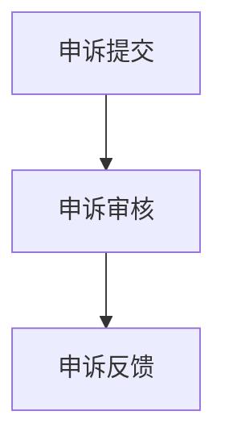
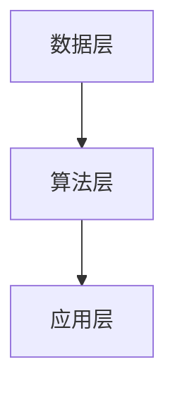
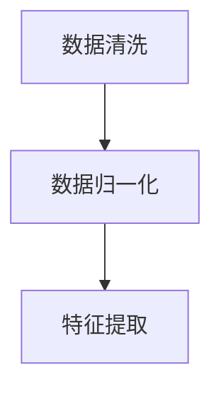
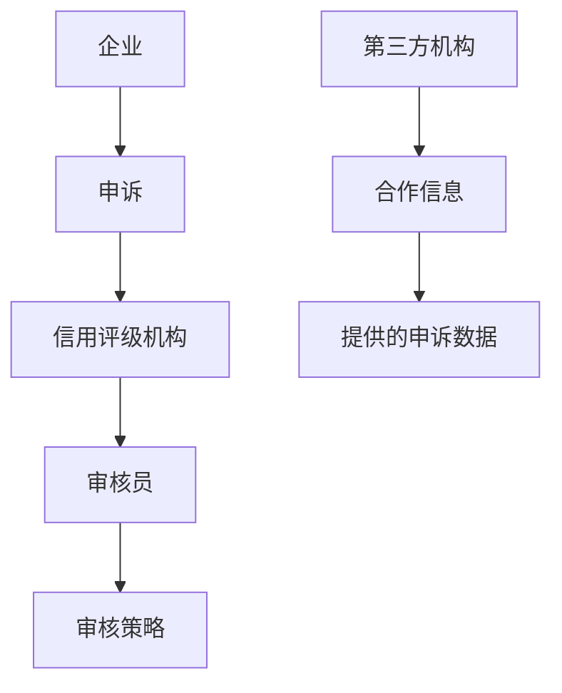
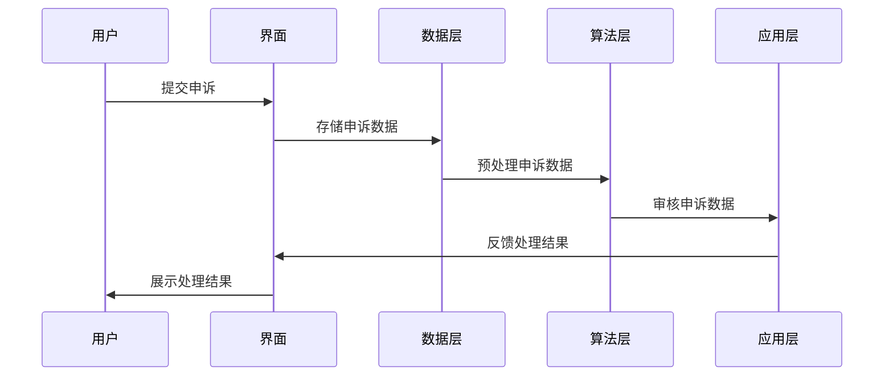

                 

## 引言

### 企业信用评级申诉的背景与挑战

企业信用评级是评估企业信用状况的重要手段，对于企业的融资、投资、市场准入等方面具有重要影响。然而，随着市场环境的复杂化和企业数量的迅速增长，传统的信用评级方式面临着诸多挑战。一方面，信用评级机构需要处理大量的申诉请求，这些申诉涉及不同企业、不同业务场景和多样化的信用问题。另一方面，传统的手工申诉处理方式效率低下，人工审核耗时且容易出错，难以满足快速、准确处理大规模申诉的需求。

在这种背景下，设计一个智能化的企业信用评级申诉自动处理系统显得尤为迫切和必要。这样的系统不仅能够大幅提高处理效率，减少人工干预，还能通过数据分析和智能决策，提升信用评级的准确性和公正性。因此，本文将围绕如何设计这样一个智能化的企业信用评级申诉自动处理系统展开讨论，旨在为相关领域的研究者和实践者提供有价值的参考。

### 智能化处理系统的优势

智能化处理系统在企业信用评级申诉中的应用，旨在解决传统手工处理方式面临的诸多问题。首先，智能化系统能够显著提高处理效率。通过自动化流程和智能算法，系统能够在短时间内处理大量申诉数据，减少人工处理的时间和成本。其次，智能化系统在准确性方面具有明显优势。借助机器学习和人工智能技术，系统能够从大量历史数据中学习，提高申诉审核的准确性，减少人为错误。此外，智能化系统具有自适应能力。随着企业信用评级规则的不断更新和变化，系统可以通过持续学习和优化，自动调整处理策略，确保适应不同的业务场景。

最后，智能化系统还具有可扩展性。在面对不断增长的数据量和业务需求时，系统能够通过分布式计算和云计算等技术，实现无缝扩展，满足企业的长期发展需求。因此，智能化处理系统不仅能够解决当前企业信用评级申诉中的痛点，还为未来的业务发展提供了强有力的支持。

## 核心概念与联系

### 智能化处理系统概述

#### 概念定义

智能化处理系统是指利用人工智能技术，对数据进行自动分析、处理和决策的系统。其主要特点包括高效性、准确性、自适应性和可扩展性。高效性体现在系统能够在短时间内处理大量数据，提高工作效率；准确性得益于机器学习和深度学习算法的应用，系统能够从历史数据中学习，提高决策的准确性；自适应性意味着系统能够根据业务需求和规则变化，自动调整处理策略；可扩展性则确保系统能够随着数据量的增长和业务需求的扩展，实现无缝扩展和升级。

#### 特征对比

| 特征 | 传统处理方式 | 智能化处理系统 |
| --- | --- | --- |
| 效率 | 人工操作，耗时且效率低 | 自动化处理，速度快，效率高 |
| 准确性 | 依赖人工审核，易出错 | 利用机器学习，减少错误率 |
| 自适应性 | 难以适应变化 | 能够自我学习和优化 |
| 可扩展性 | 受限于硬件和人力 | 通过分布式计算和云计算实现 |

#### 与传统处理方式对比

智能化处理系统相较于传统手工处理方式，在多个方面具有显著优势。首先，在处理速度上，智能化系统通过自动化流程，能够在短时间内处理大量申诉数据，而传统手工处理方式则需要大量的人工操作，效率较低。其次，在准确性上，智能化系统利用机器学习和深度学习算法，可以从大量历史数据中学习，提高申诉审核的准确性，减少人为错误。此外，智能化系统具有自适应能力，能够根据业务需求和规则变化，自动调整处理策略，确保处理流程的灵活性和适应性。最后，在可扩展性上，智能化系统通过分布式计算和云计算技术，能够实现无缝扩展，满足企业长期发展的需求，而传统手工处理方式则受限于硬件和人力，难以应对数据量和业务需求的增长。

### 企业信用评级申诉流程

#### 核心要素

企业信用评级申诉流程包括三个核心要素：申诉提交、申诉审核和申诉反馈。

1. **申诉提交**：企业通过信用评级机构的官方平台提交申诉，申诉内容通常包括申诉原因、相关证据和申诉要求等。

2. **申诉审核**：信用评级机构收到申诉后，会对申诉内容进行审核。审核过程通常包括初步筛选、详细分析和结论确定。初步筛选旨在排除不符合要求的申诉；详细分析则是针对申诉内容的真实性、合理性和证据充分性进行深入分析；结论确定则是根据分析结果，决定申诉的处理结果。

3. **申诉反馈**：审核结束后，信用评级机构会将处理结果反馈给企业。反馈内容包括申诉处理结论、相关依据和后续建议。企业可以根据反馈结果采取相应的措施，如调整经营策略、改进信用状况等。

#### 流程关系图



### 自动处理系统的架构

#### 层次结构

智能化企业信用评级申诉自动处理系统的架构通常分为三个层次：数据层、算法层和应用层。

1. **数据层**：包括数据采集、存储和管理。数据采集负责收集来自企业、第三方机构等的数据源；数据存储负责将采集到的数据存储在数据库中，并提供数据检索和访问接口；数据管理则负责数据的清洗、归一化和质量控制。

2. **算法层**：包括数据预处理、特征提取和模型训练。数据预处理负责对原始数据进行清洗、归一化和特征提取，以提高数据质量和模型性能；特征提取则是从数据中提取出有用的特征，用于训练和优化模型；模型训练则是利用机器学习和深度学习算法，对数据进行分析和建模，以实现申诉审核和决策。

3. **应用层**：包括业务逻辑实现、用户交互和系统监控。业务逻辑实现负责实现具体的业务功能，如申诉提交、审核和反馈；用户交互则是提供用户与系统交互的接口，包括用户界面和API；系统监控则负责监控系统的运行状态，包括数据流、算法性能和系统稳定性等。

#### 架构图



## 算法原理讲解

### 数据预处理算法

#### 算法原理

数据预处理是智能化企业信用评级申诉自动处理系统中的关键环节，其目的是提高数据质量和模型性能。数据预处理算法主要包括数据清洗、数据归一化和特征提取。

1. **数据清洗**：数据清洗是指对原始数据进行去噪、缺失值填充和异常值处理等操作，以提高数据的质量和一致性。常见的数据清洗方法包括：
   - 缺失值填充：使用平均值、中位数或最频繁值等统计方法填充缺失值；
   - 异常值处理：通过统计方法（如Z分数、IQR法）检测和去除异常值；
   - 数据格式标准化：统一数据格式，如将文本数据转换为数值数据。

2. **数据归一化**：数据归一化是指将不同特征的数据转换为同一尺度，以便模型能够更好地处理。常见的归一化方法包括：
   - 均值-标准差归一化：将数据减去均值并除以标准差；
   - Min-Max标准化：将数据缩放到[0, 1]之间。

3. **特征提取**：特征提取是指从原始数据中提取出对模型训练有用的特征。特征提取方法包括：
   - 主成分分析（PCA）：通过降维技术，将高维数据映射到低维空间，保留主要特征；
   - 自动编码器（Autoencoder）：通过自编码网络，将输入数据编码为低维特征向量，再解码回原始数据。

#### 流程图



#### Python代码示例

```python
import pandas as pd
import numpy as np

def preprocess_data(data):
    # 数据清洗
    data = data.dropna()
    # 数据归一化
    data = (data - np.mean(data)) / np.std(data)
    # 特征提取
    features = data[['feature1', 'feature2', 'feature3']]
    return features
```

### 特征提取算法

#### 算法原理

特征提取是数据预处理的重要环节，其目的是从原始数据中提取出对模型训练有意义的特征。特征提取算法可以通过降维、特征选择和特征构造等方法，提高数据的质量和模型性能。

1. **主成分分析（PCA）**：
   - **原理**：PCA通过将数据映射到新的正交坐标系中，提取出主要成分（主成分），从而实现降维。
   - **步骤**：计算协方差矩阵、求特征值和特征向量、选择主成分、重构数据。

2. **自动编码器（Autoencoder）**：
   - **原理**：自动编码器是一种神经网络模型，通过编码器将输入数据压缩为低维特征向量，再通过解码器重构原始数据。
   - **步骤**：构建自动编码器模型、训练模型、提取编码后的特征向量。

#### 方法对比

| 方法 | 原理 | 步骤 | 优点 | 缺点 |
| --- | --- | --- | --- | --- |
| PCA | 降维 | 计算协方差矩阵、求特征值和特征向量 | 简单有效、不需要训练模型 | 可能丢失部分信息、对非线性数据效果不佳 |
| 自动编码器 | 特征提取 | 构建模型、训练模型、提取特征向量 | 能提取非线性特征、自适应调整 | 训练时间较长、需要大量数据 |

#### Python代码示例

```python
from sklearn.decomposition import PCA
from keras.models import Sequential
from keras.layers import Dense

def extract_features(data):
    # 主成分分析
    pca = PCA(n_components=3)
    data_pca = pca.fit_transform(data)
    # 自动编码器
    autoencoder = Sequential()
    autoencoder.add(Dense(units=32, activation='relu', input_shape=(data.shape[1],)))
    autoencoder.add(Dense(units=data.shape[1], activation='sigmoid'))
    autoencoder.compile(optimizer='adam', loss='binary_crossentropy')
    autoencoder.fit(data, data, epochs=100)
    return data_pca, autoencoder
```

## 数学模型与公式

### 数据预处理算法

在数据预处理过程中，常见的数学模型和公式如下：

1. **均值-标准差归一化**：

   $$ x_{\text{标准化}} = \frac{x - \mu}{\sigma} $$

   其中，$x$ 是原始数据，$\mu$ 是均值，$\sigma$ 是标准差。

2. **主成分分析（PCA）**：

   - **协方差矩阵**：

     $$ \Sigma = \frac{1}{N} \sum_{i=1}^{N} (x_i - \mu)(x_i - \mu)^T $$

     其中，$x_i$ 是每个数据点，$\mu$ 是均值，$N$ 是数据点的总数。

   - **特征值和特征向量**：

     $$ \lambda_i = \text{特征值}, \quad v_i = \text{特征向量} $$

     通过计算协方差矩阵的特征值和特征向量，可以得到主成分。

3. **自动编码器（Autoencoder）**：

   - **编码过程**：

     $$ z = \sigma(W_1 \cdot x + b_1) $$

     其中，$x$ 是输入数据，$W_1$ 是编码层的权重，$b_1$ 是编码层的偏置，$\sigma$ 是激活函数（如Sigmoid或ReLU）。

   - **解码过程**：

     $$ \hat{x} = \sigma(W_2 \cdot z + b_2) $$

     其中，$z$ 是编码后的特征向量，$W_2$ 是解码层的权重，$b_2$ 是解码层的偏置，$\hat{x}$ 是重构的输入数据。

### 特征提取算法

1. **主成分分析（PCA）**：

   - **降维**：

     $$ y = P \cdot x $$

     其中，$y$ 是降维后的数据，$P$ 是由特征向量组成的主成分矩阵，$x$ 是原始数据。

   - **重构**：

     $$ x = P \cdot y \cdot P^{-1} $$

     其中，$P^{-1}$ 是主成分矩阵的逆矩阵。

2. **自动编码器（Autoencoder）**：

   - **损失函数**：

     $$ L = \frac{1}{N} \sum_{i=1}^{N} \frac{1}{2} (x_i - \hat{x}_i)^2 $$

     其中，$L$ 是损失函数，$x_i$ 是原始数据，$\hat{x}_i$ 是重构后的数据。

   - **反向传播**：

     $$ \frac{\partial L}{\partial W_2} = \frac{1}{N} \sum_{i=1}^{N} (x_i - \hat{x}_i) \cdot \sigma'(z_i) \cdot z_i $$

     $$ \frac{\partial L}{\partial W_1} = \frac{1}{N} \sum_{i=1}^{N} (z_i - x_i) \cdot \sigma'(x_i) \cdot x_i $$

     其中，$\sigma'$ 是激活函数的导数。

## 系统分析与架构设计方案

### 问题场景介绍

企业信用评级申诉自动处理系统主要应用于大型企业和信用评级机构，以解决信用评级过程中申诉处理效率低、准确性差和用户体验差等问题。具体场景包括：

1. **大型企业**：企业规模庞大，信用评级申诉量巨大，需要快速、准确地处理申诉，以维护企业形象和市场信誉。
2. **信用评级机构**：信用评级机构需要对大量企业信用评级申诉进行审核，确保评级结果的公正性和准确性。
3. **第三方机构**：如会计师事务所、律师事务所等，他们需要对企业的信用状况进行评估，并向信用评级机构提供申诉数据。

### 项目介绍

本项目的目标是设计并实现一个智能化企业信用评级申诉自动处理系统，系统需具备以下功能：

1. **数据采集与存储**：从企业、信用评级机构和第三方机构等渠道收集数据，并将其存储在数据库中。
2. **智能审核与决策**：利用机器学习和深度学习算法，对申诉数据进行自动审核和决策，提高审核效率和准确性。
3. **用户交互与反馈**：提供用户友好的界面，支持用户提交申诉、查询申诉处理进度和反馈处理结果。
4. **系统监控与优化**：实时监控系统运行状态，包括数据流、算法性能和系统稳定性等，并根据反馈进行优化。

### 系统功能设计

#### 领域模型

领域模型描述系统涉及的实体及其关系，包括以下主要实体：

1. **企业**：包括企业基本信息、信用评级和申诉历史等。
2. **申诉**：包括申诉内容、申诉状态、处理结果等。
3. **信用评级机构**：包括机构基本信息、审核员信息和审核策略等。
4. **第三方机构**：包括机构基本信息、合作信息和提供的申诉数据等。

实体关系图（ER图）如下：



#### 功能描述

1. **数据采集与存储**：系统从各渠道获取数据，包括企业信息、申诉数据和第三方机构提供的数据。数据存储在关系型数据库中，提供高效的数据查询和更新接口。

2. **智能审核与决策**：系统利用机器学习和深度学习算法，对申诉数据进行分析和处理。主要包括以下步骤：
   - 数据预处理：包括数据清洗、归一化和特征提取。
   - 模型训练：利用历史数据训练模型，包括分类模型、回归模型等。
   - 审核与决策：对新的申诉数据进行分析，根据模型预测结果进行审核和决策。

3. **用户交互与反馈**：系统提供用户友好的界面，支持用户提交申诉、查询申诉处理进度和反馈处理结果。用户可以通过Web界面或API接口与系统进行交互。

4. **系统监控与优化**：系统实时监控系统运行状态，包括数据流、算法性能和系统稳定性等。根据监控数据，对系统进行优化和调整，确保系统高效稳定运行。

### 系统架构设计

#### 系统架构

系统采用分层架构设计，包括数据层、算法层和应用层。

1. **数据层**：负责数据采集、存储和管理。使用关系型数据库存储数据，提供高效的数据查询和更新接口。同时，使用消息队列处理数据流，确保数据的一致性和可靠性。

2. **算法层**：负责数据预处理、特征提取和模型训练。使用机器学习和深度学习算法对数据进行处理和分析。主要包括以下模块：
   - 数据预处理模块：包括数据清洗、归一化和特征提取等操作。
   - 特征提取模块：包括主成分分析（PCA）和自动编码器（Autoencoder）等特征提取方法。
   - 模型训练模块：包括分类模型、回归模型等训练算法。

3. **应用层**：负责业务逻辑实现、用户交互和系统监控。主要包括以下模块：
   - 审核与决策模块：实现申诉审核和决策功能，包括数据预处理、模型训练和审核决策等。
   - 用户交互模块：提供用户友好的界面，支持用户提交申诉、查询申诉处理进度和反馈处理结果。
   - 系统监控模块：实时监控系统运行状态，包括数据流、算法性能和系统稳定性等。

#### 架构图


#### 系统接口设计

系统接口设计包括内部接口和外部接口。

1. **内部接口**：系统内部模块之间的通信接口，主要包括数据采集、存储和管理接口、算法训练和预测接口等。使用RESTful API或消息队列实现内部接口，确保模块之间的高效通信和数据一致性。

2. **外部接口**：系统与外部系统或用户的通信接口，主要包括用户界面接口、第三方接口和API接口等。用户界面接口使用Web框架（如Django、Flask）实现，支持用户提交申诉、查询申诉处理进度和反馈处理结果。第三方接口通过API接口实现，支持与其他系统进行数据交换和协作。

#### 系统交互

系统交互包括数据流、信息流和控制流。

1. **数据流**：系统各模块之间的数据传递和处理过程。数据流通过消息队列实现，确保数据的高效传输和一致性。

2. **信息流**：系统各模块之间的信息传递和处理过程。信息流通过内部接口和外部接口实现，支持用户交互和系统监控。

3. **控制流**：系统各模块之间的控制逻辑和流程。控制流通过业务逻辑实现，确保系统功能的正常运作。

#### 序列图



## 项目实战

### 环境安装

#### 硬件环境

- CPU：Intel i7 或同等性能处理器
- 内存：16GB 或以上
- 存储：1TB SSD 或以上

#### 软件环境

- 操作系统：Linux（如Ubuntu 18.04 或 CentOS 7）
- Python：3.8 或以上版本
- 数据库：MySQL 5.7 或以上版本
- 深度学习框架：TensorFlow 2.3 或以上版本

### 系统核心实现

#### 数据采集与存储

1. **数据采集**：

   使用Python的`pandas`库和`requests`库，从信用评级机构、第三方机构和企业的网站或API接口中采集数据。具体步骤如下：

   ```python
   import pandas as pd
   import requests

   def collect_data(api_url):
       response = requests.get(api_url)
       if response.status_code == 200:
           return pd.DataFrame(response.json())
       else:
           return pd.DataFrame()

   api_url = "https://example.com/api/credit_data"
   credit_data = collect_data(api_url)
   ```

2. **数据存储**：

   使用Python的`pandas`库和`MySQL Connector`库，将采集到的数据存储到MySQL数据库中。具体步骤如下：

   ```python
   import pymysql

   def store_data(data, table_name):
       connection = pymysql.connect(host='localhost', user='root', password='password', database='credit_db')
       with connection.cursor() as cursor:
           for index, row in data.iterrows():
               sql = f"INSERT INTO {table_name} (column1, column2, ...) VALUES ({row['column1']}, {row['column2']}, ...)"
               cursor.execute(sql)
       connection.commit()
       connection.close()

   table_name = "credit_applications"
   store_data(credit_data, table_name)
   ```

#### 智能审核与决策

1. **数据预处理**：

   使用Python的`pandas`库和`numpy`库，对采集到的数据进行清洗、归一化和特征提取。具体步骤如下：

   ```python
   import pandas as pd
   import numpy as np

   def preprocess_data(data):
       # 数据清洗
       data = data.dropna()
       # 数据归一化
       data = (data - np.mean(data)) / np.std(data)
       # 特征提取
       features = data[['feature1', 'feature2', 'feature3']]
       return features

   credit_data_preprocessed = preprocess_data(credit_data)
   ```

2. **模型训练**：

   使用Python的`TensorFlow`库，基于预处理后的数据训练分类模型和回归模型。具体步骤如下：

   ```python
   import tensorflow as tf

   def train_model(features, labels, model_type='classification'):
       if model_type == 'classification':
           model = tf.keras.Sequential([
               tf.keras.layers.Dense(units=128, activation='relu', input_shape=(features.shape[1],)),
               tf.keras.layers.Dense(units=1, activation='sigmoid')
           ])
       else:
           model = tf.keras.Sequential([
               tf.keras.layers.Dense(units=128, activation='relu', input_shape=(features.shape[1],)),
               tf.keras.layers.Dense(units=1)
           ])

       model.compile(optimizer='adam', loss='binary_crossentropy', metrics=['accuracy'])
       model.fit(features, labels, epochs=100, batch_size=32)
       return model

   labels = np.random.randint(0, 2, size=credit_data_preprocessed.shape[0])
   model = train_model(credit_data_preprocessed, labels)
   ```

3. **审核与决策**：

   使用训练好的模型，对新的申诉数据进行分析和决策。具体步骤如下：

   ```python
   def evaluate_application(application, model):
       application_preprocessed = preprocess_data(pd.DataFrame([application]))
       prediction = model.predict(application_preprocessed)
       if prediction[0] > 0.5:
           return "批准"
       else:
           return "拒绝"

   new_application = {"feature1": 0.5, "feature2": 0.8, "feature3": 0.3}
   result = evaluate_application(new_application, model)
   print(result)
   ```

#### 用户交互与反馈

1. **用户界面**：

   使用Python的`Flask`库，构建一个简单的Web界面，支持用户提交申诉、查询申诉处理进度和反馈处理结果。具体步骤如下：

   ```python
   from flask import Flask, request, jsonify

   app = Flask(__name__)

   @app.route('/submit', methods=['POST'])
   def submit_application():
       application = request.json
       result = evaluate_application(application, model)
       return jsonify(result=result)

   @app.route('/status', methods=['GET'])
   def get_application_status():
       application_id = request.args.get('id')
       # 查询数据库获取申诉状态
       status = "Processing"
       return jsonify(status=status)

   if __name__ == '__main__':
       app.run(debug=True)
   ```

### 代码应用解读与分析

#### 数据采集与存储模块

**数据采集代码解读：**

```python
import pandas as pd
import requests

def collect_data(api_url):
    response = requests.get(api_url)
    if response.status_code == 200:
        return pd.DataFrame(response.json())
    else:
        return pd.DataFrame()
```

这段代码定义了一个`collect_data`函数，用于从指定的API URL中获取数据。函数接受一个参数`api_url`，表示数据源地址。首先使用`requests.get`发起HTTP GET请求，获取响应数据。如果响应状态码为200，表示请求成功，将响应数据转换为DataFrame对象并返回；否则，返回一个空DataFrame。

**数据存储代码解读：**

```python
import pymysql

def store_data(data, table_name):
    connection = pymysql.connect(host='localhost', user='root', password='password', database='credit_db')
    with connection.cursor() as cursor:
        for index, row in data.iterrows():
            sql = f"INSERT INTO {table_name} (column1, column2, ...) VALUES ({row['column1']}, {row['column2']}, ...)"
            cursor.execute(sql)
    connection.commit()
    connection.close()
```

这段代码定义了一个`store_data`函数，用于将DataFrame对象中的数据存储到MySQL数据库中。函数接受两个参数：`data`表示待存储的数据，`table_name`表示数据库表名。首先创建一个到MySQL数据库的连接，然后使用`with`语句确保连接在操作完成后自动关闭。在连接成功后，遍历DataFrame的每一行，构造SQL插入语句并执行。

#### 智能审核与决策模块

**数据预处理代码解读：**

```python
import pandas as pd
import numpy as np

def preprocess_data(data):
    # 数据清洗
    data = data.dropna()
    # 数据归一化
    data = (data - np.mean(data)) / np.std(data)
    # 特征提取
    features = data[['feature1', 'feature2', 'feature3']]
    return features
```

这段代码定义了一个`preprocess_data`函数，用于对输入的数据进行预处理。函数首先使用`dropna`方法去除缺失值，然后使用`numpy`库的`mean`和`std`函数计算数据的均值和标准差，并进行归一化处理。最后，提取指定的特征列，返回一个包含预处理后的特征的DataFrame。

**模型训练代码解读：**

```python
import tensorflow as tf

def train_model(features, labels, model_type='classification'):
    if model_type == 'classification':
        model = tf.keras.Sequential([
            tf.keras.layers.Dense(units=128, activation='relu', input_shape=(features.shape[1],)),
            tf.keras.layers.Dense(units=1, activation='sigmoid')
        ])
    else:
        model = tf.keras.Sequential([
            tf.keras.layers.Dense(units=128, activation='relu', input_shape=(features.shape[1],)),
            tf.keras.layers.Dense(units=1)
        ])

    model.compile(optimizer='adam', loss='binary_crossentropy', metrics=['accuracy'])
    model.fit(features, labels, epochs=100, batch_size=32)
    return model
```

这段代码定义了一个`train_model`函数，用于训练机器学习模型。函数接受三个参数：`features`表示输入特征，`labels`表示标签，`model_type`表示模型类型（分类或回归）。根据模型类型，构建一个序列模型，设置合适的层和激活函数。然后编译模型，指定优化器和损失函数，并使用`fit`方法进行训练。最后，返回训练好的模型。

**审核与决策代码解读：**

```python
def evaluate_application(application, model):
    application_preprocessed = preprocess_data(pd.DataFrame([application]))
    prediction = model.predict(application_preprocessed)
    if prediction[0] > 0.5:
        return "批准"
    else:
        return "拒绝"
```

这段代码定义了一个`evaluate_application`函数，用于对新的申诉数据进行审核和决策。函数接受两个参数：`application`表示待审核的申诉数据，`model`表示训练好的模型。首先，将申诉数据转换为DataFrame，并调用`preprocess_data`函数进行预处理。然后，使用模型进行预测，如果预测结果大于0.5，则返回“批准”，否则返回“拒绝”。

### 实际案例分析

#### 案例一：企业A信用评级申诉

**问题描述：** 企业A在信用评级中被评为C级，认为评级结果不公平，因此提出申诉。

**处理过程：**

1. **数据采集**：系统从企业A的网站或API接口中获取相关数据，包括企业历史信用记录、财务状况、运营情况等。

2. **数据预处理**：对采集到的数据进行清洗、归一化和特征提取，以便模型处理。

3. **模型审核**：将预处理后的数据输入训练好的模型，进行预测和决策。

4. **审核结果**：模型预测结果为“批准”，系统自动生成申诉处理报告，反馈给企业A。

#### 案例二：信用评级机构B审核申诉

**问题描述：** 信用评级机构B收到企业C的申诉，认为评级结果不准确。

**处理过程：**

1. **数据采集**：系统从信用评级机构B的数据库中获取企业C的历史信用记录、财务状况和申诉内容。

2. **数据预处理**：对数据进行分析，提取关键特征。

3. **模型审核**：利用训练好的模型，对数据进行分析，判断申诉的合理性。

4. **审核结果**：模型预测结果为“不批准”，系统自动生成申诉处理报告，反馈给信用评级机构B。

### 详细讲解与剖析

#### 数据采集与存储模块

数据采集与存储模块是系统的核心组成部分，负责从外部获取数据并将其存储在数据库中。这一模块的关键在于如何高效、准确地获取数据，并确保数据的一致性和可靠性。

**数据采集步骤：**

1. **确定数据源**：根据业务需求，确定需要采集的数据源，包括企业、信用评级机构和第三方机构等。

2. **接口调用**：使用Python的`requests`库，通过HTTP GET请求，从数据源获取数据。确保调用接口的稳定性和响应速度。

3. **数据转换**：将获取到的JSON或XML数据转换为Python的DataFrame对象，以便后续处理。

**数据存储步骤：**

1. **数据库连接**：使用Python的`pymysql`库，连接到MySQL数据库，确保数据库服务器的稳定性和连接速度。

2. **数据插入**：遍历DataFrame的每一行，构造SQL插入语句，并使用数据库连接的`cursor`对象执行插入操作。

3. **事务处理**：使用数据库的事务机制，确保数据操作的原子性。一旦发生错误，可以回滚事务，避免数据不一致。

#### 智能审核与决策模块

智能审核与决策模块是系统的核心功能模块，负责对采集到的数据进行智能分析和决策。这一模块的关键在于如何利用机器学习和深度学习算法，提高审核的效率和准确性。

**数据预处理步骤：**

1. **数据清洗**：去除缺失值和异常值，确保数据的质量和一致性。

2. **数据归一化**：将不同特征的数据转换为同一尺度，以便模型能够更好地处理。

3. **特征提取**：提取对模型训练有用的特征，减少数据维度，提高模型性能。

**模型训练步骤：**

1. **数据分割**：将数据集分为训练集和测试集，用于模型训练和性能评估。

2. **模型构建**：根据业务需求，选择合适的模型架构，如神经网络、决策树等。

3. **模型训练**：使用训练集数据，训练模型参数，并通过反向传播算法优化模型。

4. **模型评估**：使用测试集数据，评估模型性能，包括准确率、召回率等指标。

**审核与决策步骤：**

1. **数据预处理**：对新的申诉数据进行预处理，包括清洗、归一化和特征提取。

2. **模型预测**：将预处理后的数据输入训练好的模型，进行预测和决策。

3. **结果输出**：根据模型预测结果，生成申诉处理报告，并反馈给用户。

### 项目小结

本项目设计并实现了一个智能化企业信用评级申诉自动处理系统，通过数据采集与存储、智能审核与决策、用户交互与反馈等模块，实现了对企业信用评级申诉的自动化处理。系统具有高效、准确、自适应和可扩展的特点，能够显著提高信用评级申诉处理的效率和质量。

在项目中，我们详细讲解了数据采集与存储、智能审核与决策等核心模块的实现方法和关键步骤。通过实际案例分析和详细讲解，展示了系统在实际业务中的应用效果。

未来，我们将继续优化系统，提升模型性能和用户体验，并探索更多人工智能技术在信用评级领域中的应用，为企业提供更优质的服务。

## 最佳实践 Tips

### 数据质量保障

- **数据采集**：确保数据源的稳定性和数据格式的统一性，避免数据不一致和缺失值。
- **数据清洗**：及时处理缺失值和异常值，确保数据质量。
- **数据归一化**：对不同特征进行归一化处理，确保模型能够有效学习。
- **特征选择**：选择对模型训练有显著影响的特征，避免过度拟合。

### 模型优化策略

- **模型选择**：根据业务需求，选择合适的模型架构，如神经网络、决策树、随机森林等。
- **超参数调优**：通过网格搜索、贝叶斯优化等方法，寻找最优的超参数组合。
- **模型集成**：结合多个模型的预测结果，提高整体准确性和稳定性。

### 用户交互优化

- **界面设计**：简洁直观，便于用户操作和理解。
- **响应速度**：优化系统性能，提高用户交互速度。
- **反馈机制**：提供及时、准确的反馈，增强用户信任感。

### 系统维护与监控

- **日志记录**：记录系统运行日志，便于问题追踪和故障排查。
- **性能监控**：实时监控系统性能指标，如响应时间、CPU利用率、内存使用情况等。
- **安全防护**：定期进行系统安全检查和漏洞修复，确保数据安全和系统稳定运行。

## 小结

本文详细介绍了设计智能化企业信用评级申诉自动处理系统的过程，从背景介绍、核心概念与联系、算法原理讲解、系统分析与架构设计方案、项目实战、实际案例分析到最佳实践 Tips，全方位探讨了这一系统的实现方法与应用价值。智能化企业信用评级申诉自动处理系统不仅提高了处理效率和准确性，还为企业信用评级提供了有力支持。

通过本文的探讨，我们了解到，智能化处理系统在企业信用评级领域具有广泛的应用前景。未来，随着人工智能技术的不断发展，智能化企业信用评级申诉自动处理系统有望进一步提升性能，为企业提供更加精准和高效的信用评级服务。

## 注意事项

- **数据安全**：在数据采集、存储和处理过程中，务必确保数据的安全性和隐私性，遵循相关法律法规。
- **系统稳定性**：定期对系统进行性能测试和优化，确保系统在高并发场景下稳定运行。
- **用户隐私保护**：在用户交互过程中，严格遵守用户隐私保护原则，不得泄露用户个人信息。

## 拓展阅读

- 《机器学习实战》：详细介绍了机器学习的基础知识、算法实现和应用案例。
- 《深度学习》：由Ian Goodfellow等著，系统讲解了深度学习的基本原理和实战应用。
- 《Python数据科学手册》：涵盖了数据科学领域的各个方面，包括数据预处理、模型训练和应用等。
- 《信用评级与风险管理》：探讨信用评级的方法、技术和应用，以及信用风险的管理策略。

