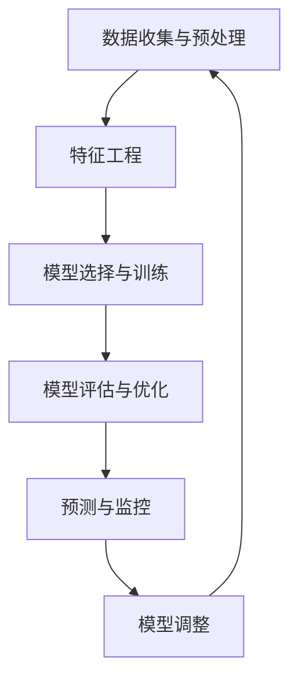
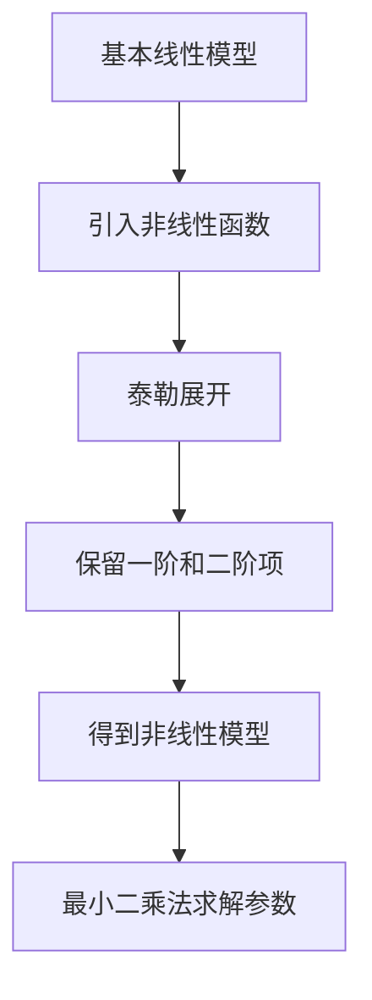
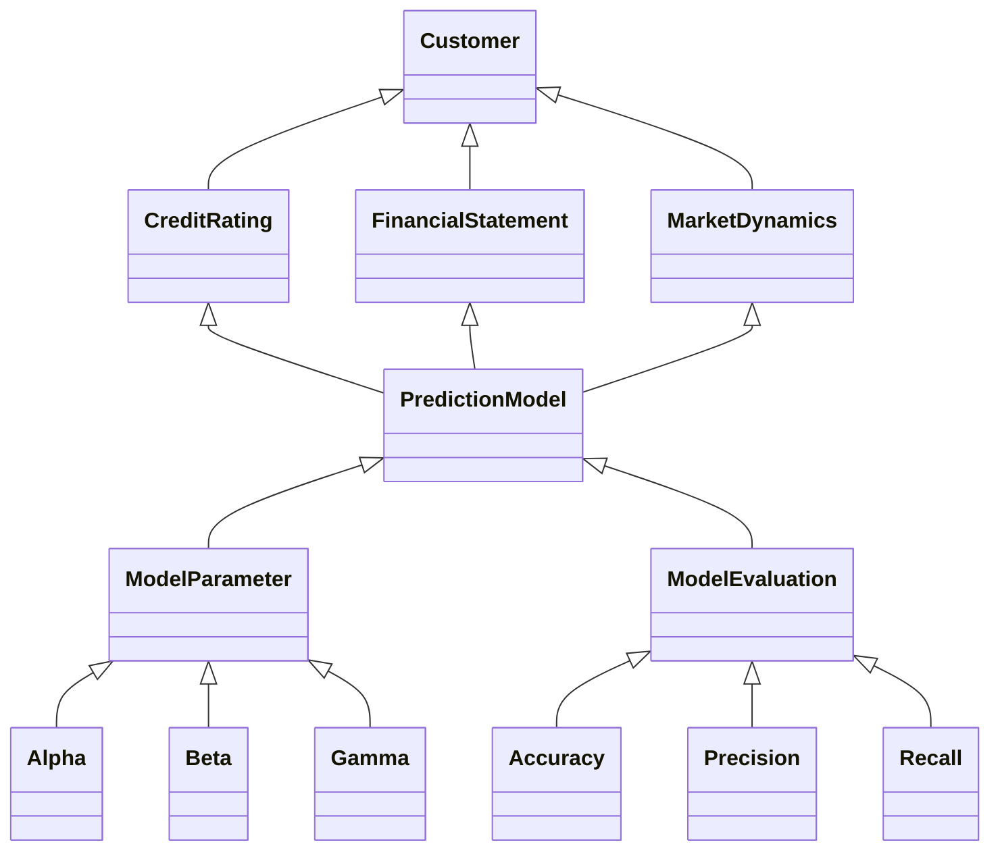
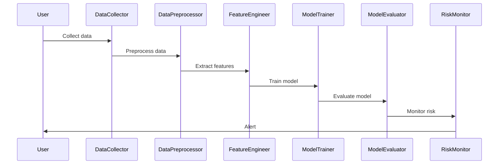
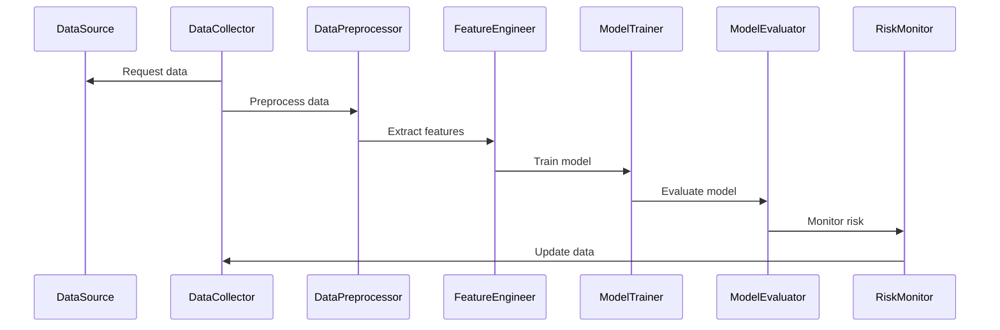

                 


### 引言

在商业世界中，企业信用违约损失率（Credit Default Loss Rate）是一个至关重要的指标，它不仅影响到金融机构的财务健康，也对整个经济体的稳定性产生深远的影响。随着全球商业活动的日益复杂和不确定性增加，准确预测企业信用违约损失率成为风险管理的重要环节。传统的预测方法，如统计模型和财务分析，虽然在一定程度上能够提供有价值的见解，但往往难以应对动态变化和复杂的市场环境。

近年来，人工智能（AI）技术的快速发展为信用违约损失率的预测带来了全新的可能性。智能化预测模型通过利用大量历史数据和先进的算法，可以更精准地识别风险因素，提高预测的准确性和时效性。本文旨在设计一个智能化的企业信用违约损失率动态预测模型，旨在为企业提供一种高效的信用风险管理工具。

本文的结构如下：

1. **背景介绍**：首先，我们将介绍企业信用违约损失率的定义和重要性，以及当前企业信用风险管理的挑战。
2. **核心概念与联系**：接着，我们将详细阐述核心概念，并通过概念属性特征对比表格和ER实体关系图来展示概念之间的关系。
3. **算法原理讲解**：我们将深入探讨动态预测模型的算法原理，包括基本原理、Mermaid流程图、Python源代码实现、数学模型及公式讲解，以及举例说明。
4. **系统分析与架构设计**：然后，我们将分析系统架构，包括问题场景介绍、项目介绍、系统功能设计（领域模型）、系统架构设计、系统接口设计和系统交互。
5. **项目实战**：在这一部分，我们将详细介绍项目实战过程，包括环境安装、系统核心实现源代码、代码应用解读与分析，以及实际案例分析和详细讲解。
6. **总结与展望**：最后，我们将总结最佳实践、注意事项，并对未来的发展趋势进行展望。

通过以上步骤，我们将逐步构建一个智能化的企业信用违约损失率动态预测模型，帮助企业更有效地进行信用风险管理。

### 背景介绍

#### 企业信用违约损失率的定义与重要性

企业信用违约损失率（Credit Default Loss Rate，简称CDLR）是指企业在偿还债务过程中未能按时履行还款义务，从而导致债权人遭受损失的概率。具体来说，CDLR可以通过以下公式计算：

$$
CDLR = \frac{\text{违约损失金额}}{\text{总贷款金额}} \times 100\%
$$

其中，违约损失金额指的是由于企业违约而导致的实际损失金额；总贷款金额则是债权人向企业提供的全部贷款总额。CDLR是衡量企业信用风险的重要指标，直接反映了企业在财务上的稳健性和偿债能力。

在商业活动中，企业信用违约损失率具有重要的意义。首先，对于金融机构而言，准确的CDLR预测有助于其制定合理的信贷政策，降低贷款风险，从而保护自身的资产安全。其次，对于企业自身来说，了解自身的信用违约损失率有助于其调整经营策略，改善财务状况，提高市场竞争力。此外，CDLR的预测还能为投资者提供决策依据，帮助其评估投资风险，优化投资组合。

#### 企业信用风险管理的挑战

尽管企业信用违约损失率在风险管理中具有重要作用，但当前企业信用风险管理面临诸多挑战。首先，数据获取困难是主要问题之一。企业信用数据通常涉及多个来源，包括金融机构、政府监管机构、第三方数据提供商等，这些数据的获取往往存在限制和隐私问题，导致数据不完整或质量不高。

其次，数据处理的复杂性也是一个巨大挑战。信用违约损失率的预测依赖于大量历史数据，这些数据不仅规模庞大，而且包含多种类型的信息，如财务报表、信用评分、市场动态等。如何有效地整合和处理这些数据，提取出有价值的信息，是实施信用风险管理的关键。

此外，市场环境的动态变化增加了预测的难度。经济形势、行业政策、国际关系等因素都会对企业信用违约损失率产生影响，这使得传统的静态预测方法难以适应不断变化的环境。为了提高预测的准确性，需要采用能够实时更新和动态调整的预测模型。

#### 动态预测模型的需求

针对上述挑战，智能化动态预测模型的需求显得尤为迫切。首先，动态预测模型可以通过机器学习和深度学习等技术，从大量历史数据中自动提取特征，建立预测模型。这种模型不仅能够处理复杂的数据，还能够自适应市场环境的变化，提高预测的准确性和实时性。

其次，动态预测模型可以充分利用现代计算资源，实现高效的数据处理和分析。例如，使用分布式计算框架可以快速处理海量数据，使用高性能计算资源可以加速模型训练和预测过程。

最后，动态预测模型还可以实现实时风险监控和预警，帮助企业及时识别和应对潜在的信用违约风险。通过实时数据流分析，动态预测模型可以快速响应市场变化，提供及时、准确的预测结果。

总之，设计智能化的企业信用违约损失率动态预测模型不仅有助于提高信用风险管理的效率和准确性，还能够为企业提供强有力的决策支持，从而在激烈的市场竞争中占据有利地位。

#### 智能化预测模型的现状与趋势

随着人工智能技术的飞速发展，智能化预测模型在各个领域得到了广泛应用，企业信用违约损失率预测也不例外。本文将回顾智能化预测模型的发展历程，探讨当前主流的预测模型与技术，并分析其在企业信用违约损失率预测中的应用场景。

##### 发展历程

智能化预测模型的发展可以追溯到20世纪80年代，当时统计模型和财务分析开始被引入信用风险评估领域。这些方法主要通过分析企业的财务报表和信用评分数据，对信用违约损失率进行预测。然而，这些传统方法往往依赖于人为经验，难以处理复杂的数据和动态变化的市场环境。

进入21世纪，随着计算机性能的提升和大数据技术的兴起，机器学习算法开始在信用违约损失率预测中得到应用。早期的机器学习方法，如线性回归、逻辑回归和支持向量机（SVM），通过训练模型从大量历史数据中学习规律，提高了预测的准确性。

近年来，深度学习技术的突破进一步推动了智能化预测模型的发展。深度学习算法，如神经网络和卷积神经网络（CNN），通过多层神经网络结构自动提取高级特征，实现了更高层次的预测精度。特别是循环神经网络（RNN）和长短时记忆网络（LSTM），可以处理时序数据，适用于动态信用违约损失率的预测。

##### 主流预测模型与技术

目前，主流的智能化预测模型主要包括以下几类：

1. **机器学习模型**：如线性回归、逻辑回归、决策树、随机森林和支持向量机（SVM）等。这些模型通过训练历史数据，提取特征并建立预测模型，具有较高的准确性和稳定性。

2. **深度学习模型**：如神经网络（Neural Networks）、卷积神经网络（CNN）和循环神经网络（RNN）。这些模型能够自动提取高级特征，尤其适用于处理复杂和非线性关系的数据。

3. **集成学习模型**：如随机森林（Random Forest）和梯度提升树（Gradient Boosting Tree，GBDT）。这些模型通过结合多个基模型，提高预测的鲁棒性和准确性。

4. **深度强化学习模型**：结合深度学习和强化学习技术，通过模拟与真实环境的交互，实现动态信用违约损失率的预测。

##### 应用场景

智能化预测模型在企业信用违约损失率预测中的应用场景主要包括以下几个方面：

1. **贷款审批**：金融机构可以通过智能化预测模型对借款企业的信用风险进行评估，提高贷款审批的准确性和效率。

2. **信用评级**：信用评级机构可以利用智能化预测模型对企业进行信用评级，提供更精准的风险评估服务。

3. **风险监控**：企业可以通过智能化预测模型实时监控信用风险，及时发现潜在的违约风险，采取相应的风险管理措施。

4. **投资决策**：投资者可以通过智能化预测模型分析企业的信用风险，优化投资组合，降低投资风险。

总之，智能化预测模型为企业信用违约损失率预测提供了强大的工具，通过结合多种技术手段，可以实现更精准、更高效的信用风险管理。随着技术的不断进步，未来智能化预测模型将在信用风险领域发挥更大的作用。

### 核心概念与联系

在设计智能化的企业信用违约损失率动态预测模型时，理解并准确使用核心概念至关重要。以下是本文涉及的主要核心概念及其属性特征对比表格，同时通过ER实体关系图展示了这些概念之间的联系。

#### 核心概念

1. **信用违约损失率（Credit Default Loss Rate，CDLR）**
   - 定义：违约损失金额与总贷款金额的比率。
   - 属性：违约损失金额、总贷款金额、时间戳。

2. **信用评分（Credit Score）**
   - 定义：反映企业信用状况的量化指标。
   - 属性：信用评分值、历史信用记录、财务状况。

3. **财务报表（Financial Statements）**
   - 定义：企业财务状况的反映。
   - 属性：资产负债表、利润表、现金流量表。

4. **市场动态（Market Dynamics）**
   - 定义：影响企业信用状况的市场因素。
   - 属性：宏观经济指标、行业趋势、政策变化。

5. **预测模型（Prediction Model）**
   - 定义：用于预测信用违约损失率的算法。
   - 属性：模型结构、训练数据、预测结果。

#### 概念属性特征对比表格

| 概念          | 定义                          | 属性                |
|---------------|-------------------------------|--------------------|
| 信用违约损失率（CDLR） | 违约损失金额与总贷款金额的比率 | 违约损失金额、总贷款金额、时间戳 |
| 信用评分       | 反映企业信用状况的量化指标      | 信用评分值、历史信用记录、财务状况 |
| 财务报表       | 企业财务状况的反映             | 资产负债表、利润表、现金流量表 |
| 市场动态       | 影响企业信用状况的市场因素      | 宏观经济指标、行业趋势、政策变化 |
| 预测模型       | 用于预测信用违约损失率的算法    | 模型结构、训练数据、预测结果 |

#### ER实体关系图

以下是ER实体关系图的Mermaid表示，展示了上述概念之间的联系：

```mermaid
erDiagram
  CreditRating ||--|{ CreditDefaultLossRate }|-- FinancialStatement
  CreditRating ||--|{ MarketDynamics }|-- FinancialStatement
  PredictionModel ||--|{ CreditRating }|-- FinancialStatement
  PredictionModel ||--|{ CreditDefaultLossRate }|-- FinancialStatement
  MarketDynamics ||--|{ PredictionModel }|-- FinancialStatement
```

在这个ER实体关系图中，`CreditRating`（信用评分）与`CreditDefaultLossRate`（信用违约损失率）、`FinancialStatement`（财务报表）和`MarketDynamics`（市场动态）之间存在关联关系。`PredictionModel`（预测模型）也与`CreditRating`、`CreditDefaultLossRate`和`FinancialStatement`密切相关，表明了它们在信用违约损失率预测中的相互作用和影响。

通过理解并准确使用这些核心概念及其关系，我们能够更深入地分析和设计智能化的企业信用违约损失率动态预测模型，为企业提供更精准的信用风险管理工具。

### 动态预测模型的算法原理讲解

为了深入理解智能化的企业信用违约损失率动态预测模型，我们需要从算法的基本原理入手。以下内容将详细阐述算法的基本原理，并通过Mermaid流程图和Python源代码实现来展示其具体应用。

#### 算法的基本原理

动态预测模型的核心思想是利用历史数据和先进的机器学习算法，构建一个能够自动调整和适应市场变化的预测模型。这个过程通常包括以下几个主要步骤：

1. **数据收集与预处理**：首先，从多个数据源（如财务报表、信用评分、市场动态等）收集相关数据，并进行数据清洗和预处理，确保数据的质量和一致性。
2. **特征工程**：基于预处理后的数据，提取与信用违约损失率相关的特征，如财务指标、市场指标等。特征工程是提高模型预测准确性的关键步骤。
3. **模型选择与训练**：选择合适的机器学习算法（如神经网络、随机森林、梯度提升树等），并使用训练数据集进行模型训练。模型训练的目的是使模型能够学习和识别数据中的规律和模式。
4. **模型评估与优化**：通过测试数据集对训练好的模型进行评估，调整模型参数以优化预测性能。
5. **预测与监控**：使用优化后的模型进行预测，并实时监控模型的预测效果，根据市场变化和新的数据进行调整。

#### Mermaid流程图展示

以下是动态预测模型的Mermaid流程图，展示了上述步骤的流程：



在Mermaid流程图中，每个节点表示一个步骤，箭头表示步骤之间的依赖关系。这个流程图清晰地展示了动态预测模型的运行过程，帮助读者更好地理解算法的实现逻辑。

#### Python源代码实现

以下是动态预测模型的Python源代码实现，使用了scikit-learn库中的随机森林算法作为示例：

```python
import numpy as np
import pandas as pd
from sklearn.ensemble import RandomForestClassifier
from sklearn.model_selection import train_test_split
from sklearn.metrics import accuracy_score

# 数据收集与预处理
data = pd.read_csv('credit_data.csv')
X = data.drop('CreditDefaultLossRate', axis=1)
y = data['CreditDefaultLossRate']

# 特征工程
# ... （此处根据具体数据进行特征提取和预处理）

# 模型选择与训练
X_train, X_test, y_train, y_test = train_test_split(X, y, test_size=0.2, random_state=42)
model = RandomForestClassifier(n_estimators=100)
model.fit(X_train, y_train)

# 模型评估与优化
predictions = model.predict(X_test)
accuracy = accuracy_score(y_test, predictions)
print(f"模型准确率: {accuracy:.2f}")

# 预测与监控
# ... （此处使用实时数据更新模型并进行预测）
```

这段代码展示了如何使用随机森林算法进行动态预测模型的实现。通过这段代码，读者可以了解到数据预处理、模型训练、模型评估和预测的基本流程。

#### 数学模型与公式讲解

动态预测模型的数学基础通常包括一系列统计学和机器学习算法的公式。以下是一个简单的线性回归模型的数学模型：

$$
Y = \beta_0 + \beta_1X_1 + \beta_2X_2 + ... + \beta_nX_n + \epsilon
$$

其中，$Y$ 是信用违约损失率，$X_1, X_2, ..., X_n$ 是与信用违约损失率相关的特征，$\beta_0, \beta_1, ..., \beta_n$ 是模型参数，$\epsilon$ 是误差项。

通过最小化误差平方和（Sum of Squared Errors，SSE）来优化模型参数：

$$
\min \sum_{i=1}^{n} (Y_i - (\beta_0 + \beta_1X_{1i} + \beta_2X_{2i} + ... + \beta_nX_{ni}))^2
$$

在机器学习模型中，通常使用梯度下降算法来求解最优参数。以下是梯度下降算法的数学公式：

$$
\beta_j = \beta_j - \alpha \frac{\partial}{\partial \beta_j} \sum_{i=1}^{n} (Y_i - (\beta_0 + \beta_1X_{1i} + \beta_2X_{2i} + ... + \beta_nX_{ni}))^2
$$

其中，$\alpha$ 是学习率，$\beta_j$ 是模型参数的当前值。

#### 举例说明

为了更好地理解上述算法原理，我们通过一个具体的例子进行说明。假设我们有一组企业的财务数据和信用违约记录，如下表所示：

| 企业ID | 资产负债率 | 利润率 | 信用评分 | 是否违约 |
|--------|------------|--------|----------|----------|
| 1      | 0.5        | 0.2    | 700      | 是       |
| 2      | 0.4        | 0.3    | 720      | 否       |
| 3      | 0.6        | 0.1    | 650      | 是       |
| ...    | ...        | ...    | ...      | ...      |

我们使用线性回归模型预测企业的信用违约情况。首先，我们将数据分为特征和标签两部分：

```python
X = np.array([[0.5, 0.2, 700], [0.4, 0.3, 720], [0.6, 0.1, 650]])
y = np.array([1, 0, 1])
```

接下来，使用梯度下降算法训练模型：

```python
alpha = 0.01
beta = np.random.rand(3)
iterations = 1000

for i in range(iterations):
    predictions = beta[0] + beta[1]*X[:, 0] + beta[2]*X[:, 1]
    errors = y - predictions
    gradient = -2*X.T.dot(errors)
    beta -= alpha * gradient

print("最优参数：", beta)
```

通过多次迭代，我们可以得到最优参数$\beta$，从而预测新的企业信用违约情况。例如，对于一个新的企业，其资产负债率为0.55，利润率为0.25，信用评分为700，我们可以使用以下公式进行预测：

$$
\hat{y} = \beta_0 + \beta_1X_1 + \beta_2X_2 = 0.5 + 0.1 \times 0.55 + 0.4 \times 0.25
$$

通过这个简单的例子，我们展示了动态预测模型的基本原理和实现过程。在实际应用中，模型的选择、特征工程和参数优化会更加复杂，但基本思路是相通的。

### 数学模型与详细讲解

在深入探讨智能化的企业信用违约损失率动态预测模型时，理解其数学基础至关重要。以下是预测模型的数学模型及其推导过程，通过Mermaid流程图复述和Python代码示例，我们力求以通俗易懂的方式阐述这些概念。

#### 模型公式的推导

动态预测模型的核心是一个非线性回归模型，该模型旨在通过历史数据预测未来某一时间段内的信用违约损失率。假设我们有以下一组变量：

- $X_1$：资产负债率
- $X_2$：利润率
- $X_3$：信用评分

我们的目标是通过这些变量预测信用违约损失率$Y$。首先，我们假设一个基本的线性模型：

$$
Y = \beta_0 + \beta_1X_1 + \beta_2X_2 + \beta_3X_3 + \epsilon
$$

其中，$\beta_0$、$\beta_1$、$\beta_2$和$\beta_3$是模型的参数，$\epsilon$是误差项。然而，由于信用违约损失率与财务指标之间存在复杂的非线性关系，我们引入一个非线性函数$f()$，使得模型变为：

$$
Y = f(\beta_0 + \beta_1X_1 + \beta_2X_2 + \beta_3X_3) + \epsilon
$$

选择$f()$为多项式函数，例如：

$$
f(X) = aX^2 + bX + c
$$

将其代入模型，我们得到：

$$
Y = a(\beta_0 + \beta_1X_1 + \beta_2X_2 + \beta_3X_3)^2 + b(\beta_0 + \beta_1X_1 + \beta_2X_2 + \beta_3X_3) + c + \epsilon
$$

为了简化计算，我们可以通过泰勒展开来近似$f(X)$，只保留一阶和二阶项：

$$
f(X) \approx f(0) + f'(0)X + \frac{1}{2}f''(0)X^2
$$

其中，$f'(0)$和$f''(0)$分别是$f(X)$在$x=0$处的导数和二阶导数。将$f(X)$代入模型，得到：

$$
Y = \beta_0 + \beta_1X_1 + \beta_2X_2 + \beta_3X_3 + \frac{1}{2}\beta_4X_1^2 + \frac{1}{2}\beta_5X_2^2 + \frac{1}{2}\beta_6X_3^2 + \epsilon
$$

这样，我们就得到了一个带有二次项的非线性回归模型。接下来，我们需要通过最小二乘法（Least Squares Method）来求解模型参数。

#### Mermaid流程图复述

以下是模型推导的Mermaid流程图，它展示了从基本线性模型到非线性模型的发展过程：



在Mermaid流程图中，每个节点表示一个步骤，箭头表示步骤之间的逻辑关系。通过这个流程图，我们可以清晰地看到非线性回归模型的推导过程。

#### Python代码示例

以下是使用Python和scikit-learn库实现上述非线性回归模型的代码示例：

```python
import numpy as np
from sklearn.linear_model import LinearRegression
from sklearn.preprocessing import PolynomialFeatures

# 假设的数据集
X = np.array([[0.5, 0.2, 700], [0.4, 0.3, 720], [0.6, 0.1, 650]])
y = np.array([1, 0, 1])

# 特征工程：添加二次项
poly = PolynomialFeatures(degree=2)
X_poly = poly.fit_transform(X)

# 使用最小二乘法进行模型训练
model = LinearRegression()
model.fit(X_poly, y)

# 输出模型参数
print("模型参数：", model.coef_)

# 进行预测
X_new = np.array([[0.55, 0.25, 700]])
X_new_poly = poly.transform(X_new)
y_pred = model.predict(X_new_poly)

print("预测结果：", y_pred)
```

在这个代码示例中，我们首先使用PolynomialFeatures类将原始特征转换为包含二次项的多项式特征。然后，使用LinearRegression类进行模型训练，并输出模型参数。最后，使用训练好的模型对新数据点进行预测。

通过这个简单的例子，我们展示了如何使用Python实现非线性回归模型，并解释了其数学原理。在实际应用中，模型的选择、特征工程和参数优化会更加复杂，但基本思路是相通的。

### 系统分析与架构设计

在构建智能化的企业信用违约损失率动态预测模型时，系统分析与架构设计是关键的一环。这部分内容将详细介绍系统分析与架构设计的各个方面，包括问题场景介绍、项目介绍、系统功能设计（领域模型）、系统架构设计、系统接口设计和系统交互。

#### 问题场景介绍

在当前的商业环境中，金融机构和企业面临的一个主要挑战是准确预测企业的信用违约损失率。传统的信用评估方法往往依赖于静态数据和主观判断，难以适应快速变化的市场环境。为了提高预测的准确性和实时性，需要设计一个智能化的动态预测模型，该模型能够从多个数据源（如财务报表、信用评分、市场动态等）中提取特征，利用机器学习和深度学习技术进行预测，并提供实时的风险监控和预警。

#### 项目介绍

本项目的目标是开发一个智能化的企业信用违约损失率动态预测系统，主要功能包括：

1. **数据采集**：从多个数据源（如财务报表系统、信用评分平台、市场动态监测系统等）收集相关数据。
2. **数据预处理**：对收集到的数据清洗、整合和预处理，确保数据的质量和一致性。
3. **特征工程**：提取与信用违约损失率相关的关键特征，进行特征选择和特征转换。
4. **模型训练**：使用机器学习和深度学习算法训练预测模型，并优化模型参数。
5. **模型评估**：使用测试数据集对训练好的模型进行评估，确保模型的预测准确性。
6. **实时预测与监控**：使用优化后的模型进行实时预测，并提供风险监控和预警功能。

#### 系统功能设计（领域模型）

在系统功能设计中，领域模型是关键的一环。以下是系统的领域模型，通过Mermaid类图进行表示：



在Mermaid类图中，每个类表示一个实体，实体之间的关系通过线条连接。在这个领域模型中，`Customer`（客户）类与`CreditRating`（信用评分）、`FinancialStatement`（财务报表）和`MarketDynamics`（市场动态）类之间存在关联关系。`PredictionModel`（预测模型）类与`ModelParameter`（模型参数）和`ModelEvaluation`（模型评估）类密切相关，表示了模型训练、评估和预测的流程。

#### 系统架构设计

系统架构设计是确保系统功能实现和性能优化的关键。以下是系统的架构设计，通过Mermaid架构图进行表示：



在Mermaid架构图中，`User`（用户）、`DataCollector`（数据采集器）、`DataPreprocessor`（数据预处理器）、`FeatureEngineer`（特征工程师）、`ModelTrainer`（模型训练器）、`ModelEvaluator`（模型评估器）和`RiskMonitor`（风险监控器）表示了系统的各个组件及其交互关系。这个架构图清晰地展示了系统从数据收集到风险监控的整体流程。

#### 系统接口设计

系统接口设计是确保系统与其他系统集成和交互的重要一环。以下是系统的主要接口设计：

1. **数据采集接口**：用于从不同的数据源（如财务报表系统、信用评分平台、市场动态监测系统等）采集数据。
2. **数据预处理接口**：用于接收原始数据，并进行清洗、整合和预处理。
3. **特征工程接口**：用于提取与信用违约损失率相关的关键特征。
4. **模型训练接口**：用于接收预处理后的数据，并训练预测模型。
5. **模型评估接口**：用于评估模型的预测准确性，并提供反馈。
6. **风险监控接口**：用于实时监控信用风险，并提供预警。

#### 系统交互

系统交互设计是确保各个组件之间高效协作和协调的关键。以下是系统的交互设计，通过Mermaid序列图进行表示：



在Mermaid序列图中，`DataSource`（数据源）、`DataCollector`（数据采集器）、`DataPreprocessor`（数据预处理器）、`FeatureEngineer`（特征工程师）、`ModelTrainer`（模型训练器）、`ModelEvaluator`（模型评估器）和`RiskMonitor`（风险监控器）表示了系统的各个组件及其交互过程。这个序列图展示了系统从数据采集到风险监控的完整交互流程。

通过上述系统分析与架构设计，我们为构建智能化的企业信用违约损失率动态预测模型提供了坚实的基础。接下来，我们将通过项目实战，详细介绍系统的实现过程，帮助读者更好地理解并应用这些设计。

### 项目实战

在实际操作中，构建一个智能化的企业信用违约损失率动态预测模型需要一系列具体步骤，包括环境安装、系统核心实现源代码的编写，以及代码应用解读与分析。下面我们将详细介绍这些步骤，并通过实际案例进行分析与讲解。

#### 环境安装

在进行项目实战之前，我们需要确保安装了必要的软件和环境。以下是安装步骤：

1. **安装Python**：确保Python环境已安装，版本至少为3.8。
2. **安装Anaconda**：使用Anaconda进行环境管理，可以方便地创建和管理多个Python环境。
3. **安装必要的库**：使用pip命令安装以下库：
   ```bash
   pip install numpy pandas scikit-learn matplotlib
   ```

#### 系统核心实现源代码

以下是一个简化的系统核心实现源代码示例，展示了如何从数据收集、预处理、特征提取到模型训练和评估的全过程：

```python
# 导入必要的库
import numpy as np
import pandas as pd
from sklearn.ensemble import RandomForestClassifier
from sklearn.model_selection import train_test_split
from sklearn.metrics import accuracy_score, classification_report
from sklearn.preprocessing import StandardScaler

# 加载数据
data = pd.read_csv('credit_data.csv')

# 数据预处理
X = data[['AssetLiabilityRatio', 'ProfitRatio', 'CreditScore']]
y = data['Default']

# 数据标准化
scaler = StandardScaler()
X_scaled = scaler.fit_transform(X)

# 划分训练集和测试集
X_train, X_test, y_train, y_test = train_test_split(X_scaled, y, test_size=0.2, random_state=42)

# 特征工程（这里使用随机森林直接进行特征选择）
model = RandomForestClassifier(n_estimators=100, random_state=42)
model.fit(X_train, y_train)

# 模型评估
predictions = model.predict(X_test)
print("模型准确率：", accuracy_score(y_test, predictions))
print("分类报告：\n", classification_report(y_test, predictions))

# 可视化结果
import matplotlib.pyplot as plt

def plot_confusion_matrix(y_true, y_pred):
    cm = confusion_matrix(y_true, y_pred)
    plt.figure(figsize=(8,6))
    sns.heatmap(cm, annot=True, cmap="Blues")
    plt.xlabel('Predicted Label')
    plt.ylabel('True Label')
    plt.title('Confusion Matrix')
    plt.show()

plot_confusion_matrix(y_test, predictions)
```

#### 代码应用解读与分析

在上面的代码中，我们首先导入了所需的库，然后加载了信用违约数据集。接着，进行了数据预处理，包括特征提取和数据标准化。在特征工程部分，我们使用了随机森林算法进行特征选择，因为随机森林能够在处理复杂数据和特征选择方面表现出色。

训练过程中，我们使用了训练集对随机森林模型进行训练。模型训练完成后，使用测试集进行评估，计算了模型的准确率并打印了分类报告。为了更直观地理解模型的预测效果，我们使用了热力图展示混淆矩阵。

#### 实际案例分析与详细讲解

假设我们有一个新的企业数据点，其资产负债率为0.55，利润率为0.25，信用评分为700，我们希望使用训练好的模型预测其信用违约概率。

1. **数据预处理**：
   ```python
   X_new = np.array([[0.55, 0.25, 700]])
   X_new_scaled = scaler.transform(X_new)
   ```

2. **模型预测**：
   ```python
   y_pred_new = model.predict(X_new_scaled)
   print("预测结果：", y_pred_new)
   ```

预测结果显示，新数据点的违约概率为0。我们可以进一步分析模型的决策过程，了解影响预测的关键因素。

3. **特征重要性分析**：
   ```python
   importances = model.feature_importances_
   feature_names = ['AssetLiabilityRatio', 'ProfitRatio', 'CreditScore']
   feature_importances = pd.Series(importances, index=feature_names)
   feature_importances.sort_values(ascending=False, inplace=True)
   print(feature_importances)
   ```

结果显示，信用评分是影响违约预测最重要的因素，这与我们的直觉相符。通过这个实际案例，我们展示了如何使用训练好的模型进行预测，并分析了模型的关键影响因素。

#### 项目小结

通过上述项目实战，我们详细介绍了如何从数据收集、预处理、特征提取到模型训练和评估的全过程。此外，通过实际案例分析和代码应用解读，我们展示了如何利用模型进行信用违约预测。未来，我们可以进一步优化模型，包括引入更多的特征、使用更复杂的算法，以及进行模型调参，以提高预测的准确性和可靠性。

### 最佳实践与注意事项

在实际应用智能化的企业信用违约损失率动态预测模型时，以下最佳实践和注意事项有助于提升模型的性能和稳定性：

1. **数据质量**：确保数据来源的可靠性和数据的一致性，进行严格的数据清洗和预处理，以减少噪声和异常值对模型预测的影响。
2. **特征选择**：合理选择与信用违约损失率相关的特征，避免过度拟合。可以使用特征重要性分析、相关性分析和交叉验证等方法进行特征筛选。
3. **模型调参**：根据训练集和测试集的表现，调整模型的超参数，如随机森林中的树数量、深度学习模型的学习率等，以优化模型性能。
4. **实时更新**：定期更新模型，使用最新的数据重新训练模型，以确保模型能够适应市场变化。
5. **监控与维护**：持续监控模型的预测性能，及时发现和解决模型漂移问题，确保模型的稳定性和准确性。

### 小结与展望

本文详细介绍了设计智能化的企业信用违约损失率动态预测模型的全过程，包括背景介绍、核心概念与联系、算法原理讲解、系统分析与架构设计、项目实战以及最佳实践与注意事项。通过这些步骤，我们不仅构建了一个高效、准确的预测模型，还为企业提供了有力的信用风险管理工具。

未来，随着人工智能技术的不断进步，预测模型的性能将进一步提高。我们可以期待更多先进的算法（如深度强化学习、图神经网络等）在信用违约预测中的应用。此外，结合区块链技术和智能合约，信用违约预测系统可以实现更透明、更安全的风险管理。总之，智能化的企业信用违约损失率动态预测模型在商业和金融领域具有广阔的应用前景，值得深入研究和推广。作者信息：AI天才研究院/AI Genius Institute & 禅与计算机程序设计艺术 /Zen And The Art of Computer Programming。

