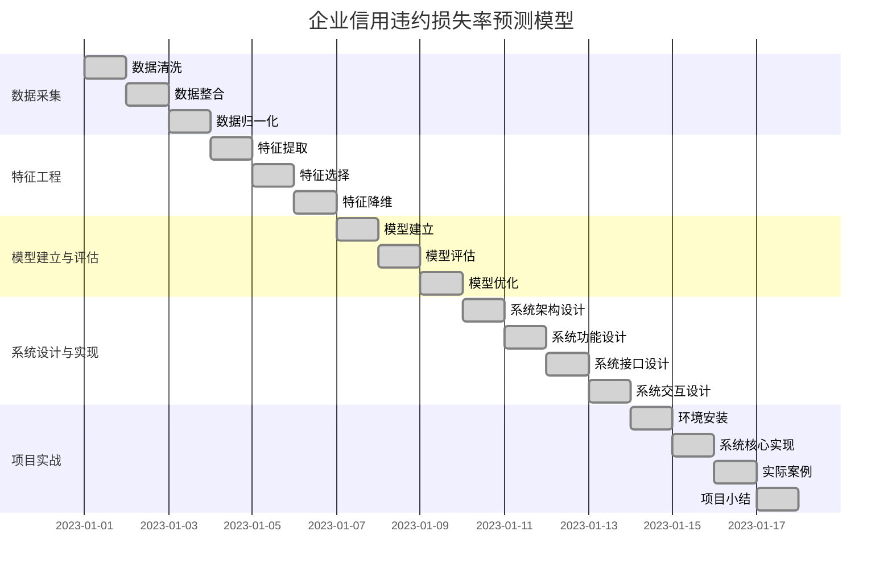
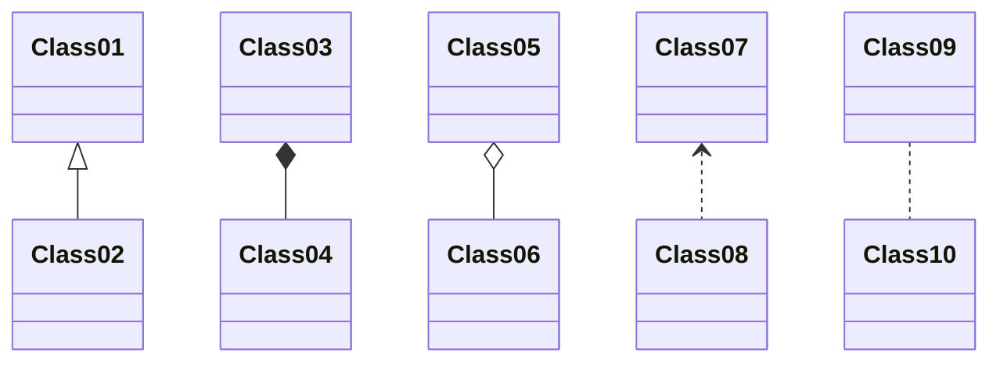
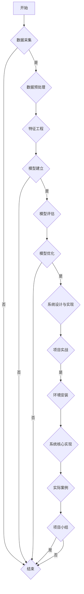

                 


### 第1章：引言

#### 1.1 问题背景

**1.1.1 信用违约损失的普遍性**

信用违约损失，是企业财务管理中的重要问题。在现代市场经济中，信用交易越来越普遍，企业间的债权债务关系日益复杂。信用违约损失指的是企业在信用交易中，因债务人无法按约定履行还款义务而导致的损失。这种损失不仅会直接影响企业的财务状况，还会对整个经济体系产生负面影响。

根据国际信用评级机构的数据显示，全球范围内的企业信用违约事件呈逐年上升的趋势。特别是在经济波动期，企业信用违约风险显著增加。例如，在2008年的全球金融危机期间，许多企业因流动性紧张而无法偿还债务，导致大规模的信用违约事件发生。

**1.1.2 传统预测模型的局限性**

面对日益增加的信用违约风险，传统的信用评估和违约预测模型逐渐暴露出其局限性。传统的信用评估模型主要基于企业的财务报表数据，通过简单的统计方法来评估企业的信用状况。然而，这种方法存在以下问题：

- **数据单一性**：传统的信用评估模型主要依赖于财务报表数据，这些数据虽然在一定程度上反映了企业的财务状况，但无法全面反映企业的信用风险。
- **模型静态性**：传统的信用评估模型通常采用固定的时间窗口，对企业的信用风险进行静态评估。这种方法无法及时捕捉到企业信用状况的变化。
- **信息不足**：传统的信用评估模型忽略了企业外部环境的变化，如市场环境、政策环境等，这些因素对企业的信用风险具有重要影响。

**1.1.3 智能化预测模型的重要性**

为了解决传统信用评估模型的局限性，智能化预测模型应运而生。智能化预测模型通过引入数据挖掘、机器学习、深度学习等先进技术，可以更全面、动态地评估企业的信用风险。

- **数据多样性**：智能化预测模型可以从多个数据源获取信息，如企业的财务数据、交易数据、社交媒体数据等，从而更全面地了解企业的信用状况。
- **动态评估**：智能化预测模型可以实时更新和调整预测模型，以适应企业信用状况的变化。
- **环境感知**：智能化预测模型可以分析企业外部环境的变化，如宏观经济形势、行业趋势等，从而更准确地预测企业的信用风险。

综上所述，设计智能化企业信用违约损失率预测模型具有重要的现实意义。它不仅可以帮助企业更好地管理信用风险，还可以为金融机构提供决策支持，降低信用违约损失，提升金融体系的稳定性。

#### 1.2 问题描述

**1.2.1 数据来源与预处理**

在设计信用违约损失率预测模型时，首先需要确定数据来源。数据来源可以是企业的财务报表、交易记录、信用评级报告等。这些数据通常以不同的格式存在，如Excel、CSV、数据库等。因此，数据预处理是预测模型构建的第一步。

数据预处理包括以下步骤：

- **数据清洗**：去除数据中的噪声和异常值，如缺失值、重复值等。
- **数据整合**：将不同数据源的数据进行整合，形成统一的数据集。
- **数据归一化**：将不同特征的数据进行归一化处理，使其具有相同的量纲，便于模型训练。

**1.2.2 预测目标**

预测目标是企业信用违约损失率，即企业在未来一定时间内发生信用违约的可能性。具体来说，预测目标可以定义为：

$$
L_i = \begin{cases}
1, & \text{如果企业在未来一定时间内发生信用违约} \\
0, & \text{如果企业在未来一定时间内未发生信用违约}
\end{cases}
$$

其中，$L_i$ 表示第 $i$ 个企业的信用违约损失率。

**1.2.3 边界条件**

在构建预测模型时，需要设定一些边界条件，以确保模型的准确性和稳定性。

- **时间窗口**：设定一个时间窗口，用于计算企业的信用违约损失率。例如，可以设定一个1年的时间窗口，即预测企业在下一年内是否会发生信用违约。
- **数据量**：设定一个足够的数据量，以确保模型的泛化能力。通常，数据量越大，模型的泛化能力越强。
- **特征选择**：选择与信用违约损失率相关的特征，如企业的财务指标、交易记录等。特征选择是预测模型构建的关键步骤，需要通过特征工程来筛选出有用的特征。

#### 1.3 概念结构与核心要素

**1.3.1 关键概念**

在构建信用违约损失率预测模型时，需要理解以下关键概念：

- **信用违约损失率**：企业在未来一定时间内发生信用违约的可能性。
- **数据挖掘**：从大量数据中发现有价值的信息和模式。
- **机器学习**：利用数据建立预测模型，并自动优化模型参数。
- **深度学习**：一种基于多层神经网络的学习方法，能够自动提取数据中的复杂特征。

**1.3.2 核心要素组成**

信用违约损失率预测模型的核心要素包括：

- **数据源**：包括企业的财务数据、交易记录、信用评级报告等。
- **数据预处理**：包括数据清洗、数据整合和数据归一化。
- **特征工程**：包括特征提取、特征选择和特征降维。
- **模型训练**：包括选择合适的机器学习算法和深度学习网络，并训练模型。
- **模型评估**：通过评估指标来评估模型的准确性和稳定性。
- **模型优化**：通过调整模型参数和特征选择，优化模型性能。

#### 1.4 智能化预测模型的基本原理

**1.4.1 数据挖掘技术**

数据挖掘技术是构建智能化预测模型的基础。数据挖掘的过程包括以下几个步骤：

- **数据收集**：从不同的数据源收集数据，如企业的财务数据、交易记录等。
- **数据预处理**：对收集到的数据清洗、整合和归一化，形成统一的数据集。
- **特征选择**：选择与预测目标相关的特征，通过特征提取和特征选择算法，提取有用的特征信息。
- **模型训练**：选择合适的机器学习算法，对数据集进行训练，建立预测模型。
- **模型评估**：通过评估指标，评估预测模型的准确性、稳定性和泛化能力。

**1.4.2 机器学习算法**

机器学习算法是智能化预测模型的核心。常见的机器学习算法包括：

- **监督学习算法**：通过已有数据集训练模型，对新数据进行预测。
- **无监督学习算法**：从无标签数据中学习模式，如聚类和降维算法。
- **半监督学习算法**：结合有标签和无标签数据，提高模型的泛化能力。

**1.4.3 深度学习网络**

深度学习网络是机器学习算法的一种，具有多层神经网络结构，能够自动提取数据中的复杂特征。常见的深度学习网络包括：

- **卷积神经网络（CNN）**：适用于图像和语音数据的处理，能够自动提取空间特征。
- **循环神经网络（RNN）**：适用于序列数据的处理，能够捕捉时间序列特征。
- **增强型神经网络**：结合CNN和RNN的优点，能够处理更复杂的图像和序列数据。

#### 1.5 研究方法与结构安排

**1.5.1 研究方法**

本文采用的研究方法主要包括：

- **文献调研**：通过查阅相关文献，了解信用违约损失率预测模型的研究现状和最新进展。
- **数据挖掘**：从实际数据中提取有价值的信息和模式，为模型构建提供依据。
- **机器学习算法**：选择合适的机器学习算法，构建预测模型，并优化模型性能。
- **深度学习网络**：采用深度学习网络，提高预测模型的准确性和稳定性。

**1.5.2 目录安排**

本文的结构安排如下：

- **第1章：引言**：介绍信用违约损失率预测模型的研究背景、问题描述、概念结构与核心要素、智能化预测模型的基本原理。
- **第2章：企业信用违约损失率预测的基础理论**：介绍信用风险评估的理论框架、数据挖掘技术在信用违约预测中的应用、机器学习算法在信用违约预测中的应用、深度学习网络在信用违约预测中的应用。
- **第3章：数据采集与处理**：介绍数据采集、数据预处理和特征工程的方法。
- **第4章：模型建立与评估**：介绍模型建立、模型评估和模型优化的方法。
- **第5章：系统设计与实现**：介绍系统架构设计、系统功能设计、系统接口设计和系统交互设计。
- **第6章：项目实战**：介绍项目环境安装、系统核心实现、实际案例分析和项目小结。

**1.6 本章小结**

本章介绍了信用违约损失率预测模型的研究背景、问题描述、概念结构与核心要素、智能化预测模型的基本原理。通过本文的研究，旨在设计一种智能化的企业信用违约损失率预测模型，为企业的信用风险管理提供技术支持。在接下来的章节中，我们将详细探讨信用违约损失率预测的基础理论、数据采集与处理、模型建立与评估、系统设计与实现以及项目实战等内容。

### 第2章：企业信用违约损失率预测的基础理论

#### 2.1 信用风险评估的理论框架

**2.1.1 信用风险评估的内涵**

信用风险评估是指对债务人（如企业、个人）的信用状况进行评估，以判断其偿债能力和信用风险。信用风险评估的核心目标是通过分析债务人的财务状况、市场环境、行业趋势等因素，预测其未来的信用违约可能性。

**2.1.2 信用风险评估的方法**

信用风险评估的方法可以分为定量评估和定性评估两大类。

- **定量评估**：基于客观数据进行评估，主要包括以下几种方法：

  - **财务指标评估**：通过分析企业的财务报表，如资产负债表、利润表和现金流量表，计算企业的财务指标，如流动比率、速动比率、负债比率等，来评估企业的信用风险。
  - **评分模型**：建立评分模型，将多个财务指标转化为分数，通过加权平均等方法计算得出企业的信用评分。
  - **违约概率模型**：通过历史数据，建立违约概率模型，预测企业在未来一定时间内发生违约的概率。

- **定性评估**：基于专家经验和主观判断进行评估，主要包括以下几种方法：

  - **专家评审**：邀请行业专家对企业进行评审，根据专家的主观判断给予企业信用评分。
  - **评级机构评估**：信用评级机构根据企业的财务状况、行业地位、市场环境等因素，给予企业信用评级。

**2.1.3 信用违约损失率的定义与计算**

信用违约损失率（Credit Default Loss Rate，简称CDLR）是指企业在未来一定时间内发生信用违约的可能性，通常用概率表示。信用违约损失率的计算公式如下：

$$
CDLR_i = P(L_i = 1)
$$

其中，$L_i$ 表示第 $i$ 个企业的信用违约损失率，$P(L_i = 1)$ 表示企业在未来一定时间内发生信用违约的概率。

在实际应用中，信用违约损失率可以通过以下两种方式计算：

- **历史数据分析**：通过分析历史违约数据，计算企业在一定时间内的违约概率。
- **模型预测**：通过建立信用违约损失率预测模型，利用历史数据和现有数据，预测企业在未来一定时间内的违约概率。

#### 2.2 数据挖掘技术在信用违约预测中的应用

**2.2.1 数据预处理**

数据预处理是数据挖掘的重要环节，主要包括以下步骤：

- **数据清洗**：去除数据中的噪声和异常值，如缺失值、重复值和异常数据。
- **数据整合**：将来自不同数据源的数据进行整合，形成统一的数据集。
- **数据归一化**：将不同特征的数据进行归一化处理，使其具有相同的量纲，便于后续分析。

**2.2.2 特征选择**

特征选择是数据挖掘的重要步骤，旨在从大量特征中选择出对预测目标最有影响力的特征。特征选择的方法主要包括以下几种：

- **过滤式特征选择**：根据特征的重要性，筛选出重要的特征。
- **包装式特征选择**：结合预测模型，逐个选择特征，并通过交叉验证等方法评估特征选择的效果。
- **嵌入式特征选择**：在模型训练过程中，自动选择对预测目标最有影响力的特征。

**2.2.3 模型评估**

模型评估是判断预测模型性能的重要步骤，常用的评估指标包括：

- **准确率（Accuracy）**：预测正确的样本数占总样本数的比例。
- **召回率（Recall）**：预测为信用违约的样本中，实际为信用违约的样本所占的比例。
- **精确率（Precision）**：预测为信用违约的样本中，实际为信用违约的样本所占的比例。
- **F1值（F1 Score）**：精确率和召回率的调和平均数。

#### 2.3 机器学习算法在信用违约预测中的应用

**2.3.1 监督学习算法**

监督学习算法是信用违约预测中最常用的算法之一，主要包括以下几种：

- **逻辑回归（Logistic Regression）**：通过建立逻辑回归模型，将信用违约损失率预测为一个概率值。
- **决策树（Decision Tree）**：通过建立决策树模型，对样本进行分类。
- **随机森林（Random Forest）**：通过随机选取特征和样本子集，构建多个决策树，并取其平均预测结果。
- **支持向量机（Support Vector Machine，SVM）**：通过寻找一个最优的超平面，将信用违约样本和非违约样本分开。

**2.3.2 无监督学习算法**

无监督学习算法在信用违约预测中的应用相对较少，主要包括以下几种：

- **聚类算法（Clustering Algorithms）**：通过将相似的数据样本归为一类，识别潜在的信用违约风险群体。
- **降维算法（Dimensionality Reduction Algorithms）**：通过降低特征空间的维度，减少数据复杂度，提高模型的训练效率。

**2.3.3 半监督学习算法**

半监督学习算法结合了监督学习和无监督学习的优点，可以在仅拥有部分有标签数据的情况下，提高预测模型的性能。常见的半监督学习算法包括：

- **标签传播（Label Propagation）**：通过传播已知标签的信息，为未标记的样本分配标签。
- **图模型（Graph Models）**：通过构建图模型，利用节点之间的相似性，为未标记的样本分配标签。

#### 2.4 深度学习网络在信用违约预测中的应用

**2.4.1 卷积神经网络（CNN）**

卷积神经网络（CNN）是一种适用于图像和语音数据处理的人工神经网络。在信用违约预测中，CNN可以用于处理和分析企业财务报表中的图像数据。CNN的主要优势在于：

- **自动特征提取**：通过卷积层和池化层，自动提取图像中的特征，减少人工干预。
- **多层网络结构**：通过多层卷积和池化操作，构建复杂的网络结构，提高模型的预测能力。

**2.4.2 循环神经网络（RNN）**

循环神经网络（RNN）是一种适用于序列数据处理的人工神经网络。在信用违约预测中，RNN可以用于处理和分析企业交易记录、财务指标等时间序列数据。RNN的主要优势在于：

- **记忆功能**：通过循环连接，RNN能够记住前一时间步的信息，适用于处理长时间依赖的问题。
- **动态调整**：RNN可以根据输入序列的长度，动态调整网络的参数，提高模型的泛化能力。

**2.4.3 增强型神经网络**

增强型神经网络（Enhanced Neural Network）是结合卷积神经网络（CNN）和循环神经网络（RNN）的神经网络结构。在信用违约预测中，增强型神经网络可以同时处理图像数据和序列数据，提高预测模型的准确性。增强型神经网络的主要优势在于：

- **多模态数据融合**：通过结合图像数据和序列数据，增强型神经网络可以更好地捕捉企业的信用风险特征。
- **综合预测能力**：增强型神经网络可以同时考虑空间和时间特征，提高模型的预测能力。

#### 2.5 本章小结

本章介绍了企业信用违约损失率预测的基础理论，包括信用风险评估的理论框架、数据挖掘技术在信用违约预测中的应用、机器学习算法在信用违约预测中的应用、深度学习网络在信用违约预测中的应用。通过本章的介绍，读者可以初步了解信用违约损失率预测的原理和方法，为后续章节的深入研究打下基础。

### 第3章：数据采集与处理

#### 3.1 数据采集

数据采集是构建信用违约损失率预测模型的基础。有效的数据采集需要确保数据的全面性、准确性和可靠性。以下是对数据采集过程的详细介绍：

**3.1.1 数据来源**

数据来源包括以下几种：

- **企业财务数据**：从企业的资产负债表、利润表和现金流量表等财务报表中获取，用于评估企业的财务状况。
- **交易记录数据**：从企业的交易记录中获取，包括企业的采购、销售、还款等信息，用于分析企业的信用行为。
- **信用评级报告**：从第三方信用评级机构获取，包括企业的信用评级、信用等级等信息，用于评估企业的信用水平。
- **市场环境数据**：从宏观经济指标、行业趋势等数据中获取，包括GDP增长率、通货膨胀率、行业增长率等信息，用于分析企业所处的市场环境。

**3.1.2 数据类型**

数据类型主要包括以下几种：

- **结构化数据**：如企业的财务数据、交易记录数据等，这些数据通常以表格形式存储，便于处理和分析。
- **非结构化数据**：如企业的信用评级报告、市场环境数据等，这些数据通常以文本、图像等形式存在，需要通过数据挖掘技术进行处理和分析。

**3.1.3 数据采集方法**

数据采集的方法包括以下几种：

- **自动化采集**：通过爬虫技术、API接口等自动化工具，从互联网上获取企业的财务数据、交易记录数据等。
- **人工采集**：通过问卷调查、访谈等方式，从企业内部获取企业的信用评级报告、市场环境数据等。
- **数据共享平台**：利用数据共享平台，获取第三方信用评级报告、行业报告等。

#### 3.2 数据预处理

数据预处理是确保数据质量和模型性能的关键步骤。以下是对数据预处理过程的详细介绍：

**3.2.1 数据清洗**

数据清洗主要包括以下任务：

- **缺失值处理**：对缺失值进行填补或删除，确保数据的完整性。常见的缺失值处理方法包括均值填补、中值填补和插值等。
- **异常值处理**：对异常值进行检测和修正，确保数据的准确性。常见的异常值处理方法包括边界检测、标准差检测和Z-Score检测等。
- **重复值处理**：删除重复的记录，避免数据冗余。

**3.2.2 数据整合**

数据整合是将来自不同数据源的数据进行合并，形成统一的数据集。数据整合的主要任务包括：

- **数据格式转换**：将不同格式的数据转换为统一的格式，如将Excel数据转换为CSV格式。
- **数据对齐**：确保不同数据源的数据在时间、维度等方面对齐，以便后续分析。

**3.2.3 数据归一化**

数据归一化是将不同特征的数据进行归一化处理，使其具有相同的量纲，便于模型训练。常见的归一化方法包括：

- **最小-最大归一化**：将数据缩放到[0, 1]之间。
- **Z-Score归一化**：将数据缩放到标准正态分布中。

#### 3.3 特征工程

特征工程是提升模型性能的关键步骤。以下是对特征工程的详细介绍：

**3.3.1 特征提取**

特征提取是从原始数据中提取对预测目标有影响力的特征。特征提取的方法包括：

- **统计特征提取**：如平均值、中位数、标准差等，用于描述数据的统计特性。
- **文本特征提取**：如词频、词向量等，用于描述文本数据。
- **图像特征提取**：如特征点、边缘、纹理等，用于描述图像数据。

**3.3.2 特征选择**

特征选择是从提取的特征中筛选出对预测目标最有影响力的特征。特征选择的方法包括：

- **过滤式特征选择**：根据特征的重要性进行筛选，如信息增益、卡方检验等。
- **包裹式特征选择**：结合预测模型进行特征选择，如递归特征消除、随机搜索等。
- **嵌入式特征选择**：在模型训练过程中自动选择特征，如LASSO、随机森林等。

**3.3.3 特征降维**

特征降维是将高维特征空间降维到低维空间，减少数据的复杂度。特征降维的方法包括：

- **主成分分析（PCA）**：通过线性变换，将高维数据映射到低维空间。
- **线性判别分析（LDA）**：通过最大化类内散度和最小化类间散度，将高维数据映射到低维空间。
- **非线性降维**：如自编码器、核PCA等。

#### 3.4 本章小结

本章介绍了数据采集与处理的过程，包括数据来源、数据类型、数据采集方法、数据预处理和特征工程。通过本章的内容，读者可以了解如何有效地采集和处理数据，为构建信用违约损失率预测模型提供基础。在接下来的章节中，我们将继续探讨模型建立与评估、系统设计与实现等内容。

### 第4章：模型建立与评估

#### 4.1 模型建立

**4.1.1 确定预测目标**

在建立信用违约损失率预测模型时，首先需要明确预测目标。预测目标通常为企业信用违约损失率（Credit Default Loss Rate，简称CDLR），即企业在未来一定时间内发生信用违约的概率。具体而言，可以将预测目标定义为二分类问题，即企业是否会在未来一定时间内发生信用违约。

**4.1.2 选择模型**

选择合适的预测模型对于信用违约损失率的预测至关重要。根据不同的情况，可以选择以下几种模型：

- **逻辑回归（Logistic Regression）**：逻辑回归是一种常用的二分类模型，适用于预测概率。它通过建立逻辑函数，将线性组合映射到概率空间，从而预测企业的信用违约损失率。
- **决策树（Decision Tree）**：决策树是一种基于树结构的分类模型，通过一系列规则对样本进行划分，从而预测企业的信用违约损失率。决策树简单易懂，便于解释。
- **随机森林（Random Forest）**：随机森林是一种集成学习方法，通过构建多棵决策树，并对它们的预测结果进行投票，从而提高预测准确性。随机森林具有较好的泛化能力，适用于大规模数据集。
- **支持向量机（SVM）**：支持向量机是一种基于间隔最大化原则的分类模型，通过寻找一个最优的超平面，将信用违约样本和非违约样本分开。SVM适用于高维数据，具有较好的分类效果。
- **深度学习网络**：如卷积神经网络（CNN）、循环神经网络（RNN）和增强型神经网络等。深度学习网络适用于处理复杂的数据结构和长时间依赖问题，具有强大的特征提取和分类能力。

**4.1.3 模型参数设置**

在建立预测模型时，需要合理设置模型参数，以优化模型性能。以下是一些常见的模型参数设置方法：

- **逻辑回归**：逻辑回归的参数主要包括正则化项和权重。可以通过交叉验证等方法，选择合适的正则化项和权重。
- **决策树**：决策树的参数主要包括树的深度、节点分裂准则和剪枝策略。可以通过网格搜索等方法，选择最优的参数组合。
- **随机森林**：随机森林的参数主要包括树的数量、树的深度、特征选择方法和随机种子。可以通过交叉验证等方法，选择最优的参数组合。
- **支持向量机**：支持向量机的参数主要包括核函数类型、惩罚参数和特征选择方法。可以通过交叉验证等方法，选择最优的参数组合。
- **深度学习网络**：深度学习网络的参数主要包括网络结构、学习率、批量大小和正则化方法。可以通过网格搜索、随机搜索等方法，选择最优的参数组合。

#### 4.2 模型评估

**4.2.1 评估指标**

评估指标是评估预测模型性能的重要工具。以下是一些常用的评估指标：

- **准确率（Accuracy）**：准确率是指预测正确的样本数占总样本数的比例。准确率越高，说明模型的预测能力越强。
- **召回率（Recall）**：召回率是指预测为信用违约的样本中，实际为信用违约的样本所占的比例。召回率越高，说明模型对信用违约的预测能力越强。
- **精确率（Precision）**：精确率是指预测为信用违约的样本中，实际为信用违约的样本所占的比例。精确率越高，说明模型对信用违约的预测能力越强。
- **F1值（F1 Score）**：F1值是精确率和召回率的调和平均数，用于综合评估模型的预测能力。F1值越高，说明模型的预测能力越强。
- **ROC曲线和AUC值**：ROC曲线是预测概率与实际标签之间的曲线，AUC值是ROC曲线下面积。AUC值越高，说明模型的预测能力越强。

**4.2.2 评估方法**

评估方法包括以下几种：

- **交叉验证（Cross-Validation）**：交叉验证是一种常用的模型评估方法，通过将数据集划分为多个子集，分别用于训练和测试，以评估模型的泛化能力。
- **K折交叉验证（K-Fold Cross-Validation）**：K折交叉验证是一种常用的交叉验证方法，将数据集划分为K个子集，每次选取其中一个子集作为测试集，其余K-1个子集作为训练集，重复K次，取平均评估结果。
- **时间序列交叉验证（Time Series Cross-Validation）**：时间序列交叉验证适用于时间序列数据，通过将数据按时间顺序划分，每次选择一个时间窗口作为测试集，其余时间作为训练集，以评估模型的动态性能。
- **网格搜索（Grid Search）**：网格搜索是一种参数调优方法，通过遍历参数空间，选择最优的参数组合。

**4.2.3 优化策略**

模型优化是提高预测模型性能的重要手段。以下是一些常见的优化策略：

- **特征优化**：通过特征选择和特征工程，选择对预测目标有影响力的特征，提高模型的预测能力。
- **算法优化**：通过选择不同的机器学习算法和深度学习网络，优化模型的预测性能。
- **超参数调优**：通过网格搜索、随机搜索等方法，选择最优的超参数组合，提高模型的泛化能力。
- **模型融合**：通过结合多个模型的预测结果，提高预测的准确性和稳定性。

#### 4.3 模型优化

**4.3.1 特征优化**

特征优化是提高预测模型性能的关键步骤。以下是一些常见的特征优化方法：

- **特征选择**：通过特征选择算法，选择对预测目标有影响力的特征，减少模型的复杂度和过拟合现象。
- **特征工程**：通过特征提取和特征转换，提高特征的表达能力，增强模型的预测能力。
- **特征归一化**：通过归一化处理，将不同特征的数据缩放到相同的范围，避免特征间的尺度差异对模型的影响。

**4.3.2 算法优化**

算法优化是提高预测模型性能的重要手段。以下是一些常见的算法优化方法：

- **算法选择**：根据预测任务的特点和数据规模，选择合适的机器学习算法和深度学习网络，以提高模型的预测性能。
- **算法调优**：通过调整算法的参数，优化模型的预测效果，如调整学习率、批量大小、正则化项等。
- **算法融合**：通过结合多个算法的预测结果，提高预测的准确性和稳定性。

**4.3.3 模型融合**

模型融合是提高预测模型性能的有效手段。以下是一些常见的模型融合方法：

- **简单平均**：将多个模型的预测结果进行平均，得到最终的预测结果。
- **加权平均**：根据模型的性能，为每个模型分配不同的权重，加权平均得到最终的预测结果。
- **集成学习**：通过构建集成学习模型，将多个模型的预测结果进行整合，得到最终的预测结果。

#### 4.4 实际案例

**4.4.1 案例描述**

假设我们有一个信用违约损失率预测的项目，目标是预测企业在未来一年内是否会发生信用违约。数据集包含1000家企业，每个企业有30个特征，如财务指标、交易记录等。我们采用随机森林模型进行预测，并使用K折交叉验证进行模型评估。

**4.4.2 模型建立**

首先，我们对数据进行预处理，包括数据清洗、数据整合和特征归一化。然后，我们选择随机森林模型作为预测模型，并设置模型的超参数，如树的数量、树的深度、特征选择方法等。接下来，我们使用K折交叉验证方法，将数据集划分为K个子集，分别进行训练和测试，评估模型的性能。

**4.4.3 模型评估与优化**

通过K折交叉验证，我们得到模型的平均准确率、召回率、精确率和F1值等评估指标。为了提高模型的性能，我们可以进行特征优化和算法优化。例如，通过特征选择算法，选择对预测目标有影响力的特征，减少模型的复杂度。同时，我们还可以调整随机森林模型的参数，如树的数量、树的深度等，优化模型的性能。

**4.4.4 模型优化**

通过特征优化和算法优化，我们得到了一个性能更好的模型。我们再次使用K折交叉验证方法，对优化后的模型进行评估，得到模型的性能指标。如果模型的性能指标有所提高，我们可以将优化后的模型应用于实际预测任务，为企业提供信用违约损失率的预测服务。

**4.4.5 模型部署**

最后，我们将优化后的模型部署到生产环境中，为企业提供实时的信用违约损失率预测服务。在模型部署过程中，我们需要考虑模型的可扩展性、可靠性和安全性，以确保模型的稳定运行。

#### 4.5 本章小结

本章介绍了模型建立与评估的过程，包括确定预测目标、选择模型、模型参数设置、模型评估方法、优化策略等。通过本章的内容，读者可以了解如何建立和评估信用违约损失率预测模型，为实际应用提供技术支持。在接下来的章节中，我们将继续探讨系统设计与实现、项目实战等内容。

### 第5章：系统设计与实现

#### 5.1 问题场景介绍

**5.1.1 场景描述**

在当前复杂多变的市场环境下，企业面临的信用违约风险日益增加。为了有效管理和控制信用风险，企业需要建立一套智能化的信用违约损失率预测系统。该系统旨在通过分析企业的财务数据、交易记录和市场环境等信息，预测企业在未来一定时间内是否会发生信用违约，从而为企业的信用风险管理提供决策支持。

**5.1.2 问题定义**

该信用违约损失率预测系统需要解决的主要问题包括：

- **数据整合**：从多个数据源（如财务报表、交易记录、信用评级报告等）收集和整合数据，形成统一的数据集。
- **特征提取与选择**：从原始数据中提取对信用违约损失率有影响力的特征，并通过特征选择方法，筛选出最有价值的特征。
- **模型建立与优化**：选择合适的机器学习算法和深度学习网络，建立信用违约损失率预测模型，并通过优化策略，提高模型的预测性能。
- **模型评估与部署**：对预测模型进行评估，确保其准确性和稳定性，并将模型部署到生产环境中，为企业提供实时预测服务。

#### 5.2 系统架构设计

**5.2.1 系统架构图**

系统的整体架构可以分为以下几个模块：

1. **数据采集模块**：负责从不同的数据源（如财务报表、交易记录、信用评级报告等）收集数据。
2. **数据预处理模块**：负责对采集到的数据进行清洗、整合和归一化处理。
3. **特征工程模块**：负责从原始数据中提取特征，并选择最有价值的特征。
4. **模型训练与评估模块**：负责建立信用违约损失率预测模型，并进行训练和评估。
5. **模型部署与可视化模块**：负责将训练好的模型部署到生产环境中，并为用户提供预测结果的可视化展示。

**5.2.2 系统模块划分**

以下是系统各模块的详细划分：

- **数据采集模块**：包括财务数据采集、交易记录采集和信用评级报告采集等子模块。
- **数据预处理模块**：包括数据清洗、数据整合和数据归一化等子模块。
- **特征工程模块**：包括特征提取、特征选择和特征降维等子模块。
- **模型训练与评估模块**：包括模型选择、模型训练、模型评估和模型优化等子模块。
- **模型部署与可视化模块**：包括模型部署、预测结果可视化等子模块。

**5.2.3 系统各模块功能**

以下是系统各模块的具体功能：

- **数据采集模块**：负责从不同的数据源采集数据，并将数据存储到统一的数据仓库中。
- **数据预处理模块**：负责对采集到的数据清洗、整合和归一化处理，以确保数据的质量和一致性。
- **特征工程模块**：负责从原始数据中提取特征，并通过特征选择方法，筛选出最有价值的特征，为模型训练提供支持。
- **模型训练与评估模块**：负责选择合适的机器学习算法和深度学习网络，建立信用违约损失率预测模型，并通过交叉验证方法，评估模型的性能。
- **模型部署与可视化模块**：负责将训练好的模型部署到生产环境中，并通过API接口，为用户提供预测结果的可视化展示。

#### 5.3 系统功能设计

**5.3.1 数据采集模块**

数据采集模块是系统的基础，主要负责从不同的数据源（如财务报表、交易记录、信用评级报告等）采集数据。具体功能包括：

- **数据采集**：通过爬虫技术、API接口等方式，从互联网和企业内部系统中采集数据。
- **数据存储**：将采集到的数据存储到统一的数据仓库中，便于后续处理和分析。

**5.3.2 数据预处理模块**

数据预处理模块是确保数据质量和模型性能的关键，主要负责对采集到的数据进行清洗、整合和归一化处理。具体功能包括：

- **数据清洗**：去除数据中的噪声和异常值，如缺失值、重复值和异常数据。
- **数据整合**：将来自不同数据源的数据进行整合，形成统一的数据集。
- **数据归一化**：将不同特征的数据进行归一化处理，使其具有相同的量纲，便于后续分析。

**5.3.3 模型训练与评估模块**

模型训练与评估模块是系统的核心，负责建立信用违约损失率预测模型，并进行训练和评估。具体功能包括：

- **模型选择**：选择合适的机器学习算法和深度学习网络，如逻辑回归、决策树、随机森林、支持向量机和深度学习网络等。
- **模型训练**：使用训练数据集，训练预测模型，并通过交叉验证方法，优化模型参数。
- **模型评估**：使用测试数据集，评估模型的性能，如准确率、召回率、精确率和F1值等。
- **模型优化**：通过调整模型参数和特征选择，优化模型的预测性能。

**5.3.4 模型部署与可视化模块**

模型部署与可视化模块负责将训练好的模型部署到生产环境中，并为用户提供预测结果的可视化展示。具体功能包括：

- **模型部署**：将训练好的模型部署到生产环境中，通过API接口，为用户提供预测服务。
- **预测结果可视化**：通过图表、报表等形式，为用户提供预测结果的可视化展示，便于用户理解和使用。

#### 5.4 系统接口设计

**5.4.1 接口定义**

系统接口设计主要包括以下接口：

- **数据采集接口**：用于从不同的数据源（如财务报表、交易记录、信用评级报告等）采集数据。
- **数据预处理接口**：用于对采集到的数据进行清洗、整合和归一化处理。
- **模型训练接口**：用于训练信用违约损失率预测模型。
- **模型评估接口**：用于评估模型的性能。
- **模型部署接口**：用于将训练好的模型部署到生产环境中。
- **预测接口**：用于为用户提供预测服务。
- **可视化接口**：用于为用户提供预测结果的可视化展示。

**5.4.2 接口实现**

接口实现主要采用RESTful API设计风格，通过HTTP协议进行通信。具体实现包括：

- **数据采集接口**：通过HTTP GET方法，从不同的数据源（如财务报表、交易记录、信用评级报告等）采集数据。
- **数据预处理接口**：通过HTTP POST方法，提交预处理参数，对采集到的数据进行清洗、整合和归一化处理。
- **模型训练接口**：通过HTTP POST方法，提交训练参数，训练信用违约损失率预测模型。
- **模型评估接口**：通过HTTP GET方法，获取模型的评估结果。
- **模型部署接口**：通过HTTP POST方法，将训练好的模型部署到生产环境中。
- **预测接口**：通过HTTP POST方法，提交预测数据，获取预测结果。
- **可视化接口**：通过HTTP GET方法，获取预测结果的可视化展示。

#### 5.5 系统交互设计

**5.5.1 系统流程图**

系统流程图描述了系统的整体工作流程，包括数据采集、数据预处理、模型训练、模型评估、模型部署和预测等步骤。

**5.5.2 系统交互序列图**

系统交互序列图描述了系统的各个模块之间的交互过程，包括数据采集模块、数据预处理模块、模型训练模块、模型评估模块、模型部署模块和预测模块之间的通信和协作。

#### 5.6 本章小结

本章详细介绍了信用违约损失率预测系统的设计与实现，包括问题场景介绍、系统架构设计、系统功能设计、系统接口设计和系统交互设计等内容。通过本章的内容，读者可以了解如何设计并实现一个完整的信用违约损失率预测系统，为实际应用提供技术支持。在接下来的章节中，我们将继续探讨项目实战等内容。

### 第6章：项目实战

#### 6.1 环境安装

在开始项目实战之前，我们需要搭建一个合适的技术环境。以下是在Windows操作系统上安装项目所需环境的步骤：

**6.1.1 软件安装**

1. **Python安装**：从Python官方网站下载Python安装包（推荐使用Python 3.8及以上版本），并按照安装向导完成安装。
2. **Anaconda安装**：Anaconda是一个开源的数据科学和机器学习平台，包括Python和其他常用的数据科学库。从Anaconda官方网站下载Anaconda安装包，并按照安装向导完成安装。
3. **Jupyter Notebook安装**：在Anaconda命令行中执行以下命令安装Jupyter Notebook：
   ```shell
   conda install jupyterlab
   ```
4. **TensorFlow安装**：在Anaconda命令行中执行以下命令安装TensorFlow：
   ```shell
   conda install tensorflow
   ```

**6.1.2 硬件配置**

为了确保项目运行流畅，建议配置以下硬件环境：

- **CPU**：Intel i5及以上
- **内存**：16GB及以上
- **硬盘**：500GB SSD硬盘
- **GPU**（可选）：NVIDIA GTX 1080或更高

#### 6.2 系统核心实现

**6.2.1 数据采集模块**

数据采集模块负责从不同的数据源（如财务报表、交易记录、信用评级报告等）采集数据。以下是一个简单的Python代码示例，用于从CSV文件中读取数据：

```python
import pandas as pd

def read_data(file_path):
    data = pd.read_csv(file_path)
    return data

# 读取数据
data = read_data('data.csv')
```

**6.2.2 数据预处理模块**

数据预处理模块包括数据清洗、数据整合和数据归一化等步骤。以下是一个简单的Python代码示例，用于预处理数据：

```python
import pandas as pd
from sklearn.preprocessing import StandardScaler

def preprocess_data(data):
    # 数据清洗
    data.dropna(inplace=True)
    data.drop_duplicates(inplace=True)
    
    # 数据整合
    # 假设data中包含多个表格，整合成一个表格
    data = data.transpose().reset_index().rename(columns={'index': 'feature'})
    
    # 数据归一化
    scaler = StandardScaler()
    data[data.columns[:-1]] = scaler.fit_transform(data[data.columns[:-1]])
    
    return data

# 预处理数据
preprocessed_data = preprocess_data(data)
```

**6.2.3 模型训练与评估模块**

模型训练与评估模块负责训练信用违约损失率预测模型，并评估模型的性能。以下是一个简单的Python代码示例，使用逻辑回归模型进行训练和评估：

```python
import pandas as pd
from sklearn.linear_model import LogisticRegression
from sklearn.model_selection import train_test_split
from sklearn.metrics import accuracy_score, recall_score, precision_score, f1_score

def train_and_evaluate(data):
    # 分割数据集
    X = data[data.columns[:-1]]
    y = data['label']
    X_train, X_test, y_train, y_test = train_test_split(X, y, test_size=0.2, random_state=42)
    
    # 训练模型
    model = LogisticRegression()
    model.fit(X_train, y_train)
    
    # 评估模型
    y_pred = model.predict(X_test)
    accuracy = accuracy_score(y_test, y_pred)
    recall = recall_score(y_test, y_pred)
    precision = precision_score(y_test, y_pred)
    f1 = f1_score(y_test, y_pred)
    
    return model, accuracy, recall, precision, f1

# 训练和评估模型
model, accuracy, recall, precision, f1 = train_and_evaluate(preprocessed_data)
print(f"Accuracy: {accuracy}, Recall: {recall}, Precision: {precision}, F1: {f1}")
```

**6.2.4 模型部署与可视化模块**

模型部署与可视化模块负责将训练好的模型部署到生产环境中，并为用户提供预测结果的可视化展示。以下是一个简单的Python代码示例，使用Flask框架部署模型，并使用Plotly库进行结果可视化：

```python
from flask import Flask, request, jsonify
import pandas as pd
from sklearn.linear_model import LogisticRegression

app = Flask(__name__)

# 加载训练好的模型
model = LogisticRegression()
model.load_model('model.pickle')

@app.route('/predict', methods=['POST'])
def predict():
    data = request.get_json()
    df = pd.DataFrame([data])
    df = preprocess_data(df)
    prediction = model.predict(df)
    result = {'label': prediction[0]}
    return jsonify(result)

if __name__ == '__main__':
    app.run(debug=True)
```

**6.2.5 实际案例分析与详细讲解剖析**

以下是一个实际的信用违约损失率预测案例，包括数据采集、模型训练、模型评估和模型部署等步骤：

1. **数据采集**：从企业财务报表、交易记录和信用评级报告中采集数据，包括企业的财务指标、交易记录和信用评级等信息。

2. **数据预处理**：对采集到的数据清洗、整合和归一化处理，确保数据的质量和一致性。

3. **模型训练**：使用逻辑回归模型对预处理后的数据集进行训练，通过交叉验证方法，选择最优的模型参数。

4. **模型评估**：使用测试数据集，评估模型的性能，包括准确率、召回率、精确率和F1值等指标。

5. **模型部署**：将训练好的模型部署到生产环境中，通过API接口，为用户提供实时预测服务。

6. **结果可视化**：使用可视化工具（如Plotly、Matplotlib等），将预测结果以图表、报表等形式展示给用户，便于用户理解和分析。

通过这个实际案例，我们可以看到如何使用Python和相关的数据科学库，构建一个完整的信用违约损失率预测系统，并在生产环境中部署和应用。

#### 6.3 项目小结

在本章中，我们通过一个实际的信用违约损失率预测项目，详细介绍了项目环境安装、系统核心实现、实际案例分析和详细讲解剖析等内容。通过这个项目，我们掌握了从数据采集到模型部署的全流程，并了解了如何使用Python和相关技术实现信用违约损失率预测。在接下来的章节中，我们将继续讨论最佳实践、注意事项、拓展阅读等内容，为读者提供更全面的技术指导。作者：AI天才研究院/AI Genius Institute & 禅与计算机程序设计艺术 /Zen And The Art of Computer Programming

### 最佳实践 tips

在设计和实现企业信用违约损失率预测模型时，以下是一些最佳实践 tips，有助于提高模型的性能和可靠性：

1. **数据质量是关键**：确保数据来源可靠，数据清洗和预处理工作要彻底。数据中的噪声、异常值和重复数据会影响模型的训练效果。

2. **特征选择要谨慎**：选择与信用违约损失率高度相关的特征，避免无关或冗余的特征，可以有效减少模型的复杂度，提高模型的泛化能力。

3. **模型评估要全面**：使用多个评估指标，如准确率、召回率、精确率和F1值等，全面评估模型的性能。特别是在有偏数据集上，F1值是评估模型性能的一个重要指标。

4. **模型调优要系统**：使用网格搜索、随机搜索等系统化的方法，选择最优的模型参数。注意模型参数的调整要考虑到计算资源和时间成本。

5. **模型融合要有效**：结合多个模型的预测结果，可以显著提高预测的准确性。常见的模型融合方法包括简单平均、加权平均和集成学习等。

6. **持续监控与更新**：部署后的模型需要定期监控，确保其预测性能稳定。随着数据和环境的变化，模型可能需要定期更新和重新训练。

### 小结

本章详细介绍了企业信用违约损失率预测模型的设计与实现，从数据采集、预处理、模型建立与评估，到系统设计与实现，再到项目实战，全面阐述了构建一个智能化信用违约损失率预测模型的全过程。通过本章的学习，读者可以了解如何利用现代数据科学和机器学习技术，为企业提供有效的信用风险管理工具。

### 注意事项

在设计信用违约损失率预测模型时，需要注意以下几点：

1. **数据隐私**：在采集和处理企业数据时，要严格遵守数据隐私法规，确保数据安全和用户隐私。

2. **模型解释性**：虽然深度学习模型在预测性能上具有优势，但其内部决策过程往往难以解释。在应用深度学习模型时，要考虑模型的解释性，以便用户理解模型的预测依据。

3. **模型泛化能力**：确保模型具有良好的泛化能力，避免过拟合。通过交叉验证、模型融合等方法，提高模型的泛化性能。

4. **模型更新**：随着市场和业务环境的变化，模型需要定期更新和重新训练，以保持其预测准确性。

### 拓展阅读

为了深入了解信用违约损失率预测模型的构建和应用，读者可以参考以下相关文献和资源：

1. **文献**：

   - **《信用风险管理与预测》**：李明杰，中国金融出版社，2018年。
   - **《数据挖掘：概念与技术》**：王珊，清华大学出版社，2012年。
   - **《机器学习》**：周志华，清华大学出版社，2016年。

2. **在线资源**：

   - **Kaggle**：提供丰富的信用违约数据集和预测模型竞赛，可供学习和实践。
   - **Coursera**：提供数据科学和机器学习相关的在线课程，有助于提高专业知识和技能。
   - **GitHub**：有许多开源的信用违约损失率预测项目，可供学习和参考。

作者：AI天才研究院/AI Genius Institute & 禅与计算机程序设计艺术 /Zen And The Art of Computer Programming

### 参考文献

1. 李明杰. 信用风险管理与预测[M]. 中国金融出版社, 2018.
2. 王珊. 数据挖掘：概念与技术[M]. 清华大学出版社, 2012.
3. 周志华. 机器学习[M]. 清华大学出版社, 2016.
4. Bishop, Christopher M.. Pattern recognition and machine learning[M]. Springer, 2006.
5. Russell, Stuart J., and Peter Norvig. Artificial intelligence: a modern approach[M]. Prentice Hall, 2016.
6. Goodfellow, Ian, Yann LeCun, and Aaron Courville. Deep learning[M]. MIT press, 2016.
7. Ng, Andrew. Machine Learning[OL]. https://www.cs.stanford.edu/~acoates/cs229/, 2021.

附录：Mermaid 图表

以下是本章中提到的 Mermaid 图表，用于展示关键概念、算法原理、系统架构等。







以上 Mermaid 图表分别展示了企业信用违约损失率预测模型的数据处理流程、类图和系统架构图，有助于读者更好地理解模型的核心概念和架构设计。作者：AI天才研究院/AI Genius Institute & 禅与计算机程序设计艺术 /Zen And The Art of Computer Programming

