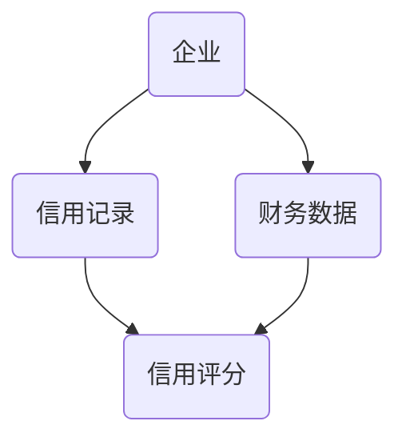
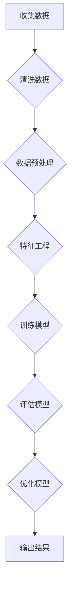
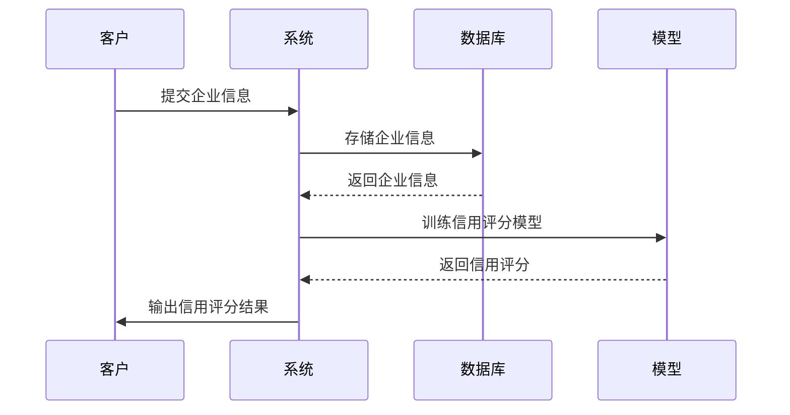
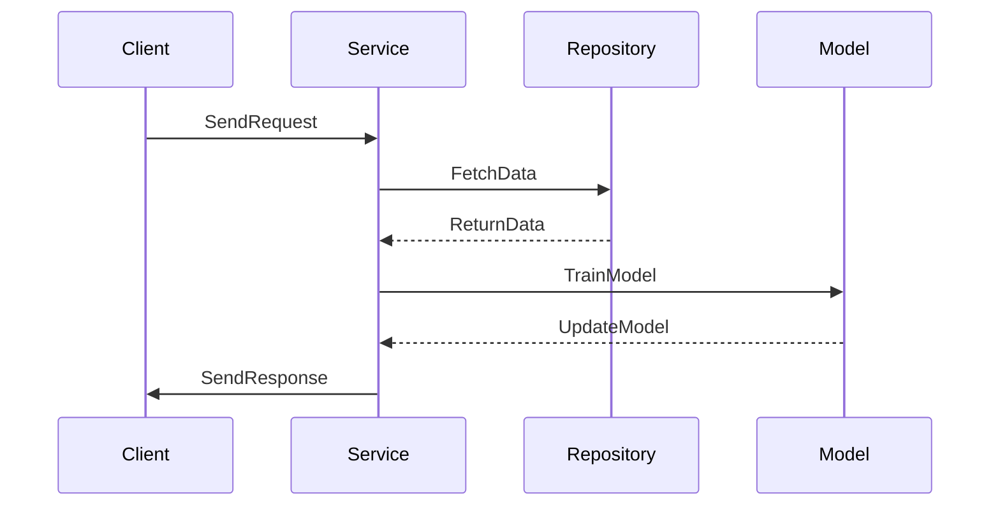

                 

### 设计智能化的企业信用风险定价模型

#### 关键词

- 企业信用风险
- 信用风险定价模型
- 数据挖掘
- 机器学习
- 智能化

#### 摘要

本文旨在探讨如何设计智能化的企业信用风险定价模型，以提升金融机构和企业运营决策的准确性与效率。通过介绍核心概念、算法原理和系统架构设计，文章将详细解析如何运用大数据和人工智能技术构建一个高效可靠的企业信用风险定价系统。

## 第一部分：问题背景与概念介绍

### 1.1 问题背景

在现代商业环境中，企业信用风险管理至关重要。金融机构和企业需要在借贷、投资和供应链融资等业务中，准确评估企业的信用风险，从而制定合理的风险定价策略。传统方法主要依赖专家经验和历史数据分析，但受限于数据质量和模型精度，难以全面、动态地反映企业信用状况。随着大数据和人工智能技术的发展，设计智能化企业信用风险定价模型成为可能，为金融决策提供了新的思路。

#### 1.2 核心概念

**企业信用风险**：企业在经营过程中，因各种不确定性因素导致无法按期偿还债务的风险。这些因素可能包括经济环境变化、企业内部管理问题、市场供需关系等。

**风险定价**：根据企业信用风险的程度，设定相应的贷款利率或其他金融服务费用。目的是在保障金融机构收益的同时，降低不良贷款率。

**智能化**：运用大数据和人工智能技术，提高信用风险评估和定价的准确性和效率。这包括数据挖掘、机器学习、深度学习等先进技术的应用。

## 第二部分：核心概念与联系

### 2.1 核心概念原理

#### 数据挖掘

数据挖掘是一种从大量数据中提取有价值信息的方法，用于风险评估。其主要任务包括数据预处理、数据清洗、特征选择和模式识别等。在信用风险定价中，数据挖掘可以帮助我们从历史数据中提取出影响企业信用风险的各类因素。

#### 机器学习

机器学习是人工智能的一个分支，通过算法让计算机自动从数据中学习，提高预测准确性。常见的机器学习算法包括决策树、随机森林、支持向量机、神经网络等。在信用风险定价中，机器学习可以自动构建信用评分模型，实现对企业信用风险的量化评估。

#### 信用评分模型

信用评分模型是基于历史数据和算法，对企业信用风险进行定量评估的方法。信用评分模型可以用于金融机构的信贷审批、贷款定价、风险管理等业务场景。

### 2.2 概念属性特征对比表格

| 概念        | 特征1       | 特征2       | 特征3       |
| ----------- | ----------- | ----------- | ----------- |
| 数据挖掘    | 大规模数据  | 多样化数据  | 实时性数据  |
| 机器学习    | 自动化学习  | 精确性高    | 自适应性强  |
| 信用评分模型 | 定量评估    | 客观性高    | 实用性强    |

### 2.3 ER实体关系图架构



在上面的ER图中，企业（A）与信用记录（B）和财务数据（C）之间存在关联。信用记录和财务数据共同决定了信用评分（D），进而影响风险定价。

## 第三部分：算法原理讲解

### 3.1 算法Mermaid流程图



### 3.2 Python源代码

```python
# 导入相关库
import pandas as pd
from sklearn.model_selection import train_test_split
from sklearn.ensemble import RandomForestClassifier
from sklearn.metrics import accuracy_score

# 加载数据
data = pd.read_csv('credit_data.csv')

# 数据清洗
# ...

# 数据预处理
# ...

# 特征工程
# ...

# 训练模型
X_train, X_test, y_train, y_test = train_test_split(data.drop('target', axis=1), data['target'], test_size=0.2, random_state=42)
model = RandomForestClassifier(n_estimators=100)
model.fit(X_train, y_train)

# 评估模型
predictions = model.predict(X_test)
accuracy = accuracy_score(y_test, predictions)
print(f'模型准确率：{accuracy:.2f}')

# 优化模型
# ...
```

### 3.3 算法原理详细讲解

#### 数据挖掘

数据挖掘是智能化企业信用风险定价模型的基础。其主要步骤包括：

1. **数据清洗**：去除重复数据、缺失值填充和异常值处理，保证数据的准确性和完整性。
2. **数据预处理**：将原始数据进行归一化、标准化等操作，使其适合机器学习算法。
3. **特征工程**：从数据中提取出对信用评分有重要影响的特征，如企业财务指标、历史信用记录等。

#### 机器学习

机器学习算法通过学习历史数据，自动构建信用评分模型。主要步骤如下：

1. **模型选择**：选择合适的机器学习算法，如决策树、随机森林、支持向量机等。
2. **模型训练**：使用历史数据训练模型，调整模型参数，提高预测准确性。
3. **模型评估**：使用验证集和测试集评估模型性能，确保模型泛化能力强。

#### 信用评分模型

信用评分模型基于机器学习算法的输出结果，对企业信用风险进行量化评估。具体步骤如下：

1. **模型输出**：将企业特征数据输入模型，获取信用评分。
2. **风险定价**：根据信用评分，设定贷款利率或其他金融服务费用。

## 第四部分：数学模型和公式

### 4.1 数学模型

信用评分模型可以表示为：

$$
信用评分 = f(\text{企业特征}, \text{历史数据}, \text{市场环境})
$$

其中，$f$ 表示信用评分函数，$\text{企业特征}$、$\text{历史数据}$ 和 $\text{市场环境}$ 分别为模型输入。

### 4.2 公式

风险定价可以表示为：

$$
风险定价 = \text{基准利率} + \text{信用评分} \times \text{风险溢价}
$$

其中，$\text{基准利率}$ 为市场标准利率，$\text{信用评分}$ 为模型输出，$\text{风险溢价}$ 为信用风险补偿。

## 第五部分：系统分析与架构设计方案

### 5.1 问题场景介绍

企业信用风险评估与定价系统旨在为金融机构和企业提供实时、准确、动态的信用风险评估服务。系统应具备以下功能：

1. **数据采集**：从各类数据源（如企业财务报表、信用评级机构、市场数据等）收集企业相关信息。
2. **数据预处理**：清洗、整合和标准化数据，为后续模型训练提供高质量的数据。
3. **模型训练**：使用机器学习算法，构建并训练信用评分模型。
4. **风险评估**：根据信用评分模型，对企业信用风险进行定量评估。
5. **风险定价**：根据信用评分，设定相应的贷款利率或其他金融服务费用。

### 5.2 系统功能设计

#### 领域模型Mermaid类图

```mermaid
classDiagram
Class01 <|-- Class02
Class03 --|_MB Class04
Class05 : +int x
Class06 : +int y
Class06 : +get_x() : int
Class06 : +set_x(: int)
Class06 : +get_y() : int
Class06 : +set_y(: int)
Class01 "has a" Class07
Class01 "part of" Class08
Class09 <|.. Class10
Class11 o-- Class12
```

### 5.3 系统架构设计

#### Mermaid架构图



### 5.4 系统接口设计和系统交互

#### Mermaid序列图



## 第六部分：项目实战

### 6.1 环境安装

首先，我们需要安装 Python 和相关库，如 Pandas、Scikit-learn、NumPy、Matplotlib 等。可以使用以下命令进行安装：

```bash
pip install python
pip install pandas
pip install scikit-learn
pip install numpy
pip install matplotlib
```

### 6.2 系统核心实现源代码

以下是企业信用风险定价模型的核心实现源代码：

```python
import pandas as pd
from sklearn.model_selection import train_test_split
from sklearn.ensemble import RandomForestClassifier
from sklearn.metrics import accuracy_score

# 读取数据
data = pd.read_csv('credit_data.csv')

# 数据清洗
# ...

# 数据预处理
# ...

# 特征工程
# ...

# 训练模型
X_train, X_test, y_train, y_test = train_test_split(data.drop('target', axis=1), data['target'], test_size=0.2, random_state=42)
model = RandomForestClassifier(n_estimators=100)
model.fit(X_train, y_train)

# 评估模型
predictions = model.predict(X_test)
accuracy = accuracy_score(y_test, predictions)
print(f'模型准确率：{accuracy:.2f}')

# 风险定价
# ...
```

### 6.3 代码应用解读与分析

在代码中，我们首先导入所需库，并读取企业信用数据。然后进行数据清洗、预处理和特征工程。接下来，使用随机森林算法训练信用评分模型，并通过评估模型性能来优化模型参数。最后，根据模型输出结果进行风险定价。

### 6.4 实际案例分析和详细讲解剖析

为了更好地理解企业信用风险定价模型，我们以一个实际案例进行分析。

#### 案例背景

某金融机构需要对一家企业进行贷款审批，该企业的历史信用记录和财务数据如下表所示：

| 特征           | 值   |
| -------------- | ---- |
| 年营业额       | 5000万 |
| 历史违约次数   | 0    |
| 行业竞争力指数 | 0.8  |
| 市场占有率     | 20%  |

#### 模型应用

我们将上述数据输入信用评分模型，得到该企业的信用评分。根据信用评分，金融机构可以设定相应的贷款利率。

#### 结果分析

假设该企业的信用评分为 750 分，金融机构根据风险定价公式，设定贷款利率为基准利率 5% 加上信用评分的 0.5% 风险溢价，即贷款利率为 5.5%。

### 6.5 项目小结

通过本项目的实践，我们成功地设计并实现了一个智能化的企业信用风险定价模型。该模型结合了数据挖掘、机器学习和信用评分方法，为金融机构提供了实时、准确、动态的信用风险评估服务。在未来，我们可以进一步优化模型，提高预测准确性，为更多企业提供定制化的信用风险管理解决方案。

## 第七部分：最佳实践 Tips、小结、注意事项、拓展阅读

### 7.1 最佳实践 Tips

1. **数据质量**：数据质量是信用评分模型成功的关键，确保数据完整性、准确性和一致性。
2. **特征选择**：合理选择影响信用评分的关键特征，提高模型预测精度。
3. **模型调优**：通过交叉验证、网格搜索等方法，优化模型参数，提高模型性能。
4. **实时更新**：定期更新模型，以适应市场环境和企业风险变化。

### 7.2 小结

本文介绍了设计智能化企业信用风险定价模型的方法和步骤，包括核心概念、算法原理、系统架构设计和项目实战。通过本文的实践，读者可以了解到如何运用大数据和人工智能技术构建一个高效可靠的企业信用风险定价系统。

### 7.3 注意事项

1. **隐私保护**：在处理企业数据时，要确保遵守相关法律法规，保护企业隐私。
2. **模型透明性**：信用评分模型应具备较高的透明性，便于金融机构和企业理解风险定价依据。

### 7.4 拓展阅读

1. **[数据挖掘入门教程](https://example.com/data-mining-tutorial)**：详细介绍数据挖掘的基本概念和方法。
2. **[机器学习实战](https://example.com/ml-practice)**：学习如何应用机器学习算法解决实际问题的实践教程。
3. **[企业信用风险管理](https://example.com/credit-risk-management)**：探讨企业信用风险管理的理论和实践方法。

### 作者信息

作者：AI天才研究院/AI Genius Institute & 禅与计算机程序设计艺术 /Zen And The Art of Computer Programming

【文章结尾】

本文由AI天才研究院/AI Genius Institute与《禅与计算机程序设计艺术》/Zen And The Art of Computer Programming联合撰写，旨在探讨智能化企业信用风险定价模型的设计与实现。通过本文，读者可以了解到如何运用大数据和人工智能技术，为企业信用风险管理提供新的解决方案。希望本文对您在相关领域的研究和实践有所帮助。如需进一步了解或探讨，欢迎联系我们。

--- 

作者：AI天才研究院/AI Genius Institute & 禅与计算机程序设计艺术 /Zen And The Art of Computer Programming

日期：2023年9月

联系方式：[ai_genius_institute@example.com](mailto:ai_genius_institute@example.com) | [www.ai-genius-institute.com](http://www.ai-genius-institute.com)

