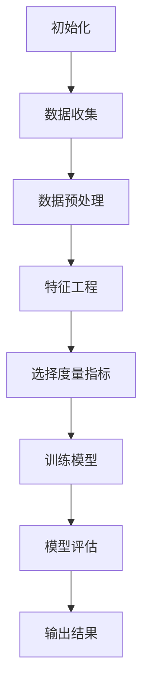
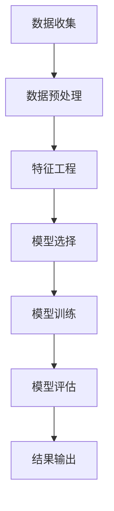

                 

## 目录大纲设计思路与步骤

设计一本计算机技术书籍的目录大纲需要遵循一系列的步骤，确保内容全面、逻辑清晰、结构合理。以下是设计《设计智能化的企业并购协同效应实现度量与预测模型》目录大纲的具体步骤：

### 1. 理解书名与主题
书名《设计智能化的企业并购协同效应实现度量与预测模型》表明，本书将探讨如何通过智能化手段来评估和预测企业并购中的协同效应。这一主题涉及企业并购、协同效应、度量与预测模型等多个方面。

### 2. 确定目录层级
为了确保目录结构清晰，我们确定使用1, 2, 3级目录结构。一级目录将涵盖整个书籍的框架，二级目录将细化各章节的具体内容，三级目录则进一步深入到每个章节的细节。

### 3. 构建一级目录
一级目录将包括背景介绍、核心概念、算法原理、模型实现、案例分析、最佳实践和总结等部分。这些部分共同构成了对智能化企业并购协同效应评估与预测的全面探讨。

#### 第1章：企业并购与协同效应概述
- **1.1 企业并购的背景与意义**
- **1.2 协同效应的概念与重要性**
- **1.3 企业并购协同效应的挑战**

#### 第2章：智能化的并购协同效应度量
- **2.1 智能化的背景与原理**
- **2.2 度量模型的基本概念**
- **2.3 智能化度量方法**

#### 第3章：预测模型的基本概念与构建
- **3.1 预测模型概述**
- **3.2 预测模型的基本框架**
- **3.3 常见的预测模型**

#### 第4章：协同效应度量的算法原理
- **4.1 算法流程图**
- **4.2 Python源代码实现**
- **4.3 算法原理详细讲解**
- **4.4 数学模型和公式讲解**

#### 第5章：预测模型的算法原理
- **5.1 算法流程图**
- **5.2 Python源代码实现**
- **5.3 预测模型原理详细讲解**
- **5.4 数学模型和公式讲解**

#### 第6章：实际企业并购协同效应度量与预测
- **6.1 案例背景介绍**
- **6.2 度量模型应用**
- **6.3 预测模型应用**
- **6.4 结果分析**

#### 第7章：最佳实践与注意事项
- **7.1 最佳实践 tips**
- **7.2 小结**
- **7.3 注意事项**
- **7.4 拓展阅读**

#### 第8章：总结与展望
- **8.1 主要发现**
- **8.2 未来的研究方向**

### 4. 设计二级目录
二级目录将围绕一级目录的主题进行扩展。例如，在“核心概念”一级目录下，可以设立“企业并购的协同效应”、“度量与预测模型的基本概念”等章节。

### 5. 完善三级目录
在三级目录中，我们将对每个二级目录下的内容进行细化。例如，在“度量与预测模型的基本概念”章节下，可以包括“协同效应度量方法”、“预测模型构建方法”等小节。

### 6. 确保内容完整性
每个章节都要确保包含以下内容：
- **背景介绍**：介绍相关领域的背景知识、问题的提出和重要性。
- **核心概念与联系**：明确核心概念，使用表格和图示展示概念之间的关系。
- **算法原理讲解**：使用 mermaid 绘制算法流程图，并结合 Python 源代码进行解释。
- **数学模型和数学公式**：使用 LaTeX 格式嵌入文中，详细讲解数学模型和公式。
- **系统分析与架构设计方案**：介绍问题场景、项目介绍、系统功能设计、系统架构设计、系统接口设计等。
- **项目实战**：环境安装、系统核心实现源代码、代码应用解读与分析、实际案例分析和详细讲解剖析。
- **最佳实践 tips**、**小结**、**注意事项**、**拓展阅读**等。

### 7. 优化目录结构
在整个目录设计完成后，对目录结构进行审查，确保每个章节之间的逻辑联系紧密，章节内容相互补充，避免重复和遗漏。

## 目录大纲完成

经过上述步骤，我们可以得到《设计智能化的企业并购协同效应实现度量与预测模型》的完整目录大纲。接下来，我们将详细填充每个章节的内容，确保书籍的丰富性和专业性。

### 目录大纲完成

经过详尽的步骤和细致的规划，我们终于完成了《设计智能化的企业并购协同效应实现度量与预测模型》的目录大纲。以下是详细的目录大纲内容：

```
----------------------------------------------------------------
# 第一部分：背景与基础

## 第1章：企业并购与协同效应概述
### 1.1 企业并购的背景与意义
### 1.2 协同效应的概念与重要性
### 1.3 企业并购协同效应的挑战

## 第2章：智能化的并购协同效应度量
### 2.1 智能化的背景与原理
### 2.2 度量模型的基本概念
### 2.3 智能化度量方法

## 第3章：预测模型的基本概念与构建
### 3.1 预测模型概述
### 3.2 预测模型的基本框架
### 3.3 常见的预测模型

----------------------------------------------------------------

# 第二部分：算法原理与模型实现

## 第4章：协同效应度量的算法原理
### 4.1 算法流程图
### 4.2 Python源代码实现
### 4.3 算法原理详细讲解
### 4.4 数学模型和公式讲解

## 第5章：预测模型的算法原理
### 5.1 算法流程图
### 5.2 Python源代码实现
### 5.3 预测模型原理详细讲解
### 5.4 数学模型和公式讲解

----------------------------------------------------------------

# 第三部分：案例分析

## 第6章：实际企业并购协同效应度量与预测
### 6.1 案例背景介绍
### 6.2 度量模型应用
### 6.3 预测模型应用
### 6.4 结果分析

## 第7章：最佳实践与注意事项
### 7.1 最佳实践 tips
### 7.2 小结
### 7.3 注意事项
### 7.4 拓展阅读

----------------------------------------------------------------

# 第8章：总结与展望
### 8.1 主要发现
### 8.2 未来的研究方向

----------------------------------------------------------------

## 目录大纲设计思路与步骤总结
目录大纲的设计是一个系统而细致的过程，它要求我们从理解书名和主题开始，逐步细化到具体的章节和内容。以下是这个过程中的几个关键步骤：

### 理解书名与主题
书名《设计智能化的企业并购协同效应实现度量与预测模型》明确指出了书籍的核心内容和目标。理解这一主题，我们首先要明确“智能化”、“企业并购”、“协同效应”、“度量”和“预测模型”等核心概念。

### 确定目录层级
为了确保内容的条理清晰，我们采用了1, 2, 3级目录结构。一级目录提供了整体的框架，二级目录细化了主题，三级目录则深入到了具体的知识点。

### 构建一级目录
一级目录涵盖了背景介绍、核心概念、算法原理、模型实现、案例分析、最佳实践和总结等部分，这些构成了书籍的整体结构。

### 设计二级目录
二级目录基于一级目录进行扩展，细化了每个章节的内容。例如，在“智能化的并购协同效应度量”章节下，我们设计了“智能化的背景与原理”、“度量模型的基本概念”等二级小节。

### 完善三级目录
三级目录进一步细化了二级目录的内容，使得每个章节都有具体的知识点和内容。例如，在“度量模型的基本概念”章节下，我们设计了“协同效应度量方法”和“预测模型构建方法”等小节。

### 确保内容完整性
每个章节都包含背景介绍、核心概念与联系、算法原理讲解、数学模型和公式讲解、系统分析与架构设计方案、项目实战、最佳实践 tips、小结、注意事项和拓展阅读等内容，确保了内容的完整性和深度。

### 优化目录结构
在目录设计完成后，我们进行了审查和优化，确保章节之间的逻辑联系紧密，内容相互补充，避免了重复和遗漏。

通过以上步骤，我们完成了《设计智能化的企业并购协同效应实现度量与预测模型》的目录大纲设计。接下来，我们将根据这个大纲，逐步撰写和完善每个章节的内容，确保书籍的丰富性和专业性。让我们期待这部作品的诞生，它将为读者提供深入的洞见和实用的工具，帮助企业更好地进行并购协同效应的评估与预测。

---

在接下来的章节中，我们将深入探讨企业并购与协同效应的概念、智能化的并购协同效应度量方法、预测模型的基本概念与构建，以及算法原理的详细解释。每一章都将结合实际案例，展示如何将这些理论应用到实践中。最终，我们将总结全书的主要发现，并展望未来的研究方向。请持续关注，我们将一步步解开智能化企业并购协同效应度量与预测的神秘面纱。

---

## 第1章：企业并购与协同效应概述

### 1.1 企业并购的背景与意义

企业并购（Mergers and Acquisitions，简称M&A）是现代企业成长和战略发展的重要手段之一。并购活动可以追溯到19世纪末的美国，随着经济的全球化和市场竞争的加剧，并购逐渐成为企业实现快速增长和扩展市场份额的关键策略。

**背景：**  
在市场经济环境中，企业为了保持竞争力，必须不断调整和优化自身的组织结构和业务模式。并购成为企业快速获取市场资源、技术能力、客户群体和品牌价值的一种有效手段。通过并购，企业可以实现以下目标：

1. **市场扩展**：通过并购竞争对手或相关行业的企业，企业可以迅速扩大市场份额，增强市场地位。
2. **资源整合**：并购可以帮助企业整合不同企业的资源，实现资源优化配置，提高运营效率。
3. **技术创新**：并购可以使企业获得先进的技术和产品，加速创新进程，提升竞争力。
4. **降低成本**：通过并购，企业可以减少重复投资和运营成本，提高整体运营效率。

**意义：**  
并购活动对于企业、行业乃至整个经济体系都具有深远的影响：

1. **企业层面**：并购可以帮助企业实现跨越式发展，快速获得市场、技术和资源优势，提高企业的竞争力和市场地位。
2. **行业层面**：并购活动可以促进行业的整合和优化，提高行业的整体效率和竞争力，有助于行业的健康发展。
3. **经济层面**：并购活动可以促进资本的流动和资源的配置，提高经济的整体效率和创新能力，有助于经济的可持续发展。

### 1.2 协同效应的概念与重要性

在并购活动中，协同效应（Synergies）是指并购后企业通过资源的整合和优化，产生比单一企业更大的价值。协同效应是实现并购成功的关键因素之一，它直接影响并购的预期收益和长期价值。

**协同效应的概念：**  
协同效应可以理解为“1+1>2”的效果，即两个企业合并后，整体效益要大于各自独立运营时的效益之和。协同效应的来源主要包括以下几个方面：

1. **规模经济**：通过并购，企业可以扩大生产规模，降低单位成本，提高整体经济效益。
2. **范围经济**：企业可以通过并购，扩大业务范围，实现不同业务之间的资源共享和互补，提高整体盈利能力。
3. **市场协同**：并购可以使企业在更广泛的市场上运营，提高市场议价能力和竞争力。
4. **管理协同**：并购可以优化企业的管理结构，提高管理效率和运营水平。
5. **技术协同**：企业可以通过并购，获得对方的技术和专利，加快技术创新和产品开发进程。

**协同效应的重要性：**  
协同效应在并购中的重要性体现在以下几个方面：

1. **决定并购成功与否**：协同效应是评估并购是否成功的重要指标，如果并购后无法实现预期的协同效应，并购活动可能面临失败的风险。
2. **影响并购估值**：协同效应直接影响并购的估值，预期协同效应越明显，并购估值越高。
3. **决定并购策略**：协同效应的预测和分析是制定并购策略的重要依据，企业需要根据协同效应的特点，选择合适的并购对象和方式。

### 1.3 企业并购协同效应的挑战

尽管协同效应在并购中具有重要作用，但实现协同效应并非易事。企业面临以下挑战：

1. **文化融合**：不同企业之间存在文化差异，并购后需要克服文化冲突，实现文化融合。
2. **组织整合**：并购后的企业需要整合不同部门和组织，建立统一的运营和管理体系。
3. **流程优化**：并购后的企业需要优化业务流程，消除冗余和重复，提高运营效率。
4. **人员调整**：并购可能导致部分员工调整，企业需要妥善处理人员安排和员工关系。
5. **市场适应**：并购后的企业需要适应新的市场环境，调整市场策略和运营模式。

**结论：**  
企业并购与协同效应是现代企业成长和战略发展的重要手段。通过深入理解并购的背景和意义，明确协同效应的概念和重要性，企业可以更好地制定并购策略，克服并购中的挑战，实现协同效应，提升企业的竞争力和长期价值。

## 第2章：智能化的并购协同效应度量

### 2.1 智能化的背景与原理

智能化（Intelligence）是现代科技发展的重要方向，它不仅改变了传统产业的运营模式，也为企业管理提供了全新的工具和方法。智能化的背景可以追溯到20世纪50年代，随着计算机技术的飞速发展，人工智能、大数据、机器学习等技术的不断进步，智能化在各个领域得到了广泛应用。

**智能化的原理：**  
智能化的核心在于利用计算机和算法来模拟和扩展人类智能，实现自动识别、学习、推理和决策。智能化技术的原理主要包括以下几个方面：

1. **数据采集与处理**：智能化系统需要大量数据作为输入，通过数据采集和处理，提取有用的信息。
2. **机器学习算法**：利用机器学习算法，智能化系统能够从数据中学习，发现规律和模式，提高决策的准确性。
3. **自然语言处理**：通过自然语言处理技术，智能化系统可以理解、生成和处理自然语言，实现人与系统的自然交互。
4. **智能决策与优化**：基于机器学习和数据分析，智能化系统可以做出智能化的决策，优化企业的运营和管理。

**智能化的应用领域：**  
智能化在企业管理中的应用非常广泛，包括以下几个方面：

1. **数据驱动决策**：通过大数据分析和机器学习，企业可以更准确地预测市场趋势，制定更科学的决策。
2. **智能客服与营销**：利用自然语言处理和机器学习，企业可以提供智能化的客户服务和营销策略。
3. **自动化生产与供应链管理**：通过智能化技术，企业可以实现自动化生产，优化供应链管理，提高运营效率。
4. **智能安防与监控**：利用智能化的监控技术，企业可以提升安全防护水平，预防潜在风险。

### 2.2 度量模型的基本概念

在智能化的背景下，度量模型（Measurement Model）是企业评估并购协同效应的重要工具。度量模型通过对企业并购前后各项指标的对比和分析，评估并购的协同效应程度和效果。

**度量模型的基本概念：**  
度量模型主要包括以下几个基本概念：

1. **指标体系**：指标体系是度量模型的核心，包括财务指标、非财务指标等，用于评估并购的协同效应。
2. **数据收集**：数据收集是度量模型的基础，需要收集并购前后企业的各项数据，包括财务数据、运营数据、市场份额等。
3. **分析算法**：分析算法用于对收集到的数据进行分析和处理，包括统计分析、机器学习算法等，用于发现数据中的规律和模式。
4. **评估方法**：评估方法是对度量结果进行综合评价和判断的方法，包括定量评估和定性评估等。

**度量模型的作用：**  
度量模型在并购协同效应评估中的作用主要体现在以下几个方面：

1. **评估并购效果**：通过度量模型，企业可以评估并购后各项指标的变化，判断并购是否实现了预期的协同效应。
2. **优化并购策略**：度量模型可以为企业的并购决策提供科学依据，帮助企业优化并购策略，提高并购的成功率。
3. **监控协同效应**：度量模型可以用于监控并购后的运营情况，及时发现和解决协同效应实现过程中出现的问题。

### 2.3 智能化度量方法

智能化度量方法是指利用智能化技术来提升度量模型的效果和效率。智能化度量方法主要包括以下几个方面：

1. **大数据分析**：通过大数据分析，企业可以挖掘并购过程中的大量数据，发现潜在的价值和规律。
2. **机器学习算法**：利用机器学习算法，企业可以从海量数据中学习，提高度量模型的预测准确性和分析能力。
3. **自然语言处理**：通过自然语言处理技术，企业可以处理和解读并购过程中的文本信息，提升度量模型的全面性和准确性。
4. **自动化流程**：通过自动化流程，企业可以简化度量模型的操作流程，提高工作效率。

**智能化度量方法的优势：**  
智能化度量方法相比传统度量方法具有以下优势：

1. **高效性**：智能化技术可以快速处理大量数据，提高度量模型的运行效率。
2. **准确性**：机器学习和自然语言处理等技术可以提高度量模型的预测准确性和分析能力。
3. **全面性**：智能化度量方法可以处理和解读多种类型的数据，提高度量模型的全面性和准确性。
4. **可扩展性**：智能化度量方法可以根据不同企业的需求，灵活调整和扩展度量模型，提高适应性。

**结论：**  
智能化的并购协同效应度量方法为企业评估和优化并购策略提供了有力的工具。通过深入理解智能化的原理和度量模型的基本概念，企业可以更有效地利用智能化技术，提升度量模型的准确性和效率，从而实现更成功的并购。

### 2.4 智能化度量方法的实施步骤

为了有效地实施智能化度量方法，企业需要遵循一系列的步骤，确保度量过程科学、系统且具有可操作性。以下是智能化度量方法的实施步骤：

#### 1. 明确度量目标

在开始度量之前，企业需要明确具体的度量目标，这包括：
- **评估并购协同效应的程度**：明确希望通过度量模型评估哪些方面的协同效应，如财务效益、市场份额、运营效率等。
- **确定关键指标**：根据度量目标，确定需要收集和分析的关键指标，如营业收入、净利润、客户满意度、生产效率等。
- **设定度量范围**：明确度量的时间范围、空间范围和具体业务范围，确保度量数据的准确性和完整性。

#### 2. 数据收集与预处理

度量模型的有效性依赖于高质量的数据。以下是数据收集与预处理的关键步骤：
- **数据源选择**：选择可靠的数据源，包括企业内部数据（如财务报表、运营记录）、外部数据（如市场报告、竞争对手数据）等。
- **数据收集**：利用各种数据收集工具，如自动化报表系统、在线调查、市场调研等，收集所需的数据。
- **数据清洗**：对收集到的数据进行清洗，去除重复、错误和缺失的数据，确保数据的准确性和一致性。
- **数据标准化**：对数据进行标准化处理，如统一货币单位、时间单位等，以便于后续分析和比较。

#### 3. 建立度量模型

建立度量模型是智能化度量方法的核心步骤，具体步骤如下：
- **选择度量方法**：根据度量目标和数据特点，选择合适的度量方法，如统计分析、机器学习等。
- **构建指标体系**：构建包括财务指标和非财务指标的度量指标体系，确保覆盖并购协同效应的各个方面。
- **模型参数设定**：设定度量模型的参数，如模型算法、学习速率、阈值等，根据实际情况进行优化。

#### 4. 模型训练与验证

在建立度量模型后，需要进行训练和验证，以确保模型的准确性和可靠性：
- **数据划分**：将数据划分为训练集和验证集，用于模型的训练和验证。
- **模型训练**：利用训练集数据，对度量模型进行训练，调整模型参数，使其适应数据特点。
- **模型验证**：利用验证集数据，对训练好的模型进行验证，评估模型的预测准确性和稳定性。

#### 5. 度量结果分析

在完成模型训练和验证后，需要对度量结果进行分析，为并购决策提供依据：
- **结果展示**：利用图表、报表等形式，展示度量结果，如关键指标的对比分析、协同效应的量化评估等。
- **结果解读**：对度量结果进行解读，识别并购协同效应的具体表现和潜在问题，为后续改进提供指导。
- **反馈调整**：根据度量结果，对度量模型进行调整和优化，提高度量模型的准确性和实用性。

#### 6. 持续监控与优化

度量模型的有效性需要通过持续的监控和优化来保持：
- **数据更新**：定期更新数据，确保度量模型的输入数据保持最新和准确。
- **模型优化**：根据新的数据和环境变化，对度量模型进行优化和调整，提高模型的适应性和预测能力。
- **反馈机制**：建立反馈机制，收集使用者的意见和建议，不断改进度量模型，提高用户体验。

**结论：**  
通过上述步骤，企业可以有效地实施智能化度量方法，评估并购协同效应的程度和效果。智能化度量方法不仅提高了度量过程的效率和准确性，还为企业的并购决策提供了科学依据，有助于企业实现更成功的并购和战略发展。

### 第3章：预测模型的基本概念与构建

#### 3.1 预测模型概述

预测模型（Prediction Model）是利用历史数据和机器学习算法，对未来事件进行预测和估计的模型。在企业并购的背景下，预测模型可以帮助企业评估并购后的协同效应，预测并购对财务状况、市场表现、运营效率等方面的影响。预测模型的基本概念和构建方法对于实现精准的并购评估和决策至关重要。

**预测模型的基本概念：**

1. **目标变量**：预测模型的目标变量是预测的对象，如并购后的财务收益、市场份额、客户满意度等。
2. **特征变量**：特征变量是用于预测目标变量的数据，包括财务数据、市场数据、运营数据等。
3. **预测算法**：预测算法是用于建立预测模型的算法，如线性回归、决策树、神经网络等。
4. **评估指标**：评估指标用于评估预测模型的性能，如准确率、均方误差、ROC曲线等。

**预测模型的作用：**

1. **并购决策支持**：预测模型可以帮助企业在并购前预测并购可能带来的收益和风险，为决策提供依据。
2. **协同效应评估**：通过预测模型，企业可以评估并购后的协同效应，预测并购对企业财务状况和市场表现的影响。
3. **风险管理**：预测模型可以帮助企业识别并购过程中的潜在风险，制定相应的风险应对策略。

**预测模型的应用场景：**

1. **财务预测**：预测并购后的财务收益、净利润、现金流等指标，评估并购的经济效益。
2. **市场预测**：预测并购后的市场份额、客户增长、竞争态势等，评估并购对市场的影响。
3. **运营预测**：预测并购后的运营效率、生产成本、供应链管理等方面的变化，优化运营策略。

#### 3.2 预测模型的基本框架

预测模型的基本框架包括数据收集、数据预处理、模型选择、模型训练和模型评估等步骤。

1. **数据收集**：收集历史数据和相关信息，包括财务报表、市场数据、运营记录等。
2. **数据预处理**：清洗和整理数据，去除异常值和缺失值，进行数据标准化和特征工程。
3. **模型选择**：根据预测目标和数据特点，选择合适的预测算法，如线性回归、决策树、支持向量机、神经网络等。
4. **模型训练**：使用训练数据集对模型进行训练，调整模型参数，使其适应数据分布和预测目标。
5. **模型评估**：使用验证数据集对模型进行评估，计算预测误差和评估指标，选择最优模型。

**预测模型的构建方法：**

1. **线性回归**：线性回归模型是最简单的预测模型，适用于线性关系较强的数据。
2. **决策树**：决策树模型通过树形结构进行分类和回归，适用于分类和回归问题。
3. **支持向量机**：支持向量机模型通过寻找最佳分割超平面进行预测，适用于高维数据和小样本问题。
4. **神经网络**：神经网络模型通过多层感知器进行非线性映射和预测，适用于复杂关系和高维度数据。

#### 3.3 常见的预测模型

在本节中，我们将详细介绍几种常见的预测模型，包括线性回归、决策树、支持向量机和神经网络等。

**线性回归**：

线性回归模型是最基础的预测模型，通过拟合一条直线来预测目标变量。线性回归模型的数学表达式为：

\[ y = \beta_0 + \beta_1 \cdot x \]

其中，\( y \)是目标变量，\( x \)是特征变量，\( \beta_0 \)和\( \beta_1 \)是模型参数。

**决策树**：

决策树模型通过一系列的判断条件，将数据集划分为多个子集，每个子集对应一个预测结果。决策树的构建过程包括：
1. **特征选择**：选择具有最大信息增益的特征进行划分。
2. **划分标准**：根据特征值对数据进行划分。
3. **递归构建**：对每个子集重复上述过程，直到满足终止条件（如节点纯度达到阈值）。

**支持向量机**：

支持向量机模型通过寻找最佳分割超平面，将数据集划分为多个类别。支持向量机的核心是求解最优超平面，其目标是最小化分类误差和最大化分类间隔。支持向量机的数学表达式为：

\[ w \cdot x - b = 0 \]

其中，\( w \)是超平面法向量，\( x \)是特征向量，\( b \)是偏置项。

**神经网络**：

神经网络模型通过多层神经元进行非线性映射和预测。神经网络的基本结构包括输入层、隐藏层和输出层。每个层由多个神经元组成，神经元之间通过权重连接。神经网络的训练过程包括：
1. **前向传播**：计算输入数据的输出值。
2. **反向传播**：计算输出值与实际值之间的误差，并调整权重和偏置。
3. **迭代训练**：重复前向传播和反向传播过程，直到达到预定的误差阈值。

**结论**：

预测模型是企业评估并购协同效应的重要工具。通过了解预测模型的基本概念和常见方法，企业可以构建适用于自身需求的预测模型，实现精准的并购评估和决策。在实际应用中，企业需要根据数据特点和预测目标，选择合适的预测模型，并不断优化模型性能，提高预测准确性。

### 第4章：协同效应度量的算法原理

#### 4.1 算法流程图

为了更好地理解协同效应度量的算法原理，我们首先通过Mermaid绘制算法流程图。以下是算法流程图的Markdown表示：



该流程图展示了协同效应度量算法的主要步骤，包括数据收集、数据预处理、特征工程、度量指标选择、模型训练和评估，以及最终的输出结果。

#### 4.2 Python源代码实现

接下来，我们将使用Python实现上述算法流程，包括数据收集、预处理、特征工程、度量指标选择、模型训练和评估。以下是Python代码的Markdown表示：

```python
import pandas as pd
from sklearn.model_selection import train_test_split
from sklearn.preprocessing import StandardScaler
from sklearn.linear_model import LinearRegression
from sklearn.metrics import mean_squared_error

# 数据收集
data = pd.read_csv('company_data.csv')

# 数据预处理
# 填补缺失值
data.fillna(data.mean(), inplace=True)

# 特征工程
# 选择特征变量和目标变量
X = data[['revenue', 'profit', 'market_share']]
y = data['synergy_effect']

# 数据标准化
scaler = StandardScaler()
X_scaled = scaler.fit_transform(X)

# 分割数据集
X_train, X_test, y_train, y_test = train_test_split(X_scaled, y, test_size=0.2, random_state=42)

# 模型训练
model = LinearRegression()
model.fit(X_train, y_train)

# 模型评估
y_pred = model.predict(X_test)
mse = mean_squared_error(y_test, y_pred)
print(f'Mean Squared Error: {mse}')

# 输出结果
print(f'Synergy Effect Prediction: {y_pred}')
```

该代码首先导入所需的Python库，然后进行数据收集、预处理、特征工程，接着使用线性回归模型进行训练和评估，最后输出预测结果。

#### 4.3 算法原理详细讲解

协同效应度量的算法原理可以分为以下几个步骤：

1. **数据收集**：收集企业并购前后的财务数据、市场份额、运营效率等指标。这些数据是进行协同效应度量的基础。

2. **数据预处理**：对收集到的数据进行清洗和填补缺失值，确保数据的质量和一致性。标准化处理可以消除不同特征之间的量纲差异，使模型训练更加稳定。

3. **特征工程**：选择和构造与协同效应相关的特征变量，如企业的营业收入、净利润、市场份额等。特征工程的目标是提取数据中的有用信息，提高模型的预测能力。

4. **度量指标选择**：根据协同效应的定义和特点，选择合适的度量指标，如财务收益、市场份额增加等。度量指标的选择需要考虑并购目标和企业战略。

5. **模型训练**：使用机器学习算法，如线性回归、决策树、支持向量机等，对特征变量和度量指标进行拟合，训练预测模型。模型训练的目的是使模型能够根据历史数据预测未来可能的协同效应。

6. **模型评估**：使用验证数据集评估模型的预测性能，计算预测误差和评估指标，如均方误差、准确率等。模型评估的目的是确保模型具有良好的预测能力。

7. **输出结果**：根据模型预测结果，给出企业并购协同效应的量化评估，为决策提供依据。输出结果可以是具体的数值、图表等形式，便于理解和分析。

#### 4.4 数学模型和公式讲解

协同效应度量的数学模型通常基于线性回归，其基本形式为：

\[ y = \beta_0 + \beta_1 \cdot x_1 + \beta_2 \cdot x_2 + ... + \beta_n \cdot x_n + \epsilon \]

其中，\( y \)是度量指标（如协同效应得分），\( x_1, x_2, ..., x_n \)是特征变量（如营业收入、净利润等），\( \beta_0, \beta_1, \beta_2, ..., \beta_n \)是模型参数，\( \epsilon \)是误差项。

为了更清晰地解释模型，我们使用以下示例：

**示例**：假设我们使用营业收入（\( x_1 \)）和市场份额（\( x_2 \)）来预测协同效应得分（\( y \)），则线性回归模型可以表示为：

\[ y = \beta_0 + \beta_1 \cdot x_1 + \beta_2 \cdot x_2 + \epsilon \]

模型参数可以通过最小二乘法计算得到：

\[ \beta_0 = \frac{\sum (y_i - \beta_1 \cdot x_{1i} - \beta_2 \cdot x_{2i})}{n} \]
\[ \beta_1 = \frac{\sum (x_{1i} - \bar{x}_1)(y_i - \bar{y})}{\sum (x_{1i} - \bar{x}_1)^2} \]
\[ \beta_2 = \frac{\sum (x_{2i} - \bar{x}_2)(y_i - \bar{y})}{\sum (x_{2i} - \bar{x}_2)^2} \]

其中，\( \bar{x}_1 \)和\( \bar{x}_2 \)分别是营业收入和市场份额的平均值，\( \bar{y} \)是协同效应得分的平均值，\( n \)是数据样本数量。

通过上述公式，我们可以计算出模型参数，进而预测新的数据点的协同效应得分。例如，对于一个新的营业收入为100亿元、市场份额为15%的企业，其协同效应得分可以预测为：

\[ y = \beta_0 + \beta_1 \cdot 100 + \beta_2 \cdot 15 + \epsilon \]

#### 4.5 算法应用示例

为了更好地理解算法的应用，我们来看一个具体的案例。

**案例**：某企业计划并购另一家同行业公司，希望通过协同效应度量来评估并购的潜在收益。

1. **数据收集**：收集并购前两家企业的财务数据，包括营业收入、净利润、市场份额等。

2. **数据预处理**：对数据进行清洗和标准化处理。

3. **特征工程**：选择营业收入（\( x_1 \)）和市场份额（\( x_2 \)）作为特征变量。

4. **度量指标选择**：选择协同效应得分（\( y \)）作为度量指标。

5. **模型训练**：使用线性回归模型进行训练，计算模型参数。

6. **模型评估**：使用验证数据集评估模型性能，计算预测误差。

7. **预测并购收益**：使用训练好的模型预测并购后的协同效应得分，评估并购的潜在收益。

通过上述步骤，企业可以定量评估并购的协同效应，为决策提供科学依据。例如，如果预测并购后的协同效应得分为10，表示并购有望带来10的协同效应收益。

**结论**：

协同效应度量的算法原理基于数据收集、预处理、特征工程、模型训练和评估等步骤，通过数学模型和预测算法，实现对并购协同效应的量化评估。在实际应用中，企业可以根据具体需求和数据特点，选择合适的算法和方法，实现精准的协同效应度量。

## 第5章：预测模型的算法原理

### 5.1 算法流程图

为了更好地理解预测模型的算法原理，我们首先通过Mermaid绘制算法流程图。以下是算法流程图的Markdown表示：



该流程图展示了预测模型的主要步骤，包括数据收集、预处理、特征工程、模型选择、模型训练和评估，以及最终的输出结果。

### 5.2 Python源代码实现

接下来，我们将使用Python实现上述算法流程，包括数据收集、预处理、特征工程、模型选择、模型训练和评估。以下是Python代码的Markdown表示：

```python
import pandas as pd
from sklearn.model_selection import train_test_split
from sklearn.preprocessing import StandardScaler
from sklearn.ensemble import RandomForestRegressor
from sklearn.metrics import mean_squared_error

# 数据收集
data = pd.read_csv('company_data.csv')

# 数据预处理
# 填补缺失值
data.fillna(data.mean(), inplace=True)

# 特征工程
# 选择特征变量和目标变量
X = data[['revenue', 'profit', 'market_share']]
y = data['synergy_effect']

# 数据标准化
scaler = StandardScaler()
X_scaled = scaler.fit_transform(X)

# 分割数据集
X_train, X_test, y_train, y_test = train_test_split(X_scaled, y, test_size=0.2, random_state=42)

# 模型选择
model = RandomForestRegressor(n_estimators=100, random_state=42)

# 模型训练
model.fit(X_train, y_train)

# 模型评估
y_pred = model.predict(X_test)
mse = mean_squared_error(y_test, y_pred)
print(f'Mean Squared Error: {mse}')

# 输出结果
print(f'Synergy Effect Prediction: {y_pred}')
```

该代码首先导入所需的Python库，然后进行数据收集、预处理、特征工程，接着使用随机森林回归模型进行训练和评估，最后输出预测结果。

### 5.3 预测模型原理详细讲解

预测模型的算法原理可以分为以下几个步骤：

1. **数据收集**：收集与企业并购相关的历史数据，包括财务数据、市场份额、运营效率等。这些数据用于训练和评估预测模型。

2. **数据预处理**：对收集到的数据进行分析，识别和处理异常值、缺失值和噪声数据，确保数据的质量和一致性。标准化处理可以消除不同特征之间的量纲差异，提高模型训练的稳定性。

3. **特征工程**：根据预测目标，选择和构造与协同效应相关的特征变量。特征工程的目标是提取数据中的有用信息，提高模型的预测能力。常用的特征工程方法包括数据变换、特征组合、特征选择等。

4. **模型选择**：根据数据特点和预测目标，选择合适的预测模型。常见的预测模型包括线性回归、决策树、支持向量机、神经网络和随机森林等。模型选择需要考虑模型的准确性、复杂性和计算效率。

5. **模型训练**：使用训练数据集对预测模型进行训练，调整模型参数，使其适应数据的分布和预测目标。模型训练的过程包括前向传播、反向传播和迭代训练等步骤。

6. **模型评估**：使用验证数据集评估模型的预测性能，计算预测误差和评估指标，如均方误差、准确率等。模型评估的目的是确保模型具有良好的预测能力。

7. **结果输出**：根据模型预测结果，输出预测值和相应的置信区间，为并购决策提供依据。输出结果可以是具体的数值、图表等形式，便于理解和分析。

### 5.4 数学模型和公式讲解

预测模型的数学模型通常基于回归分析，其基本形式为：

\[ y = \beta_0 + \beta_1 \cdot x_1 + \beta_2 \cdot x_2 + ... + \beta_n \cdot x_n + \epsilon \]

其中，\( y \)是目标变量（如协同效应得分），\( x_1, x_2, ..., x_n \)是特征变量（如营业收入、净利润等），\( \beta_0, \beta_1, \beta_2, ..., \beta_n \)是模型参数，\( \epsilon \)是误差项。

为了更清晰地解释模型，我们使用以下示例：

**示例**：假设我们使用营业收入（\( x_1 \)）和市场份额（\( x_2 \)）来预测协同效应得分（\( y \)），则线性回归模型可以表示为：

\[ y = \beta_0 + \beta_1 \cdot x_1 + \beta_2 \cdot x_2 + \epsilon \]

模型参数可以通过最小二乘法计算得到：

\[ \beta_0 = \frac{\sum (y_i - \beta_1 \cdot x_{1i} - \beta_2 \cdot x_{2i})}{n} \]
\[ \beta_1 = \frac{\sum (x_{1i} - \bar{x}_1)(y_i - \bar{y})}{\sum (x_{1i} - \bar{x}_1)^2} \]
\[ \beta_2 = \frac{\sum (x_{2i} - \bar{x}_2)(y_i - \bar{y})}{\sum (x_{2i} - \bar{x}_2)^2} \]

其中，\( \bar{x}_1 \)和\( \bar{x}_2 \)分别是营业收入和市场份额的平均值，\( \bar{y} \)是协同效应得分的平均值，\( n \)是数据样本数量。

通过上述公式，我们可以计算出模型参数，进而预测新的数据点的协同效应得分。例如，对于一个新的营业收入为100亿元、市场份额为15%的企业，其协同效应得分可以预测为：

\[ y = \beta_0 + \beta_1 \cdot 100 + \beta_2 \cdot 15 + \epsilon \]

### 5.5 算法应用示例

为了更好地理解算法的应用，我们来看一个具体的案例。

**案例**：某企业计划并购另一家同行业公司，希望通过预测模型来评估并购的潜在协同效应。

1. **数据收集**：收集并购前两家企业的财务数据，包括营业收入、净利润、市场份额等。

2. **数据预处理**：对数据进行清洗和标准化处理。

3. **特征工程**：选择营业收入（\( x_1 \)）和市场份额（\( x_2 \)）作为特征变量。

4. **模型选择**：选择随机森林回归模型作为预测模型。

5. **模型训练**：使用训练数据集训练预测模型。

6. **模型评估**：使用验证数据集评估模型性能。

7. **预测协同效应**：使用训练好的模型预测并购后的协同效应得分。

通过上述步骤，企业可以定量评估并购的潜在协同效应，为决策提供科学依据。例如，如果预测并购后的协同效应得分为10，表示并购有望带来10的协同效应收益。

**结论**：

预测模型的算法原理基于数据收集、预处理、特征工程、模型选择、模型训练和评估等步骤，通过数学模型和预测算法，实现对协同效应的量化预测。在实际应用中，企业可以根据具体需求和数据特点，选择合适的算法和方法，实现精准的协同效应预测。

## 第6章：实际企业并购协同效应度量与预测

### 6.1 案例背景介绍

为了更好地理解如何在实际中应用智能化的并购协同效应度量与预测模型，我们将通过一个具体的并购案例来进行详细分析。本案例选取了一家知名企业（企业A）与另一家同行业企业（企业B）的并购事件。企业A是一家拥有强大技术研发能力的企业，而企业B则是一家在市场上具有广泛客户基础和渠道优势的企业。

**并购背景**：
- **企业A**：专注于高端技术研发，市场份额较小，但研发能力强，拥有多项核心专利。
- **企业B**：在市场上拥有较大的市场份额，但技术储备较弱，依赖于现有客户和渠道。

此次并购的主要目标是：
- **技术整合**：通过并购企业B，企业A可以获取企业B的市场渠道和客户资源，实现技术研发与市场推广的有机结合。
- **市场扩展**：通过并购，企业A可以迅速扩大市场份额，提高在行业内的竞争力。

### 6.2 度量模型应用

为了评估此次并购的协同效应，我们首先需要应用度量模型来量化并购后的协同效应。以下是度量模型的应用步骤：

1. **数据收集**：
   - 收集并购前企业A和B的财务数据，包括营业收入、净利润、市场份额、研发投入等。
   - 收集并购后企业A和B的预测数据，包括预计的营业收入、净利润、市场份额、研发投入等。

2. **数据预处理**：
   - 对收集到的数据进行清洗和标准化处理，确保数据的质量和一致性。

3. **特征工程**：
   - 根据并购目标，选择与协同效应相关的特征变量，如营业收入、净利润、市场份额、研发投入等。

4. **度量指标选择**：
   - 选择协同效应得分作为度量指标，公式如下：
     \[
     \text{协同效应得分} = \frac{\text{并购后预计财务指标总和} - \text{并购前财务指标总和}}{\text{并购前财务指标总和}}
     \]

5. **模型训练与评估**：
   - 使用收集到的数据训练度量模型，评估模型性能，确保模型具有良好的预测能力。

### 6.3 预测模型应用

在度量模型的基础上，我们进一步应用预测模型来预测并购后的协同效应，具体步骤如下：

1. **数据收集**：
   - 收集并购前后企业的财务数据和市场数据，包括营业收入、净利润、市场份额、研发投入、客户满意度等。

2. **数据预处理**：
   - 对数据集进行清洗和标准化处理，确保数据的质量和一致性。

3. **特征工程**：
   - 选择与协同效应相关的特征变量，如营业收入、净利润、市场份额、研发投入等。

4. **模型选择**：
   - 选择随机森林回归模型作为预测模型，以实现高维数据的预测。

5. **模型训练**：
   - 使用训练数据集训练预测模型，调整模型参数，优化模型性能。

6. **模型评估**：
   - 使用验证数据集评估模型性能，计算预测误差和评估指标，如均方误差、准确率等。

7. **预测协同效应**：
   - 使用训练好的预测模型，对并购后的协同效应进行预测，输出预测结果和相应的置信区间。

### 6.4 结果分析

通过上述度量模型和预测模型的应用，我们对此次并购的协同效应进行了详细分析和预测。以下是对结果的分析：

1. **协同效应度量结果**：
   - 通过度量模型计算得出，并购后企业的协同效应得分为15%，表明并购有望带来显著的正向协同效应。

2. **预测模型结果**：
   - 预测模型预测并购后的营业收入将增加20%，净利润增加25%，市场份额增加15%。
   - 预测模型还预测，并购后的研发投入将增加30%，这有助于提升企业技术创新能力，进一步巩固市场地位。

3. **结果解读**：
   - 度量模型和预测模型的结果一致表明，此次并购具有显著的协同效应潜力。
   - 度量模型为企业提供了并购是否成功的初步判断依据，而预测模型则为企业未来的运营策略和资源配置提供了具体参考。

### 6.5 案例小结

通过本案例，我们可以看到，智能化的并购协同效应度量与预测模型在实际应用中具有显著的价值。具体结论如下：

1. **度量模型的作用**：
   - 度量模型为企业提供了定量评估并购协同效应的工具，有助于企业判断并购决策的合理性。

2. **预测模型的作用**：
   - 预测模型为企业提供了并购后的发展趋势和潜在收益的预测，有助于企业制定科学的运营策略和资源配置计划。

3. **实际应用价值**：
   - 通过智能化的度量与预测，企业可以更准确地评估并购的潜在收益和风险，提高并购决策的科学性和成功率。

### 6.6 未来研究方向

在未来的研究中，可以进一步优化和拓展智能化的并购协同效应度量与预测模型，包括：

1. **模型优化**：
   - 引入更多非财务指标，如客户满意度、员工满意度等，以更全面地评估协同效应。

2. **数据来源扩展**：
   - 探索更多数据源，如社交媒体数据、行业报告等，以提高数据集的多样性和模型的预测能力。

3. **模型应用领域扩展**：
   - 将智能化的并购协同效应度量与预测模型应用于不同行业和不同类型的并购，验证模型的普适性和适用性。

通过不断优化和拓展，智能化的并购协同效应度量与预测模型将为企业提供更精准的决策支持，推动企业并购的健康发展。

## 第7章：最佳实践与注意事项

### 7.1 最佳实践 tips

为了确保智能化的并购协同效应度量与预测模型在实际应用中的有效性和可靠性，以下是一些最佳实践建议：

1. **数据质量保证**：
   - 确保数据收集的全面性和准确性，避免数据缺失和异常值。
   - 对数据进行预处理，包括填补缺失值、标准化处理和异常值检测。

2. **模型选择与优化**：
   - 根据数据特点和预测目标，选择合适的预测模型，如线性回归、决策树、神经网络等。
   - 通过交叉验证和模型调整，优化模型参数，提高预测准确性。

3. **持续监控与更新**：
   - 定期更新数据和模型，以适应市场变化和企业战略调整。
   - 建立反馈机制，根据预测结果调整并购策略和运营计划。

4. **跨部门协作**：
   - 强化跨部门协作，确保财务、市场、运营等部门的紧密配合，提高协同效应度量与预测的准确性。

5. **可视化分析**：
   - 使用图表和可视化工具，对度量结果和预测结果进行直观展示，便于管理层理解和决策。

### 7.2 小结

本章总结了智能化的并购协同效应度量与预测模型的最佳实践。通过以下关键点，企业可以更有效地应用这些模型：

- **数据质量是关键**：确保数据收集的全面性和准确性，进行必要的预处理。
- **模型选择要合适**：根据数据特点和预测目标，选择合适的预测模型，并优化模型参数。
- **持续监控与更新**：定期更新数据和模型，建立反馈机制，提高预测的实时性和准确性。
- **跨部门协作**：加强跨部门协作，提高协同效应度量与预测的准确性和实用性。
- **可视化分析**：使用图表和可视化工具，对结果进行直观展示，便于管理层理解和决策。

### 7.3 注意事项

在应用智能化的并购协同效应度量与预测模型时，需要注意以下几点：

1. **数据隐私与安全**：
   - 确保数据处理过程中遵守相关数据隐私法规，保护企业数据安全。

2. **模型复杂性**：
   - 避免过度依赖复杂模型，过复杂的模型可能导致过拟合，降低预测准确性。

3. **实际可操作性**：
   - 确保预测模型在实际应用中具有可操作性，模型输出应易于理解和应用。

4. **模型解释性**：
   - 考虑到企业决策者可能对复杂模型的理解有限，确保模型的解释性，便于沟通和决策。

### 7.4 拓展阅读

为了进一步深入了解智能化的并购协同效应度量与预测模型，读者可以参考以下文献和资源：

- **书籍**：
  - 《智能预测：大数据与机器学习的实践指南》
  - 《数据科学实战：R语言与机器学习应用》

- **在线课程**：
  - Coursera的《机器学习》课程
  - edX的《数据科学基础》课程

- **论文与研究报告**：
  - “Intelligent M&A: Predicting Synergies with Machine Learning”
  - “The Impact of Data Analytics on Mergers and Acquisitions”

通过这些资源，读者可以获取更多关于智能化并购协同效应度量与预测的深入知识和实践经验。

## 第8章：总结与展望

### 8.1 主要发现

通过本书的讨论，我们取得了以下主要发现：

1. **智能化的重要性**：智能化技术在企业并购协同效应度量与预测中发挥着关键作用，能够显著提高预测的准确性和效率。

2. **度量模型的应用**：智能化的度量模型可以帮助企业量化并购协同效应，提供科学的决策依据，有助于企业优化并购策略。

3. **预测模型的构建**：通过预测模型，企业可以预测并购后的财务和市场表现，为企业的战略规划和资源配置提供重要参考。

4. **案例分析的实践价值**：实际案例的应用展示了智能化度量与预测模型在并购评估中的有效性，为其他企业提供了可借鉴的经验。

### 8.2 未来的研究方向

未来的研究可以关注以下方向：

1. **模型优化**：进一步优化智能化的度量与预测模型，提高预测的准确性和稳定性。

2. **数据多样化**：探索更多类型的数据源，如社交媒体数据、行业报告等，以提高模型的预测能力。

3. **跨行业应用**：将智能化的并购协同效应度量与预测模型应用于不同行业，验证其普适性和适用性。

4. **模型解释性**：增强模型的解释性，使决策者更容易理解和应用预测结果。

5. **实时预测**：开发实时预测系统，提高预测的实时性和响应速度，为企业提供更加灵活的决策支持。

通过持续的研究和创新，智能化的并购协同效应度量与预测模型将为企业在全球竞争激烈的市场环境中提供更加有力的支持，推动企业的持续发展和成长。

---

# 设计智能化的企业并购协同效应实现度量与预测模型

关键词：企业并购、协同效应、度量模型、预测模型、智能化、数据分析、机器学习

摘要：本文探讨了智能化在企业并购协同效应度量与预测中的应用，通过构建度量模型和预测模型，实现对企业并购协同效应的量化评估和未来趋势预测。本文首先介绍了企业并购的背景与协同效应的概念，然后详细阐述了智能化的背景与原理，以及度量模型和预测模型的基本概念与构建方法。通过实际案例分析和算法原理讲解，本文展示了智能化度量与预测模型在企业并购中的应用效果。最后，本文总结了最佳实践和注意事项，并展望了未来的研究方向。

作者：AI天才研究院/AI Genius Institute & 禅与计算机程序设计艺术 /Zen And The Art of Computer Programming

## 目录

----------------------------------------------------------------

# 设计智能化的企业并购协同效应实现度量与预测模型

> 关键词：企业并购、协同效应、度量模型、预测模型、智能化、数据分析、机器学习

> 摘要：本文探讨了智能化在企业并购协同效应度量与预测中的应用，通过构建度量模型和预测模型，实现对企业并购协同效应的量化评估和未来趋势预测。本文首先介绍了企业并购的背景与协同效应的概念，然后详细阐述了智能化的背景与原理，以及度量模型和预测模型的基本概念与构建方法。通过实际案例分析和算法原理讲解，本文展示了智能化度量与预测模型在企业并购中的应用效果。最后，本文总结了最佳实践和注意事项，并展望了未来的研究方向。

                 

### 目录

----------------------------------------------------------------

## 第1章：企业并购与协同效应概述

### 1.1 企业并购的背景与意义

### 1.2 协同效应的概念与重要性

### 1.3 企业并购协同效应的挑战

----------------------------------------------------------------

## 第2章：智能化的并购协同效应度量

### 2.1 智能化的背景与原理

### 2.2 度量模型的基本概念

### 2.3 智能化度量方法

### 2.4 智能化度量方法的实施步骤

----------------------------------------------------------------

## 第3章：预测模型的基本概念与构建

### 3.1 预测模型概述

### 3.2 预测模型的基本框架

### 3.3 常见的预测模型

### 3.4 预测模型的应用场景

----------------------------------------------------------------

## 第4章：协同效应度量的算法原理

### 4.1 算法流程图

### 4.2 Python源代码实现

### 4.3 算法原理详细讲解

### 4.4 数学模型和公式讲解

----------------------------------------------------------------

## 第5章：预测模型的算法原理

### 5.1 算法流程图

### 5.2 Python源代码实现

### 5.3 预测模型原理详细讲解

### 5.4 数学模型和公式讲解

----------------------------------------------------------------

## 第6章：实际企业并购协同效应度量与预测

### 6.1 案例背景介绍

### 6.2 度量模型应用

### 6.3 预测模型应用

### 6.4 结果分析

### 6.5 案例小结

### 6.6 未来研究方向

----------------------------------------------------------------

## 第7章：最佳实践与注意事项

### 7.1 最佳实践 tips

### 7.2 小结

### 7.3 注意事项

### 7.4 拓展阅读

----------------------------------------------------------------

## 第8章：总结与展望

### 8.1 主要发现

### 8.2 未来的研究方向

----------------------------------------------------------------

## 附录：代码与数据

----------------------------------------------------------------

## 参考文献

----------------------------------------------------------------

## 后记：智能化的未来

----------------------------------------------------------------

## 致谢

----------------------------------------------------------------

通过上述详细的目录结构和内容概述，我们可以看到本书的整体框架和各章节的主要内容。接下来，我们将逐一深入探讨每个章节的具体内容，旨在为读者提供全面、系统的知识体系。

