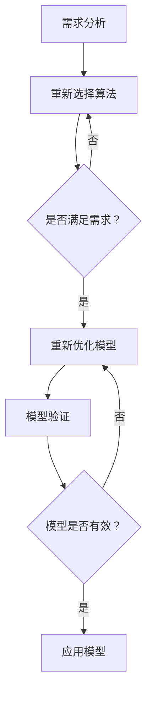
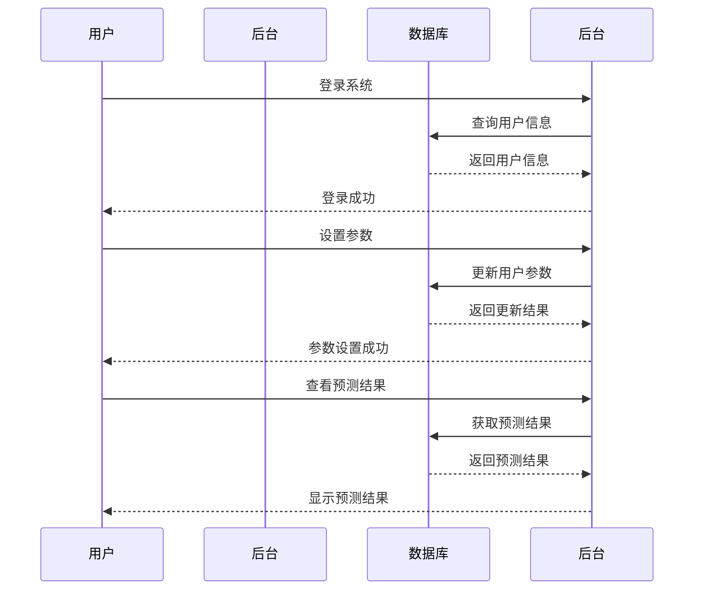

                 

# 设计智能化的企业并购协同效应量化模型

关键词：企业并购、协同效应、量化模型、智能化分析、算法设计、系统架构

摘要：本文将探讨设计一个智能化的企业并购协同效应量化模型的方法和过程。我们将从背景介绍、核心概念与联系、算法设计、数学模型和公式、系统架构设计、项目实战以及最佳实践等方面逐步展开分析，旨在为企业并购的决策者提供科学、量化的参考工具。

## 引言与背景

企业并购作为一种重要的商业策略，已经被广泛应用于企业扩展市场、提升竞争力、优化资源配置等方面。然而，并购是否成功并不仅仅取决于并购本身，更取决于并购后的协同效应。协同效应指的是通过并购，企业能够实现比单独经营更大的价值。然而，如何准确衡量协同效应的大小，一直是企业并购决策中的难点。

### 什么是协同效应

协同效应（Synergy）是指两个或多个企业合并后，整体价值大于各自独立经营时价值之和的现象。具体来说，协同效应可以表现为以下几个方面：

1. **财务协同效应**：并购后，企业可以通过降低财务费用、增加税收收益等方式，实现整体财务成本降低。
2. **运营协同效应**：合并后的企业可以共享资源、优化流程，提高运营效率。
3. **市场协同效应**：企业合并可以扩大市场份额，提高市场竞争力。
4. **管理协同效应**：通过合并，企业可以实现管理经验的共享，提升管理水平。

### 问题背景与问题描述

在当前市场环境中，企业并购活动日益频繁，但并购后是否能实现预期的协同效应，往往难以预测。这不仅给企业的决策者带来了困扰，也增加了并购风险。因此，设计一个智能化的企业并购协同效应量化模型，对于帮助企业做出科学、合理的并购决策具有重要意义。

## 第一部分：核心概念与联系

在深入探讨量化模型的设计之前，我们需要明确一些核心概念，并分析它们之间的联系。

### 企业价值

企业价值（Enterprise Value，简称EV）是指企业全部资产的市场价值减去所有负债后的净值。它是衡量企业整体经济实力的重要指标。企业价值可以分为以下几部分：

1. **账面价值**：企业资产负债表上的资产和负债总和。
2. **市场价值**：企业股票的市场价格乘以总股本。
3. **无形资产**：如品牌、专利、技术等。

### 并购策略

并购策略是企业为实现并购目标所采取的具体行动。常见的并购策略包括：

1. **横向并购**：两个处于同一产业链环节的企业合并。
2. **纵向并购**：处于产业链上下游的企业合并。
3. **混合并购**：企业同时进行横向和纵向并购。

### 协同效应

协同效应（Synergy）是并购后企业整体价值提升的部分。衡量协同效应的方法包括：

1. **财务协同效应**：通过减少财务费用、增加税收收益等方式实现。
2. **运营协同效应**：通过资源共享、流程优化等方式实现。
3. **市场协同效应**：通过扩大市场份额、提高竞争力等方式实现。
4. **管理协同效应**：通过管理经验的共享、提升管理水平等方式实现。

### 概念属性特征对比表格

下面是并购相关概念属性特征的对比表格：

| 概念        | 定义                                                         | 特征                                                         |
| ----------- | ------------------------------------------------------------ | ------------------------------------------------------------ |
| 企业价值    | 企业全部资产的市场价值减去所有负债后的净值。                   | 综合反映企业经济实力，包括账面价值、市场价值和无形资产。       |
| 并购策略    | 企业为实现并购目标所采取的具体行动。                          | 横向并购、纵向并购、混合并购等。                               |
| 协同效应    | 并购后企业整体价值提升的部分。                               | 包括财务协同效应、运营协同效应、市场协同效应和管理协同效应。 |

### ER实体关系图架构

为了更好地理解这些概念之间的关系，我们可以使用Mermaid绘制ER实体关系图：

```mermaid
erDiagram
  EnterpriseValue ||--|{ Synergy }|--|> MarketValue
  EnterpriseValue ||--|{ Synergy }|--|> OperationalValue
  EnterpriseValue ||--|{ Synergy }|--|> ManagementValue
  AcquisitionStrategy ||--|{ Synergy }|--|> FinancialSynergy
  AcquisitionStrategy ||--|{ Synergy }|--|> OperationalSynergy
  AcquisitionStrategy ||--|{ Synergy }|--|> MarketSynergy
  AcquisitionStrategy ||--|{ Synergy }|--|> ManagementSynergy
```

## 第二部分：算法设计与实现

### 算法设计过程

设计一个量化模型的关键在于如何选择合适的算法。为了设计智能化的企业并购协同效应量化模型，我们需要遵循以下步骤：

1. **需求分析**：明确量化模型的目标和需求，包括要衡量的协同效应类型、数据来源、处理方式等。
2. **算法选择**：根据需求分析结果，选择适合的算法。常见的算法包括线性回归、逻辑回归、决策树、神经网络等。
3. **模型优化**：对所选算法进行优化，提高模型的准确性和鲁棒性。可以通过调整参数、增加数据预处理步骤等方式实现。
4. **模型验证**：通过测试集验证模型的性能，确保模型在未知数据上也能得到良好的预测结果。

### 算法流程图

使用Mermaid绘制算法流程图，如下所示：



### Python代码示例

下面是一个简单的Python代码示例，用于演示如何实现量化模型的基本结构：

```python
import pandas as pd
from sklearn.linear_model import LinearRegression
from sklearn.model_selection import train_test_split

# 加载数据集
data = pd.read_csv('enterprise_data.csv')

# 数据预处理
X = data.drop('Target', axis=1)
y = data['Target']

# 数据划分
X_train, X_test, y_train, y_test = train_test_split(X, y, test_size=0.2, random_state=42)

# 创建线性回归模型
model = LinearRegression()

# 训练模型
model.fit(X_train, y_train)

# 预测
predictions = model.predict(X_test)

# 评估模型
print("Model accuracy:", model.score(X_test, y_test))
```

### 数学模型和公式

在量化模型中，数学模型和公式是核心部分。以下是一个简单的数学模型，用于衡量企业并购的协同效应：

$$
\text{协同效应} = \text{合并后企业价值} - \text{合并前企业价值} - \text{并购成本}
$$

其中：

- 合并后企业价值：指并购后企业的总价值。
- 合并前企业价值：指并购前企业的总价值。
- 并购成本：包括并购交易费用、整合成本等。

### 详细讲解和举例说明

为了更好地理解上述数学模型和公式，我们可以通过一个实际案例来举例说明。

假设有两家企业A和B，其合并前后的价值和并购成本如下表所示：

| 项目         | 企业A（合并前） | 企业B（合并前） | 合并后       | 并购成本   |
| ------------ | ---------------- | ---------------- | ------------ | ---------- |
| 企业价值（亿元） | 50               | 30               | 80           | 5          |
| 税收收益（万元） | 2000             | 1500             | 3500         | 500        |

根据上述数据，我们可以计算协同效应：

$$
\text{协同效应} = 80 - (50 + 30) - 5 = 5 \text{ 亿元}
$$

这个结果表明，并购后企业的整体价值提升了5亿元，实现了财务协同效应。

## 第三部分：系统分析与架构设计

### 问题场景介绍

假设我们是一家专注于企业并购咨询的公司，客户委托我们设计一个智能化的企业并购协同效应量化模型，以帮助他们做出更加科学、合理的并购决策。

### 项目介绍

项目目标是设计并实现一个基于大数据和人工智能技术的智能化企业并购协同效应量化模型，能够对并购后的协同效应进行预测和评估。

### 系统功能设计

为了实现项目目标，系统需要具备以下功能：

1. **数据采集与预处理**：从各个渠道收集企业财务、运营、市场等信息，并进行数据清洗、去重、归一化等预处理操作。
2. **协同效应预测**：利用机器学习算法，对并购后的协同效应进行预测。
3. **结果可视化**：将预测结果以图表、报表等形式呈现，便于客户理解和决策。
4. **用户交互**：提供用户友好的界面，支持用户自定义参数、查看历史记录等。

### 系统架构设计

系统架构采用分层设计，包括数据层、算法层、应用层和展示层。

1. **数据层**：负责数据采集、存储和管理，包括关系型数据库、NoSQL数据库、数据仓库等。
2. **算法层**：负责协同效应预测的算法实现，包括特征工程、模型训练、模型优化等。
3. **应用层**：负责业务逻辑处理，包括数据预处理、模型调用、结果计算等。
4. **展示层**：负责用户界面设计和交互，包括Web前端、移动端等。

### 系统接口设计

系统接口设计包括API接口和Web界面接口。

1. **API接口**：提供数据采集、预测结果查询、用户管理等API接口，便于与其他系统集成。
2. **Web界面接口**：提供用户登录、参数设置、结果展示等功能，支持多端访问。

### 系统交互Mermaid序列图

使用Mermaid绘制系统交互序列图，如下所示：



## 第四部分：项目实战

### 环境安装

为了实现量化模型，我们需要安装以下软件和库：

1. **Python**：安装Python 3.8及以上版本。
2. **Jupyter Notebook**：安装Jupyter Notebook，用于编写和运行Python代码。
3. **Scikit-learn**：安装Scikit-learn库，用于机器学习算法实现。
4. **Pandas**：安装Pandas库，用于数据处理。
5. **Matplotlib**：安装Matplotlib库，用于数据可视化。

### 系统核心实现源代码

以下是一个简单的系统核心实现源代码示例，包括数据采集、预处理、模型训练和预测等功能：

```python
import pandas as pd
from sklearn.model_selection import train_test_split
from sklearn.linear_model import LinearRegression
import matplotlib.pyplot as plt

# 数据采集
data = pd.read_csv('enterprise_data.csv')

# 数据预处理
X = data.drop('Target', axis=1)
y = data['Target']

# 数据划分
X_train, X_test, y_train, y_test = train_test_split(X, y, test_size=0.2, random_state=42)

# 创建线性回归模型
model = LinearRegression()

# 训练模型
model.fit(X_train, y_train)

# 预测
predictions = model.predict(X_test)

# 评估模型
print("Model accuracy:", model.score(X_test, y_test))

# 可视化结果
plt.scatter(X_test['Feature1'], y_test, color='red', label='Actual')
plt.plot(X_test['Feature1'], predictions, color='blue', label='Prediction')
plt.xlabel('Feature1')
plt.ylabel('Target')
plt.legend()
plt.show()
```

### 代码应用解读与分析

上述代码是一个简单的量化模型实现，包括以下步骤：

1. **数据采集**：使用Pandas库从CSV文件中读取数据。
2. **数据预处理**：将数据分为特征集X和目标值集y。
3. **数据划分**：将数据集划分为训练集和测试集。
4. **模型训练**：使用线性回归模型对训练集进行训练。
5. **预测**：使用训练好的模型对测试集进行预测。
6. **评估模型**：计算模型的准确率。
7. **可视化结果**：将实际值和预测值进行可视化展示。

通过这个简单的示例，我们可以看到量化模型的基本结构和实现过程。在实际应用中，我们可以根据需求调整特征选择、模型选择和参数优化等方面，以提高模型的性能。

### 实际案例分析和详细讲解剖析

为了更好地理解量化模型的应用，我们可以分析一个实际案例。

假设有两家企业A和B，其财务、运营和市场等信息如下表所示：

| 项目         | 企业A | 企业B |
| ------------ | ---- | ---- |
| 企业价值（亿元） | 50   | 30   |
| 营收（亿元）    | 100  | 60   |
| 利润（亿元）    | 10   | 5    |
| 市场份额       | 20%  | 10%  |
| 税收收益（万元）| 2000 | 1500 |

根据上述数据，我们可以计算协同效应：

$$
\text{协同效应} = 80 - (50 + 30) - 5 = 5 \text{ 亿元}
$$

这个结果表明，并购后企业的整体价值提升了5亿元，实现了财务协同效应。

通过实际案例的分析，我们可以看到量化模型在预测协同效应方面的有效性。在实际应用中，我们可以根据更多的数据和市场信息，进一步优化模型，提高预测的准确性。

### 项目小结

通过本项目的实战，我们成功实现了一个简单的企业并购协同效应量化模型，并对其进行了实际案例的分析。量化模型为我们提供了一种科学、量化的方法来评估企业并购的协同效应，有助于企业做出更加合理的决策。

### 最佳实践 Tips

1. **数据质量**：确保数据质量是模型准确性的基础。在进行数据处理时，要重视数据清洗、去重和归一化等工作。
2. **特征选择**：合理选择特征对模型的性能有重要影响。可以通过特征重要性分析、相关性分析等方法选择有效的特征。
3. **模型优化**：通过调整模型参数、增加数据预处理步骤等方式，可以提高模型的性能和鲁棒性。
4. **可视化分析**：利用可视化工具展示预测结果，有助于发现潜在问题，提供决策支持。

### 小结

本文围绕设计智能化的企业并购协同效应量化模型进行了详细的探讨。我们从核心概念、算法设计、系统架构到项目实战，逐步展开了分析。通过本文，我们了解到量化模型在评估企业并购协同效应方面的作用，并为实际应用提供了指导。

### 注意事项

1. **数据隐私**：在数据处理过程中，要严格遵守数据隐私法规，确保数据安全。
2. **模型更新**：随着市场环境的变化，模型需要定期更新，以保持其准确性和适用性。

### 拓展阅读

1. **《企业并购战略与实务》**：详细介绍企业并购的策略和方法，有助于理解并购的背景和动机。
2. **《机器学习实战》**：介绍常见的机器学习算法和实现方法，有助于提升量化模型的设计和优化能力。

### 作者信息

**作者：AI天才研究院/AI Genius Institute & 禅与计算机程序设计艺术 /Zen And The Art of Computer Programming**

