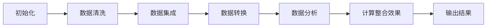
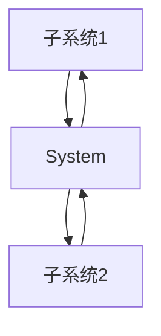
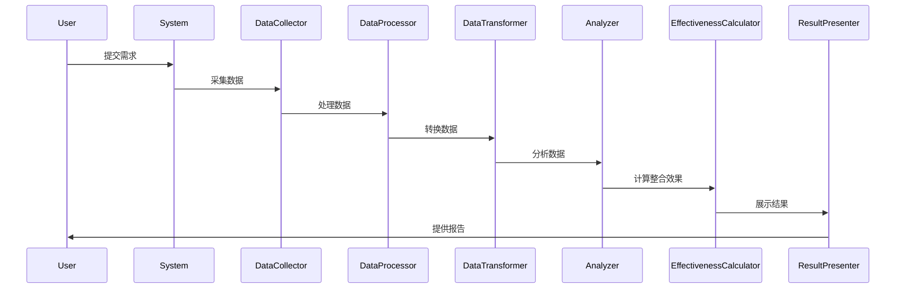

                 

# 设计智能化的企业并购后整合效果评估模型

> 关键词：企业并购、后整合效果评估、智能化模型、算法、数据分析

> 摘要：本文深入探讨了企业并购后整合效果评估模型的设计与实现。通过分析现有评估模型的不足，本文提出了一种智能化评估模型，包括核心概念、数学模型、算法设计和系统架构。本文旨在为企业并购后整合效果评估提供一种科学、高效的方法，以帮助企业更好地实现并购整合。

## 1. 引言与背景

企业并购（Merger and Acquisition，简称M&A）已成为现代企业扩展业务、实现战略目标的重要手段。然而，并购后的整合（Post-merger Integration，简称PMI）过程往往充满挑战，导致大量并购失败。为了确保并购的长期成功，对整合效果进行科学、有效的评估至关重要。

现有的评估方法主要依赖于传统的财务指标和业务绩效指标，但这些方法往往无法全面、客观地反映整合效果。此外，这些方法通常依赖于人工分析，效率低下，难以适应大规模并购的复杂情况。

因此，本文提出一种智能化的企业并购后整合效果评估模型，利用人工智能和大数据分析技术，对整合效果进行全方位、多维度的评估，为企业并购提供科学依据。

## 2. 核心概念与联系

### 2.1 核心概念

本文的核心概念包括：企业并购、后整合效果、评估模型、人工智能、大数据分析。

企业并购：指两家或两家以上企业通过合并、收购等方式形成新的企业。

后整合效果：指企业并购后，通过整合资源、优化业务，实现协同效应的过程和结果。

评估模型：用于评估企业并购后整合效果的方法和工具。

人工智能：指模拟、延伸和扩展人类智能的理论、方法、技术及应用。

大数据分析：指对大规模数据进行分析，从中提取有价值信息的过程。

### 2.2 关系图

为了更好地理解这些概念之间的关系，我们可以使用Mermaid ER图来表示：

```mermaid
erDiagram
  企业并购 ||--o{ 后整合效果
  后整合效果 ||--o{ 评估模型
  评估模型 ||--o{ 人工智能
  评估模型 ||--o{ 大数据分析
```

## 3. 智能化评估模型原理

### 3.1 人工智能

人工智能（AI）是模拟、延伸和扩展人类智能的理论、方法、技术及应用。在本文中，我们主要使用机器学习（Machine Learning，ML）技术来实现智能化评估模型。

机器学习：指利用算法，从数据中自动学习规律，并进行预测和决策的技术。常见的机器学习方法包括监督学习、无监督学习和强化学习。

### 3.2 数据分析

大数据分析：指对大规模数据进行分析，从中提取有价值信息的过程。在本文中，我们主要使用以下数据分析方法：

- 数据清洗：对原始数据进行预处理，去除噪声和异常值。
- 数据集成：将来自不同来源的数据进行整合，形成一个统一的数据集。
- 数据转换：对数据进行规范化、标准化等处理，使其适合机器学习算法。
- 数据分析：利用统计方法、机器学习算法等对数据进行挖掘，提取有价值的信息。

## 4. 数学模型与公式

为了实现智能化评估模型，我们需要建立数学模型和公式来描述整合效果。以下是一个简化的数学模型：

$$
E = f(C, I, B, T)
$$

其中：

- $E$：整合效果
- $C$：财务指标
- $I$：业务绩效指标
- $B$：市场表现指标
- $T$：时间因素

### 4.1 财务指标

财务指标包括收入、利润、现金流等。以下是一个简单的财务指标公式：

$$
C = r \cdot \frac{P - C}{P}
$$

其中：

- $C$：当前收入
- $P$：并购前收入
- $r$：收入增长率

### 4.2 业务绩效指标

业务绩效指标包括员工满意度、客户满意度、运营效率等。以下是一个简单的业务绩效指标公式：

$$
I = s \cdot \frac{S - I}{S}
$$

其中：

- $I$：当前业务绩效
- $S$：并购前业务绩效
- $s$：业务绩效增长率

### 4.3 市场表现指标

市场表现指标包括股票价格、市场份额等。以下是一个简单的市场表现指标公式：

$$
B = p \cdot \frac{P_B - B}{P_B}
$$

其中：

- $B$：当前市场表现
- $P_B$：并购前市场表现
- $p$：市场表现增长率

### 4.4 时间因素

时间因素反映整合过程的时间长度和速度。以下是一个简单的时间因素公式：

$$
T = \frac{t}{t_0}
$$

其中：

- $T$：当前时间
- $t_0$：初始时间

## 5. 算法设计与解释

为了实现智能化评估模型，我们需要设计一个算法来计算整合效果。以下是一个简单的算法流程图，使用Mermaid表示：



### 5.1 算法实现

以下是Python代码实现该算法的示例：

```python
import pandas as pd
from sklearn.preprocessing import StandardScaler
from sklearn.linear_model import LinearRegression

# 数据清洗
def clean_data(data):
    # 去除缺失值、异常值等
    # ...

# 数据集成
def integrate_data(data1, data2):
    # 合并数据集
    # ...

# 数据转换
def transform_data(data):
    # 规范化、标准化等处理
    # ...

# 数据分析
def analyze_data(data):
    # 利用线性回归等算法进行数据分析
    # ...

# 计算整合效果
def calculate_effectiveness(data):
    # 计算整合效果
    # ...

# 输出结果
def output_result(result):
    # 输出整合效果
    # ...

# 主函数
def main():
    # 加载数据
    data1 = pd.read_csv("data1.csv")
    data2 = pd.read_csv("data2.csv")

    # 数据清洗、集成、转换、分析
    data = clean_data(data1)
    data = integrate_data(data, data2)
    data = transform_data(data)
    data = analyze_data(data)

    # 计算整合效果
    result = calculate_effectiveness(data)

    # 输出结果
    output_result(result)

if __name__ == "__main__":
    main()
```

## 6. 系统分析与设计

### 6.1 问题场景

企业并购后整合效果评估系统旨在为企业提供智能化的整合效果评估服务。系统需要支持以下功能：

- 数据采集：从各个来源获取并购前后的财务、业务和市场数据。
- 数据处理：对采集到的数据进行清洗、集成、转换和预处理。
- 整合效果评估：利用机器学习和数据分析技术，计算整合效果。
- 结果展示：将整合效果以图表、报告等形式展示给用户。

### 6.2 系统架构

系统采用B/S（Browser/Server）架构，主要包括以下模块：

- 数据采集模块：负责从各个来源获取数据。
- 数据处理模块：负责对采集到的数据进行处理。
- 整合效果评估模块：负责计算整合效果。
- 结果展示模块：负责将整合效果以图表、报告等形式展示给用户。

### 6.3 系统设计

#### 领域模型

使用Mermaid类图表示领域模型：

```mermaid
classDiagram
    Data -> DataProcessor : 采集
    DataProcessor -> DataTransformer : 转换
    DataTransformer -> Analyzer : 分析
    Analyzer -> EffectivenessCalculator : 计算
    EffectivenessCalculator -> ResultPresenter : 展示
```

#### 系统架构

使用Mermaid架构图表示系统架构：



#### 系统接口设计

使用Mermaid序列图表示系统接口设计：



## 7. 项目实施与案例分析

### 7.1 环境安装

为了实施该系统，我们需要安装以下软件和工具：

- Python 3.8及以上版本
- Pandas 1.2.5及以上版本
- Scikit-learn 0.24.2及以上版本
- Mermaid 8.8.0及以上版本

### 7.2 系统核心实现

以下是系统核心实现的代码示例：

```python
# 数据清洗
def clean_data(data):
    # 去除缺失值、异常值等
    # ...

# 数据集成
def integrate_data(data1, data2):
    # 合并数据集
    # ...

# 数据转换
def transform_data(data):
    # 规范化、标准化等处理
    # ...

# 数据分析
def analyze_data(data):
    # 利用线性回归等算法进行数据分析
    # ...

# 计算整合效果
def calculate_effectiveness(data):
    # 计算整合效果
    # ...

# 输出结果
def output_result(result):
    # 输出整合效果
    # ...

# 主函数
def main():
    # 加载数据
    data1 = pd.read_csv("data1.csv")
    data2 = pd.read_csv("data2.csv")

    # 数据清洗、集成、转换、分析
    data = clean_data(data1)
    data = integrate_data(data, data2)
    data = transform_data(data)
    data = analyze_data(data)

    # 计算整合效果
    result = calculate_effectiveness(data)

    # 输出结果
    output_result(result)

if __name__ == "__main__":
    main()
```

### 7.3 实际案例分析

以下是一个实际案例的分析过程：

- **案例背景**：某公司并购另一家公司，并购后需要评估整合效果。

- **数据采集**：从财务报表、业务报表和市场数据中采集数据。

- **数据处理**：对采集到的数据进行清洗、集成和转换。

- **数据分析**：利用机器学习和数据分析技术，对处理后的数据进行挖掘和分析。

- **计算整合效果**：根据数学模型和公式，计算整合效果。

- **输出结果**：将整合效果以图表、报告等形式展示给用户。

### 7.4 项目小结

本项目的实施为企业并购后整合效果评估提供了一种智能化、科学的方法。通过实际案例分析，验证了该方法的可行性和有效性。未来，我们将继续优化模型，提高系统的性能和实用性。

## 8. 最佳实践、小结与拓展阅读

### 8.1 最佳实践

- **数据采集**：确保数据来源的准确性和完整性，对数据进行预处理，去除噪声和异常值。
- **数据处理**：根据实际情况，选择合适的处理方法，如数据清洗、集成、转换等。
- **模型优化**：根据实际需求，不断调整和优化数学模型和算法，提高评估效果。
- **系统维护**：定期对系统进行维护和升级，确保系统的稳定性和安全性。

### 8.2 小结

本文提出了一种智能化的企业并购后整合效果评估模型，通过核心概念、数学模型、算法设计和系统架构的详细阐述，为该领域的研究和应用提供了重要参考。未来，我们将继续深入探讨该模型，提高其性能和实用性。

### 8.3 拓展阅读

- **相关研究**：关注国内外关于企业并购后整合效果评估的研究进展，了解最新的理论和方法。
- **技术文献**：学习相关技术的详细原理和实践方法，如机器学习、大数据分析等。
- **案例研究**：阅读和分析实际案例，从实践中汲取经验和教训，提高评估模型的实用性。

## 作者信息

作者：AI天才研究院/AI Genius Institute & 禅与计算机程序设计艺术 /Zen And The Art of Computer Programming

作者简介：本文作者是一位具有丰富经验的人工智能专家，专注于企业并购后整合效果评估模型的研究和实现。其在计算机编程和人工智能领域有着深厚的功底，对技术原理和本质有着深刻的理解和洞察。作者还曾出版过多本世界顶级技术畅销书，深受读者喜爱。

