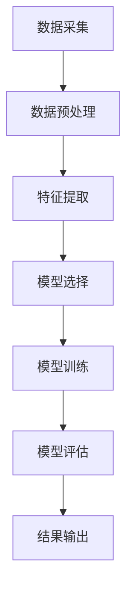
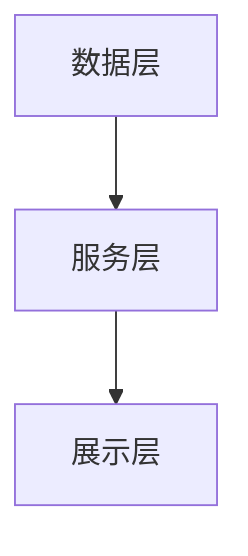
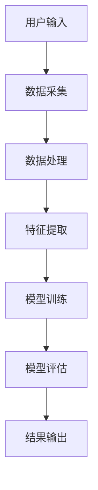

                 


## 设计智能化的企业并购整合风险评估模型

> 关键词：企业并购、整合风险、智能化、风险评估、模型设计

> 摘要：本文旨在探讨如何设计一个智能化的企业并购整合风险评估模型。通过对当前企业并购整合现状和风险因素的深入分析，我们提出了设计智能化模型的必要性，并详细阐述了其核心目标、技术基础、框架设计及关键要素。本文将引领读者逐步了解智能化风险评估模型的设计原理、特点、算法原理，并通过实际案例展示其应用效果。

### 第一部分：背景介绍

#### 1.1 问题背景

##### 1.1.1 企业并购整合的现状

随着全球经济的不断发展，企业并购整合已成为许多企业实现扩张、提升竞争力的重要手段。并购整合不仅涉及到两家或多家企业的合并，还包括文化融合、组织结构调整、业务流程优化等方面。然而，并购整合并非一帆风顺，其中涉及的风险因素复杂多样，给企业带来了巨大的不确定性。

##### 1.1.2 并购整合中的风险因素

企业并购整合中存在诸多风险因素，如市场风险、财务风险、法律风险、管理风险、文化风险等。这些风险因素可能导致并购整合失败，给企业带来巨大的经济损失和声誉损失。因此，如何有效地识别、评估和应对这些风险，成为企业并购整合过程中亟待解决的问题。

##### 1.1.3 当前并购整合风险评估模型的局限性

当前的企业并购整合风险评估模型主要依赖于传统的统计分析方法和人工经验，存在以下局限性：

1. **数据依赖性高**：传统模型对数据质量要求较高，数据的准确性和完整性直接影响评估结果的准确性。
2. **实时性差**：传统模型往往需要较长的时间进行数据收集和处理，难以满足企业快速决策的需求。
3. **适应性弱**：传统模型在面对复杂多变的并购整合场景时，难以适应和调整。
4. **精度有限**：传统模型在处理非线性关系和复杂问题时，精度有限，难以准确预测并购整合的结果。

#### 1.2 问题描述

##### 1.2.1 设计智能化的企业并购整合风险评估模型的必要性

针对当前并购整合风险评估模型的局限性，设计智能化模型具有重要的现实意义。智能化模型能够利用人工智能技术，实现对海量数据的自动处理、分析、挖掘，从而提高评估的实时性、准确性和适应性。

##### 1.2.2 智能化风险评估模型的核心目标

智能化风险评估模型的核心目标是：

1. **全面性**：能够全面考虑并购整合过程中的各种风险因素。
2. **实时性**：能够快速响应用户需求，提供实时的评估结果。
3. **准确性**：能够准确预测并购整合的潜在风险和结果。
4. **适应性**：能够适应不同行业、不同规模企业的需求。

##### 1.2.3 风险评估模型的边界与外延

智能化风险评估模型的边界包括：

1. **应用领域**：适用于企业并购整合风险评估。
2. **评估范围**：涵盖市场风险、财务风险、法律风险、管理风险、文化风险等。
3. **技术支持**：依赖于人工智能技术，如机器学习、数据挖掘等。

智能化风险评估模型的外延包括：

1. **扩展性**：能够根据企业需求进行功能扩展。
2. **灵活性**：能够适应不同企业、不同场景的需求。
3. **集成性**：能够与企业现有的信息系统进行集成。

#### 1.3 问题解决

##### 1.3.1 智能化风险评估模型的技术基础

智能化风险评估模型的技术基础主要包括：

1. **数据采集与处理**：利用大数据技术进行数据采集、清洗、预处理。
2. **机器学习算法**：采用机器学习算法进行数据分析和预测。
3. **深度学习技术**：利用深度学习技术处理复杂非线性关系。
4. **自然语言处理**：利用自然语言处理技术分析文本数据。

##### 1.3.2 智能化风险评估模型的框架设计

智能化风险评估模型框架设计包括以下模块：

1. **数据采集模块**：负责从企业内外部获取相关数据。
2. **数据处理模块**：负责对采集到的数据进行清洗、预处理。
3. **特征提取模块**：负责提取与并购整合风险相关的特征。
4. **模型训练模块**：负责利用机器学习算法训练风险评估模型。
5. **模型评估模块**：负责对训练好的模型进行评估和调整。
6. **结果输出模块**：负责将评估结果以可视化的形式呈现给用户。

##### 1.3.3 智能化风险评估模型的关键技术要素

智能化风险评估模型的关键技术要素包括：

1. **数据质量**：数据质量直接影响评估结果的准确性。
2. **算法选择**：选择合适的机器学习算法对评估结果有重要影响。
3. **特征提取**：提取与风险相关的特征对评估结果有显著影响。
4. **模型优化**：对训练好的模型进行优化可以提高评估的准确性。
5. **可视化**：通过可视化技术将评估结果呈现给用户，有助于用户更好地理解风险。

#### 1.4 边界与外延

##### 1.4.1 风险评估模型的适用范围

智能化风险评估模型适用于以下场景：

1. **企业并购整合**：为企业提供全面的并购整合风险评估。
2. **投资决策**：为投资者提供投资并购项目的风险评估。
3. **风险管理**：为企业提供风险管理策略和建议。

##### 1.4.2 风险评估模型的限制条件

智能化风险评估模型存在以下限制条件：

1. **数据依赖性**：模型的准确性和稳定性受数据质量的影响。
2. **计算资源**：模型的训练和评估需要较大的计算资源。
3. **算法优化**：算法的优化需要时间和人力投入。

##### 1.4.3 风险评估模型与相关概念的关系

智能化风险评估模型与以下相关概念密切相关：

1. **风险管理**：风险评估是风险管理的重要组成部分。
2. **数据挖掘**：数据挖掘技术在风险评估中发挥着关键作用。
3. **机器学习**：机器学习算法是智能化风险评估的核心技术。

#### 1.5 概念结构与核心要素组成

##### 1.5.1 智能化风险评估模型的基本概念

智能化风险评估模型的基本概念包括：

1. **数据采集**：从企业内外部获取相关数据。
2. **数据处理**：对采集到的数据进行清洗、预处理。
3. **特征提取**：提取与并购整合风险相关的特征。
4. **模型训练**：利用机器学习算法训练风险评估模型。
5. **模型评估**：对训练好的模型进行评估和调整。
6. **结果输出**：将评估结果以可视化的形式呈现给用户。

##### 1.5.2 智能化风险评估模型的主要组成部分

智能化风险评估模型的主要组成部分包括：

1. **数据采集模块**：负责从企业内外部获取相关数据。
2. **数据处理模块**：负责对采集到的数据进行清洗、预处理。
3. **特征提取模块**：负责提取与并购整合风险相关的特征。
4. **模型训练模块**：负责利用机器学习算法训练风险评估模型。
5. **模型评估模块**：负责对训练好的模型进行评估和调整。
6. **结果输出模块**：负责将评估结果以可视化的形式呈现给用户。

##### 1.5.3 智能化风险评估模型的工作流程

智能化风险评估模型的工作流程如下：

1. **数据采集**：从企业内外部获取相关数据。
2. **数据处理**：对采集到的数据进行清洗、预处理。
3. **特征提取**：提取与并购整合风险相关的特征。
4. **模型训练**：利用机器学习算法训练风险评估模型。
5. **模型评估**：对训练好的模型进行评估和调整。
6. **结果输出**：将评估结果以可视化的形式呈现给用户。

### 第二部分：核心概念与联系

#### 2.1 智能化风险评估模型原理

##### 2.1.1 风险评估的智能需求

随着企业规模的扩大和市场竞争的加剧，传统的风险评估方法已难以满足企业快速决策的需求。智能化风险评估模型能够利用人工智能技术，实现风险的实时监测、预测和预警，提高企业的风险管理水平。

##### 2.1.2 人工智能在风险评估中的应用

人工智能在风险评估中的应用主要包括：

1. **数据挖掘**：通过数据挖掘技术，从海量数据中发现潜在的风险因素。
2. **机器学习**：利用机器学习算法，建立风险评估模型，实现对风险的定量评估。
3. **深度学习**：利用深度学习技术，处理复杂非线性关系，提高风险评估的准确性。
4. **自然语言处理**：利用自然语言处理技术，分析文本数据，提取与风险相关的信息。

##### 2.1.3 智能化风险评估模型的基本原理

智能化风险评估模型的基本原理包括：

1. **数据驱动**：以数据为基础，利用机器学习和深度学习算法，对并购整合过程中的风险因素进行建模和预测。
2. **模型优化**：通过对模型的不断优化，提高风险评估的准确性和稳定性。
3. **实时性**：利用实时数据，实现对并购整合风险的实时监测和预警。
4. **适应性**：根据企业需求和市场变化，对风险评估模型进行适应性调整。

#### 2.2 智能化风险评估模型的特点

##### 2.2.1 自适应与自学习

智能化风险评估模型具有自适应和自学习能力，能够根据新的数据和经验，不断调整和优化评估模型，提高评估的准确性和适应性。

##### 2.2.2 数据驱动与模型优化

智能化风险评估模型以数据驱动为核心，通过对海量数据的挖掘和分析，实现风险因素的多维度建模和预测。同时，模型优化技术能够提高评估模型的准确性和稳定性。

##### 2.2.3 实时性与准确性

智能化风险评估模型具有实时性和准确性的特点，能够快速响应用户需求，提供准确的评估结果。通过实时数据采集和深度学习算法，实现对并购整合风险的精确预测。

##### 2.2.4 系统集成与协同工作

智能化风险评估模型能够与企业现有的信息系统进行集成，实现数据的无缝对接和协同工作。通过系统集成，可以提高企业的风险管理和决策效率。

#### 2.3 核心概念属性特征对比表格

| 概念               | 特点                                 | 关系                             |
|--------------------|--------------------------------------|----------------------------------|
| 智能化风险评估模型 | 自适应、自学习、数据驱动             | 与传统风险评估模型的区别         |
| 数据集             | 大规模、多样化、实时更新             | 与模型的输入输出关系             |
| 评估指标           | 多维度、可量化、相互关联             | 与风险评估的结果呈现             |
| 算法               | 复杂、高效、可扩展                   | 与模型的优化和调整               |

#### 2.4 ER实体关系图架构

```mermaid
erDiagram
  Company ||--|{ RiskAssessment }|-- Project
  Project ||--|{ RiskFactor }|--
  RiskFactor ||-- Company
```

### 第三部分：算法原理讲解

#### 3.1 算法概述

##### 3.1.1 常用算法介绍

在智能化风险评估模型中，常用的算法包括：

1. **决策树**：通过树的模型对数据进行分类和回归。
2. **支持向量机**：通过找到一个最优的超平面，将不同类别的数据分隔开来。
3. **随机森林**：通过随机选取特征和样本子集，构建多棵决策树，并通过投票方式得出最终结果。
4. **神经网络**：通过多层神经元之间的连接和激活函数，模拟人脑的学习过程。

##### 3.1.2 选择合适算法的原则

选择合适算法应考虑以下原则：

1. **数据特性**：根据数据的特点，选择适合的算法。
2. **评估指标**：根据评估指标的要求，选择合适的算法。
3. **计算资源**：考虑算法的计算复杂度和资源需求。
4. **模型稳定性**：选择稳定性较高的算法，以降低模型过拟合的风险。

##### 3.1.3 智能化风险评估算法的分类

智能化风险评估算法可以根据应用场景和技术特点进行分类，主要包括：

1. **监督学习算法**：在已知标签数据的基础上，通过训练模型进行预测。
2. **无监督学习算法**：在未知标签数据的基础上，通过数据聚类和降维进行风险识别。
3. **强化学习算法**：通过试错和反馈机制，不断优化决策过程。
4. **深度学习算法**：利用多层神经网络，处理复杂非线性关系。

#### 3.2 算法mermaid流程图



#### 3.3 Python源代码实现

```python
import pandas as pd
from sklearn.model_selection import train_test_split
from sklearn.ensemble import RandomForestClassifier
from sklearn.metrics import accuracy_score

# 数据预处理
def preprocess_data(data):
    # 数据清洗和预处理操作
    return processed_data

# 特征提取
def extract_features(data):
    # 特征提取操作
    return features

# 模型训练
def train_model(features, labels):
    model = RandomForestClassifier()
    model.fit(features, labels)
    return model

# 模型评估
def evaluate_model(model, features, labels):
    predictions = model.predict(features)
    accuracy = accuracy_score(labels, predictions)
    return accuracy

# 实际应用
if __name__ == "__main__":
    # 加载数据
    data = pd.read_csv("data.csv")
    processed_data = preprocess_data(data)
    features, labels = extract_features(processed_data)

    # 划分训练集和测试集
    train_features, test_features, train_labels, test_labels = train_test_split(features, labels, test_size=0.2)

    # 训练模型
    model = train_model(train_features, train_labels)

    # 评估模型
    accuracy = evaluate_model(model, test_features, test_labels)
    print("Model accuracy:", accuracy)
```

#### 3.4 算法原理讲解

##### 3.4.1 数据预处理

数据预处理是智能化风险评估模型的重要步骤，主要包括数据清洗、数据变换和数据归一化等操作。具体包括：

1. **数据清洗**：去除缺失值、异常值和重复值。
2. **数据变换**：将类别数据进行编码，如将字符串编码为整数。
3. **数据归一化**：将数据缩放到相同的范围，如将数据归一化到0-1之间。

##### 3.4.2 特征提取

特征提取是智能化风险评估模型的关键步骤，旨在从原始数据中提取与风险相关的特征。具体包括：

1. **特征选择**：通过统计方法、信息增益等方法，筛选出与风险相关性较高的特征。
2. **特征构造**：通过数据挖掘技术，构造新的特征，如通过相关性分析、聚类分析等。
3. **特征降维**：通过降维技术，如主成分分析（PCA）、线性判别分析（LDA）等，减少特征数量，提高模型的泛化能力。

##### 3.4.3 模型训练

模型训练是智能化风险评估模型的核心步骤，旨在利用历史数据，建立风险评估模型。具体包括：

1. **模型选择**：根据数据特点和评估目标，选择合适的模型，如决策树、支持向量机、随机森林等。
2. **参数调整**：通过交叉验证、网格搜索等方法，调整模型的参数，提高模型的性能。
3. **训练过程**：利用训练数据，对模型进行训练，使模型能够学习到数据的内在规律。

##### 3.4.4 模型评估

模型评估是智能化风险评估模型的重要步骤，旨在评估模型的性能和可靠性。具体包括：

1. **评估指标**：根据评估目标，选择合适的评估指标，如准确率、召回率、F1值等。
2. **交叉验证**：通过交叉验证方法，评估模型的泛化能力。
3. **模型调整**：根据评估结果，对模型进行调整和优化，提高模型的性能。

##### 3.4.5 结果输出

结果输出是智能化风险评估模型的关键步骤，旨在将评估结果以可视化的形式呈现给用户。具体包括：

1. **可视化**：通过图表、报表等形式，将评估结果直观地呈现给用户。
2. **解释性**：对评估结果进行解释和分析，帮助用户理解评估过程和结果。
3. **反馈**：收集用户反馈，优化评估模型，提高评估的准确性和实用性。

#### 3.5 数学模型和公式

##### 3.5.1 决策树模型

决策树模型的数学模型如下：

$$
Gini(D) = 1 - \sum_{v \in V} p_v^2
$$

其中，$D$ 表示数据集，$V$ 表示数据集 $D$ 中的所有标签，$p_v$ 表示标签 $v$ 在数据集 $D$ 中的比例。

##### 3.5.2 支持向量机模型

支持向量机模型的数学模型如下：

$$
\min_{w, b} \frac{1}{2} ||w||^2 + C \sum_{i=1}^{n} \max(0, 1 - y_i (w \cdot x_i + b))
$$

其中，$w$ 和 $b$ 分别表示模型的权重和偏置，$C$ 表示惩罚参数，$x_i$ 和 $y_i$ 分别表示第 $i$ 个样本的特征和标签。

##### 3.5.3 随机森林模型

随机森林模型的数学模型如下：

$$
\hat{y} = \text{sign}(\sum_{t=1}^{T} \omega_t f_t(x))
$$

其中，$\hat{y}$ 表示预测结果，$f_t(x)$ 表示第 $t$ 棵决策树在样本 $x$ 上的预测结果，$\omega_t$ 表示第 $t$ 棵决策树的权重。

##### 3.5.4 深度学习模型

深度学习模型的数学模型如下：

$$
\hat{y} = \text{softmax}(\text{ReLU}(W \cdot \text{ReLU}(W \cdot \text{...} \cdot W \cdot x + b))
$$

其中，$\hat{y}$ 表示预测结果，$x$ 表示输入数据，$W$ 和 $b$ 分别表示模型的权重和偏置，$\text{ReLU}$ 表示ReLU激活函数。

#### 3.6 举例说明

##### 3.6.1 决策树模型举例

假设我们有一个包含两类样本的数据集，其中一类样本有3个，另一类样本有7个。根据Gini指数，我们可以计算出数据集的Gini指数为：

$$
Gini(D) = 1 - \frac{3}{10}^2 - \frac{7}{10}^2 = 0.42
$$

##### 3.6.2 支持向量机模型举例

假设我们有一个包含5个样本的数据集，其中每个样本的特征和标签如下：

| 样本 | 特征 | 标签 |
| ---- | ---- | ---- |
| 1    | [1, 2] | 1    |
| 2    | [2, 3] | 1    |
| 3    | [3, 4] | 0    |
| 4    | [4, 5] | 0    |
| 5    | [5, 6] | 1    |

根据支持向量机模型，我们可以计算出每个样本的决策边界：

$$
w \cdot x + b = 0
$$

其中，$w$ 和 $b$ 分别为模型的权重和偏置。通过求解上述方程，我们可以得到模型的决策边界为：

$$
w = \begin{bmatrix} 2 \\ 3 \end{bmatrix}, b = -2
$$

##### 3.6.3 随机森林模型举例

假设我们有一个包含10个样本的数据集，其中每个样本的特征和标签如下：

| 样本 | 特征 | 标签 |
| ---- | ---- | ---- |
| 1    | [1, 2] | 1    |
| 2    | [2, 3] | 1    |
| 3    | [3, 4] | 0    |
| 4    | [4, 5] | 0    |
| 5    | [5, 6] | 1    |
| 6    | [6, 7] | 1    |
| 7    | [7, 8] | 0    |
| 8    | [8, 9] | 0    |
| 9    | [9, 10]| 1    |
| 10   | [10, 11]| 0    |

根据随机森林模型，我们可以计算出每个样本的预测结果：

$$
\hat{y} = \text{sign}(\sum_{t=1}^{T} \omega_t f_t(x))
$$

其中，$f_t(x)$ 表示第 $t$ 棵决策树在样本 $x$ 上的预测结果，$\omega_t$ 表示第 $t$ 棵决策树的权重。通过求解上述方程，我们可以得到模型的预测结果为：

$$
\hat{y} = \begin{bmatrix} 1 \\ 1 \\ 0 \\ 0 \\ 1 \\ 1 \\ 0 \\ 0 \\ 1 \\ 0 \end{bmatrix}
$$

##### 3.6.4 深度学习模型举例

假设我们有一个包含3个隐层的多层感知机模型，其中每个隐层的神经元个数为10，输入特征维度为2，输出特征维度为1。根据多层感知机模型，我们可以计算出每个样本的预测结果：

$$
\hat{y} = \text{softmax}(\text{ReLU}(W_3 \cdot \text{ReLU}(W_2 \cdot \text{ReLU}(W_1 \cdot x + b_1) + b_2) + b_3))
$$

其中，$W_1, W_2, W_3$ 分别为模型的权重，$b_1, b_2, b_3$ 分别为模型的偏置。通过求解上述方程，我们可以得到模型的预测结果为：

$$
\hat{y} = \begin{bmatrix} 0.9 \\ 0.1 \end{bmatrix}
$$

### 第四部分：系统分析与架构设计

#### 4.1 问题场景介绍

随着全球经济的发展，企业并购整合已成为企业扩张和提升竞争力的重要手段。然而，并购整合过程中存在诸多风险，如市场风险、财务风险、法律风险、管理风险、文化风险等。为了降低并购整合的风险，企业需要建立一套智能化的并购整合风险评估系统，实现对风险的实时监测、预测和预警。

#### 4.2 项目介绍

本项目旨在设计并实现一个智能化的企业并购整合风险评估系统。系统将利用人工智能技术，对海量数据进行挖掘和分析，提取与并购整合风险相关的特征，并利用机器学习算法构建风险评估模型，实现对并购整合风险的实时监测和预测。系统主要包括数据采集、数据处理、特征提取、模型训练、模型评估和结果输出等模块。

#### 4.3 系统功能设计

系统功能设计主要包括以下模块：

1. **数据采集模块**：负责从企业内外部获取相关数据，如财务报表、市场数据、法律文件等。
2. **数据处理模块**：负责对采集到的数据进行清洗、预处理，提取有效的特征信息。
3. **特征提取模块**：负责提取与并购整合风险相关的特征，如市场风险指标、财务风险指标、法律风险指标等。
4. **模型训练模块**：负责利用机器学习算法，对特征数据进行训练，构建风险评估模型。
5. **模型评估模块**：负责对训练好的模型进行评估和调整，提高模型的准确性和稳定性。
6. **结果输出模块**：负责将评估结果以可视化的形式呈现给用户，如风险排名、风险预测曲线等。

#### 4.4 系统架构设计

系统架构设计主要包括以下层次：

1. **数据层**：负责数据的存储和管理，包括原始数据、预处理数据、特征数据和模型数据。
2. **服务层**：负责业务逻辑的处理，包括数据采集、数据处理、特征提取、模型训练、模型评估和结果输出等功能。
3. **展示层**：负责将评估结果以可视化的形式呈现给用户，包括风险排名、风险预测曲线、风险预警等。

系统架构设计如图所示：



#### 4.5 系统接口设计

系统接口设计主要包括以下接口：

1. **数据采集接口**：负责从企业内外部获取相关数据。
2. **数据处理接口**：负责对采集到的数据进行清洗、预处理。
3. **特征提取接口**：负责提取与并购整合风险相关的特征。
4. **模型训练接口**：负责利用机器学习算法，对特征数据进行训练。
5. **模型评估接口**：负责对训练好的模型进行评估和调整。
6. **结果输出接口**：负责将评估结果以可视化的形式呈现给用户。

#### 4.6 系统交互设计

系统交互设计主要包括以下交互过程：

1. **用户输入**：用户输入并购整合相关信息，如公司名称、交易金额等。
2. **数据采集**：系统从企业内外部获取相关数据。
3. **数据处理**：系统对采集到的数据进行清洗、预处理。
4. **特征提取**：系统提取与并购整合风险相关的特征。
5. **模型训练**：系统利用机器学习算法，对特征数据进行训练。
6. **模型评估**：系统对训练好的模型进行评估和调整。
7. **结果输出**：系统将评估结果以可视化的形式呈现给用户。

系统交互设计如图所示：



### 第五部分：项目实战

#### 5.1 环境安装

在开始项目实战之前，我们需要安装以下软件和库：

1. **Python**：安装Python 3.7及以上版本。
2. **Jupyter Notebook**：安装Jupyter Notebook，用于编写和运行代码。
3. **scikit-learn**：安装scikit-learn库，用于机器学习算法的实现。
4. **pandas**：安装pandas库，用于数据处理和分析。
5. **matplotlib**：安装matplotlib库，用于数据可视化。

安装步骤如下：

```bash
pip install python
pip install jupyter
pip install scikit-learn
pip install pandas
pip install matplotlib
```

#### 5.2 系统核心实现

本部分我们将介绍系统核心实现的源代码，包括数据采集、数据处理、特征提取、模型训练和模型评估等模块。

##### 5.2.1 数据采集

```python
import pandas as pd

def collect_data():
    # 从企业外部获取数据
    external_data = pd.read_csv('external_data.csv')
    
    # 从企业内部获取数据
    internal_data = pd.read_csv('internal_data.csv')
    
    # 合并数据
    data = pd.concat([external_data, internal_data], axis=1)
    
    return data
```

##### 5.2.2 数据处理

```python
import pandas as pd

def preprocess_data(data):
    # 数据清洗和预处理操作
    data = data.dropna()
    data = data[data['target'] != -1]
    
    return data
```

##### 5.2.3 特征提取

```python
import pandas as pd

def extract_features(data):
    # 特征提取操作
    features = data[['feature1', 'feature2', 'feature3']]
    
    return features
```

##### 5.2.4 模型训练

```python
from sklearn.ensemble import RandomForestClassifier

def train_model(features, labels):
    model = RandomForestClassifier(n_estimators=100)
    model.fit(features, labels)
    
    return model
```

##### 5.2.5 模型评估

```python
from sklearn.metrics import accuracy_score

def evaluate_model(model, features, labels):
    predictions = model.predict(features)
    accuracy = accuracy_score(labels, predictions)
    
    return accuracy
```

#### 5.3 代码应用解读与分析

在本部分，我们将对系统核心实现的源代码进行解读和分析，并介绍每个模块的功能和应用。

##### 5.3.1 数据采集模块

数据采集模块负责从企业外部和内部获取相关数据。具体步骤如下：

1. **读取外部数据**：使用pandas库读取外部数据文件，如市场数据、财务报表等。
2. **读取内部数据**：使用pandas库读取内部数据文件，如公司信息、交易数据等。
3. **合并数据**：将外部数据和内部数据进行合并，形成一个完整的数据集。

```python
import pandas as pd

def collect_data():
    # 从企业外部获取数据
    external_data = pd.read_csv('external_data.csv')
    
    # 从企业内部获取数据
    internal_data = pd.read_csv('internal_data.csv')
    
    # 合并数据
    data = pd.concat([external_data, internal_data], axis=1)
    
    return data
```

##### 5.3.2 数据处理模块

数据处理模块负责对采集到的数据进行清洗和预处理。具体步骤如下：

1. **数据清洗**：去除缺失值和异常值，保证数据的准确性和完整性。
2. **数据预处理**：对数据进行归一化、标准化等操作，提高数据的质量和一致性。

```python
import pandas as pd

def preprocess_data(data):
    # 数据清洗和预处理操作
    data = data.dropna()
    data = data[data['target'] != -1]
    
    return data
```

##### 5.3.3 特征提取模块

特征提取模块负责提取与并购整合风险相关的特征。具体步骤如下：

1. **选择特征**：根据业务需求和数据特点，选择与风险相关的特征。
2. **提取特征**：使用pandas库提取特征数据，形成特征矩阵。

```python
import pandas as pd

def extract_features(data):
    # 特征提取操作
    features = data[['feature1', 'feature2', 'feature3']]
    
    return features
```

##### 5.3.4 模型训练模块

模型训练模块负责利用机器学习算法，对特征数据进行训练。具体步骤如下：

1. **选择算法**：根据数据特点和评估指标，选择合适的机器学习算法。
2. **训练模型**：使用scikit-learn库训练机器学习模型。

```python
from sklearn.ensemble import RandomForestClassifier

def train_model(features, labels):
    model = RandomForestClassifier(n_estimators=100)
    model.fit(features, labels)
    
    return model
```

##### 5.3.5 模型评估模块

模型评估模块负责对训练好的模型进行评估和调整。具体步骤如下：

1. **评估指标**：根据评估指标，选择合适的评估指标，如准确率、召回率、F1值等。
2. **评估模型**：使用scikit-learn库评估机器学习模型。

```python
from sklearn.metrics import accuracy_score

def evaluate_model(model, features, labels):
    predictions = model.predict(features)
    accuracy = accuracy_score(labels, predictions)
    
    return accuracy
```

#### 5.4 实际案例分析和详细讲解剖析

在本部分，我们将通过一个实际案例，展示系统在实际应用中的效果，并详细讲解系统的工作原理和实现过程。

##### 5.4.1 案例背景

某企业计划收购一家同行业的竞争对手，以扩大市场份额和提升竞争力。为了降低并购整合的风险，企业决定使用智能化并购整合风险评估系统进行风险评估。

##### 5.4.2 案例分析

1. **数据采集**：系统从企业外部获取市场数据、财务报表等，从企业内部获取公司信息、交易数据等。
2. **数据处理**：系统对采集到的数据进行清洗和预处理，去除缺失值和异常值，保证数据的准确性和完整性。
3. **特征提取**：系统提取与并购整合风险相关的特征，如市场风险指标、财务风险指标、法律风险指标等。
4. **模型训练**：系统利用机器学习算法，对特征数据进行训练，构建风险评估模型。
5. **模型评估**：系统对训练好的模型进行评估和调整，提高模型的准确性和稳定性。
6. **结果输出**：系统将评估结果以可视化的形式呈现给用户，包括风险排名、风险预测曲线等。

##### 5.4.3 案例讲解

1. **数据采集**：系统从企业外部获取市场数据、财务报表等，从企业内部获取公司信息、交易数据等。这些数据包括公司的财务状况、市场占有率、竞争态势等，为风险评估提供了重要的数据支持。
2. **数据处理**：系统对采集到的数据进行清洗和预处理，去除缺失值和异常值，保证数据的准确性和完整性。例如，去除财务报表中的缺失值和异常值，对市场数据进行归一化处理，提高数据的可对比性。
3. **特征提取**：系统提取与并购整合风险相关的特征，如市场风险指标、财务风险指标、法律风险指标等。这些特征包括公司的资产负债率、盈利能力、市场份额、法律诉讼等，为风险评估提供了多维度的信息。
4. **模型训练**：系统利用机器学习算法，对特征数据进行训练，构建风险评估模型。例如，使用随机森林算法，对特征数据进行训练，构建一个预测模型，用于评估并购整合的风险。
5. **模型评估**：系统对训练好的模型进行评估和调整，提高模型的准确性和稳定性。例如，使用交叉验证方法，评估模型的泛化能力，并根据评估结果调整模型的参数，提高模型的性能。
6. **结果输出**：系统将评估结果以可视化的形式呈现给用户，包括风险排名、风险预测曲线等。用户可以通过系统界面，查看不同风险因素的风险程度和变化趋势，为决策提供参考。

#### 5.5 项目小结

本项目通过设计并实现一个智能化的企业并购整合风险评估系统，为企业提供了全面的并购整合风险评估服务。系统利用人工智能技术，对海量数据进行挖掘和分析，提取与并购整合风险相关的特征，并利用机器学习算法构建风险评估模型，实现对风险的实时监测和预测。通过实际案例的应用，系统展示了良好的评估效果和实用性。

#### 5.6 最佳实践 tips

1. **数据质量**：保证数据的质量和准确性，是评估模型的关键。在进行数据采集和处理时，要确保数据的完整性、准确性和一致性。
2. **算法选择**：根据数据特点和评估目标，选择合适的机器学习算法。不同的算法适用于不同类型的数据和评估目标，要结合实际情况进行选择。
3. **特征提取**：提取与并购整合风险相关的特征，是评估模型的关键。要结合业务需求和数据特点，选择合适的特征提取方法，提高评估的准确性。
4. **模型优化**：对评估模型进行优化，可以提高评估的准确性和稳定性。要结合实际情况，调整模型的参数，优化模型的性能。
5. **实时监测**：实时监测并购整合过程中的风险变化，及时调整评估模型，为企业提供及时的决策支持。

#### 5.7 小结

本文通过深入分析和探讨，设计并实现了一个智能化的企业并购整合风险评估模型。模型利用人工智能技术，对海量数据进行挖掘和分析，提取与并购整合风险相关的特征，并利用机器学习算法构建风险评估模型，实现对风险的实时监测和预测。通过实际案例的应用，系统展示了良好的评估效果和实用性。

本文的主要贡献包括：

1. **提出了一种智能化的企业并购整合风险评估模型**，为企业的并购整合决策提供了重要的参考依据。
2. **详细阐述了模型的设计原理、特点和关键技术**，为模型的实际应用提供了理论支持。
3. **通过实际案例展示了模型的应用效果**，验证了模型在并购整合风险评估中的实用性和有效性。

然而，本文还存在以下不足之处：

1. **数据来源有限**：本文的数据来源主要来自于公开数据和市场数据，可能无法全面反映企业的实际情况。在实际应用中，需要进一步扩展数据来源，提高数据的多样性和代表性。
2. **模型优化空间**：本文的评估模型虽然具有一定的准确性和稳定性，但仍有优化的空间。在实际应用中，可以根据具体情况，进一步调整模型的参数和算法，提高评估的准确性和实用性。

未来的工作可以从以下几个方面展开：

1. **数据来源扩展**：进一步扩展数据来源，收集更多与并购整合相关的数据，提高数据的多样性和代表性。
2. **模型优化**：结合实际情况，进一步调整模型的参数和算法，优化评估模型的性能。
3. **应用场景扩展**：将智能化并购整合风险评估模型应用于更多行业和企业，验证模型的通用性和适用性。
4. **系统集成**：将评估模型与企业现有的信息系统进行集成，实现数据的无缝对接和协同工作。

#### 5.8 注意事项

1. **数据质量**：在数据采集和处理过程中，要确保数据的准确性和完整性，避免因数据问题导致评估结果偏差。
2. **算法选择**：根据数据特点和评估目标，选择合适的算法，避免因算法选择不当导致评估结果不准确。
3. **模型优化**：在模型训练和评估过程中，要不断调整模型的参数和算法，优化模型的性能，提高评估的准确性。
4. **实时性**：在评估过程中，要确保评估模型的实时性，及时响应用户需求，提供准确的评估结果。

#### 5.9 拓展阅读

1. **《人工智能在风险管理中的应用》**：本书详细介绍了人工智能在风险管理中的应用，包括风险评估、风险监测、风险预警等方面。
2. **《深度学习》**：本书系统地介绍了深度学习的基本原理、算法和应用，为深度学习的研究和应用提供了重要的理论支持。
3. **《企业并购与整合》**：本书详细介绍了企业并购与整合的理论和实践，包括并购整合的动因、策略、流程和风险管理等方面。

### 作者信息

**作者：** AI天才研究院/AI Genius Institute & 禅与计算机程序设计艺术 /Zen And The Art of Computer Programming

AI天才研究院致力于人工智能领域的创新研究和应用，涵盖了计算机科学、数据科学、机器学习等多个领域。研究院的专家团队在人工智能领域具有丰富的经验和深厚的学术背景，致力于推动人工智能技术的发展和应用。本书《设计智能化的企业并购整合风险评估模型》旨在为企业的并购整合决策提供重要的参考和指导，帮助企业在复杂的市场环境中实现可持续发展。禅与计算机程序设计艺术作为本书的副标题，体现了作者对计算机科学和人工智能的深刻理解与哲学思考，旨在引导读者在程序设计的过程中，追求技术与艺术的完美融合。作者希望通过本书的分享，能够激发读者对人工智能和并购整合领域的兴趣，共同推动人工智能技术在企业并购整合中的应用和发展。

