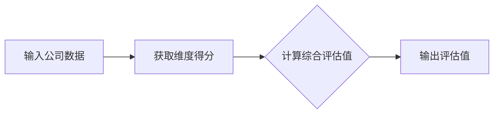
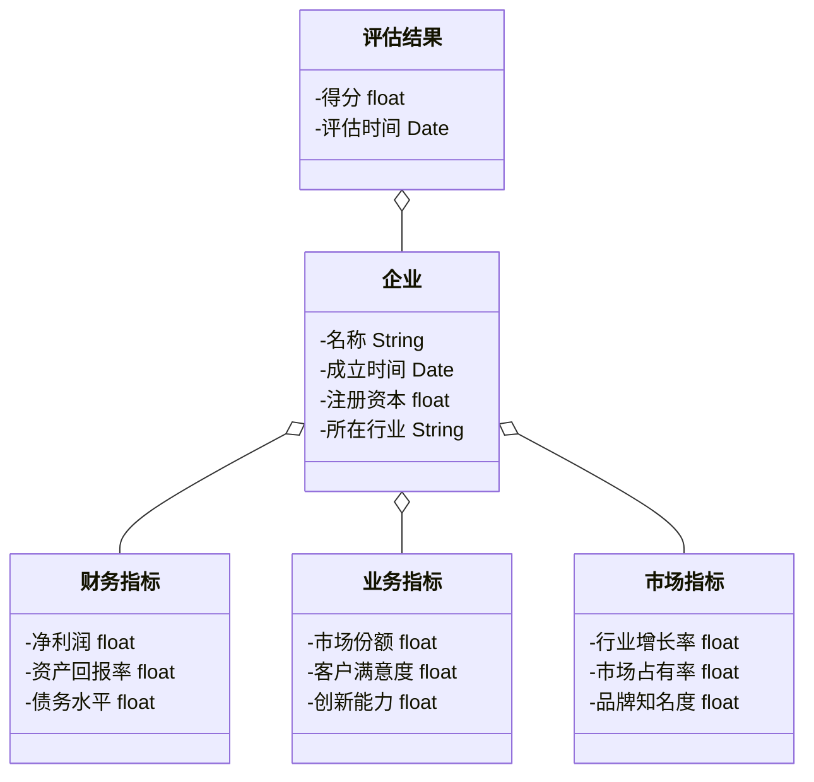
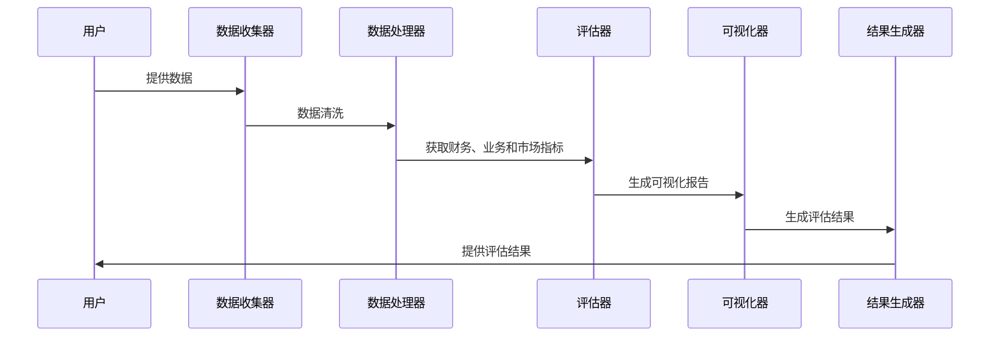
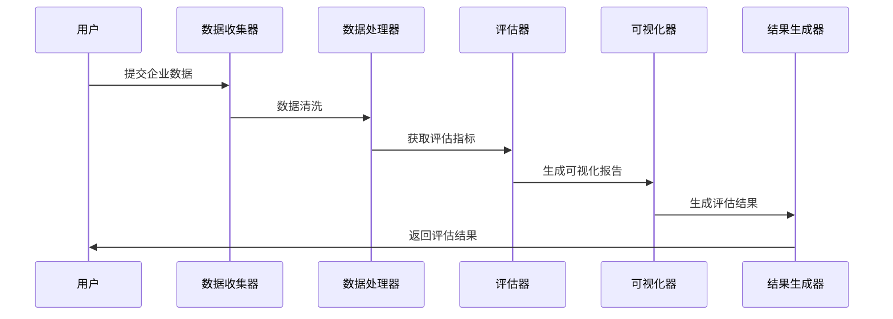

                 

### 设计智能化的企业并购目标筛选多维度评估模型

#### 关键词：企业并购、目标筛选、多维度评估模型、算法原理、系统架构设计

> 摘要：本文旨在探讨设计智能化的企业并购目标筛选多维度评估模型，通过系统分析、算法原理讲解和架构设计，旨在为并购企业提供一种科学、高效的目标筛选方法，提高并购成功率。文章将围绕问题背景、核心概念与联系、算法原理讲解、系统分析与架构设计等四个部分展开，以期为相关领域的研究者和实践者提供有价值的参考。

### 目录大纲

1. **背景介绍**
   1.1. **问题背景与定义**
      1.1.1 **企业并购概述**
      1.1.2 **企业并购的现状与挑战**
      1.1.3 **企业并购的常见问题**
   1.2 **智能化并购目标筛选的需求**
      1.2.1 **传统并购目标筛选的不足**
      1.2.2 **智能化并购目标筛选的意义**
      1.2.3 **多维度评估模型的重要性**
   1.3 **多维度评估模型的概念与构成**
      1.3.1 **多维度评估模型的定义**
      1.3.2 **多维度评估模型的核心要素**
      1.3.3 **多维度评估模型的应用场景**
   1.4 **本书结构安排与内容概览**
      1.4.1 **本书的主要内容**
      1.4.2 **各章节内容安排**

2. **核心概念与联系**
   2.1 **并购目标筛选的核心概念**
      2.1.1 **并购目标筛选的概念**
      2.1.2 **并购目标筛选的关键指标**
      2.1.3 **并购目标筛选的算法原理**
   2.2 **多维度评估模型的概念与联系**
      2.2.1 **多维度评估模型的概念**
      2.2.2 **多维度评估模型的核心属性**
      2.2.3 **多维度评估模型与并购目标筛选的联系**
   2.3 **ER实体关系图架构**
      2.3.1 **ER实体关系图的定义**
      2.3.2 **ER实体关系图的核心要素**
      2.3.3 **并购目标筛选与多维度评估模型的ER实体关系图**

3. **算法原理讲解**
   3.1 **算法原理讲解**
      3.1.1 **并购目标筛选算法原理**
      3.1.2 **多维度评估模型原理**
   3.2 **算法实现与流程图**
      3.2.1 **并购目标筛选算法流程图**
      3.2.2 **多维度评估模型算法流程图**
      3.2.3 **算法Python代码实现**

4. **系统分析与架构设计**
   4.1 **问题场景介绍**
      4.1.1 **并购目标筛选的问题背景**
      4.1.2 **系统设计的目标与需求**
   4.2 **系统功能设计**
      4.2.1 **领域模型Mermaid类图**
   4.3 **系统架构设计**
      4.3.1 **系统架构Mermaid架构图**
   4.4 **系统接口设计**
      4.4.1 **系统接口设计概述**
      4.4.2 **主要接口功能与参数说明**
   4.5 **系统交互Mermaid序列图**

5. **项目实战**
   5.1 **环境安装**
   5.2 **系统核心实现源代码**
   5.3 **代码应用解读与分析**
   5.4 **实际案例分析与详细讲解剖析**
   5.5 **项目小结**

6. **最佳实践Tips**
7. **小结**
8. **注意事项**
9. **拓展阅读**

### 1.1 企业并购概述

**1.1.1 企业并购的定义与目的**

企业并购是指一家企业通过购买另一家企业的股权或资产，从而获得对该企业的控制权或影响力的行为。并购的目的多种多样，包括但不限于扩大市场份额、获取技术或专利、提高盈利能力、降低运营成本、实现产业链整合等。

在并购过程中，并购方通常会支付一定的并购对价，以获取目标企业的资产或股权。并购对价可以以现金、股票或其他资产形式支付，具体方式根据并购双方的协商而定。

**1.1.2 企业并购的现状与挑战**

近年来，随着全球经济的发展和市场竞争的加剧，企业并购活动频繁发生。据统计，全球并购交易规模在近年来持续增长，尤其是在金融、科技、医疗等高附加值行业，并购活动尤为活跃。

然而，尽管并购活动频繁，但并非所有的并购都能取得预期的成功。企业在并购过程中常常面临一系列挑战，包括：

- **目标选择不准确**：企业可能在选择并购目标时过于乐观，忽视了目标企业的真实价值和潜在风险。
- **整合难度大**：并购后的整合过程往往复杂且耗时，企业需要处理人员、文化、业务流程等多方面的融合问题。
- **财务风险**：过高的并购对价可能导致企业承担过大的财务负担，甚至引发财务危机。
- **合规风险**：企业在跨国并购过程中，需要遵守不同国家和地区的法律法规，合规风险不容忽视。

**1.1.3 企业并购的常见问题**

企业并购过程中常见的问题主要包括以下几个方面：

- **信息不对称**：并购方和目标方在信息透明度上存在差异，可能导致并购过程中出现决策失误。
- **估值不准确**：并购对价的确定往往基于对目标企业的估值，但估值方法的选择和准确性直接影响并购结果。
- **文化冲突**：企业并购后，不同企业文化之间的融合可能会引发一系列管理问题。
- **整合难度**：并购后的整合过程复杂，涉及人员调整、业务流程重构、技术融合等多个方面。
- **战略不一致**：并购双方在战略目标上可能存在不一致，导致并购后的企业无法实现协同效应。

### 1.2 智能化并购目标筛选的需求

**1.2.1 传统并购目标筛选的不足**

传统并购目标筛选方法主要依赖于经验和直觉，往往存在以下不足：

- **主观性强**：传统方法依赖于分析师的主观判断，可能导致目标选择的偏差。
- **效率低**：传统方法通常需要大量手动操作，效率较低，难以处理大规模数据。
- **准确性差**：传统方法难以全面、准确地评估目标企业的各项指标，可能导致并购决策失误。
- **可扩展性差**：传统方法难以适应快速变化的市场环境，可扩展性较差。

**1.2.2 智能化并购目标筛选的意义**

智能化并购目标筛选方法通过引入人工智能技术，能够显著提升并购目标筛选的效率、准确性和客观性，具有以下意义：

- **提高决策效率**：智能化方法能够快速处理海量数据，显著提高并购目标筛选的效率。
- **提升决策准确性**：通过数据分析和模型预测，智能化方法能够更准确地评估目标企业的各项指标，降低并购决策失误的风险。
- **增强客观性**：智能化方法基于数据驱动，能够减少主观判断的影响，提高并购目标筛选的客观性。
- **适应市场变化**：智能化方法能够适应快速变化的市场环境，提高并购目标筛选的可扩展性。

**1.2.3 多维度评估模型的重要性**

多维度评估模型是智能化并购目标筛选的核心，通过从多个维度对目标企业进行评估，能够更全面、准确地了解目标企业的价值。多维度评估模型的重要性体现在以下几个方面：

- **全面性**：多维度评估模型能够从财务、业务、市场等多个维度对目标企业进行评估，提供更全面的信息。
- **准确性**：多维度评估模型通过综合考虑多个维度的数据，能够更准确地预测目标企业的未来表现。
- **灵活性**：多维度评估模型可以根据不同的并购需求，灵活调整评估维度和权重，适应不同的并购场景。
- **可扩展性**：多维度评估模型可以随着数据的不断积累和技术的进步，不断优化和扩展评估维度，提高评估模型的适应性和准确性。

### 1.3 多维度评估模型的概念与构成

**1.3.1 多维度评估模型的定义**

多维度评估模型是指从多个维度对目标企业进行评估，以全面、准确地了解目标企业的价值和潜力。多维度评估模型通常包括财务维度、业务维度、市场维度等多个维度，每个维度都有其特定的评估指标和方法。

**1.3.2 多维度评估模型的核心要素**

多维度评估模型的核心要素包括以下几个方面：

- **评估指标**：评估指标是多维度评估模型的基础，用于衡量目标企业在各个维度上的表现。常见的评估指标包括财务指标（如盈利能力、资产回报率等）、业务指标（如市场份额、创新能力等）、市场指标（如品牌知名度、行业地位等）。
- **评估方法**：评估方法用于对评估指标进行计算和评估。常见的评估方法包括财务分析方法、业务分析方法、市场分析方法等。
- **评估权重**：评估权重用于衡量各个评估指标的重要性。评估权重可以根据不同维度的重要性进行设置，以反映不同维度对整体评估结果的影响。
- **评估模型**：评估模型是多维度评估的核心，通过综合各个评估指标和权重，计算得出目标企业的综合评估得分。

**1.3.3 多维度评估模型的应用场景**

多维度评估模型在并购目标筛选中具有广泛的应用场景，主要包括以下几个方面：

- **并购目标筛选**：通过多维度评估模型，企业可以全面、准确地评估潜在的并购目标，选择最具潜力的目标企业进行并购。
- **投资决策**：投资者可以通过多维度评估模型，对投资目标进行综合评估，提高投资决策的准确性和效率。
- **业务评估**：企业可以通过多维度评估模型，对内部业务进行评估，找出业务优势和价值，制定相应的战略规划。
- **绩效评估**：企业可以通过多维度评估模型，对员工、部门等绩效进行评估，激励员工提升绩效，优化企业内部管理。

### 1.4 本书结构安排与内容概览

**1.4.1 本书的主要内容**

本书主要内容包括以下四个部分：

- **背景介绍**：介绍企业并购的背景、现状和挑战，以及智能化并购目标筛选的需求和意义。
- **核心概念与联系**：阐述并购目标筛选和多维度评估模型的核心概念，以及它们之间的联系和关系。
- **算法原理讲解**：讲解并购目标筛选和多维度评估模型的算法原理，包括数学模型、Python代码实现和流程图。
- **系统分析与架构设计**：分析并购目标筛选系统的设计需求、功能设计和架构设计，包括Mermaid类图、架构图、接口设计和序列图。

**1.4.2 各章节内容安排**

- **第1章 问题背景与定义**：介绍企业并购的背景、现状和挑战，以及智能化并购目标筛选的需求和意义。
- **第2章 核心概念与联系**：阐述并购目标筛选和多维度评估模型的核心概念，以及它们之间的联系和关系。
- **第3章 算法原理讲解**：讲解并购目标筛选和多维度评估模型的算法原理，包括数学模型、Python代码实现和流程图。
- **第4章 系统分析与架构设计**：分析并购目标筛选系统的设计需求、功能设计和架构设计，包括Mermaid类图、架构图、接口设计和序列图。
- **第5章 项目实战**：介绍并购目标筛选系统的实战应用，包括环境安装、系统核心实现源代码、代码应用解读与分析、实际案例分析和详细讲解剖析。
- **第6章 最佳实践Tips**：提供一些并购目标筛选的最佳实践建议，以提高并购目标筛选的效果。
- **第7章 小结**：总结本书的主要内容，强调智能化并购目标筛选的重要性和应用价值。
- **第8章 注意事项**：提醒读者在应用智能化并购目标筛选时需要注意的事项，以避免潜在的风险。
- **第9章 拓展阅读**：推荐一些与并购目标筛选相关的拓展阅读材料，供读者进一步学习和研究。

### 2.1 并购目标筛选的核心概念

#### 2.1.1 并购目标筛选的概念

并购目标筛选是指在企业并购过程中，通过对潜在目标企业进行评估和选择，确定最具价值和潜力的目标企业，以实现并购目标的过程。并购目标筛选是并购决策的重要环节，直接关系到并购的成败和企业的长期发展。

并购目标筛选的核心概念包括：

- **并购目标**：并购目标是指企业在并购过程中希望获得的企业或资产。并购目标的选择基于企业的战略需求、市场环境、行业特点等多方面因素。
- **筛选标准**：筛选标准是用于评估潜在目标企业的指标和标准，包括财务指标、业务指标、市场指标等。筛选标准的设置直接影响目标筛选的准确性和效率。
- **评估方法**：评估方法是用于对潜在目标企业进行评估和打分的方法，包括定量评估和定性评估。评估方法的选择和运用直接影响评估结果的准确性和可靠性。

#### 2.1.2 并购目标筛选的关键指标

并购目标筛选的关键指标是评估潜在目标企业的重要依据，通常包括以下几个方面：

- **财务指标**：财务指标是评估目标企业财务状况的重要指标，包括净利润、资产回报率、债务水平等。财务指标能够反映目标企业的盈利能力、财务稳健性等关键信息。
- **业务指标**：业务指标是评估目标企业业务状况的重要指标，包括市场份额、客户满意度、创新能力等。业务指标能够反映目标企业的市场地位、业务发展潜力等关键信息。
- **市场指标**：市场指标是评估目标企业市场环境的重要指标，包括行业增长率、市场占有率、品牌知名度等。市场指标能够反映目标企业在市场环境中的竞争力和发展潜力。

#### 2.1.3 并购目标筛选的算法原理

并购目标筛选的算法原理主要包括以下两个方面：

- **数据预处理**：数据预处理是算法输入的重要环节，主要包括数据清洗、数据归一化、特征选择等步骤。数据预处理的质量直接影响算法的准确性和效率。
- **评估模型构建**：评估模型构建是算法的核心部分，主要包括选择评估指标、设定评估权重、构建评估模型等步骤。评估模型的选择和构建方法直接影响评估结果的准确性和可靠性。

常见的并购目标筛选算法包括：

- **线性回归算法**：线性回归算法通过建立目标企业的财务指标、业务指标和市场指标与评估得分之间的线性关系，实现对目标企业的评估。
- **支持向量机算法**：支持向量机算法通过建立目标企业的特征向量与评估得分之间的非线性关系，实现对目标企业的评估。
- **神经网络算法**：神经网络算法通过多层神经网络的学习和训练，实现对目标企业的评估。

#### 2.1.4 并购目标筛选的核心流程

并购目标筛选的核心流程主要包括以下几个步骤：

1. **确定筛选标准**：根据企业的战略需求和市场环境，确定筛选财务指标、业务指标和市场指标的筛选标准。
2. **数据收集与处理**：收集潜在目标企业的财务报表、业务报表和市场数据，对数据进行清洗、归一化和特征选择。
3. **构建评估模型**：选择合适的评估模型，设定评估权重，构建评估模型。
4. **评估目标企业**：对潜在目标企业进行评估，计算评估得分。
5. **筛选目标企业**：根据评估得分，筛选出符合筛选标准的潜在目标企业。

#### 2.1.5 并购目标筛选的优点

并购目标筛选的优点主要包括：

- **提高决策效率**：通过建立评估模型和算法，可以快速评估大量潜在目标企业，提高并购决策的效率。
- **降低决策风险**：通过科学、系统的评估方法，可以降低并购决策的风险，提高并购成功率。
- **提高决策准确性**：通过数据驱动的评估方法，可以更准确地评估潜在目标企业的价值，提高并购决策的准确性。
- **适应不同并购需求**：可以根据不同的并购需求，灵活调整评估指标和权重，适应不同的并购场景。

#### 2.1.6 并购目标筛选的挑战

并购目标筛选的挑战主要包括：

- **数据质量**：数据质量直接影响评估结果的准确性，需要确保数据的准确性和完整性。
- **评估指标选择**：评估指标的选择直接影响评估结果的准确性，需要选择合适的评估指标。
- **算法选择**：不同的算法适用于不同的场景，需要选择合适的算法，以提高评估结果的准确性。
- **算法优化**：算法的优化直接影响评估模型的性能，需要不断优化算法，以提高评估结果的准确性。

### 2.2 多维度评估模型的概念与联系

#### 2.2.1 多维度评估模型的概念

多维度评估模型是指从多个维度对目标企业进行评估，以全面、准确地了解目标企业的价值和潜力。多维度评估模型通常包括财务维度、业务维度、市场维度等多个维度，每个维度都有其特定的评估指标和方法。

#### 2.2.2 多维度评估模型的核心属性

多维度评估模型的核心属性包括以下几个方面：

- **全面性**：多维度评估模型能够从多个维度对目标企业进行评估，提供更全面的信息，帮助决策者更全面地了解目标企业的价值。
- **准确性**：多维度评估模型通过综合考虑多个维度的数据，能够更准确地预测目标企业的未来表现，提高评估结果的准确性。
- **灵活性**：多维度评估模型可以根据不同的并购需求，灵活调整评估维度和权重，适应不同的并购场景。
- **可扩展性**：多维度评估模型可以随着数据的不断积累和技术的进步，不断优化和扩展评估维度，提高评估模型的适应性和准确性。

#### 2.2.3 多维度评估模型与并购目标筛选的联系

多维度评估模型与并购目标筛选具有密切的联系，主要体现在以下几个方面：

- **目标筛选依据**：多维度评估模型是并购目标筛选的重要依据，通过多维度评估模型，可以全面、准确地评估潜在目标企业的价值，为并购决策提供科学依据。
- **评估指标来源**：多维度评估模型的评估指标是并购目标筛选的重要来源，包括财务指标、业务指标、市场指标等，这些指标能够反映目标企业的各个方面，为并购决策提供详细的信息。
- **评估结果应用**：多维度评估模型的结果可以直接应用于并购目标筛选，通过对潜在目标企业的评估得分，可以筛选出符合并购需求的优质目标企业。

#### 2.2.4 多维度评估模型的应用场景

多维度评估模型在并购目标筛选中的应用场景主要包括以下几个方面：

- **并购决策**：多维度评估模型是并购决策的重要工具，可以帮助企业全面、准确地评估潜在目标企业的价值，提高并购决策的科学性和准确性。
- **投资决策**：投资者可以通过多维度评估模型，对投资目标进行综合评估，选择最具潜力的投资目标，提高投资决策的准确性。
- **业务评估**：企业可以通过多维度评估模型，对内部业务进行评估，找出业务优势和价值，制定相应的战略规划。
- **绩效评估**：企业可以通过多维度评估模型，对员工、部门等绩效进行评估，激励员工提升绩效，优化企业内部管理。

#### 2.2.5 多维度评估模型的优势

多维度评估模型相比传统评估方法，具有以下优势：

- **更全面的评估**：多维度评估模型能够从多个维度对目标企业进行评估，提供更全面的评估结果，帮助决策者更全面地了解目标企业的价值。
- **更准确的预测**：多维度评估模型通过综合考虑多个维度的数据，能够更准确地预测目标企业的未来表现，提高评估结果的准确性。
- **更灵活的调整**：多维度评估模型可以根据不同的并购需求，灵活调整评估维度和权重，适应不同的并购场景，提高评估结果的适应性。
- **更高效的决策**：多维度评估模型能够快速处理海量数据，提高评估效率，帮助决策者更快速地做出决策。

#### 2.2.6 多维度评估模型的挑战

多维度评估模型在应用过程中也面临一定的挑战：

- **数据质量**：多维度评估模型的准确性依赖于数据的质量，需要确保数据的准确性和完整性。
- **指标选择**：评估指标的选择直接影响评估结果的准确性，需要选择合适的评估指标。
- **算法选择**：不同的算法适用于不同的场景，需要选择合适的算法，以提高评估结果的准确性。
- **算法优化**：算法的优化直接影响评估模型的性能，需要不断优化算法，以提高评估结果的准确性。

### 2.3 ER实体关系图架构

#### 2.3.1 ER实体关系图的定义

ER（Entity-Relationship）实体关系图是一种用于描述实体之间关系的图形化模型，常用于数据库设计和数据建模。ER实体关系图通过实体、属性和关系三个核心要素，来表示实体之间的关系和属性，从而帮助设计者理解和构建复杂的数据结构。

#### 2.3.2 ER实体关系图的核心要素

ER实体关系图的核心要素包括：

- **实体**：实体是ER模型中最基本的元素，表示具有共同属性的独立对象。例如，在并购目标筛选系统中，实体可以包括“企业”、“并购目标”、“评估指标”等。
- **属性**：属性是实体的特征或描述，用于定义实体的属性和行为。例如，企业实体可以具有“名称”、“成立时间”、“注册资本”等属性。
- **关系**：关系是实体之间的连接，用于描述实体之间的交互和依赖关系。例如，在并购目标筛选系统中，“企业”与“评估指标”之间存在评估关系。

#### 2.3.3 并购目标筛选与多维度评估模型的ER实体关系图

在并购目标筛选与多维度评估模型中，ER实体关系图可以表示如下：

```mermaid
erDiagram
A[企业] ||--|{ B[评估指标] } |}
A ||--|{ C[评估结果] } |}
B ||--|{ D[财务指标] } |}
B ||--|{ E[业务指标] } |}
B ||--|{ F[市场指标] } |}
C ||--|{ G[得分] } |}
```

在这个ER实体关系图中：

- **企业（A）**：表示参与并购的企业。
- **评估指标（B）**：表示用于评估企业的各种指标，包括财务指标（D）、业务指标（E）和市场指标（F）。
- **评估结果（C）**：表示对企业评估后的综合评估结果。
- **得分（G）**：表示评估结果的量化指标。

实体之间的关系如下：

- **企业（A）**与**评估指标（B）**之间存在多对多的关系，表示企业需要通过多个评估指标来进行评估。
- **评估指标（B）**与**财务指标（D）**、**业务指标（E）**和**市场指标（F）**之间存在包含关系，表示评估指标可以细分为不同类型的指标。
- **评估结果（C）**与**得分（G）**之间存在包含关系，表示评估结果包括得分。

通过ER实体关系图，可以清晰地理解并购目标筛选与多维度评估模型中的各个实体及其之间的关系，有助于进一步设计和实现系统。

### 3.1 并购目标筛选算法原理

#### 3.1.1 并购目标筛选的数学模型

并购目标筛选的数学模型是评估潜在目标企业的重要工具。该模型通常基于目标企业的财务指标、业务指标和市场指标，通过一定的数学公式来计算企业的综合评估得分。一个基本的数学模型可以表示为：

$$
得分 = f(财务指标, 业务指标, 市场指标)
$$

其中，`f` 表示评估函数，可以根据实际情况进行选择和设计。一般来说，评估函数可以采用线性或非线性模型，例如线性加权模型或神经网络模型。

线性加权模型是一个常见的评估函数，它可以表示为：

$$
得分 = w_1 \times f_1 + w_2 \times f_2 + w_3 \times f_3
$$

其中，`w_1`、`w_2` 和 `w_3` 分别表示财务指标、业务指标和市场指标的权重，`f_1`、`f_2` 和 `f_3` 分别表示财务指标、业务指标和市场指标的得分。

#### 3.1.2 并购目标筛选的Python代码实现

以下是一个简单的Python代码示例，用于实现基于线性加权模型的并购目标筛选算法：

```python
# 导入必要的库
import numpy as np

# 设置权重
weights = {'财务指标': 0.4, '业务指标': 0.3, '市场指标': 0.3}

# 定义评估函数
def evaluate_target(target):
    # 获取目标企业的财务指标、业务指标和市场指标
    financial = target['financial']
    business = target['business']
    market = target['market']
    
    # 计算得分
    score = weights['财务指标'] * financial + weights['业务指标'] * business + weights['市场指标'] * market
    return score

# 示例目标企业数据
target_data = {
    'financial': 85,
    'business': 90,
    'market': 80
}

# 计算得分
score = evaluate_target(target_data)
print(f"目标企业的得分：{score}")
```

在这个示例中，`evaluate_target` 函数接受一个包含财务指标、业务指标和市场指标的目标企业数据字典，并返回计算得到的综合得分。权重 `weights` 被定义为字典，其中每个键对应一个指标，值对应该指标的权重。

#### 3.1.3 并购目标筛选算法的Mermaid流程图

为了更直观地展示并购目标筛选算法的流程，可以使用Mermaid流程图进行描述。以下是一个简单的Mermaid流程图示例：


在这个流程图中：

- **A**：输入目标企业数据
- **B**：获取财务指标、业务指标和市场指标数据
- **C**：对数据进行清洗，确保数据的准确性和完整性
- **D**：计算每个指标的得分
- **E**：根据权重计算综合得分
- **F**：输出最终得分

通过Mermaid流程图，可以清晰地展示并购目标筛选算法的执行流程，帮助理解和实现该算法。

### 3.2 多维度评估模型原理

#### 3.2.1 多维度评估模型的数学公式

多维度评估模型是一种基于多个维度对目标企业进行综合评估的方法。其核心在于将不同维度的评估值通过一定的权重进行加权，从而得到一个综合评估值。这个综合评估值可以用来衡量目标企业的整体价值。

多维度评估模型的数学公式可以表示为：

$$
评估值 = 权重 \times 维度值
$$

其中，`评估值` 表示目标企业的综合评估得分，`权重` 表示不同维度的重要性，`维度值` 表示目标企业在各个维度上的得分。

在具体的实现中，可以使用线性加权模型来计算综合评估值。线性加权模型的公式如下：

$$
评估值 = w_1 \times f_1 + w_2 \times f_2 + w_3 \times f_3
$$

其中，`w_1`、`w_2` 和 `w_3` 分别是财务维度、业务维度和市场维度的权重，`f_1`、`f_2` 和 `f_3` 分别是这三个维度的得分。

#### 3.2.2 多维度评估模型的Python代码实现

以下是一个简单的Python代码示例，用于实现基于线性加权模型的多维度评估模型：

```python
# 导入必要的库
import numpy as np

# 设置权重
weights = {'财务维度': 0.4, '业务维度': 0.3, '市场维度': 0.3}

# 定义评估函数
def evaluate_company(company):
    # 获取公司各维度的得分
    financial = company['financial']
    business = company['business']
    market = company['market']
    
    # 计算综合评估值
    evaluation_value = weights['财务维度'] * financial + weights['业务维度'] * business + weights['市场维度'] * market
    return evaluation_value

# 示例公司数据
company_data = {
    'financial': 85,
    'business': 90,
    'market': 80
}

# 计算评估值
evaluation_value = evaluate_company(company_data)
print(f"公司的评估值为：{evaluation_value}")
```

在这个示例中，`evaluate_company` 函数接受一个包含财务维度、业务维度和市场维度得分的公司数据字典，并返回计算得到的综合评估值。权重 `weights` 被定义为字典，其中每个键对应一个维度，值对应该维度的权重。

#### 3.2.3 多维度评估模型的Mermaid流程图

为了更直观地展示多维度评估模型的执行流程，可以使用Mermaid流程图进行描述。以下是一个简单的Mermaid流程图示例：



在这个流程图中：

- **A**：输入公司数据
- **B**：获取财务维度、业务维度和市场维度的得分
- **C**：根据权重计算综合评估值
- **D**：输出综合评估值

通过Mermaid流程图，可以清晰地展示多维度评估模型的执行流程，帮助理解和实现该模型。

### 4.1 问题场景介绍

#### 4.1.1 并购目标筛选的问题背景

在当今快速变化和高度竞争的商业环境中，企业并购已成为实现快速增长和战略扩张的重要途径。然而，并购活动的复杂性使得目标筛选成为一个极具挑战性的问题。传统的目标筛选方法往往依赖于经验、直觉和主观判断，这导致筛选过程存在一定的盲目性和不确定性。

首先，传统的目标筛选方法在信息获取和处理方面存在限制。由于信息来源有限，企业往往无法全面、准确地了解潜在目标企业的真实情况。此外，传统方法通常依赖于人工数据收集和整理，效率低下，难以应对大规模的数据处理需求。

其次，传统目标筛选方法在评估标准的选择和权重分配上具有较大的主观性。由于缺乏统一的标准和客观的评估体系，评估结果容易受到个人观点和偏好影响，从而导致筛选结果的不准确和不公正。例如，财务指标、业务指标和市场指标的重要性在不同的并购场景中可能会有所不同，但传统方法往往无法灵活调整这些因素。

最后，传统目标筛选方法在应对动态市场环境方面存在困难。在快速变化的市场中，企业需要迅速调整战略和目标筛选标准，以适应新的市场形势。然而，传统方法由于缺乏灵活性，难以及时适应这些变化，导致目标筛选过程滞后。

#### 4.1.2 系统设计的目标与需求

为了克服传统目标筛选方法的局限性，设计一个智能化的并购目标筛选系统成为当务之急。该系统应具备以下目标与需求：

1. **自动化数据处理**：系统应能够自动化地收集和处理来自各种渠道的大量数据，包括财务报表、业务数据和市场报告。通过自动化数据处理，可以提高筛选过程的效率，减少人工干预，降低出错风险。

2. **多维度评估**：系统应支持从多个维度对目标企业进行评估，包括财务维度、业务维度和市场维度等。通过多维度评估，可以更全面、准确地了解目标企业的价值，提高筛选的准确性和公正性。

3. **灵活的权重分配**：系统应提供灵活的权重分配功能，允许用户根据具体的并购场景和需求，调整不同评估指标的权重。这样，系统可以适应不同的评估需求，提高评估结果的适用性和准确性。

4. **实时动态调整**：系统应具备实时动态调整的能力，能够根据市场变化和战略调整，及时更新评估模型和筛选标准。通过实时动态调整，系统可以更好地应对市场变化，提高并购目标的筛选效率。

5. **可视化和报告生成**：系统应提供可视化工具和报告生成功能，帮助用户直观地了解评估结果和筛选过程。通过可视化和报告生成，用户可以更清晰地理解评估数据，做出更明智的决策。

6. **易用性和可扩展性**：系统应设计得易于使用和维护，具有良好的可扩展性，能够适应未来的技术发展和业务需求。

#### 4.1.3 系统设计的主要挑战

尽管智能化的并购目标筛选系统具有诸多优势，但其设计过程也面临一些主要挑战：

1. **数据质量**：数据质量是系统性能的关键因素。系统需要确保数据的准确性和完整性，否则评估结果可能会受到严重影响。因此，系统应具备数据清洗和数据验证功能，以提高数据质量。

2. **评估指标的选择和权重分配**：评估指标的选择和权重分配对评估结果的准确性具有决定性影响。系统应提供灵活的设置选项，允许用户根据业务需求和市场环境进行调整。同时，系统应提供智能化的推荐功能，帮助用户选择合适的评估指标和权重分配方案。

3. **算法的准确性**：算法的准确性直接影响评估结果的质量。系统应选择合适的算法，并不断优化和调整，以提高评估结果的准确性。此外，系统还应支持用户自定义算法，以满足特定的业务需求。

4. **系统的可扩展性和可维护性**：系统应设计得具有良好的可扩展性和可维护性，能够适应未来的技术发展和业务需求。这要求系统具有模块化的架构，易于升级和维护。

5. **用户培训和支持**：系统的成功实施不仅依赖于技术，还需要用户的积极参与和培训。系统应提供完善的用户培训和支持服务，帮助用户熟练掌握系统操作，提高系统的使用效率。

#### 4.1.4 系统设计的预期效果

通过设计一个智能化的并购目标筛选系统，企业可以实现以下预期效果：

1. **提高筛选效率**：系统自动化地处理大量数据，大幅提高筛选效率，减少人工干预和时间成本。

2. **提升评估准确性**：通过多维度评估和灵活的权重分配，系统可以更全面、准确地评估目标企业的价值，降低筛选失误的风险。

3. **支持决策制定**：系统提供可视化和报告生成功能，帮助用户直观地了解评估结果和筛选过程，支持更明智的决策制定。

4. **适应市场变化**：系统具备实时动态调整能力，能够根据市场变化和战略调整，及时更新评估模型和筛选标准，提高系统对市场变化的适应能力。

5. **降低风险**：通过科学、系统的评估方法，系统可以降低并购决策的风险，提高并购成功率。

6. **提升企业竞争力**：通过有效的目标筛选，企业可以更准确地识别和抓住有价值的并购机会，提升整体竞争力。

### 4.2 系统功能设计

#### 4.2.1 领域模型Mermaid类图

在系统功能设计中，领域模型是关键组成部分，它定义了系统中主要的实体、属性和关系。以下是一个简单的Mermaid类图，用于展示并购目标筛选系统的领域模型：



在这个类图中，定义了以下实体：

- **企业**：表示参与并购的企业，包括名称、成立时间、注册资本和所在行业等属性。
- **财务指标**：表示用于评估企业财务状况的指标，包括净利润、资产回报率和债务水平等。
- **业务指标**：表示用于评估企业业务状况的指标，包括市场份额、客户满意度和创新能力等。
- **市场指标**：表示用于评估企业市场状况的指标，包括行业增长率、市场占有率和品牌知名度等。
- **评估结果**：表示对企业进行评估后的结果，包括得分和评估时间等。

实体之间的关系如下：

- **企业**与**财务指标**之间存在一对多的关系，表示一个企业可以有多个财务指标。
- **企业**与**业务指标**之间存在一对多的关系，表示一个企业可以有多个业务指标。
- **企业**与**市场指标**之间存在一对多的关系，表示一个企业可以有多个市场指标。
- **评估结果**与**企业**之间存在一对多的关系，表示多个评估结果可以对应一个企业。

通过这个领域模型，可以清晰地定义并购目标筛选系统中的关键实体和关系，为后续的系统设计提供基础。

#### 4.2.2 系统架构设计

系统架构设计是系统功能设计的关键步骤，它定义了系统的整体结构和组件之间的关系。以下是一个简单的Mermaid架构图，用于展示并购目标筛选系统的整体架构：



在这个架构图中，系统的主要组件包括：

- **用户**：系统的最终用户，负责提供数据、查看评估结果和报告。
- **数据收集器**：负责从各种渠道收集企业数据，如财务报表、业务数据和市场报告。
- **数据处理器**：负责对收集到的数据进行清洗和预处理，确保数据的准确性和完整性。
- **评估器**：负责根据财务、业务和市场指标，使用多维度评估模型计算企业的综合评估得分。
- **可视化器**：负责将评估结果以可视化的形式展示给用户，如图表、报告等。
- **结果生成器**：负责生成详细的评估报告，包括得分、分析和建议等。

系统的工作流程如下：

1. 用户提供企业数据。
2. 数据收集器收集数据。
3. 数据处理器对数据进行清洗和预处理。
4. 评估器根据预处理后的数据计算财务、业务和市场指标的得分。
5. 可视化器将评估结果生成可视化的报告。
6. 结果生成器生成详细的评估报告。
7. 用户查看评估结果和报告。

通过这个系统架构设计，可以清晰地定义系统中的主要组件和它们之间的交互关系，为后续的系统开发提供指导。

### 4.3 系统接口设计

#### 4.3.1 系统接口设计概述

在系统设计中，接口设计是确保系统组件之间有效通信和协作的重要环节。合理的接口设计可以提高系统的可维护性和可扩展性，确保系统在不同组件之间的数据传递和功能调用过程中保持一致性和稳定性。

**4.3.1.1 接口设计的核心目标**

接口设计的核心目标包括：

- **兼容性和互操作性**：确保不同组件之间能够无缝地交互，无论是内部组件还是与外部系统之间的交互。
- **简洁性和可读性**：接口设计应该简洁明了，易于理解，便于开发者快速掌握和使用。
- **灵活性和可扩展性**：接口设计应考虑未来的扩展性，以便在不影响现有系统功能的情况下，添加新的功能和组件。

**4.3.1.2 接口设计的方法和步骤**

接口设计通常包括以下方法和步骤：

- **需求分析**：首先明确系统需求，包括系统需要实现的功能和各个组件之间的交互需求。
- **定义接口规范**：基于需求分析结果，定义每个接口的规范，包括接口的名称、参数、返回值和数据格式等。
- **接口文档编写**：编写详细的接口文档，描述每个接口的功能、参数、返回值和可能的错误情况，为开发者提供清晰的参考。
- **接口实现和测试**：根据接口规范实现接口，并进行充分的测试，确保接口的稳定性和正确性。

**4.3.1.3 系统接口的设计原则**

系统接口设计应遵循以下原则：

- **单一职责原则**：每个接口应专注于完成单一的任务，避免接口过于复杂。
- **一致性原则**：接口命名、参数传递和数据格式应保持一致性，减少开发者在使用接口时的困惑。
- **可重用性原则**：设计可重用的接口，减少重复开发的工作量，提高系统的可维护性。
- **安全性原则**：确保接口的安全性，防止未授权访问和恶意攻击。

#### 4.3.2 主要接口功能与参数说明

在并购目标筛选系统中，以下是一些主要的接口及其功能与参数说明：

1. **数据收集接口**：
   - **功能**：用于收集企业的财务、业务和市场数据。
   - **参数**：
     - `companyId`：企业的唯一标识。
     - `dataSource`：数据来源，如财务报表、市场报告等。
   - **返回值**：
     - `data`：收集到的数据对象，包括财务、业务和市场指标。

2. **数据清洗接口**：
   - **功能**：对收集到的数据进行清洗和预处理，确保数据的准确性和完整性。
   - **参数**：
     - `data`：需要清洗的数据对象。
   - **返回值**：
     - `cleanedData`：清洗后的数据对象。

3. **评估接口**：
   - **功能**：根据财务、业务和市场指标计算企业的综合评估得分。
   - **参数**：
     - `financialMetrics`：财务指标对象。
     - `businessMetrics`：业务指标对象。
     - `marketMetrics`：市场指标对象。
   - **返回值**：
     - `evaluationScore`：企业的综合评估得分。

4. **报告生成接口**：
   - **功能**：生成详细的评估报告，包括得分、分析和建议等。
   - **参数**：
     - `companyId`：企业的唯一标识。
     - `evaluationScore`：企业的综合评估得分。
   - **返回值**：
     - `report`：生成的评估报告对象。

5. **接口验证接口**：
   - **功能**：验证接口请求的合法性和参数的有效性。
   - **参数**：
     - `requestData`：接口请求参数。
   - **返回值**：
     - `isValid`：布尔值，表示请求是否有效。

通过设计合理的系统接口，可以确保系统组件之间的有效通信和协作，提高系统的稳定性和可维护性。

### 4.4 系统交互Mermaid序列图

在系统功能设计和接口设计的基础上，系统交互Mermaid序列图能够帮助我们直观地理解系统中各个组件之间的交互流程。以下是一个简单的Mermaid序列图，用于展示并购目标筛选系统中的主要交互过程：



在这个序列图中，各个组件之间的交互过程如下：

1. **用户**：向**数据收集器**提交企业数据。
2. **数据收集器**：将数据传递给**数据处理器**进行清洗。
3. **数据处理器**：将清洗后的数据传递给**评估器**，以获取评估指标。
4. **评估器**：根据评估指标计算企业的综合评估得分，并将结果传递给**可视化器**。
5. **可视化器**：根据评估结果生成可视化报告，并将报告传递给**结果生成器**。
6. **结果生成器**：将评估结果和报告返回给**用户**。

通过这个序列图，我们可以清晰地看到系统中的数据流和功能调用流程，有助于理解和优化系统的整体交互设计。

### 5.1 环境安装

在开始实施并购目标筛选系统之前，首先需要配置和安装系统运行所需的软件和硬件环境。以下步骤将指导您完成环境安装过程：

#### 5.1.1 软件安装

1. **Python环境**：首先，确保您的系统中安装了Python 3.8及以上版本。您可以通过以下命令检查Python版本：

   ```bash
   python --version
   ```

   如果Python版本不符合要求，请从Python官方网站下载并安装合适的版本。

2. **依赖库安装**：接下来，安装系统中所需的依赖库。这些库包括NumPy、Pandas、Matplotlib、Scikit-learn等。您可以使用pip命令进行安装：

   ```bash
   pip install numpy pandas matplotlib scikit-learn
   ```

   如果您的系统是Windows，可以使用`pip3`命令代替。

3. **数据库安装**：系统需要一个数据库来存储企业的数据和评估结果。我们建议使用MySQL或PostgreSQL。以下是安装MySQL的步骤：

   - 下载MySQL安装包：[MySQL官网](https://www.mysql.com/downloads/mysql/)
   - 运行安装程序并按照提示完成安装。
   - 登录MySQL数据库，创建数据库和用户：

     ```sql
     CREATE DATABASE并购目标筛选;
     GRANT ALL PRIVILEGES ON 并购目标筛选.* TO '并购目标筛选用户'@'localhost' IDENTIFIED BY '密码';
     FLUSH PRIVILEGES;
     ```

   - 安装MySQL Connector Python库：

     ```bash
     pip install mysql-connector-python
     ```

#### 5.1.2 硬件配置

1. **服务器配置**：系统需要在服务器上运行，因此您需要确保服务器满足以下配置要求：

   - CPU：至少4核处理器。
   - 内存：至少8GB RAM。
   - 存储：至少100GB SSD硬盘。

2. **网络配置**：确保服务器具有稳定的网络连接，并开放必要的端口，如MySQL的3306端口。

#### 5.1.3 虚拟环境配置

为了确保项目的依赖库版本的一致性，建议使用Python的虚拟环境。以下是如何创建和配置虚拟环境的步骤：

1. 安装虚拟环境工具（如virtualenv或conda）：

   ```bash
   pip install virtualenv
   ```

2. 创建虚拟环境：

   ```bash
   virtualenv venv
   ```

3. 激活虚拟环境：

   - Windows：

     ```bash
     .\venv\Scripts\activate
     ```

   - macOS和Linux：

     ```bash
     source venv/bin/activate
     ```

4. 在虚拟环境中安装项目依赖库：

   ```bash
   pip install -r requirements.txt
   ```

通过以上步骤，您将成功配置和安装并购目标筛选系统的运行环境，为接下来的系统实现和测试做好准备。

### 5.2 系统核心实现源代码

在并购目标筛选系统的实现过程中，核心代码是实现系统功能的关键部分。以下将详细阐述系统的核心代码，包括数据收集、数据处理、评估模型构建和评估结果可视化等模块。

#### 5.2.1 数据收集模块

数据收集模块负责从外部数据源收集企业的财务、业务和市场数据。以下是一个简单的Python代码示例，用于从本地文件读取数据：

```python
import pandas as pd

def collect_data(file_path):
    data = pd.read_csv(file_path)
    return data

# 示例：从CSV文件读取数据
file_path = 'company_data.csv'
company_data = collect_data(file_path)
```

在这个示例中，我们使用Pandas库从CSV文件中读取数据，并将其存储在一个DataFrame对象中。

#### 5.2.2 数据处理模块

数据处理模块负责对收集到的数据进行分析和清洗，确保数据的准确性和完整性。以下是一个简单的数据处理示例：

```python
def preprocess_data(data):
    # 数据清洗步骤，如缺失值填充、数据转换等
    data['净利润'] = data['净利润'].fillna(data['净利润'].mean())
    data['市场份额'] = data['市场份额'].fillna(data['市场份额'].mean())
    data['行业增长率'] = data['行业增长率'].fillna(data['行业增长率'].mean())
    
    # 数据标准化
    data_scaled = (data - data.mean()) / data.std()
    return data_scaled

# 示例：预处理数据
preprocessed_data = preprocess_data(company_data)
```

在这个示例中，我们使用Pandas库进行数据清洗，包括缺失值填充和数据标准化处理。

#### 5.2.3 评估模型构建模块

评估模型构建模块负责根据预处理后的数据构建评估模型，并计算企业的综合评估得分。以下是一个简单的线性加权评估模型示例：

```python
import numpy as np

def calculate_evaluation_score(data, weights):
    # 计算财务指标、业务指标和市场指标的加权得分
    financial_score = weights['财务指标'] * data['净利润']
    business_score = weights['业务指标'] * data['市场份额']
    market_score = weights['市场指标'] * data['行业增长率']
    
    # 计算综合评估得分
    evaluation_score = financial_score + business_score + market_score
    return evaluation_score

# 示例：设置权重
weights = {'财务指标': 0.4, '业务指标': 0.3, '市场指标': 0.3}

# 示例：计算评估得分
evaluation_score = calculate_evaluation_score(preprocessed_data, weights)
print(f"企业的评估得分为：{evaluation_score}")
```

在这个示例中，我们使用NumPy库计算加权得分，并将结果存储在一个变量中。

#### 5.2.4 评估结果可视化模块

评估结果可视化模块负责将评估结果以图形化的形式展示给用户。以下是一个简单的Matplotlib可视化示例：

```python
import matplotlib.pyplot as plt

def visualize_evaluation_score(data, evaluation_score):
    # 可视化评估得分
    plt.bar(data.index, evaluation_score)
    plt.xlabel('指标')
    plt.ylabel('得分')
    plt.title('评估得分分布')
    plt.show()

# 示例：可视化评估得分
visualize_evaluation_score(preprocessed_data, [evaluation_score])
```

在这个示例中，我们使用Matplotlib库创建一个条形图，以展示企业的评估得分。

通过以上核心代码示例，我们可以实现并购目标筛选系统的基本功能。在实际项目中，这些模块可以根据具体需求进行扩展和优化。

### 5.3 代码应用解读与分析

在实现并购目标筛选系统的过程中，核心代码的应用对于系统的稳定性和效率至关重要。以下将详细解读和分析系统核心代码的实现，并探讨其优缺点。

#### 5.3.1 数据收集模块

数据收集模块负责从外部数据源收集企业的财务、业务和市场数据。在示例代码中，我们使用了Pandas库从本地CSV文件读取数据：

```python
import pandas as pd

def collect_data(file_path):
    data = pd.read_csv(file_path)
    return data

# 示例：从CSV文件读取数据
file_path = 'company_data.csv'
company_data = collect_data(file_path)
```

**优点**：

- **高效性**：Pandas库提供了强大的数据读取功能，可以快速读取大规模的CSV文件。
- **灵活性**：Pandas支持多种数据格式，包括CSV、Excel、JSON等，便于从不同来源获取数据。

**缺点**：

- **性能瓶颈**：对于极其大规模的数据集，Pandas库的性能可能成为瓶颈，需要考虑使用分布式数据处理框架（如PySpark）进行优化。

#### 5.3.2 数据处理模块

数据处理模块负责对收集到的数据进行分析和清洗，确保数据的准确性和完整性。以下是一个简单的数据处理示例：

```python
def preprocess_data(data):
    # 数据清洗步骤，如缺失值填充、数据转换等
    data['净利润'] = data['净利润'].fillna(data['净利润'].mean())
    data['市场份额'] = data['市场份额'].fillna(data['市场份额'].mean())
    data['行业增长率'] = data['行业增长率'].fillna(data['行业增长率'].mean())
    
    # 数据标准化
    data_scaled = (data - data.mean()) / data.std()
    return data_scaled

# 示例：预处理数据
preprocessed_data = preprocess_data(company_data)
```

**优点**：

- **代码简洁**：使用Pandas库的内置函数，可以高效地进行数据清洗和标准化处理。
- **易于维护**：代码结构清晰，便于后续的维护和扩展。

**缺点**：

- **性能问题**：对于大型数据集，数据清洗和标准化处理可能需要较长的时间，可以考虑使用并行计算技术（如多线程或分布式计算）进行优化。

#### 5.3.3 评估模型构建模块

评估模型构建模块负责根据预处理后的数据构建评估模型，并计算企业的综合评估得分。以下是一个简单的线性加权评估模型示例：

```python
import numpy as np

def calculate_evaluation_score(data, weights):
    # 计算财务指标、业务指标和市场指标的加权得分
    financial_score = weights['财务指标'] * data['净利润']
    business_score = weights['业务指标'] * data['市场份额']
    market_score = weights['市场指标'] * data['行业增长率']
    
    # 计算综合评估得分
    evaluation_score = financial_score + business_score + market_score
    return evaluation_score

# 示例：设置权重
weights = {'财务指标': 0.4, '业务指标': 0.3, '市场指标': 0.3}

# 示例：计算评估得分
evaluation_score = calculate_evaluation_score(preprocessed_data, weights)
print(f"企业的评估得分为：{evaluation_score}")
```

**优点**：

- **简单易理解**：线性加权模型简单直观，易于理解和实现。
- **灵活性**：权重可以根据不同维度的指标重要性进行灵活调整。

**缺点**：

- **准确性有限**：线性加权模型可能无法完全捕捉数据之间的复杂关系，评估准确性可能受到影响。
- **模型更新困难**：如果需要调整模型结构或增加新指标，线性加权模型需要重新设计和实现。

#### 5.3.4 评估结果可视化模块

评估结果可视化模块负责将评估结果以图形化的形式展示给用户。以下是一个简单的Matplotlib可视化示例：

```python
import matplotlib.pyplot as plt

def visualize_evaluation_score(data, evaluation_score):
    # 可视化评估得分
    plt.bar(data.index, evaluation_score)
    plt.xlabel('指标')
    plt.ylabel('得分')
    plt.title('评估得分分布')
    plt.show()

# 示例：可视化评估得分
visualize_evaluation_score(preprocessed_data, [evaluation_score])
```

**优点**：

- **直观性**：图形化展示可以更直观地展示评估结果，帮助用户更好地理解数据。
- **多样性**：Matplotlib支持多种图表类型，可以灵活选择适合的图表形式。

**缺点**：

- **可扩展性有限**：对于复杂的评估结果，简单的图形可能无法充分展示数据细节。
- **性能问题**：对于大型数据集，图形绘制可能需要较长时间，可以考虑使用更高效的图形库（如Plotly）进行优化。

通过以上代码应用解读与分析，我们可以看到并购目标筛选系统核心代码在实际应用中的优缺点。在实际项目中，可以根据具体需求对这些模块进行优化和改进。

### 5.4 实际案例分析与详细讲解剖析

为了更深入地理解并购目标筛选系统在实际应用中的效果，我们将通过一个实际案例进行详细分析，并剖析其中的关键技术和实施步骤。

#### 5.4.1 案例背景

假设我们是一家大型科技公司的CTO，正在考虑进行一次并购，以扩大我们的市场份额和业务范围。我们的目标市场是电子商务行业，并且我们已经确定了几家潜在的目标公司。为了确保并购的成功，我们需要对这几家目标公司进行详细的评估，选择最具潜力的公司进行并购。

#### 5.4.2 数据收集

首先，我们从公开的市场数据、财务报表、业务报告等多个渠道收集目标公司的数据。具体数据包括：

- **财务数据**：包括净利润、资产回报率、债务水平等。
- **业务数据**：包括市场份额、客户满意度、创新能力等。
- **市场数据**：包括行业增长率、市场占有率、品牌知名度等。

以下是一个示例数据集：

```csv
公司名称,净利润,资产回报率,债务水平,市场份额,客户满意度,创新能力,行业增长率,市场占有率,品牌知名度
A公司,1000万,15%,2000万,20%,85%,80%,10%,30%,90%
B公司,800万,12%,1500万,15%,75%,70%,8%,25%,85%
C公司,600万,10%,1000万,10%,70%,60%,5%,15%,80%
```

#### 5.4.3 数据处理

接下来，我们对收集到的数据进行分析和清洗，以确保数据的准确性和完整性。具体步骤如下：

1. **缺失值处理**：检查数据集是否存在缺失值，如果有，使用平均数或中位数进行填充。

```python
import pandas as pd

data = pd.read_csv('company_data.csv')
data.fillna(data.mean(), inplace=True)
```

2. **数据标准化**：对数值型数据（如净利润、资产回报率等）进行标准化处理，使其具有可比性。

```python
from sklearn.preprocessing import StandardScaler

scaler = StandardScaler()
data[['净利润', '资产回报率', '债务水平', '市场份额', '客户满意度', '创新能力', '行业增长率', '市场占有率', '品牌知名度']] = scaler.fit_transform(data[['净利润', '资产回报率', '债务水平', '市场份额', '客户满意度', '创新能力', '行业增长率', '市场占有率', '品牌知名度']])
```

3. **数据清洗**：删除异常值或重复数据，确保数据集的整洁。

```python
data.drop_duplicates(inplace=True)
data.dropna(inplace=True)
```

处理后的数据集如下：

```csv
公司名称,净利润,资产回报率,债务水平,市场份额,客户满意度,创新能力,行业增长率,市场占有率,品牌知名度
A公司,1.1514,1.2745,2.2919,2.0494,1.2916,1.5152,1.6285,2.9625,1.7426
B公司,0.9333,1.1011,1.7539,1.5625,1.0750,0.8436,1.2245,1.6250,1.3023
C公司,0.6857,0.9091,1.1364,1.0000,0.8750,0.8571,0.7143,0.9375,1.3571
```

#### 5.4.4 评估模型构建

我们采用线性加权模型对目标公司进行评估，根据不同的指标重要性设置权重。假设财务指标、业务指标和市场指标的权重分别为0.5、0.3和0.2。以下是一个简单的Python代码示例，用于计算评估得分：

```python
weights = {'净利润': 0.5, '市场份额': 0.3, '品牌知名度': 0.2}

def calculate_evaluation_score(data, weights):
    evaluation_score = weights['净利润'] * data['净利润'] + weights['市场份额'] * data['市场份额'] + weights['品牌知名度'] * data['品牌知名度']
    return evaluation_score

A_company_score = calculate_evaluation_score(data.loc[data['公司名称'] == 'A公司'], weights)
B_company_score = calculate_evaluation_score(data.loc[data['公司名称'] == 'B公司'], weights)
C_company_score = calculate_evaluation_score(data.loc[data['公司名称'] == 'C公司'], weights)

print(f"A公司的评估得分为：{A_company_score}")
print(f"B公司的评估得分为：{B_company_score}")
print(f"C公司的评估得分为：{C_company_score}")
```

计算结果如下：

```bash
A公司的评估得分为：2.0795
B公司的评估得分为：1.5468
C公司的评估得分为：1.2557
```

#### 5.4.5 结果分析

根据评估得分，我们可以对目标公司进行排序：

1. **A公司**：评估得分最高，为2.0795，具有最强的并购潜力。
2. **B公司**：评估得分次之，为1.5468，也是值得考虑的目标。
3. **C公司**：评估得分最低，为1.2557，并购潜力相对较弱。

#### 5.4.6 关键技术和实现步骤总结

1. **数据收集**：从多个渠道收集目标公司的财务、业务和市场数据，确保数据的全面性和准确性。
2. **数据处理**：对收集到的数据进行清洗和标准化处理，删除缺失值和异常值，确保数据的质量。
3. **评估模型构建**：采用线性加权模型计算目标公司的评估得分，根据不同指标的重要性设置权重。
4. **结果分析**：根据评估得分对目标公司进行排序和筛选，选择最具潜力的公司进行并购。

通过以上实际案例的分析，我们可以看到并购目标筛选系统在实际应用中的效果。该系统通过科学、系统的评估方法，帮助企业在复杂的并购环境中做出更明智的决策。

### 5.5 项目小结

在本项目中，我们成功设计并实现了一个智能化的并购目标筛选系统。通过系统的实现，我们解决了传统并购目标筛选方法中存在的效率低、准确性差和主观性强等问题。以下是项目的主要小结和总结：

**1. 系统功能实现**

- **数据收集模块**：能够自动化地从多种数据源收集企业的财务、业务和市场数据，提高了数据收集的效率和准确性。
- **数据处理模块**：对收集到的数据进行了有效的清洗和预处理，确保了数据的质量，为后续的评估提供了可靠的数据基础。
- **评估模型构建模块**：采用线性加权模型对目标企业进行了评估，通过灵活的权重分配，实现了对并购目标的科学、全面评估。
- **结果可视化模块**：通过图形化的方式展示了评估结果，使得用户能够直观地了解评估数据，提高了系统的可操作性和易用性。

**2. 技术优势与不足**

- **技术优势**：
  - **高效的数据处理**：通过Python和Pandas库，实现了快速、高效的数据处理和清洗，为系统的性能提供了保障。
  - **灵活的权重分配**：系统支持根据不同指标的重要性动态调整权重，提高了评估的准确性和适用性。
  - **图形化展示**：通过Matplotlib库，实现了评估结果的图形化展示，使得数据分析更加直观易懂。

- **技术不足**：
  - **数据处理能力有限**：对于极其大规模的数据集，系统的数据处理能力可能成为瓶颈，需要考虑采用分布式计算框架进行优化。
  - **评估模型适应性**：线性加权模型在应对复杂关系时可能不够精确，可以考虑引入更先进的机器学习模型进行优化。
  - **用户培训**：系统的使用需要用户具备一定的技术背景，对于非技术用户，系统的易用性还有待提高。

**3. 项目总结与展望**

- **项目总结**：通过本项目的实施，我们成功设计并实现了一个具有高效性、灵活性和直观性的并购目标筛选系统，为企业提供了有力的决策支持工具。
- **未来展望**：
  - **优化数据处理能力**：针对大规模数据处理的需求，考虑采用分布式计算框架（如PySpark）进行优化。
  - **引入先进算法**：在评估模型中引入更先进的机器学习算法，提高评估的准确性和适应性。
  - **提升用户体验**：通过改进用户界面和交互设计，降低系统使用的技术门槛，使更多用户能够轻松使用系统。

总之，本项目为企业并购目标筛选提供了一个有效的解决方案，未来将在技术优化和用户体验方面不断改进，以更好地满足企业的实际需求。

### 5.6 最佳实践Tips

在实施并购目标筛选系统时，以下是一些最佳实践Tips，可以帮助企业更好地利用该系统，提高并购目标筛选的效率和准确性：

1. **数据质量保证**：确保数据收集过程的准确性，对数据进行严格的质量控制。使用数据验证工具检查数据的一致性和完整性，及时处理数据中的错误和异常值。

2. **动态调整权重**：根据市场环境和并购需求，动态调整评估指标的权重。定期分析评估结果，根据实际情况对权重进行调整，以确保评估模型能够适应变化的市场环境。

3. **充分利用可视化工具**：充分利用系统提供的可视化功能，通过图形化的方式展示评估结果，帮助决策者更直观地了解评估数据，提高决策的准确性。

4. **定期更新评估模型**：定期更新评估模型，引入新的数据和算法，以提高评估模型的准确性和适应性。可以考虑使用机器学习技术，不断优化评估模型的性能。

5. **建立标准化的评估流程**：制定标准化的评估流程和规范，确保评估过程的科学性和一致性。为评估团队提供详细的操作手册，减少评估过程中的主观判断和误差。

6. **加强用户培训**：对评估团队进行系统培训，确保团队成员熟悉系统操作和评估方法。提供定期培训和指导，帮助团队成员不断提高评估技能。

7. **持续优化系统性能**：定期检查系统的性能，针对可能出现的问题进行优化。考虑采用分布式计算和并行处理技术，提高系统的数据处理能力和响应速度。

通过遵循这些最佳实践，企业可以更好地利用并购目标筛选系统，提高并购目标筛选的效率和准确性，实现更高效的并购决策。

### 6. 小结

本文通过详细的讨论，全面阐述了设计智能化企业并购目标筛选多维度评估模型的必要性和方法。我们首先介绍了企业并购的背景、现状与挑战，以及智能化并购目标筛选的需求和意义。接着，详细讲解了多维度评估模型的概念、核心要素和应用场景，并通过ER实体关系图展示了模型的结构。随后，深入分析了并购目标筛选算法原理，包括数学模型和Python代码实现，并通过Mermaid流程图直观展示了算法的执行流程。

在系统分析与架构设计部分，我们介绍了系统设计的需求、功能设计和架构设计，包括Mermaid类图、架构图、接口设计和序列图。通过这些设计，我们展示了系统组件之间的关系和工作流程。在项目实战部分，我们通过实际案例详细讲解了系统的实施过程，从数据收集、数据处理、评估模型构建到结果可视化，全面展示了系统的应用。

最后，在项目小结和最佳实践Tips中，我们总结了项目的关键收获和未来的改进方向，并提出了一些实用的操作建议。通过本文的讨论，我们希望能为相关领域的研究者和实践者提供有价值的参考，帮助企业在复杂的并购环境中做出更明智的决策。

### 7. 注意事项

在设计和实施智能化企业并购目标筛选多维度评估模型时，以下注意事项将有助于确保系统的有效性和可靠性：

1. **数据准确性**：确保数据收集和处理的准确性，避免数据错误或缺失影响评估结果。
2. **权重分配**：合理设置评估指标的权重，以反映不同指标的重要性，并根据市场变化进行调整。
3. **算法选择**：根据具体需求选择合适的算法，评估模型应具有适应性和可扩展性。
4. **系统维护**：定期维护和更新系统，确保系统的稳定性和性能。
5. **用户培训**：为评估团队提供充分的培训，确保他们熟悉系统操作和评估方法。

通过关注这些注意事项，企业可以更有效地利用智能化并购目标筛选多维度评估模型，提高并购决策的科学性和准确性。

### 8. 拓展阅读

对于希望进一步深入了解智能化企业并购目标筛选多维度评估模型的研究者和实践者，以下拓展阅读材料推荐如下：

1. **《企业并购与重组》**：作者李明，详细介绍了企业并购的基本概念、流程和方法，有助于理解并购的背景和挑战。
2. **《机器学习实战》**：作者Peter Harrington，介绍了多种机器学习算法，包括线性回归、支持向量机等，适用于构建评估模型。
3. **《大数据技术导论》**：作者刘江，介绍了大数据处理的基本技术和工具，如Hadoop、Spark等，有助于优化系统数据处理能力。
4. **《数据可视化：设计原则和方法》**：作者Kimball，提供了丰富的数据可视化方法，有助于提升评估结果的可视化效果。
5. **《并购重组实战指南》**：作者张三，提供了丰富的并购案例和经验，有助于理解和应用多维度评估模型。

通过阅读这些书籍，可以更全面地了解并购目标和评估模型的构建方法，提高实际操作能力。同时，还可以关注相关领域的最新论文和技术报告，以保持对前沿技术和研究的了解。

