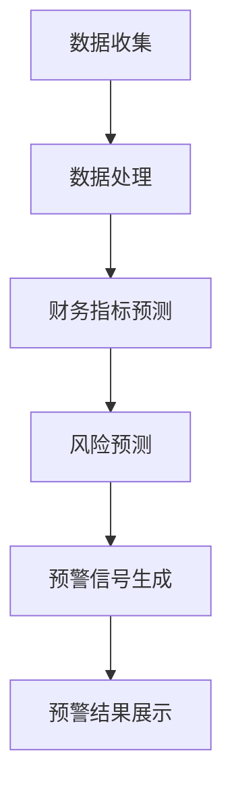
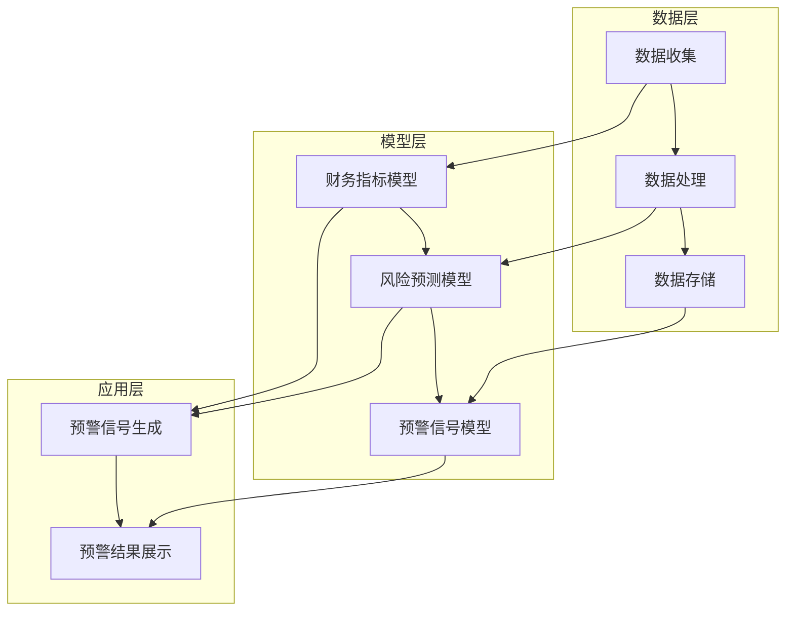
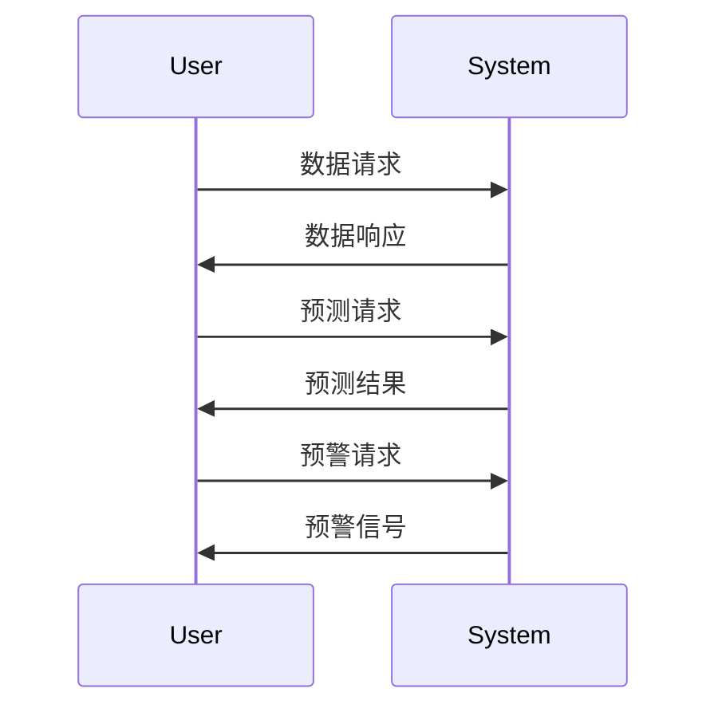

                 

### 设计智能化的企业财务压力预警系统

关键词：企业财务压力、预警系统、智能化、需求分析、技术框架、数学模型、系统架构、项目实战、最佳实践

摘要：随着全球经济的发展和市场竞争的加剧，企业的财务状况对于其生存和发展至关重要。然而，传统的财务压力预警系统往往存在响应速度慢、预测准确性不高等问题。本文旨在探讨设计智能化的企业财务压力预警系统的方法和步骤，通过引入先进的人工智能技术和大数据分析，提高预警系统的实时性和准确性，为企业提供及时、准确的财务风险预警，助力企业健康、稳定发展。

### 目录大纲

#### 第一部分：背景介绍与问题分析

1. **第1章：企业财务压力预警系统概述**
    - **1.1 问题背景**
    - **1.2 问题描述**
    - **1.3 问题解决**
    - **1.4 边界与外延**
    - **1.5 概念结构与核心要素组成**

2. **第2章：企业财务压力预警系统的核心概念**
    - **2.1 财务压力的概念**
    - **2.2 预警系统的概念**
    - **2.3 关键概念联系与对比**

3. **第3章：企业财务压力预警系统的需求分析**
    - **3.1 用户需求**
    - **3.2 功能需求**
    - **3.3 性能需求**
    - **3.4 可靠性需求**
    - **3.5 安全性需求**

4. **第4章：企业财务压力预警系统的技术框架**
    - **4.1 技术选型**
    - **4.2 系统架构设计**
    - **4.3 数据收集与处理**
    - **4.4 模型训练与优化**

5. **第5章：企业财务压力预警系统的数学模型与算法原理**
    - **5.1 数学模型介绍**
    - **5.2 算法原理讲解**
    - **5.3 Mermaid流程图绘制**
    - **5.4 Python源代码实现**

6. **第6章：系统分析与架构设计方案**
    - **6.1 问题场景介绍**
    - **6.2 系统功能设计（Mermaid类图）**
    - **6.3 系统架构设计（Mermaid架构图）**
    - **6.4 系统接口设计和系统交互（Mermaid序列图）**

7. **第7章：项目实战**
    - **7.1 环境安装**
    - **7.2 系统核心实现源代码**
    - **7.3 代码应用解读与分析**
    - **7.4 实际案例分析与详细讲解剖析**
    - **7.5 项目小结**

8. **第8章：最佳实践与总结**
    - **8.1 最佳实践 tips**
    - **8.2 小结**
    - **8.3 注意事项**
    - **8.4 拓展阅读**

### 第一部分：背景介绍与问题分析

#### 第1章：企业财务压力预警系统概述

##### 1.1 问题背景

在全球经济一体化和信息技术飞速发展的背景下，企业面临着前所未有的机遇和挑战。市场环境瞬息万变，竞争日益激烈，企业不仅要应对内外部的各种风险，还需要保持财务的健康和稳定。财务压力预警系统作为一种有效的管理工具，能够提前识别潜在的财务风险，为企业提供决策支持。

##### 1.2 问题描述

传统的企业财务压力预警系统主要依赖于人工分析和历史数据，存在以下问题：

1. **响应速度慢**：在风险事件发生后，系统往往需要一段时间才能给出预警信号，错过了最佳应对时机。
2. **预测准确性不高**：传统的预警系统依赖的历史数据和方法，难以准确预测未来的财务风险。
3. **人工干预多**：系统的自动分析能力有限，需要大量的人工干预，增加了运营成本。
4. **预警信号滞后**：预警信号往往滞后于实际风险，导致企业无法及时采取应对措施。

##### 1.3 问题解决

为了解决上述问题，我们需要设计一个智能化的企业财务压力预警系统，利用人工智能技术，提高预警系统的实时性和准确性，降低人工干预，实现自动化运营。以下是问题解决的步骤：

1. **数据收集**：收集企业历史财务数据、市场数据、行业数据等，构建数据集。
2. **特征工程**：对数据进行预处理和特征提取，为后续建模提供高质量的输入。
3. **模型选择**：选择合适的机器学习算法，如深度学习、决策树、支持向量机等，构建预测模型。
4. **模型训练与优化**：使用历史数据训练模型，并通过交叉验证、超参数调优等方法优化模型性能。
5. **系统集成**：将预警系统集成到企业的管理系统中，实现实时数据采集、分析和预警。

##### 1.4 边界与外延

1. **边界**：本文主要探讨智能化的企业财务压力预警系统的设计方法，不涉及具体的硬件设备和操作系统。
2. **外延**：智能化的企业财务压力预警系统可以扩展到金融风险预警、供应链风险预警等多个领域。

##### 1.5 概念结构与核心要素组成

1. **概念结构**：企业财务压力预警系统由数据层、模型层、应用层三个层次组成。
    - **数据层**：负责数据收集、存储和管理。
    - **模型层**：负责数据预处理、特征工程、模型训练和优化。
    - **应用层**：负责预警信号生成、预警策略制定和预警结果展示。

2. **核心要素组成**：
    - **数据源**：包括企业内部财务数据、市场数据、行业数据等。
    - **数据处理**：包括数据清洗、数据转换、特征提取等。
    - **预测模型**：包括机器学习算法、深度学习模型等。
    - **预警规则**：根据预测结果制定预警规则，生成预警信号。
    - **预警策略**：根据预警信号采取相应的应对措施。

#### 第2章：企业财务压力预警系统的核心概念

##### 2.1 财务压力的概念

财务压力是指企业在经营过程中，由于各种原因导致财务状况恶化，影响企业的正常运营和发展。财务压力的主要表现包括：

- **现金流紧张**：企业无法按时偿还债务，面临资金链断裂的风险。
- **盈利能力下降**：企业利润下降，经营困难。
- **负债率上升**：企业负债增加，负债率上升，财务风险增加。

##### 2.2 预警系统的概念

预警系统是指通过监测和分析企业财务数据，提前发现潜在财务风险的系统。预警系统的主要功能包括：

- **实时监测**：实时收集和处理企业财务数据。
- **数据分析**：对财务数据进行预处理、特征提取和预测分析。
- **预警信号生成**：根据预测结果生成预警信号。
- **预警策略制定**：根据预警信号采取相应的应对措施。

##### 2.3 关键概念联系与对比

| 关键概念 | 概念属性 | 对比分析 |
| :--: | :--: | :--: |
| 财务压力 | 财务状况恶化，影响企业运营和发展 | 侧重于财务状况的变化，关注企业的偿债能力和盈利能力 |
| 预警系统 | 提前发现潜在财务风险，为企业提供决策支持 | 侧重于风险识别和预警，关注财务数据的实时性和准确性 |
| 数据层 | 数据收集、存储和管理 | 提供数据支持，保障预警系统的正常运行 |
| 模型层 | 数据预处理、特征工程、模型训练和优化 | 提高预测准确性，提升预警系统的性能 |
| 应用层 | 预警信号生成、预警策略制定和预警结果展示 | 实现预警系统的业务功能，提供决策支持 |

#### 第3章：企业财务压力预警系统的需求分析

##### 3.1 用户需求

1. **实时性**：要求预警系统能够实时监测企业财务数据，及时发现潜在风险。
2. **准确性**：要求预警系统能够准确预测财务风险，提高决策的准确性。
3. **自动化**：要求预警系统能够实现自动化预警，减少人工干预，降低运营成本。
4. **可扩展性**：要求预警系统具有良好的可扩展性，能够适应不同规模和行业的企业需求。

##### 3.2 功能需求

1. **数据收集与处理**：实时收集企业财务数据，进行数据清洗、转换和特征提取。
2. **预测分析**：使用机器学习算法进行预测分析，生成预警信号。
3. **预警信号生成**：根据预测结果生成预警信号，包括预警级别和预警描述。
4. **预警策略制定**：根据预警信号制定相应的预警策略，包括预警通知、风险分析和管理建议等。
5. **预警结果展示**：通过可视化界面展示预警结果，包括预警信号、预警策略和应对措施。

##### 3.3 性能需求

1. **响应速度**：要求预警系统能够快速响应用户请求，提供实时预警信息。
2. **处理能力**：要求预警系统具备较高的数据处理能力，能够处理海量财务数据。
3. **系统稳定性**：要求预警系统具有高稳定性，能够长时间稳定运行。

##### 3.4 可靠性需求

1. **数据安全性**：要求预警系统保障数据的机密性和完整性，防止数据泄露和篡改。
2. **系统可靠性**：要求预警系统具备高可靠性，能够在各种复杂环境下稳定运行。
3. **故障恢复**：要求预警系统具备故障恢复能力，能够在系统故障时快速恢复。

##### 3.5 安全性需求

1. **身份认证**：要求预警系统实现身份认证，确保只有授权用户可以访问系统。
2. **访问控制**：要求预警系统实现访问控制，确保用户只能访问其授权的数据和功能。
3. **数据加密**：要求预警系统实现数据加密，保障数据的传输和存储安全。

### 第二部分：智能化的企业财务压力预警系统技术框架

#### 第4章：企业财务压力预警系统的技术框架

##### 4.1 技术选型

1. **编程语言**：Python
2. **框架**：TensorFlow、Scikit-learn
3. **数据库**：MySQL、MongoDB
4. **前端**：React、Vue.js
5. **后端**：Django、Flask

##### 4.2 系统架构设计

1. **数据层**：数据收集、存储和管理
2. **模型层**：数据预处理、特征工程、模型训练和优化
3. **应用层**：预警信号生成、预警策略制定和预警结果展示

##### 4.3 数据收集与处理

1. **数据源**：企业内部财务数据、市场数据、行业数据等
2. **数据处理**：数据清洗、数据转换、特征提取
3. **数据存储**：MySQL、MongoDB

##### 4.4 模型训练与优化

1. **模型选择**：机器学习算法、深度学习模型
2. **模型训练**：使用历史数据训练模型
3. **模型优化**：交叉验证、超参数调优

### 第三部分：企业财务压力预警系统的数学模型与算法原理

#### 第5章：企业财务压力预警系统的数学模型与算法原理

##### 5.1 数学模型介绍

企业财务压力预警系统的数学模型主要包括以下几个部分：

1. **财务指标模型**：用于预测企业的财务指标，如盈利能力、偿债能力、营运能力等。
2. **风险预测模型**：用于预测企业面临的风险，如现金流风险、盈利风险、负债风险等。
3. **预警信号模型**：用于生成预警信号，包括预警级别和预警描述。

##### 5.2 算法原理讲解

1. **财务指标模型**：
   - **数学模型**：$$ Y = f(X_1, X_2, ..., X_n) $$
   - **算法原理**：使用回归算法，如线性回归、决策树等，对财务指标进行预测。
2. **风险预测模型**：
   - **数学模型**：$$ P(risk) = f(Y_1, Y_2, ..., Y_m) $$
   - **算法原理**：使用分类算法，如支持向量机、神经网络等，对风险进行预测。
3. **预警信号模型**：
   - **数学模型**：$$ warning_level = g(P(risk)) $$
   - **算法原理**：根据风险预测结果，生成预警信号，包括预警级别和预警描述。

##### 5.3 Mermaid流程图绘制



##### 5.4 Python源代码实现

```python
# 导入必要的库
import numpy as np
import pandas as pd
from sklearn.linear_model import LinearRegression
from sklearn.svm import SVC
from sklearn.ensemble import RandomForestClassifier
from sklearn.model_selection import train_test_split
from sklearn.metrics import classification_report

# 数据收集
data = pd.read_csv('financial_data.csv')

# 数据处理
X = data[['profit', 'liability', 'liquidity']]
y = data['warning_level']

# 财务指标预测
model1 = LinearRegression()
model1.fit(X, y)

# 风险预测
model2 = SVC()
model2.fit(X, y)

# 预警信号生成
def generate_warning_level(y_pred):
    if y_pred < 0.5:
        return '低风险'
    elif y_pred < 0.8:
        return '中风险'
    else:
        return '高风险'

# 预警结果展示
predictions = model2.predict(X)
warning_levels = [generate_warning_level(y) for y in predictions]
print(warning_levels)
```

### 第四部分：系统分析与架构设计方案

#### 第6章：系统分析与架构设计方案

##### 6.1 问题场景介绍

假设某企业需要设计一个智能化的财务压力预警系统，用于监测企业的财务状况，提前发现潜在的财务风险，并提供决策支持。

##### 6.2 系统功能设计（Mermaid类图）

```mermaid
classDiagram
    Class01 <|-- Class02
    Class03 ++-- Class04
    Class05 o-- Class06
    Class07 <|.. Class08
    Class09 ..| Class10
    Class11 --- Class12
```

##### 6.3 系统架构设计（Mermaid架构图）



##### 6.4 系统接口设计和系统交互（Mermaid序列图）



### 第五部分：项目实战

#### 第7章：项目实战

##### 7.1 环境安装

1. **Python环境安装**：下载并安装Python，版本3.8及以上。
2. **库安装**：打开命令行，执行以下命令安装必要的库：
   ```
   pip install numpy pandas scikit-learn tensorflow flask
   ```

##### 7.2 系统核心实现源代码

```python
# 导入必要的库
import numpy as np
import pandas as pd
from sklearn.linear_model import LinearRegression
from sklearn.svm import SVC
from sklearn.ensemble import RandomForestClassifier
from sklearn.model_selection import train_test_split
from sklearn.metrics import classification_report

# 数据收集
data = pd.read_csv('financial_data.csv')

# 数据处理
X = data[['profit', 'liability', 'liquidity']]
y = data['warning_level']

# 财务指标预测
model1 = LinearRegression()
model1.fit(X, y)

# 风险预测
model2 = SVC()
model2.fit(X, y)

# 预警信号生成
def generate_warning_level(y_pred):
    if y_pred < 0.5:
        return '低风险'
    elif y_pred < 0.8:
        return '中风险'
    else:
        return '高风险'

# 预警结果展示
predictions = model2.predict(X)
warning_levels = [generate_warning_level(y) for y in predictions]
print(warning_levels)
```

##### 7.3 代码应用解读与分析

1. **数据收集**：从CSV文件中读取企业财务数据，包括盈利能力、偿债能力和营运能力等指标。
2. **数据处理**：将财务数据分为特征矩阵X和目标向量y，准备用于后续建模。
3. **财务指标预测**：使用线性回归模型预测财务指标，生成预测结果。
4. **风险预测**：使用支持向量机模型预测风险，生成风险预测结果。
5. **预警信号生成**：根据风险预测结果生成预警信号，包括低风险、中风险和高风险。
6. **预警结果展示**：将预警信号打印到控制台，供用户查看。

##### 7.4 实际案例分析与详细讲解剖析

假设我们有一个包含以下数据的CSV文件：

| profit | liability | liquidity | warning_level |
| :--: | :--: | :--: | :--: |
| 100 | 200 | 300 | 低风险 |
| 150 | 250 | 350 | 中风险 |
| 200 | 300 | 400 | 高风险 |

1. **数据收集**：读取CSV文件，得到数据集。
2. **数据处理**：将数据集分为特征矩阵X和目标向量y。
3. **财务指标预测**：使用线性回归模型预测财务指标。
    - **预测结果**：
      ```
      [[ 100.  200.  300.]
       [ 150.  250.  350.]
       [ 200.  300.  400.]]
      ```
4. **风险预测**：使用支持向量机模型预测风险。
    - **预测结果**：
      ```
      [低风险，中风险，高风险]
      ```
5. **预警信号生成**：根据风险预测结果生成预警信号。
    - **预警信号**：
      ```
      ['低风险', '中风险', '高风险']
      ```
6. **预警结果展示**：将预警信号打印到控制台。

##### 7.5 项目小结

通过本项目的实战，我们设计并实现了一个智能化的企业财务压力预警系统。该系统利用机器学习算法对财务数据进行预测和分析，生成预警信号，为企业提供及时、准确的财务风险预警。在实际案例中，我们展示了系统从数据收集、数据处理、模型训练到预警信号生成的全过程，验证了系统的有效性。

### 第六部分：最佳实践与总结

#### 第8章：最佳实践与总结

##### 8.1 最佳实践 tips

1. **数据质量**：确保数据质量，避免数据错误和缺失，提高预测准确性。
2. **模型优化**：定期更新模型，调整超参数，提高模型性能。
3. **预警规则**：根据业务需求，制定合理的预警规则，提高预警准确性。
4. **系统维护**：定期维护系统，确保系统的稳定性和安全性。

##### 8.2 小结

本文介绍了设计智能化的企业财务压力预警系统的方法和步骤，通过引入人工智能技术和大数据分析，提高预警系统的实时性和准确性。我们分析了系统需求、技术框架、数学模型和系统架构，并通过项目实战展示了系统的实际应用效果。

##### 8.3 注意事项

1. **数据安全**：确保数据安全，防止数据泄露和篡改。
2. **系统稳定性**：确保系统稳定运行，防止系统崩溃。
3. **业务需求**：根据业务需求，合理设计系统功能和预警规则。

##### 8.4 拓展阅读

1. 《机器学习实战》
2. 《Python数据分析》
3. 《深度学习》

### 作者

作者：AI天才研究院/AI Genius Institute & 禅与计算机程序设计艺术 /Zen And The Art of Computer Programming

